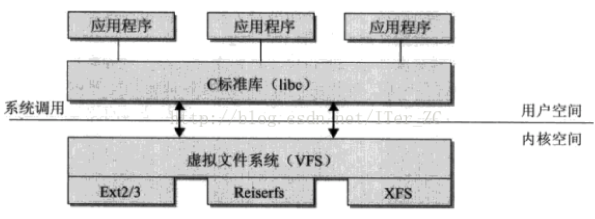

# 5. 持久化机制

所谓持久化机制就是把内存中的数据保存到磁盘上的过程。早期版本有两种持久化方式： RDB 持久化方式和 AOF 持久化方式。但这两种方式均有优劣，所以后来的版本中，redis 综合了两者优缺点，提出了混合持久化方式。

### 5.1. RDB 持久化方式

RDB（**R**edis **D**ata **B**ase），就是某一时刻内存的快照，是一个二进制文件，属于内存紧凑型的文件。所谓 RDB 持久化方式，就是在某一时刻把 redis 内存的快照信息保存成 RDB 文件，并持久化到磁盘的过程。

> 快照是一个非常重要的概念，在一些持久化的场景中应用非常广泛，如 MySQL 中的 MVVC。它出现的目标就是为了持久化内存数据，基本原理是设置一些内存中的指标，这些指标可以用来标识执行持久化时的具体现场。
> 内存中的指标： 比如要某一时刻内存中的数据不在发生变化，我们就可以取这个时刻来表明我们持久化时的现场。

#### 5.1.1. 配置参数有哪些？

配置参数在 redis.conf 配置文件中的 `SNAPSHOTTING` 块。

```c
# 周期性执行条件的设置格式为
save <seconds> <changes>

# 默认的设置为：
save 900 1   # 900s内有1个键发生了变更；
save 300 10  # 300s内有10个键发生了变更；
save 60 10000 # 60s内有10000个键发生了变更；

# 以下设置方式为关闭RDB快照功能
save ""


# 文件名称
# RDB文件在磁盘上的名称。
dbfilename dump.rdb

# 文件保存路径
# 默认设置为“./”，也就是Redis服务的主目录。
dir /home/work/app/redis/data/

# 如果持久化出错，主进程是否停止写入
# 上文提到的在快照进行过程中，主进程照样可以接受客户端的任何写操作的特性，是指在快照操作正常的情况下。
# 如果快照操作出现异常（例如操作系统用户权限不够、磁盘空间写满等等）时，Redis就会禁止写操作。
# 这个特性的主要目的是使运维人员在第一时间就发现Redis的运行错误，并进行解决。
# 一些特定的场景下，您可能需要对这个特性进行配置，这时就可以调整这个参数项。
# 该参数项默认情况下值为yes，如果要关闭这个特性，指定即使出现快照错误Redis一样允许写操作，则可以将该值更改为no。
stop-writes-on-bgsave-error yes

# 是否压缩,该属性将在字符串类型的数据被快照到磁盘文件时，
# 启用LZF压缩算法。Redis官方的建议是请保持该选项设置为yes，因为“it’s almost always a win”。
rdbcompression yes

# 导入时是否检查
# 从RDB快照功能的version 5 版本开始，一个64位的CRC冗余校验编码会被放置在RDB文件的末尾，以便对整个RDB文件的完整性进行验证。
# 这个功能大概会多损失10%左右的性能，但获得了更高的数据可靠性。所以如果您的Redis服务需要追求极致的性能，
# 就可以将这个选项设置为no。
rdbchecksum yes


```

#### 5.1.2. 触发条件有哪些？

> 触发条件： redis 在什么情况下会进行 RDB 备份。

RDB 持久化方式的触发条件主要分为两种，一种是执行特定命令时触发，另一种是达到配置文件中配置的条件时触发。

- 特定的命令：
  - `save` 命令：触发阻塞式持久化方式；即主进程停止读写服务，直到完成持久化过程；
  - `bgsave` 命令：触发非阻塞式持久化方式；即主进程先 fork 一个子进程，之后由 fork 出来的子进程完成持久化过程；
  - `shutdown` 命令：默认情况下，如果没有开启 AOF 持久化的方式，执行此命令时会触发非阻塞式持久化方式；
  - `debug reload` 命令：这个命令会重新加载 redis 的数据，也会触发非阻塞式持久化方式；
  - `flushall` 命令：这个命令会清空 RDB 文件；
- 配置的条件：
  - `save <seconds> <changes>` 参数： 如 `save m n` 表示 m 秒内有 n 个 key 发生了变化，就会自动触 `bgsave` 命令发生成RDB文件；

#### 5.1.3. 持久化原理

Redis 的 RDB 的持久化过程主要有两种方式，一种是**阻塞式持久化方式**，一种是**非阻塞式持久化方式**。
**阻塞式持久化方式**，达到触发条件后，主进程会停止对外服务，然后把内存中的数据全部写入 RDB 文件，在 RDB 文件写入完成之前，主进程不处理任何写入命令。
但是阻塞式持久化方式有个**弊端**，那就是： 如果需要内存中保存的数据很多，那么这个持久化方式就会持续很长时间，这对 redis 的性能造成很大影响，所以后续的版本中又实现了非阻塞式的持久化方式。
**非阻塞式持久化方式**，就是在达到触发条件后，主进程会判断是否存在持久化的子进程，如果不存在，就会先 fork 一个持久化子进程，之后，由这个持久化子进程进行持久化过程，而主进程继续响应客户端的命令。在子进程完成持久化之前，如果碰到写命令，主进程会先把对应的 key 复制一份到缓冲区，然后对这个缓冲区的数据进行写命令的执行。

**非阻塞式持久化方式**的备份过程主要分为三个步骤：

1. **Fork 子进程**： 满足触发条件后，redis 的主进程会 fork 一个复制子进程；如果不存在正在执行的子进程，那么就fork一个新的子进程进行持久化数据，fork过程是阻塞的（这意味着主进程停止对外服务），并且需要备份的数据越多，主进程阻塞的时间越长，fork操作完成后主进程即可执行其他操作；
2. **生成快照**： 复制子进程将内存中的数据保存到一个临时的 RDB 文件中；
3. **替换旧文件**：复制子进程完成 RDB 文件的生成后，会使用新的 RDB 文件替换掉旧的 RDB 文件；

> PS： fork 子进程的过程是阻塞的，阻塞原因是要复制虚拟页表，因此当需要备份的数据量很大时，fork 子进程的过程就会变的很漫长，这对 redis 整体的吞吐性能有很大影响。

其他问题：

1. Q：在非阻塞式持久化方式的备份过程中，如果有新的数据写入，会怎么样？「或者问： 增量数据会如何处理」

  A： Redis 会采用写时复制的方式来保证数据的完整性。假如，在 fork 子进程之前，内存中有 k1v1，fork 子进程之后，客户端需要把 k1v1 变更为： k1v2，那么主进程会在 fork 之后，把 k1v1 复制到一个额外的内存空间上，然后在这个新的内存空间上响应客户端的变更命令，持久化过程完成之后，RDB 文件中保存的是 k1v1，redis 内存中保存的是 k1v2。

  > **写时复制**（**C**opy-**O**n-**W**rite, **COW**）的技术要点就是：主线程在写数据时，会把原来的数据复制一份出来，等到备份完成之后，再把这个数据副本拷贝到新的RDB文件中。

2. Q：如果在 RDB 备份期间发生服务崩溃，会出现什么问题？

  A： 数据没有全部写入 RDB 文件，不算备份完成，会丢失上一次备份到崩溃期间的数据变更。崩溃恢复后，以上一次的 RDB 文件进行内存恢复。

3. save 参数的设置要合理，避免出现「上次备份还未完成，下次备份就又开始了」的“恶性循环备份”问题。

#### 5.1.4. 有什么优缺点？

- 优点
  - 相同数据内容的情况下， RDB 文件占用磁盘空间更小；
  - 进行数据恢复时，RDB 的速度更快；
- 缺点
  - RDB 每次备份时，都是备份全量数据，这就意味着：
    - 如果数据量过大，fork 子进程的过程会很耗时，这对 redis 的整体性能有很大影响；
    - 备份频率【即： save `<seconds>` `<changes>` 参数】很难取舍，频率过大会出现「上次的备份还未完成，下次的备份就开始了」的“恶性循环”问题；频率过小，当两次备份期间发生宕机事件时，会导致数据丢失过多；
  - 这种持久化方式并不能记录数据的变更过程，比如 key1 的值为 value1，之后变更为 value2、value3、value4 等，最后 RDB 中保存的只是最终的值，其过程中的 value1、value2、value3 都不会被记录下来；

### 5.2. AOF 持久化方式

**AOF**（**A**ppend **O**nly **F**ile） 持久化方式，就是把客户端对 redis 的所有变更记录都保存到 AOF 文件中，在进行故障恢复时，只需要对这个 AOF 文件中的每一条记录进行还原执行即可。

#### 5.2.1. 配置参数有哪些？

配置参数为 redis.conf 文件中的 `APPEND ONLY MODE` 部分。具体参数有以下几项：

```c
# 是否开启 AOF，yes 为开启，默认是关闭
appendonly no
 
# AOF持久化的文件名，默认是appendonly.aof
appendfilename "appendonly.aof"

# AOF文件的保存位置和RDB文件的位置相同，都是通过dir参数设置的
dir ./

# 同步策略
# appendfsync always # 同步写回：每个写命令执行完，立马同步地将日志写回磁盘；
appendfsync everysec # 每秒写回：每个写命令执行完，只是先把日志写到 AOF 文件的内存缓冲区，每隔一秒把缓冲区中的内容写入磁盘；
# appendfsync no # 操作系统控制写回：每个写命令执行完，只是先把日志写到 AOF 文件的内存缓冲区，由操作系统决定何时将缓冲区内容写回磁盘。
 
# aof重写期间是否同步
no-appendfsync-on-rewrite no
 
# 重写触发配置
auto-aof-rewrite-percentage 100 # AOF 文件重写的大小比例，默认值是 100，表示 100%，也就是只有当前 AOF 文件，比最后一次的 AOF 文件大一倍时，才会启动 AOF 文件重写。
auto-aof-rewrite-min-size 64mb # 允许 AOF 重写的最小文件容量
 
# 加载aof出错如何处理
# 是否开启启动时加载 AOF 文件效验，默认值是 yes，表示尽可能的加载 AOF 文件，忽略错误部分信息，并启动 Redis 服务。
# 如果值为 no，则表示，停止启动 Redis，用户必须手动修复 AOF 文件才能正常启动 Redis 服务。
aof-load-truncated yes
 
# 文件重写策略
aof-rewrite-incremental-fsync yes

```

#### 5.2.2. 触发条件有哪些？

AOF 持久化方式的触发条件也有两种，一种是达到配置文件中配置的写回策略和重写限制条件，另一种是执行相关命令。

- 配置的触发条件
  - 写回策略： appendfsync 配置项；
  - 重写限制条件：
    - auto-aof-rewrite-percentage 100
    - auto-aof-rewrite-min-size 64mb
- 执行相关命令：
  - bgrewriteaof 命令、bgsave 命令

#### 5.2.3. 持久化原理

Redis 启动后会先判断配置文件中的 appendonly 项是否为 yes，如果为 yes，那么 redis 主进程在响应每一个变更数据的命令时，都会先去变更内存中的数据，之后再在内存中的一块缓冲区中记录变更的命令。我们所说的 AOF 持久化方式，**就是把内存中命令缓冲区的命令写入磁盘文件的过程**。

> PS：这种备份方式采用的是写后日志的方式，所谓写后日志就是：先执行命令，然后再记录命令。这样做的好处是：保证每一个记录下来的命令一定是语法正确的命令。

为了深入了解内存中命令缓冲区写回磁盘文件的过程，我们要先了解一下操作系统的 IO 模型。

> PS： 操作系统的 IO 模型：
> 现代计算机，在实现磁盘文件的读写时，都是采用内核态（内核空间）和用户态（用户空间）的概念。 用户空间对数据所有写入操作，都是通过缓冲区来完成的。
> 如，用户读取磁盘上的某个文件的大概步骤如下：
>
> 1. 用户线程发起读取文件的请求给操作系统；
> 2. 操作系统收到读取请求后，调用磁盘驱动读取文件内容，并把文件内容加载到内核态存储空间中；
> 3. 加载完成后，操作系统会把内核态存储空间的数据内容拷贝到用户空间，供用户线程使用；
>
> 再如，用户要把某个数据写入到文件的大概步骤如下：
>
> 1. 用户线程发起写入文件命令给到操作系统；
> 2. 操作系统接收到写入命令后，会把用户线程对应的用户空间中的数据内容拷贝到内核空间；
> 3. 拷贝完成后，操作系统调用磁盘驱动，把内核空间中的数据写入磁盘文件；



> 如 MySQL 中的 Innodb 存储引擎的 IO 模型：
> 
>
> 这样做的好处：
>
> 1. 操作系统会为每一个需要写入磁盘的上层应用都分配一个缓冲区，这样避免了多个上层应用争抢IO资源的发生；【这有点像Java的内存模型JMM】
> 2. 缓冲区同步到磁盘的过程交由操作系统，方便统一管理；
>
> 写回的频率可以有两种：
>
> 1. 一种方式是：用户的应用程序把写回的请求交给操作系统就算完成写回操作了，至于何时完成内存与磁盘的对齐过程，则完全交由操作系统负责；在 CentOS 和大多数 Linux 系统中，默认情况下内核每 5 秒钟（500 centiseconds）会检查一次并写回脏数据到磁盘。这个频率由 dirty_writeback_centisecs 参数控制，可以通过查看 /proc/sys/vm/dirty_writeback_centisecs 文件来确定当前设置，并根据需要进行调整。
> 2. 另一种方式是：操作系统对齐的过程也暴露出去，相当于提供一个额外的参数，让用户的应用程序来传入这个参数，然后操作系统再根据这个参数的具体含义，来确定何时完成内存和磁盘的对齐；

根据操作系统 IO 模型可知，AOF 的命令缓冲区的数据同步到磁盘文件的频率也应该有至少两种。在 Redis 中，这个频率称为「 **AOF 的写回策略**」，对应于配置文件中的 **appendfsync** 配置项，即这个配置项规定了缓冲区到磁盘文件的同步写回策略，具体值有三个，分别是：

- `appendfsync always`： 这种方式表示「**同步写回**」，意思是：数据变更类的命令执行完，立刻同步到磁盘文件；这种方式可能会产生大量的磁盘 IO，性能较差，但是最可靠，最多只丢失一条数据变更；
- `appendfsync everysec`： 这种方式表示「**每秒写回**」，意思是： 每隔 1s，就把缓冲区的变更命令同步到磁盘文件；这种方式最多丢失 1s 的数据变更；如果允许数据有一点丢失，又希望性能不受太大影响的话，那么就选择 Everysec 策略。
- `appendfsync no`： 这种方式表示「**操作系统控制写回**」，意思是： 把缓冲区到磁盘文件的同步过程交由操作系统自行控制；这种方式性能最高；

#### 5.2.4. 重写原理

随着时间的推移， AOF 文件必然会越来越大。这个时候就需要对 AOF 文件进行瘦身，这个瘦身过程就是 AOF 的重写过程。所谓重写过程就是把多个命令合并成能表示终态的一个命令。

1. 触发条件

  AOF 文件的重写并不是一开始就要重写，而是达到一定触发条件之后才会重写，这个触发条件对应于配置文件中的 `**auto-aof-rewrite-min-size**` 项和 `**auto-aof-rewrite-pencentage**` 项，并且**两个命令同时满足**时才会触发重写。

  - `**auto-aof-rewrite-min-size**` ：重写的最小文件容量，默认是 64，表示 64MB，即 AOF 文件超过64MB时就触发重写
  - `**auto-aof-rewrite-pencentage**` ：重写的大小比例，默认是 100，表示 100% ，即 AOF 文件大小超过了上次重写后文件的 100% （即一倍），就会触发重写
  - 执行了 bgrewriteaof 命令也会触发

2. 具体过程

  达到触发条件后，redis 主线程会 fork 一个 bgrewriteaof 子进程，然后 bgrewriteaof 子进程先生成一个新的文件，把当前 redis 中所有的数据使用最少命令方式保存到新文件中，当所有数据保存完成后， bgrewriteaof 子进程会替换旧的 aof 文件，并把最新的持久化命令追加到 aof 文件中。

其他问题

1. Q： 如果在重写过程中涉及到数据的修改，会怎么样？

  A： 由于重写过程是通过主进程fork一个bgrewriteaof子进程，并由bgrewriteaof子进程来完成重写过程的，因此碰到数据修改时，redis会同时在主进程和bgrewriteaof子进程的缓冲区中写入数据变更，bgrewriteaof子进程完成原有数据的重写过程后，最后把数据变更追加到新的aof文件中。

2. Q： 在重写日志整个过程时，主线程有哪些地方会被阻塞？

  A：

  1. fork子进程时，需要拷贝虚拟页表，会对主线程阻塞。
  2. 主进程有bigkey写入时，操作系统会创建页面的副本，并拷贝原有的数据，会对主线程阻塞。
  3. 子进程重写日志完成后，主进程追加aof重写缓冲区时可能会对主线程阻塞。
  4. 为什么AOF重写不复用原AOF日志？两方面原因：
  5. 父子进程写同一个文件会产生竞争问题，影响父进程的性能。
  6. 如果AOF重写过程中失败了，相当于污染了原本的AOF文件，无法做恢复数据使用

#### 5.2.5. 恢复

如果开启了AOF备份功能，那么redis启动日志中会发现：

DB loaded from append only file......

过程就是读取AOF文件，然后依次执行读到的命令。

- 异常文件处理
  - 问题：
    - 如果服务器发生崩溃或者AOF存储已满时，AOF最后一条命令可能会被截断，造成aof文件异常；
    - 也有可能aof文件中间的几条命令被中断，发生异常；
  - 解决方案
    - 如果配置了 `aof-load-truncated yes` 参数，则会自动忽略最后一条命令后启动
    - 使用 `redis-check-aof` 命令，定位到出现问题的命令后手动修复aof文件
    - 使用 `redis-check-aof --fix` 命令，让redis自动修复aof文件

#### 5.2.6. 有什么优缺点

- 优点
  - AOF 文件的可读性更高一些，并且重写之前记录了 key 的变化过程；
  - 默认的 AOF 持久化策略最多丢失 1s 的数据，保存的数据相对更加完成一些；
- 缺点
  - 相同数据下，AOF 文件要比 RDB 文件大一些；
  - 相同负载下，AOF 方式的性能要比 RDB 稍差；

### 5.3. 混合持久化方式

总结 RDB 和 AOF 两种持久化方式，发现二者各有千秋：RDB 具有快速恢复的特性，而 AOF 可以记录操作命令。于是，Redis 4.0 以后提供了「混合式持久化」方式。这种方式可以综合两种持久化方式的优缺点，颇有些“鱼和熊掌兼得”的意味。

1. 具体的原理是： 内存快照以一定的频率执行，在两次快照之间，使用 AOF 日志记录这期间的所有命令操作；
2. 持久化文件保存的方式是：以 RDB 文件作为 AOF 文件的摘要，记录在 AOF 文件的开头。存到磁盘上的文件的后缀名为 .aof ；
3. 配置参数为： `**aof-use-rdb-preamble yes|no**`，默认是 yes；
4. 触发条件为： 执行 bgrewriteaof 命令，即：重写时，先把数据以RDB的方式写到AOF的开头，之后的数据以命令的形式，再追加到AOF的末尾；

```

 ● 配置参数 
  ○ aof-use-rdb-preamble yes|no
# When rewriting the AOF file, Redis is able to use an RDB preamble in the
# AOF file for faster rewrites and recoveries. When this option is turned
# on the rewritten AOF file is composed of two different stanzas:
#
#   [RDB file][AOF tail]
#
# When loading Redis recognizes that the AOF file starts with the "REDIS"
# string and loads the prefixed RDB file, and continues loading the AOF
# tail.
aof-use-rdb-preamble yes

preamble 
美: [priˈæmb(ə)l] ， 英: [pri'æmb(ə)l]
n.  序言；前言；绪论；导言
v.  作序言[绪论]

```

### 5.4. 持久化方式的最佳实践

Redis 提供了三种持久化方式，在生产实践中具体使用哪一种持久化方式，要根据我们具体的业务需求来确定。下面有一些个人经验：

1. **关注业务需求**：根据业务需求来判断是否需要配置持久化。有一些业务数据只是从数据库中读取到 Redis，目的是利用 Redis 的性能高于数据库的特点，可能并不需要对 Redis 执行写操作，如一些不变的数据字典数据等，此时就可以不用配置持久化机制；
2. **关注 fork 子进程的性能损耗**：合理分配内存资源，控制Redis最大使用内存，防止fork耗时过长，也要避免因为物理内存不足导致 fork 失败；降低fork的频率，比如可以手动来触发RDB生成快照与AOF重写；
3. **关注运行模式**：单机如果部署多个实例，要防止多个机器同时运行持久化、重写操作，防止出现内存、CPU、IO资源竞争，让持久化变为串行；
4. 甚至可以配置自定义的持久化机制；


