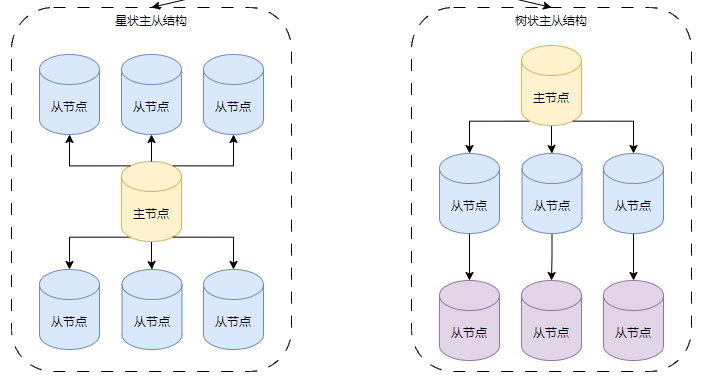
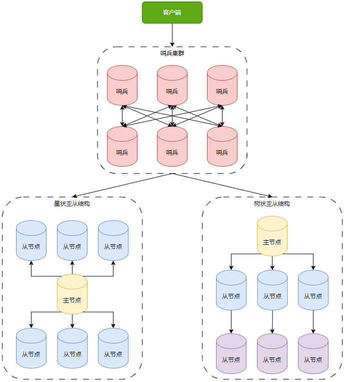
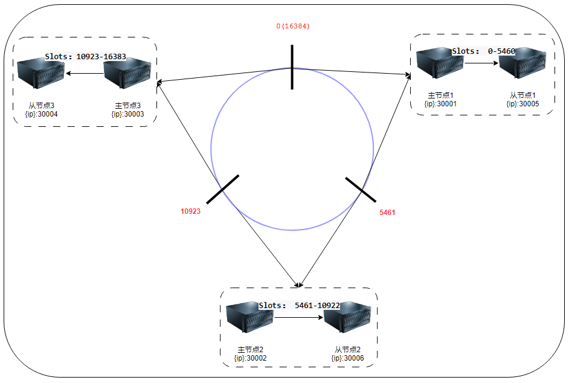
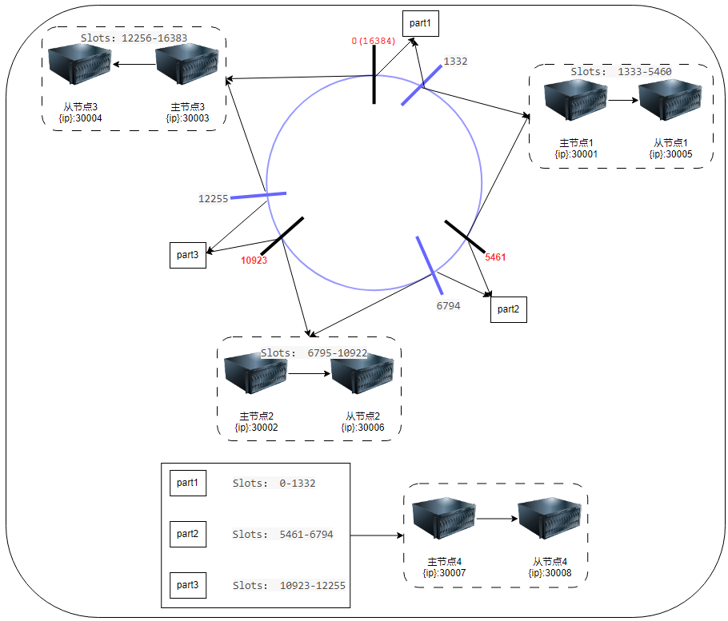

# 6. 运行模式

### 6.1. 单机模式

#### 6.1.1. 安装过程

1. 安装 gcc 编译工具等；
2. 下载源代码；
3. make & make install
4. redis-server redis.conf

事件机制
IO 模型

### 6.2. 主从模式

#### 6.2.1. 安装

- 部署视图



1. 主从结构下，一般也是读写分离的模式，即主节点负责数据的写入和读取，从节点负责数据的读取；当然也可以让从节点也支持写入操作，可以在配置文件中进行设置 `slave-read-only yes|no`；
2. 部署模型大概有两种： **星状拓扑**和**树状拓扑**。即所有的从节点都从一个主节点上复制数据，和只有部分从节点从主节点复制数据，其余从节点再从已经同步完成的从节点复制数据。树状拓扑解决了主节点的复制压力，因为所有从节点从主节点复制时，都会把 RDB 文件赋值给从节点，从节点一多，主节点的压力可想而知。
3. 主从结构下的数据复制分为两种： **全量复制**和**增量复制**
   当第一次复制时，采用是全量复制的方式；
   之后采用的是增量复制的方式；
   为了解决生成 RDB 文件时耗时过多，redis 还提供了无盘复制的方式，即不生成 RDB 文件，在内存缓冲区就把数据通过 socket 发送给从节点了，从配置文件中得知，这种方式目前还处于实验阶段，可以通过 repl-diskless-sync 设置成 yes 或 no 的方式配置，但是默认值是 no，即不开启**无盘赋值**方式；

全量复制的过程：

1. 从节点执行 psync 命令发送给主节点；
2. 主节点把主节点的实例 id 和复制进度标识响应给从节点，之后主节点开始执行 bgsave 命令，生成 RDB 文件；
3. 主节点把生成好的 RDB 文件发送给从节点；
4. 从节点接收到 RDB 文件之后，进行数据恢复； 【注意：从节点加载 RDB 文件期间是不能对外提供服务的】

使用 RDB 而不是 AOF 的原因： RDB 比 AOF 恢复起来快。

增量复制的出现是因为两点：

1. 主节点生成 RDB 文件以及传输 RDB 文件的过程中，并不会停止对外服务，也就是说主节点还有可能会有数据写入；这部分新写入的数据就是增量数据；
2. 从节点完成首次全量同步后，可能会出现网络问题，导致主从失去联系，在从节点失联阶段，主节点也有可能会有数据写入；这部分新写入的数据也是增量数据；

解决增量数据的同步问题： 主节点在执行 bgsave 命令生成 RDB 文件时，也会在内存中生成一个缓冲区，这个缓冲区就记录之后的新的写命令；事实上这个缓冲区是一个环形缓冲区，上面除了保存新的写入命令外，还保存着主从节点的复制标识位；这样两个复制标识位中间的写命令就是需要增量同步的内容。这个缓冲区的大小可以通过 repl-backlog-size 进行设置，默认是 1MB。
但这种环形命令缓冲区还是有问题，如，主节点的复制标识位追上从节点的复制标识位了，那就需要增加这个环形缓冲区的大小；但是加多少依然是个问题，只能通过集群来解决。

主从复制下的问题：

1. **主从数据不一致问题不可避免**。虽然可以通过优化网络、升级硬件资源等手段改进，但依旧不可避免。主从不一致严重时，可以通过让从节点拒绝服务，配置参数为： slave-serve-stale-data yes|no ;
2. **键的过期问题**。3.2 之前客户端很容易从从节点读到过期的数据，3.2 之后在读数据时，从节点会先判断过期时间，解决了这个问题；
3. **主从切换问题**。并没有解决主从角色切换问题，只能通过客户端手动切换。

最佳实践：

1. 优化从节点的角色，比如减少慢查询、不进行持久化等；再比如，把一部分从节点设置为只对外提供读写能力，一部分从节点只提供备份功能等；
2. 使用哨兵模式配合主从模式，提高整体可用性，减少对应用的侵入；

在主从复制期间，从节点与主节点突然断开连接，会出现什么情况？【主从不一致，增量数据通过环形缓冲区记录下来，等到从节点再次重连后，主节点会把环形缓冲区的写命令重新发送给从节点】
当主节点挂掉后会出现什么情况？【停止对外服务】

### 6.3. 哨兵模式



主要目的：

1. 解决主从架构的遗留问题，主要还是用来搞定高可用的需求。
2. 主从架构中没有解决节点异常后无法对外提供服务的问题。

具体一点，有以下几个功能点：

1. **监控** ：监控所配置的主从集群中的节点健康状况；
2. **故障转移** ：当主从节点出现异常时会自动化切换主从点的角色，以保证整个集群的正常运行；
3. **配置** ：简单主从架构在使用时，要在客户端配置所有的节点信息，用了哨兵模式之后，只需要配置哨兵的连接信息即可；
4. **通知** ： 主从节点出现异常时，哨兵负责把异常信息和故障转移后的新信息传给通知到客户端。

哨兵组网

```shell
sentinel monitor `<master-name>` `<ip>` `<redis-port>` `<quorum>`
```

在哨兵的安装的过程中，每个节点中的配置文件中都有一项：`sentinel monitor mymaster 192.168.14.101 6379 2`
这一配置项表明每个哨兵都启动时都要先与主节点进行通信。

事实上，主从结构部署完成之后，主节点会会初始化一个 sentinel:hello 的频道，当哨兵接入主从架构后，哨兵会把自身的连接信息发布到这个频道上，并从这个频道上读取其它的哨兵信息。

总结： 哨兵集群是通过主节点上，名为 sentinel:hello 的频道的发布订阅机制完成各个哨兵节点的信息交互的。

主要作用是配合主从架构使用，主要用来保证高可用性，但是还包括其它特性，比如监控、故障转移、配置中心、消息通知等。

在主从模式中，并没有解决主节点异常而导致的无法对外提供服务时，主从节点切换问题。
主要用来无人值守运维，保证高可用，主要用于主从切换，提高可用性。

- 其它特性？【监控、故障转移、配置中心、消息通知】
- 部署模型（3+3）
- 原理

  - 哨兵组网
  - 监控主库下线【客观下线、主观下线】
  - 故障转移（选出主库）【选出兵王、选出主库、通知客户端、主库再次上线】

- 最佳实践

1. 哨兵模式的部署视图大概是怎样的？
2. 哨兵模式有什么作用？
3. 当节点出现异常时，会出现什么情况？
   1. 要分节点角色到底是哨兵节点还是数据节点？

问题是哨兵也可以监控多个主数据节点，这也是数据节点的集群啊？为什么还需要 cluster 这种集群解决方案呢？ cluster 有分片/槽算法，把请求尽量平均的负载均衡到各个机器。

// TIPS： 这里缺少哨兵切换主从节点的原理和过程；

### 6.4. 集群模式

三种运行模式的对比

- 主从模式主要解决单机模式下无法实现读写分离的问题；
- 哨兵模式主要解决主从模式下无法实现故障快速恢复的问题，也可以理解为哨兵模式主要解决了主从模式下的高可用问题；
- 集群模式主要解决了哨兵模式下无法实现负载均衡的问题，有些说法是集群模式解决了哨兵模式的高可扩的问题，事实上这种说法是不严谨的，因为哨兵模式事实上也是可以完成高可扩的，只需要配置多个 `sentinel monitor <master-name> <ip> <redis-port> <quorum>`即可。哨兵模式的问题在于它监控的每一个主从集群的数据分布不均匀，并且还依赖于使用这种运行模式的 smartClient，而集群模式则解决了哨兵模式下的这两个问题。

---

## 单机模式

## 主从模式

三主三从。

1. 分别在三台主机上安装三个单机版 redis。
2.

## 哨兵模式

1. 安装过程
2. 哨兵节点异常示例

## 集群模式

1. 安装过程
2. 增加节点
3. 减少节点
4. 客户端使用 redis 集群示例
5. 故障转移示例

#### 安装过程

1. 部署模型：3 主 3 从
2. 资源分配：安装到同一台主机上，端口分别为： 主（30001-30003），从（30004-30006）
3. 安装过程

```shell
port ${port}      # 配置端口
daemonize yes     # 以守护进程模式启动
pidfile /var/run/redis_${port}.pid  # pid的存放文件
logfile "redis_${port}.log"   # 日志文件名
dir "/opt/redis/data"   # 存放备份文件以及日志等文件的目录
dbfilename "dump_${port}.rdb" # rdb备份文件名
cluster-enabled yes  # 开启集群功能
cluster-config-file nodes-${port}.conf # 集群配置文件，节点自动维护
cluster-require-full-coverage no # 集群能够运行不需要集群中所有节点都是成功的

```

- 启动六个节点：配置完成后，通过 `./redis-server redis.conf` 命令依次启动这六个节点。
- 创建集群：输入命令 `./redis-cli --cluster create 127.0.0.1:30001 127.0.0.1:30002 127.0.0.1:30003 127.0.0.1:30004 127.0.0.1:30005 127.0.0.1:30006 --cluster-replicas 1`

1. ${password} 表示连接 Redis 的密码，通常整个集群我们要么不设置密码，要么设置成一样的。
2. 后面的六个 ip:port，按照顺序，前面三个是主节点，后面三个是从节点，顺序不能错。
3. 最后数字 1 表示一个主节点只有一个从节点。和前面的配置相对应。

```bash
>>> Performing hash slots allocation on 6 nodes...
Master[0] -> Slots 0 - 5460
Master[1] -> Slots 5461 - 10922
Master[2] -> Slots 10923 - 16383
Adding replica 127.0.0.1:30005 to 127.0.0.1:30001
Adding replica 127.0.0.1:30006 to 127.0.0.1:30002
Adding replica 127.0.0.1:30004 to 127.0.0.1:30003
>>> Trying to optimize slaves allocation for anti-affinity
[WARNING] Some slaves are in the same host as their master
M: bdd1c913f87eacbdfeabc71befd0d06c913c891c 127.0.0.1:30001
   slots:[0-5460] (5461 slots) master
M: bdd1c913f87eacbdfeabc71befd0d06c913c891c 127.0.0.1:30002
   slots:[5461-10922] (5462 slots) master
M: bdd1c913f87eacbdfeabc71befd0d06c913c891c 127.0.0.1:30003
   slots:[10923-16383] (5461 slots) master
S: bdd1c913f87eacbdfeabc71befd0d06c913c891c 127.0.0.1:30004
   replicates bdd1c913f87eacbdfeabc71befd0d06c913c891c
S: bdd1c913f87eacbdfeabc71befd0d06c913c891c 127.0.0.1:30005
   replicates bdd1c913f87eacbdfeabc71befd0d06c913c891c
S: bdd1c913f87eacbdfeabc71befd0d06c913c891c 127.0.0.1:30006
   replicates bdd1c913f87eacbdfeabc71befd0d06c913c891c
Can I set the above configuration? (type 'yes' to accept):  yes
>>> Nodes configuration updated
>>> Assign a different config epoch to each node
>>> Sending CLUSTER MEET messages to join the cluster
Waiting for the cluster to join
....
>>> Performing Cluster Check (using node 127.0.0.1:30001)
M: 887397e6fefe8ad19ea7569e99f5eb8a803e3785 127.0.0.1:30001
   slots:[0-5460] (5461 slots) master
   1 additional replica(s)
S: abec9f98f9c01208ba77346959bc35e8e274b6a3 127.0.0.1:30005
   slots: (0 slots) slave
   replicates 887397e6fefe8ad19ea7569e99f5eb8a803e3785
S: 1a324d828430f61be6eaca7eb2a90728dd5049de 127.0.0.1:30004
   slots: (0 slots) slave
   replicates f5958382af41d4e1f5b0217c1413fe19f390b55f
S: dc0702625743c48c75ea935c87813c4060547cef 127.0.0.1:30006
   slots: (0 slots) slave
   replicates 3da35c40c43b457a113b539259f17e7ed616d13d
M: 3da35c40c43b457a113b539259f17e7ed616d13d 127.0.0.1:30002
   slots:[5461-10922] (5462 slots) master
   1 additional replica(s)
M: f5958382af41d4e1f5b0217c1413fe19f390b55f 127.0.0.1:30003
   slots:[10923-16383] (5461 slots) master
   1 additional replica(s)
[OK] All nodes agree about slots configuration.
>>> Check for open slots...
>>> Check slots coverage...
[OK] All 16384 slots covered.
```

#### 查看集群及节点信息

```bash
$ ./redis-cli -c -p 30001 # 连接到集群

// 查看集群信息
127.0.0.1:30001> cluster info # 查看集群信息
cluster_state:ok # 状态正常
cluster_slots_assigned:16384 # 槽位数
cluster_slots_ok:16384 # 正常的槽位数
cluster_slots_pfail:0
cluster_slots_fail:0
cluster_known_nodes:6 # 集群的节点数
cluster_size:3 # 集群主节点数
cluster_current_epoch:6
cluster_my_epoch:1
cluster_stats_messages_ping_sent:130
cluster_stats_messages_pong_sent:127
cluster_stats_messages_sent:257
cluster_stats_messages_ping_received:122
cluster_stats_messages_pong_received:130
cluster_stats_messages_meet_received:5
cluster_stats_messages_received:257

// 查看节点信息
127.0.0.1:30001> cluster nodes
dc0702625743c48c75ea935c87813c4060547cef 127.0.0.1:30006@40006 slave 3da35c40c43b457a113b539259f17e7ed616d13d 0 1585143789940 6 connected
f5958382af41d4e1f5b0217c1413fe19f390b55f 127.0.0.1:30003@40003 master - 0 1585143791000 3 connected 10923-16383
3da35c40c43b457a113b539259f17e7ed616d13d 127.0.0.1:30002@40002 master - 0 1585143789000 2 connected 5461-10922
abec9f98f9c01208ba77346959bc35e8e274b6a3 127.0.0.1:30005@40005 slave 887397e6fefe8ad19ea7569e99f5eb8a803e3785 0 1585143789000 5 connected
887397e6fefe8ad19ea7569e99f5eb8a803e3785 127.0.0.1:30001@40001 myself,master - 0 1585143786000 1 connected 0-5460
1a324d828430f61be6eaca7eb2a90728dd5049de 127.0.0.1:30004@40004 slave f5958382af41d4e1f5b0217c1413fe19f390b55f 0 1585143791945 4 connected
```

#### 部署视图

根据上面的安装过程，可以获知**主从节点的对应关系**以及**数据槽的分配情况**：

|**主节点**|**数据槽分配情况**|**从节点**|
| 127.0.0.1:30001 <br /> 节点 ID： **887397e6fefe8ad19ea7569e99f5eb8a803e3785** | slots:[**0-5460**] (5461 slots) | 127.0.0.1:30005 <br /> 节点 ID： **abec9f98f9c01208ba77346959bc35e8e274b6a3** |
| 127.0.0.1:30002 <br /> 节点 ID： **3da35c40c43b457a113b539259f17e7ed616d13d** | slots:[**5461-10922**] (5462 slots) | 127.0.0.1:30004 节点 ID： **1a324d828430f61be6eaca7eb2a90728dd5049de** |
| 127.0.0.1:30003 <br /> 节点 ID： **f5958382af41d4e1f5b0217c1413fe19f390b55f** | slots:[**10923-16383**] (5461 slots) |127.0.0.1:30006 <br /> 节点 ID： **dc0702625743c48c75ea935c87813c4060547cef** |

对应的部署视图如下：



#### 增加节点

把某一节点加入集群有两种方式： `cluster meet` 和 `add-node`。

1. 方式一： 在某一节点上执行 `cluster meet {ip}:{port}` 命令，如把 30007 加入集群：

```bash
127.0.0.1:30001> cluster meet 127.0.0.1 30007
OK
127.0.0.1:30001> cluster nodes
dc0702625743c48c75ea935c87813c4060547cef 127.0.0.1:30006@40006 slave 3da35c40c43b457a113b539259f17e7ed616d13d 0 1585142916000 6 connected
df0190853a53d8e078205d0e2fa56046f20362a7 127.0.0.1:30007@40007 master - 0 1585142917740 0 connected
f5958382af41d4e1f5b0217c1413fe19f390b55f 127.0.0.1:30003@40003 master - 0 1585142916738 3 connected 10923-16383
3da35c40c43b457a113b539259f17e7ed616d13d 127.0.0.1:30002@40002 master - 0 1585142913000 2 connected 5461-10922
abec9f98f9c01208ba77346959bc35e8e274b6a3 127.0.0.1:30005@40005 slave 887397e6fefe8ad19ea7569e99f5eb8a803e3785 0 1585142917000 5 connected
887397e6fefe8ad19ea7569e99f5eb8a803e3785 127.0.0.1:30001@40001 myself,master - 0 1585142915000 1 connected 0-5460
1a324d828430f61be6eaca7eb2a90728dd5049de 127.0.0.1:30004@40004 slave f5958382af41d4e1f5b0217c1413fe19f390b55f 0 1585142916000 4 connected
```

可以看出已经把 30007 设置成了 master。

2. 方式二：用 `redis-cli --cluster add-node` 添加节点{ip}:{port} 集群某节点{ip}:{port} 也可以把一个节点添加到集群中。如把 30008 加入集群：

```bash
$ redis-cli --cluster add-node 127.0.0.1:30008 127.0.0.1:30001
>>> Adding node 127.0.0.1:30008 to cluster 127.0.0.1:30001
>>> Performing Cluster Check (using node 127.0.0.1:30001)
M: 887397e6fefe8ad19ea7569e99f5eb8a803e3785 127.0.0.1:30001
   slots:[0-5460] (5461 slots) master
   1 additional replica(s)
S: dc0702625743c48c75ea935c87813c4060547cef 127.0.0.1:30006
   slots: (0 slots) slave
   replicates 3da35c40c43b457a113b539259f17e7ed616d13d
M: df0190853a53d8e078205d0e2fa56046f20362a7 127.0.0.1:30007
   slots: (0 slots) master
M: f5958382af41d4e1f5b0217c1413fe19f390b55f 127.0.0.1:30003
   slots:[10923-16383] (5461 slots) master
   1 additional replica(s)
M: 1d09d26fd755298709efe60278457eaa09cefc26 127.0.0.1:30008
   slots: (0 slots) master
M: 3da35c40c43b457a113b539259f17e7ed616d13d 127.0.0.1:30002
   slots:[5461-10922] (5462 slots) master
   1 additional replica(s)
S: abec9f98f9c01208ba77346959bc35e8e274b6a3 127.0.0.1:30005
   slots: (0 slots) slave
   replicates 887397e6fefe8ad19ea7569e99f5eb8a803e3785
S: 1a324d828430f61be6eaca7eb2a90728dd5049de 127.0.0.1:30004
   slots: (0 slots) slave
   replicates f5958382af41d4e1f5b0217c1413fe19f390b55f
[OK] All nodes agree about slots configuration.
>>> Check for open slots...
>>> Check slots coverage...
[OK] All 16384 slots covered.
[ERR] Node 127.0.0.1:30008 is not empty. Either the node already knows other nodes (check with CLUSTER NODES) or contains some key in database 0.

```

可以看出把 30008 也设置成了 master。

#### 变更节点角色

用 cluster replicate {nodeId} 命令可以把某个主节点变更为另外一个主节点的从节点，例如在 30008 上执行 cluster replicate {nodeId}命令就可以把 30008 设置成 30007 的从节点。

```bash
127.0.0.1:30008> cluster replicate df0190853a53d8e078205d0e2fa56046f20362a7
OK
127.0.0.1:30008> cluster nodes
df0190853a53d8e078205d0e2fa56046f20362a7 127.0.0.1:30007@40007 master - 0 1585147827000 0 connected
abec9f98f9c01208ba77346959bc35e8e274b6a3 127.0.0.1:30005@40005 slave 887397e6fefe8ad19ea7569e99f5eb8a803e3785 0 1585147827000 1 connected
1a324d828430f61be6eaca7eb2a90728dd5049de 127.0.0.1:30004@40004 slave f5958382af41d4e1f5b0217c1413fe19f390b55f 0 1585147823000 3 connected
887397e6fefe8ad19ea7569e99f5eb8a803e3785 127.0.0.1:30001@40001 master - 0 1585147826000 1 connected 0-5460
dc0702625743c48c75ea935c87813c4060547cef 127.0.0.1:30006@40006 slave 3da35c40c43b457a113b539259f17e7ed616d13d 0 1585147826930 2 connected
f5958382af41d4e1f5b0217c1413fe19f390b55f 127.0.0.1:30003@40003 master - 0 1585147826000 3 connected 10923-16383
1d09d26fd755298709efe60278457eaa09cefc26 127.0.0.1:30008@40008 myself,slave df0190853a53d8e078205d0e2fa56046f20362a7 0 1585147823000 7 connected
3da35c40c43b457a113b539259f17e7ed616d13d 127.0.0.1:30002@40002 master - 0 1585147827933 2 connected 5461-10922
```

#### 增加新节点后 rehash

```bash
$ redis-cli --cluster reshard 127.0.0.1:30007
>>> Performing Cluster Check (using node 127.0.0.1:30007)
M: df0190853a53d8e078205d0e2fa56046f20362a7 127.0.0.1:30007
   slots:[0-1332],[5461-6794],[10923-12255] (4000 slots) master
   1 additional replica(s)
S: dc0702625743c48c75ea935c87813c4060547cef 127.0.0.1:30006
   slots: (0 slots) slave
   replicates 3da35c40c43b457a113b539259f17e7ed616d13d
M: 3da35c40c43b457a113b539259f17e7ed616d13d 127.0.0.1:30002
   slots:[6795-10922] (4128 slots) master
   1 additional replica(s)
S: 1a324d828430f61be6eaca7eb2a90728dd5049de 127.0.0.1:30004
   slots: (0 slots) slave
   replicates f5958382af41d4e1f5b0217c1413fe19f390b55f
S: 1d09d26fd755298709efe60278457eaa09cefc26 127.0.0.1:30008
   slots: (0 slots) slave
   replicates df0190853a53d8e078205d0e2fa56046f20362a7
S: abec9f98f9c01208ba77346959bc35e8e274b6a3 127.0.0.1:30005
   slots: (0 slots) slave
   replicates 887397e6fefe8ad19ea7569e99f5eb8a803e3785
M: f5958382af41d4e1f5b0217c1413fe19f390b55f 127.0.0.1:30003
   slots:[12256-16383] (4128 slots) master
   1 additional replica(s)
M: 887397e6fefe8ad19ea7569e99f5eb8a803e3785 127.0.0.1:30001
   slots:[1333-5460] (4128 slots) master
   1 additional replica(s)
[OK] All nodes agree about slots configuration.
>>> Check for open slots...
>>> Check slots coverage...
[OK] All 16384 slots covered.
How many slots do you want to move (from 1 to 16384)? 4000		### 这里输入要从原有的节点中迁移多少槽给30007
What is the receiving node ID? df0190853a53d8e078205d0e2fa56046f20362a7  ### 这里输入 30007 的 nodeid
Please enter all the source node IDs.
  Type 'all' to use all the nodes as source nodes for the hash slots.
  Type 'done' once you entered all the source nodes IDs.
Source node #1: all  ### 这里输入 all， 表示从 30001、 30002、 30003 节点随机抽取

# ......忽略其他
Moving slot 2656 from 887397e6fefe8ad19ea7569e99f5eb8a803e3785
Moving slot 2657 from 887397e6fefe8ad19ea7569e99f5eb8a803e3785
Moving slot 2658 from 887397e6fefe8ad19ea7569e99f5eb8a803e3785
Moving slot 2659 from 887397e6fefe8ad19ea7569e99f5eb8a803e3785
Moving slot 2660 from 887397e6fefe8ad19ea7569e99f5eb8a803e3785
Moving slot 2661 from 887397e6fefe8ad19ea7569e99f5eb8a803e3785
Moving slot 2662 from 887397e6fefe8ad19ea7569e99f5eb8a803e3785
Moving slot 2663 from 887397e6fefe8ad19ea7569e99f5eb8a803e3785
Moving slot 2664 from 887397e6fefe8ad19ea7569e99f5eb8a803e3785
Moving slot 2665 from 887397e6fefe8ad19ea7569e99f5eb8a803e3785
Do you want to proceed with the proposed reshard plan (yes/no)? yes


$ redis-cli -c -p 30001
127.0.0.1:30001> cluster slots # 查看集群槽位信息
1) 1) (integer) 0
   2) (integer) 1332
   3) 1) "127.0.0.1"
      2) (integer) 30007
      3) "df0190853a53d8e078205d0e2fa56046f20362a7"
   4) 1) "127.0.0.1"
      2) (integer) 30008
      3) "1d09d26fd755298709efe60278457eaa09cefc26"
2) 1) (integer) 5461
   2) (integer) 6794
   3) 1) "127.0.0.1"
      2) (integer) 30007
      3) "df0190853a53d8e078205d0e2fa56046f20362a7"
   4) 1) "127.0.0.1"
      2) (integer) 30008
      3) "1d09d26fd755298709efe60278457eaa09cefc26"
3) 1) (integer) 10923
   2) (integer) 12255
   3) 1) "127.0.0.1"
      2) (integer) 30007
      3) "df0190853a53d8e078205d0e2fa56046f20362a7"
   4) 1) "127.0.0.1"
      2) (integer) 30008
      3) "1d09d26fd755298709efe60278457eaa09cefc26"
4) 1) (integer) 12256
   2) (integer) 16383
   3) 1) "127.0.0.1"
      2) (integer) 30003
      3) "f5958382af41d4e1f5b0217c1413fe19f390b55f"
   4) 1) "127.0.0.1"
      2) (integer) 30004
      3) "1a324d828430f61be6eaca7eb2a90728dd5049de"
5) 1) (integer) 6795
   2) (integer) 10922
   3) 1) "127.0.0.1"
      2) (integer) 30002
      3) "3da35c40c43b457a113b539259f17e7ed616d13d"
   4) 1) "127.0.0.1"
      2) (integer) 30006
      3) "dc0702625743c48c75ea935c87813c4060547cef"
6) 1) (integer) 1333
   2) (integer) 5460
   3) 1) "127.0.0.1"
      2) (integer) 30001
      3) "887397e6fefe8ad19ea7569e99f5eb8a803e3785"
   4) 1) "127.0.0.1"
      2) (integer) 30005
      3) "abec9f98f9c01208ba77346959bc35e8e274b6a3"


```

迁移完成之后发现： 30001、 30002、 30003 各迁移了一部分槽给 30007 。 部署视图变成：



#### 移除某节点

使用 cluster forget {nodeId} 命令就可以把一个节点从集群中移除。

```bash
127.0.0.1:30001> cluster forget df0190853a53d8e078205d0e2fa56046f20362a7
OK
```

- [39 实战：Redis 集群模式（上）](https://learn.lianglianglee.com/%e4%b8%93%e6%a0%8f/Redis%20%e6%a0%b8%e5%bf%83%e5%8e%9f%e7%90%86%e4%b8%8e%e5%ae%9e%e6%88%98/39%20%e5%ae%9e%e6%88%98%ef%bc%9aRedis%20%e9%9b%86%e7%be%a4%e6%a8%a1%e5%bc%8f%ef%bc%88%e4%b8%8a%ef%bc%89.md)
