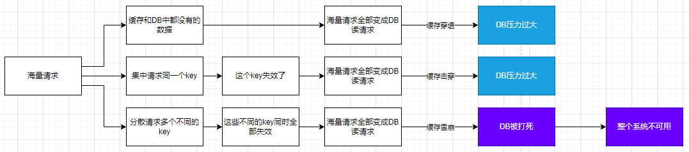
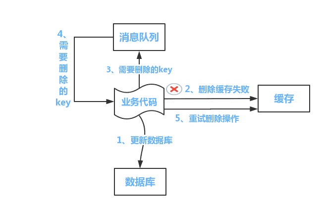

# 8. 生产实践

### 8.1. 生产场景

- 分布式 session
- 分布式锁
- 多级缓存（本地缓存+分布式缓存）
-

### 8.2. 问题及解决

缓存雪崩

缓存击穿

缓存穿透

双写一致性

热 key

大 key

分布式锁

---

待整理

> 分布式系统中会遇到一些问题，但主要问题有：
>
> 1. 缓存击穿
> 2. 缓存穿透
> 3. 缓存雪崩
>
> 出现的具体原因、解决方案、解决方案的分析和比较；项目中举例说明。

参考：

1. [https://pdai.tech/md/db/nosql-redis/db-redis-x-cache.html](https://pdai.tech/md/db/nosql-redis/db-redis-x-cache.html)
2. [https://xiaolincoding.com/redis/cluster/cache_problem.html#%E7%BC%93%E5%AD%98%E9%9B%AA%E5%B4%A9](https://xiaolincoding.com/redis/cluster/cache_problem.html#%E7%BC%93%E5%AD%98%E9%9B%AA%E5%B4%A9)
3. [https://www.cnblogs.com/three-fighter/p/16226366.html](https://www.cnblogs.com/three-fighter/p/16226366.html)
4. [http://www.itsoku.com/course/15/259](http://www.itsoku.com/course/15/259)
5. [https://www.pixelstech.net/article/1586522853-What-is-cache-penetration-cache-breakdown-and-cache-avalanche](https://www.pixelstech.net/article/1586522853-What-is-cache-penetration-cache-breakdown-and-cache-avalanche)
6. [https://learn.lianglianglee.com/%e4%b8%93%e6%a0%8f/300%e5%88%86%e9%92%9f%e5%90%83%e9%80%8f%e5%88%86%e5%b8%83%e5%bc%8f%e7%bc%93%e5%ad%98-%e5%ae%8c/04%20%e7%bc%93%e5%ad%98%e5%a4%b1%e6%95%88%e3%80%81%e7%a9%bf%e9%80%8f%e5%92%8c%e9%9b%aa%e5%b4%a9%e9%97%ae%e9%a2%98%e6%80%8e%e4%b9%88%e5%a4%84%e7%90%86%ef%bc%9f.md](https://learn.lianglianglee.com/%e4%b8%93%e6%a0%8f/300%e5%88%86%e9%92%9f%e5%90%83%e9%80%8f%e5%88%86%e5%b8%83%e5%bc%8f%e7%bc%93%e5%ad%98-%e5%ae%8c/04%20%e7%bc%93%e5%ad%98%e5%a4%b1%e6%95%88%e3%80%81%e7%a9%bf%e9%80%8f%e5%92%8c%e9%9b%aa%e5%b4%a9%e9%97%ae%e9%a2%98%e6%80%8e%e4%b9%88%e5%a4%84%e7%90%86%ef%bc%9f.md)
7. [https://mp.weixin.qq.com/s/f9N13fnyTtnu2D5sKZiu9w](https://mp.weixin.qq.com/s/f9N13fnyTtnu2D5sKZiu9w)

总结如下：

# 缓存击穿

- 经典缓存问题
  - key 竞争
  - db 与缓存双写一致性问题
  - 缓存穿透
  - 缓存击穿
  - 缓存雪崩
  - 缓存预热
  - 缓存降级
  - 热点数据
  - 大 key 打满网卡
  - 单节点负载过高
  - QPS 统计

> 分布式缓存中的七大经典问题

# 1. 缓存失效

## 1.1. 解释

系统由于预热，把一批数据加载到缓存中，但是由于对缓存时间考虑不周，导致后期缓存在某一个时间节点突然集体失效，系统大量请求全部打在数据库上，造成数据库压力过大甚至宕机；

## 1.2. 解决方案

既然缓存实效是因为 key 的失效时间设置的不合理，那么解决这个问题也要从 key 的失效时间下手，我们可以让 key 的失效时间=原定的失效时间+随机时间，这样的话，key 就不会集中失效了。

# 2. 缓存雪崩

## 2.1. 解释

就是由于突然缓存所在机器出现问题（可能是大流量打死其中的 n 个节点、大流量导致网卡异常），导致所有的请求直接打到了 mysql 库上去，造成 mysql 也被瞬间打死。（所谓雪崩就是服务与服务之间造成了**级联故障**，换句话就是一个服务死机导致了另外一个服务扛不住压力也死机了。）

可能的原因：

1. 大量 key 集中过期；
2. Redis 因其自身原因导致故障后宕机；

## 2.2. 处理方案

1. 提高缓存层可用性。比如给 redis 配置高可用+持久化+告警机制等措施；
2. 给 key 的过期时间增加一个随机值，或热点数据干脆不要设置过期时间；
3. 增强应用的服务层能力：比如增加熔断、限流、降级、监控及报警等措施，保证缓存层的故障不会蔓延到其它服务，或即便是蔓延到其它服务也能够快速响应并修复；再比如增加本地缓存的方案，即便是在分布式缓存不能对外提供服务了，本地缓存也能顶上；

中心思想就是防止 redis 被打死+应用程序限流熔断+应用程序提高响应能力，可分为两部分。在缓存部分，redis 需要配置高可用+持久化+告警机制，高可用可以采用主从、哨兵、集群、异地多活等方式，持久化机制可以开启 AOF、RDB、混合模式以便于在故障恢复后快速加载数据，告警机制可以人工提前介入进行动态扩容等；在应用程序部分，可以采用限流+熔断+本地缓存的方案；

# 3. 缓存穿透

## 3.1. 解释

就是多次请求缓存中没有的数据，导致直接查询数据库，导致数据库被打死；

比如说用户表中只有 id 从 1 到 500 的用户信息，但是黑客却要访问 id=1000 的用户信息；再比如说用户访问 id=-1 的用户信息。

## 3.2. 解决方案

- 方案一： 接口层增加校验，这可以过滤一部分非法请求。如用户鉴权校验，id 做基础校验，id<=0 的直接拦截；
- 方案二： 如果从数据库中查询的结果为空，就在缓存中 set 一个值，再加上一个过期时间，这样就可以把请求拦截到缓存上，从而避免数据库被打死；但这种方式也有另外一个问题就是 key 如果很多，就会造成缓存的命中率下降，这时我们要定期清理 key，或者将这些非法的 key 存入一个独立的公共缓存中，每次查询时先查询主缓存，如果不存在就查询独立缓存，再不存在就查询数据库，如果 mysql 返回结果为空，就把 kv 设置到独立缓存中，否则就放到主缓存中；
- 方案三： 使用 Bloomfilter 来缓存全量的 key，利用了 Bloomfilter 的位图数据结构特性，如果为 ture，就一定存在，如果为 false，不一定存在的特性；不过 key 的数量级要控制在 10 亿以内，大概占用 1.2g 缓存，又因为 key 越多误判率越高，因此还要定期清理 key；

# 4. 缓存击穿

## 4.1. 解释

击穿的意思有点像在一道屏障上穿了一个孔。就是某一个 key 的访问非常频繁，但是某一个时刻，这个 key 突然失效，导致获取这个 key 的请求直接穿过缓存请求到数据库。

## 4.2. 处理方案

中心思想是对热点 key 的处理。

1. 针对基本不会发生更新的场景，可以把 key 设置为永不过期，让 key 常驻缓存；
2. 针对偶尔需要更新的场景，可以对请求代码使用分布式互斥锁，是的少部分直接请求请求数据库后更新缓存，而剩余的其他请求直接使用新缓存即可，或者采用本地互斥锁保证仅有少量请求能够更新缓存，其余请求访问新缓存；
3. 针对需要频繁更新的场景，可以使用额外的补偿程序来定时刷新缓存或者延长 key 的实效时间；

# 5. 双写一致性？

## 5.1. 解释

在使用缓存时，往往是数据库中保存着一份数据，而缓存中也保存着一份数据，这就涉及到数据库与缓存中数据的一致性问题

## 5.2. 处理方案

原因： 数据需要更新，会导致缓存与 db 中数据不一致。
解决： 读操作没多大问题，一般都是先去缓存中读，读到就直接返回；读不到就去查 db，查到就回写到缓存，最后返回。
更新操作问题比较大，一般情况下，我们要保证 db 更新操作的成功（这是保证数据不丢失）。所以这个时候产生两个问题：

1. 缓存如何处理？是更新还是直接删除？
2. 如果直接删除，是先删除缓存还是先更新 db？

第一个问题：直接删除。理由 1：存在“某些 key 可能多次更新后才会有一次查询”，也存在“某些 key 更新之后很久都不会有一次查询”的业务场景，如果更新缓存，在这两种情况下，更新缓存的收益不大；理由 2：更新操作的性能损耗要远大于删除的性能损耗，因为更新操作要先定位到 key，之后执行更新，而删除操作在定位到 key 之后直接删除即可。

第二个问题，
如果先删缓存再更新 db，会出现在某一个请求删除缓存成功后，更新 db 之前，又有一些请求过来，查询了数据库中的脏数据，并把脏数据回写到缓存中了。这个时候可以采用延时双删的策略，也就是先删除缓存，之后更新 db，延时一段时间后再执行一下缓存的删除。但这种方式依旧存在问题，延时时间范围内还会产生不一致问题。
如果先更新 db 再删除缓存，会出现删除缓存失败的问题，缓存中依旧是脏数据。还有另外一种情况，先是一个读请求没有命中缓存，然后去 db 中查找，再回写之前，写请求更新了 db，此时，读请求回写的就是脏数据。事实上，第二种 case 很少出现，因为写 db 操作很耗时，还有可能会锁表，而读请求回写缓存很快，极有可能读请求回写之后，缓存又被写请求删除了。

现在解决第一种情况，第一种方式是利用消息的事务和持久化机制，在写请求更新完 db 之后，给消息队列里面发送一个删除缓存的消息，这样一定可以保证删除缓存的成功；第二种方式是引入阿里的 canal 组件，它能监听 db 的 binlog 变更，并删除缓存，但这种方案增加了系统复杂度的问题，也存在过度设计的嫌疑；第三种方式是给缓存设置一个 TTL，在 TTL 内可能会短暂不一致，但之后就是一致的新数据了，这种方式最简单有效，可以当作兜底方案。

我们对这个问题升维。既然不管怎样，都会有不一致的问题，那么我们干脆就以缓存为主，我们单独写一个服务，让这个服务对外提供操作缓存的接口，屏蔽对缓存和 db 的操作细节。在读请求时，先去缓存中读，读不到再去 db 中去读，读到之后回写到缓存，然后返回。在写请求时，先去看看是否命中缓存，如果命中，就先更新缓存再更新 db；如果没有命中，就只更新 db。或者再对这种方案迭代，在写请求时，不管是否命中缓存，都只更新缓存，然后写一个补偿程序，定期把缓存中的数据回写到 db 中。这种两种都是把缓存当数据库来用，可以用到强一致性的业务场景中，但同时要配合 redis 的高可用机制使用，比如要配置 redis 的集群模式和持久化机制，同时也要关注数据有可能丢失的极限业务场景。

如何选择？更新后删除+设置 TTL 基本上可以覆盖大部分应用场景。其它的要根据具体业务场景具体分析，不存在最佳实践。

> 以上，250520 更新。

- 方案一： 使用 Cache Aside 模式，就是在读缓存的时候，先读缓存，如果缓存中没有读到，那就读数据库，然后把读到的数据再放入缓存中，最后返回响应；更新操作时，就先更新数据库，然后再删除缓存；【更新操作是有问题的，下面会讲到】；
  - 优缺点： 这种方案使用了懒加载的思想，适用于数据一致性要求较高的业务场景，或者缓存更新较为复杂的业务场景； 但是这种方案需要同时关注 cache 和 db 的数据变更，有些繁琐；
  - 更新操作为什么是删除缓存而不是更新缓存？
    - 1. 从两个操作的性能损耗上看，更新操作的性能损耗一定大于删除的性能损耗，因为更新要先定位到某一个 key，然后再进行更新，而删除操作则是在定位到 key 之后，直接删除即可；
    - 2. 存在“更新之后很久也不需要查询”的场景和“多次更新之后才有可能查询一次”的场景，这种情况下每次都更新就没有意义了；
    - ~~这里涉及到懒加载的思想，事实上，更新缓存的性能损耗要大于删除缓存的性能损耗，如果读操作不多，那每次都要更新缓存所带来的性能损耗一定大于删除缓存的性能损耗，让第一次读操作从数据库中获取数据后更新缓存，之后所有的读操作直接请求缓存，性能损耗就会大幅度下降~~；
  - 如果更新操作时，先更新数据库，然后删除缓存，如果缓存删除失败呢？
    - 这同样会造成缓存与数据库不一致。解决办法就是先删除缓存，然后更新数据库。这样读操作时，如果缓存为空，就去读数据库，然后更新缓存，虽然读到的数据是旧数据，但是缓存更新后也是旧数据，就保证缓存与数据库一致了。
  - 如果更新操作时，瞬间有大量请求发送过来，会造成什么情况？仍然会造成缓存与数据库不一致问题。
    - 因为一个更新请求过来，我们先执行删除缓存，然后更新数据库，但是在删除缓存之后还没有来得及更新数据库，另一个读请求也过来了，然后它发现缓存中没有数据，它就先去数据库中读取数据然后再更新到缓存，这时之前的更新请求再更新数据库，此时缓存和数据库不一致了【这个问题的本质原因是高并发请求和更新单个 key】。解决方案是： 可以根据 key 的唯一性标识把相同参数的请求路由到同一台机器上，然后创建 JVM 内部队列，使更新操作放入一个队列，读操作也放入一个队列。目的是 hang 住读操作一些时间，等更新操作完成之后再进行读操作。但这种方式有可能会造成读操作的时间过长并且还有可能会造成某个单台机器负载过高的情况，这个时候要严格执行性能测试，一方面要看一下这种方式下读操作请求时长是否是可以忍受的，如果不可忍受，那就只能加机器；但单台机器负载过高的情况不可避免；
- 方案二： 使用 Read/Write Through 模式，就是提供一个存储服务，查询数据和修改数据都通过这个服务来完成，这样可以屏蔽对数据的访问细节，在存储服务内部，针对查询数据的操作，可以直接去 cache 中查询，如果不存在就去 db 中查询，然后回种到 cache 中后返回，针对写数据的操作，先去查询 cache，如果 key 存在，就更新缓存再更新 db，如果缓存中 key 不存在就只更新 db；
  - 优缺点： 这种方案使用起来更加方便，因为它提供了一套操作 cache 和 db 的 API，等同于封装了 cache 和 db 的操作细节，使业务系统不必关注 cache 和 db 的读写操作实现；此外，由于同样适用了懒加载方式，使得这种方式也适用于数据有冷热区分的业务场景；
  - 更新操作是怎么实现的？
    - 是通过 cas 算法实现的，这样利用了算法锁的方式避免了高并发带来的问题；
- 方案三： 使用 Write Behind Caching 模式，这种模式跟 方案二 模式差不多，都是提供了一个存储服务，封装对 cache 和 db 的操作细节，让外部业务系统无感知的访问缓存。在其内部，读操作的实现原理与 方案二 是一样的，同样是先去 cache 中读，如果 cache 中不存在，就去 db 中读取，然后回种到 cache 后返回；与方案二不同的是更新操作的实现原理， 这种方案的更新操作是只更新 cache，并提供异步批量的方案来根据 cache 来更新 db；
  - 优缺点： 这种方案的写性能是最大的，但是数据不一致性发生的几率最大，极端场景下可能会丢失数据，因此这种方案适合写合并的场景，比如微博的点赞数量，如果采用方案二，那势必是点赞一次就需要写 db 一次，这对 db 是很大压力的，在方案三中，可以点赞到 1w 后再写 db，这样 db 压力就大大减小了；
  - 如何选择？
    - 高性能与强一致性本来就不可兼得，不同模式的选择就是针对高并发与强一致性的取舍；
    - 不存在最佳方案，只有最符合业务场景的方案；

# 6. 热点 key

## 6.1. 解释

某些业务在某一瞬间或某一时间段内可能会成为热点业务，热点业务的数据可能会产生热点 key，比如微博上热榜数据；

## 6.2. 方案

先找出哪些 key 是热点 key，可以通过 spark 的流计算或 Hadoop 的批处理来得出热点 key，然后中心思想就是把这些热点 key 打散到不同的节点中以应付高并发请求；总的实现方案有加入二级缓存和加冗余节点，这个问题的关键在于如何发现热点 key，4.0 之后，可以使用 redis-cli --hotkeys 命令获取；业内著名处理方案有[有赞透明多级缓存解决方案（TMC）](https://tech.youzan.com/tmc/)

# 7. 大 key

## 7.1. 解释

缓存中某些 key 的 value 的值过大，导致写操作超时、加载速度缓慢等问题；

## 7.2. 方案

主要的处理思路是先找出哪些 key 是大 key，然后再对大 key 进行操作；

- 如何找到大 key？
  - 使用报警机制可以查看带宽与 qps 的关系，来判断是否有大 key 产生；
  - 利用 redis-cli --bigkeys 命令可以异步获取大 key
  - 使用 redis-rdb-tools 离线分析工具来扫描 RDB 持久化文件
- 找到大 key 后如何处理大 key？
  - 可删除：
    - 小于 4.0， 使用 scan 命令扫描出 key 后进行删除
    - 大于 4.0， 使用 UNLINK 命令异步删除
  - 不可删除：
    - value 是 string，比较难拆分，则使用序列化、压缩算法将 key 的大小控制在合理范围内，但是序列化和反序列化都会带来更多时间上的消耗； 如果压缩之后仍然是大 key，则需要进行拆分，一个大 key 分为不同的部分，记录每个部分的 key，使用 multiget 等操作实现事务读取；
    - value 是 list/set 等集合类型时，根据预估的数据规模来进行分片，不同的元素计算后分到不同的片；
