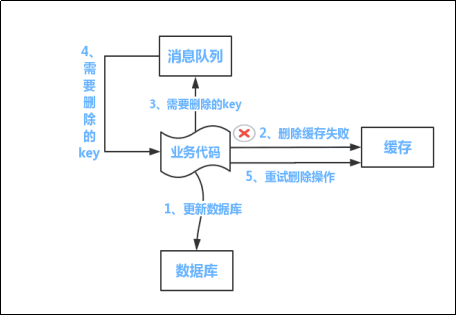
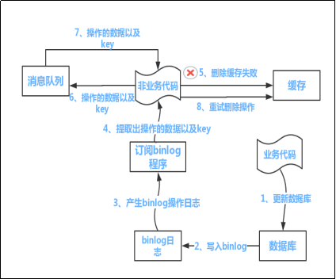

## 数据存储

Key 的数据类型（基础数据类型、高级特性）
Value 的数据结构

## 内存管理策略

键的驱逐、内存的回收

## 持久化机制（AOF、RDB、混合模式）

AOF（实现原理、配置项、重写的触发条件及原理）
RDB（实现原理、配置项及触发）
对比
混合使用
生产实践

## 运行模式（主从、哨兵、集群）

### 主从

好处
部署模型（一主一从、一主多从、树状）
复制原理（全量复制和增量复制）
缺点

### 哨兵

部署模型
工作原理（监控、主观下线和客观下线、主哨兵选举、故障转移（即主节点选取））

### 集群

核心原理（虚拟槽）
前置知识点： 数据分区的 3 种常见方式
集群创建的过程
故障转移的过程

## 缓存经典问题

### 缓存击穿

同一时间，大量请求同时访问同一个 key，但是这个 key 突然之间失效了，导致流量直接打到数据库上，造成数据库访问压力陡升。

解决：针对不同的业务场景，采用不同的处理方式。

- 针对不需要更新的数据，可以把 key 设置为永不过期；
- 针对偶尔需要更新的，可以对更新代码进行加锁更新，保证有一部分更新操作可以到达 db，这部分更新操作会把数据回写到缓存，其它请求又可以使用缓存；
- 针对需要经常更新的，可以添加补偿程序，补偿程序会定期把数据从 db 回写到缓存。

### 缓存穿透

查询不存在的数据，由于数据不存在，请求就直接打到数据库了。某种意义上，算是缓存的一个漏洞。比如前端请求了一个 id=-1 的用户信息。

解决：核心思想就两个，

1. 把请求到的空值也放到缓存中，或者给缓存进行划分，把正常缓存和非法的空值缓存分开放置，先从正常缓存中查询，如果查询不到就去空值缓存中去查；
2. 使用布隆过滤器。这种数据结构可以缓存全量的 key，它实际上使用了多个 hash 函数和位图的思想，可以使用少量的存储空间存储大量的二元制数据。

### 缓存雪崩

雪崩是说一个应用出现了问题导致了不可用，之后不可用蔓延到其它相关联的应用上，最终产生一个服务不可用其它服务也不可用的问题，也就是级联故障。

原因可能有两大类：

1. 大量 key 集中失效；
2. redis 自身某些问题导致不可用（如 rehash 进行数据迁移时，请求集中打到某一节点，导致节点不可用）；

解决：

1. 提高缓存可用性（如使用集群模式+可持久化+报警机制）；
2. 给 key 的过期时间增加一个随机值，让 key 不集中过期；
3. 给应用层增加能力（如限流、熔断、降级+监控及告警；再如给应用层增加本地缓存）；

### 数据不一致

原因： 数据需要更新，会导致缓存与 db 中数据不一致。
解决： 读操作没多大问题，一般都是先去缓存中读，读到就直接返回；读不到就去查 db，查到就回写到缓存，最后返回。

更新操作问题比较大，一般情况下，我们要保证 db 更新操作的成功（这是保证数据不丢失）。所以这个时候产生两个问题：

1. 缓存如何处理？是更新还是直接删除？
2. 如果直接删除，是先删除缓存还是先更新 db？

第一个问题：直接删除。理由 1：存在“某些 key 可能多次更新后才会有一次查询”，也存在“某些 key 更新之后很久都不会有一次查询”的业务场景，如果更新缓存，在这两种情况下，更新缓存的收益不大；理由 2：更新操作的性能损耗要远大于删除的性能损耗，因为更新操作要先定位到 key，之后执行更新，而删除操作在定位到 key 之后直接删除即可。

第二个问题，

如果先删缓存再更新 db，会出现在某一个请求删除缓存成功后，更新 db 之前，又有一些请求过来，查询了数据库中的脏数据，并把脏数据回写到缓存中了。这个时候可以采用延时双删的策略，也就是先删除缓存，之后更新 db，延时一段时间后再执行一下缓存的删除。但这种方式依旧存在问题，延时时间范围内还会产生不一致问题。

如果先更新 db 再删除缓存，会出现删除缓存失败的问题，缓存中依旧是脏数据。还有另外一种情况，先是一个读请求没有命中缓存，然后去 db 中查找，再回写之前，写请求更新了 db，此时，读请求回写的就是脏数据。事实上，第二种 case 很少出现，因为写 db 操作很耗时，还有可能会锁表，而读请求回写缓存很快，极有可能读请求回写之后，缓存又被写请求删除了。

现在解决第一种情况，第一种方式是利用消息的事务和持久化机制，在写请求更新完 db 之后，给消息队列里面发送一个删除缓存的消息，这样一定可以保证删除缓存的成功；第二种方式是引入阿里的 canal 组件，它能监听 db 的 binlog 变更，并删除缓存，但这种方案增加了系统复杂度的问题，也存在过度设计的嫌疑；第三种方式是给缓存设置一个 TTL，在 TTL 内可能会短暂不一致，但之后就是一致的新数据了，这种方式最简单有效，可以当作兜底方案。

我们对这个问题升维。既然不管怎样，都会有不一致的问题，那么我们干脆就以缓存为主，我们单独写一个服务，让这个服务对外提供操作缓存的接口，屏蔽对缓存和 db 的操作细节。在读请求时，先去缓存中读，读不到再去 db 中去读，读到之后回写到缓存，然后返回。在写请求时，先去看看是否命中缓存，如果命中，就先更新缓存再更新 db；如果没有命中，就只更新 db。或者再对这种方案迭代，在写请求时，不管是否命中缓存，都只更新缓存，然后写一个补偿程序，定期把缓存中的数据回写到 db 中。这种两种都是把缓存当数据库来用，可以用到强一致性的业务场景中，但同时要配合 redis 的高可用机制使用，比如要配置 redis 的集群模式和持久化机制，同时也要关注数据有可能丢失的极限业务场景。

如何选择？更新后删除+设置 TTL 基本上可以覆盖大部分应用场景。其它的要根据具体业务场景具体分析，不存在最佳实践。
