## 1. API 架构风格对比：SOAP vs REST vs GraphQL vs RPC

- [ ] TODO ： API 架构风格

- [Comparing API Architectural Styles: SOAP vs REST vs GraphQL vs RPC](https://www.altexsoft.com/blog/soap-vs-rest-vs-graphql-vs-rpc/)
- 翻译版： [API 架构风格对比：SOAP vs REST vs GraphQL vs RPC](https://www.cnblogs.com/charlieroro/p/14570214.html)
- [SOAP vs REST vs gRPC vs GraphQL](https://dev.to/andreidascalu/soap-vs-rest-vs-grpc-vs-graphql-1ib6)
- [SOAP vs REST vs GraphQL vs RPC](https://blog.bytebytego.com/p/soap-vs-rest-vs-graphql-vs-rpc)
- [RESTful API 设计指南](https://www.ruanyifeng.com/blog/2014/05/restful_api.html)
- [HTTP 请求向服务器传参方式](https://www.cnblogs.com/wwr3569/p/14295779.html)

1. 从历史发展的角度来说 API 架构风格的迭代过程；主要分析每一种架构风格的优缺点
2. 结合 HTTP 相关知识，着重介绍 RESTFul 风格的最佳实践经验，以及业内一些软件的实践应用等【ES】；
3. API 的其它内容：接口的幂等性保证、接口安全、接口文档的管理、接口限流（单体+分布式）；

HTTP 报文格式
RPC RMI WebSocket
postman 中的传参方式与 HTTP 传参方式的对应关系；【curl 与 idea 中的 api 测试窗口】
HTTPClient 的简单用法
Spring 框架中是如何接收参数的；
**RESTful API** vs **SOAP** vs **XML-RPC**

最近一段时间关于 GraphQL 的讨论很多，一些项目中也相继用到了这种风格，但使用是否合理，是否存在杀鸡用牛刀这样的问题，还有待商榷。

译自：[Comparing API Architectural Styles: SOAP vs REST vs GraphQL vs RPC](https://levelup.gitconnected.com/comparing-api-architectural-styles-soap-vs-rest-vs-graphql-vs-rpc-84a3720adefa)

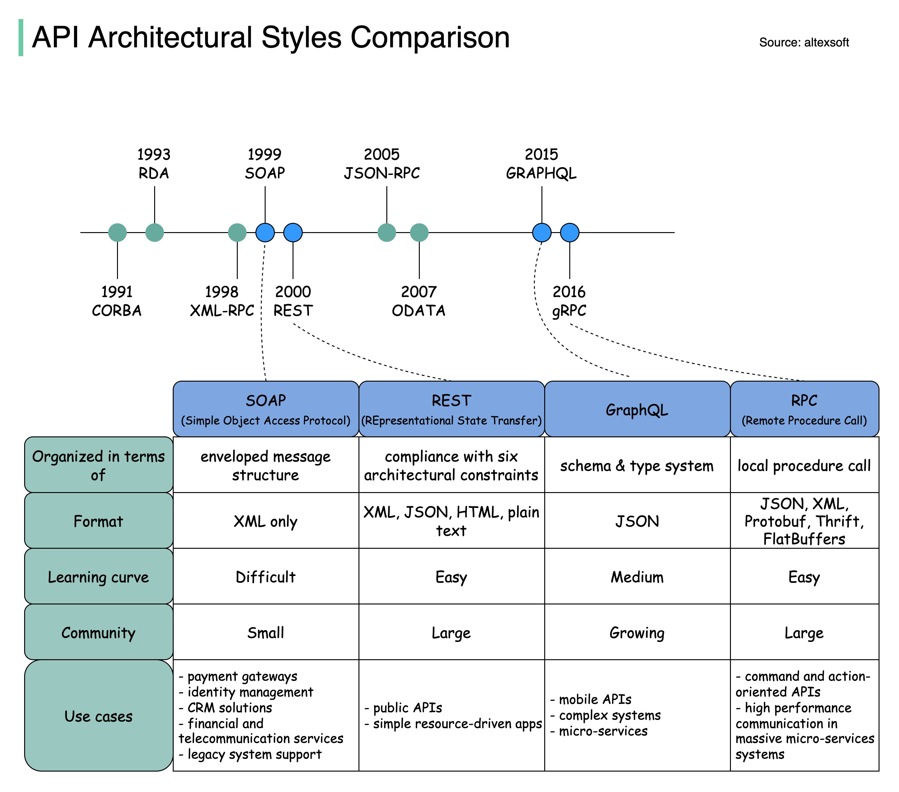

两个不同的应用需要一个中间程序才能互通，开发者通常会使用应用程序接口(API)进行搭桥，使一个系统能够访问另一个系统的信息或功能。

为了在扩容时快速集成应用，实际的 API 会使用协议或规范来定义消息传递的语义和语法。这些规范构成了 API 架构。

过去几年曾出现了几种不同的 API 架构风格，每种风格都有其特定的标准数据交互模式。而对 API 架构的选择引起了无休止的讨论。

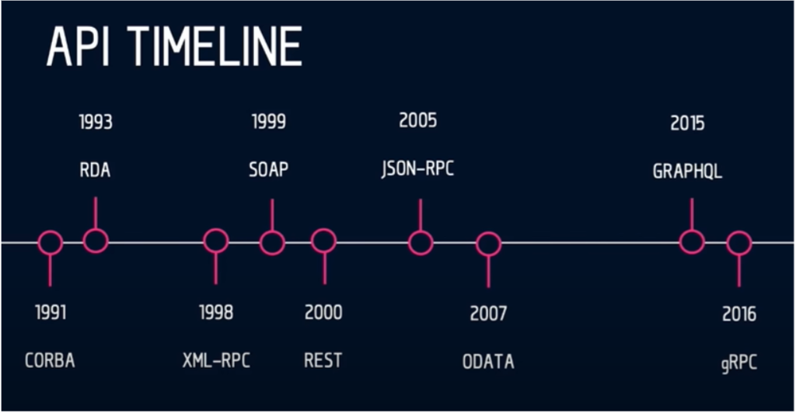

现在，很多 API 用户放弃 REST，并拥抱 GraphQL。而在十年之前，对于 REST 来说则是相反的情况，在于 SOAP 的竞争中，REST 大获全胜。这种观念的问题在于用于单方面去选择一个技术，而没有考虑实际价值以及以与特定场景的匹配度。

本文将会按照 API 风格出现的顺序对它们进行讨论，对比各自的优劣势，并给出各自适合的场景。


### 1.1. Remote Procedure Call (RPC):唤醒另一个系统的功能

RPC 是一个规范，它允许在一个不同的上下文中远程执行功能。RPC 将本地程序调用扩展到了 HTTP API 的上下文中(_RPC 的最上层大部分都是 HTTP_)。
一开始的 XML-RPC 问题比较多，它很难保证 XML 载体的数据类型。后来出现了一个基于[JSON-RPC](https://www.jsonrpc.org/)的 RPC API，由于 JSON 的规范更加具体，因此被认为是 SOAP 的替代品。 [gRPC](https://grpc.io/)是一个谷歌在 2015 年开发的全新 RPC 版本，插件化支持负载均衡、跟踪、健康检查以及身份认证等，gRPC 非常适用于微服务间的通信。

#### 1.1.1. RPC 如何工作

客户端唤醒远端程序，序列化参数，并在消息中添加额外的信息，然后将消息发送给服务端。在接收到客户端的消息后，服务端会反序列化消息中的内容，执行请求的操作，并将结果返回给客户端。服务端存根(stub)和客户端存根(stub)负责参数的序列化和反序列化。

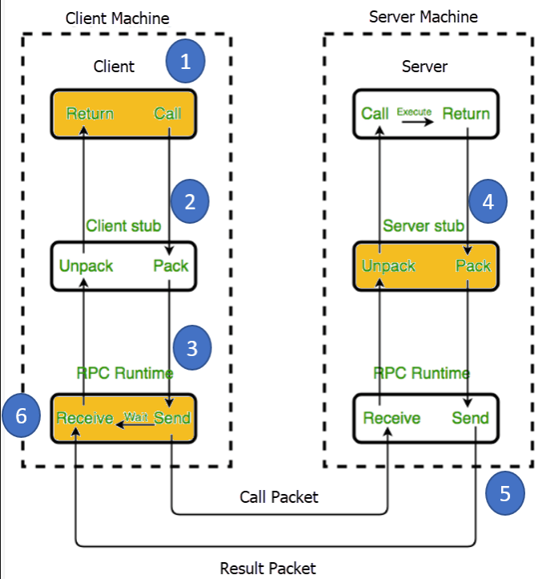

#### 1.1.2. RPC 的优点

- **直接简单的交互方式**：RPC 使用 GET 获取信息，并使用 POST 处理其他功能。服务端和客户端的交互归结为对后端的调用，并获取响应结果。
- **方便添加功能**：如果我们对 API 有新的需求，可以通过简单地添加新的后端来满足该需求：1）编写一个新的功能，然后发布；2）然后客户端就可以通过这个后端来满足需求。
- **高性能**：轻量载体提升了网络传输的性能，这对于共享服务器以及在网络上进行并行计算的工作站来说非常重要。RCP 可以优化网络层，使其可以每天在不同的服务间发送大量消息。

#### 1.1.3. RPC 的缺点

- **与底层系统的强耦合**：API 的抽象程度与其可复用性相关。与底层系统的耦合越高，API 的可复用性就越低。RPC 与底层系统的强耦合使其无法在系统和外部 API 之间进行抽象，同时也增加了安全风险，很容易在 API 中泄露底层系统的实现细节。RPC 的强耦合使其很难实现需求扩展和团队解耦，客户要么会担心调用特定后端可能带来的副作用(_如安全问题_)，要么会因为无法理解服务端的功能命名规则而不知道调用哪个后端。

> 这里说的"与底层系统"的耦合，并不是说与内核等底层实现之间的耦合，而是与底层服务的耦合，如与日志服务，鉴权服务等耦合。

- **可发现性低**：RPC 无法对 API 进行自省或无法通过发送的 RPC 请求来理解其调用的功能。

> 应该是 RPC 并没有像 REST API 那样相对严格的调用规范，因此有些调用会比较难以理解

- **功能爆炸**：由于很容易添加新的功能，因此相比编辑现有的功能，新增的功能可能会导致大量功能重叠，也很难去理解。

#### 1.1.4. RPC 使用场景

RPC 模式始于 80 年代，但它一直没有过时。像 Google，Facebook ([Apache Thrift](https://thrift.apache.org/))和 Twitch([Twirp](https://twitchtv.github.io/twirp/docs/intro.html)) 这样的大型公司利用 RPC 的高性能特性来获得高性能、低开销的消息处理能力(规模庞大的微服务使用短消息进行通信，需要保证通信的畅通)。

- **命令式 API**：RPC 非常适合向远端系统发送命令。例如，Slack API 就是重命令的接口：加入频道、离开频道、发送消息等。因此 Slack API 的设计者可以使用 RPC 风格的模型，使功能更简单、紧凑，也更方便使用。
- **用于内部微服务客户 API**：在整合单个供应商和用户时，我们不希望(像 REST API 那样)花费大量时间来传输元数据。凭借高消息速率和消息性能，gRPC 和 Twirp 是微服务使用 RPC 的典范。gRPC 背后使用的是 HTTP 2，因此能够优化网络层，每天可以在不同的服务间传送大量消息。但如果不关心高性能网络，转而期望团队间能够使用稳定的 API 来发布不同的微服务，那么可以选择使用 REST。

### 1.2. Simple Objects Access Protocol (SOAP): 让数据作为服务

[SOAP](https://www.altexsoft.com/blog/engineering/what-is-soap-formats-protocols-message-structure-and-how-soap-is-different-from-rest/?utm_source=MediumCom&utm_medium=referral&utm_campaign=shared#soap-use-cases)是一种 XML 格式的，高度标准化的 web 通信协议。在 XML-RPC 面世一年之后，Microsoft 发布了 SOAP，SOAP 继承了 XML-RPC 的很多特性。而后出现了 REST，二者并驾齐驱，但很快 REST 就后来居上。

#### 1.2.1. SOAP 如何工作

XML 数据格式多种多样，加上大量消息结构，使得 SOAP 称为一种最冗长的 API 样式。

一个 SOAP 消息包含：

- 每个消息的开始和结束都要包含一个信封标签
- 包含请求或响应的消息体
- 标头(如果消息必须确定某些具体要求或额外要求)
- 请求过程中的错误信息

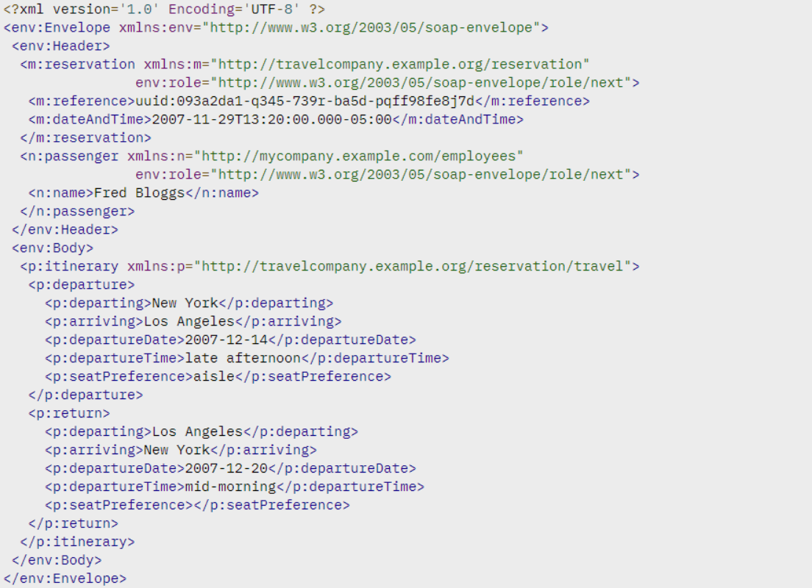

SOAP API 的逻辑是用 Web 服务描述语言(WSDL)编写的，该 API 描述语言定义了后端并描述了可执行的流程。它允许使用不同的编程语言和 IDEs 快速配置通信。

SOAP 同时支持有状态和无状态消息。在有状态场景中，服务端会保存接收到的信息，该过程可能比较繁重，但对于涉及多方和复杂交易的操作来说是合理的。

#### 1.2.2. SOAP 的优点

- **语言和平台无关**： 支持创建基于 Web 的服务内置功能使 SOAP 能够处理独立于语言和平台的通信，并作出响应。
- **适用于各种传输协议**：SOAP 支持大量传输协议，可以用于多种场景。
- **内置错误处理**： SOAP API 规范可以返回 Retry XML 消息(携带错误码和错误解释)
- **大量安全扩展**： 集成了 WS-Security，SOAP 符合企业级事务质量。它为事务提供了隐私和完整性，并可以在消息层面进行加密


#### 1.2.3. SOAP 的缺点

如今，由于多种原因，很多开发人员对必须集成 SOAP API 的想法感到不安。

- **仅支持 XML**：SOAP 消息包含大量元数据，且请求和响应仅支持使用冗长的 XML 结构。
- **厚重**： 由于 XML 文件的大小，SOAP 服务需要比较大的带宽。
- **狭窄的专业知识**：构建 SOAP API 需要深刻理解各种协议，以及严格的协议规则。
- **乏味的消息更新**： 在添加和移除消息属性时需要额外的工作量，这导致 SOAP 的采用率下降。

#### 1.2.4. SOAP 的使用场景

目前，SOAP 架构大部分用于内部集成企业或其他可信任的伙伴。

- **高度安全的数据传输**：SOAP 的刚性结构、安全和授权能力使其特别适用于在遵守 API 提供者和 API 使用者之间的契约的同时，在 API 和客户端之间履行正式的软件契约。这也是为什么金融机构和其他企业用户选择 SOAP 的原因。

### 1.3. Representational state transfer (REST): 将数据作为资源

REST 是一个自解释的、由一组架构约束定义的 API 架构风格，并被很多 API 使用者广泛采用。

作为当今最通用的 API 风格，它最初出现在 2000 年的 Roy Fielding 的[博士论文](https://www.ics.uci.edu/~fielding/pubs/dissertation/top.htm)中。REST 使用简单格式(通常是 JSON 和 XML)来表达服务侧的数据。

#### 1.3.1. REST 如何工作

REST 没有像 SOAP 那样严格。RESTful 架构应该遵循以下六个架构约束：

- **统一接口**： 为一个给定的服务(无论是设备还是应用类型)提供统一的接口。
- **无状态**：处理请求本身所包含的请求状态，而服务器不会存储与会话相关的任何内容
- **缓存**
- **客户端-服务端架构**:允许两端独立演进
- 应用**系统分层**
- 服务端可以给客户端提供**可执行的代码**

实际上，某些服务仅在一定程度上是 RESTful 的，而核心使用了 RPC 风格，将大型服务分割成多个资源，并有效地利用 HTTP 基础设施。但关键部分使用的是超媒体(又称 HATEOAS，[Hypertext As The Engine of Application State](https://en.wikipedia.org/wiki/HATEOAS))，意味着对于每个响应，REST API 提供了如何使用 API 的所有元数据信息。REST 使用这种方式来解耦客户端和服务端，这样，API 提供者和消费者就可以独立演进，且不会妨碍它们的通信。

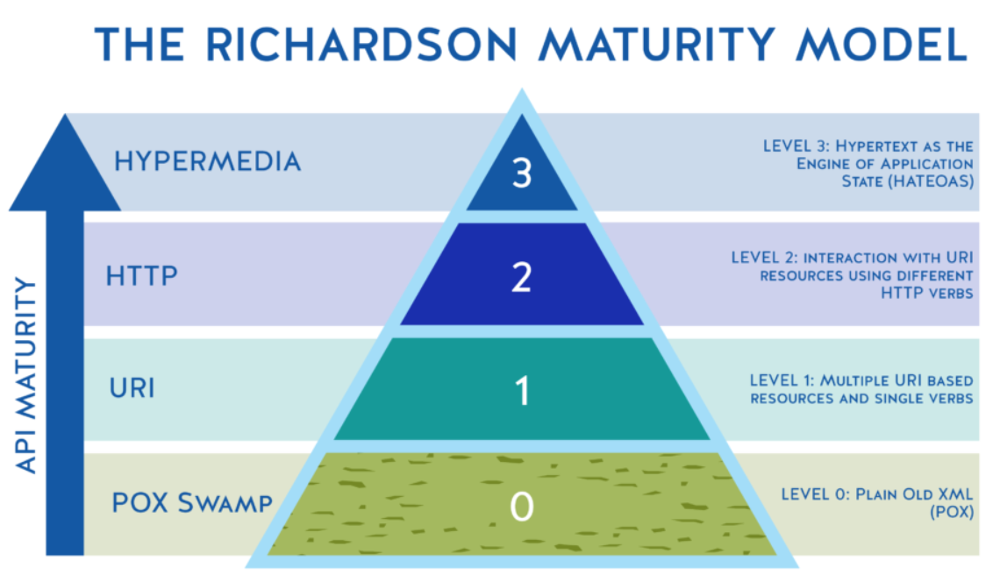

_Richardson Maturity Model as a goalpost to achieving truly complete and useful APIs, Source:_[Kristopher Sandoval](https://nordicapis.com/what-is-the-richardson-maturity-model/)

"_HATEOAS_ 是 REST 的关键特性，这也是 REST 之所以称为*REST*的原因。但由于很多人并不使用 HATEOAS，导致他们实际上用的是 HTTP RPC"，这是[Reddit](https://www.reddit.com/r/golang/comments/7qvi0w/twirp_a_sweet_new_rpc_framework_for_go_twitch_blog/dstkrnm/)上的一些激进意见。确实，HATEOAS 是最成熟的 REST 版本，但很难实现比通常使用和构建的 API 客户端更加高级和智能的 API 客户端。因此，即使是如今非常好的 REST API 也不能保证面面俱到。这也是为什么 HATEOAS 主要作为 RESTful API 设计的长期开发愿景。

REST 和 RPC 之间有一些灰色区域，特别是当一个服务具有一部分 REST 特性，一部分 RPC 特性时。REST 基于资源，而不是基于动作或动词。

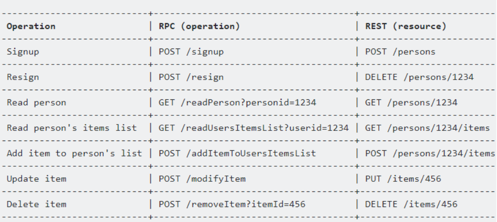

在 REST 中，会用到像 GET, POST, PUT, DELETE, OPTIONS, PATCH 这样的 HTTP 方法。


#### 1.3.2. REST 的优点

- **解耦客户端和服务端**： REST 的抽象比 RPC 更好，可以更好地解耦客户端和服务端。具有一定抽象的系统可以更好地封装其细节并维持其属性。这使得 REST API 足够灵活，可以在保持系统稳定的同时，随时间进行演化。
- **可发现性**： 客户端和服务端的通信描述了所有细节，因此无需额外的文档来理解如何使用 REST API 进行交互。
- **缓存友好**： 重用了大量 HTTP 工具，REST 是唯一一种允许在 HTTP 层缓存数据的风格。相比之下，要在其他 API 风格中实现缓存，则要求配置额外的缓存模块。
- **支持多种格式**： 支持多种格式的数据存储和交互功能也是使 REST 成为当前流行的构建公共 APIs 的原因之一。

#### 1.3.3. REST 的缺点

- **没有单一的 REST 结构**： 不存在正确地构建 REST API 的方式。如何对资源进行建模，以及对哪些资源建模取决于具体场景，这使得 REST 在理论上是简单的，但实践上是困难的。
- **载荷较大**： REST 会返回大量元数据，因此客户端可以从响应的信息中了解到应用的状态。对于具有大容量带宽的大型网络通道来说，这种交互方式没有问题。但实际情况并不总是这样，这也是 Facebook 在 2012 年推出 GraphQL 风格的主要驱动因素。
- **过度获取和不足获取问题**：由于有时候会出现包含的数据过多或过少的情况，导致在接收到 REST 的响应之后，通常还会需要另一个请求。

#### 1.3.4. REST 的使用场景

- **管理 API**： 专注于管理系统中的对象，并面向多个消费者是最常见的 API 风格。REST 可以帮助这类 APIs 实现强大的发现能力，良好的文档记录，并符合对象模型。
- **简单资源驱动的 APPs**： REST 是一种非常有用的方法，可用于连接不需要灵活查询的资源驱动型应用。

- [ ] 设计 restful 接口的一些最佳实践

### 1.4. GraphQL：仅请求需要的数据

它需要多次调用 REST API 才能返回所需的内容。 因此，GraphQL 被认为是一种改变 API 规则的风格。

[GraphQL](https://www.altexsoft.com/blog/engineering/graphql-core-features-architecture-pros-and-cons/?utm_source=MediumCom&utm_medium=referral&utm_campaign=shared) 的语法描述了如何发起精确的数据请求。GraphQL 适合那些相互之间具有复杂实体引用关系的应用数据模型。


现在，GraphQL 生态扩展了相关的库，并出现了很多强大的工具，如 Apollo, GraphiQL, and GraphQL Explorer。

#### 1.4.1. GraphQL 如何工作

一开始，GraphQL 会创建一个*schema*(模式)，它描述了在一个 GraphQL API 中的所有请求以及这些请求返回的所有*types*。构建模式会比较困难，它需要使用模式定义语言(DSL)进行强类型输入。

由于在请求前已经构建好了模式，因此客户端可以对请求进行校验，确保服务器能够进行响应。在到达后端应用后，会有一个 GraphQL 操作，负责使用前端应用的数据来解析整个模式。在给服务端发送包含大量查询的请求之后，API 会返回一个 JSON 响应，内容正对应请求的资源。

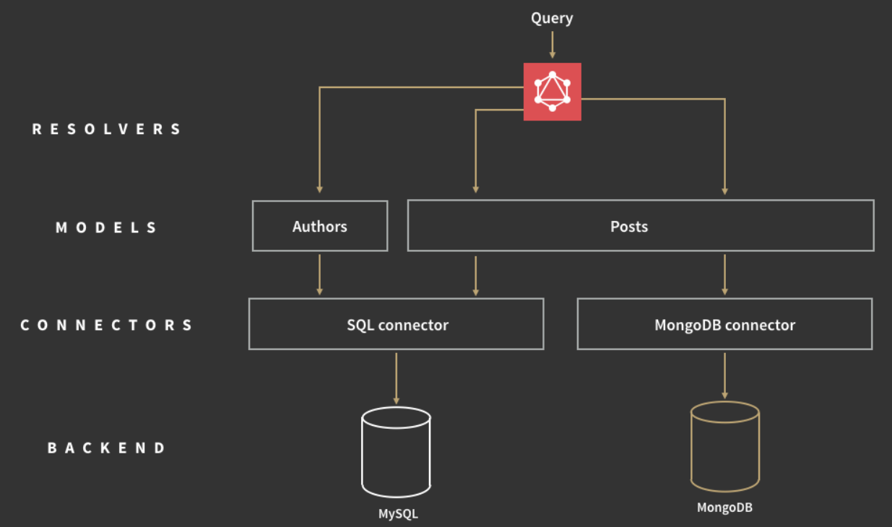

除 RESTful CRUD 操作外，GraphQL 还有订阅功能，允许接收服务端的实时通知。

#### 1.4.2. GraphQL 的优点

- **类型化的模式**： GraphQL 会提前发布它可以做的事情，这种方式提升了可发现性。通过将客户端指向 GraphQL API，我们可以知道哪些查询是可用的。
- **非常适合类似图形的数据**： 适合深度关联的数据，不适合扁平数据。
- **没有版本控制**： 最好的版本控制就是不对 API 进行版本控制。

REST 提供了多种 API 版本，而 GraphQL 是一种单一的、演化的版本，可以持续访问新的特性，方便服务端代码的维护。

- **详细的错误消息**： 与 SOAP 类似，GraphQL 提供了详细的错误信息，错误信息包括所有的解析器以及特定的查询错误。
- **灵活的权限**： GraphQL 允许在暴露特定的功能的同时保留隐私信息。而 REST 架构不能部分展示数据(要么全部显示，要么全部隐藏)。

#### 1.4.3. GraphQL 的缺点

- **性能问题**： GraphQL 用复杂度换来功能上的提升。在一个请求中包含太多封装的字段可能会导致系统过载。因此，即时对于复杂的查询，REST 仍然是一个比较好的选择。
- **缓存复杂**： GraphQL 没有使用 HTTP 缓存语义，需要客户自定义。
- **需要大量开发前培训**：由于没有足够的时间弄清楚 GraphQL 的基本操作和 SDL，很多项目决定沿用 REST 方式。

#### 1.4.4. GraphQL 的使用场景

- **手机端 API**： 这种情况下，对网络性能和单个消息载体的优化非常重要。因此 GraphQL 为移动设备提供了一种更有效的数据载体。
- **复杂系统和微服务**： GraphQL 能够将复杂的系统集成隐藏在 API 背后。从不同的地方聚合数据，并将它们合并成一个全局模式。这对于扩展遗留基础设施或第三方 API 尤为重要。

### 1.5. 如何选择 API 模式

每种 API 项目都有不同的要求，通常基于如下几点进行选择：

- 使用的编程语言
- 开发环境，以及
- 涉及的人力和财务资源等

在了解到每种 API 设计风格之后，API 设计者就可以根据项目的需要选择最合适的 API 模式。

由于强耦合特性，RPC 通常用于内部微服务间的通信，不适用于外部 API 或 API 服务。

SOAP 比较麻烦，但它本身丰富的安全特性仍然是交易操作、订单系统和支付等场景的不二之选。

REST 具有高度抽象以及最佳的 API 模型。但往往会增加线路和聊天的负担--如果使用的是移动设备，这是不利的一面。

在获取数据方面，GraphQL 迈出了一大步，但并不是所有人都有足够的时间和精力来处理这种模式。

归根结底，最好在一些小场景下尝试每种 API 风格，然后看是否满足需求，是否能够解决问题。如果可以，则可以尝试扩展到更多的场景。

> 来自: [api](https://www.cnblogs.com/charlieroro/p/14570214.html)

待整理
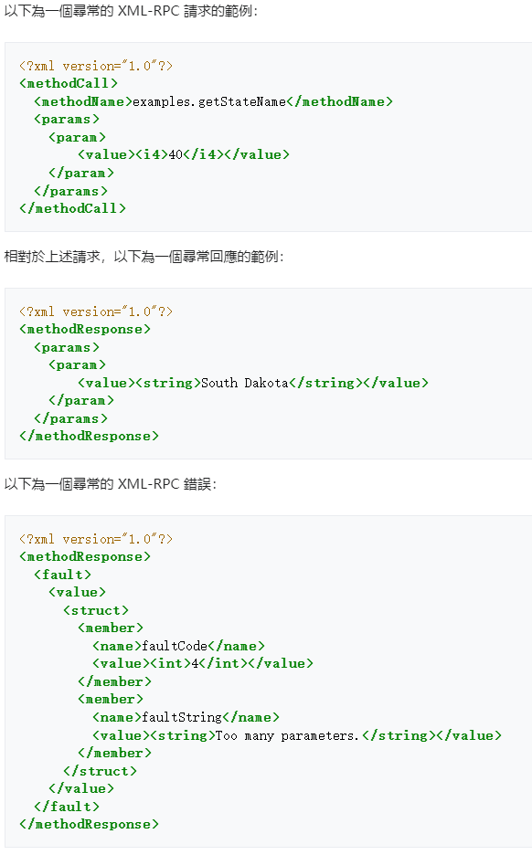

## 2. 接口攻防

### 2.1. 接口攻击

接口攻击手段多种多样，通常利用接口的漏洞或设计缺陷来破坏系统、窃取数据或进行其他恶意行为。以下是一些常见的接口攻击手段：

- **`注入攻击`**
  - **SQL 注入**：攻击者在输入字段中插入 SQL 代码，以便绕过身份验证或访问未授权的数据。
  - **NoSQL 注入**：类似于 SQL 注入，但针对 NoSQL 数据库（如 MongoDB），利用不安全的查询构造执行恶意操作。
  - **命令注入**：攻击者通过输入字段注入操作系统命令，执行未授权的操作。
- **`跨站脚本攻击（XSS）`**
  - **存储型 XSS**：恶意脚本存储在服务器上，并在用户浏览网页时执行。
  - **反射型 XSS**：恶意脚本在用户点击恶意链接时执行。
  - **DOM 型 XSS**：恶意脚本通过修改网页 DOM 结构执行。
- **`跨站请求伪造（CSRF）`**
  - 攻击者诱导用户在已认证的会话中执行未授权的操作，例如提交表单或更改设置。
- **`中间人攻击（MITM）`**
  - 攻击者在客户端和服务器之间拦截并可能篡改数据传输，通过窃取或伪造数据包获取敏感信息。
- **`分布式拒绝服务（DDoS）`**
  - 攻击者通过大量请求淹没服务器，使其无法处理合法用户的请求，从而导致服务中断。
- **`劫持会话`**
  - 攻击者通过窃取用户的会话令牌（如 Cookies、JWT 等），冒充用户执行未授权操作。
- **`API密钥滥用`**
  - 攻击者获得 API 密钥后，滥用接口执行未授权操作，可能导致数据泄露或系统破坏。
- **`参数篡改`**
  - 攻击者修改 API 请求中的参数，尝试绕过安全检查或执行未授权操作。
- **`路径遍历攻击`**
  - 攻击者通过修改 URL 路径，访问未授权的文件或目录，获取敏感信息或执行未授权操作。
- **`XML外部实体攻击（XXE）`**
  - 攻击者在处理 XML 输入时注入恶意的外部实体，可能导致数据泄露、文件读取或远程代码执行。
- **`不安全的API设计`**
  - **过度暴露**：API 暴露过多内部细节，提供了攻击者利用的机会。
  - **不必要的复杂性**：复杂的 API 设计容易出现漏洞和错误，增加攻击面。
- **`漏洞利用`**
  - **未修补的漏洞**：利用已知但未修补的漏洞（如旧版库中的漏洞）进行攻击。
  - **零日漏洞**：利用尚未公开或未修补的漏洞进行攻击。

### 2.2. 接口防御

保证接口安全是现代软件开发中一个至关重要的环节，特别是在构建 API 时。接口的安全性可以通过多种方法和最佳实践来实现，以下是一些关键措施：

- **`身份验证和授权`**
  - **身份验证**：确保访问接口的每个用户或系统都经过验证。常见的方法包括：
    - **API 密钥**：通过分配唯一的 API 密钥给每个客户端进行身份验证。
    - **OAuth**：使用 OAuth2 协议进行用户授权和认证。
    - **JWT（JSON Web Token）**：使用 JWT 进行身份验证，确保请求来自可信任的用户。
  - **授权**：确保经过验证的用户只能访问他们被授权访问的资源。常见的授权方法包括基于角色的访问控制（RBAC）和基于属性的访问控制（ABAC）。
- **`数据加密`**
  - **传输层加密**：使用 HTTPS 加密传输数据，防止中间人攻击和数据窃听。
  - **数据加密**：在存储和处理敏感数据时，使用加密技术保护数据。
- **`输入验证和输出编码`**
  - **输入验证**：验证和清理用户输入，防止注入攻击（如 SQL 注入、XSS）。
  - **输出编码**：对输出数据进行编码，防止跨站脚本（XSS）攻击。
- **`速率限制和请求限制`**
  - **速率限制**：限制每个客户端在一定时间内的请求数量，防止滥用和 DDoS 攻击。
  - **请求限制**：限制每个接口请求的大小和参数数量，防止资源耗尽攻击。
- **`日志记录和监控`**
  - **日志记录**：记录所有 API 请求和响应，特别是错误和异常情况，以便进行安全审计和问题排查。
  - **监控**：实时监控 API 使用情况，检测异常行为和潜在攻击。
- **`安全配置`**
  - **CORS（跨域资源共享）**：配置 CORS 策略，限制哪些域可以访问 API。
  - **防火墙和 WAF（Web 应用防火墙）**：使用防火墙和 WAF 保护 API 免受常见的 Web 攻击。
- **`安全设计和开发实践`**
  - **最小权限原则**：确保每个组件和用户只拥有执行其任务所需的最低权限。
  - **安全编码实践**：遵循安全编码标准和最佳实践，减少代码中的安全漏洞。
  - **定期安全测试**：定期进行安全测试，如漏洞扫描、渗透测试，发现并修复安全漏洞。
- **`安全性文档`**
  - **安全性文档**：提供清晰的安全性文档，说明如何正确使用 API，包括身份验证方法、加密要求和错误处理机制。

### 2.3. 接口防御之最佳实践

- 需求分析
  - 最小权限原则
- 实现
  - 使用 HTTPS 协议
  - 加验证码
  - 对参数进行校验
  - 身份验证及权限验证
  - 限流
  - 日志记录
  - 转义
  - 加密
  - CORS 策略
  - 统一的响应体
- 代码审查
  - 机查
    - SQL 扫描
    - Sonar Qube
  - 人工走查
    - 实现人员讲解
    - pr 时 review
- 测试
  - 漏洞扫描
  - 渗透测试
  - 性能测试
- 部署
  - 防火墙
  - 白名单
- 维护
  - 安全性文档
  - 报警与监控

通过以上措施，可以有效地提高接口的安全性，防止未经授权的访问和潜在的攻击。根据具体应用场景和需求，可以选择适合的安全策略和工具，确保接口的安全性和可靠性。

## 3. 接口的其他问题

### 3.1. 接口重试

#### 3.1.1. 实际场景

接口重试多发生在调用三方接口的业务场景中。

#### 3.1.2. 原因分析

主要是由于网络不稳定，造成我们在调用三方接口时，没有请求成功，此时就需要在我们的系统中实现重试的逻辑，以确保调用三方接口成功。

#### 3.1.3. 常见实现方案

在 Java 领域，接口调用失败时进行重试是一种常见的错误处理方式，特别是在分布式系统、网络调用或与外部服务交互时。Java 中有多种实现接口重试的方案，以下是一些常见的方法和库：

##### 3.1.3.1. **手动实现重试逻辑**

最简单的方法是手动编写重试逻辑。可以在`try-catch`块中进行重试，通常会结合循环、递增等待时间（如指数回退）、最大重试次数等机制。

```java
public void callWithRetry() {
    int maxRetries = 3;
    int retryCount = 0;
    while (retryCount < maxRetries) {
        try {
            // 进行接口调用
            externalServiceCall();
            break; // 调用成功，退出循环
        } catch (Exception e) {
            retryCount++;
            if (retryCount == maxRetries) {
                throw new RuntimeException("最大重试次数已达", e);
            }
            // 可设置等待时间，比如使用Thread.sleep()进行指数回退
        }
    }
}
```

- **优点**：
  - 控制权完全掌握在开发者手中，可以灵活实现。
- **缺点**：
  - 代码重复度高，维护较为繁琐。
  - 没有抽象和封装，代码容易变得复杂。

##### 3.1.3.2. **使用 Spring Retry**

[Spring Retry](https://github.com/spring-projects/spring-retry)是 Spring 生态系统中的一个模块，它提供了一个简单的方式来实现重试逻辑。它支持注解驱动和编程驱动的两种方式。

1. 使用注解方式

```java
import org.springframework.retry.annotation.Backoff;
import org.springframework.retry.annotation.Retryable;
import org.springframework.stereotype.Service;

@Service
public class MyService {

    @Retryable(value = {RuntimeException.class}, maxAttempts = 3, backoff = @Backoff(delay = 2000))
    public void externalServiceCall() {
        // 模拟接口调用
        if (new Random().nextBoolean()) {
            throw new RuntimeException("接口调用失败");
        }
        System.out.println("接口调用成功");
    }
}
```

- **优点**：
  - **简洁**：通过注解方式简化重试逻辑。
  - **灵活配置**：支持自定义重试策略，如最大重试次数、回退策略（如指数回退）。
- **缺点**：
  - 需要引入 Spring 的依赖。
  - 对非常简单的场景可能显得过于复杂。

2. 使用编程方式

Spring Retry 也可以通过编程方式实现重试逻辑，不依赖注解。

```java
import org.springframework.retry.support.RetryTemplate;

public class MyService {
    private RetryTemplate retryTemplate = new RetryTemplate();

    public void callWithRetry() {
        retryTemplate.execute(context -> {
            externalServiceCall();
            return null;
        });
    }
}
```

##### 3.1.3.3. **Resilience4j**

[Resilience4j](https://resilience4j.readme.io/)是一个轻量级的容错库，支持多种容错模式，如重试、熔断、限流等。相比于 Spring Retry，它更加现代化，适合响应式和函数式编程。

```java
import io.github.resilience4j.retry.Retry;
import io.github.resilience4j.retry.RetryConfig;
import io.github.resilience4j.retry.RetryRegistry;

import java.time.Duration;
import java.util.function.Supplier;

public class MyService {

    public void callWithRetry() {
        RetryConfig config = RetryConfig.custom()
                .maxAttempts(3)
                .waitDuration(Duration.ofSeconds(2))
                .build();

        RetryRegistry registry = RetryRegistry.of(config);
        Retry retry = registry.retry("myService");

        Supplier<String> retryableSupplier = Retry.decorateSupplier(retry, this::externalServiceCall);

        try {
            retryableSupplier.get();
        } catch (Exception e) {
            System.out.println("重试后仍失败: " + e.getMessage());
        }
    }

    private String externalServiceCall() {
        if (new Random().nextBoolean()) {
            throw new RuntimeException("接口调用失败");
        }
        return "接口调用成功";
    }
}
```

- **优点**：
  - **功能丰富**：Resilience4j 不仅提供重试，还支持熔断、限流、降级等容错机制。
  - **响应式支持**：支持 Java 8 的函数式编程风格和响应式编程（例如与 Reactor 结合使用）。
- **缺点**：
  - 相对 Spring Retry，Resilience4j 的学习曲线可能稍微陡峭一些。

##### ~~3.1.3.4. **Hystrix（已进入维护模式）**~~

[Hystrix](https://github.com/Netflix/Hystrix)是 Netflix 开源的一个容错库，主要用于处理分布式系统中的延迟和故障。它提供了熔断、隔离、降级和重试功能。

虽然 Hystrix 已经进入维护模式（不再新增功能），但它在许多遗留系统中仍然被使用。

```java
import com.netflix.hystrix.HystrixCommand;
import com.netflix.hystrix.HystrixCommandGroupKey;

public class MyService {

    public void callWithRetry() {
        String result = new ExternalServiceCommand().execute();
        System.out.println(result);
    }

    private class ExternalServiceCommand extends HystrixCommand<String> {

        protected ExternalServiceCommand() {
            super(HystrixCommandGroupKey.Factory.asKey("MyGroup"));
        }

        @Override
        protected String run() {
            if (new Random().nextBoolean()) {
                throw new RuntimeException("接口调用失败");
            }
            return "接口调用成功";
        }

        @Override
        protected String getFallback() {
            return "降级逻辑";
        }
    }
}
```

- **优点**：
  - 提供了强大的熔断、隔离、重试和降级功能。
  - 被 Netflix 等大型分布式系统广泛使用。
- **缺点**：
  - 已进入维护模式，建议使用 Resilience4j 作为替代。
  - 相对较重，过于复杂的小型应用可能不适用。

##### 3.1.3.5. **Guava Retryer**

[Guava Retryer](https://github.com/rholder/retrying)是 Google 的 Guava 库中的重试机制。它相对轻量且简单，支持自定义重试策略。

```java
import com.github.rholder.retry.*;

import java.util.concurrent.ExecutionException;
import java.util.concurrent.TimeUnit;

public class MyService {

    public void callWithRetry() throws ExecutionException, RetryException {
        Retryer<Boolean> retryer = RetryerBuilder.<Boolean>newBuilder()
                .retryIfResult(result -> !result)
                .retryIfException()
                .withWaitStrategy(WaitStrategies.fixedWait(2, TimeUnit.SECONDS))
                .withStopStrategy(StopStrategies.stopAfterAttempt(3))
                .build();

        retryer.call(this::externalServiceCall);
    }

    private Boolean externalServiceCall() {
        if (new Random().nextBoolean()) {
            throw new RuntimeException("接口调用失败");
        }
        return true;
    }
}
```

- **优点**：
  - 轻量级，适合简单的重试场景。
  - 灵活的重试策略配置。
- **缺点**：
  - 功能相对有限，不支持复杂的容错机制。

##### 3.1.3.6. 总结

- **手动重试**：适合简单场景，但容易导致代码重复，维护成本高。
- **Spring Retry**：集成 Spring 生态，适合 Spring 应用，简单易用。
- **Resilience4j**：功能全面，支持多种容错模式，适合现代化的分布式应用。
- ~~**Hystrix**：虽然已进入维护模式，但仍有大量遗留系统使用。~~
- **Guava Retryer**：轻量、简单，适用于基本的重试需求。

在选择重试方案时，需要根据项目的需求、复杂性以及团队的技术栈进行合理的取舍。如果项目已经基于 Spring，可以优先选择 Spring Retry 或 Resilience4j；如果需要更多的容错功能，Resilience4j 是不错的选择。

#### 3.1.4. 最佳实践

- 并不是所有的异常都代表要重试，因此注意下游接口返回的异常的类型，属于网络异常类的才进行重试；
- 只重试有限次数，不重试无线次数；重试有限次数后依然失败，就要进行补偿操作（比如日志记录）；
- 要考虑重试时间间隔，间隔时间一般是越来越长（如，第一次重试间隔 1s，第二次 5s，第三次 10s，第四次 30s……）
- 考虑下游接口的幂等性问题，一般是先查询，看是否成功，不成功才重试；
- 要考虑并发场景下的请求顺序混乱问题和重复发送问题，可以使用锁来解决；

### 3.2. 防刷

所谓接口防刷，意思就是少量请求接口时，是可以成功的，但是由于业务逻辑要求或者系统能能要求等，并不允许对接口的多次大量的请求。

因此防刷的本质就是限流。

在 Java 领域中，**接口防刷**（即防止接口被频繁或恶意调用）是一项重要的安全措施，尤其是在互联网应用中。接口防刷主要通过**限流**、**速率限制**、**令牌桶**、**IP 限制**等技术手段来防止滥用或攻击。以下是几种常见的实现方案：

1. 接口防刷，一般是略过客户端直接调用后端接口。
2. 大多数的业务接口都是需要鉴权的，也就是说调用接口的时候，会根据参数键值对的排列组合，甚至包括一些额外的复杂计算，最终形成一个签名，再配合接口的限流等操作，基本上就可以完成大部分防刷的场景。如果这种方式也出问题了，那就说明用户的一些关键信息已经泄露了，这个时候就不是接口防刷的问题了。
3. 一些特殊的接口，如注册接口，常常在前端采取一些措施，比如验证码、修改时间戳、对接口增加额外的复杂逻辑、

#### 3.2.1. **基于令牌桶算法的限流**

令牌桶（Token Bucket）是一种常见的限流算法，能够有效控制请求的频率。它维护一个装有令牌的桶，接口每次请求都需要消耗一个令牌，如果桶中没有令牌，接口请求将被拒绝。

使用`Guava`库提供的`RateLimiter`类，它实现了令牌桶算法。

```java
import com.google.common.util.concurrent.RateLimiter;

public class MyService {
    private final RateLimiter rateLimiter = RateLimiter.create(2.0); // 每秒2个请求

    public void callService() {
        if (rateLimiter.tryAcquire()) {
            // 允许调用接口
            System.out.println("接口调用成功");
        } else {
            // 拒绝调用
            System.out.println("接口调用被限流");
        }
    }
}
```

- **优点**：
  - 实现简单，Guava 内置支持。
  - 高效控制请求速率。
- **缺点**：
  - 不支持分布式场景，适合单机模式。

#### 3.2.2. **基于计数器的限流**

计数器（Counter-based Throttling）是一种简单的限流方式，它通过记录单位时间内的请求次数来限制请求量。

在 Java 中可以使用`ConcurrentHashMap`来存储每个 IP 或用户的请求计数。

```java
import java.util.concurrent.ConcurrentHashMap;
import java.util.concurrent.TimeUnit;

public class RateLimiterService {

    private static final ConcurrentHashMap<String, Integer> requestCounts = new ConcurrentHashMap<>();

    public void callService(String clientId) {
        int limit = 10; // 每分钟10次请求限制
        int count = requestCounts.getOrDefault(clientId, 0);

        if (count >= limit) {
            System.out.println("接口调用被限流");
        } else {
            requestCounts.put(clientId, count + 1);
            System.out.println("接口调用成功");
        }

        // 定时清除请求计数（如每分钟清除一次）
        resetCounterPeriodically();
    }

    private void resetCounterPeriodically() {
        new Thread(() -> {
            try {
                TimeUnit.MINUTES.sleep(1);
                requestCounts.clear();
            } catch (InterruptedException e) {
                Thread.currentThread().interrupt();
            }
        }).start();
    }
}
```

- **优点**：
  - 实现简单。
  - 适用于小规模限流场景。
- **缺点**：
  - 精确度不高，单位时间内的高并发情况下可能不够灵活。
  - 不适合分布式环境。

#### 3.2.3. **基于 Redis 的分布式限流**

在分布式系统中，限流需要在多个节点之间共享状态。Redis 是一种高效的键值存储，可以用作限流的存储介质。

在 Redis 中记录每个客户端的请求次数，并设置过期时间（TTL）来实现滑动窗口限流。

```java
import redis.clients.jedis.Jedis;

public class RedisRateLimiter {

    private Jedis jedis = new Jedis("localhost");

    public boolean isAllowed(String clientId, int maxRequests, int windowSeconds) {
        String key = "rate_limit:" + clientId;
        long currentTime = System.currentTimeMillis() / 1000; // 当前秒数

        // 使用 Redis 的 INCR 和 EXPIRE 进行限流操作
        Long count = jedis.incr(key);
        if (count == 1) {
            jedis.expire(key, windowSeconds);
        }

        if (count > maxRequests) {
            return false; // 限流
        }

        return true; // 允许请求
    }
}
```

- **优点**：
  - 适用于分布式场景。
  - 通过 Redis 的分布式特性实现全局限流。
- **缺点**：
  - 需要依赖 Redis 等外部存储。
  - 需要注意 Redis 的性能瓶颈及高可用性。

#### 3.2.4. **基于熔断器的限流**

熔断器（Circuit Breaker）主要用于防止服务过载，通过动态监测接口状态，如果接口的失败率超过阈值，则触发熔断，暂时拒绝所有请求。

使用`Resilience4j`库实现熔断限流。

```java
import io.github.resilience4j.circuitbreaker.CircuitBreaker;
import io.github.resilience4j.circuitbreaker.CircuitBreakerConfig;
import io.github.resilience4j.circuitbreaker.CircuitBreakerRegistry;

import java.time.Duration;
import java.util.function.Supplier;

public class CircuitBreakerService {

    private final CircuitBreaker circuitBreaker;

    public CircuitBreakerService() {
        CircuitBreakerConfig config = CircuitBreakerConfig.custom()
                .failureRateThreshold(50) // 失败率阈值
                .waitDurationInOpenState(Duration.ofSeconds(10)) // 熔断持续时间
                .build();

        CircuitBreakerRegistry registry = CircuitBreakerRegistry.of(config);
        this.circuitBreaker = registry.circuitBreaker("serviceCircuitBreaker");
    }

    public void callService() {
        Supplier<String> supplier = CircuitBreaker.decorateSupplier(circuitBreaker, this::externalServiceCall);
        try {
            System.out.println(supplier.get());
        } catch (Exception e) {
            System.out.println("接口调用被熔断");
        }
    }

    private String externalServiceCall() {
        if (new Random().nextBoolean()) {
            throw new RuntimeException("接口调用失败");
        }
        return "接口调用成功";
    }
}
```

- **优点**：
  - 避免服务过载导致整体不可用。
  - 动态调节，自动熔断与恢复。
- **缺点**：
  - 主要用于服务的保护，限流的能力不如专门的限流算法精细。

#### 3.2.5. **基于 Nginx 的限流**

Nginx 是一种高性能的 HTTP 服务器和反向代理服务器，它提供了限流模块，可以在网关层面控制请求的速率。常用于前端限流，在请求到达应用之前，Nginx 就会对其进行限流。

```nginx
http {
    limit_req_zone $binary_remote_addr zone=one:10m rate=1r/s;

    server {
        location /api/ {
            limit_req zone=one burst=5 nodelay;
            proxy_pass http://backend;
        }
    }
}
```

- `rate=1r/s`：每个客户端每秒最多允许 1 个请求。
- `burst=5`：允许最多 5 个突发请求。
- `nodelay`：不进行延迟处理，超出速率的请求立即返回错误。

- **优点**：
  - 对于高流量系统非常高效。
  - 不需要修改应用代码，完全在 Nginx 层面控制。
- **缺点**：
  - 粒度较粗，无法针对特定的用户、IP、接口等进行细粒度限流。

#### 3.2.6. **基于网关的限流（如 Spring Cloud Gateway）**

Spring Cloud Gateway 是一种常见的微服务网关解决方案，提供了限流功能，可以根据请求的路径、用户等进行限流控制。

```yaml
spring:
  cloud:
    gateway:
      routes:
        - id: my_route
          uri: http://my-service
          predicates:
            - Path=/api/**
          filters:
            - name: RequestRateLimiter
              args:
                redis-rate-limiter.replenishRate: 10
                redis-rate-limiter.burstCapacity: 20
```

- `replenishRate`：每秒产生多少个请求令牌。
- `burstCapacity`：允许的最大突发请求数量。

- **优点**：
  - 集成在微服务架构中，适合大型分布式系统。
  - 支持动态配置和调整。
- **缺点**：
  - 依赖于微服务架构和网关层，适用场景特定。

#### 3.2.7. 总结

| 实现方式                  | 适用场景                         | 优点                         | 缺点                                    |
| ------------------------- | -------------------------------- | ---------------------------- | --------------------------------------- |
| 手动实现计数器限流        | 小规模、简单接口防刷场景         | 实现简单                     | 精确度不高，无法分布式                  |
| Guava RateLimiter         | 单机限流                         | 实现简单，代码简洁           | 只适用于单机环境                        |
| Redis 限流                | 分布式系统，多个节点共享限流状态 | 适合分布式，性能高效         | 依赖 Redis，需考虑 Redis 性能和高可用性 |
| Resilience4j 熔断限流     | 分布式系统，防止服务过载         | 动态熔断，支持服务保护       | 主要用于熔断，限流精度相对较低          |
| Nginx 限流                | 高并发、高流量系统，网关层面限流 | 高效，无需修改应用代码       | 细粒度控制有限                          |
| Spring Cloud Gateway 限流 | 微服务架构，基于网关的动态限流   | 集成微服务体系，支持动态限流 | 依赖于微服务架构                        |

根据实际场景选择合适的限流方案非常重要。如果是小型应用，手动实现或者 Guava `RateLimiter`可能已经足够；对于分布式系统，Redis 限流和熔断器方案则更加合适；如果是高并发、高流量的互联网服务，使用 Nginx 或基于网关的限流是比较有效的选择。

### 3.3. 调优

## 4. TODO

1. httpclient 原理
2. RPC RMI
3. Ouath2.0 原理

## 5. 参考

- [API 架构风格对比：SOAP vs REST vs GraphQL vs RPC](https://www.cnblogs.com/charlieroro/p/14570214.html)
- [RESTful API 设计指南](https://www.ruanyifeng.com/blog/2014/05/restful_api.html)
- [怎样用通俗的语言解释 REST，以及 RESTful？](https://www.zhihu.com/question/28557115/answer/48094438)

- [面试四连问：API 接口如何设计？安全如何保证？防重如何实现？签名如何实现？...](https://blog.csdn.net/zhipengfang/article/details/117455598)
- [保证接口安全，就用这 11 招！](https://mp.weixin.qq.com/s/62xMLKpKtOLr8Sy_2Cb78g)
- [接口请求重试的 8 种方法，你用哪种？](https://mp.weixin.qq.com/s/8_NJiy2dtFpJgIWbbYUGbQ)
- [防止接口被刷的 8 种方法！](https://mp.weixin.qq.com/s/8VI6u_5D0SyxtdpI1noWqg)
- [实战总结！18 种接口优化方案的总结](https://mp.weixin.qq.com/s/rEzHIE-nK7PpCKG7KAB-Jw)

> （安全（OWASPTop10）、超时与重试、数据脱敏、序列化与反序列化、接口风格、防重放（防刷、幂等）、限流、优化、接口文档）

1. RMI 和 RPC
2. API 架构风格
3. 接口文档管理-设计方面
4. 接口安全-实现方面
   1. WOSAPTop10 及其解决方案
   2. 防重放（防刷、幂等）
   3. 超时与重试
   4. 限流
   5. 参数校验
   6. 权限校验
   7. 优化
5. 其它方面
   1. 数据脱敏
   2. 序列化与反序列化

## 应用场景

票据系统中，从开票申请到承兑成功是一个复杂的过程，中间有很多业务步骤，每个业务步骤都需要不同人员的录入和复核操作，并且只有复核成功后才会录入下一个业务动作的表。
比如开票申请，录入人员提交开票申请提交请求，后端会首先在开票申请表中添加一条数据，这条数据的票据类型为开票申请，票据状态为待审核。然后由复核人员登录系统后进行确认或驳回操作，后端会修改票据状态为通过或驳回状态，如果是通过后端接着会生成下一个业务流程的票据信息（票据类型为下一个业务动作的类型信息，票据状态为待审核状态）。
所以就涉及到很多的提交接口。由于跟钱相关，要保证客户在点击提交接口时很慎重，同时后端也要保证提交接口的幂等性，因为多次提交会产生多个相同的数据信息。

## 实现过程

写一个注解，使用切面来解释注解，在注解中校验参数 md5 值，然后对比对应传过来的随机参数是否与
用接口参数中的关键信息作为 md5 值，

[什么是接口幂等性？为什么会产生这个问题？如何保证接口幂等性？](https://zhuanlan.zhihu.com/p/345428483)

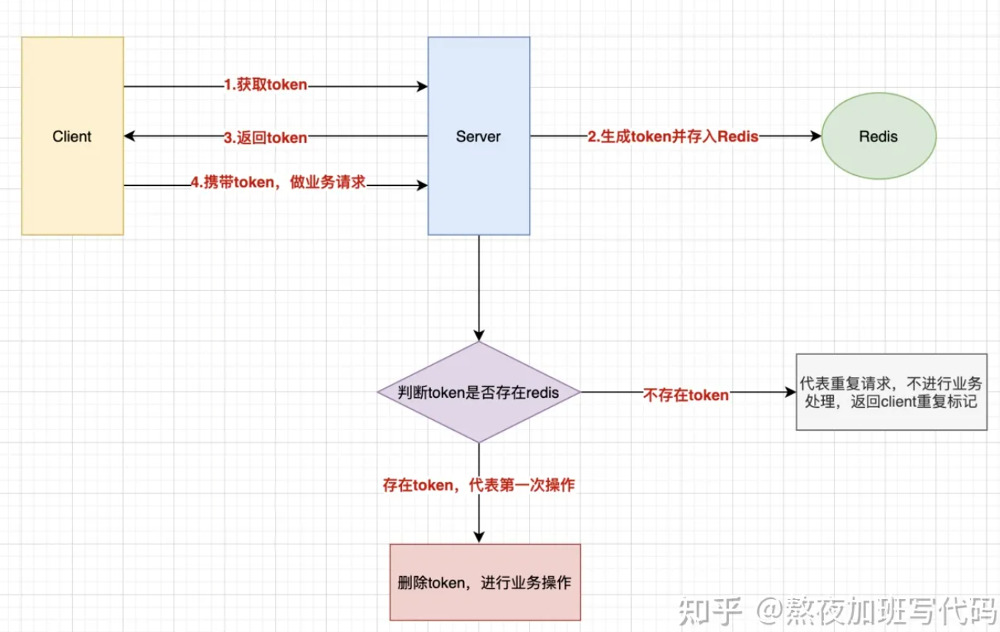

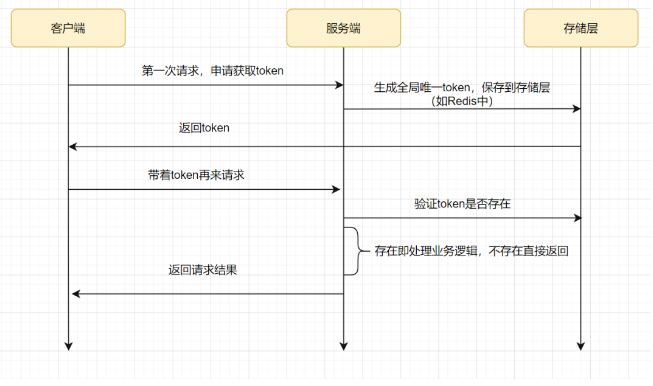

## http 的 RestFul 方法

- GET： 支持幂等
- POST： 不支持
- PUT： 用来创建或更新，具有幂等性
- DELETE： 幂等
- HEAD： http 的头信息，幂等
- OPTIONS： 用于获取当前 URL 所支持的方法， 幂等

##

## 防重 VS 幂等？

防重： 主要是避免数据重复；
幂等： 主要是要求接口的多次请求效果与只请求一次的效果一致

## 幂等的常见做法

1. 数据库悲观锁的方式：select for update，
   1. 原理是通过一些条件定位到一条数据库记录，然后由数据库层面的悲观锁，锁定这条记录，锁定后的这条记录事实上只允许一个线程去更新，如果这条记录执行成功，再次执行时由于条件变更会导致这条语句执行失败；
   2. 缺点是性能不高，相当于借用数据库层面的锁来完成幂等；
2. :star: token 令牌方式：
   1. 原理： 客户端在调用幂等的接口前需要先调用一下获取 token 的接口，客户端每次调用幂等的接口时，都需要携带上 token，服务端判断一下这个 token 是否存在，如果存在就说明没有执行过，于是进行执行，执行完成之后删除 token；再次请求时，由于 token 不存在，直接抛弃即可；一般是 del(token)，如果存在会删除成功，表明是第一次执行业务逻辑，如果删除失败就不处理业务逻辑；
3. 状态机方式
   1. 原理，为数据设置状态，

##

## 接口设计的关注点

热点数据的隔离性
业务隔离、系统隔离、用户隔离、数据隔离

服务整体：

1. 模块划分正确合适；

接口级别：

1. 兼容性
2. 可扩展性
3. 单一职责
4. 防重（避免产生重复数据）|幂等（多次请求返回的结果是一样的，业务逻辑与成功执行一次的效果一样）
5. 熔断、降级、限流
6. 安全性

请求参数：

1. 多参数合并成请求参数实体，并完成参数校验；
2.

代码：

1. 代码中包、类、变量、表、字段等命名符合规范；
2. 公共方法设计优良（适用于尽可能多的情况）
3. 热点业务，考虑线程池隔离；（所有业务共用一个线程池，会出现部分业务因为异常导致线程池阻塞问题，进而会影响到所有业务。采用对关键重要业务设置单独线程池的方式解决）；
4. 关注工具类的使用
   1. sonar 代码检测工具的使用；SDLC 的使用；
   2. 公共部分代码进行抽象，避免重复代码；
   3. IO 操作、文件上传下载、第三方系统通讯等组件化、可配置化；
5. 关注分支的使用
   1. switch 块每个 case 都以 break 结束，且有 default 分支；
   2. 判断条件覆盖所有分支；
6. 关注并发的使用
   1. 关注锁的粒度及锁的安全性；
   2. 合理而正确的使用异步，使串行改并行；
7. 关注缓存的使用
   1. 合理使用本地缓存、分布式缓存
   2. 为每一个 key 设置过期时间；
   3. 合理配置内存驱逐策略；
   4. 经典问题的处理方案（双写一致性、缓存击穿、缓存穿透、缓存雪崩、大 key 处理、热点数据处理）
8. 关注日志的使用
   1. 关键而不冗余；
   2. 关键业务的日志；
   3. 考虑性能；
9. 关注异常的处理
   1. 重点关注空指针、下标越界、数据库连接关闭、IO 流关闭、通讯组件的交易失败异常、通讯组件的通讯失败异常等
   2. 不把异常信息直接抛出给前端，且不丢弃原始的 Throwable cause；
   3. 使用 log 打印而不是 e.printStackTrace()【会导致内存占满】
   4. 细分异常，并关注异常匹配顺序，优先捕获具体的异常而非父类异常等模糊的异常；
10. 关注对 DB 的操作
11. 禁止循环查询
12. 关注连接关闭情况
13. 数据量大考虑分页；
14. 关注对 SQL 的调优
15. 读写分离？
16. 关注重点逻辑
17. 大对象、大文件、大事务（耗时较长的事务）；
18. 分布式事务、分布式锁、分布式 ID；
19. 考虑批量操作的优化（如循环调用接口、循环查询数据库）；
20. ~~恰当而合理的使用缓存；~~
21. 可变参数配置化；
22. ~~关注资源的关闭；~~
23. ~~关注异常处理（重点关注空指针、下表越界）；~~
24. ~~注意大对象、大文件、大事务的处理~~
25. 熟练使用设计模式

通讯（包括与磁盘文件、DB、缓存、第三方系统的所有交互）：

1. 通讯组件要捕获交易失败和通讯失败两种异常，且通讯组件还要关注资源（包括数据库连接、IO 流、线程）的关闭情况；
2.

DB：

1. 优先考虑批量操作
2. 考虑对结果进行分页
3. 读写分离
4.

响应：

1. 统一而具体的响应信息
2. 不把后端异常直接抛出

[后端思想篇：设计好接口的 36 个锦囊！](https://mp.weixin.qq.com/s?__biz=Mzg3NzU5NTIwNg==&mid=2247499388&idx=1&sn=49a22120a3238e13ad7c3d3b73d9e453&chksm=cf222155f855a8434026b2c460d963c406186578c2527ca8f2bb829bbe849d87a2392a525a9b&token=1380536362&lang=zh_CN&scene=21#wechat_redirect)
[工作总结！日志打印的 15 个建议](https://mp.weixin.qq.com/s?__biz=Mzg3NzU5NTIwNg==&mid=2247494838&idx=1&sn=cdb15fd346bddf3f8c1c99f0efbd67d8&chksm=cf22339ff855ba891616c79d4f4855e228e34a9fb45088d7acbe421ad511b8d090a90f5b019f&token=162724582&lang=zh_CN&scene=21#wechat_redirect)

### 优化思路

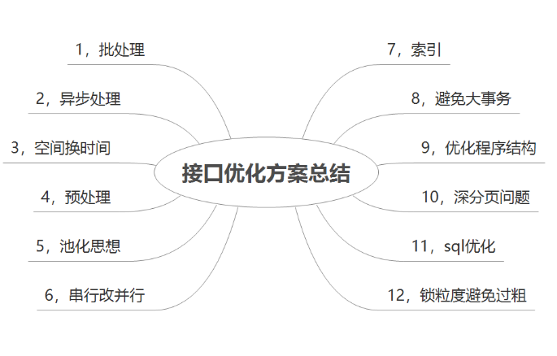

[接口优化的常见方案实战总结](https://zhuanlan.zhihu.com/p/610756706)

### 设计一个安全的 api

1. 接口调用方(客户端)向接口提供方(服务器)申请接口调用账号，申请成功后，接口提供方会给接口调用方一个 appId 和一个 key 参数。

2. 客户端携带参数 appId、timestamp、sign 去调用服务器端的 API token，其中 sign=加密(appId + timestamp + key)

3. 客户端拿着 api_token 去访问不需要登录就能访问的接口

4. 当访问用户需要登录的接口时，客户端跳转到登录页面，通过用户名和密码调用登录接口，登录接口会返回一个 usertoken, 客户端拿着 usertoken 去访问需要登录才能访问的接口
   但是登录接口也需要 apiToken，这是因为要确定客户端是否已经申请了 appId 和 key 的参数。

类比如微信公众号，我们在填写好微信公众号的注册信息之后，如果要使用高级特性，那么就需要进行认证，认证之后，微信公众号才会给我们分配一个 appid 和 appkey，然后我们每次调用一些接口时，我们就可以通过这两个参数
获取 apitoken。

分为不同的应用场景：

1. 假如客户端需要调用一些不需要登录就可以访问的接口，那么就需要先调用一下获取 appToken 的接口，然后拿着返回的 appToken 来调用这些接口即可；
2. 如果客户端想要调用一些需要登录的接口，那么也必须要先调用一下获取 appToken 的接口，然后拿着用户名和密码来获取 accessToken，最后才是拿着 accessToken 来调用其他接口；
   【登录的接口就属于不需要登录就可以访问的接口】，因此需要先调用一下获取 appToken 的接口；
