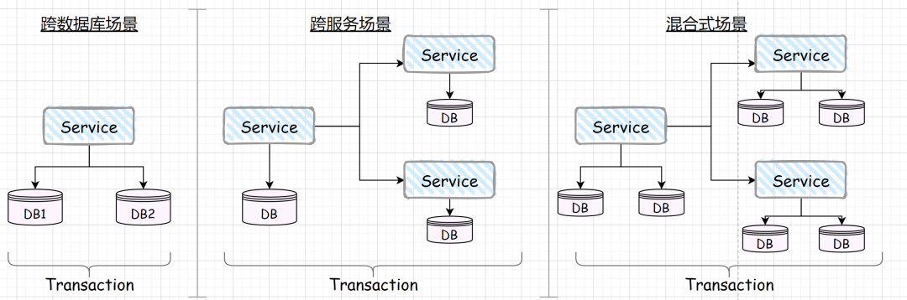
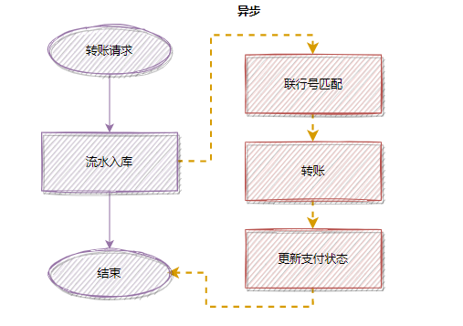

# 分布式事务

### 2. Seata 的 AT、TCC、SAGA 和 XA 事务模式

- [阿里终面：分布式事务原理](https://mp.weixin.qq.com/s?__biz=Mzg2OTA0Njk0OA==&mid=2247494827&idx=1&sn=aa5d7401d53b1ca61b5e49462262bd22&chksm=cea1a360f9d62a761dff15a682f69fcacdd5b70a8afc4e1114cc7f6704b31d9aa3ad82ae5233&token=2092405348&lang=zh_CN#rd)
- [聊一聊分布式事务](https://mp.weixin.qq.com/s?__biz=Mzg5Mjc3MjIyMA==&mid=2247544315&idx=1&sn=1918fe3e5435e2ffd88aa29b76c2e35b&source=41#wechat_redirect)
- [消息队列之事务消息，RocketMQ 和 Kafka 是如何做的？](https://juejin.cn/post/6867040340797292558)
- [微服务中的分布式事务方案](https://jeremyxu2010.github.io/2020/03/%E5%BE%AE%E6%9C%8D%E5%8A%A1%E4%B8%AD%E7%9A%84%E5%88%86%E5%B8%83%E5%BC%8F%E4%BA%8B%E5%8A%A1%E6%96%B9%E6%A1%88/#heading-3)

---

---

---

## 实践过程

> 使用 jpa 作为 ORM 框架； 框架是一步一步进行迭代的。

1. 搭建项目脚手架

2. 集成 Openfeign

3. 集成 Seata

4. 处理三个异常信息

5. 处理幂等性问题
   1. 查看 GitHub 上的 samples，对服务调用也要进行幂等的问题？会不会可以处理压测时出现的问题

---

本地事务：
全局事务：
分支事务：

1. 一个服务操作同一个数据库不同表中的数据；
2. 一个服务操作不同数据库的不同表中的数据；
3.

---

# 基于 Seata-AT 模式实现客户开户功能

待整理：

## 场景描述

在客户管理模块中的客户开户功能中，需要同时保存三张表的数据： 客户信息、客户员工信息以及账户信息，而这三个表信息属于不同的微服务，这就涉及到跨应用的事务了，我们就要要求这三张表信息，要么全部成功，要么全部失败，不能存在某个成功、某个失败的情况。

## 分布式事务基本原理

出现的背景
分布式事务的几种实现原理、对比
seata 基本原理、支持的几种模式

## 实现过程

[SpringBoot——整合 RocketMQ](https://www.jianshu.com/p/f7b59073ea01)
