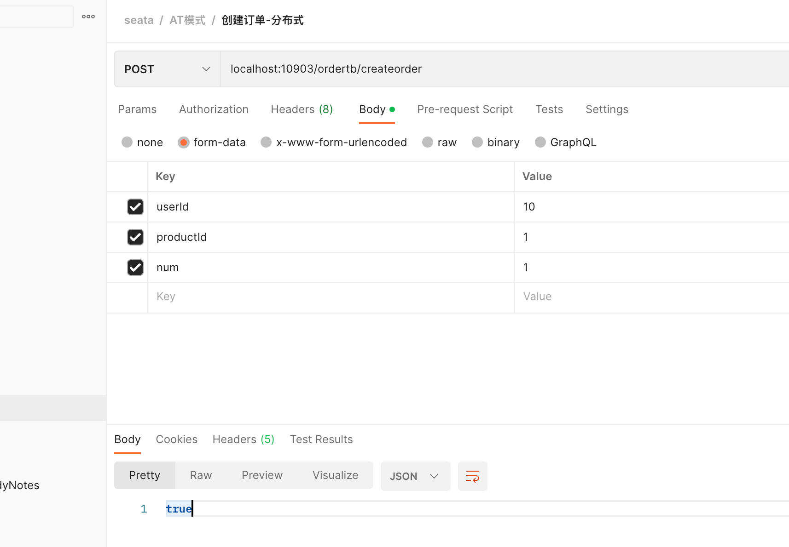

# 分布式事务

- [ ] 需要按照提纲再次整理

> 提纲
>
> 1. 本地事务、全局事务、分布式事务；
> 2. 事务特性
> 3. 出现分布式事务的业务架构；
> 4. CAP 和 BASE 理论
> 5. 为什么分布式事务难？【从技术架构上讲、团队学习成本、性能上（包括吞吐量和运行时间上、给数据库本身造成的影响上）、系统复杂性和可用性上取舍】
> 6. 分布式事务理论及实践（2PC、3PC、Seaga、XA、本地事务消息、TCC、AT）

### 1. 分布式事务

本文主要从以下几个方面来讲述分布式事务的相关内容：

1. 分布式事务的背景
2. 七种分布式方案（`XA规范`、`2PC理论`、`SAGAS方案`、`3PC`、`TCC方案（异步确保型、补偿型）`、`本地消息表方案`、`最大努力通知方案`、`可靠消息最终一致性方案`）的原理、优缺点、所出现的问题、适用的场景、技术的细节
3. 分布式事务 Seata 的使用

学习的主要方法是`带着问题去学习`，具体步骤如下：

1. 先了解分布式事务出现的背景，要知道一种新的技术或者新的理论的出现，一定是为了解决某个问题而产生的，不可能平白无故产生；
2. 了解人们在解决分布式事务这个问题的过程中都提出了哪些解决方案，每个解决方案的具体原理是怎样的，这每一个解决方案是否又引入了新的问题，这些新的问题是什么，为了解决这些引入的新的问题，人们又提出了哪些解决方案；
3. 在实际的生产环境下如何实践分布式事务，不同方案之间的适用场景有哪些；

#### 1.1. 背景

我们先来解释三个名词：

- **数据库事务**： 是从数据库层面来解决事务的，它是由实现数据库的具体技术来保证的，比如 MySQL 的 innodb 引擎中的事务实现；
- **本地事务**： 是由应用程序来保证的。比如一个应用场景中要往 A 表中插入一条数据，然后再从 B 表中删除一条数据，此时插入和删除是两条 SQL，并且这两条数据都是由应用程序分别发起的，因此要跟数据库交互至少两次，这就没有办法使用数据库事务机制来保证事务了，因此就需要由应用程序来保证事务，于是在 Spring 中我们可以使用事务注解的形式来保证事务；
- **分布式事务**： 则是由更高一层次的事务框架协议来保证；

为什么会出现分布式事务？分布式事务是出现在分布式系统中的。

假设有一个业务场景，如`流量充值业务`，我们系统中有这么几个模块：转账模块、流量管理模块、积分模块，主要的业务场景是：转账成功后，需要修改用户的流量，并修改用户的积分。那在这个流量充值业务中，我们就需要做到这几个操作全部成功，如果遇到异常也要全部失败，不能出现转账成功了，但是流量没有充值成功，也不能出现流量充值成功了，但是积分没有成功，也就是说**要保证这三个操作，要么全部成功，要么全部失败**。那么，这样一个针对不同的数据源的组合操作，就是分布式事务。

本质上，分布式事务有一个特点： **跨应用程序执行事务操作**。

#### 1.2. XA 理论

起先 X/Open 组织提出了**一种 XA 规范，就是一套务虚的理论**。在这个理论中定义了几个角色，

- AP，就是我们的应用；
- TM，就是事务管理器；
- RM，就是资源管理器；
- CRM，就是通信资源管理器，可以理解为消息中间件，但是可以没有。

其原理基本就是：

1. AP 告诉 TM，说我要发起一个全局事务了；
2. 然后 TM 就会往 RM 中分别发送一条消息，然后 RM 就进行事务的提交或回滚；

说白了就是 TM 定义了一套跟 RM 进行通信和交互的接口规范，然后通过接口来通知 RM，来一块做一下提交或回滚。

XA 理论只是一种务虚的理论，意思就是它提出了一个实现分布式的一个标准而已。

#### 1.3. 2PC

**2PC 理论，就是基于 XA 规范做的一种具体的实践**，说白了就是两阶段提交，先有一个准备阶段，然后告诉所有的 RM，先准备一下，要开始做事务了；然后 TM 收到消息后开始发起提交阶段的请求，告诉所有的 RM，开始提交。但是如果 TM 在发送准备阶段的提交请求时，收到了某一个 RM 的异常响应，那么整个事务就立马失败了；如果在提交阶段也收到了 RM 的异常响应，也会立马失败，然后回滚已经执行的事务。准备阶段实际上是利用了 commit 和 rollback 机制，即 TM 直接发送给所有的 RM，让 RM 执行操作，这个时候可以认为数据库中是已经有数据变更的；在提交阶段，TM 根据收到的上一阶段的消息汇总后得出是否允许提交的结论，再去告诉所有的 RM 执行 commit 或 rollback 操作。

2PC 是有问题的，在准备阶段 RM 收到消息后，会对资源进行锁定，如果下一次收到提交的消息中间有很长时间，这就造成了数据库系统的`并发量下降`；此外还会出现`单点故障`的问题，TM 是一个单点，如果出现单点故障问题，就完了；此外也会出现`状态丢失`的情况，如对 TM 做了备份，在主 TM 宕机后，重新选举从 TM 时，之前 TM 发送的状态，新的 TM 是不知道的；还会`发生脑裂`的问题，如果在 TM 切换过程中，有些 RM 收到了提交消息，有些没有收到提交消息，这也是不行的。基于这些问题的考量，又引入了 3PC 理论。

2PC 比较适合单体应用中跨多个库的分布式事务，而且这种方式是严重依赖数据库层面来搞定分布式事务的，并发度很低。但微服务中，我们是不允许微服务交叉访问数据库的，我们一般要求必须通过调用对应的服务来操作服务底层的数据库。

#### 1.4. SAGAS 方案

由于 2PC 阶段中，最后 TM 通知每一个 RM 进行提交事务时，如果涉及到很多的操作，那么这个 TM 的执行操作会很长，因此基于这个问题的解决，又提出了 SAGAS 方案，其核心思想就是把长事务拆分成短事务。

这种方案并发度较高，但是需要定义补偿操作，开发量较大，此外次方案一致性较弱，可能会出现一个事务执行成功，另外一个事务执行失败的问题。

#### 1.5. 3PC

三阶段提交方案：

- 一阶段：TM 给 RM 发送 cancommit 消息，根据响应消息判断各 RM 是否正常；
- 二阶段：TM 给 RM 发送 precommit 消息，告知各 RM 准备相关的 sql 及请求链接等；
- 三阶段：TM 给 RM 发送 docommit 消息，通知各 RM 进行提交；

这个方案解决了 2PC 方案中的 TM 异常时会导致整个事务不成功的问题，同时也不会锁定资源很久导致并发度下降的问题。此外，如果 TM 在第三阶段中发生了异常，事务也是有可能成功的，因为 RM 会在收到 precommit 消息后，一段时间后如果 TM 宕机，RM 也会自动提交，因为收到的 precommit 的消息的响应是正常的。

但是这种方案也还是有问题的，如果发生脑裂问题进行 TM 的切换过程中，RM 根据超时机制判定 TM 不可用，自己提交了事务，但是事实上 TM 切换后是要发送 cancel 消息的，因此这也是一种问题。

#### 1.6. TCC

就是 try-confirm-cancel 事务机制，在 try 阶段对转账金额进行锁定，confirm 阶段先往本地数据库中插入要锁定的金额的记录，然后调用 b 银行的扣减金额的接口，再调用 c 银行的增加金额的接口；cancel 阶段就先把 c 的金额给减掉，然后把 b 的金额再加回去。通俗一点讲就是 try 阶段准备各服务所需要的资源或对某些资源进行锁定，confirm 就是进行各服务的提交，cancel 阶段就是进行补偿，把原来成功的事务进行回滚。

TCC 就是针对要求数据强一致性时才会使用到这种方案，因为这种方案要求写额外的补偿事务的代码，这不利于代码的维护。一般情况下，只有在要求转账这些涉及到钱的一些业务操作时才会使用这种方案，否则，不会采用这种方案的，因为补偿的业务代码非常复杂，也不利于系统的维护。

#### 1.7. 本地消息表方案

本地消息表方案是国外 ebay 搞的一套方案，其原理大概是这样的： 1.服务 a 先往自己本地表中插入一条消息数据，然后执行业务操作，再往 mq 中发送事务消息； 2.服务 b 接收到消息后，先去查一下本地消息表中是否有改消息 id，如果有就丢弃，如果没有就往自己本地表中插入一条消息数据，然后执行业务操作，完成后更新消息数据，再调用 a 接口更新 a 的消息数据状态；


假设 b 没有接收到数据，a 也会有一个定时任务，去查自己本地消息表中未处理过的消息数据，然后再发送给 mq 中让 b 去处理，重复这个过程直到 b 调用 a 的接口完成了 a 的消息状态的更新。

但是这种方案严重依赖本地消息表，如果碰到高并发的场景，那应该怎么处理呢？这种场景下肯定是不行的。

#### 1.8. 最大努力通知方案

这种方案是基于本地消息表方案的一种延伸，把写本地消息表的过程也通过 mq 或内存队列的方式进行削峰，它中间多了一个尽最大努力通知的服务。基本过程是：a 服务执行完业务操作后，往 mq 中发送一条消息，尽最大努力通知服务接收到这条消息后，往本地消息表中添加一条数据，然后调用 b 服务接口以求完成业务操作，b 完成业务操作之后调用尽最大努力通知服务的接口修改本地消息记录的状态。此外，尽最大努力通知服务也会有一个定时任务，会定时查询本地消息表中的消息状态，如果查到未结束的消息，就接着调用 b 服务接口以完成业务操作，重复 n 次后就结束。

这种方式通过引入尽最大努力通知的服务来避免了本地消息表高并发场景下流量高峰的情况，让这个服务单独处理本地事务消息，并通过定时任务的方式尽最大努力通知到另外的服务进行业务动作。

#### 1.9. 可靠消息最终一致性方案

这种方式直接把弃用本地消息表，直接使用 mq 组件的消息事务机制。其基本原理大概是：
1.a 服务先发一个 prepare 消息给 mq，如果失败，就直接放弃操作； 2.如果成功，a 服务就会进行业务操作，操作完成后，如果操作状态为成功，往 mq 中发送 confirm 消息；如果操作状态为失败，就回滚 mq 中的消息； 3.此时 b 服务收到 mq 的 confirm 消息，然后执行本地业务操作；

这个过程中有几个问题： 1.如果 a 服务发了 prepare 消息给 mq，但是没有发送 confirm 消息，那么 mq 会轮训 prepare 消息，然后回调 a 服务的接口，询问 a 的业务操作是否成功，a 再去查自己的表看业务操作是否成功，如果成功 mq 自动生成 confirm 消息，如果失败就回滚消息； 2.如果 b 服务对同一个 confirm 消息接收到了多次，那么此时 b 服务就需要做接口幂等性保证，可以每次执行一个 confirm 消息就创建一个 zk 的 node 节点，消费同一个消息，创建 node 节点会失败；也可以在每消费一个 confirm 消息就在 redis 中添加一个 key，每次消费前先去查一下这个 key 是否存在这两种方案来保证接口幂等性； 3.如果 b 服务接收到 confirm 消息后执行失败了，那应该怎么办呢，这需要 b 服务一直重试，直到成功；或者是通知 a 进行回滚，再或者是事后通过报警信息、日志信息等进行手动业务补偿。

这种方式是国内通用的处理方案。或者是基于 rocketmq 实现，或者是自己基于这种思想实现。

#### 1.10. 总结

不建议在系统中过多使用分布式事务的。因为在真正的业务系统中代码层面造成的 bug 问题是少之又少的，我们可以采用报警机制、日志记录、快速定位、排查和解决问题、处理数据的方式进行处理这些因为分布式事务造成的问题。因为如果采用分布式事务的方式，代码复杂度肯定会增加，并且由于引入分布式事务造成的代码 bug 可能会比没有采用分布事务产生的 bug 还要多。

我们只需要定期的对出错的数据进行代码人工补偿即可。采用的方式就是写一个补偿程序，对错误数据进行回滚、修复等。

这种事后人工补偿的方式所花费的成本要少的多得多。


#### 1.11. 附言

分布式事务中除了上述所涉及到的分布式事务以外，还有另外一种不一致的问题：就是当做一些涉及到多个服务模块的组合操作时，我们可以通过上述方式进行分布式事务的控制，分布式事务解决了动作发生时刻所产生的不一致性问题，但是分布式系统中还有一种原因也会造成分布式系统中数据不一致性的问题。那就是，如果 a 系统和 b 系统中都存了一些公共信息，而 b 系统中又是以 a 系统中的为主，那如果 a 系统修改了 b 系统，如果不做任何动作，那么就会造成 a 系统和 b 系统的数据不一致性。

此时的方式大概有三种：

> 前提：我们在设计分布式系统时，要求每一个微服务只能对应一个数据库，如果一个微服务要修改不属于自己的数据库中的数据，要通过调用其他微服务接口的方式进行修改，坚决不允许直连数据库进行修改。

1.  如果对一致性要求不那么严格，可以使用定时任务的方式：即 b 系统中设置一个定时任务，通过不断轮询的方式来获取更新，就是通过拿着 b 系统中的关键信息去 a 系统中获取数据后再更新到 b 系统中，但是这种方式需要轮询所有数据（因为不确定那些数据做了修改），再加上如果多个系统都依赖 a 系统的数据，那么每个依赖系统中都需要设置定时任务，对于开发人员来说补偿的工作量不小。除此以外，在 a 系统修改数据之后与定时任务执行之前之间数据肯定是不一致的。
2.  如果对一致性比较严格，还可以采用关键系统异步通知的方式，即 a 系统修改关键数据时，同时调用 b 系统接口，通知 b 系统更新数据。但是这种涉及到 a 系统的改造工作。当然也可以采用异步通知的方式，即系统中引入消息机制，a 系统修改数据时，往消息队列中放松一条消息，然后 b 系统消费数据即可，但是这种方案由于引入了消息机制，导致系统的复杂度升高，相对应的可用性降低。
3.  如果对一致性要求非常严格，可以采用只在 b 系统中保存关键数据的 id 信息，b 系统每次使用 a 系统中的数据时，就采用调用接口的方式即可。但是这种方式也有问题，即 a 系统如果出现异常情况，这会造成 b 系统无法获取到关键数据的其他信息。
4.  如果是早期系统，在设计时，大多情况都采用第二种方式，异步调用的方式。

选取准则： 根据不同方式的特点，看业务情况进行选择。

### 2. Seata 的 AT、TCC、SAGA 和 XA 事务模式

- [阿里终面：分布式事务原理](https://mp.weixin.qq.com/s?__biz=Mzg2OTA0Njk0OA==&mid=2247494827&idx=1&sn=aa5d7401d53b1ca61b5e49462262bd22&chksm=cea1a360f9d62a761dff15a682f69fcacdd5b70a8afc4e1114cc7f6704b31d9aa3ad82ae5233&token=2092405348&lang=zh_CN#rd)
- [聊一聊分布式事务](https://mp.weixin.qq.com/s?__biz=Mzg5Mjc3MjIyMA==&mid=2247544315&idx=1&sn=1918fe3e5435e2ffd88aa29b76c2e35b&source=41#wechat_redirect)
- [消息队列之事务消息，RocketMQ 和 Kafka 是如何做的？](https://juejin.cn/post/6867040340797292558)
- [微服务中的分布式事务方案](https://jeremyxu2010.github.io/2020/03/%E5%BE%AE%E6%9C%8D%E5%8A%A1%E4%B8%AD%E7%9A%84%E5%88%86%E5%B8%83%E5%BC%8F%E4%BA%8B%E5%8A%A1%E6%96%B9%E6%A1%88/#heading-3)

---

## 前置知识

在了解 Seata 之前，请先熟悉一下分布式事务的相关知识——分布式事务概述。简单熟悉一下 XA 模式、两阶段提交、三阶段提交、TCC、Seaga 等概念及原理。

关于 Seata 的相关知识，可以先去官网了解一下。简单介绍一下，seata 支持多种分布式事务，如 AT 模式、TCC 模式、Sega 模式等。[官网在这](https://seata.io)

Seata 的用法其实很简单，我们类比于在 SpringBoot 项目中使用 Mysql 的方式——先部署一个 Mysql 服务器实例，然后 SpringBoot 项目中引入依赖，之后在配置文件中配置好 Mysql 的相关连接信息，之后启动即可使用，在 SpringBoot 项目中使用 Seata 的方式也很简单：

1. 搭建一个 Seata 的服务器实例，这个服务器实例承担的角色是 TC 的角色，即事务管理器的角色；
2. 在 SpringBoot 项目中引入依赖；
3. 在配置文件中配置好 Seata 的相关信息；

我们结合 XA 理论可知，Seata 服务器端实例承载着事务管理器的角色，它承担着统一管理各个『参与者』提交事务、回滚事务的职责；而参与分布式事务的各个『参与者』就是 AP 的角色，它们则是具体的业务实现，底层连接着数据库，而数据库就是资源管理器（CRM）的角色。

因此，要基于 Seata 完成分布式事务的实现，就必须先要搭建一个 Seata 服务端实例。

由于 Seata 也是 JAVA 项目，并且支持多种配置方式和持久化方式，这里我们选择基于 Nacos 和 Mysql 的方式。其他方式可以自行查看官网。

因此有一个前置条件，要先把 Mysql 和 Nacos 启动起来。此外，我们还需要用到源码文件夹下面的一些脚本。因此我们还需要下载相对应版本的源代码。

服务端版本及下载地址： [1.3.0](https://github.com/seata/seata/releases/download/v1.3.0/seata-server-1.3.0.tar.gz) 。

源代码版本及下载地址： [1.3.0](https://github.com/seata/seata/tree/master/script)

总结一下：

1. 启动 Mysql
2. 启动 Nacos
3. 下载服务器端压缩包
4. 下载源代码中的脚本

## 搭建

### 1. 解压

安装包下载完成之后，上传到服务器上，并完成解压。解压后的文件目录如下：


### 2. 执行脚本

Seata 本身也是一个项目，这个执行脚本的过程，本质上就是对 Seata 进行一个配置。执行脚本有两个步骤，一个是 Seata 在管理分布式事务时，需要依赖数据库保存一些关键信息；一个是需要导入 Seata 项目的一些配置信息。**此外，这两个脚本都是在源码项目下面的。**

步骤一，在下载下来的源代码目录下，找到/script/server/db/下面的 mysql 的脚本，并在 mysql 中进行执行。

```
-- -------------------------------- The script used when storeMode is 'db' --------------------------------
-- the table to store GlobalSession data
CREATE TABLE IF NOT EXISTS `global_table`
(
    `xid`                       VARCHAR(128) NOT NULL,
    `transaction_id`            BIGINT,
    `status`                    TINYINT      NOT NULL,
    `application_id`            VARCHAR(32),
    `transaction_service_group` VARCHAR(32),
    `transaction_name`          VARCHAR(128),
    `timeout`                   INT,
    `begin_time`                BIGINT,
    `application_data`          VARCHAR(2000),
    `gmt_create`                DATETIME,
    `gmt_modified`              DATETIME,
    PRIMARY KEY (`xid`),
    KEY `idx_gmt_modified_status` (`gmt_modified`, `status`),
    KEY `idx_transaction_id` (`transaction_id`)
) ENGINE = InnoDB
  DEFAULT CHARSET = utf8;

-- the table to store BranchSession data
CREATE TABLE IF NOT EXISTS `branch_table`
(
    `branch_id`         BIGINT       NOT NULL,
    `xid`               VARCHAR(128) NOT NULL,
    `transaction_id`    BIGINT,
    `resource_group_id` VARCHAR(32),
    `resource_id`       VARCHAR(256),
    `branch_type`       VARCHAR(8),
    `status`            TINYINT,
    `client_id`         VARCHAR(64),
    `application_data`  VARCHAR(2000),
    `gmt_create`        DATETIME(6),
    `gmt_modified`      DATETIME(6),
    PRIMARY KEY (`branch_id`),
    KEY `idx_xid` (`xid`)
) ENGINE = InnoDB
  DEFAULT CHARSET = utf8;

-- the table to store lock data
CREATE TABLE IF NOT EXISTS `lock_table`
(
    `row_key`        VARCHAR(128) NOT NULL,
    `xid`            VARCHAR(96),
    `transaction_id` BIGINT,
    `branch_id`      BIGINT       NOT NULL,
    `resource_id`    VARCHAR(256),
    `table_name`     VARCHAR(32),
    `pk`             VARCHAR(36),
    `gmt_create`     DATETIME,
    `gmt_modified`   DATETIME,
    PRIMARY KEY (`row_key`),
    KEY `idx_branch_id` (`branch_id`)
) ENGINE = InnoDB
  DEFAULT CHARSET = utf8;

```


步骤二，导入 Seata 项目的一些配置信息到 nacso 上去，由于配置项比较多，官方提供了使用脚本进行导入的方式，这个过程可能需要具备一些 Nacos 的基本知识。

但是由于我们使用的配置方式是基于 mysql 和 nacos 的，因此，我们还需要先修改一下配置信息。我们打开 /script/config-center/ 下面的 config.txt 文件，之后修改下面的几项内容：

```

store.mode=db ## 采用db的存储形式
store.db.datasource=druid ## druid数据源
store.db.dbType=mysql ## mysql数据库
store.db.driverClassName=com.mysql.jdbc.Driver ## mysql驱动
store.db.url=jdbc:mysql://192.168.1.150:3306/seata_server?useUnicode=true ## TC的数据库url
store.db.user=root ## 用户名
store.db.password=root ## 密码

```

最后只需要在 /script/config-center/nacos/ 目录下执行下面命令即可。Windows 平台下面，可以使用 gitbash 执行。

```
sh nacos-config.sh -h 192.168.1.150 -p 8848 -g SEATA_GROUP -t bb4ba084-9183-4406-bdf4-9254d372849e -u nacos -w nacos
```

执行后的效果如下：


### 3. 修改项目中的配置文件

完成上面的两个步骤之后，Seata 的基础环境已经完成了，下面需要配置 Seata 项目的启动信息，主要是： 让 Seata 服务实例注册到 nacos 上 和 让 Seata 找到 Nacos 上的配置信息 ，也很简单，**只需要修改安装包下面的 conf/registry.conf 文件中的 nacos 部分即可**。修改后的结果如下：

```
## 【说明】文件有两部分，一个是registry，表示Seata服务端程序注册到哪里，这里我们把type配置成nacos，然后修改nacos的连接信息即可。
##      另一部分是config，表示Seata服务端程序的配置信息放在哪里，同样的，我们把type改成nacos，然后修改nacos的连接信息即可。

registry {
  # file 、nacos 、eureka、redis、zk、consul、etcd3、sofa
  type = "nacos"

  nacos {
    application = "seata-server"
    serverAddr = "192.168.1.150:8848"
    group = "SEATA_GROUP"
    namespace = "bb4ba084-9183-4406-bdf4-9254d372849e"
    cluster = "default"
    username = "nacos"
    password = "nacos"
  }
  eureka {
    serviceUrl = "http://localhost:8761/eureka"
    application = "default"
    weight = "1"
  }
  redis {
    serverAddr = "localhost:6379"
    db = 0
    password = ""
    cluster = "default"
    timeout = 0
  }
  zk {
    cluster = "default"
    serverAddr = "127.0.0.1:2181"
    sessionTimeout = 6000
    connectTimeout = 2000
    username = ""
    password = ""
  }
  consul {
    cluster = "default"
    serverAddr = "127.0.0.1:8500"
  }
  etcd3 {
    cluster = "default"
    serverAddr = "http://localhost:2379"
  }
  sofa {
    serverAddr = "127.0.0.1:9603"
    application = "default"
    region = "DEFAULT_ZONE"
    datacenter = "DefaultDataCenter"
    cluster = "default"
    group = "SEATA_GROUP"
    addressWaitTime = "3000"
  }
  file {
    name = "file.conf"
  }
}

config {
  # file、nacos 、apollo、zk、consul、etcd3
  type = "nacos"

  nacos {
    serverAddr = "192.168.1.150:8848"
    namespace = "bb4ba084-9183-4406-bdf4-9254d372849e"
    group = "SEATA_GROUP"
    username = "nacos"
    password = "nacos"
  }
  consul {
    serverAddr = "127.0.0.1:8500"
  }
  apollo {
    appId = "seata-server"
    apolloMeta = "http://192.168.1.204:8801"
    namespace = "application"
  }
  zk {
    serverAddr = "127.0.0.1:2181"
    sessionTimeout = 6000
    connectTimeout = 2000
    username = ""
    password = ""
  }
  etcd3 {
    serverAddr = "http://localhost:2379"
  }
  file {
    name = "file.conf"
  }
}
```

### 4. 启动

进入安装包下面的 bin 目录，在命令行里面直接运行 seata-server.sh 即可。


查看日志中，已经成功启动。


再去 nacos 上看看，服务实例已经启动，并注册到了 Nacos 上了。


---

## 使用场景

举一个简单的应用场景：电商系统中，一个用户发起购买商品的动作，后端业务逻辑是

- 扣减库存
- 扣减个人账户上的余额
- 创建一个订单

只要上面有一个步骤没有执行成功，就回滚已经执行成功的其他步骤。为了模拟分布式事务的效果，我们采用创建三个微服务的方式实现。

1. seata-at-storage 库存服务
2. seata-at-account 账户服务
3. seata-at-order 订单服务

所以上面的业务逻辑就变成了，用户发起一个购买商品的服务，直接调用后端 订单服务 ，由订单服务分别调用 库存服务 完成扣减库存功能，然后再调用 账户服务 完成扣减账户金额功能，最后本地生成一个订单。

这里我们需要一个注册中心，把三个服务注册到上面，这样配合 OpenFeign 完成相互调用，此外我们还需要 MySQL 作为数据存储，最后我们需要 Seata 作为我们的事务管理器。

## 搭建 seata-at-storage 服务模块

1. 先创建数据库

```
-- 仓储
CREATE TABLE `storage` (
  `id` bigint(11) NOT NULL AUTO_INCREMENT,
  `name` varchar(100) DEFAULT NULL,
  `num` bigint(11) DEFAULT NULL COMMENT '数量',
  `create_time` timestamp NOT NULL DEFAULT CURRENT_TIMESTAMP COMMENT '创建时间',
  `price` bigint(10) DEFAULT NULL COMMENT '单价，单位分',
  PRIMARY KEY (`id`) USING BTREE
) ENGINE=InnoDB DEFAULT CHARSET=utf8mb4 ROW_FORMAT=COMPACT;

CREATE TABLE `undo_log` (
  `branch_id` bigint(20) NOT NULL COMMENT 'branch transaction id',
  `xid` varchar(100) NOT NULL COMMENT 'global transaction id',
  `context` varchar(128) NOT NULL COMMENT 'undo_log context,such as serialization',
  `rollback_info` longblob NOT NULL COMMENT 'rollback info',
  `log_status` int(11) NOT NULL COMMENT '0:normal status,1:defense status',
  `log_created` datetime(6) NOT NULL COMMENT 'create datetime',
  `log_modified` datetime(6) NOT NULL COMMENT 'modify datetime',
  UNIQUE KEY `ux_undo_log` (`xid`,`branch_id`) USING BTREE
) ENGINE=InnoDB DEFAULT CHARSET=utf8 ROW_FORMAT=COMPACT COMMENT='AT transaction mode undo table';
```

2. 使用 idea 工具中的 initializer 工具，生成模块的骨架，这里不再赘述。

3. 修改 pom 文件，添加上 nacos 注册中心、Mybatis、MySQL、Seata 的相关依赖。

```
<dependency>
    <groupId>com.alibaba.cloud</groupId>
    <artifactId>spring-cloud-starter-alibaba-nacos-discovery</artifactId>
  </dependency>

  <dependency>
    <groupId>com.baomidou</groupId>
    <artifactId>mybatis-plus-boot-starter</artifactId>
  </dependency>

  <!-- mysql -->
  <dependency>
    <groupId>mysql</groupId>
    <artifactId>mysql-connector-java</artifactId>
  </dependency>

  <!--seata-->
  <dependency>
    <groupId>com.alibaba.cloud</groupId>
    <artifactId>spring-cloud-starter-alibaba-seata</artifactId>
    <exclusions>
      <!-- 排除依赖 指定版本和服务器端一致 -->
      <exclusion>
        <groupId>io.seata</groupId>
        <artifactId>seata-all</artifactId>
      </exclusion>
      <exclusion>
        <groupId>io.seata</groupId>
        <artifactId>seata-spring-boot-starter</artifactId>
      </exclusion>
    </exclusions>
  </dependency>

  <dependency>
    <groupId>io.seata</groupId>
    <artifactId>seata-all</artifactId>
  </dependency>

  <dependency>
    <groupId>io.seata</groupId>
    <artifactId>seata-spring-boot-starter</artifactId>
  </dependency>
```

4. 修改项目的配置： application.yml

```
server:
  port: 10902

spring:
  application:
    name: seata-at-storage
  datasource:
    url: jdbc:mysql://192.168.1.150:3306/seata_storage?useUnicode=true&characterEncoding=UTF-8&serverTimezone=Asia/Shanghai
    username: root
    password: root
    driver-class-name: com.mysql.cj.jdbc.Driver
    hikari:
      auto-commit: true
      connection-test-query: SELECT 1
      connection-timeout: 30000
      idle-timeout: 180000
      max-lifetime: 0
      maximum-pool-size: 30
      minimum-idle: 10
      pool-name: hikari-pool
  cloud:
    nacos:
      discovery:
        server-addr: 192.168.1.150:8848
        namespace: 2cbceeeb-22f5-40d6-b65c-47f673e79f29


mybatis:
  mapper-locations: classpath:/mapper/*.xml

# 配置日志级别
logging:
  level:
    root: debug

```

5. 之后再使用 idea 中的 easycode 插件生成业务代码，关键方法是： `me.zeanzai.seataatstorage.service.impl.StorageServiceImpl#deduct`

```
@Transactional
@Override
public boolean deduct(Long id, Long num) {
    //todo 模拟扣减库存，具体业务逻辑自己完善
    Storage storage = this.storageDao.queryById(id);
    if (Objects.isNull(storage))
        throw new RuntimeException();

    storage.setNum(storage.getNum()-num);

    return this.storageDao.update(storage) > 0;
}
```

## 搭建 seata-at-account 和 seata-at-order 服务模块

搭建过程与上面的 seata-at-storage 服务模块的过程基本类似。

seata-at-account 的表结构：

```sql

-- 账户余额
CREATE TABLE `account` (
	`id` BIGINT ( 11 ) NOT NULL AUTO_INCREMENT,
	`user_id` VARCHAR ( 32 ) CHARACTER SET utf8mb4 COLLATE utf8mb4_general_ci NULL DEFAULT NULL COMMENT '用 户userId',
	`money` BIGINT ( 11 ) NULL DEFAULT NULL COMMENT '余额，单位分',
  `create_time` timestamp NOT NULL DEFAULT CURRENT_TIMESTAMP COMMENT '创建时间',
	PRIMARY KEY ( `id` ) USING BTREE
) ENGINE = INNODB CHARACTER SET = utf8mb4 COLLATE = utf8mb4_general_ci ROW_FORMAT = Compact;

CREATE TABLE `undo_log` (
  `branch_id` bigint(20) NOT NULL COMMENT 'branch transaction id',
  `xid` varchar(100) NOT NULL COMMENT 'global transaction id',
  `context` varchar(128) NOT NULL COMMENT 'undo_log context,such as serialization',
  `rollback_info` longblob NOT NULL COMMENT 'rollback info',
  `log_status` int(11) NOT NULL COMMENT '0:normal status,1:defense status',
  `log_created` datetime(6) NOT NULL COMMENT 'create datetime',
  `log_modified` datetime(6) NOT NULL COMMENT 'modify datetime',
  UNIQUE KEY `ux_undo_log` (`xid`,`branch_id`) USING BTREE
) ENGINE=InnoDB DEFAULT CHARSET=utf8 ROW_FORMAT=COMPACT COMMENT='AT transaction mode undo table';
```

seata-at-order 服务模块的表结构：

```


-- 订单
CREATE TABLE `ordertb` (
  `id` bigint(11) NOT NULL AUTO_INCREMENT,
  `product_id` bigint(11) DEFAULT NULL COMMENT '商品Id',
  `num` bigint(11) DEFAULT NULL COMMENT '数量',
  `user_id` varchar(32) DEFAULT NULL COMMENT '用户唯一Id',
  `create_time` timestamp NOT NULL DEFAULT CURRENT_TIMESTAMP COMMENT '创建时间',
  `status` int(1) DEFAULT NULL COMMENT '订单状态 1 未付款 2 已付款 3 已完成',
  PRIMARY KEY (`id`) USING BTREE
) ENGINE=InnoDB CHARACTER SET = utf8mb4 COLLATE = utf8mb4_general_ci  ROW_FORMAT=COMPACT;

CREATE TABLE `undo_log` (
  `branch_id` bigint(20) NOT NULL COMMENT 'branch transaction id',
  `xid` varchar(100) NOT NULL COMMENT 'global transaction id',
  `context` varchar(128) NOT NULL COMMENT 'undo_log context,such as serialization',
  `rollback_info` longblob NOT NULL COMMENT 'rollback info',
  `log_status` int(11) NOT NULL COMMENT '0:normal status,1:defense status',
  `log_created` datetime(6) NOT NULL COMMENT 'create datetime',
  `log_modified` datetime(6) NOT NULL COMMENT 'modify datetime',
  UNIQUE KEY `ux_undo_log` (`xid`,`branch_id`) USING BTREE
) ENGINE=InnoDB DEFAULT CHARSET=utf8 ROW_FORMAT=COMPACT COMMENT='AT transaction mode undo table';
```

扣减金额的关键代码， `me.zeanzai.seataataccount.service.impl.AccountServiceImpl#deduct` ：

```
@Transactional
@Override
public boolean deduct(String userId, Long money) {
    Account account = this.accountDao.queryByUserId(userId);
    if (Objects.isNull(account)) {
        return false;

    }
    account.setMoney(account.getMoney()-money);
    return this.accountDao.update(account)>0;
}
```

由于 seata-at-order 服务模块中需要使用 OpenFeign 来调用仓储和账户服务，因此还需要创建两个接口：


```
@FeignClient(value = "seata-at-account")
public interface AccountFeignClient {

    @PostMapping("/account/deduct")
    boolean deduct(@RequestParam("userId") String userId,
                   @RequestParam("money") Long money);

}
```

```
@FeignClient(value = "seata-at-storage")
public interface StorageFeignClient {

    @GetMapping("/storage/{id}")
    ResponseEntity<Storage> queryById(@PathVariable("id") Long id);

    @PostMapping("/storage/deduct")
    boolean deduct(@RequestParam("id") Long id,
                   @RequestParam("num") Long num);
}

```

之后就是生成订单的关键代码， `me.zeanzai.seataatorder.service.impl.OrdertbServiceImpl#createOrder` ：

```
@Transactional
@Override
public boolean createOrder(String userId, Long productId, Long num) {
    // 1. 扣减库存
    storageFeignClient.deduct(productId, num);

    // 2. 扣减余额
    ResponseEntity<Storage> storageResponseEntity = storageFeignClient.queryById(productId);
    Storage body = storageResponseEntity.getBody();
    accountFeignClient.deduct(userId, body.getPrice() * num);
    // 3. 创建订单
    Ordertb ordertb = new Ordertb();
    ordertb.setNum(num);
    ordertb.setUserId(userId);
    ordertb.setProductId(productId);
    ordertb.setStatus(2);
    return this.ordertbDao.insert(ordertb)>0;
}
```

## 启动并测试

分别启动 seata-at-storage 、 seata-at-account 、seata-at-order 模块，我们会发现已经注册到 nacos 上了。


之后我们只需要调用订单模块中的 createOrder 接口就行了。

特别注意的点：三个服务模块中都只是使用`@Transactional`标注了本地事务，并没有开始分布式事务。

## 整合 Seata

直到这一步，我们跟 Seata 没有任何关系，因为我们生成订单的方法中并没有定义事务，只是简单的本地事务，在生成订单的接口中，如果扣减库存的接口出现超时等异常错误信息，扣减金额和生成订单的逻辑并不会回滚。下面我们来说整合 Seata 的过程。安装和配置 Seata 这里就不再赘述。

1. 首先要先启动 Seata


2. 在三个模块中分别添加 Seata 的配置

```
seata:
  enabled: true
  application-id: ${spring.application.name}
  tx-service-group: ${spring.application.name}-tx-group
  config:
    type: nacos
    nacos:
      namespace: bb4ba084-9183-4406-bdf4-9254d372849e
      server-addr: 192.168.1.150:8848
      group: SEATA_GROUP
      username: nacos
      password: nacos
  registry:
    type: nacos
    nacos:
      application: seata-server
      namespace: bb4ba084-9183-4406-bdf4-9254d372849e
      server-addr: 192.168.1.150:8848
      group: SEATA_GROUP
      username: nacos
      password: nacos
```

3. 创建 Seata 服务端配置，这里要特别注意：值均为 default。


4. 修改业务代码，在订单模块中设置生成订单的方法为全局事务

```
@Override
@GlobalTransactional
public boolean createOrder(String userId, Long productId, Long num) {
    // 1. 扣减库存
    storageFeignClient.deduct(productId, num);

    // 2. 扣减余额
    ResponseEntity<Storage> storageResponseEntity = storageFeignClient.queryById(productId);
    Storage body = storageResponseEntity.getBody();
    accountFeignClient.deduct(userId, body.getPrice() * num);
    // 3. 创建订单
    Ordertb ordertb = new Ordertb();
    ordertb.setNum(num);
    ordertb.setUserId(userId);
    ordertb.setProductId(productId);
    ordertb.setStatus(2);
    return this.ordertbDao.insert(ordertb)>0;
}
```

5. 启动测试




---

## Seata 分布式事务之 TCC 模式

1. 搭建公共模块，并搭建三个基本服务，完成三个模块的接口测试；
2. 保证三个异常

第一阶段： 搭建基础环境，只提供操作数据库的方法；
第二阶段： 完成 order 模块调用另外两个模块的 rpc 调用过程，需要集成 nacos、openfeign 等工具包；
第三阶段： 集成 Seata；

starter 模块用来统一管理各种依赖的版本；
common 模块继承 starter 模块，并包含公共模块，但是不传递依赖，如 Seata 的依赖，如果只在业务包里面使用，那么 Seata 的依赖就应该放到业务模块里面；

遵循： 1. 用到才添加依赖，不传递；

storage、account、order 都继承 starter 模块，并继承 starter 模块，依赖于 common 模块；

1. 需要解决空回滚
2. 悬挂
3. 幂等

// todo
// 1. 单测已经完成，但是压测没有通过，大批量请求进入时，并不能保证数据的一致性；
// 2. 码猿技术专栏教程中的项目代码，压测时，也不能保证数据的一致性；
// 3. 参考网上一篇文章，完成了异常编码集中化配置的使用方式，但是理想是把配置文件整到配置中心去；

```sql
CREATE TABLE `storage`  (
  `id` bigint(11) NOT NULL AUTO_INCREMENT,
  `product_id` bigint(11) NULL DEFAULT NULL,
  `name` varchar(100) CHARACTER SET utf8mb4 COLLATE utf8mb4_general_ci NULL DEFAULT NULL,
  `num` bigint(11) NULL DEFAULT NULL COMMENT '数量',
  `create_time` datetime(0) NULL DEFAULT NULL,
  `price` bigint(10) NULL DEFAULT NULL COMMENT '单价，单位分',
  `frozen` bigint(11) NULL DEFAULT NULL COMMENT '冻结的库存',
  PRIMARY KEY (`id`) USING BTREE
) ENGINE = InnoDB AUTO_INCREMENT = 2 CHARACTER SET = utf8mb4 COLLATE = utf8mb4_general_ci ROW_FORMAT = Compact;

CREATE TABLE `account` (
	`id` BIGINT ( 11 ) NOT NULL AUTO_INCREMENT,
	`user_id` VARCHAR ( 32 ) CHARACTER SET utf8mb4 COLLATE utf8mb4_general_ci NULL DEFAULT NULL COMMENT '用 户userId',
	`money` BIGINT ( 11 ) NULL DEFAULT NULL COMMENT '余额，单位分',
  `create_time` timestamp NOT NULL DEFAULT CURRENT_TIMESTAMP COMMENT '创建时间',

  `frozen` bigint(11) NULL DEFAULT NULL COMMENT '冻结的money',
	PRIMARY KEY ( `id` ) USING BTREE
) ENGINE = INNODB CHARACTER SET = utf8mb4 COLLATE = utf8mb4_general_ci ROW_FORMAT = Compact;

CREATE TABLE `t_order`  (
  `id` bigint(11) NOT NULL AUTO_INCREMENT,
  `order_id` varchar(60) CHARACTER SET utf8mb4 COLLATE utf8mb4_general_ci NULL DEFAULT NULL COMMENT '订单Id',
  `product_id` bigint(11) NULL DEFAULT NULL COMMENT '商品Id',
  `num` bigint(11) NULL DEFAULT NULL COMMENT '数量',
  `user_id` varchar(32) CHARACTER SET utf8mb4 COLLATE utf8mb4_general_ci NULL DEFAULT NULL COMMENT '用户唯一Id',
  `create_time` datetime(0) NULL DEFAULT NULL,
  `status` int(1) NULL DEFAULT NULL COMMENT '订单状态 1 未付款 2 已付款 3 已完成 4 待确认 5 已删除',
  PRIMARY KEY (`id`) USING BTREE
) ENGINE = InnoDB AUTO_INCREMENT = 1 CHARACTER SET = utf8mb4 COLLATE = utf8mb4_general_ci ROW_FORMAT = Compact;

CREATE TABLE `ordertb` (
  `id` bigint(11) NOT NULL AUTO_INCREMENT,
  `order_id` varchar(60) CHARACTER SET utf8mb4 COLLATE utf8mb4_general_ci NULL DEFAULT NULL COMMENT '订单Id',
  `product_id` bigint(11) DEFAULT NULL COMMENT '商品Id',
  `num` bigint(11) DEFAULT NULL COMMENT '数量',
  `user_id` varchar(32) DEFAULT NULL COMMENT '用户唯一Id',
  `create_time` timestamp NOT NULL DEFAULT CURRENT_TIMESTAMP COMMENT '创建时间',
  `status` int(1) DEFAULT NULL COMMENT '订单状态 1 未付款 2 已付款 3 已完成 4 待确认 5 已删除',
  PRIMARY KEY (`id`) USING BTREE
) ENGINE=InnoDB CHARACTER SET = utf8mb4 COLLATE = utf8mb4_general_ci  ROW_FORMAT=COMPACT;
```

压力测试时用到的一些脚本

-- 初始化
delete from `seata_server`.`branch_table`;
delete from `seata_server`.`global_table`;
delete from `seata_server`.`lock_table`;
delete from `seata_tcc_account`.`account`;
delete from `seata_tcc_account`.`undo_log`;
delete from `seata_tcc_storage`.`storage`;
delete from `seata_tcc_storage`.`undo_log`;
delete from `seata_tcc_order`.`ordertb`;
delete from `seata_tcc_order`.`undo_log`;
delete from `seata_tcc_order`.`transactional_record`;
INSERT INTO `seata_tcc_account`.`account` (`id`, `user_id`, `money`, `create_time`, `frozen`) VALUES (1, '1', 20000, '2023-03-21 16:46:58', 0);
INSERT INTO `seata_tcc_storage`.`storage` (`id`, `product_id`, `name`, `num`, `create_time`, `price`, `frozen`) VALUES (1, 100, '码猿技术专栏', 1000, '2021-10-15 22:32:40', 20, 0);

select _ from `seata_tcc_account`.`account`;
select _ from `seata_tcc_storage`.`storage`;
select _ from `seata_tcc_order`.`ordertb`;
select _ from `seata_tcc_order`.`transactional_record`;
select _ from `seata_tcc_storage`.`undo_log`;
select _ from `seata_tcc_account`.`undo_log`;
select \* from `seata_tcc_order`.`undo_log`;

-- 花的钱：
select (20000-money) as cost from `seata_tcc_account`.`account`;

-- 卖的产品个数：
select (1000-num) as productNum from `seata_tcc_storage`.`storage`;

-- 订单个数
select count(1) as orderNum, count(1)*2 as productNum, count(1)*40 as moneyCost from `seata_tcc_order`.`ordertb` where `status`=3;

select a.cost=o.moneyCost, s.productNum=o.productNum1
from (select (20000-money) as cost from `seata_tcc_account`.`account`) a,
(select (1000-num) as productNum from `seata_tcc_storage`.`storage`) s,
(select count(1)*2 as productNum1, count(1)*40 as moneyCost from `seata_tcc_order`.`ordertb` where `status`=3) o
;

-- 订单上的产品个数：
select sum(num) from `seata_tcc_order`.`ordertb` where `status`=3;
select count(\*) from `seata_tcc_order`.`transactional_record`;

## 实践过程

> 使用 jpa 作为 ORM 框架； 框架是一步一步进行迭代的。

1. 搭建项目脚手架

2. 集成 Openfeign

3. 集成 Seata

4. 处理三个异常信息

5. 处理幂等性问题
   1. 查看 GitHub 上的 samples，对服务调用也要进行幂等的问题？会不会可以处理压测时出现的问题

---

本地事务：
全局事务：
分支事务：


1. 一个服务操作同一个数据库不同表中的数据；
2. 一个服务操作不同数据库的不同表中的数据；
3.

分布式事务实现时应该关注的要点有哪些？

1. 应用程序层面：
   1. 最终功能的完成度。考虑是否允许有一定的延时性；
   2. 架构和代码的侵入性。考虑是否需要引入新的组件、组件是否需要额外的服务器资源、引入新组件后对已有业务的影响；
   3. 性能。
      1. 吞吐量。原则上是要求分布式事务的实现不能降低系统的吞吐量，不能说同一个系统的接口的 QPS 相差过多，比如使用了分布式事务之后不能和之前没有使用分布式事务的接口的 QPS 相差一个量级，如果差了一个量级，就要考虑引入分布式事务的必要性；这个考虑点主要是看分布式事务中各个事务分支是否能够支持异步等。
      2. 耗时时间。同样，也不能过多的增加耗时时间，这个指标要根据软件质量要求标准可适当取舍。
      3. 并发性能。同样，也需要根据软件质量要求，适当取舍。这个考虑点主要是看分布式事务中各个事务分支是否能够支持异步等。
2. 数据库层面：
   1. 是否支持异构的数据库存储技术；
   2. 数据库并发性能；
3. 整体架构层面：
   1. 引入组件带来的复杂性提升、可用性降低、需要额外的维护成本；
   2. 技术人员的学习成本等；

事务性提交
系统高可用
数据最终一致性
支持服务独立演化和部署
支持服务使用异构的数据存储技术
架构侵入性低，易于采用
支持同步和异步流程
支持事务步骤依赖

---

# 基于 Seata-AT 模式实现客户开户功能

待整理：


## 场景描述

在客户管理模块中的客户开户功能中，需要同时保存三张表的数据： 客户信息、客户员工信息以及账户信息，而这三个表信息属于不同的微服务，这就涉及到跨应用的事务了，我们就要要求这三张表信息，要么全部成功，要么全部失败，不能存在某个成功、某个失败的情况。

## 分布式事务基本原理

出现的背景
分布式事务的几种实现原理、对比
seata 基本原理、支持的几种模式

## 实现过程

[SpringBoot——整合 RocketMQ](https://www.jianshu.com/p/f7b59073ea01)
