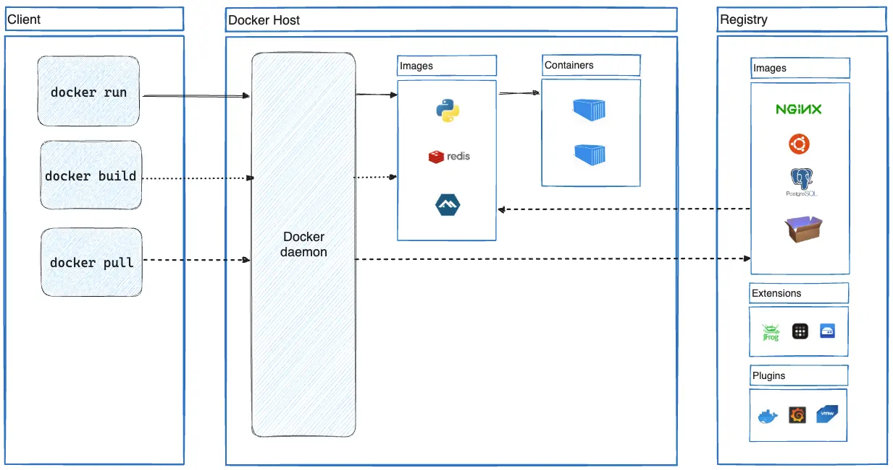
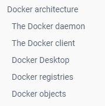
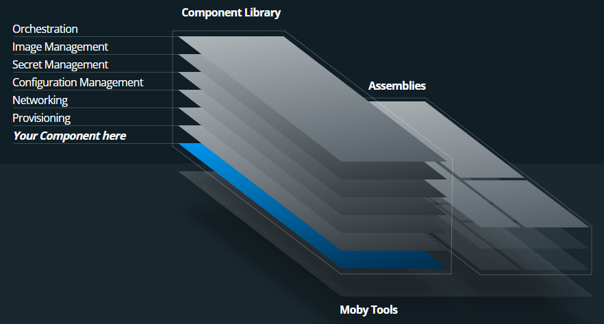

# docker

## 1. 背景

1. 虚拟化技术的发展；
2. 基于虚拟化技术的扩展性应用；

## 2. 架构




**Docker** 使用 Google 公司推出的 [Go 语言](https://golang.google.cn/) 进行开发实现，基于 Linux 内核的 [cgroup](https://zh.wikipedia.org/wiki/Cgroups)，[namespace](https://en.wikipedia.org/wiki/Linux_namespaces)，以及 [OverlayFS](https://docs.docker.com/storage/storagedriver/overlayfs-driver/) 类的 [Union FS](https://en.wikipedia.org/wiki/Union_mount) 等技术，对进程进行封装隔离，属于 [操作系统层面的虚拟化技术](https://en.wikipedia.org/wiki/Operating-system-level_virtualization)。由于隔离的进程独立于宿主和其它的隔离的进程，因此也称其为容器。最初实现是基于 [LXC](https://linuxcontainers.org/lxc/introduction/)，从 0.7 版本以后开始去除 LXC，转而使用自行开发的 [libcontainer](https://github.com/docker/libcontainer)，从 1.11 版本开始，则进一步演进为使用 [runC](https://github.com/opencontainers/runc) 和 [containerd](https://github.com/containerd/containerd)。

> runc 是一个 Linux 命令行工具，用于根据 [OCI 容器运行时规范](https://github.com/opencontainers/runtime-spec) 创建和运行容器。
> containerd 是一个守护程序，它管理容器生命周期，提供了在一个节点上执行容器和管理镜像的最小功能集。

**Docker** 在容器的基础上，进行了进一步的封装，从文件系统、网络互联到进程隔离等等，极大的简化了容器的创建和维护。使得 Docker 技术比虚拟机技术更为轻便、快捷。



### 2.1. Docker Daemon

### 2.2. Docker Client

### 2.3. todo

## 3. 概念

### 3.1. 镜像

**Docker 镜像** 是一个特殊的文件系统，除了提供容器运行时所需的程序、库、资源、配置等文件外，还包含了一些为运行时准备的一些配置参数（如匿名卷、环境变量、用户等）。镜像 **不包含** 任何动态数据，其内容在构建之后也不会被改变。

因为镜像包含操作系统完整的 root 文件系统，其体积往往是庞大的，因此在 Docker 设计时，就充分利用 [Union FS](https://en.wikipedia.org/wiki/Union_mount) 的技术，将其设计为分层存储的架构。所以严格来说，镜像并非是像一个 ISO 那样的打包文件，镜像只是一个虚拟的概念，其实际体现并非由一个文件组成，而是由一组文件系统组成，或者说，由多层文件系统联合组成。

镜像构建时，会一层层构建，前一层是后一层的基础。每一层构建完就不会再发生改变，后一层上的任何改变只发生在自己这一层。比如，删除前一层文件的操作，实际不是真的删除前一层的文件，而是仅在当前层标记为该文件已删除。在最终容器运行的时候，虽然不会看到这个文件，但是实际上该文件会一直跟随镜像。因此，**在构建镜像的时候，需要额外小心，每一层尽量只包含该层需要添加的东西，任何额外的东西应该在该层构建结束前清理掉**。

分层存储的特征还使得镜像的复用、定制变的更为容易。甚至可以用之前构建好的镜像作为基础层，然后进一步添加新的层，以定制自己所需的内容，构建新的镜像。

> **Docker 镜像本质上是一组文件系统**，除了包含容器运行时所需要的程序、库、资源、配置等文件，还包含了一些为运行时准备的一些配置参数（如匿名卷、环境变量、用户等）。
> 为了更好的复用、定制和扩展，镜像技术使用了分层存储技术，它的主要原理是：每一层构建完成后就不会发生改变，新的一层的构建内容只发生在当前层，后一层的构建可以依赖前一层，也就是说可以在前一层的基础上进行再构建。因此，构建镜像的最佳实践就是尽可能保证不添加任何不需要的内容。由此，也产生了 compose 技术。



### 3.2. 容器

镜像（Image）和容器（Container）的关系，就像是面向对象程序设计中的 类 和 实例 一样，镜像是静态的定义，容器是镜像运行时的实体。容器可以被创建、启动、停止、删除、暂停等。

容器的实质是进程，但与直接在宿主执行的进程不同，容器进程运行于属于自己的独立的 [命名空间](https://en.wikipedia.org/wiki/Linux_namespaces)。因此容器可以拥有自己的 root 文件系统、自己的网络配置、自己的进程空间，甚至自己的用户 ID 空间。容器内的进程是运行在一个隔离的环境里，使用起来，就好像是在一个独立于宿主的系统下操作一样。这种特性使得容器封装的应用比直接在宿主运行更加安全。也因为这种隔离的特性，很多人初学 Docker 时常常会混淆容器和虚拟机。

前面讲过镜像使用的是分层存储，容器也是如此。每一个容器运行时，是以镜像为基础层，在其上创建一个当前容器的存储层，我们可以称这个为容器运行时读写而准备的存储层为 **容器存储层**。

容器存储层的生存周期和容器一样，容器消亡时，容器存储层也随之消亡。因此，任何保存于容器存储层的信息都会随容器删除而丢失。

按照 Docker 最佳实践的要求，容器不应该向其存储层内写入任何数据，容器存储层要保持无状态化。所有的文件写入操作，都应该使用 数据卷（Volume）、或者 绑定宿主目录，在这些位置的读写会跳过容器存储层，直接对宿主（或网络存储）发生读写，其性能和稳定性更高。
数据卷的生存周期独立于容器，容器消亡，数据卷不会消亡。因此，使用数据卷后，容器删除或者重新运行之后，数据却不会丢失。

> Docker 容器的本质是进程，这个进程拥有自己的 root 文件系统、自己的网络配置、自己的进程空间，甚至自己的用户 ID 空间。并且，多个容器运行时，能够相互隔离。
> Docker 容器在运行时，实际上是以镜像为基础层，然后在它上面创建一个存储层，但这个存储层是无状态的，也就是说用户对容器的任何操作都不会被保留，可以理解为这个存储层只是一个媒介，用户对容器的读写都是通过这个媒介来完成的，并且用户产生的数据也是通过这个媒介**直接操作数据卷或是绑定的宿主目录**的。
> 思考：容器在运行时，为什么不采用在原有基础上再次添加一个存储分层？
>
> 1. 如果采用再添加一个存储分层的方式，那么就会导致每次操作容器都会产生一个新的存储层，这就会使得单个容器占用的存储空间越来越大；
> 2. 采用直接读写在数据卷或绑定的宿主目录的方式，也是遵循了“职责分离”的原则，此时就可以把容器看作是生产产品的工厂，而用户的数据就是这个工厂的产品，把工厂和产品分隔开，也有利于工厂的复用。

### 3.3. 仓库

镜像构建完成后，可以很容易的在当前宿主机上运行，但是，如果需要在其它服务器上使用这个镜像，我们就需要一个集中的存储、分发镜像的服务，Docker Registry 就是这样的服务。

一个 **Docker Registry** 中可以包含多个 **仓库**（Repository）；每个仓库可以包含多个 **标签**（Tag）；每个标签对应一个镜像。

通常，一个仓库会包含同一个软件不同版本的镜像，而标签就常用于对应该软件的各个版本。我们可以通过 <仓库名>:<标签> 的格式来指定具体是这个软件哪个版本的镜像。如果不给出标签，将以 latest 作为默认标签。

我们可以使用公开服务，也可以使用私有服务。

由于某些原因，在国内访问这些服务可能会比较慢。

国内的一些云服务商提供了针对 Docker Hub 的镜像服务（Registry Mirror），这些镜像服务被称为 **加速器**。

常见的有 [阿里云加速器](https://www.aliyun.com/product/acr?source=5176.11533457&userCode=8lx5zmtu)、[DaoCloud 加速器](https://www.daocloud.io/mirror#accelerator-doc) 等

### 3.4. 卷

### 3.5. 网络

### 3.6. 容器编排

## 4. 实践

<details class="details custom-block">

<summary> centos 平台上安装 Docker 和 Docker-compose </summary>

```bash
// 扩展阅读： yum出问题后： https://www.cnblogs.com/lxzcloud/p/18349036
// docker-registry :  https://cloud.tencent.com/developer/article/2516747

// 安装yum源的工具包
yum install -y yum-utils

// 配置docker的安装源
yum-config-manager \
--add-repo \
https://download.docker.com/linux/centos/docker-ce.repo

// 安装docker
yum install docker-ce docker-ce-cli containerd.io docker-compose-plugin -y

// 设置开机自启
systemctl enable docker


// 配置阿里云的镜像源，帮助文档： https://cr.console.aliyun.com/cn-hangzhou/instances/mirrors
mkdir -p /etc/docker
tee /etc/docker/daemon.json <<-'EOF'
{
"registry-mirrors": ["https://hpifphoh.mirror.aliyuncs.com"]
}
EOF
systemctl daemon-reload
systemctl restart docker

// 查看安装之后的docker信息，最后可以看到配置的阿里云的镜像源
[root@home ～]# docker info
Client: Docker Engine - Community
 Version:    24.0.6
 Context:    default
 Debug Mode: false
 Plugins:
  buildx: Docker Buildx (Docker Inc.)
    Version:  v0.11.2
    Path:     /usr/libexec/docker/cli-plugins/docker-buildx
  compose: Docker Compose (Docker Inc.)
    Version:  v2.21.0
    Path:     /usr/libexec/docker/cli-plugins/docker-compose

Server:
 Containers: 0
  Running: 0
  Paused: 0
  Stopped: 0
 Images: 0
 Server Version: 24.0.6
 Storage Driver: overlay2
  Backing Filesystem: xfs
  Supports d_type: true
  Using metacopy: false
  Native Overlay Diff: true
  userxattr: false
 Logging Driver: json-file
 Cgroup Driver: cgroupfs
 Cgroup Version: 1
 Plugins:
  Volume: local
  Network: bridge host ipvlan macvlan null overlay
  Log: awslogs fluentd gcplogs gelf journald json-file local logentries splunk syslog
 Swarm: inactive
 Runtimes: io.containerd.runc.v2 runc
 Default Runtime: runc
 Init Binary: docker-init
 containerd version: 61f9fd88f79f081d64d6fa3bb1a0dc71ec870523
 runc version: v1.1.9-0-gccaecfc
 init version: de40ad0
 Security Options:
  seccomp
   Profile: builtin
 Kernel Version: 3.10.0-1160.71.1.el7.x86_64
 Operating System: CentOS Linux 7 (Core)
 OSType: linux
 Architecture: x86_64
 CPUs: 8
 Total Memory: 23.26GiB
 Name: home.centos
 ID: bf0036ec-e56a-4c78-ae07-d8e224f11480
 Docker Root Dir: /var/lib/docker
 Debug Mode: false
 Experimental: false
 Insecure Registries:
  127.0.0.0/8
 Registry Mirrors:
  https://hpifphoh.mirror.aliyuncs.com/
 Live Restore Enabled: false

// 查看docker的版本信息
[root@home ~]# docker version
Client: Docker Engine - Community
 Version:           24.0.6
 API version:       1.43
 Go version:        go1.20.7
 Git commit:        ed223bc
 Built:             Mon Sep  4 12:35:25 2023
 OS/Arch:           linux/amd64
 Context:           default

Server: Docker Engine - Community
 Engine:
  Version:          24.0.6
  API version:      1.43 (minimum version 1.12)
  Go version:       go1.20.7
  Git commit:       1a79695
  Built:            Mon Sep  4 12:34:28 2023
  OS/Arch:          linux/amd64
  Experimental:     false
 containerd:
  Version:          1.6.24
  GitCommit:        61f9fd88f79f081d64d6fa3bb1a0dc71ec870523
 runc:
  Version:          1.1.9
  GitCommit:        v1.1.9-0-gccaecfc
 docker-init:
  Version:          0.19.0
  GitCommit:        de40ad0

```

```bash
# 下载docker compose
curl -SL https://github.com/docker/compose/releases/download/v2.17.2/docker-compose-linux-x86_64 -o /usr/local/bin/docker-compose
# 添加可执行权限
chmod +x /usr/local/bin/docker-compose
# 将文件copy到 /usr/bin/目录下
ln -s /usr/local/bin/docker-compose /usr/bin/docker-compose

# 查看版本
docker-compose --version

```

</details>

## 常用命令

```sh

# ---------- 镜像管理
docker pull
docker images
docker rmi 991 # 删除镜像


# ---------- 容器管理
docker ps -a
docker stop redis
docker rm 88f # 删除容器
docker update mysql --restart=always # 自动重启

# ---------- 安装示例
docker run -p 3306:3306 --name mysql \
-v /mydata/mysql/log:/var/log/mysql \
-v /mydata/mysql/data:/var/lib/mysql \
-v /mydata/mysql/conf:/etc/mysql \
-e MYSQL_ROOT_PASSWORD=root \
-d mysql:5.7


# ---------- 日志
docker logs d2d
docker logs -f -t --tail 100 529a4d9afd8e

# 重新安装nginx，先删除容器，再重新执行
docker exec -it 4992272fdf45 /bin/bash  # 进入容器内部
docker cp host_path containerID:container_path # 从主机复制到容器


```

## 6. 参考

- [Docker overview](https://docs.docker.com/get-started/overview/#running-more-workloads-on-the-same-hardware) - 官网
- [Docker-从入门到实践](https://yeasy.gitbook.io/docker_practice/)
- [Docker 教程（图文讲解）](https://www.quanxiaoha.com/docker/docker-tutorial.html)
- [pdaiTeck-Docker](https://pdai.tech/md/devops/docker/docker-00-overview.html)
-
