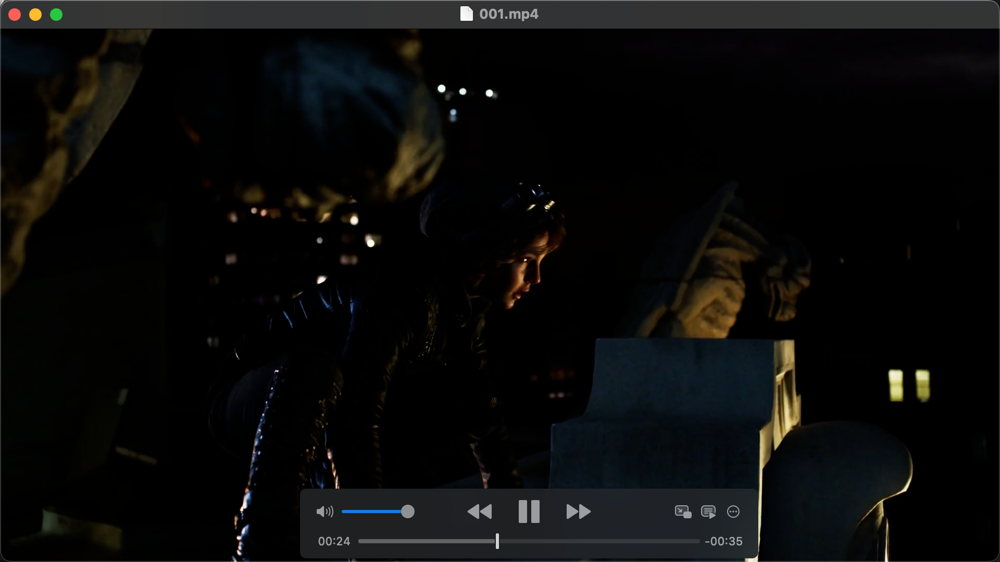
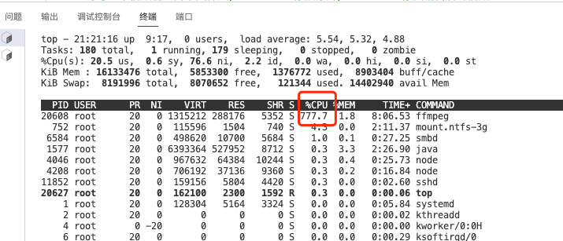

## 概述

自己搞个自媒体账号，想着上传一些什么视频呢，思来想去，就选择了影视剪辑视频号的类目。那现在要做的事情基本就确定下来了。

1. 从网上找到合适的影视资源；
2. 对这些影视资源进行切片，切片后可能还需要进行编辑，比如需要调整视频比例（调整成手机显示的比例）、添加一些文字信息（如，第几集......）、进行一些画中画编辑等；
3. 对切片后的资源进行上传，之后就是运营的过程了；

在自己的 mac 电脑上实践了一番之后，发现很多都是重复性的工作，之后想有没有专门的视频剪辑软件，我把重复性工作的一些步骤罗列出来，之后让编辑软件自己操作，之后我只需要对导出的剪辑后的视频进行上传操作。后来了解到有一个专门的视频剪辑工具——ffmpeg，之后在网上查了一些资料，并在自己的 mac 上进行一些实践操作，发现在实践操作过程中，mac 的风扇呼呼的想。于是就想自己不是还有一台电脑嘛，干嘛不用起来呢。说干就干。

另一台电脑是 centos 系统。所以只需要写一个 shell 脚本，外加一个 ffmpeg 工具包就行了。

## ffmepg 的安装

网上所能查出来的安装方式有这么几种方式，一种是直接使用源代码进行编译，这种方式需要 centos 具有 c++的编译安装环境，有可能还需要一些常用编解码器的安装环境，过程较为复杂，并且后续的使用过程中可能会出现找不到具体编解码器的问题；第二种方式则是使用 yum 安装，这种方式安装的版本却不是最新的版本；我采用的是第三种安装方式，这种安装方式是通过一个开源项目得出的。这种方式版本较新，并且编解码器也比较齐全，最重要的是安装方式最简单。

这里只提供安装的思路：根据 a-schild/jave2 的思路，直接下载这个包下面的运行文件即可。如，mac 上直接下载 jave-nativebin-osxm1/src/main/resources/ws/schild/jave/nativebin/ffmpeg-aarch64-osx ，下载到本地之后，然后配置一下环境变量即可。

## 自动化脚本

我想要的效果其实也挺简单，就是我配置一下相关变量，之后执行脚本，就可以自动完成相关工作。下面是脚本：

```
#!/bin/bash

basePath=/mnt/e/temp/Gotham/
seasonPath=S01
cd $basePath$seasonPath


videoNameWithoutExt=.mp4
eachSliceLength=60000
bottomText='follow for more'

for k in *;
do
    eposideName=`echo "$k" | cut -d'.' -f1`

    topText="Gotham-"$seasonPath$eposideName
    videoFilePath=$basePath$seasonPath"/"$eposideName$videoNameWithoutExt
    sliceVideoOutFolderPath=$basePath$seasonPath"/"$eposideName"/slices"
    editedVideoOutFolderPath=$basePath$seasonPath"/"$eposideName"/edited"

    # 为每一个视频创建两个文件夹， slices-存放分片， edited-存放编辑后的视频
    mkdir -p $sliceVideoOutFolderPath
    mkdir -p $editedVideoOutFolderPath

    # 获取视频的总长度（单位，毫秒）
    videoLength=$(ffmpeg -i $videoFilePath  2>&1 | grep 'Duration' | \
    cut -d ' ' -f 4 | sed s/,// | sed 's@\*@@g' | \
    awk '{ split($1, A, ":");print A[1]*60*60*1000 + A[2]*60*1000 + A[3]*1000}')

    echo "$eposideName 's length is: $videoLength ms"

    startTime=0
    endTime=0
    i=0

    # 对每一个视频进行分片和高斯模糊
    while [ $endTime -le $videoLength ]; do
        i=$[$i+1]
    	endTime=$[$startTime+$eachSliceLength]
        num=`echo $i | awk '{printf("%03d",$0)}'`;

        sliceName=$sliceVideoOutFolderPath"/"$num$videoNameWithoutExt
        editeName=$editedVideoOutFolderPath"/"$num$videoNameWithoutExt

        # 视频上半部分上的 文字
        topValue=$topText" Part "$num
        echo "========== start: $topValue, startTime: $startTime ms, endTime: $endTime ms, slice: $sliceName, edite: $editeName"

        # 对视频进行分片
        ffmpeg -y -i $videoFilePath -ss $startTime"ms" -to $endTime"ms" -c:a copy -vcodec libx264 -keyint_min 2 -g 1 $sliceName

        # 高斯模糊后输出
        ffmpeg -i $sliceName \
        -vf "split[fg0][bg0];[bg0]scale=h=1280:w=720,boxblur=10:10[bg1];[fg0]scale=720:(720*ih/iw)[fg1];[bg1][fg1]overlay=0:(H-h)/3,setdar=9/16,drawtext=fontfile=msyh.ttc:text='$topValue':x=(w-text_w)/2:y=(h-text_h)/8:fontsize=50:fontcolor=yellow,drawtext=fontfile=msyh.ttc:text='$bottomText':x=(w-text_w)/2:y=5*(h-text_h)/8:fontsize=50:fontcolor=yellow" \
        -y $editeName

        startTime=$[endTime]
    done

done

```

运行时的命令：

```
# 执行时的命令， 表示后台执行命令，并把命令结果输出到 result.log 文件中
[root@home temp]# nohup ./slices01.sh > result.log 2>&1 &
```




## 题外话

ffmpeg 真的很耗费 cpu 资源，可以根据显卡等相关硬件，修改 ffmpeg 的命令，编解码过程进行加速。



##

---

## 使用图片生成短视频 - 说明

想写一个脚本来实现一种效果： 截的图放到本地磁盘的某个目录下面，然后根据截的图生成对应的短视频，最后把图片进行归档。

## 准备工作

- ffmpeg 软件工具
- git 工具
- 由于要生成短视频，所以还要准备一个 bgm；

## 脚本

```
#!/bin/bash

#######################################
# 从一个文件夹中读取 png 文件，然后生成一个 6s 中的抖音视频
#######################################

parentFolder=/d/Moonlight/001-culture/
nutStoreFolder=/d/Moonlight/Nutstore/

# 以日期创建 视频输出文件夹
nowdate=`date +%Y-%m-%d`
videosFolder=$nutStoreFolder$nowdate
arcvFolder=$parentFolder$nowdate
mkdir -p $videosFolder $arcvFolder

pngFolder=$parentFolder"pic"
cd $pngFolder

# 获取 背景音乐 文件
bgmFolder=$parentFolder"bgm/"
bgmFile=$bgmFolder"bgm.mp3"
echo $bgmFile


for i in *; do

    pngFile=$pngFolder"/"$i
    echo $pngFile

    name=`echo "$i" | cut -d'.' -f1`
    videoName=$name".mp4"
    videoFile=$videosFolder"/"$videoName
    echo $videoFile

    # 读取 png 图片，并输出视频
    ffmpeg -threads 2 -loop 0 -y -r 0.7 \
    -i $pngFile \
    -i $bgmFile \
    -t 6 -absf aac_adtstoasc \
    -vf "scale='if(gt(a*sar,9/16),576,1024*iw*sar/ih)':'if(gt(a*sar,9/16),576*ih/iw/sar,1024)',pad=576:1024:(ow-iw)/2:(oh-ih)/2,setsar=1" \
    -vcodec libx264 -pix_fmt yuv420p -r 30 $videoFile -hide_banner

    sleep 2s

    # 把 png 图片归档
    mv $pngFile $arcvFolder"/"
done

```

## 完善

由于会定期保存一些图片，并且也希望这些图片生成对应的短视频，因此还想要完成：只需要手动往图片文件夹内添加图片，执行脚本的过程自动化。因此，需要操作系统自动执行上面写的脚本。

所以，直接在 windows 平台上使用“任务计划...”进行操作即可。
