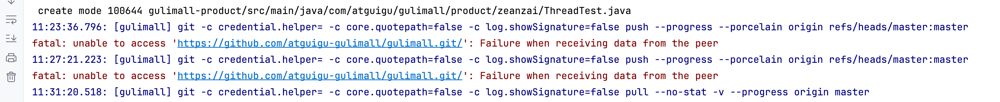
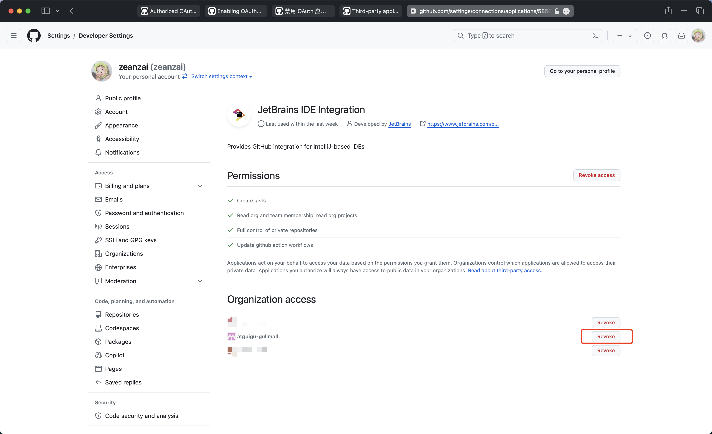

# CVS 之 Git 与 Github


## 安装过程

```sh
- 查看 yum 库中的版本：
yum info git

- 查看是否安装
git --version

- 安装依赖包
yum install -y curl-devel expat-devel gettext-devel openssl-devel zlib-devel gcc perl-ExtUtils-MakeMaker

- 查看是否安装
git --version

- 卸载旧版本
yum remove git

- 下载 https://github.com/git/git/releases

- 上传到制定目录

- 解压
tar zxf git-2.18.0.tar.gz

- 安装
make prefix=/usr/setup/git_2.18.0 all
make prefix=/usr/setup/git_2.18.0 install

- 配置环境变量
vi /etc/profile

export GIT_HOME=/usr/setup/git_2.18.0
export PATH=$PATH:$GIT_HOME/bin
source /etc/profile

- 查看是否安装
git --version

- 配置
git config --global user.name "zeanzai"
git config --global user.email "438123371@qq.com"
```

## Git 常用命令

```bash
# git 的帮助文档
$ git

# 生成key，在命令行里面填写文件名，
# 多个key使用用户名进行区分， 如： id_rsa_vongdefu
# 通常情况下一台主机使用一个key即可
ssh-keygen -t ed25519 -C "your.email@example.com"


# 为每一个仓库设置用户名和邮箱
#   只需要在仓库目录下执行即可
git config user.name "Your Name"
git config user.email "your.email@example.com"
#   之后在 .git/config 可以看到设置后的用户名和邮箱

# 全局配置，最好不要进行这个操作
git config --global user.name zeanzai
git config --global user.email "zeanzai.me@gmail.com"
git config --global http.proxy 127.0.0.1:7890

## 全局配置
git config --global user.name '你的名字'
git config --global user.email '你的邮箱'

## 当前仓库配置
git config --local user.name '你的名字'
git config --local user.email '你的邮箱'

## 删除 global 配置
git config --unset --global 要删除的配置项
## 删除当前仓库配置
git config --unset --local 要删除的配置项

# 注意：如果是需要身份验证的，就用这种格式：
git config --global http.proxy 用户名:密码@IP:端口
# 如果需要设置https，那么就需要把 http.proxy 改成 https.proxy
git config --global https.proxy 127.0.0.1:7890

# 查看一下配置
git config --global --list


# 测试
ssh -T git@github.com
ssh -T git@gitee.com

# 使用git克隆私有仓库
git clone --branch master https://x-access-token:${{ secrets.PAT_TOKEN }}@github.com/vongdefu/vongdefu-dochub.git vongdefu-dochub

# ssh
ssh-copy-id -i ./id_ed25519.pub root@192.168.1.150

# 空仓库
mkdir test
cd test
git init
touch README.md
git add README.md
git commit -m "first commit"
git remote add origin https://gitee.com/zeanzai/test.git
git push -u origin "master"

# 已有仓库
cd existing_git_repo
git remote add origin https://gitee.com/zeanzai/test.git
git push -u origin "master"

# 分支管理 ---------------------------------------------------------------------
## 创建并切换到新分支
git checkout -b ${{branch_name}}

## 查看当前工作分支及本地分支
git branch -v

## 查看本地和远端分支
git branch -av

## 查看远端分支
git branch -rv

## 切换到指定分支
git checkout 指定分支

## 基于当前分支创建新分支
git branch 新分支

## 基于指定分支创建新分支
git branch 新分支 指定分支

## 基于某个 commit 创建分支
git branch 新分支 某个 commit 的 id

## 创建并切换到该分支
git checkout -b 新分支

## 安全删除本地某分支
git branch -d 要删除的分支

## 强行删除本地某分支
git branch -D 要删除的分支

## 删除已合并到 master 分支的所有本地分支
git branch --merged master | grep -v '^\*\| master' | xargs -n 1 git branch -d

## 删除远端 origin 已不存在的所有本地分支
git remote prune orign

## 将 A 分支合入到当前分支中且为 merge 创建 commit
git merge A 分支

## 将 A 分支合入到 B 分支中且为 merge 创建 commit
git merge A 分支 B 分支

## 将当前分支基于 B 分支做 rebase，以便将 B 分支合入到当前分支
git rebase B 分支

## 将 A 分支基于 B 分支做 rebase，以便将 B 分支合入到 A 分支
git rebase B 分支 A 分支


# 变更历史 ---------------------------------------------------------------------
## 当前分支各个 commit 用一行显示
git log --oneline

## 显示就近的 n 个 commit
git log -n

## 用图示显示所有分支的历史
git log --oneline --graph --all

## 查看涉及到某文件变更的所有 commit
git log 文件

## 某文件各行最后修改对应的 commit 以及作者
git blame 文件


# 标签操作 ---------------------------------------------------------------------
## 查看已有标签
git tag

## 新建标签
git tag v1.0

## 新建带备注标签
git tag -a v1.0 -m '前端食堂'

## 给指定的 commit 打标签
git tag v1.0 commitid

## 推送一个本地标签
git push origin v1.0

## 推送全部未推送过的本地标签
git push origin --tags

## 删除一个本地标签
git tag -d v1.0

## 删除一个远端标签
git push origin :refs/tags/v1.0

# 远端交互 ---------------------------------------------------------------------
## 查看所有远端仓库
git remote -v

## 添加远端仓库
git remote add url

## 删除远端仓库
git remote remove remote 的名称重命名远端仓库
git remote rename 旧名称 新名称

## 将远端所有分支和标签的变更都拉到本地
git fetch remote

## 把远端分支的变更拉到本地，且 merge 到本地分支
git pull origin 分支名

## 将本地分支 push 到远端
git push origin 分支名

## 删除远端分支
git push remote --delete 远端分支名
git push remote :远端分支名


```

## Github 特殊场景

### 克隆 GitHub 私有仓库

1. 需要在用户的配置页面中配置一个 PAT（personal access token）；
2. 在 仓库的 url 中配置上这个 PAT ： 见上面
3. 如果私有仓库需要使用 GitHubActions，则还需要
   1. 根据 peaceiris/actions-gh-pages@v3 的[要求](https://github.com/peaceiris/actions-gh-pages)，在仓库的 setting 中设置 action 的权限，设置为可读写
   2. 在仓库的 setting 中配置上面这个生成的 PAT ；

### 合并提交记录

```txt
# 1. 拉取最新代码
git checkout master
git pull origin master

# 2. 启动交互式 rebase（假设要合并全部提交）
git rebase -i --root

# 3. 在打开的编辑器中：
# 将第一个提交前的 "pick" 保留
# 其他所有提交前的 "pick" 改为 "squash" 或简写 "s"
# 保存退出编辑器

# 4. 处理合并提交信息（会打开新编辑器）
# 删除所有旧提交信息，写入新提交信息
# 保存退出

# 5. 强制推送更新（⚠️ 重要警告：这会重写历史）
git push origin master --force
```

---

1. Git 架构

## 更换 main 分支为 master

1. 修改默认分支为 master


2. 修改本地分支


```java
git branch -m main master
git fetch origin
git branch -u origin/master master
git remote set-head origin -a

```

## mac 上使用 idea 上传代码到远程出错

问题：使用 idea 向远程组织内的某个仓库提交代码报错。



问题描述：在使用 iterm 克隆一个组织内的仓库并没有问题，导入到 idea ，修改后再次提交却出现了问题。原因是组织内仓库的提交过程与原本单属于自己的游离仓库的提交过程不一样。我们在 idea 的提交窗口中，发现需要我们先进行认证，我们点开 idea 中弹出的浏览器窗口，会自动完成认证。但是再次提交时，依然会报上面的问题。这是因为我们点击的认证过程，只是告诉 GitHub 我们要使用 idea 进行开发项目了。但是由于组织是默认开启严格的 OAuth app 权限限制的，因此我们还需要把 idea 与我们的组织关联起来。

问题解决：



结果如下：


Appendix： GitHub 已经认证过的 app


## GitHub 工作流

Github 为我们提供了搭建个人网站的可能性，我们可以通过 markdown+静态网站生成工具生成静态网站的源代码，然后上传到 GitHub 上，加上一些配置，就可以搭建成功。

但是在这个过程中，有很多动作是每次更新时都要操作的，比如在个人网站上添加一个新的 markdown 文档，这个时候我们的动作包括：

1. 本地生成静态页面；
2. 把生成的页面和 markdown 源文件上传至远程仓库；

事实上，我们可以采取一些工作流的方式，GitHub 也为我们提供了解放生产力的方式，这种方式就是工作流。

下面是之前搭建网站时用到的工作流：

::: details 持续集成

```yml
name: 🚀 持续集成

on:
  push:
    branches:
      - master
    paths:
      - "defu/"

jobs:
  build-and-deploy:
    runs-on: ubuntu-latest
    steps:
      - name: 🥝 检出 master 分支，到虚拟机的 private-repo 文件夹
        uses: actions/checkout@v4
        with:
          path: private-repo

      - name: 🍌 克隆公有仓库 vongdefu.github.io 到虚拟机的 public-repo 文件夹
        run: |
          git clone https://x-access-token:${{ secrets.PAT_TOKEN }}@github.com/vongdefu/vongdefu.github.io.git public-repo

      - name: 🍒 同步 private-repo 和 public-repo ， 并推送到 vongdefu.github.io
        run: |
          rsync -av --delete --exclude=".*" private-repo/defu/ public-repo/
          cd public-repo
          git config user.name "GitHub Actions"
          git config user.email "actions@github.com"
          git add .
          git commit -m "Trigger: ${{ github.sha }}， ${{ github.event.head_commit.message }} "
          git push origin master

      - name: 🍏 检出 hope 分支
        uses: actions/checkout@v3
        with:
          persist-credentials: false
          ref: hope # 指定检出 hope 分支

      - name: 🍓 检出 master 分支， 并放到 src 下面
        run: |
          git clone --branch master https://x-access-token:${{ secrets.PAT_TOKEN }}@github.com/vongdefu/vongdefu-dochub.git vongdefu-dochub
          mv ./vongdefu-dochub/defu/* ./src/

      - name: 🥭 设置 Node.js
        uses: actions/setup-node@v3
        with:
          node-version: 18
          cache: npm

      - name: 🍅 安装依赖
        env:
          NODE_OPTIONS: --max_old_space_size=8192
        run: |
          npm install 
          npm run docs:build

      - name: 🍆 部署到公共仓库
        uses: peaceiris/actions-gh-pages@v3
        with:
          personal_token: ${{ secrets.PAT_TOKEN }}
          external_repository: vongdefu/vongdefu.github.io
          publish_branch: gh-pages
          publish_dir: src/.vuepress/dist
          force_orphan: true
          allow_empty_commit: true
          full_commit_message: ${{ github.event.head_commit.message }}
```

:::

## jenkins 工作流

- tomcat 启动中

- 移动 war 包到 webapps 下

- 浏览器中输入

`http://10.168.0.120:8080/jenkins`

- 初始化安装

- 全局工具设置

```
jdk： jdk1.8.0_144
      /usr/setup/jdk1.8.0_144

maven： apache-maven-3.5.4
        /usr/setup/apache-maven-3.5.4
```

- 新建任务

```
输入任务名->自由风格->丢弃旧的构建->Subversion->轮询SCM（H 2 * * *）->构建（clean package -DskipTests）->执行shell（cp target/*.war /usr/setup/latestTomcat/webapps/）
```

- 执行构建

```
查看控制台输出
当然是未成功了
因为没有下载pom中依赖的jar
需要进入工作区（/usr/setup/apache-tomcat-8.5.32/.jenkins/workspace），手动执行 compile 、 package、clean package等目标（目的是为了下载仓库jar）
```

- 执行完成之后

需要将 target 文件夹删除

- 再次构建

如果还没有成功，就是因为没有下载好 jar，需要执行 mvn 的相关目标，或将开发环境下面的仓库拷贝到服务器上

- 构建成功

```
构建成功，但是tomcat没有启动成功，查看catalina.out 日志
（日志文件更改所属文件夹的属性）
```
