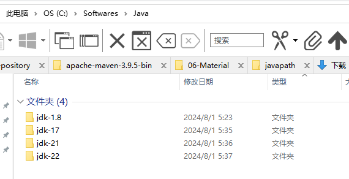
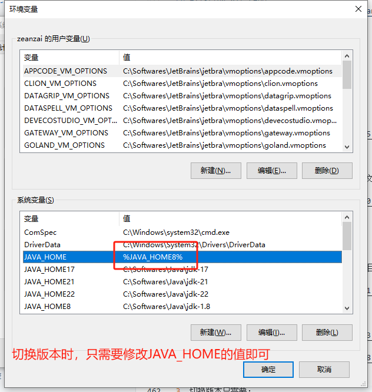

# jdk

## mac 上安装 jdk

```bash
/usr/libexec/java_home -V

/Library/Java/JavaVirtualMachines/zulu-8.jdk/Contents/Home
```

## windows 上安装 jdk

1. 依次安装 jdk1.8、jdk17、jdk21、jdk22，安装目录为： C:\Softwares\Java ， 如下图

   

2. 创建系统变量： 分别是 JAVA_HOME8 、 JAVA_HOME17 、 JAVA_HOME21 、 JAVA_HOME22 ，并且把值设置为各个版本的实际安装主目录，例如： java8 的安装主目录为： C:\Softwares\Java\java-1.8， 则 JAVA_HOME8 的值即为： C:\Softwares\Java\java-1.8，其它类似；接着再设置一个系统变量 JAVA_HOME，值为要使用的版本，例如要使用 17 的版本，那么 JAVA_HOME 的值即为： %JAVA_HOME17%；最后修改 Path 变量，添加一行： %JAVA_HOME%\bin ，如果 Path 中包含 C:\Program Files\Common Files\Oracle\Java\javapath ，那么调整位置，把%JAVA_HOME%\bin 调整为在 C:\Program Files\Common Files\Oracle\Java\javapath 上面。

   

   

3. 切换版本只需要修改 JAVA_HOME 的值即可，即： JAVA_HOME = %JAVA_HOME17%

   

## centos 上安装 jdk

- 服务器在安装时，如果没有选中最小化安装，有可能会自带了 openjdk，再安装前，需要把 openjdk 卸载。

- 注意要先卸载原来的 OpenJDK， https://www.cnblogs.com/yyjf/p/10287301.html

```shell
// 查看Java
java -version

// 查看有哪些安装包
rpm -qa | grep java

// 卸载
rpm -e --nodeps java-1.8.0-openjdk-1.8.0.101-3.b13.el7_2.x86_64
rpm -e --nodeps java-1.7.0-openjdk-headless-1.7.0.111-2.6.7.2.el7_2.x86_64
rpm -e --nodeps java-1.8.0-openjdk-headless-1.8.0.101-3.b13.el7_2.x86_64
rpm -e --nodeps java-1.7.0-openjdk-1.7.0.111-2.6.7.2.el7_2.x86_64

// 删除完毕，测试
rpm -qa | grep java

# 以下命令均没有输出
java -version
java
javac

// 开始安装 ============================================================
// 把下载好的jdk安装包上传至 centos
➜  Downloads scp -r jdk-8u144-linux-x64.tar.gz root@192.168.1.150:/mnt/doc/package

// 解压到安装路径下
[root@home jdk1.8.0_144]# tar zxvf /mnt/doc/package/jdk-8u144-linux-x64.tar.gz -C /usr/setup/

// 修改环境变量
[root@home jdk1.8.0_144]# vi /etc/profile

// 最后一行添加
export JAVA_HOME=/usr/setup/jdk1.8.0_144
export JRE_HOME=$JAVA_HOME/jre
export CLASSPATH=./:$JAVA_HOME/lib:$JAVA_HOME/jre/lib
export PATH=$PATH:$JAVA_HOME/bin

// 使环境变量生效
[root@home jdk1.8.0_144]# source /etc/profile
```

- 使用 rpm 包的方式进行安装

```sh
# 安装
rpm -ivh jdk-8u231-linux-x64.rpm

# 验证
java -version
java
javac

# 查找安装的地址
find / -name java
/etc/pki/ca-trust/extracted/java
/etc/pki/java
/etc/alternatives/java
/var/lib/alternatives/java
/usr/bin/java
/usr/java
/usr/java/jdk1.8.0_231-amd64/bin/java
/usr/java/jdk1.8.0_231-amd64/jre/bin/java
```
