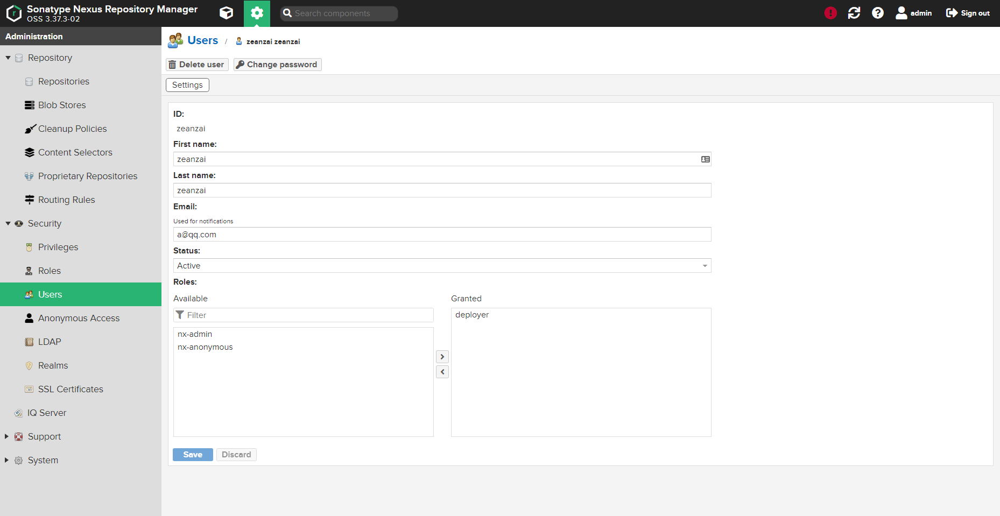
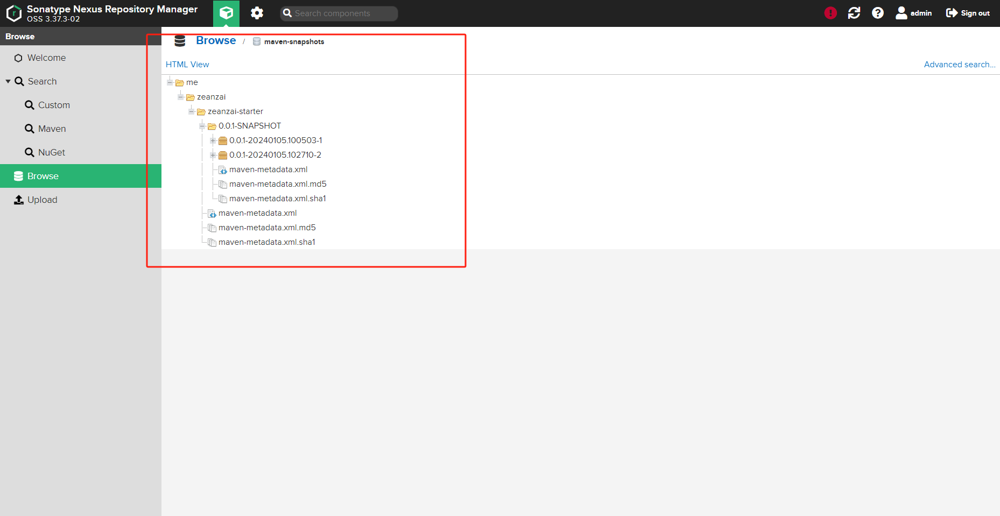
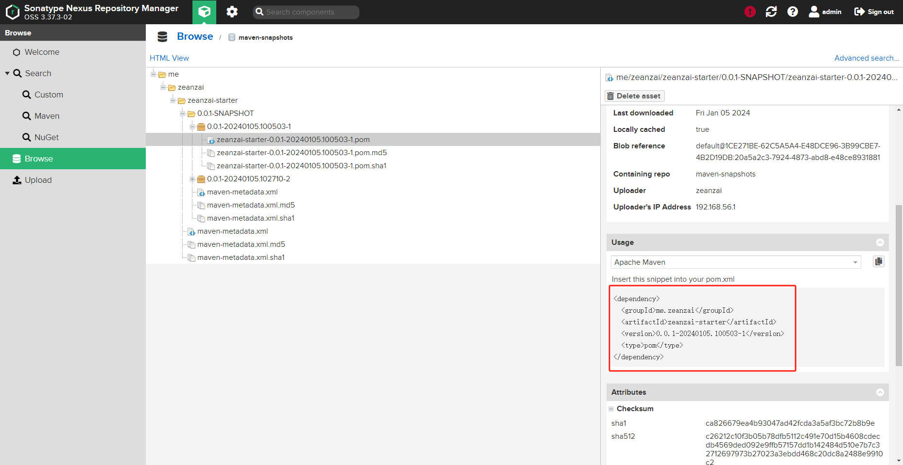

大纲：

1. Maven 没有出现之前遇到的问题？
2. Maven 主要作用是个啥？
3. 安装与配置（安装过程、配置本地仓库地址、配置 profile、配置阿里源、配置私服）
4. Maven 概念
   1. 约定大于配置： 项目文档目录、软件生命周期管理、依赖关系（继承和聚合）、项目模块类型（Web、Java）
   2. 配置文件讲解
   3. POM
   4. 坐标
   5. 依赖排除
5. 下载 jar 的原理

## centos 上安装 Maven

- 解压

```shell
tar -zxf apache-maven-3.5.4-bin.tar.gz -C /usr/setup/
```

- 配置环境变量

```shell
vi /etc/profile

export MAVEN_HOME=/usr/setup/apache-maven-3.5.4
export PATH=$PATH:$JAVA_HOME/bin:$MAVEN_HOME/bin
```

- 使环境变量生效

```shell
source /etc/profile
```

- 测试

```shell
mvn -version
```

- 修改仓库地址

```shell
mkdir /opt/repository
vi /usr/setup/apache-maven-3.5.4/conf/settings.xml

<localRepository>/opt/repository</localRepository>
```

## windows

1. 解压安装包到指定目录
2. 修改配置文件：

   ```xml
   // 1. 修改仓库地址
   <localRepository>D:\00-home\repository</localRepository>

   // 2. 新增核心仓库地址
   <mirror>
   <id>alimaven</id>
   <name>aliyun maven</name>
   <!-- https://maven.aliyun.com/repository/public/ -->
   <url>http://maven.aliyun.com/nexus/content/groups/public/</url>
   <mirrorOf>central</mirrorOf>
   </mirror>

   // 3. 新增全局profile
   <!-- 全局JDK1.8配置 -->
   <profile>
       <id>jdk1.8</id>
       <activation>
           <activeByDefault>true</activeByDefault>
           <jdk>1.8</jdk>
       </activation>
       <properties>
           <project.build.sourceEncoding>UTF-8</project.build.sourceEncoding>
           <maven.compiler.source>1.8</maven.compiler.source>
           <maven.compiler.target>1.8</maven.compiler.target>
           <maven.compiler.compilerVersion>1.8</maven.compiler.compilerVersion>
       </properties>
   </profile>

   <!-- 阿里云配置: 提高国内的jar包下载速度 -->
   <profile>
       <id>ali</id>
       <repositories>
           <repository>
               <id>alimaven</id>
               <name>aliyun maven</name>
               <url>http://maven.aliyun.com/nexus/content/groups/public/</url>
               <releases>
                   <enabled>true</enabled>
               </releases>
               <snapshots>
                   <enabled>true</enabled>
               </snapshots>
           </repository>
       </repositories>
       <pluginRepositories>
           <pluginRepository>
           <id>alimaven</id>
           <name>aliyun maven</name>
           <url>http://maven.aliyun.com/nexus/content/groups/public/</url>
           </pluginRepository>
       </pluginRepositories>
   </profile>

   // 4. 使全局profile生效
   <activeProfiles>
   <activeProfile>jdk1.8</activeProfile>
   <activeProfile>ali</activeProfile>
   </activeProfiles>

   ```

## 配置

1. 修改 jar 文件在本地的位置

   ```xml
   <localRepository>D:\04.repository</localRepository>
   ```

2. 修改为阿里源

   ```xml
   <mirror>
       <id>alimaven</id>
       <name>aliyun maven</name>
       <!-- https://maven.aliyun.com/repository/public/ -->
       <url>http://maven.aliyun.com/nexus/content/groups/public/</url>
       <mirrorOf>central</mirrorOf>
   </mirror>

   ```

3. 设置配置文件，并使其生效

   ```xml
   <profiles>

       <!-- 全局JDK1.8配置 -->
       <profile>
           <id>jdk1.8</id>
           <activation>
               <activeByDefault>true</activeByDefault>
               <jdk>1.8</jdk>
           </activation>
           <properties>
               <project.build.sourceEncoding>UTF-8</project.build.sourceEncoding>
               <maven.compiler.source>1.8</maven.compiler.source>
               <maven.compiler.target>1.8</maven.compiler.target>
               <maven.compiler.compilerVersion>1.8</maven.compiler.compilerVersion>
           </properties>
       </profile>

       <!-- 阿里云配置: 提高国内的jar包下载速度 -->
       <profile>
           <id>ali</id>
           <repositories>
               <repository>
                   <id>alimaven</id>
                   <name>aliyun maven</name>
                   <url>http://maven.aliyun.com/nexus/content/groups/public/</url>
                   <releases>
                       <enabled>true</enabled>
                   </releases>
                   <snapshots>
                       <enabled>true</enabled>
                   </snapshots>
               </repository>
           </repositories>
           <pluginRepositories>
               <pluginRepository>
               <id>alimaven</id>
               <name>aliyun maven</name>
               <url>http://maven.aliyun.com/nexus/content/groups/public/</url>
               </pluginRepository>
           </pluginRepositories>
       </profile>
   </profiles>

   <activeProfiles>
       <activeProfile>jdk1.8</activeProfile>
       <activeProfile>ali</activeProfile>
   </activeProfiles>

   ```

4. 设置私服用户名和仓库地址

   ```xml
   <servers>
        <server>
            <id>releases</id>
            <username>zeanzai</username>
            <password>root1003</password>
        </server>
        <server>
            <id>snapshots</id>
            <username>zeanzai</username>
            <password>root1003</password>
        </server>
   </servers>


   <profile>
       <id>dev</id>
       <repositories>
           <repository>
               <id>nexus</id>
               <url>http://192.168.56.10:8081/repository/maven-public/</url>
               <releases>
                   <enabled>true</enabled>
               </releases>
               <snapshots>
                   <enabled>true</enabled>
               </snapshots>
           </repository>
       </repositories>
       <pluginRepositories>
           <pluginRepository>
           <id>public</id>
           <name>Public Repositories</name>
           <url>http://192.168.56.10:8081/repository/maven-public/</url>
           </pluginRepository>
       </pluginRepositories>
   </profile>
   ```

## 完整的 settings.xml 文件

<!-- @include: ./maven/include/settings_jingjian.xml-->

## 私服

> 有时候，我们会把某个公告的模块上传到我们的私服中，然后让团队其他成员使用或其他模块使用。这个时候就需要用到私服了。

1. 新增角色

   

2. 新增用户

   

3. 配置本地 settings.xml

   ```xml
   <servers>
       <server>
           <id>releases</id>
           <username>zeanzai</username>
           <password>root1003</password>
       </server>
       <server>
           <id>snapshots</id>
           <username>zeanzai</username>
           <password>root1003</password>
       </server>
   </servers>


   <profile>
       <id>dev</id>
       <repositories>
           <repository>
               <id>nexus</id>
               <url>http://192.168.56.10:8081/repository/maven-public/</url>
               <releases>
                   <enabled>true</enabled>
               </releases>
               <snapshots>
                   <enabled>true</enabled>
               </snapshots>
           </repository>
       </repositories>
       <pluginRepositories>
           <pluginRepository>
               <id>public</id>
               <name>Public Repositories</name>
               <url>http://192.168.56.10:8081/repository/maven-public/</url>
           </pluginRepository>
       </pluginRepositories>
   </profile>

   <activeProfile>dev</activeProfile>

   ```

4. 配置 pom 文件

   ```xml
   <distributionManagement>
       <repository>
           <id>releases</id>   <!-- 这里的id要和settings.xml中server部分中配置的id保持一致 -->
           <url>http://192.168.56.10:8081/repository/maven-releases/</url>
       </repository>
       <snapshotRepository>
           <id>snapshots</id>  <!-- 这里的id要和settings.xml中server部分中配置的id保持一致 -->
           <url>http://192.168.56.10:8081/repository/maven-snapshots/</url>
       </snapshotRepository>
   </distributionManagement>

   ```

5. 把模块推送到私服上

   

   

6. 其他项目引用

   

## 一些参考配置文件

- settings_origin.xml
- settings-aliyun.xml
- settings_nexus2.xml

## 参考

1. [Maven 的 settings.xml 配置阿里云及私服，拿来即用，不需修改！](https://blog.csdn.net/yw99999/article/details/118104215)
2. [彻底理解 maven + 配置私服 + 阿里云镜像](https://www.cnblogs.com/yaochunhui/p/17079526.html)
3. [Maven 仓库及镜像配置](https://blog.hanqunfeng.com/2021/12/02/maven-setting/)
