# 4. nacos 服务配置

1. 分布式服务配置的背景知识；
2. 技术选型；
3. Nacos 相关概念
4. 实战
   1. SpringBoot 获取本地配置的使用方式；
   2. 接入 Nacos 后获取分布式配置的使用方式；
      1. 基本使用方式；
      2. 共享配置文件获取配置的使用方式；
      3. 映射成 JavaBean 的使用方式；
      4. 实时更新；
5. Nacos 的最佳实践
6. 高可用

## 1. 背景知识

在实际的项目中，一般都会使用到一些配置文件，如配置数据库链接、配置 log 级别和输出方式……，在传统的单体应用中，我们一般会把配置项与项目部署文件放到一起，配置项会随着代码的修改进行部署生效。这样也无可厚非。

但是随着技术的发展，在微服务架构中，由于微服务架构具有以下特点：

1. 具有多个不同的环境，如 DEV、SIT、UAT、PRD 等；
2. 迭代周期短；
3. 配置项多而杂；
4. ……

总之，就是配置过程频繁而繁琐。此时如果还用传统单体应用管理配置项的方式来管理配置，就显得有些格格不入了。于是我们需要一种新型的管理配置的方式。此时，配置中心应运而生。

## 2. 技术选型

早期，配置中心的主要功能特性是管理配置，但随着技术的发展和业务的需求，加上程序员极致热情，配置中心有多了一些权限管理、实时更新、版本管理、灰度管理、安全配置等一系列的高级特性。

目前，Java 领域的配置中心大概有这么几种： Nacos、ZK、Apollo、SpringCloud-Config 等。关于不同技术类型的选择方法，参见《[你真的会做技术选型吗？](https://mp.weixin.qq.com/s/AUHY3nKZqDbAhkfebOPWCg)》，这里不再赘述，本篇文章，主要介绍一下 nacos 相关内容。

## 3. Nacos 相关概念

> 微信扫码关注“天晴小猪”（ID： it-come-true），回复“springcloud”，获取本章节实战源码。

关于 nacos 服务的搭建过程，请参考笔者系列文章的《分布式服务治理之 Nacos》章节，这里不再赘述。Nacos 有几个重要的概念：

- Data ID ：配置项的唯一标识，可以理解为一个配置文件，它的命名格式是： `${prefix}-${spring.profiles.active}.${file-extension}`， 其中 prefix 为前缀，默认是 spring.application.name 的值，当然也可以通过 spring.cloud.nacos.config.prefix 来进行配置；spring.profiles.active 为项目生效的 profile 的名称，这个值和前面的短横杠为空时，DataID 变成 `${prefix}-${spring.profiles.active}.${file-extension}`，这种方式也是合法的；file-exetension 表示配置文件的格式，目前只支持 `properties` 和 `yaml` 类型；
- 命名空间
  - NameSpace ： 命名空间，是一种隔离手段，用来隔离不同环境或不同分组的 profile；
  - Group： 命名分组，也是一种隔离手段，可以在命名空间级别上再次进行隔离；
  - 区别： 命名空间的隔离粒度较粗，命名分组的隔离粒度较细；

下面我们通过不同的业务场景，来看一下不同方式获取配置项的区别。

## 4. 实战

### 4.1. SpringBoot 传统方式获取本地配置项

直接使用 @Value 注解获取即可。实现的大概过程是：

1. 在配置文件中填写配置内容；

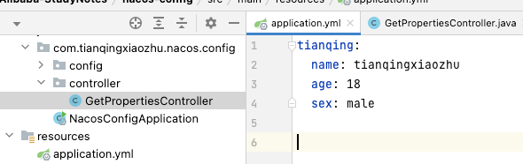

2. 通过 @Value 注解获取配置信息；

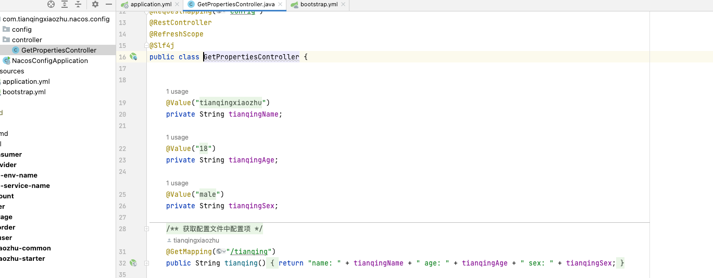

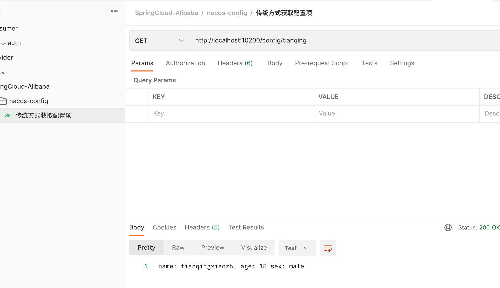

这种方式有一个缺点：`每次修改配置项，都需要重启应用；无法满足在项目中实时感知配置项的变化的需求。`

### 4.2. 接入 Nacos 后获取分布式配置的使用方式

#### 4.2.1. 应用接入 nacos

应用程序接入第三方组件的过程大概都可以分成以下几个步骤：

1. pom 文件中引入组件的相关依赖坐标；
2. 在配置文件中添加配置项，即配置的 key-value 键值对，或者使用@Component、@Configuration+JavaBean 的方式进行配置；
3. 有些组件还需要在启动类上添加相关的注解来开启功能；
4. 进行使用

Nacos 的接入也分成三个步骤：

1. pom 中引入相关依赖

由于引入了自制的项目的 starter 工程来统一管理依赖的版本，因此在这个模块中只需要添加 groupId 和 artifactId 即可，不需要添加版本。

```java
<dependency>
    <groupId>com.alibaba.cloud</groupId>
    <artifactId>spring-cloud-starter-alibaba-nacos-config</artifactId>
</dependency>

```

2. 配置 nacos 相关信息

Nacos 作为注册中心，完全替代了原有的配置文件，因此需要使用更高级别的配置文件，即 bootstrap 的配置文件，因此 nacos 的配置内容需要在 bootstrap.yml 文件中完成。

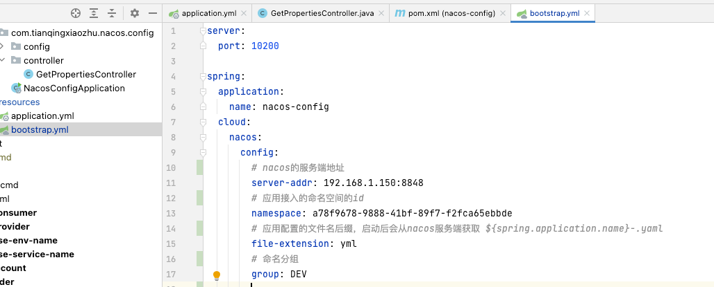

3. 直接使用

参见下面使用样例。

#### 4.2.2. 直接使用 nacos 获取配置项

1. 在 nacos 的控制台添加配置项

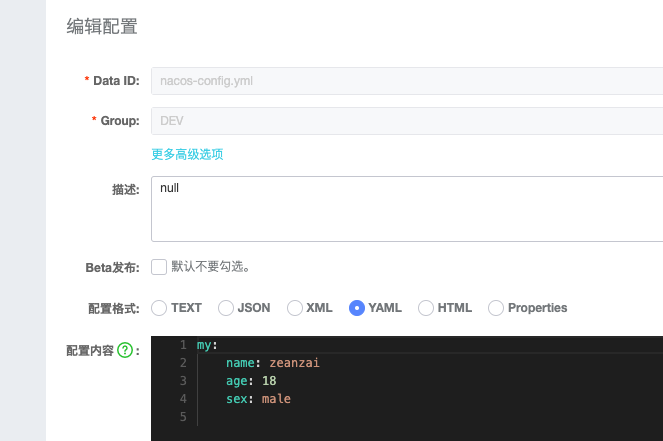

2. 通过@Value 标注变量，并获取配置项

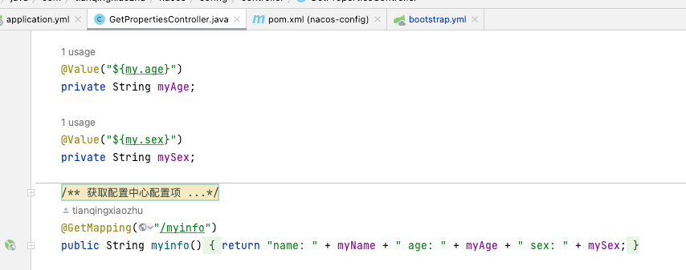

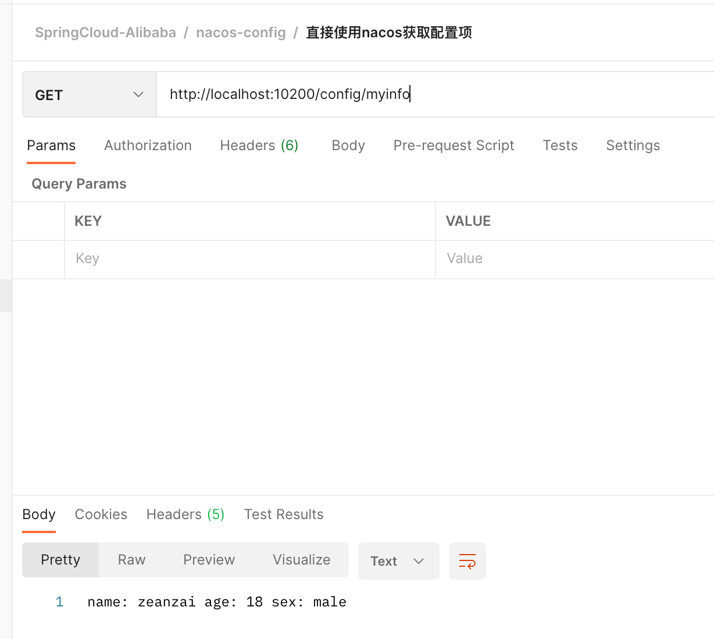

#### 4.2.3. 使用 nacos 共享配置文件方式获取配置项

在实际开发过程中，一个项目可能会有多个配置项，如需要配置 redis、mysql、mq 等，那么我们就可以使用 nacos 的共享配置文件的方式获取配置项。

1. 在 bootstrap.yml 中添加共享配置项的配置

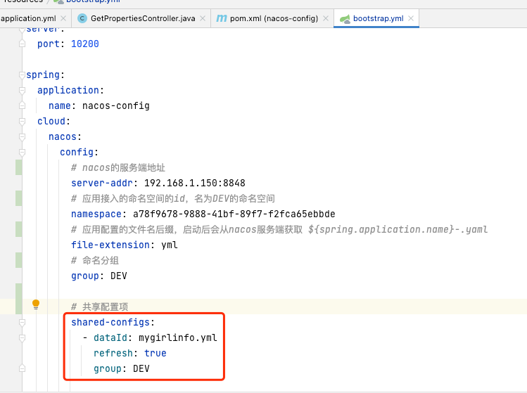

2. 在 nacos 控制台添加共享配置项

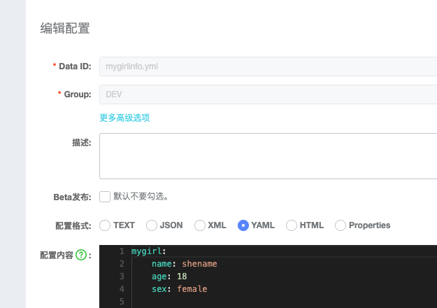

3. 通过@Value 标注变量，并获取配置项

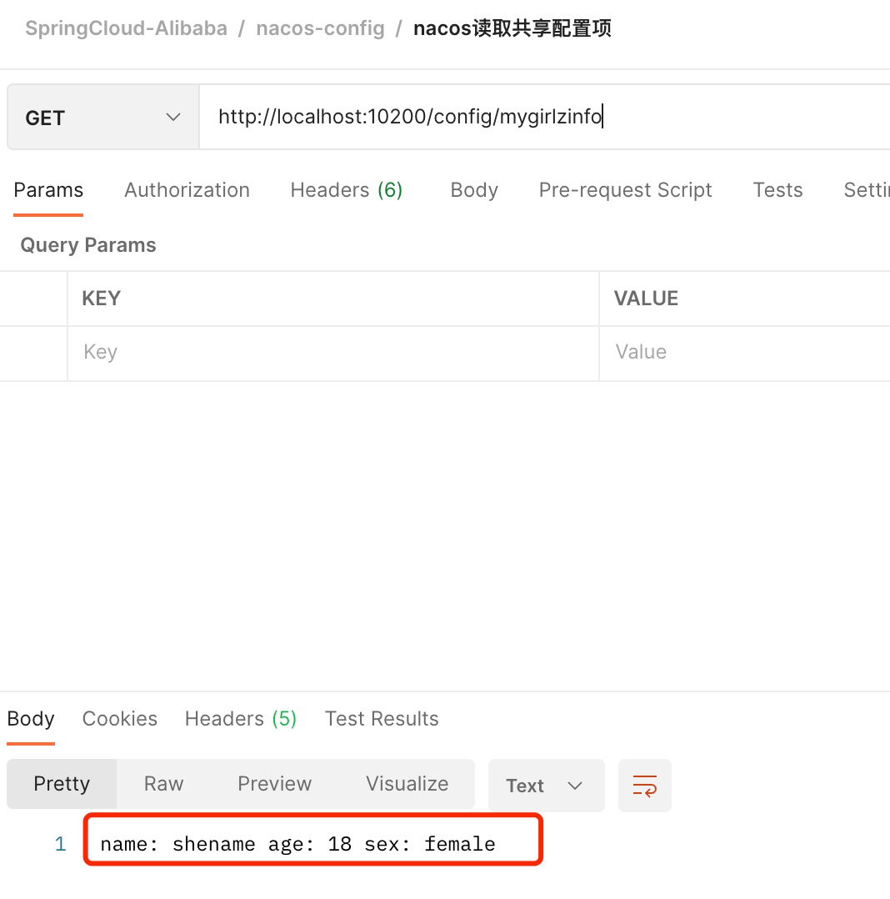

#### 4.2.4. 共享配置文件映射成 JavaBean

上面的样例中，我们都是先通过@Value 标注变量，但是这种方式还有不够便捷，既然是面向对象编程，那么我们就希望获取到的配置文件转成 JavaBean 的方式进行使用。请看下面样例：

1. 在 bootstrap.yml 中添加共享配置项的配置

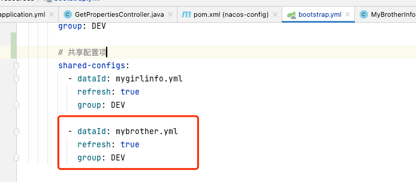

2. 控制台添加配置

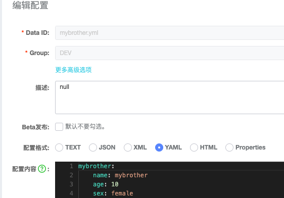

3. 添加配置项的 JavaBean 进行映射

```java
@Component
@ConfigurationProperties(prefix = "mybrother")// prefix 的值就是控制台添加的配置文件的名称
public class MyBrotherInfo {
    private String name;
    private String age;
    private String sex;

    public String getName() {
        return name;
    }

    public void setName(String name) {
        this.name = name;
    }

    public String getAge() {
        return age;
    }

    public void setAge(String age) {
        this.age = age;
    }

    public String getSex() {
        return sex;
    }

    public void setSex(String sex) {
        this.sex = sex;
    }
}

```

4. 注入 JavaBean 后进行使用

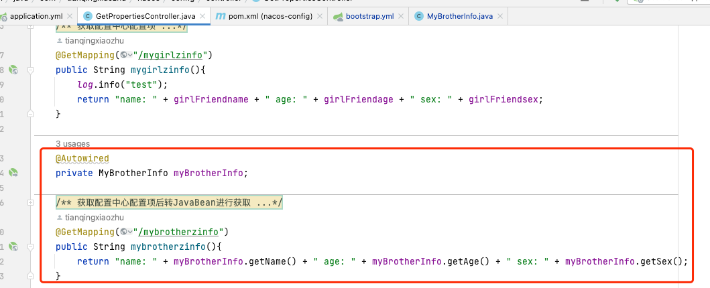

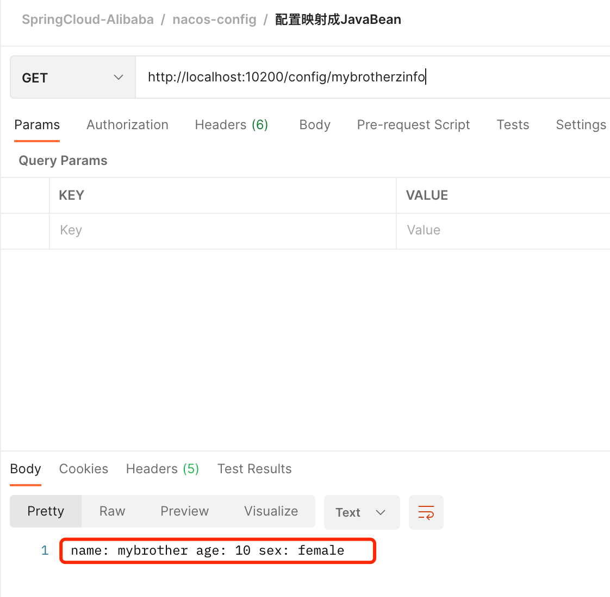

我们还可以把不同项目的一些公共配置放到一个配置文件中，然后在不同的项目中设置相同的配置项，达到`一处变更，处处修改`的目的。

#### 4.2.5. 实时获取配置变更

获取变更后的配置文件，我们只需要在获取的接口上添加 @RefreshScope 注解即可。

## 5. Nacos 方式 vs 传统方式

传统方式：

1. 每次配置变更都需要重启服务；
2. 无法实时感知配置项的变化过程；
3. 集群架构下，无法实现“一处修改，处处修改”的效果；

使用 nacos 作为配置中心：

1. 配置变更后不需要重启服务；
2. 可以实时感知到配置的变化过程；
3. 能实现集群架构下，“一处修改，处处修改”的效果；

## 6. 开发的最佳实践

> 微信扫码关注“天晴小猪”（ID： it-come-true），回复“springcloud”，获取本章节实战源码。

通过上面的案例，我们可以了解到 Nacos 作为配置中心有几个重要的功能特性：

1. 命名空间
2. 命名分组
3. 共享文件配置

实际的开发过程肯定要比上面的几种简单案例复杂，那么我们在实际的开发过程中如何使用这几种配置方式呢？

### 6.1. 方式一

为每一个服务都创建一个 namespace，然后不同的环境使用不同的 Group 来隔离。如不同模块的开发环境的配置文件统一放到 DEV 的命名空间下，在同一个命名空间下，我们可以通过不同的命名分组进行区分，如模块 A 的开发环境的配置文件属于 DEV 命名空间下的 GroupA，模块 B 的开发环境的配置文件属于 DEV 命名空间下的 GroupB。

这样做的好处是符合传统的以不同环境作为区分的思路，便于理解；并且还可以让不同的应用在相同环境下共享配置文件；但是这种方式也有坏处，那就是不能跨环境共享配置文件。

### 6.2. 方式二

为每一个环境都配置一个 namespace，不同的服务使用同名的配置文件；实际操作上，我们可以使用服务名作为命名空间，再通过命名分组进行区分不同的环境。这种方式是把不同环境的配置文件放到了同一个命名空间下，实现了不同环境下的共享配置文件的配置。但这种方式也有缺点，那就是可能每一个服务的命名空间中都有相同的一份配置文件，也就是不同服务无法共享一些公共的配置文件。

## 7. Nacos 的高可用

相比较传统单体应用中，配置文件跟业务代码放到一起的方式，配置中心的方式相当于集中管理配置，在使配置便捷化的过程中，也引入了一个重要的问题，那就是：配置中心异常无法对外提供服务后，会导致所有的应用无法获取配置，导致项目启动不起来。

针对这个问题 Nacos 也提供了解决方案，那就是 Nacos 的高可用机制。简单来说就是部署多个 Nacos 实例，让 Nacos 形成集群，统一对外提供服务。 Nacos 的集群模式这里不再赘述，详见官方文档。

此外 Nacos 本身是由 Java 语言编写，Nacos 也支持持久化，有兴趣的读者可以自行研究一下持久化的部署过程。

## 8. 总结

1. 介绍了配置中心出现的背景；
2. 分别介绍了传统方式获取配置项及 Nacos 获取配置项的不同方式，并简单介绍了这几种方式的区别；
3. 介绍了 Nacos 在实际开发场景下的不同实践方式以及它们的优缺点；
4. 简单介绍了 Nacos 的其他高级特性；

## apollo

## 1. apollo 部署及使用过程

### 1.1. 部署过程

1. 下载三个 zip 包，并解压
2. 导入数据库
3. ~~创建 eureka 服务~~
4. ~~修改数据库中 apolloconfigdb.serverconfig 表中 eureka.service.url 的值为 eureka 的地址~~
5. 依次启动 config 、 admin、 portal 服务
6. 检查 8080 端口占用情况，如果被占用启动时会报错，8080 是 config 所在服务的端口

### 1.2. 使用

#### 1.2.1. 配置 Apollo

管理台地址的端口为： 8070

初始化用户名密码为： apollo / admin

1. 创建项目
2. 创建配置项
3. 发布

#### 1.2.2. 在项目中使用

1. 在项目的 pom 中引入 Apollo 的客户端
2. 在项目的 application.yml 文件中添加：

```
apollo:
  bootstrap:
    enabled: true
    namespaces: application
  meta: http://192.168.1.150:8080 # 此地址为config服务所在的地址

```

3. 添加 app.properties 文件

```
app.id=XXXX
```

4. 创建配置文件

```
@Configuration
@EnableApolloConfig(value = "application", order = 10)
public class AppConfig {
}
```

5. 创建配置项并使用

```
@RestController
@RequestMapping("configConsumer")
@RefreshScope
public class ConfigClientController {

    @Value("${config_info}")
    private String config;

    @RequestMapping("/getConfigInfo")
    public String getConfigInfo(){
        return config;
    }
}
```

### 1.3. 注意事项

1. 在部署后，在 web 控制台进行配置时，创建了一个项目，如果遇到报错信息： 请联系管理员 等信息，可以去找对应服务的启动文件，启动文件中有日志所在的地址，查看日志即可得知哪里出了问题；如果是端口占用，可以使用 netstat -nultp 命令查看端口占用情况。
2. 项目启动后，发现一直报错，应先考虑配置文件是否有误。注意： apollo.meta 地址是 config 服务所在的地址，不要写错。
3. configuration 项目和 administer 项目依赖 eureka，端口是 8080，要看看此端口是否已经被占用。

### 1.4. 参考

- [Apollo 下载与安装](https://blog.csdn.net/SIMBA1949/article/details/107561778)
- [Apollo 官方文档](https://www.apolloconfig.com/#/zh/README)

---

## 2. 把 application.yml 文件整体放入 apollo

### 2.1. 项目背景

把 springboot 项目中的 application.yml 文件，整个都放入 Apollo 中，启动时项目先从 Apollo 中获取配置文件，然后根据拉取的配置文件进行启动。这样可以达到配置文件保密的效果。

### 2.2. 添加依赖

```
<dependency>
	<groupId>com.ctrip.framework.apollo</groupId>
	<artifactId>apollo-client</artifactId>
	<version>1.0.0</version>
</dependency>
```

### 2.3. 添加注解

```
@EnableApolloConfig
```

### 2.4. 发布配置文件内容

使用 http://www.toyaml.com/index.html 把 yml 格式转成 properties 格式。然后复制出所有的配置项，复制到 Apollo 管理页面上进行发布。

### 2.5. 修改配置文件

注释掉之前所有的配置项，只添加下面内容：

```
app:
  id: 103929
apollo:
  bootstrap:
    enabled: true
    namespaces: application
```

### 2.6. 创建本地缓存目录

```
cd /opt
sudo mkdir /opt/data
sudo chmod -R 777 data
sudo mkdir /opt/settings
cd settings
sudo touch server.properties
sudo vi server.properties
```

在 server.properties 文件中添加:

```
env=DEV
apollo.meta=http://192.168.1.150:8080
```

### 2.7. 启动后进行验证

成功

### 2.8. 注意事项

1. 创建本地目录是重要的步骤，不能省略，否则项目启动时会自己初始化，不会拉取 Apollo 的配置，创建完目录后还需要保证目录的读取权限。
2. 创建完本地目录后还需要创建 server.properties 文件，用来指定运行的环境。
3.

### 2.9. 参考地址

1. [淘东电商项目（10） -Apollo 分布式配置中心管理 application.yml](https://blog.csdn.net/qq_20042935/article/details/104262790)
2. [携程 Apollo v1.4 开发指南](https://www.bookstack.cn/read/ctripcorp-apollo/spilt.2.5e3f6033aee666be.md#1.5%20%E5%BA%94%E7%94%A8%E8%AF%BB%E5%8F%96%E9%85%8D%E7%BD%AE)

---

## 3. 修改本地缓存的配置文件的目录地址

大多数公司里面的开发机都是经过部署过的，很多目录并没有读写权限，并且很多大厂内的电脑多是需要自己的账号登陆的，因此，可以把 Apollo 的本地缓存地址放置到用户自己的 Home 目录下。此外，由于配置中心的私密性，并且都是内网环境，因此还把 Apollo 的配置配置地址隐藏掉。这样只需要在家目录下放置 .settings.xml 文件，里面只需要指定环境即可。
