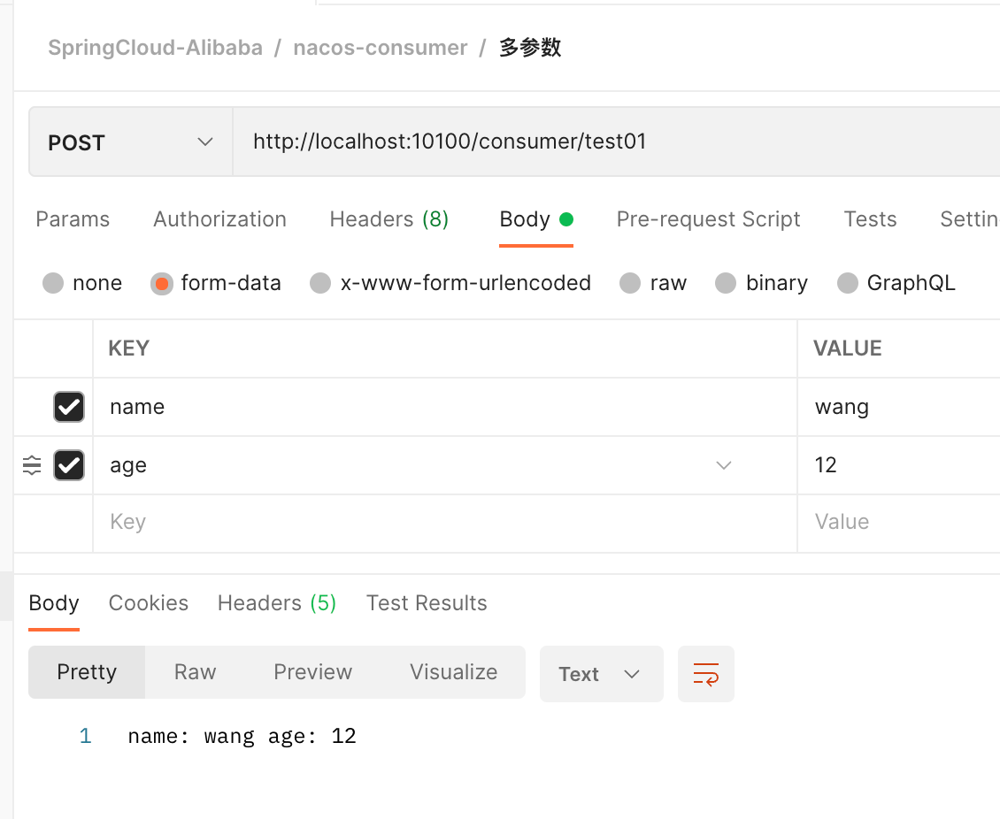
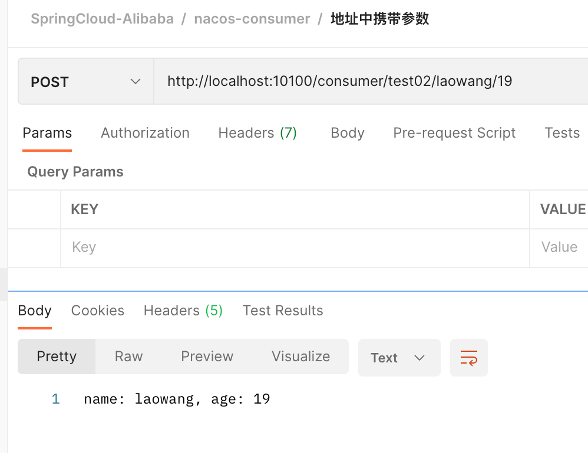
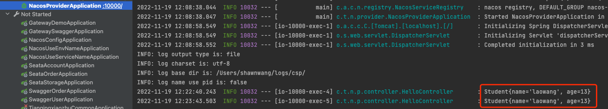
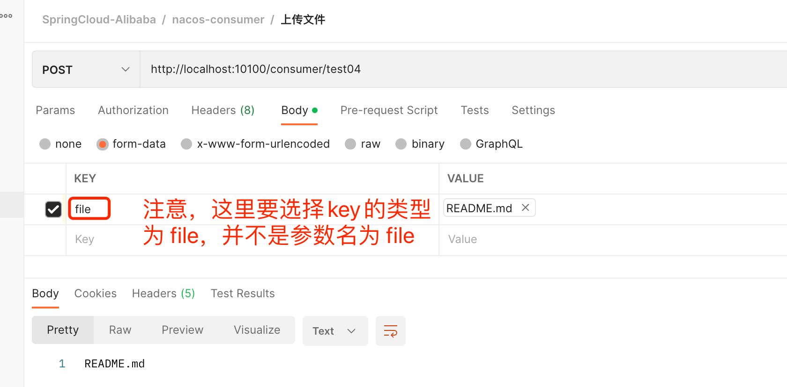
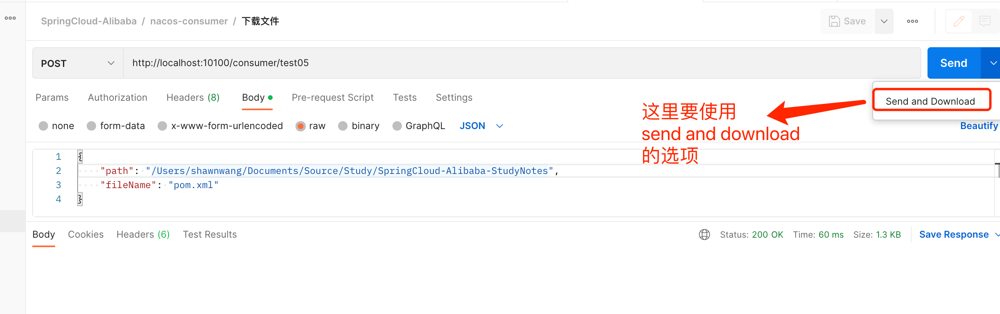

# openfeign 远程调用

## 背景知识

在单体应用，不同功能模块之间的调用过程多是通过调用方法来实现的，而拆分成微服务架构后，由于物理部署方式的改变（主要表现形式是：单个部署包变成多个部署包），不同模块之间的调用方式也发生了本质上的改变。

微服务架构中，服务之间的调用大多是通过 RPC 调用完成的，RPC 就是远程服务调用。通俗点讲就是被调用者通过暴露接口，调用者调用被调用者暴露出来的接口来实现调用过程。

简单说一下 RPC 和 SOA 的区别，SOA 的主要特点是构建一种消息组件，让所有的服务统一通过这个消息组件实现相互调用，它主要的特点是有一个统一的消息组件，另外一个特点是所有的服务提供的接口都是经过统一格式定义过的，Dubbo 和 WebService 都属于 SOA 的范畴。而 RPC 则是取消了统一的消息组件，服务与服务之间的调用是通过直接的网络调用，调用过程优雅，像本地调用一样简单便捷，SpringCloud 技术栈属于这个范畴。

在微服务的发展的早期，远程服务调用多是通过 JDK 原生的 URLConnection 来实现的，后期出现了 HttpClient、OkHttp 的组件。目前微服务架构中，多是使用 RestTemplat 和 OpenFeign 来完成远程服务调用的。

## 技术选型

OpenFeign 是 SpringCloud 官方提供的远程服务调用的组件，我们“别无选择”，就它了。需要注意的是，SpringCloud 还提供了 RestTemplate 组件，也可以完成远程服务调用。关于 RestTemplate 方式调用和 OpenFeign 方式的简单调用，也可以参考笔者的系列文章的《服务治理之 Nacos》章节进行查阅。

### 什么是 Feign

Feign 是一个声明式 Web Service 客户端。它主要作用是使 Web Service 客户端变得很简单。原来的 HttpClient 的方式是需要声明客户端的地址、端口、请求头、请求体、解码器、协议内容等等，然后创建链接后调用。而 Feign 则是通过添加注解，屏蔽底层通用的细节，调用远程服务。这种调用方式跟本地方法一样，用户几乎无感知。

有具体以下特性：

- 可插拔的注解支持
- 支持可插拔的 HTTP 编码器和解码器
- 支持 Hystrix 和它的 Fallback
- 支持 Ribbon 的负载均衡
- 支持 HTTP 请求和响应的压缩

## 实战

要想使用 OpenFeign，我们就要先明白它的大概原理： 服务生产者与服务消费者都注册到服务治理中心上，服务调用者在调用过程中，先从服务治理中心获取服务生产者的地址，然后再组装实际的调用地址，之后完成服务的调用。因此我们还需要一个服务治理中心，这里我们还是使用 Nacos。

下面带大家一起搭建一下所需要的测试框架。

### 基本使用

#### 服务生产者（nacos-provider）

- 引入服务发现的依赖

```
<dependency>
    <groupId>com.alibaba.cloud</groupId>
    <artifactId>spring-cloud-starter-alibaba-nacos-discovery</artifactId>
</dependency>

```

- 注册中心相关配置

```yaml
spring:
  application:
    # 注册到nacos上的服务名称，也是服务发现的名称，必写
    name: nacos-provider
  cloud:
    nacos:
      discovery:
        # nacos的注册地址
        server-addr: 192.168.1.150:8848
        # gateway
        namespace: deeaeca6-bed9-4fb1-b5b7-9c79278561ca
```

- 开启服务注册与发现

```java
@SpringBootApplication
@EnableDiscoveryClient  // 开启服务的注册与发现
public class NacosProviderApplication {

    public static void main(String[] args) {
        SpringApplication.run(NacosProviderApplication.class, args);
    }

}

```

- 对外暴露接口进行测试启动

```java
@RestController
@RequestMapping("provider")
public class HelloController {

    @GetMapping("/hello")
    public String hello(){
        return "hello, provider!!!";
    }
}

```

启动后，查看 nacos 控制台，服务已经注册到 nacos 上面，postman 请求 hello 接口，请求成功。

#### 服务消费者（nacos-consumer）

服务消费者框架的搭建过程与服务生产者的搭建过程一样，不再赘述。不同的是服务消费者要使用 OpenFeign，因此还需要下面几个步骤。

- 引入 OpenFeign 的依赖

```
<dependency>
    <groupId>org.springframework.cloud</groupId>
    <artifactId>spring-cloud-starter-openfeign</artifactId>
</dependency>

```

- 创建 OpenFeign 的 Service

```java
@FeignClient(value = "nacos-provider")
public interface ProviderService {
    @RequestMapping("/provider/hello")
    String hello();
}

```

- 开启服务注册与发现并添加客户端的扫描包路径

```java
@EnableFeignClients("com.tianqingxiaozhu.nacos.consumer.service") // 扫描包路径
@EnableDiscoveryClient // 开启服务的注册与发现
@SpringBootApplication
public class NacosConsumerApplication {

    public static void main(String[] args) {
        SpringApplication.run(NacosConsumerApplication.class, args);
    }

}

```

- 消费接口

```java
@RestController
@RequestMapping("consumer")
public class HelloController {
    /**
     * 注入OpenFeign的接口
     */
    @Autowired
    private ProviderService providerService;

    /**
     * 消费接口
     */
    @GetMapping("/hello2")
    public String hello2(){
        return providerService.hello();
    }
}

```

- 启动测试

查看 nacos 控制台，发现服务已经注册到 nacos 上，请求接口也成功。

> OpenFeign 的基本用法是：
>
> 1. 服务生产者对外暴露接口；
> 2. 服务消费者创建 service 链接接口；
> 3. 控制层注入 service 后进行消费；

#### Feign 的工作原理

- 在主程序入口中添加@EnableFeignClients 注解开启对 Client 包的扫描，并在服务提供方接口上添加@FeignClient 注解。
- 程序启动时，容器会自动扫描@EnableFeignClients 注解中配置的包，并把所有带@FeignClient 注解的类注入到 IOC 容器中，当定义的 Feign 接口中的方法被调用时，就通过 jdk 代理的方式，来生成具体的 RequestTemplate，生成代理时，feign 会为每一个接口创建一个 RequestTemplate 对象，这个对象封装了 HTTP 请求需要的全部信息。
- 然后由 RequestTemplate 生成 Request，并把 Request 交给 Client（指的是 JDK 原生的 URLConnection、HttpClient、OkHttp）去处理，最后 Client 被封装到 LoadBalanceClient 类，这个类结合 Ribbon 负载均衡使用。

#### FeignClient 注解剖析

- 作用到接口上
- 常用属性归纳
  - name
  - url
  - configuration
  - fallback
  - path
  - decode404

### OpenFeign 高级特性

> 微信扫码关注“天晴小猪”（ID： it-come-true），回复“springcloud”，获取本章节实战源码。

在实际的项目开发过程中，我们大多情况下使用的是 POST 请求，但是会有多种不同的情况，下面我们分别介绍一下 POST 协议下不同的请求方式。但是服务生产者会提供多种接口，例如：包含多个参数、路径中携带参数、需要传递对象、文件上传、下载等，下面我们实践一下。

##### 开启日志

在开发过程中，有时我们需要开启远程调用的日志信息，以便我们进行排错，开启只需要在消费者中配置：

```yaml
logging:
  level:
    com.tianqingxiaozhu.nacos.consumer.service: debug
```

`com.tianqingxiaozhu.nacos.consumer.service` 是消费者接口所在的包路径。

##### 多参数

- 服务生产者对外提供 test01 接口，此接口有两个参数： `name` 和 `age` ，

```java

@PostMapping("/test01")
public String test01(String name, String age) {
    return "name: " + name + " age: " + age;
}

```

- 服务消费者使用 @RequestParam 标注服务生产者接受的两个参数的参数名，

```java
@PostMapping("/provider/test01")
String test01(@RequestParam("name")String name, @RequestParam("age")String age);

```

- 测试结果，



##### URL 中携带参数

- 服务生产者对外提供 test02 接口，此接口需要在路径中携带参数 `name` 和 `age` ，

```java
/**
 * URL中携带参数
 * @param name
 * @param age
 * @return
 */
@GetMapping("/test02/{name}/{age}")
public String test02(@PathVariable("name") String name, @PathVariable("age")Integer age) {
    return "name: " + name + ", age: " + age.toString();
}

```

- 服务消费者使用 @PathVariable 注解进行标注生产者的参数名，

```java
@GetMapping("/provider/test02/{name}/{age}")
String test02(@PathVariable("name") String name, @PathVariable("age")Integer age);

```

- 测试结果，



##### 传递对象

- 服务生产者提供的接口需要使用 Student 对象进行访问，

```java
@PostMapping("/test03")
public void test03(@RequestBody Student student) throws InterruptedException {
    log.info(student.toString());
}

```

- 服务消费者 servicd 需要使用@RequestBody 注解进行标注生产者接口的参数类型，

```java
@PostMapping("/provider/test03")
void test03(@RequestBody Student student);

```

- 消费者 controller 创建一个对象传递给消费者，

```java
@PostMapping("/test03")
public void test03() {
    Student student = new Student();
    student.setName("laowang");
    student.setAge(13);
    providerService.test03(student);
}

```

- 测试结果，



##### 文件上传

- 生产者接收到文件后，返回文件的名称，

```java
@PostMapping(value = "/test04", consumes = MediaType.MULTIPART_FORM_DATA_VALUE)
public String test04(@RequestPart("file") MultipartFile file) {
    return file.getOriginalFilename();
}

```

- 消费者使用 @RequestPart 注解进行标注生产者的参数名，特别注意的是需要 @PostMapping 注解要添加 produces 和 consumes 的值，这两个属性标注了生产者接受的媒体类型和需要处理的媒体类型。

```java
@PostMapping(value = "/provider/test04",
            produces = {MediaType.APPLICATION_JSON_VALUE},
            consumes = MediaType.MULTIPART_FORM_DATA_VALUE)
String test04(@RequestPart("file") MultipartFile file);

```

- 消费者 controller 上传文件后转发给生产者接口

```java
@PostMapping(value = "/test04")
public String test04(MultipartFile file) {
    return providerService.test04(file);
}

```

- 测试



##### 文件下载

文件下载有多种实现方式，比如

1. 客户端传入文件路径，服务端根据文件路径，读取文件内容转成输入流，把输入流返回给客户端，客户端再把流写入文件后保存到本地；
2. 使用 oss 对象存储

下面使用第一种方式进行实践，

- 生产者根据传入文件的的路径以及文件名读取文件流，并转成输出流返回给客户端

```java

/**
 * 文件下载
 * @param response
 * @param myFiles
 */
@PostMapping(value = "/test05", consumes = MediaType.APPLICATION_JSON_VALUE)
public void test05(@RequestBody MyFiles myFiles, HttpServletResponse response) {

    String filepath = myFiles.getPath()+"/"+myFiles.getFileName();

    response.setContentType("application/x-download;charset=" + Charsets.UTF_8.displayName());
    response.addHeader("Content-Disposition",
            "attachment;filename=" + myFiles.getFileName());

    FileInputStream fileInputStream = null;

    try {
        fileInputStream = new FileInputStream(filepath);
        OutputStream    out             = response.getOutputStream();
        byte            buffer[]        = new byte[1024];
        int length = 0;
        while ((length = fileInputStream.read(buffer)) >= 0){
            out.write(buffer,0,length);
        }

        ServletOutputStream outputStream = response.getOutputStream();
        IOUtils.copy(fileInputStream, outputStream);
        outputStream.flush();
    } catch (IOException e) {
        log.info("下载失败....");
    } finally {
        if(fileInputStream != null){
            try {
                fileInputStream.close();
            } catch (IOException e) {
                e.printStackTrace();
            }
        }
    }
}

```

- 消费者使用 @RequestBody 标注生产者接受的参数的类型

```java
@PostMapping(value = "/provider/test05", consumes = MediaType.APPLICATION_JSON_VALUE)
Response test05(@RequestBody MyFiles myFiles);

```

- 消费者 controller

```java

/**
 * 下载
 * @param myFiles
 * @return
 */
@PostMapping("/test05")
public void test05(@RequestBody MyFiles myFiles, HttpServletResponse httpServletResponse) {
    String filename = myFiles.getPath() + "/" + myFiles.getFileName();
    httpServletResponse
            .setContentType("application/x-download;charset=" + Charsets.UTF_8.displayName());
    httpServletResponse.addHeader("Content-Disposition",
            "attachment;filename=" + myFiles.getFileName());
    Response response = providerService.test05(myFiles);
    Response.Body body = response.body();
    try (OutputStream outputStream = httpServletResponse.getOutputStream();
            InputStream inputStream = body.asInputStream()) {
        IOUtils.copy(inputStream, outputStream);
        outputStream.flush();
    } catch (IOException e) {
        log.error("下载文件异常 filepath:[{}]", filename, e);
    }
}

```

- 测试结果



##### 开启 GZIP 压缩

有时为了节省网络带宽，我们需要对 OpenFeign 进行请求的压缩，其原理大概是，对请求的数据提供一种压缩算法，使用这种算法对数据进行压缩，接收到数据再使用同样的算法对数据进行解压。

开启 GZIP 压缩也很简单，只需要在服务消费端配置上：

```yaml
feign:
  compression:
    request:
      enabled: true
      mime-types: text/xml,application/xml,application/json # 压缩的请求类型
      min-request-size: 2048 # 压缩数据的下限
    response:
      enabled: true # 开启响应的zip压缩
```

##### 超时控制

有时候由于网络问题，生产者提供的接口的响应时间过长，就会造成消费者接口的请求时间过长，继而响应异常，此时我们就需要修改客户端的默认链接时间：

```yaml
feign:
  # 修改客户端的连接超时时间
  client:
    config:
      default:
        connectTimeout: 5000
        readTimeout: 5000
```

实验时，我们可以在生产者提供的接口中休眠 3s，就会发现消费者接口报错。然后我们通过配置消费者的客户端链接超时时间，重新启动后就会发现响应正常。

##### 替换默认的客户端

OpenFeign 底层用的是 JDK 原生的 URLConnection 作为客户端的，但是我们可以自定义客户端，如可以配置 Apache 的 HttpClient 或者 Okhttp。

替换默认的客户端的方法很简单，主要有两步，下面以替换成 Okhttp 为例：

- 添加要替换的客户端的依赖坐标

```xml
<!--okhttp客户端-->
<dependency>
    <groupId>io.github.openfeign</groupId>
    <artifactId>feign-okhttp</artifactId>
</dependency>

```

- 在配置文件中开启

```yaml
feign:
  okhttp:
    enabled: true # 启用okhttp
```

##### 其他

此外 OpenFeign 还有其他高级特性，有兴趣的读者可以自行实践一下：

1. 自定义配置某一个 Feign 客户端的相关属性；
2. Feign 调用时透传特定请求头
3. ...

## OpenFeign 的原理

1. 由于启动类上添加了 @EnableFeignClients 注解，并标注了需要扫描@FeignClients 客户端所在的包路径，程序启动时会扫描包路径，并把这些信息注入到 Spring 的容器中；
2. 当发生调用时，Spring 会通过 JDK 代理的方式，为客户端生成具体的 RestTemplate；
3. 在把 RestTemplate 生成的 Request 交给具体的 Client，最后 Client 被封装到 LoadBalanceClient 类，这个类会结合 Ribbon 负载均衡发起服务的调用；

## 总结

1. 介绍了 SpringCloud 的远程调用组件及在调用过程中的两个服务角色： 生产者 和 消费者；
2. 实践了 OpenFeign 的几种高级特性；
3. 介绍了 OpenFeign 的工作原理；
