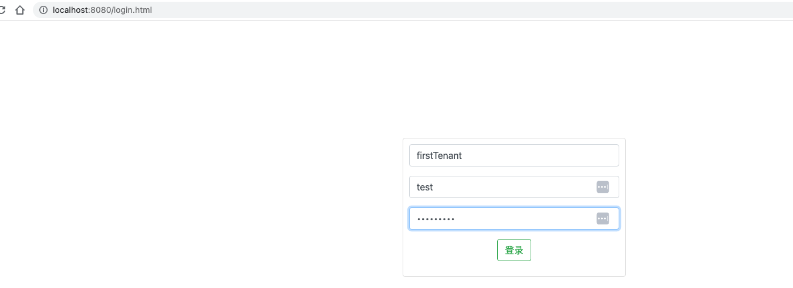
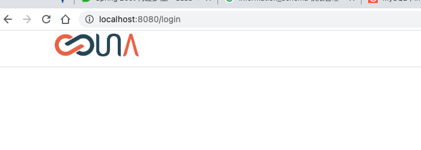

# 多租户 SaaS 实战

1. 说明文档可以参考《[Spring Boot 构建多租户 SaaS 平台核心技术指南](https://mp.weixin.qq.com/s/6Gihii6HtBsgcbiQ-2XvUg)》。
2. 修改 application.yml 数据库 URL、账户、密码

```yaml
url: jdbc:mysql://192.168.100.100:3306/test_una_saas?useSSL=false
username: admin
password: admin@2020!@#
```

3. 创建 application.yml 数据库 URL 对应的 schema，并在改数据库中创建`master_tenant`表。

```
schema： test_una_saas
table： master_tenant
SQL：
    CREATE TABLE `master_tenant` (
      `ID` varchar(255) NOT NULL,
      `TENANT` varchar(30) NOT NULL,
      `URL` varchar(255) NOT NULL,
      `USERNAME` varchar(30) NOT NULL,
      `PASSWORD` varchar(30) NOT NULL,
      `version` int(11) NOT NULL,
      PRIMARY KEY (`ID`)
    ) ENGINE=InnoDB DEFAULT CHARSET=utf8mb4;

```

4. 在`master_tenant`表中插入一条数据

```sql
INSERT INTO `master_tenant` VALUES ('tenant_1', 'firstTenant', 'jdbc:mysql://192.168.100.100:3306/db2020?useSSL=false', 'admin', 'admin@2020!@#', '0');

```

5. 创建 schema，并创建 user 表

```
schema： db2020
table： user
SQL：
    CREATE TABLE `user` (
      `ID` varchar(50) NOT NULL,
      `USERNAME` varchar(255) DEFAULT NULL,
      `PASSWORD` varchar(22) DEFAULT NULL,
      `TENANT` varchar(255) DEFAULT NULL,
      PRIMARY KEY (`ID`)
    ) ENGINE=InnoDB DEFAULT CHARSET=utf8mb4;

```

6. 在 db2020.user 表中插入一条数据

```sql
INSERT INTO `user` VALUES ('1', 'test', 'abc123456', 'firstTenant');

```

7. 使用`firstTenant`作为租户 id，使用`test`作为用户名，使用`abc123456`作为登陆密码。





8. 使用另外一个链接和另外一个租户的用户再次登录，同样成功。

## 注意

在项目启动之后，可能会遇到“找不到表”的错误问题，这是因为在实体类中声明的表名为大写。解决思路是：修改 MySQL 服务端配置，修改为忽略大小写。

MySQL 早期版本中，可以通过修改 lower_case_table_names 变量来配置：

```text
lower_case_table_names 各参数含义：

0：表名区分大小写，且按照用户指定存储
1：表不区分大小写，使用小写存储
2：表不区分大小写，按照用户指定存储

```

但是 MySQL8.4.5 初始化之后，不允许修改 lower_case_table_names 变量，这是因为：

```text
lower_case_table_names can only be configured when initializing the server.
Changing the lower_case_table_names setting after the server is initialized is prohibited.

在 Mysql-8.0 版本时，lower_case_table_names 变量是一个系统变量，它只能在 MySQL 服务器初始化时设置，并且一旦服务器初始化完成，就不应该再更改这个设置。
这是因为在 MySQL 的数据字典和文件系统层面，这个设置影响到了表名和目录名的大小写敏感性和转换规则。
如果在服务器运行时改变这个设置，可能会导致数据不一致和其他严重问题。
```

解决这个问题有两个思路：

1. 重新安装 MySQL 服务端，在安装的时候，就要指定忽略大小写的配置； mysqld --initialize --user=mysql --lower-case-table-names=1
2. 修改表名为应用程序中指定的大写名称或小写名称。

> https://blog.csdn.net/xhmico/article/details/136680013
