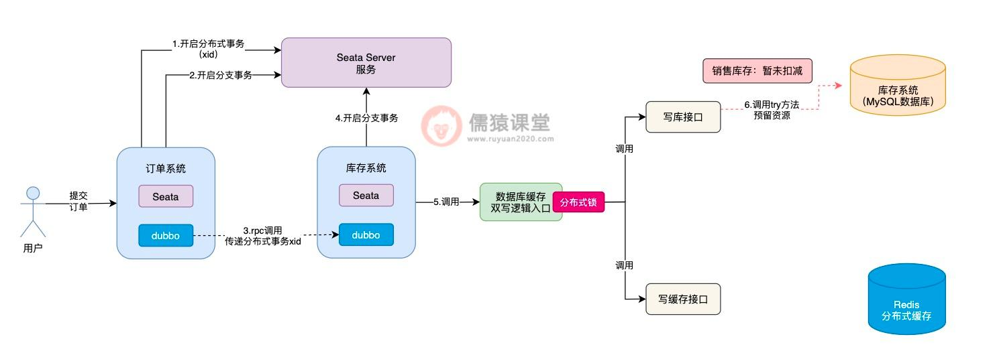
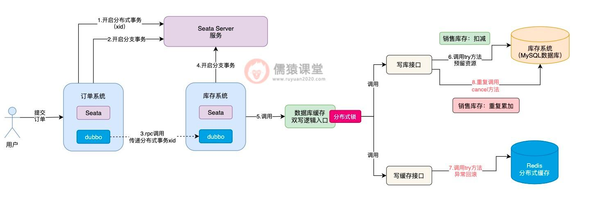
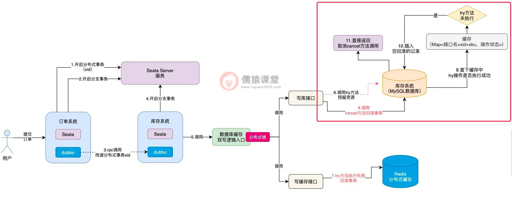
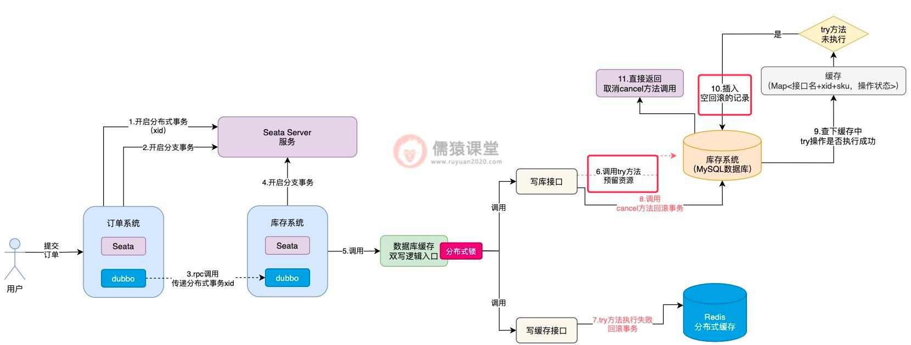
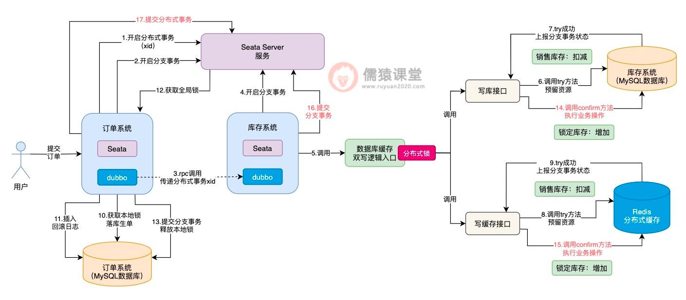
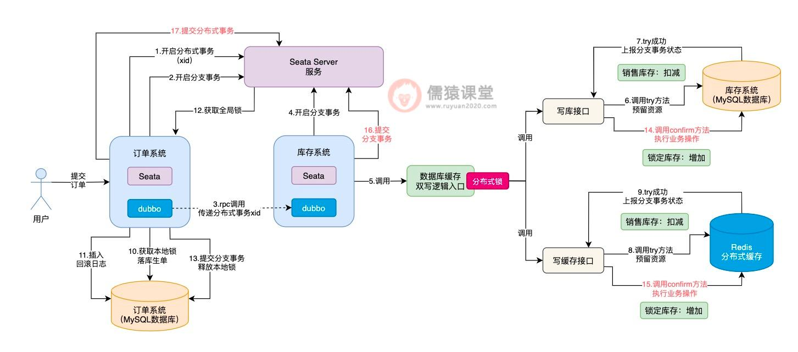
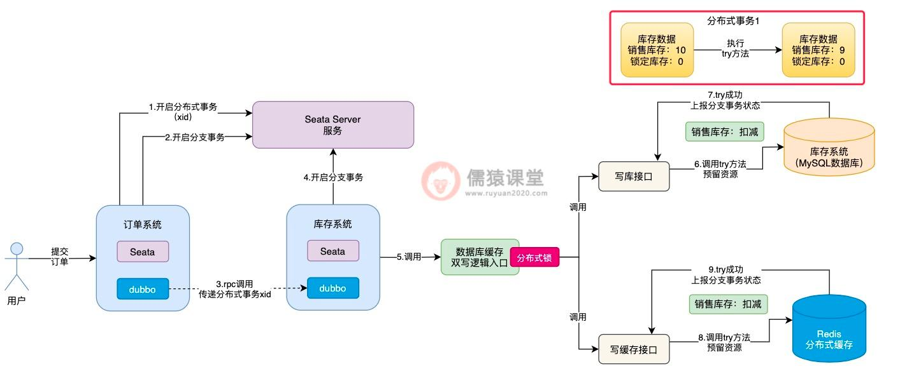

# seata 分布式事务

## TCC 模式实战

1. 搭建公共模块，并搭建三个基本服务，完成三个模块的接口测试；
2. 保证三个异常

第一阶段： 搭建基础环境，只提供操作数据库的方法；
第二阶段： 完成 order 模块调用另外两个模块的 rpc 调用过程，需要集成 nacos、openfeign 等工具包；
第三阶段： 集成 Seata；

starter 模块用来统一管理各种依赖的版本；
common 模块继承 starter 模块，并包含公共模块，但是不传递依赖，如 Seata 的依赖，如果只在业务包里面使用，那么 Seata 的依赖就应该放到业务模块里面；

遵循： 1. 用到才添加依赖，不传递；

storage、account、order 都继承 starter 模块，并继承 starter 模块，依赖于 common 模块；

1. 需要解决空回滚
2. 悬挂
3. 幂等

// todo
// 1. 单测已经完成，但是压测没有通过，大批量请求进入时，并不能保证数据的一致性；
// 2. 码猿技术专栏教程中的项目代码，压测时，也不能保证数据的一致性；
// 3. 参考网上一篇文章，完成了异常编码集中化配置的使用方式，但是理想是把配置文件整到配置中心去；

```sql
CREATE TABLE `storage`  (
  `id` bigint(11) NOT NULL AUTO_INCREMENT,
  `product_id` bigint(11) NULL DEFAULT NULL,
  `name` varchar(100) CHARACTER SET utf8mb4 COLLATE utf8mb4_general_ci NULL DEFAULT NULL,
  `num` bigint(11) NULL DEFAULT NULL COMMENT '数量',
  `create_time` datetime(0) NULL DEFAULT NULL,
  `price` bigint(10) NULL DEFAULT NULL COMMENT '单价，单位分',
  `frozen` bigint(11) NULL DEFAULT NULL COMMENT '冻结的库存',
  PRIMARY KEY (`id`) USING BTREE
) ENGINE = InnoDB AUTO_INCREMENT = 2 CHARACTER SET = utf8mb4 COLLATE = utf8mb4_general_ci ROW_FORMAT = Compact;

CREATE TABLE `account` (
	`id` BIGINT ( 11 ) NOT NULL AUTO_INCREMENT,
	`user_id` VARCHAR ( 32 ) CHARACTER SET utf8mb4 COLLATE utf8mb4_general_ci NULL DEFAULT NULL COMMENT '用 户userId',
	`money` BIGINT ( 11 ) NULL DEFAULT NULL COMMENT '余额，单位分',
  `create_time` timestamp NOT NULL DEFAULT CURRENT_TIMESTAMP COMMENT '创建时间',

  `frozen` bigint(11) NULL DEFAULT NULL COMMENT '冻结的money',
	PRIMARY KEY ( `id` ) USING BTREE
) ENGINE = INNODB CHARACTER SET = utf8mb4 COLLATE = utf8mb4_general_ci ROW_FORMAT = Compact;

CREATE TABLE `t_order`  (
  `id` bigint(11) NOT NULL AUTO_INCREMENT,
  `order_id` varchar(60) CHARACTER SET utf8mb4 COLLATE utf8mb4_general_ci NULL DEFAULT NULL COMMENT '订单Id',
  `product_id` bigint(11) NULL DEFAULT NULL COMMENT '商品Id',
  `num` bigint(11) NULL DEFAULT NULL COMMENT '数量',
  `user_id` varchar(32) CHARACTER SET utf8mb4 COLLATE utf8mb4_general_ci NULL DEFAULT NULL COMMENT '用户唯一Id',
  `create_time` datetime(0) NULL DEFAULT NULL,
  `status` int(1) NULL DEFAULT NULL COMMENT '订单状态 1 未付款 2 已付款 3 已完成 4 待确认 5 已删除',
  PRIMARY KEY (`id`) USING BTREE
) ENGINE = InnoDB AUTO_INCREMENT = 1 CHARACTER SET = utf8mb4 COLLATE = utf8mb4_general_ci ROW_FORMAT = Compact;

CREATE TABLE `ordertb` (
  `id` bigint(11) NOT NULL AUTO_INCREMENT,
  `order_id` varchar(60) CHARACTER SET utf8mb4 COLLATE utf8mb4_general_ci NULL DEFAULT NULL COMMENT '订单Id',
  `product_id` bigint(11) DEFAULT NULL COMMENT '商品Id',
  `num` bigint(11) DEFAULT NULL COMMENT '数量',
  `user_id` varchar(32) DEFAULT NULL COMMENT '用户唯一Id',
  `create_time` timestamp NOT NULL DEFAULT CURRENT_TIMESTAMP COMMENT '创建时间',
  `status` int(1) DEFAULT NULL COMMENT '订单状态 1 未付款 2 已付款 3 已完成 4 待确认 5 已删除',
  PRIMARY KEY (`id`) USING BTREE
) ENGINE=InnoDB CHARACTER SET = utf8mb4 COLLATE = utf8mb4_general_ci  ROW_FORMAT=COMPACT;

```

压力测试时用到的一些脚本

-- 初始化
delete from `seata_server`.`branch_table`;
delete from `seata_server`.`global_table`;
delete from `seata_server`.`lock_table`;
delete from `seata_tcc_account`.`account`;
delete from `seata_tcc_account`.`undo_log`;
delete from `seata_tcc_storage`.`storage`;
delete from `seata_tcc_storage`.`undo_log`;
delete from `seata_tcc_order`.`ordertb`;
delete from `seata_tcc_order`.`undo_log`;
delete from `seata_tcc_order`.`transactional_record`;
INSERT INTO `seata_tcc_account`.`account` (`id`, `user_id`, `money`, `create_time`, `frozen`) VALUES (1, '1', 20000, '2023-03-21 16:46:58', 0);
INSERT INTO `seata_tcc_storage`.`storage` (`id`, `product_id`, `name`, `num`, `create_time`, `price`, `frozen`) VALUES (1, 100, '码猿技术专栏', 1000, '2021-10-15 22:32:40', 20, 0);

select _ from `seata_tcc_account`.`account`;
select _ from `seata_tcc_storage`.`storage`;
select _ from `seata_tcc_order`.`ordertb`;
select _ from `seata_tcc_order`.`transactional_record`;
select _ from `seata_tcc_storage`.`undo_log`;
select _ from `seata_tcc_account`.`undo_log`;
select \* from `seata_tcc_order`.`undo_log`;

-- 花的钱：
select (20000-money) as cost from `seata_tcc_account`.`account`;

-- 卖的产品个数：
select (1000-num) as productNum from `seata_tcc_storage`.`storage`;

-- 订单个数
select count(1) as orderNum, count(1)\_2 as productNum, count(1)\_40 as moneyCost from `seata_tcc_order`.`ordertb` where `status`=3;

select a.cost=o.moneyCost, s.productNum=o.productNum1
from (select (20000-money) as cost from `seata_tcc_account`.`account`) a,
(select (1000-num) as productNum from `seata_tcc_storage`.`storage`) s,
(select count(1)\_2 as productNum1, count(1)\_40 as moneyCost from `seata_tcc_order`.`ordertb` where `status`=3) o
;

-- 订单上的产品个数：
select sum(num) from `seata_tcc_order`.`ordertb` where `status`=3;
select count(\*) from `seata_tcc_order`.`transactional_record`;

## 实践过程

> 使用 jpa 作为 ORM 框架； 框架是一步一步进行迭代的。

1.  搭建项目脚手架
2.  集成 Openfeign
3.  集成 Seata
4.  处理三个异常信息
5.  处理幂等性问题
6.  查看 GitHub 上的 samples，对服务调用也要进行幂等的问题？会不会可以处理压测时出现的问题

---

### TCC 模式

#### 1.空回滚和悬挂问题的分析

这一节，我们来看下生单链路中，引入 Seata TCC 后可能会导致的一些问题，在 TCC 分布式事务中，最常见的问题莫过于空回滚和悬挂了，Seata TCC 分布式事务也是如此。

我们先来结合着上节课的生单链路，了解下什么是空回滚和悬挂：


可以看到，当用户提交订单时，订单系统向 Seata Server 发送一个请求，开启一个分布式事务，并获取分布式事务对应的 xid，然后订单系统通过 dubbo，向库存系统发送一个 rpc 请求并传递相应的 xid，请求锁定库存。

库存系统收到订单系统发送过来的 xid，会在 xid 对应的分布式事务下，开启一个分支事务，然后调用系统中数据库缓存双写的逻辑。

在 Seata TCC 分布式事务中，会依次执行每个接口中的 try 方法，对一些资源进行预留，比如我们这里锁定库存，根据前面的约定，try 方法中就是先扣减销售库存：

而第一个可能出现的问题，就是在调用 try 方法时，可能因为网络不通畅等原因，导致 try 方法调用时阻塞住，一直卡在半路当中，此时，销售库存的数据，当然也就没来得及扣减成功。



这个时候，Seata TCC 可能还误以为写库接口中的 try 方法，已经执行成功了，这个时候，Seata TCC 还没等到写库接口的 try 方法执行成功，就开始执行写缓存接口中的 try 方法：

可以看到，在执行写缓存接口中的 try 方法时，倘若是出现了任何异常的情况，根据我们前面分析的，此时，出现异常的方法，就会原地进行本地事务回滚，Seata TCC 同时也会调用写库接口中的 cancel 方法进行回滚。


现在最大的问题在于，写库接口中的 try 方法，前面因为网络不通畅等问题，还没来得及执行成功，此时，Seata TCC 就要调用写库接口的 cancel 方法进行回滚，对销售库存进行增加，这样就会导致销售库存，莫名其妙多出了一些库存数据，整体的库存数据就不一致了。

像这样由于网络不通畅等原因，导致在 try 方法都还没有执行成功的前提下，就直接执行 cancel 方法进行回滚的现象，我们称为空回滚，而 try 方法一直阻塞卡住而不能执行的现象，一般也被称为是悬挂，不管是空回滚还是悬挂，这个两个问题的出现，根据我们刚分析的，都存在一定的概率，导致库存数据的不一致。

#### 2.Seata TCC 中的幂等性问题分析

除了可能会导致空回滚和悬挂之外，Seata TCC 的引入同样也会导致幂等性问题的发生：

可以看到，倘若各个接口的 try 方法，现在都执行成功了，接下来，Seata TCC 就会依次调用各个接口中的 confirm 方法，完成核心的业务逻辑。


Seata TCC 底层，一旦发现所有接口的 try 方法都执行成功，就会依次调用各个接口 confirm 方法，如果 confirm 方法执行失败，Seata TCC 底层就会重复调用接口的 confirm 方法，务必确保每个接口的 confirm 方法，一定能执行成功。

这样的话，confirm 方法就会存在一定的概率被重复调用，如图，一旦 confirm 方法被重复调用，锁定库存的数据就有可能被重复累加，进而导致库存数据的不一致性问题发生，所以，这算是 Seata TCC 分布式事务中，一个比较典型的幂等性问题了。

相应的，如果 Seata TCC 操作出现异常，也会导致幂等性问题的发生：

可以看到，如果写缓存接口的 try 方法执行失败了，写库接口这里，相应的会调用 cancel 方法进行回滚操作，而 cancel 方法的调用和 confirm 方法的规律是类似的，Seata TCC 底层也有可能会出现重复调用，导致销售库存重复累加，进而导致库存数据的不一致性问题发生。

所以，我们可以看到，在 Seata TCC 分布式事务中，不论是调用 confirm 方法还是调用 cancel 方法，都存在一定的概率重复调用，也就是说 confirm 方法调用和 cancel 方法调用，都存在幂等性的问题。



#### 3.如何解决空回滚、悬挂以及幂等性问题呢？

我们先来分析下空回滚和悬挂的问题，看下有没有好的解决方案。
首先，空回滚和悬挂问题发生的主要原因，在于 try 方法都还没有执行成功，cancel 方法就被调用了，导致平白无故就多补偿了一次，库存数据当然就会不一致性，所以，要是 cancel 方法在开始执行时，就能知道 try 方法是否执行成功了，问题不就好办多了吗。

基于这样的设想，我们可以在内存中设计一个缓存，比如，我们可以通过 Map 这样的数据结构来实现，Map 中的 key 为接口名称、分布式事务的 xid 和以及商品的 sku 组成，表示当前是哪个接口类，在哪个 Seata 分布式事务中，对哪个商品 sku 进行锁定库存操作。

而 Map 中的 value 值，则可以用于存放具体的操作状态，比如 try 操作开始执行时，可以在缓存中设置“TRY_START”字符串，表示当前 try 方法开始执行了；而当 try 方法执行成功之后，可以将该 value 值设置为“TRY_SUCESS”字符串，表示当前 try 方法已经执行成功了。

接下来，我们结合着生单链路，来看下具体是如何结合缓存，来解决空回滚和悬挂问题的：

首先，在 cancel 方法刚开始执行时，首先到缓存中检查一下，通过接口名称+xid+sku 拼接成一个 key，到 Map 缓存中查询一下，先看下能够获取到 try 方法执行过的痕迹。

如果 try 方法都还没有执行，得到的 value 结果肯定就为 null，此时，cancel 方法中的逻辑就直接取消执行，避免空回滚逻辑的执行。



并且，因为当前 try 方法都还没有开始执行就调用 cancel 方法了，空回滚的问题就已经发生了，所以，我们可以事先在数据库中自定义一张表，专门用来存放空回滚的记录。

空回滚发生的同时，我们可以在数据库中，及时插入一条空回滚的记录，这样，接下来一旦 try 方法由于网络而恢复执行了，就可以利用数据库的空回滚记录，控制 try 方法的执行了，我们具体来看下：



可以看到，try 方法执行时，首先会到数据库中检查一下，如果发现当前已经出现空回滚了，try 方法就算恢复网络也不会被允许实际的去执行了，直接就取消 try 方法的执行了，通过以上这套思路，空回滚和悬挂的问题也就解决了。

空回滚和悬挂的问题解决了之后，confirm 方法和 cancel 方法的幂等性问题，自然也就简单多了，前面我们分析过，当 try 方法开始执行时，会在缓存中以接口名称+xid+sku 拼接的字符串为 key，以“TRY_START”为 value，一旦 try 方法执行完毕，value 值就会被更新为“TRY_SUCESS”。

如果出现多个请求，重复调用 confirm 方法或者是 cancel 方法，首先得要检查下缓存中的 value，是否为“TRY_SUCESS”，只有当 try 方法被执行了，且 try 方法还执行成功了，才允许执行 confirm 或 cancel 方法，否则，直接取消当前的方法。

毕竟，try 方法都还没有执行成功，贸然就执行 confirm 方法和 cancel 方法，肯定是会存在问题的，这也是前面幂等性问题的核心。

而当 confirm 方法或 cancel 方法都执行完毕之后，缓存中的 try 方法执行标识也会及时清理掉，下一次有重复的请求过来时，缓存中就找不到 try 方法执行的痕迹了，confirm 或者 cancel 方法也就不会被重复执行了，幂等性问题同样也就得以解决了。

#### 4.总结

这一节，我们分析了在引入 Seata TCC 分布式事务后的生单链路中，什么是空回滚和悬挂问题。
其实，空回滚主要是 try 方法由于网络问题，一直都还没有开始执行，阻塞在了半路上，也就是出现了悬挂；此时，其他的 Seata TCC 分支链路如果恰好又出现了故障，就会导致在 try 方法还没有执行的前提下，就执行 cancel 方法，进行空回滚补偿，所以，一般都是因为悬挂而导致了空回滚的发生。

另外，如果所有接口的 try 方法都执行成功了，Seata TCC 可能存在重复调用 confirm 方法或 cancel 方法的象，当然，Seata TCC 的初衷，还是为了保证在 try 方法都执行成功的前提下，confirm 方法或者 cancel 方法务必得要执行成功，因为，也带来了幂等性问题的风险。

最后，我们通过引入一个 Map 数据结构的缓存，及时记录当前 try 方法的执行情况，并且，当空回滚发生时，及时在数据库表中，记录空回滚的记录，这样，一旦发生了空回滚的问题，try 方法在执行时也能及时感知到，避免了错误执行下去。

并且，正是因为我们添加了缓存，来记录 try 方法的执行状态，所以，只有当 try 方法执行成功后，才允许执行 confirm 方法或 cancel 方法，一旦执行完 confirm 或 cancel 方法，就会及时在缓存中清除 try 方法执行的记录，所以，confirm 方法或 cancel 方法，能够保证只允许执行一次，完美解决了 confirm 和 cancel 方法重复执行的幂等性问题。

接着，订单系统在锁定库存时，就会调用库存系统的接口，此时，订单系统底层会通过 dubbo，向库存系统发送一个远程的 rpc 网络请求，并将分布式事务的 xid 也传递过去。

#### 生单链路核心执行流程的回顾

首先，我们来回顾下引入 Seata TCC 分布式事务后，生单核心链路的执行流程，想必大家现在已经很熟悉了：

当用户提交订单时，订单系统会先向 Seata Server 服务，发起一个开启新的分布式事务的请求，并获取分布式事务对应的唯一标识 xid，然后，订单系统本身也会开启一个本地数据库的分支事务。

库存系统接收到订单系统的 rpc 请求之后，也会在本地开启一个分支事务：

可以看到，库存系统在本地开启一个分支事务之后，紧接着，就会调用数据库缓存双写的入口逻辑，从这里开始，我们就进入到了 Seata TCC 分布式事务的运行范围之内了。


可以看到，首先会依次调用写库接口和写缓存接口的 try 方法了，当所有接口的 try 方法都执行成功之后，注意，此时并不是立即依次执行各个接口的 confirm 方法，而是顺着生单链路的执行流程，继续执行其他分支的事务。

和之前一样，订单系统获取本地锁执行落库生单操作，然后插入相应的回滚日志，最后获取全局锁提交分支事务，并释放本地锁。

比如，接下来该轮到订单系统的 Seata 分支事务执行了：


当生单链路中的所有分支事务都执行完成之后，接下来，就会提交整体的 Seata 分布式事务了：



可以看到，Seata 分布式事务提交时，才会依次的去调用库存系统对应的 Seata TCC 分布式事务的 confirm 方法，提交库存系统的分支事务，最后，完成整体分支事务的提交。

可以看到，当 Seata TCC 分布式事务开始执行时，首先会添加一把分布式锁，然后开始执行各个接口的 try 方法，当所有接口的 try 方法都执行成功之后，分布式锁也就释放了，然后继续执行其他 Seata 分支事务了。

#### 6.Seata TCC 异步提交导致数据不一致

我们结合生单链路来看一下：

分析到这里，想必大家已经看出一些端倪了，也就是说 Seata TCC 分布式事务在执行时，依次执行完各个接口的 try 方法之后，并不是一气呵成执行各个接口的 confirm 方法，而是得要等到整体的 Seata 分布式事务提交时，才会依次执行各个接口的 confirm 方法，相当于 Seata TCC 分布式事务的提交阶段，是异步执行的了。



此时，如果当前正在执行的分布式事务，如果还没来得及执行 confirm 方法，此时，如果其他分布式事务过来执行锁定库存操作，大家觉得 try 方法的执行会出问题吗？答案是不会的。

如图，可以看到在调用数据库缓存双写逻辑前，首先得要获取一把分布式锁：


即使前一个分布式事务，已经将分布式锁释放了，但是，如果其他多个分布式事务过来执行各个接口的 try 方法，分布式锁还是能够保证多个分布式事务，顺序地执行各个接口的 try 方法的，所以，各个接口 try 方法的执行，还是可以保证并发安全性的。

问题就出在各个接口的 confirm 方法的执行，比如在当前数据库中，某个商品的库存数据的售库存为 10，锁定库存为 0：

可以看到，假如当前分布式事务 1 先执行写库接口的 try 方法后，销售库存扣减 1 从 10 变为 9，然后，分布式事务 1 释放分布式锁后，继续去执行落库生单操作，库存的锁定操作，现在还差 confirm 方法累加锁定库存的操作。



可以看到，假设此时分布式事务 2，在分布式事务 1 初步锁定库存的基础上，获取相同的一件商品的库存数据，也就是销售库存为 9，锁定库存为 0，这个时候，分布式事务 2 获取到的库存数据中，锁定库存数据就出问题了。

这个时候，如果另一个分布式事务过来执行，就会出现问题了：

其他分布式事务过来，按理说正确获取到的库存数据，应该是上个分布式事务，已经锁定库存操作完毕的数据，而不是锁定库存逻辑执行一半的库存数据，所以，分布式事务 2 基于错误的数据，进行 try 方法以及后续的 confirm 方法的执行，就会出现数据不一致性的问题了。


为了让其他分布式事务执行 try 方法时，能获取到正确的库存数据，我们可以在 confirm 方法调用结束后，随即插入一条库存数据的操作日志：

#### 7.引入库存操作日志来解决数据不一致问题

现在的问题，关键在于一个分布式事务还没有来的及执行 confirm 方法，还没有完整的将整个分布式事务提交，其他分布式事务可能就会获取到错误的库存数据，那这个问题到底该怎么解决呢？

可以看到，我们可以预先在数据库中，定义一张库存数据的操作日志表，当 confirm 方法执行完毕之后，插入一条操作日志。


然后当其他分布式事务来执行时：

可以看到，虽然分布式事务 2 在执行 try 方法时，获取到的库存数据中的销售库存数量是正确的，但是锁定库存的数量是错误的，正确的锁定库存数量应该为 1。


此时，当分布式事务 2 在执行 confirm 方法时，就不能基于错误的锁定库存数据 0，来进行库存的累加操作，而得要先从库存操作日志表中，获取最近最新插入的一条库存记录，查询最近提交的分布式事务修改后的最新锁定库存数据。

而分布式事务 1 执行 confirm 方法后，锁定库存的数量为 1 才是正确的，分布式事务 2 查询到这条数据后，基于正确的锁定库存数据进行 confirm 方法的执行，最终得到锁定库存数据结果 2，才是正确的数据。

相应的，分布式事务 2 执行完 confirm 操作提交时，也会插入一条相应的库存操作日志，方便其他分布式事务执行时获取，这样的话，Seata TCC 异步提交导致的数据不一致问题也就解决了。

为了解决 Seata TCC 异步提交而导致的数据不一致问题，我们引入了库存数据的操作日志来解决这个问题，也就是在每次执行 confirm 方法之后，都会往库存日志表中，插入一条库存数据变更的日志。

#### 8.总结

这一节，我们首先回顾了一下之前基于 Seata 和 Seata TCC 的生单核心链路逻辑，然后，基于生单链路的执行流程，我们发现了一个问题，也就是 Seata TCC 的 try 方法和 confirm 方法的执行，其实是异步的，所以，库存数据这块，在多个分布式事务同时执行时，可能就会出现数据不一致的问题。

生单链路的一系列问题，包括涉及多个数据库的数据不一致问题、锁定库存时因为全局锁而导致的并发瓶颈问题、引入 Seata TCC 分布式事务后的空回滚，悬挂，confirm 方法和 cancel 方法重复执行的幂等性问题以及 Seata TCC 异步提交而导致的数据不一致等一系列技术问题，我们都已经悉数解决了。

虽然其他的分布式事务在执行 try 方法时，拿到的锁定库存数据是有问题的，但是，在具体执行 confirm 方法时，可以从库存日志表中，查询最近最新的一条库存操作日志，从日志中获取最新的库存数据，这样的话，锁定库存数据不一致的问题也就得到解决了。

从下一节开始，我们顺着生单链路的执行流程，继续来看下生单链路之后的订单预支付和支付回调链路中，业务流程是怎样的，并且可能会遇到哪些技术问题。

[TCC 简介及 Seata 中的问题](https://seata.io/zh-cn/blog/seata-tcc-fence.html)
