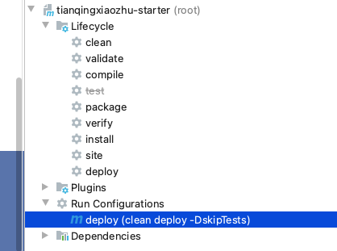
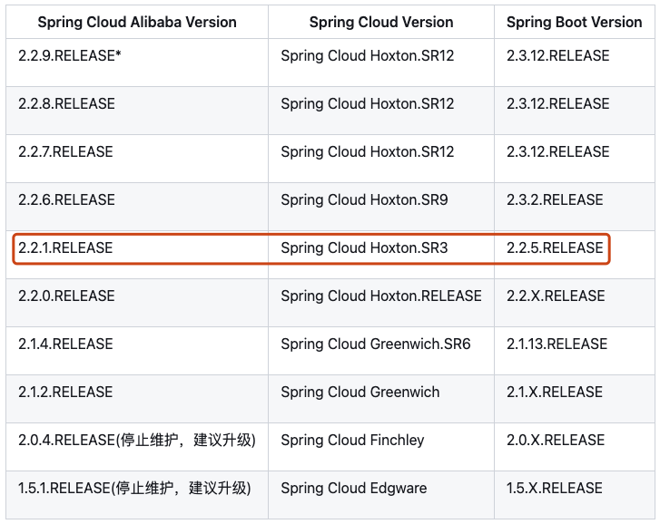
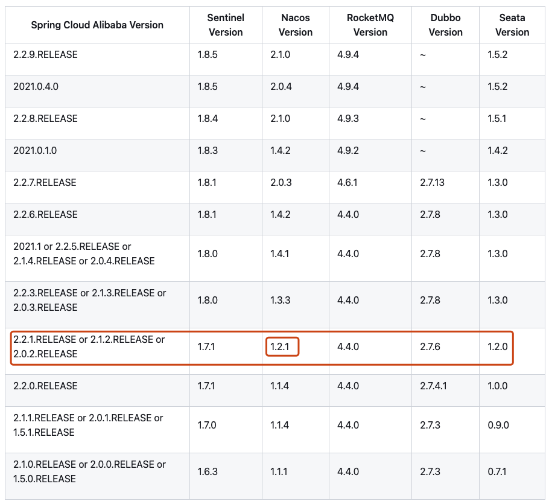

# 附录 02 统一管理依赖

为了更好的各个版本的依赖，我们搭建一个 nexus 私服，然后创建一个项目，配置好所有的依赖版本后，上传私服，然后让所有的模块都以这个模块父模块进行依赖，这样就达到所有的依赖的版本管理的目的。这也是 spring 官方 starter 的制作过程。

实际的本地开发过程中，可以不用搭建 nexus 私服。不过本篇文章可以带你体验一下官方 Spring 的 Starter 的制作过程。

## nexus-2

### CentOS 上安装 nexus2

- 安装依赖

```
$ java -version
java version "1.8.0_144"
Java(TM) SE Runtime Environment (build 1.8.0_144-b01)
Java HotSpot(TM) 64-Bit Server VM (build 25.144-b01, mixed mode)
```

- 上传到`/opt/package`目录

- 解压到解压目录

```
$ tar zxf /opt/package/nexus-2.14.5-02-bundle.tar.gz -C /usr/setup/
```

- 移动

```
$ mv -f /usr/setup/sonatype-work/ /opt/
```

- 配置 nexus

```
$ vi /usr/setup/nexus-2.14.5-02/conf/nexus.properties
// 修改后：
application-host=10.168.0.120
nexus-work=/opt/sonatype-work/nexus

$ vi /usr/setup/nexus-2.14.5-02/bin/nexus
// 修改后：
NEXUS_HOME="/usr/setup/nexus-2.14.5-02"
RUN_AS_USER=root

$ vi /usr/setup/nexus-2.14.5-02/bin/jsw/conf/wrapper.conf
// 修改后：
wrapper.java.command=/usr/setup/jdk1.8.0_144/bin/java
```

- 开放端口

```
$ firewall-cmd --zone=public --permanent --add-port=8081/tcp
$ firewall-cmd --reload
```

- 设置服务

```
$ vi /etc/systemd/system/nexus.service
[Unit]
Description=nexus
After=network.target
[Service]
Type=forking
ExecStart=/usr/setup/nexus-2.14.5-02/bin/nexus start
ExecReload=/usr/setup/nexus-2.14.5-02/bin/nexus restart
ExecStop=/usr/setup/nexus-2.14.5-02/bin/nexus stop
PrivateTmp=true
[Install]
WantedBy=multi-user.target

$ systemctl enable nexus
$ systemctl start nexus
```

- 测试

```
浏览器输入：http://10.168.0.120:8081/nexus
```

### 使用 nexus2.x

#### 权限管理

1. 用户
2. 角色

#### 仓库类型

几种仓库类型的简单介绍

#### 查看日志

如何查看 nexus 的执行日志

#### 下载中央仓库索引

1. 设置仓库开关
2. 创建任务

#### 设置项目连接私服

- 单个项目连接私服

```
// 只需要在项目的pom文件中添加下面内容即可

<repositories>
    <repository>
        <id>Nexus</id>
        <name>10.168.0.120-Nexus</name>
        <url>http://10.168.0.120:8081/nexus/content/groups/public/</url>
    </repository>
</repositories>

```

- 全局连接私服

```
// 在maven的setting.xml文件中配置下面内容即可

<mirrors>
    <mirror>
        <id>devnexus</id>
        <name>devnexus</name>
        <mirrorOf>*</mirrorOf>
        <url>http://10.168.0.120:8081/nexus/content/groups/public/</url>
    </mirror>
</mirrors>
```

#### 本地开发的 jar 发布到 nexus 上面

- 第一步：配置 setting.xml 文件

```
<settings xmlns="http://maven.apache.org/SETTINGS/1.0.0"
          xmlns:xsi="http://www.w3.org/2001/XMLSchema-instance"
          xsi:schemaLocation="http://maven.apache.org/SETTINGS/1.0.0 http://maven.apache.org/xsd/settings-1.0.0.xsd">


    <localRepository>D:\maven\my_local_repository</localRepository>

    <pluginGroups>
    </pluginGroups>

    <proxies>
    </proxies>


    <!--设置 Nexus 认证信息-->
    <servers>
        <server>
            <id>nexus-releases</id>
            <username>admin</username>
            <password>admin123</password>
        </server>
        <server>
            <id>nexus-snapshots</id>
            <username>admin</username>
            <password>admin123</password>
        </server>
    </servers>


    <!--设置 Nexus 镜像，后面只要本地没对应的以来，则到 Nexus 去找-->
    <mirrors>
        <mirror>
            <id>nexus-releases</id>
            <mirrorOf>*</mirrorOf>
            <url>http://10.168.0.120:8081/repository/maven-releases/</url>
        </mirror>
        <mirror>
            <id>nexus-snapshots</id>
            <mirrorOf>*</mirrorOf>
            <url>http://10.168.0.120:8081/repository/maven-snapshots/</url>
        </mirror>
        <mirror>
            <id>maven-aliyun</id>
            <name>aliyun maven</name>
            <url>http://maven.aliyun.com/nexus/content/groups/public/</url>
            <mirrorOf>central</mirrorOf>
        </mirror>
    </mirrors>

    <profiles>
        <profile>
            <id>nexus</id>
            <repositories>
                <repository>
                    <id>nexus-releases</id>
                    <url>http://nexus-releases</url>
                    <releases>
                        <enabled>true</enabled>
                    </releases>
                    <snapshots>
                        <enabled>true</enabled>
                    </snapshots>
                </repository>
                <repository>
                    <id>nexus-snapshots</id>
                    <url>http://nexus-snapshots</url>
                    <releases>
                        <enabled>true</enabled>
                    </releases>
                    <snapshots>
                        <enabled>true</enabled>
                    </snapshots>
                </repository>
            </repositories>
            <pluginRepositories>
                <pluginRepository>
                    <id>nexus-releases</id>
                    <url>http://nexus-releases</url>
                    <releases>
                        <enabled>true</enabled>
                    </releases>
                    <snapshots>
                        <enabled>true</enabled>
                    </snapshots>
                </pluginRepository>
                <pluginRepository>
                    <id>nexus-snapshots</id>
                    <url>http://nexus-snapshots</url>
                    <releases>
                        <enabled>true</enabled>
                    </releases>
                    <snapshots>
                        <enabled>true</enabled>
                    </snapshots>
                </pluginRepository>
            </pluginRepositories>
        </profile>
    </profiles>

    <activeProfiles>
        <activeProfile>nexus</activeProfile>
    </activeProfiles>

</settings>
```

- 第二步：在 pom 文件中添加：

```
<distributionManagement>
    <repository>
        <id>nexus-releases</id>
        <url>http://10.168.0.120:8081/repository/maven-releases/</url>
    </repository>
    <snapshotRepository>
        <id>nexus-snapshots</id>
        <url>http://10.168.0.120:8081/repository/maven-snapshots/</url>
    </snapshotRepository>
</distributionManagement>
```

#### 附：java 项目不同模块的划分

划分的背景
划分方法
参考地址

### 配置阿里云的代理源

1. 登陆 nexus 私服（默认账号密码：admin/admin123）
2. 点击右侧 Repositories
3. 点击 add，选择 Proxy Repository
4. 配置阿里云地址 http://maven.aliyun.com/nexus/content/groups/public/ , id,name 随意填
5. 将阿里云仓库加入仓库组中，并将其排在 Central 仓库之前

## 安装并配置 nexus3

### Docker 上安装 Nexus3

```sh
docker pull sonatype/nexus3

mkdir -p /mydata/nexus/data
chmod 777 -R /mydata/nexus

docker run -d --name nexus -p 8081:8081 \
--restart always \
-v /mydata/nexus/data:/nexus-data sonatype/nexus3

# 查看日志，看是否启动完成
docker logs -f nexus

# 启动后，查看自动生成的admin的密码
cat /mydata/nexus/data/admin.password

# 浏览器访问，然后登陆，用户名admin
修改密码： root1003
设置为可以匿名访问

```

### 配置

安装完成之后，需要对 nexus 进行一些初始化配置。

#### 修改 admin 的密码

```log
cat /mydata/nexus/data/admin.password
```

登录页面后修改密码： root1003

#### web 页面上配置用于上传自定义包的用户

- 创建角色


- 创建用户


### 2. 配置 maven 的 config

```xml

<server>
    <id>maven-public</id>
    <username>zeanzai</username>
    <password>root1003</password>
</server>
<server>
    <id>maven-releases</id>
    <username>zeanzai</username>
    <password>root1003</password>
</server>
<server>
    <id>maven-snapshots</id>
    <username>zeanzai</username>
    <password>root1003</password>
</server>

    <mirror>
    <id>maven-public</id>
    <name>maven-public</name>
    <url>http://192.168.1.150:8081/repository/maven-public/</url>
    <mirrorOf>*</mirrorOf>
</mirror>

<profile>
    <id>jdk-1.8</id>
    <activation>
    <activeByDefault>true</activeByDefault>
    <jdk>1.8</jdk>
    </activation>
    <properties>
    <maven.compiler.source>1.8</maven.compiler.source>
    <maven.compiler.target>1.8</maven.compiler.target>
    <maven.compiler.compilerVersion>1.8</maven.compiler.compilerVersion>
    </properties>
</profile>

```

### 3. 项目 pom 文件中的配置

```
<distributionManagement>
    <repository>
        <id>maven-releases</id>
        <url>http://192.168.1.150:8081/repository/maven-releases/</url>
    </repository>
    <snapshotRepository>
        <id>maven-snapshots</id>
        <url>http://192.168.1.150:8081/repository/maven-snapshots/</url>
    </snapshotRepository>
</distributionManagement>

```

注意此处的 id 要与 maven 中的 server 中的 id 保持一致。

### 4. deploy——部署到私服

- 在 maven 的窗口中，找到“create..”：


- 在打开的窗口中输入 `clean deploy -DskipTests` ：


- 运行命令，发布到 nexus 私服上：



- 运行结果：


### 5. 其他模块中的引用

在其他模块中统一引用我们自定义的 starter 依赖，这样就能进行统一的依赖的版本管理了。

```xml
<parent>
    <groupId>com.tianqingxiaozhu</groupId>
    <artifactId>tianqingxiaozhu-starter</artifactId>
    <version>0.0.1-SNAPSHOT</version>
</parent>

```

### 6. 特别说明

在团队中一般是团队中的重要成员才有推送到私服的权限，因此在实际的开发过程中普通程序员是不需要创建私服的。各位读者在实践过程中，也可以直接创建一个模块，然后把这个模块安装到本地仓库后，在其他模块中引入对应坐标即可。

### 7. SpringCloud 的版本

分为很多个组件，每一个组件都有自己的版本坐标，这个也很好理解，SpringCloud 是一个大型的工程，在这个工程里面有很多组件，每一个组件都是由一个小团队负责交付，由于负责不同的组件的团队不同，所以组件的交付时间节点肯定不一样，所以 SpringCloud 有一个自己的版本，这个版本中每一个组件的版本是不同的。

#### 7.1. SpringCloud-Alibaba 的版本

SpringCloud-Alibaba 是基于 SpringBoot 开发的，也是有不同的组件组成的。

因此二者有一个对应关系。

#### 7.2. 对应关系





我们选取的版本如下：

- JDK1.8
- CentOS7.9
- SpringBoot-2.2.5.RELEASE
- SpringCloud-Hoxton.SR3
- SpringCloudAlibaba-2.2.1.RELEASE
- Nacos1.2.1
- Seata1.3.0
- Sentinel1.7.1
- ...

#### 7.3. 创建服务模块的方法

项目使用 idea 中的 Spring Initializer 进行生成。这样做的好处是`当团队规模较大，并且每一个团队都负责一个模块时，可以让不同的团队只需要下载自己负责的模块代码即可，便于代码权限的管理`。

---

## 1. 场景

项目 a 和项目 b 都是 maven 工程。项目 a 需要使用到项目 b 的代码，项目 b 中又有很多子模块，而项目 a 中又不想一个一个的引入项目 b 中的 jar 包，只想在项目中引入一个依赖，就能使用到项目 b 中的每一个 jar。那如何实现呢？

## 2. 实现步骤

- 搭建 nexus 私服

- 创建项目 b

- 效果图

```java
project-b
    module-a
    module-b
```

- project-b

project-b 是一个聚合工程，所以它没有源代码，只有一个 pom 文件。文件内容如下

```
<?xml version="1.0" encoding="UTF-8"?>
<project xmlns="http://maven.apache.org/POM/4.0.0"
         xmlns:xsi="http://www.w3.org/2001/XMLSchema-instance"
         xsi:schemaLocation="http://maven.apache.org/POM/4.0.0 http://maven.apache.org/xsd/maven-4.0.0.xsd">
    <modelVersion>4.0.0</modelVersion>

    <groupId>com.wxy</groupId>
    <artifactId>project-b</artifactId>
    <version>1.0-SNAPSHOT</version>
    <packaging>pom</packaging> <!--pom项目，因为聚合了module-a和module-b-->

    <dependencies>
        <!--a模块的依赖-->
        <dependency>
            <groupId>com.wxy</groupId>
            <artifactId>module-a</artifactId>
            <version>1.0-SNAPSHOT</version>
        </dependency>

        <!--b模块的依赖-->
        <dependency>
            <groupId>com.wxy</groupId>
            <artifactId>module-b</artifactId>
            <version>1.0-SNAPSHOT</version>
        </dependency>
    </dependencies>


    <!--添加发布插件的依赖-->
    <distributionManagement>
        <repository>
            <id>nexus-releases</id>
            <url>http://10.168.0.120:8081/nexus/content/repositories/releases/</url>
        </repository>
        <snapshotRepository>
            <id>nexus-releases</id>
            <url>http://10.168.0.120:8081/nexus/content/repositories/snapshots/</url>
        </snapshotRepository>
    </distributionManagement>

</project>
```

- module-a

module-a 实现两个整数的相加。里面包括了两个重要的文件：一个是 pom.xml 文件，一个是 ATest.java 文件。

```xml
// pom.xml文件内容

<?xml version="1.0" encoding="UTF-8"?>
<project xmlns="http://maven.apache.org/POM/4.0.0"
         xmlns:xsi="http://www.w3.org/2001/XMLSchema-instance"
         xsi:schemaLocation="http://maven.apache.org/POM/4.0.0 http://maven.apache.org/xsd/maven-4.0.0.xsd">
    <modelVersion>4.0.0</modelVersion>

    <groupId>com.wxy</groupId>
    <artifactId>module-a</artifactId>
    <version>1.0-SNAPSHOT</version>
    <packaging>jar</packaging> <!--jar项目-->

    <!--添加发布插件的依赖-->
    <distributionManagement>
        <repository>
            <id>nexus-releases</id>
            <url>http://10.168.0.120:8081/nexus/content/repositories/releases/</url>
        </repository>
        <snapshotRepository>
            <id>nexus-releases</id>
            <url>http://10.168.0.120:8081/nexus/content/repositories/snapshots/</url>
        </snapshotRepository>
    </distributionManagement>

</project>
```

```java
// ATest.java内容
public class ATest {

    public int add(int a, int b) {
        return a + b;
    }
}
```

- module-b

module-b 实现两个整数的相加。里面包括了两个重要的文件：一个是 pom.xml 文件，一个是 BTest.java 文件。

```xml
// pom.xml文件内容

<?xml version="1.0" encoding="UTF-8"?>
<project xmlns="http://maven.apache.org/POM/4.0.0"
         xmlns:xsi="http://www.w3.org/2001/XMLSchema-instance"
         xsi:schemaLocation="http://maven.apache.org/POM/4.0.0 http://maven.apache.org/xsd/maven-4.0.0.xsd">
    <modelVersion>4.0.0</modelVersion>

    <groupId>com.wxy</groupId>
    <artifactId>module-b</artifactId>
    <version>1.0-SNAPSHOT</version>
    <packaging>jar</packaging> <!--jar项目-->

    <!--添加发布插件的依赖-->
    <distributionManagement>
        <repository>
            <id>nexus-releases</id>
            <url>http://10.168.0.120:8081/nexus/content/repositories/releases/</url>
        </repository>
        <snapshotRepository>
            <id>nexus-releases</id>
            <url>http://10.168.0.120:8081/nexus/content/repositories/snapshots/</url>
        </snapshotRepository>
    </distributionManagement>

</project>
```

```java
// ATest.java内容
public class BTest {

    public int sub(int a, int b) {
        return a - b;
    }
}
```

- 打包发布子模块

需要对每一个子模块进行打包发布。具体过程是：点击 maven project 窗口，找到每一个子模块的 LifeCycle 中的 deploy，右键 create... ，在弹出的窗口的 Command line 处填写 `clean deploy -DskipTests`，然后 ok。会在该子模块的 plugins 下面生成一个 Run Configurations，展开双击即可发布到私服。

对每一个模块都执行同样的步骤，即可将所有子模块都发布到私服上面。

- 打包发布聚合工程

等所有的子模块都发布成功后，对聚合工程执行打包发布过程，发布过程和上面发布子模块的步骤一致。

## 3. 使用

- 添加依赖

```xml
<dependency>
    <groupId>com.wxy</groupId>
    <artifactId>project-b</artifactId>
    <version>2.2-RELEASE</version>
    <type>pom</type>
</dependency>
```

- 使用

```java
public class ProjectATest {

    public static void main(String[] args) {
        ATest aTest = new ATest();
        System.out.println(aTest.add(1, 2));

        BTest bTest = new BTest();
        System.out.println(bTest.sub(10, 9));
    }
}
```

## 4. 注意

每次更新 project-b 的时候，都需要更新每一个模块的版本，同样，project-b 的版本也需要更新，不然，会出现发布的错误。
