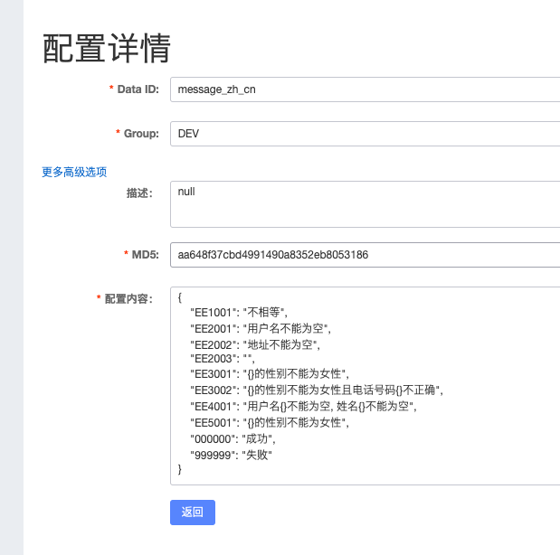
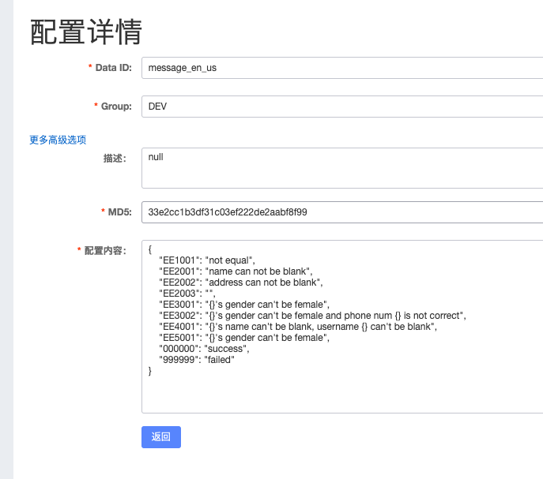
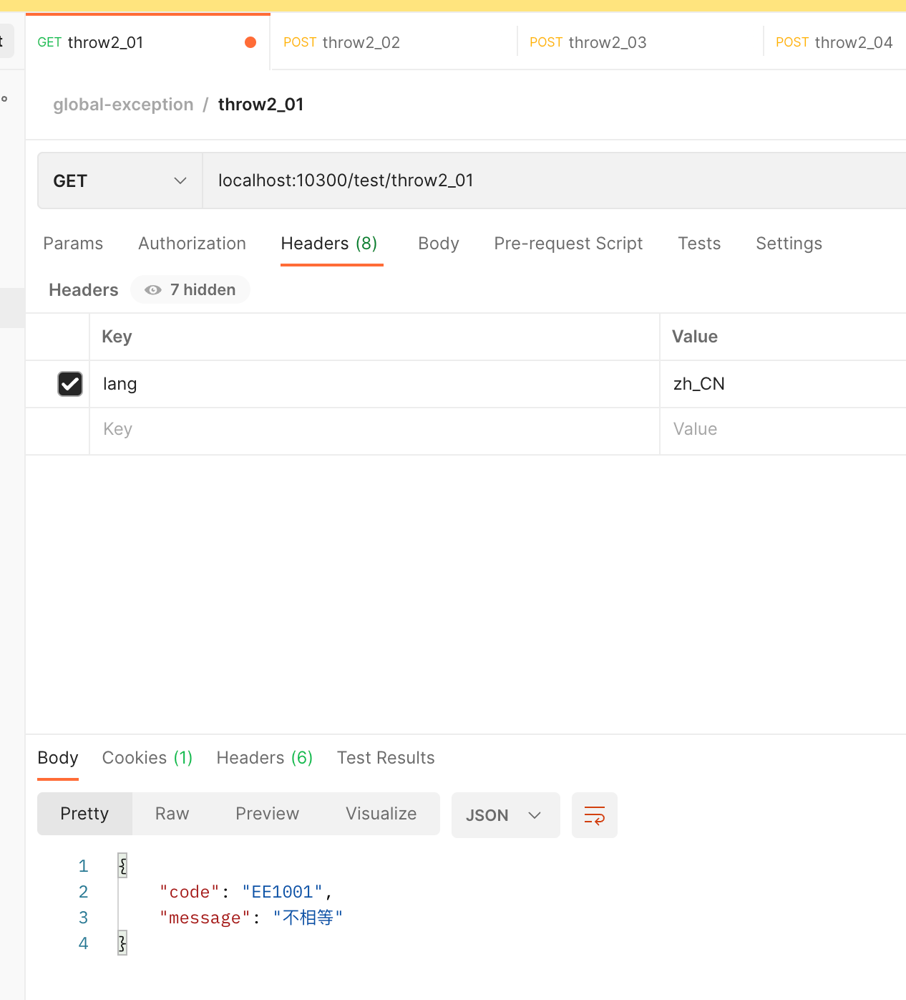
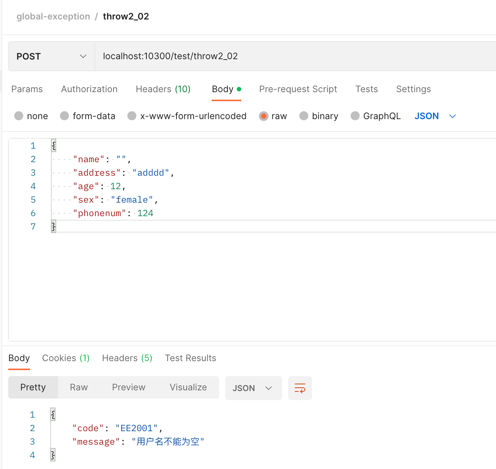
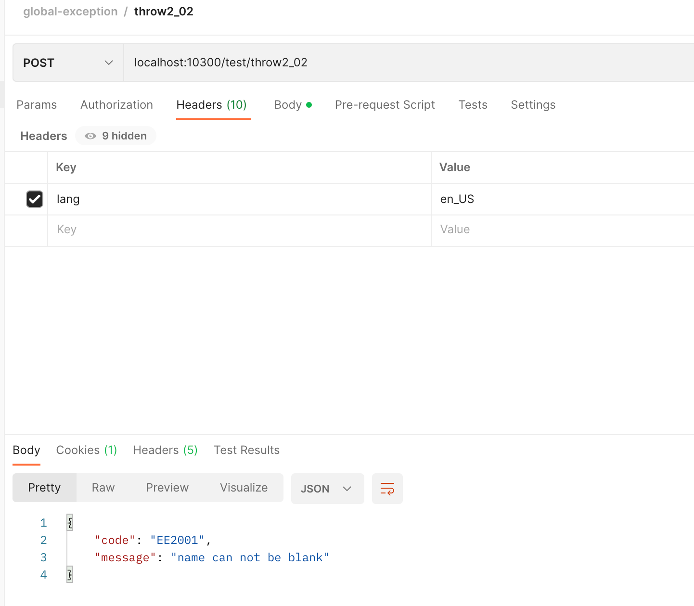
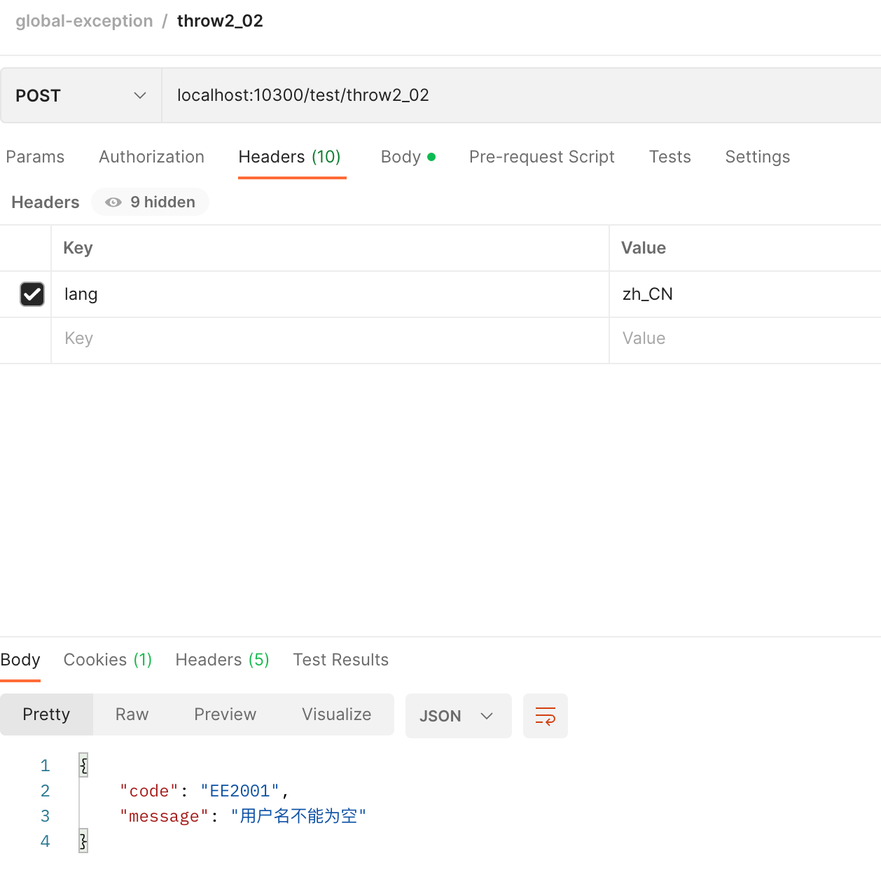
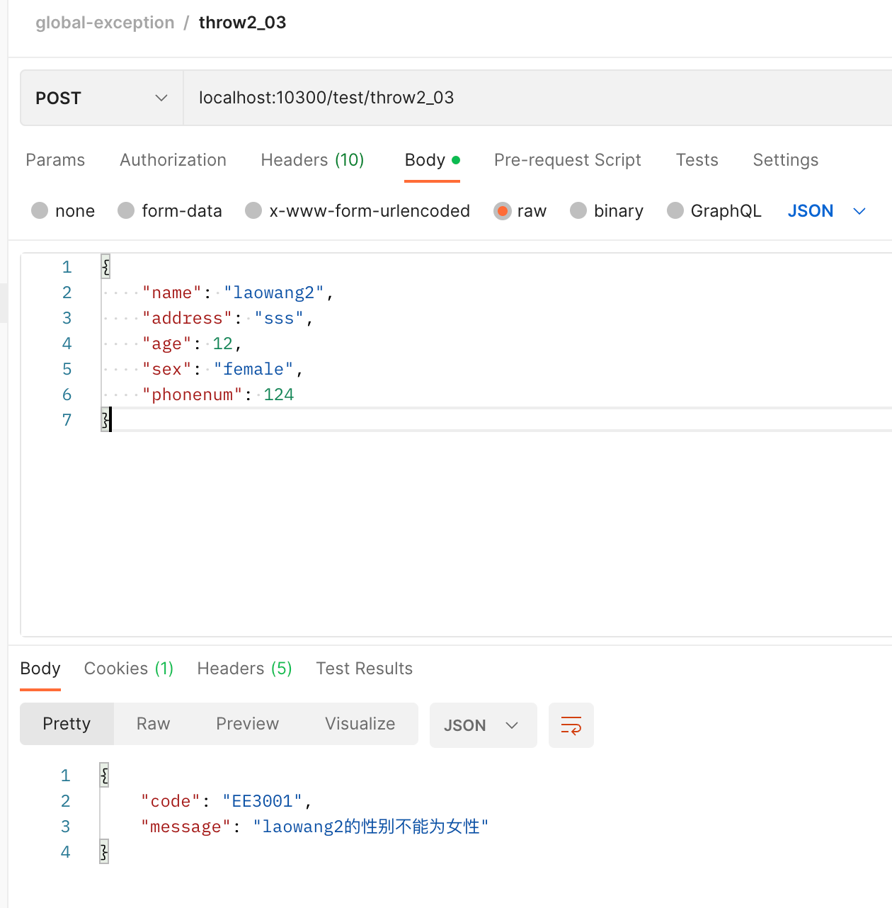
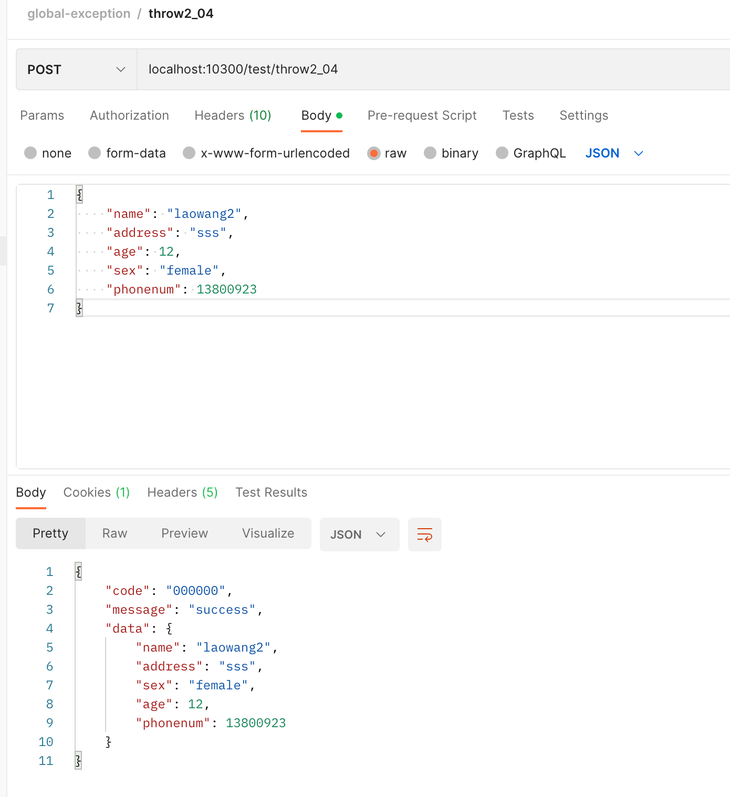
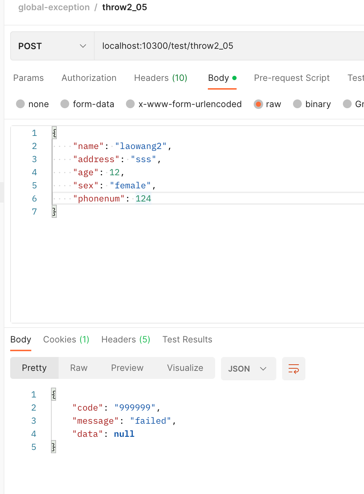

# 统一响应体+Nacos 可配置全局异常

### 背景

我们知道接口的返回，一般情况下就只有三种状态，成功、失败和超时响应，而接口的方法调用结果可能会出现很多异常信息。在实际的业务开发过程中，我们要求接口的异常信息是一定要处理掉的，不能直接把一个堆栈信息返回给前端用户的。这样要求的原因是：

1. 一大堆的异常信息会影响用户体验。用户是不懂技术的，接口返回一大堆异常信息，用户本能的就认为系统出了问题，这影响用户体验；但是返回能够被用户所理解的信息，则是可以接受的。
2. 暴露异常信息影响系统可用性评价。接口返回一大堆异常信息，除了用户本能的认为系统出了问题，业务部门也会觉得系统此时不可用。
3. 异常信息千奇百怪，不利于前端处理。

事实上，一个架构优良的系统，是需要前端开发和后端开发相互配合的。前端和后端开发约定好接口的响应格式，然后再根据这个格式完成前后端的公共模块的开发。这个过程中后端对应的业务功能就是`全局统一响应`。

### 全局统一响应

实际上，我们可以把异常也归类为一种特殊的返回结果。全局统一响应有什么业务要求或业务特点呢？

对异常的要求：

1. 支持代码中抛出异常信息，并且抛出的异常信息的格式要求统一；
2. 异常信息的格式应与接口正常响应或失败响应的消息体格式保持一致；
3. 异常信息要支持国际化；
4. 异常信息编码要具有业务含义；

对响应的要求：

1. 支持默认的响应成功或响应失败的结果；
2. 响应信息支持国际化；
3. 与异常信息的格式保持一致；

除了这些以外，还会有其他细化的需求。以下是几个常用的场景：

```
// 遇到业务出现异常时，直接抛出异常信息

// 有些前端传过来的请求参数需要做校验，遇到校验不通过的直接抛出异常信息

// 接口正常响应时，返回正常响应消息体

// 接口响应失败时，返回默认的响应失败消息体

```

根据上面的业务特点，我们明确实现目标：

1. Nacos 作为配置中心，但是需要我们自行编写工具类，最终达到的目的是，同一个异常编码对应多国语言的异常信息，并且能够自动刷新（即修改 Nacos 立即生效）；
2. 配合 Validation 使用时，对业务主流程侵入性达到最小，最好是零侵入；
3. 统一响应体消息格式，并且可以直接使用 success 和 error 方法；
4. 业务代码中抛出异常的方式与 jdk 抛出异常方式在使用方式上一致，但是业务中抛出的异常信息的响应结果与自定义的响应消息体格式保持一致；

### 实战过程

主要包括三个方面：

1. 重写语言解析器。这个步骤是可选的，主要目的是改变请求头里面语言的属性名。
2. 构建配置信息。这个步骤是把国际化的配置信息配置到配置中心，然后监听数据变更，并构建一个工具类让统一响应功能和统一异常处理功能使用。
3. 构建统一响应消息体。这个步骤是格式化接口的响应信息，需要利用到上一步编写的工具类。
4. 构建统一异常处理。这个步骤是格式化异常信息的响应信息，需要利用到第二步编写的工具类。

#### 重写语言解析器

```java
public class LanguageResolver implements LocaleResolver {
    /**
     * 请求header字段
     */
    private static final String LANG = "lang";

    /**
     * session
     */
    private static final String LANG_SESSION = "lang_session";
    @Override
    public Locale resolveLocale(HttpServletRequest request) {
        String lang = request.getHeader(LANG);
        Locale locale = Locale.getDefault();
        if (StringUtils.isNotBlank(lang)){
            String[] language = lang.split("_");
            locale = new Locale(language[0], language[1]);

            HttpSession session = request.getSession();
            session.setAttribute(LANG_SESSION, locale);
        }else{
            HttpSession session = request.getSession();
            Locale localeInSession = (Locale) session.getAttribute(LANG_SESSION);
            if (localeInSession != null){
                locale = localeInSession;
            }
        }
        return locale;
    }

    @Override
    public void setLocale(HttpServletRequest request, HttpServletResponse response, Locale locale) {

    }
}

```

```java
@Configuration
public class MessageConfig {

    @Bean
    public LocaleResolver localeResolver(){
        return new LanguageResolver();
    }

}

```

#### 构建配置信息

这里我们选用 Alibaba-Nacos 组件。

```xml
<dependency>
    <groupId>com.alibaba.cloud</groupId>
    <artifactId>spring-cloud-starter-alibaba-nacos-config</artifactId>
</dependency>

```

```yml
server:
  port: 10300
spring:
  application:
    name: global-exception
  cloud:
    nacos:
      config:
        # nacos的服务端地址
        server-addr: 192.168.1.150:8848
        # 应用接入的命名空间的id
        namespace: 8d269024-f215-4195-be82-f6343cafde9c
        # 命名分组
        group: DEV
```

配置一个枚举类，枚举出所有的国际化的异常码表。

```java
public enum NacosJson2ObjEnum {

    MESSAGE_ZH_CN("message_zh_cn", "业务异常码表（简中）", Map.class),
    MESSAGE_EN_US("message_en_us", "业务异常码表（英文）", Map.class)
    ;

    private String dataId;
    private String desc;
    private Class clz;

    NacosJson2ObjEnum(String dataId, String desc, Class clz) {
        this.dataId = dataId;
        this.desc=desc;
        this.clz =clz;
    }

    public String getDataId(){
        return dataId;
    }

    public String getDesc(){
        return desc;
    }

    public Class getClz(){
        return clz;
    }
}

```

利用 Spring 初始化 Bean 机制，把国际化异常码表信息加载本地内存中，并设置监听器监听 Nacos 上面的配置变化。

```java
@Slf4j
@Component
public class NacosConfig implements InitializingBean {
    @Autowired
    private NacosConfigProperties nacosConfigProperties;

    @Value("${spring.cloud.nacos.config.group}")
    private String group;

    private ConfigService configService;
    private Map<String, Object> localCatchMap = new HashMap<>();

    private static ThreadPoolExecutor executor =
            new ThreadPoolExecutor(
                    2,
                    4,
                    1,
                    TimeUnit.SECONDS,
                    new LinkedBlockingDeque<>(100),
                    new ThreadPoolExecutor.CallerRunsPolicy()
            );

    @Override
    public void afterPropertiesSet() throws Exception {
        // 获取 Nacos 服务端 具体配置
        String serverAddr = nacosConfigProperties.getServerAddr();
        String namespace = nacosConfigProperties.getNamespace();

        // 封装 Nacos server 配置参数
        Properties properties = new Properties();
        properties.put(PropertyKeyConst.SERVER_ADDR, serverAddr);
        properties.put(PropertyKeyConst.NAMESPACE, namespace);
        if (configService == null) {
            configService = NacosFactory.createConfigService(properties);
        }

        NacosJson2ObjEnum[] nacosJson2ObjEnums = NacosJson2ObjEnum.values();
        for (NacosJson2ObjEnum nacosJson2ObjEnum : nacosJson2ObjEnums) {
            String dataId = nacosJson2ObjEnum.getDataId();
            String config = configService.getConfig(dataId, group, 1000);

            // 把获取到的配置信息放到本地map中
            jsonToObject(config, nacosJson2ObjEnum);

            // 设置监听器，监听配置变化
            configService.addListener(
                    nacosJson2ObjEnum.getDataId(),
                    group,
                    new NacosJsonConfigDataListener(nacosJson2ObjEnum)
            );
        }

    }

    public void jsonToObject(String json, NacosJson2ObjEnum eNacosJsonDefinition) {
        Object data = JSON.parseObject(json, eNacosJsonDefinition.getClz());
        log.info("Get Nacos Config Data, dataId = {} --- data = {}",
                eNacosJsonDefinition.getDataId(), data);
        localCatchMap.put(eNacosJsonDefinition.getDataId(), data);
    }

    public class NacosJsonConfigDataListener implements Listener {
        private NacosJson2ObjEnum nacosJson2ObjEnum;

        private NacosJsonConfigDataListener(NacosJson2ObjEnum nacosJson2ObjEnum) {
            this.nacosJson2ObjEnum = nacosJson2ObjEnum;
        }

        @Override
        public Executor getExecutor() {
            return executor;
        }

        @Override
        public void receiveConfigInfo(String configInfo) {
            jsonToObject(configInfo, nacosJson2ObjEnum);
        }
    }

    public <T> T getNacosJson2Object(NacosJson2ObjEnum nacosJson2ObjEnum, Class<? extends T> clz) {
        Object data = localCatchMap.get(nacosJson2ObjEnum.getDataId());
        if (clz.isInstance(data)) {
            return (T)data;
        }
        throw new IllegalArgumentException("转换类型失败");
    }
}

```

对外提供一个工具类，获取国际化的异常信息。

```java
@Component
public class MessageNacosUtil {

    @Autowired
    private static NacosConfig nacosConfig;

    @Autowired
    public void setNacosConfig(NacosConfig nacosConfig) {
        MessageNacosUtil.nacosConfig = nacosConfig;
    }

    public static String getExcptMsg(String excptCode) {
        return StrFormatter.format(getMessageMap().get(excptCode), null);
    }

    public static String getExcptMsg(String excptCode, String... args) {
        return StrFormatter.format(getMessageMap().get(excptCode), args);
    }

    public static Map<String, String> getMessageMap(){
        Map<String, String> messageMap = null;
        String language = LocaleContextHolder.getLocale().getLanguage();
        if ("".equals(language) || "zh".equals(language)) {
            messageMap = nacosConfig.getNacosJson2Object(NacosJson2ObjEnum.MESSAGE_ZH_CN, Map.class);
        } else {
            messageMap = nacosConfig.getNacosJson2Object(NacosJson2ObjEnum.MESSAGE_EN_US, Map.class);
        }
        return messageMap;
    }
}

```

#### 构建统一响应消息体

```java
@Data
@AllArgsConstructor
@NoArgsConstructor
public class BaseResponse{

    protected String code;

    private String message;

}

```

```java
@Data
public class DataResponse<T> extends BaseResponse{

    private T data;

    /**
     * 如果响应结果中只给了code，那么msg就去nacos中查询
     */
    public static <T> DataResponse response(String code, T data) {
        DataResponse dataResponse = new DataResponse();
        dataResponse.setCode(code);
        dataResponse.setMessage(MessageNacosUtil.getExcptMsg(code));
        dataResponse.setData(data);
        return dataResponse;
    }

    public static <T> DataResponse response(String code, String msg, T data) {
        DataResponse dataResponse = new DataResponse();
        dataResponse.setCode(code);
        dataResponse.setMessage(msg);
        dataResponse.setData(data);
        return dataResponse;
    }

    /**
     * 响应成功的消息进行固定并统一
     */
    public static <T> DataResponse success(T data) {
        return response(ResponseStatusCode.OK, data);
    }

    /**
     * 响应失败支持自定义code和msg
     */
    public static DataResponse error(String code, String msg) {
        return response(code, msg, null);
    }

    /**
     * 默认的响应失败结果
     */
    public static DataResponse error() {
        return response(ResponseStatusCode.ERROR, null);
    }

}

```

#### 构建统一异常处理

```java
public class BaseException extends RuntimeException implements Serializable {
    public BaseException() {
    }

    public BaseException(String message) {
        super(message);
    }

    public BaseException(Throwable cause) {
        super(cause);
    }

    public BaseException(String message, Throwable cause) {
        super(message, cause);
    }
}

```

```java
@Data
public class BizException extends BaseException{

    private BaseResponse baseResponse = new BaseResponse();

    public BizException(BaseResponse baseResponse) {
        super(baseResponse.getCode()+", "+ baseResponse.getMessage());
        this.baseResponse = baseResponse;
    }

    public BizException(BaseResponse baseResponse, Throwable throwable) {
        super(baseResponse.getCode() + ", " + baseResponse.getMessage(), throwable);
        this.baseResponse = baseResponse;
    }

    /**
     * 抛出异常支持多个msg进行组合拼装
     */
    public BizException(String code, String... msg) {
        super(code+ ", "+msg);
        this.baseResponse.setCode(code);
        String excptMsg = MessageNacosUtil.getExcptMsg(code, msg);
        this.baseResponse.setMessage(excptMsg);
    }


    public BizException(String code, String msg, Throwable throwable) {
        super(code+ ", "+msg, throwable);
        this.baseResponse.setCode(code);
        this.baseResponse.setMessage(msg);
    }

}

```

关键一步，重写自定义的异常信息。

```java
@ControllerAdvice
public class GlobalExceptionHandler {

    @ExceptionHandler(value = BizException.class)   // 项目中遇到 BizException 时的处理逻辑
    public ResponseEntity bizExceptionHandler(BizException bizException) {
        BaseResponse baseResponse = bizException.getBaseResponse();
        return new ResponseEntity(baseResponse, HttpStatus.OK);
    }
}

```

### 使用

开发过程中还涉及到请求参数的校验过程，这里我们选用 Validation 的工具类。下面是集成过程。

#### 集成 Validation

```xml
<dependency>
    <groupId>org.springframework.boot</groupId>
    <artifactId>spring-boot-starter-validation</artifactId>
</dependency>

```

```java
@ControllerAdvice
public class GlobalExceptionHandler {

    @ExceptionHandler(value = BizException.class)
    public ResponseEntity bizExceptionHandler(BizException bizException) {
        BaseResponse baseResponse = bizException.getBaseResponse();
        return new ResponseEntity(baseResponse, HttpStatus.OK);
    }

    // 遇到 参数校验时的异常处理
    @ExceptionHandler(value = MethodArgumentNotValidException.class)
    public ResponseEntity methodArgumentNotValidExceptionHandler(MethodArgumentNotValidException methodArgumentNotValidException) {
        BindingResult bindingResult = methodArgumentNotValidException.getBindingResult();
        if (bindingResult.getFieldErrors() != null) {
            // 如果校验结果中有多个异常，就只返回第一个异常信息
            String excptCode = bindingResult.getFieldErrors().get(0).getDefaultMessage();
            String excptMsg = MessageNacosUtil.getExcptMsg(excptCode);
            BizException bizException = new BizException(excptCode, excptMsg);
            return new ResponseEntity(bizException.getBaseResponse(), HttpStatus.OK);
        }
        return new ResponseEntity(null, HttpStatus.OK);
    }
}

```

#### 测试

我们在 nacos 上添加配置文件，并填充内容。




```json
// message_zh_cn
{
  "EE1001": "不相等",
  "EE2001": "用户名不能为空",
  "EE2002": "地址不能为空",
  "EE2003": "",
  "EE3001": "{}的性别不能为女性",
  "EE3002": "{}的性别不能为女性且电话号码{}不正确",
  "EE4001": "用户名{}不能为空，姓名{}不能为空",
  "EE5001": "{}性别不能为女性",
  "000000": "成功",
  "999999": "失败"
}
```



```json
// message_en_us
{
  "EE1001": "not equal",
  "EE2001": "name can not be blank",
  "EE2002": "address can not be blank",
  "EE2003": "",
  "EE3001": "{}'s gender can not be female",
  "EE3002": "{}'s gender can not be female and phone num {} is not correct",
  "EE4001": "{}'s name can not be blank, username {} can't be blank",
  "EE5001": "{}'s gender can not be female",
  "000000": "success",
  "999999": "failed"
}
```

我们编写一个 controller 进行测试：

1. 直接抛出业务异常

```java
@GetMapping("/throw2_01")
public OperationResponse test02_01() {

    if ("0".equals("0")) {
        throw new BizException(ResponseStatusCode.EE1001);
    }
    return OperationResponse.success(MessageNacosUtil.getExcptMsg(ResponseStatusCode.OK));
}

```




2. 抛出校验异常

```java

@Data
public class UserDTO {

    // 校验注解的message直接为一个常量字符串
    @NotEmpty(message = ResponseStatusCode.EE2001)
    private String name;

    @NotBlank(message = ResponseStatusCode.EE2002)
    private String address;


    private String sex;
    private Integer age;
    private Long phonenum;
}

```

```java
@PostMapping("/throw2_02")
public DataResponse<UserDTO> test02_02(
        @RequestBody @Validated UserDTO userDTO
) {
    return DataResponse.success(userDTO);
}

```







原理解读： @NotBlank 和 @NotEmpty 注解校验不通过时，会抛出 MethodArgumentNotValidException 异常信息，而我们在 GlobalExceptionHandler 中捕获这个异常信息之后做了自定义处理逻辑，大概逻辑就是先获取到抛出异常信息的 message 信息，拿到异常码，之后利用工具类和语言信息从 Nacos 中获取异常码的描述信息。

注意： 上面的捕获 MethodArgumentNotValidException 后的处理逻辑中只处理了所抛出的第一个异常信息，自测多次同一个请求类，由于是多个字段校验，可能会抛出不同的异常信息，这里需要做自定义实现。

3. 抛出组合后的异常信息

```java
@PostMapping("/throw2_03")
public DataResponse<UserDTO> test02_03(
        @RequestBody @Validated UserDTO userDTO
) {
    if ("female".equals(userDTO.getSex())) {
        throw new BizException(ResponseStatusCode.EE3001, userDTO.getName());
    }
    return DataResponse.success(userDTO);
}

```



4. 抛出多个参数组成的异常信息

```java
@PostMapping("/throw2_04")
public DataResponse<UserDTO> test02_04(
        @RequestBody @Validated UserDTO userDTO
) {
    if ("female".equals(userDTO.getSex()) && userDTO.getPhonenum()<138000) {
        throw new BizException(ResponseStatusCode.EE3002, userDTO.getName(), String.valueOf(userDTO.getPhonenum()));
    }
    return DataResponse.success(userDTO);
}

```




5. 返回默认的响应失败消息体

```java
@PostMapping("/throw2_05")
public DataResponse<UserDTO> test02_05(
        @RequestBody @Validated UserDTO userDTO
) {
    return DataResponse.error();

}

```



### 参考

- [Nacos 实现 SpringBoot 国际化的增强](https://blog.csdn.net/qq_15898739/article/details/104680114)
- [Java 统一异常处理(配置文件集中化定义)](https://mp.weixin.qq.com/s/XE4R2wOj08qNivo8Ms5ZRQ)
- [三种手段：通过 Apollo 和 nacos 的能力进行国际化动态配置实现热更新](https://developer.aliyun.com/article/1180037)
