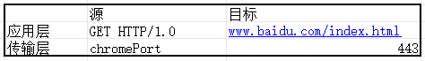
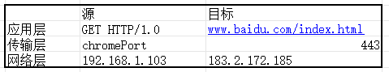
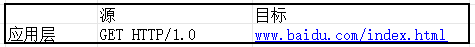
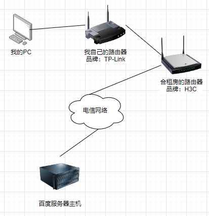
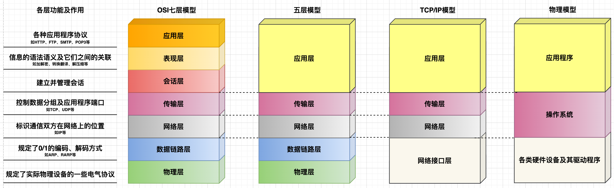
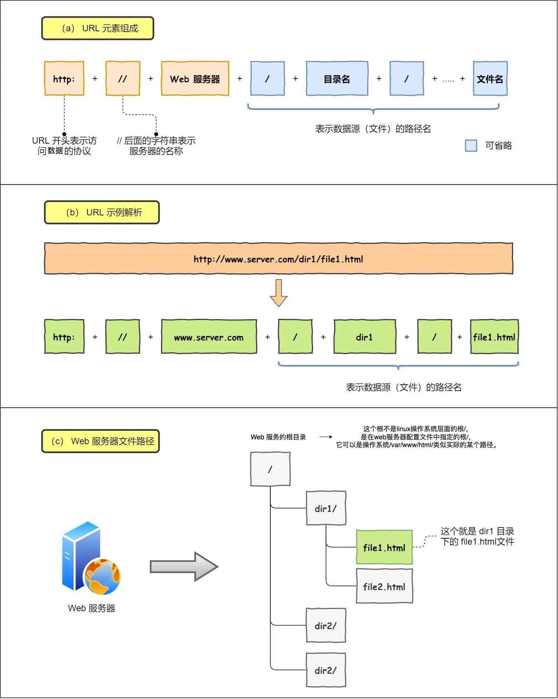
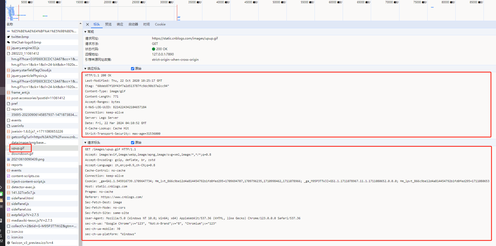
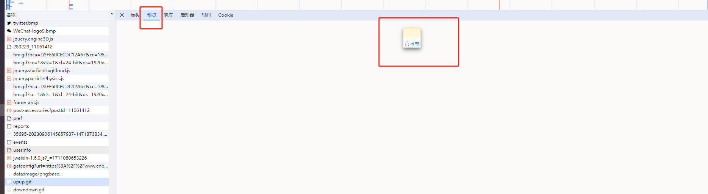
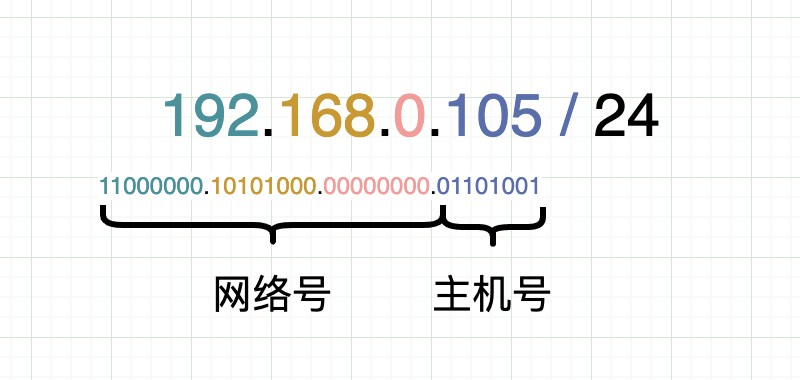

## 大纲

- 七层协议及每层的作用、五层协议、TCP/IP 协议，它们之间的迭代过程
- TCP/IP 协议
  - 应用层
    - URI VS URL
    - HTTP（超文本传输协议）
      - HTTP 报文格式、
      - 请求方法及其作用
      - 响应码
      - HTTP 迭代过程（1.0 -> 1.1 -> 2.0 -> HTTPS）
      - HTTPS 过程
      - 长链接与短链接
      - 跨域及其解决方案
      - 如何理解 HTTP 有状态和无状态？
      - 既然已经有了 HTTP，为什么还会有 RPC？
      - 既然有了 HTTP，为什么还会有 WebSocket？
    - DNS（地址解析协议）过程
    - Cookie 与 Session ，分布式会话
  - 传输层
    - TCP 报文格式
    - 可靠性保证手段
    - 粘包问题及解决方案、拆包问题及解决方案
    - TCP 洪泛滥问题及解决方案
    - 三次握手
      - 过程
      - 为什么不能是两次或四次？
      - 洪泛滥问题及其解决方案
    - 四次挥手
      - 过程
      - 为什么需要四次？
        - 单向通道问题
        - 服务端可能还有部分数据未接收完毕
    - TCP 和 UDP 区别
  - 网络层
    - IP 报文格式
      - 网络号、主机号、IP 地址、子网掩码、网关
    - 超网划分
    - 多网卡选择过程
    - IP 协议转发流程（MAC-端口映射表、路由表）
    - IPv4 VS IPv6
  - 网络接口层
    - 集线器
      - 作用：
    - 交换机
      - 作用：
    - 路由器
      - 作用：
    - 为什么有 IP 了还需要 MAC？
- 一次网络请求的过程
  - TCP/IP 四层协议上的一次网络请求过程
  - Linux 一次请求的过程
- CDN 原理
- 安全
  - 安全问题类型解决方案
    - HTTPS 过程
    - TCP 洪泛滥攻击
    - DDos 攻击、跨域请求攻击、XSS 攻击、SQL 注入攻击
- 补充
  - 什么是 RESTful API 架构以及如何理解这种架构？
  - 未出现 RESTful API 架构之前的应用层通信方式是怎么样的？
  - **RESTful API** vs **SOAP** vs **XML-RPC**

## 前言

::: tip 导学指引

首先要明白一个基本问题：计算机网络到底解决了什么问题。那么我们就先从现实社会中的从一个请求从开始到结束的整个过程来说。

主要包括两方面的内容：

1. 数据包的封装和解析；
2. 数据包在整个链路上的传输过程；

上面两个过程完成之后，一个请求就算是基本完成了。但是在这个过程中还有许多问题需要解决，然后我们就可以根据出现了什么问题，具体的解决方案是什么的顺序进行展开。

因此我们的逻辑树应该是这样的：

1. 一个请求从开始到结束的整个过程是怎样的？
2. 之后才进入理论部分：
   1. 什么是 OSI 七层模型、五层模型、TCP/IP 四层模型分别是什么，他们之间的发展过程是怎样的。
   2. 之后是按照 TCP/IP 四层模型分别展开。

:::

### 学习方法

1. 学习计算机网络，事实上就是学习各种各样的协议，以及最后使用各种协议了解整个网络请求到响应的过程。
2. 直接阅读 RFC 原版英文文档，其实很简单；配合 Wiki 一块；
3. 使用 相关工具 进行实验；

### 为什么要分层

1. 分层的意义在于： 让每一层都有自己的具体实现，又让每一层都有统一的实现标准。
2. Java 程序员的核心工作也是基于操作系统上层，写一些应用程序，这些应用程序在 OSI 模型中属于应用层的概念，本质上是对计算机资源的组合使用。比如，tomcat，就是组合使用了操作系统中的网络资源、CPU 资源、内存资源等。而操作系统是已经完成了对一些资源的操作的统一的对外的接口。比如说 Tomcat 要想在 Linux 平台上使用网络资源，本质上就是 tomcat 调用了操作系统对外提供的一系列的 api 接口。
3. 应用层多使用 HTTP 协议，所以应用层就要实现单独属于自己的 HTTP 协议的实现。协议的实现与协议本身的区别： 我在淘宝上买东西，我只需要完成挑选商品和付款操作即可，不需要关注淘宝到底使用什么快递给我运送货物；挑选商品和付款操作就是我与淘宝之间的协议，最后淘宝选择了顺丰帮我运送货物，那顺丰快递就是我和淘宝之间协议的具体实现。同样的，类比到应用层的实现上也是一样，协议的最终效果就是完成双方的通信，具体的实现方式就是由通信双方自行协商。

### 计算机网络的发展历程


- 所谓 `通信`，就涉及到信息的发送方和信息的接收方，因此，对于发送方发送出去的消息是如何进行控制的（如加密、压缩、分组等控制手段），只要能够让接收方接收到的信息进行反向操作（解密、解压缩、合并分组等反向控制手段），那么就可以达到信息的“可靠”传递。至于接收方接收到信息后如何处理，则需要通信双方事先规定好信息的控制手段，这些信息的控制手段就被称为 `协议`。
- 计算机网络，就是解决信息在互联网上进行传递的一门学问，核心就是各种各样的协议。
- `协议`： 说白了，就是一组规则，代表着某个物体或要解决某个问题所遵循的标准；通信协议的制定只遵循一个标准，那就是“通信双方都认可”，这就意味着“是个人就可以制定协议”，但实际上前人制定的 TCP/IP 已经非常完善，我们在学习过程中只需要“站在巨人的肩膀”上即可。
- `OSI（Open System Interconnection， 开放系统互连参考模型）`是国际标准化组织（ISO）制定的一个用于计算机或通信系统间互联的标准体系。可以理解为一个“形而上”的标准，`中看不中用`。它严格规定了每一层所承担的任务，由上至下：
  - 应用层： 管理各种应用程序使用网络的规则，包括 HTTP、FTP、SMTP、POP3、DNS 等；
  - 表现层： 管理信息的语法语义以及它们之间的联系；
  - 会话层： 建立并管理会话；
  - 传输层： 控制数据分组及应用程序端口，协议内容有： TCP、UDP 等协议；
  - 网络层： 控制数据在网络上的传输过程，协议内容包括： IP、ARP、RARP 等协议；
  - 数据链路层： 规定 0/1 的编码、解码方式等；
  - 物理层： 规定各类网络设备的电气特性；
- 人们在实践过程中，发现上面三层（应用层、表现层、会话层）都可以由应用程序自行控制，因此就发展出了 `五层协议`，即把 OSI 中的应用层、表现层和会话层三层合并成一层——应用层。
- 随着硬件设备的发展，人们又发现在实际的使用过程中并不需要过多的关注 OSI 中数据链路层和物理层，再加上传输层（TCP 和 UDP 协议）以及网络层（IP、ARP、RARP 等协议）的发展，于是人们再次把 OSI 的数据链路层和物理层进行简化，就形成了现在的“事实标准”——`TCP/IP四层模型`，这个模型也是我们研究的 `重点`。
- 为便于理解，笔者把 TCP/IP 四层模型在现实中的实现过程对应到计算机各个组件上，如上图中的物理模型。

### TCP / IP 协议族

| 分层                                             | 常见协议                                                                                                                                       | 解决的问题                                 |
| :----------------------------------------------- | ---------------------------------------------------------------------------------------------------------------------------------------------- | ------------------------------------------ |
| 4 应用层 application layer                       | HTTP、FTP、DNS （如 BGP 和 RIP 这样的路由协议，尽管由于各种各样的原因它们分别运行在 TCP 和 UDP 上，仍然可以将它们看作网络层的一部分）          | 解决的是应用程序层面的数据格式问题         |
| 3 传输层 transport layer                         | TCP、UDP、RTP、SCTP （如 OSPF 这样的路由协议，尽管运行在 IP 上也可以看作是网络层的一部分）                                                     | 解决的是应用程序怎么使用操作系统资源的问题 |
| 2 网络互连层 internet layer                      | 对于 TCP/IP 来说这是因特网协议（IP）（如 ICMP 和 IGMP 这样的必须协议尽管运行在 IP 上，也仍然可以看作是网络互连层的一部分；ARP 不运行在 IP 上） | 解决的是这些数据在网络中如何传输的问题     |
| 1 网络访问（链接）层 Network Access (link) layer | 例如以太网、Wi-Fi、MPLS 等。                                                                                                                   | 解决的是设备与设备之间的通信的问题         |

过程:

1. HTTP 解决使用何种协议、何种方法、包含什么数据内容等与应用程序相关的内容；并不关心连接的情况；
2. TCP 解决的是客户端主机上哪个应用程序与服务端主机哪个应用程序通信的问题；需要关心连接的情况；
3. IP 解决的是网络与网络之间的互相通信的问题；
4. MAC 解决的是设备与设备之间的相互通信问题；

## TCP/IP 四层模型

主要包括应用层、传输层、网络层和网络接口层。其中的协议包括： HTTP 、 TCP 和 UDP、 IP 协议。

- 应用层： 主要负责数据格式处理、会话控制等问题；例如，每个应用程序应该使用什么样的数据格式传输数据、在传输数据过程中需要保持哪些会话信息等；
- 传输层： 主要负责处理操作系统与多个应用程序之间的问题；例如，多个应用程序的端口分配问题、多个应用程序在数据传输过程中的数据分组问题、单个应用程序大数据量的数据分组问题、可靠性传输问题；
- 网络层： 主要负责通信双发与网络的问题；例如，传输层封装好的数据应该传送到哪个网络分区等；
- 网络接口层： 主要负责协调处理硬件之间不同端口的数据传输；例如，数据传到哪个路由器后，应该把数据发给哪个端口等；

## 一个请求的详细过程

chrome 地址栏中输入 www.baidu.com 的整个详细过程：

1. chrome 新开一个标签页，Windows 平台就会自动创建一个线程，并且分配好一个端口号，准备好一些系统资源；我们假设这个端口号为： chromePort ；
2. 浏览器输入 www.baidu.com ，按下回车，浏览器会依次查找： 浏览器的 dns 缓存 -> 操作系统 DNS 缓存 -> 路由器缓存 -> 网络服务商 DNS 缓存（ISP DNS），直到找到 对应的 IP（183.2.172.185） 和 端口号（443）；于是报文有了：



但此时还没有找到 源 IP

3. 于是操作系统就去查本地路由表，发现 百度 IP 只对应到路由表中的第一行，于是找到出口，也就是找到了源 IP，此时报文变成：



但此时还没有找到 源 MAC

4. 于是 ARP 协议去找 IP 与 MAC 的对应关系，找到为： 40-8d-5c-ff-a3-47 ，于是报文变成了：
5. 然后就有了 chrome 会自动拼接上一些方法和协议版本等信息，于是产生 HTTP 层面的报文
6. 即相当于在 Windows 平台上申请了一个端口号，假设这个端口号为 chromePort ，这就有了传输层的“源端口号”，又因为请求的是 https，默认的服务器端的端口号是“443”，这就有了；
7.



浏览器缓存 → 系统缓存 → 路由器缓存 →ISP DNS 缓存 → 递归搜索

### todo

提纲

1. 实际的物理链路图，这里是说硬件之间的通信链路，先不深究内部原理。目的在于直观地展示网络请求过程。
2. 之后要对计算机有个基本了解，要知道一个应用程序在计算机上运行起来的基本原理是怎样的。
3. 之后以一个实际需求为例，以实现需求中遇到的问题为驱动，逐步展开进行说明。

#### 物理链路图



> 简单说明一下。

#### 前置知识

> 应用程序在计算机上运行的大概原理。

#### 一个完整的请求过程


1. 以我在浏览器里面输入百度官网地址为例。首先要说的是，计算机中的很多内容都是从现实生活中提炼总结出来的，这个过程我们称为抽象，即计算机网络模型就是从现实生活中抽象出来的，那这个现实生活中的案例是什么呢？人们很容易想到，就是寄信的案例。寄信的第一步，那肯定是要写信吧，对应计算机中也是一样，那我要发送一条信息
2. 我的 PC 上有多个应用程序，如 chrome 浏览器、微信客户端、语雀客户端等等。

一台计算机上运行着很多应用程序，怎么区分每一个应用程序呢，端口出现。

浏览器使用 HTTP 报文格式生成了一个请求报文，报文里面表明了这个消息使用的是什么格式。

有了请求报文之后，浏览器就会调用 Linux 的 socket 接口，然后由 socket 封装 端口，这个报文包括应用程序的端口，以及服务器上应用程序的端口。【应用程序的端口是怎么获得的——应用程序自己向操作系统申请的】

之后，由网络接口层分装 IP 报文，IP 报文中包括几个问题：

1. 域名与 IP 之间的相互转化；DNS 协议；
2. 自己的 IP 是如何获取的；DHCP 协议；
3. 公网 IP 与局域网 IP 的相互转化；NAT 协议；
4. 如何获取 MAC 地址；ARP 协议；把请求 mac 地址的数据包广播给本网络中的所有主机，我的 ip 是 192.168.10.23，mac 是 a，我要找 192.168.10.96 的 mac；然后对应的主机以单播的方式相应对应的 mac 给到我。【这里有个问题，那就是如果我请求的 IP 地址不在本网络中，那么会怎么处理】
   1. 事实上，可以理解为，在获取 mac 地址的时候，内核会先查询自己本地缓存的映射表，然后根据本机 IP 和子网掩码，找到路由器所在的 ip，让 路由器进行广播，如果有应答就获取 mac，如果没有应答，那最终协议的 mac 地址就是路由器的地址。
   2. 下一步骤是路由器把报文中的目标 mac 置空，然后根据路由表再次找 mac；

到此为止，数据包算是差不多完了。

下面是传输过程；

应用程序到内核是通过调用操作系统接口完成的；
内核到网卡是通过调用硬件驱动完成的；

## 参考连接汇总

- [用大白话解释什么是 Socket](https://zhuanlan.zhihu.com/p/260139078)
- [javaDesign](https://github.com/idaSmilence/javaDesign)
- 《Java 面试小抄 V1.0.pdf》
- 《Java 面试小抄 V2.0.pdf》
- 《字节大佬总结的面试资料.pdf》
- [经典面试题：在浏览器地址栏输入一个 URL 后回车，背后发生了什么](https://cloud.tencent.com/developer/article/1793846)
- [25 张图，一万字，拆解 Linux 网络包发送过程](https://mp.weixin.qq.com/s/TpLuyYoLp3x5ODCTI7HQ4w)
- [HTTPS 详解一：附带最精美详尽的 HTTPS 原理图](https://segmentfault.com/a/1190000021494676?u_atoken=d6711e9e-dc2d-43f0-a819-4ab7836a9c2b&u_asession=015lll-xAhJhWi-_IJYFkWxdU4vFG9aCefjVuKte0BeMtJXoSG3DAFvbu70sMtfjp3X0KNBwm7Lovlpxjd_P_q4JsKWYrT3W_NKPr8w6oU7K9eow9p5QJkIGLilVG6S6oRkGMSrTOhD_XUpDR5CwHm22BkFo3NEHBv0PZUm6pbxQU&u_asig=05YU5dtK69lipJR4PlqM8ouSkUbdFOwfw--lli_thxngX4HLEN8GLe_rcYMYyiU7yxIZDugEmudCOb2Lu3dDX2faqb4QtpVf0wOhu8JLoI7FS2cGKbY0lvE7fflYhexLiCgLNPgl43Jb6jbn0v4g5KAXh4ixyOHD93GskhI9Hh9Yj9JS7q8ZD7Xtz2Ly-b0kmuyAKRFSVJkkdwVUnyHAIJzdxeBiXBBmd5cV0MDDXwULsqyMc_RM4SztNjunBdu-2XhQ3oUrcZv4kkkaTSIPALCO3h9VXwMyh6PgyDIVSG1W827G8fbWbXGj0TzqyuL0LS32TG907D-0gWFGobKr9p4upJq0IyO3xPyjU7aTwH-HcZ_tlfIran0r43ozchadDUmWspDxyAEEo4kbsryBKb9Q&u_aref=0334X4bWzSwmxDUJZibalNVn3sA%3D)
- [键入网址到网页显示，期间发生了什么？](https://xiaolincoding.com/network/1_base/what_happen_url.html#%E5%AD%A4%E5%8D%95%E5%B0%8F%E5%BC%9F-http)
- [硬核图解！30 张图带你搞懂！路由器，集线器，交换机，网桥，光猫有啥区别？](https://mp.weixin.qq.com/s/6eQ00Wzss61XUTO8xeL3iA)
- [RFC 2616](https://datatracker.ietf.org/doc/html/rfc2616)
- [rfc2616 中文翻译](http://files.blogjava.net/sunchaojin/http1.3.pdf)
- [rfc793](https://www.rfc-editor.org/rfc/rfc793.html)
- [RFC793 中文版](https://blog.csdn.net/m0_46500807/article/details/113899976)
- [传输控制协议](https://zh.wikipedia.org/wiki/%E4%BC%A0%E8%BE%93%E6%8E%A7%E5%88%B6%E5%8D%8F%E8%AE%AE)
- [面试小炒](https://www.javalearn.cn/#/doc/%E8%AE%A1%E7%AE%97%E6%9C%BA%E7%BD%91%E7%BB%9C/%E9%9D%A2%E8%AF%95%E9%A2%98)
- [图解网络](https://xiaolincoding.com/network/)

---

## OSI 七层协议及每层的作用、五层协议、TCP/IP 四层模型的关系



- 所谓 `通信`，就涉及到信息的发送方和信息的接收方，因此，对于发送方发送出去的消息是如何进行控制的（如加密、压缩、分组等控制手段），只要能够让接收方接收到的信息进行反向操作（解密、解压缩、合并分组等反向控制手段），那么就可以达到信息的“可靠”传递。至于接收方接收到信息后如何处理，则需要通信双方事先规定好信息的控制手段，这些信息的控制手段就被称为 `协议`。
- 计算机网络，就是解决信息在互联网上进行传递的一门学问，核心就是各种各样的协议。
- `协议`： 说白了，就是一组规则，代表着某个物体或要解决某个问题所遵循的标准；通信协议的制定只遵循一个标准，那就是“通信双方都认可”，这就意味着“是个人就可以制定协议”，但实际上前人制定的 TCP/IP 已经非常完善，我们在学习过程中只需要“站在巨人的肩膀”上即可。
- `OSI（Open System Interconnection， 开放系统互连参考模型）`是国际标准化组织（ISO）制定的一个用于计算机或通信系统间互联的标准体系。可以理解为一个“形而上”的标准，`中看不中用`。它严格规定了每一层所承担的任务，由上至下：
  - 应用层： 管理各种应用程序使用网络的规则，包括 HTTP、FTP、SMTP、POP3、DNS 等；
  - 表现层： 管理信息的语法语义以及它们之间的联系；
  - 会话层： 建立并管理会话；
  - 传输层： 控制数据分组及应用程序端口，协议内容有： TCP、UDP 等协议；
  - 网络层： 控制数据在网络上的传输过程，协议内容包括： IP、ARP、RARP 等协议；
  - 数据链路层： 规定 0/1 的编码、解码方式等；
  - 物理层： 规定各类网络设备的电气特性；
- 人们在实践过程中，发现上面三层（应用层、表现层、会话层）都可以由应用程序自行控制，因此就发展出了 `五层协议`，即把 OSI 中的应用层、表现层和会话层三层合并成一层——应用层。
- 随着硬件设备的发展，人们又发现在实际的使用过程中并不需要过多的关注 OSI 中数据链路层和物理层，再加上传输层（TCP 和 UDP 协议）以及网络层（IP、ARP、RARP 等协议）的发展，于是人们再次把 OSI 的数据链路层和物理层进行简化，就形成了现在的“事实标准”——`TCP/IP四层模型`，这个模型也是我们研究的 `重点`。
- 为便于理解，笔者把 TCP/IP 四层模型在现实中的实现过程对应到计算机各个组件上，如上图中的物理模型。

## TCP/IP 四层模型

主要包括应用层、传输层、网络层和网络接口层。其中的协议包括： HTTP 、 TCP 和 UDP、 IP 协议。

- 应用层： 主要负责数据格式处理、会话控制等问题；例如，每个应用程序应该使用什么样的数据格式传输数据、在传输数据过程中需要保持哪些会话信息等；
- 传输层： 主要负责处理操作系统与多个应用程序之间的问题；例如，多个应用程序的端口分配问题、多个应用程序在数据传输过程中的数据分组问题、单个应用程序大数据量的数据分组问题、可靠性传输问题；
- 网络层： 主要负责通信双发与网络的问题；例如，传输层封装好的数据应该传送到哪个网络分区等；
- 网络接口层： 主要负责协调处理硬件之间不同端口的数据传输；例如，数据传到哪个路由器后，应该把数据发给哪个端口等；

### 应用层

#### 常见的应用层软件

- 浏览器，如 Chrome（谷歌浏览器）、Safari、IE；
- 邮件客户端
- 各类开发工具客户端，如 navicat、RedisDesktop、postman、

我们以在浏览器中访问某一个链接来从上至下来说明各个阶段的概念。

#### URL

各类常见的应用层软件中都有一个 URL 的东西，以浏览器访问某个网址为例，URL 分为以下几个部分：

- 请求协议
- 主机位置，包括主机名称和端口号
- 资源位置，即要访问的资源在服务器上的文件路径
- URI：(Uniform Resource Identifier) 是统⼀资源标志符，可以唯⼀标识⼀个资源，相当于要访问资源的“身份证号”。
- URL：(Uniform Resource Location) 是统⼀资源定位符，可以提供该资源的路径，相当于要访问资源的“家庭住址”。



在这个过程中，请求协议有很多，包括 HTTP、FTP、POP3、SMTP 等，浏览器访问某个链接使用的是 HTTP 协议，我们在 Chrome 中 F12 打开控制台，可以看到：

#### HTTP 协议

- URI VS URL
- HTTP
  - HTTP 报文格式、
  - 请求方法
  - 响应码
  - HTTP 迭代过程（1.0-〉1.1->2.0->HTTPS）
- DNS（地址解析协议）过程




### 传输层

- TCP 报文格式
- 可靠性体现
- 粘包问题及解决方案

#### TCP 三次握手

- 目的： 为了建立可靠的双向通道，使客户端和服务端同时具有发送和接收的能力；
- 过程：
- SYN 洪泛攻击及其解决方案
  - 洪泛攻击
  - 解决方案
- 为什么不能是两次？
  - 原因是网络上的数据传输有一定的延迟性，服务端就有可能会接收到已经失效的数据分组，如果采用两次握手的过程，服务端接收到失效的数据分组后就会创建一个新的链接，然后等待客户端发送消息，这就造成了资源的浪费。有了第三次客户端的确认后，服务端由于没有接收到第三次握手的确认，因此等待一段时间后就会自动释放资源；
- 为什么不能是四次？
  - 三次就够了，四次就资源浪费了；

#### TCP 四次挥手

- 目的： 释放已经完成通信的客户端和服务端的资源；
- 过程：
- 为什么要四次挥手？
  - 原因是通信是双向的，客户端发送完数据后要关闭客户端资源，服务端接收完数据后也需要关闭服务端资源；第一次挥手是客户端发送完数据信息后，通知服务端关闭自身资源；第三次挥手是服务端接收完数据后，通知客户端关闭自身资源；
  - 三次握手
    - 过程
    - 为什么不能是两次或四次？
    - 洪泛滥问题及其解决方案
  - 四次挥手
    - 过程
    - 为什么需要四次？
      - 单向通道问题
      - 服务端可能还有部分数据未接收完毕

### 网络层

- IP 报文格式
- 网络号、主机号、IP 地址、子网掩码、网关



- 多网卡选择过程
- IP 协议转发流程（MAC-端口映射表、路由表）
- IPv4 VS IPv6

### 网络接口层

- 网卡
- 集线器
  - 在 OSI 的位置： 属于物理层
  - 作用：比如两个人打游戏，只需要把两个人的网口互联即可，但是如果需要三个人呢，那 A 的电脑就要同时链接 B 和 C 的电脑，同理，如果四个呢，五个呢，这就要求 A 的电脑同时具有很多个网口。此时集线器就出现了，它的作用是提供多个网口，让机子上的网口进行互联。`集线器的主要作用是，让一个网口中发送出来的请求信息无脑地广播给集线器的其他端口。`
  - 为什么要广播： 广播的原因是为了找到 MAC 地址，A 要想与 B 通信，那么就必须要知道 B 的 MAC 地址。
- 交换机
  - 在 OSI 的位置： 属于数据链路层
  - 集线器的问题：集线器有一个问题，那就是如果所有的网口同时发起广播信息，那么集线器就会产生一种广播风暴，如 A 需要广播给其他端口，与此同时，B、C、D 也需要广播给其他端口，那么集线器就需要产生广播风暴的问题。并且仔细观察会发现，A 广播给 B 的过程，在 B 广播时也会发生一次 B 广播给 A 的情况，这事实上也是一种资源浪费。因此，为了解决这个问题，就出现了交换机。
  - 交换机作用： 因为广播事实上就是为了寻找 MAC 地址，因此交换机里维护了一个端口号与 MAC 的映射表。这个映射表中保存了，连接上交换机的所有端口，与这些端口所对应的主机的 MAC 地址。由此就可以解决集线器广播风暴的问题。例如，A 要与 B 通信，也就是 A 要获取 B 的 MAC 地址，于是 A 就发送一个信息到交换机上，然后交换机就会根据 A 中包含的 MAC 地址，然后转发给这个 MAC 地址所对应的端口。`交换机的作用是根据MAC地址进行转发，它本身并不具备MAC地址。`
- 路由器
  - 在 OSI 的位置： 属于网络层
  - 交换机的问题： 交换机上所有的 PC 可以通过端口和 MAC 映射表直连，但是交换机的端口总归是有限的，因此就会出现交换机连接交换机的情况，而网络接口层的报文中的目的 MAC 则是最终的接收主机的物理地址，我们假设 A 可以通过两个交换机汇总起来的映射表来查找 B 的转发端口，但是世界上有那么多的电脑，不可能全部通过交换机连接到一起的。由此产生了路由表。
  - 作用： 路由器的作用就是把多个设备划分成不同的网络，以解决交换机中不能穷尽 MAC 地址的问题，说白了，就是使用 IP 和 MAC 地址唯一确定一台主机。它本身是具有 MAC 地址的。

### 一次网络请求在硬件设备上的传输过程

## 一次网络请求的过程

## 网络传输过程中的安全措施

- 安全问题类型解决方案
  - HTTPS 过程
  - TCP 洪泛滥攻击
  - DDos 攻击、跨域请求、XSS 攻击、注入攻击

## 套接字

例如一台 PC 机上，有很多个应用，如 Tomcat、MySQL、邮箱客户端、浏览器等；这些都属于应用程序，但是主机上可能就只有一个网卡设备；那怎么让这些应用程序都使用同一个网卡设备呢？应用程序就需要使用 IP+端口的方式。

套接字（socket）是一个抽象层，应用程序可以通过它发送或接收数据，可对其进行像对文件一样的打开、读写和关闭等操作。套接字允许应用程序将 I/O 插入到网络中，并与网络中的其他应用程序进行通信。网络套接字是 IP 地址与端口的组合。

我们将一个小区比作一台计算机，一台计算机里面跑了很多程序，怎么区分程序呢，用的是端口，就好像小区用门牌号区分每一户人家一样。手机送到小明家了，怎么进去呢？从大门进啊，怎么找到大门呢？门牌号呀。不就相当于从互联网来的数据找到接收端计算机后再根据端口判断应该给哪一个程序一样吗。小明家的入口就可以用小区地址+门牌号进行唯一表示，那么同样的道理，程序也可以用 IP+端口号进行唯一标识。那么这个程序的入口就被称作 Socket。

---

# 1. IP 地址

IP 地址是互联网协议地址（Internet Protocol Address）的简称，是用于标识网络中设备的唯一标识符。IP 地址分为 IPv4 和 IPv6 两种类型。以下是对 IP 地址的详细解释：

## 1.1. IPv4 地址

### 1.1.1. 1.1 格式

IPv4 地址是由 32 位二进制数构成的地址，通常以点分十进制表示，即将 32 位分成 4 组，每组 8 位，用十进制表示并以点号分隔，如`192.168.1.1`。

### 1.1.2. 1.2 地址分类

IPv4 地址分为五类：A 类、B 类、C 类、D 类和 E 类，前面三类用于单播，后面两类用于多播和研究。

- **A 类地址**：
  - 范围：`1.0.0.0` 到 `126.255.255.255`
  - 网络号：第一字节
  - 主机号：后三个字节
  - 默认子网掩码：`255.0.0.0`
  - 适用于大型网络
- **B 类地址**：
  - 范围：`128.0.0.0` 到 `191.255.255.255`
  - 网络号：前两字节
  - 主机号：后两字节
  - 默认子网掩码：`255.255.0.0`
  - 适用于中型网络
- **C 类地址**：
  - 范围：`192.0.0.0` 到 `223.255.255.255`
  - 网络号：前三字节
  - 主机号：最后一字节
  - 默认子网掩码：`255.255.255.0`
  - 适用于小型网络
- **D 类地址**：
  - 范围：`224.0.0.0` 到 `239.255.255.255`
  - 用于多播
- **E 类地址**：
  - 范围：`240.0.0.0` 到 `255.255.255.255`
  - 保留用于未来使用或研究

### 1.1.3. 1.3 特殊地址

- **广播地址**：如`255.255.255.255`，用于向同一子网内的所有设备发送数据包。
- **环回地址**：如`127.0.0.1`，用于本地测试，表示本地主机。
- **私有地址**：
  - A 类：`10.0.0.0` 到 `10.255.255.255`
  - B 类：`172.16.0.0` 到 `172.31.255.255`
  - C 类：`192.168.0.0` 到 `192.168.255.255`
  - 用于内部网络，不在互联网中路由。

### 1.1.4. 1.4 子网划分

子网掩码用于将 IP 地址划分为网络部分和主机部分。默认子网掩码如下：

- A 类：`255.0.0.0`
- B 类：`255.255.0.0`
- C 类：`255.255.255.0`

子网掩码的作用是通过与 IP 地址进行逻辑与运算，确定网络号和主机号。例如，对于 IP 地址`192.168.1.10`和子网掩码`255.255.255.0`：

```
IP地址：    192.168.1.10
子网掩码：  255.255.255.0
网络号：    192.168.1.0
主机号：    0.0.0.10
```

### 1.1.5. 1.5 CIDR 表示法

CIDR（无类别域间路由）表示法通过斜杠和数字表示网络前缀长度，如`192.168.1.0/24`，表示网络前缀长度为 24 位，即子网掩码`255.255.255.0`。

## 1.2. IPv6 地址

### 1.2.1. 2.1 格式

IPv6 地址是由 128 位二进制数构成的地址，通常以冒号分隔的八组十六进制数表示，每组 16 位，如`2001:0db8:85a3:0000:0000:8a2e:0370:7334`。

### 1.2.2. 2.2 简化表示

- 省略前导零：如`2001:0db8:85a3:0000:0000:8a2e:0370:7334`可以简化为`2001:db8:85a3:0:0:8a2e:370:7334`。
- 使用双冒号表示连续的零：如`2001:db8:85a3:0:0:8a2e:370:7334`可以进一步简化为`2001:db8:85a3::8a2e:370:7334`。双冒号在一个地址中只能出现一次。

### 1.2.3. 2.3 地址分类

- **单播地址**：用于标识单个接口。
  - 全球单播地址（Global Unicast）：类似于 IPv4 的公共地址。
  - 链路本地地址（Link-Local）：仅在同一链路内有效，前缀为`FE80::/10`。
- **多播地址**：用于标识一组接口，前缀为`FF00::/8`。
- **任播地址**：分配给多个接口的数据包发送到距离最近的一个接口。

### 1.2.4. 2.4 特殊地址

- **未指定地址**：`::`，相当于 IPv4 的`0.0.0.0`。
- **环回地址**：`::1`，相当于 IPv4 的`127.0.0.1`。

## 1.3. IP 地址分配

### 1.3.1. 3.1 静态 IP

静态 IP 地址是手动分配的，不会改变。通常用于服务器、打印机等需要固定地址的设备。

### 1.3.2. 3.2 动态 IP

动态 IP 地址是通过 DHCP（动态主机配置协议）自动分配的。设备连接网络时，从 DHCP 服务器获取 IP 地址。

### 1.3.3. 3.3 私有 IP 和公共 IP

- **私有 IP**：用于局域网内部，不能直接在互联网中使用。通过 NAT（网络地址转换）技术实现内部网络与外部网络的通信。
- **公共 IP**：在互联网中唯一标识设备，由 ISP（互联网服务提供商）分配。

## 1.4. NAT（网络地址转换）

NAT 是一种网络技术，用于将私有 IP 地址转换为公共 IP 地址，从而实现局域网设备访问互联网。NAT 有三种类型：

- **静态 NAT**：将一个私有 IP 地址映射到一个公共 IP 地址。
- **动态 NAT**：从一组公共 IP 地址池中动态分配公共 IP 地址。
- **PAT（端口地址转换）**：将多个私有 IP 地址映射到一个公共 IP 地址，通过端口号区分不同的内部设备。

## 1.5. 路由和路由协议

### 1.5.1. 路由

路由是将数据包从源地址传输到目标地址的过程，路由器使用路由表来决定最佳路径。

### 1.5.2. 路由协议

路由协议用于在路由器之间交换路由信息，常见的路由协议有：

- **RIP（路由信息协议）**：基于距离向量的路由协议，使用跳数作为度量，最大跳数为 15。
- **OSPF（开放最短路径优先）**：基于链路状态的路由协议，使用 Dijkstra 算法计算最短路径。
- **BGP（边界网关协议）**：用于不同自治系统（AS）之间的路由选择，广泛应用于互联网。

理解 IP 地址及其相关技术是掌握网络原理的基础。通过这些知识，可以更好地设计和管理网络，确保设备之间的高效通信。

# 2. 集线器、交换机、路由器等边缘设备的作用和区别

## 2.1. 集线器、交换机、路由器等网络设备的作用和区别

集线器（Hub）、交换机（Switch）、路由器（Router）是网络中的三种主要设备，它们在网络中扮演不同的角色，具有不同的功能和工作原理。以下是它们的作用和区别：

### 2.1.1. 集线器（Hub）

#### 2.1.1.1. 作用

1. **网络设备连接**：用于将多台计算机或网络设备连接在一起，使它们能够进行通信。
2. **数据帧广播**：接收到来自某个端口的数据帧后，将数据帧复制并发送到所有其他端口。
3. **信号放大**：放大接收到的信号，延长网络设备之间的通信距离。

#### 2.1.1.2. 工作原理

- 工作在 OSI 模型的物理层（第 1 层）。
- 不进行数据帧的过滤或处理，只是简单地复制和转发数据。
- 不区分设备，只是将数据广播给所有连接的设备。

#### 2.1.1.3. 局限性

- **网络冲突**：容易导致数据碰撞，降低网络性能。
- **带宽共享**：所有设备共享同一带宽，导致竞争和性能下降。
- **缺乏智能**：不能识别数据帧的目的地址，无法选择性地转发数据。

### 2.1.2. 交换机（Switch）

#### 2.1.2.1. 作用

1. **智能数据转发**：根据 MAC 地址表，将数据帧转发到特定的端口。
2. **带宽管理**：每个端口独立运行，减少冲突，提高带宽利用率。
3. **网络分段**：可以将网络分成多个逻辑段，减少广播域，优化网络性能。

#### 2.1.2.2. 工作原理

- 工作在 OSI 模型的数据链路层（第 2 层）。
- 使用 MAC 地址表记录每个设备的 MAC 地址和对应的端口。
- 仅将数据帧发送到目的 MAC 地址所在的端口，避免不必要的广播。

#### 2.1.2.3. 优势

- **减少冲突**：智能转发数据，避免数据碰撞。
- **提高性能**：独立的端口带宽，提高整体网络效率。
- **网络安全**：可以通过 VLAN 等技术增强网络安全性。

### 2.1.3. 路由器（Router）

#### 2.1.3.1. 作用

1. **网络连接**：连接不同的网络，使它们能够进行通信（如连接家庭网络和互联网）。
2. **数据包转发**：根据 IP 地址将数据包转发到适当的网络。
3. **路径选择**：使用路由表和路由协议选择最佳路径，将数据包传送到目的地。

#### 2.1.3.2. 工作原理

- 工作在 OSI 模型的网络层（第 3 层）。
- 使用 IP 地址来确定数据包的路径。
- 路由器维护路由表，根据目的 IP 地址选择最佳路径。
- 支持多种路由协议，如 OSPF、BGP 等。

#### 2.1.3.3. 优势

- **跨网络通信**：可以连接不同的网络，如本地网络和广域网（WAN）。
- **路径优化**：使用动态路由协议，选择最佳路径，优化数据传输。
- **网络隔离**：提供网络隔离和安全功能，如 NAT、防火墙等。

### 2.1.4. 总结

- **集线器（Hub）**：简单的网络连接设备，工作在物理层，广播数据帧，容易产生冲突和带宽共享问题。
- **交换机（Switch）**：智能网络设备，工作在数据链路层，基于 MAC 地址转发数据，减少冲突，提高网络性能。
- **路由器（Router）**：高级网络设备，工作在网络层，基于 IP 地址进行数据包转发，连接不同的网络，优化路径选择。

这些设备在网络中的角色和功能不同，选择合适的设备取决于具体的网络需求和规模。交换机通常用于局域网（LAN）内部连接，路由器则用于连接不同的网络（如连接局域网和互联网）。
