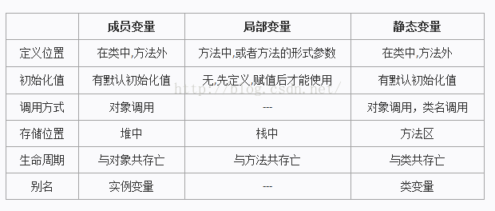

# 1. 基础概念

类、对象、集合、枚举、注解、异常、泛型、反射、lambda、JUC、序列化

## 类 、 实例（instance） 、 对象（object） 、实例化

面向对象的程序设计中，

- 用类创建对象的过程称为`实例化`；
- 类实例化后的一个`对象`叫做`类`的一个`实例`；
- `对象` = `实例`

如 Date today=new Date()， today 变量是由 Date 类 new 出来的，这个 new 的过程称为：类的实例化过程， today 变量成为 Date 类的一个实例。

关系由强到弱可以划分为： 泛化 = 实现 > 组合 > 聚合 > 关联 > 依赖 。这几种关系大概可以分为： 横向关系和纵向关系。也可以划分为实体之间的关系和类之间的关系。纵向关系包括泛化和实现，这两种关系就也称为类之间的关系，这里我们不做讨论。我们只讨论实体之间的关系，或者说我们只讨论横向关系。

- 依赖（Dependency）：语义“a uses b”，a 依赖于 b，但不持有 b 的引用。
- 关联（Association）：语义“a has b”，a 拥有 b 的引用，但 a 和 b 无从属关系，二者是一种松散的关联关系，可以随时解除或建立。
- 聚合（Aggregation）：语义“a owns b”，a 拥有 b 的引用，且有从属关系，二者的耦合比关联更强，但 a 并不负责 b 的生命周期。
- 组合（Composition）：语义“b is a part of a”，a 不仅拥有 b 的引用，还应该全权负责 b 的整个生命周期，在程序中 b 通常是 a 的内部实现细节，不暴露给外部。

我们注意这四种关系中有一个关键的概念“对象生命周期”，在建模时辨别清楚对象生命周期就不难选择采用 DI 还是创建对象。DI 意味着使用者不负责依赖对象的生命周期，创建对象则相反。对应到上面的 4 种横向关系，我们一般可以这样处理：第 1 种依赖关系不需要 DI 也不需要创建对象；第 2，3 种关联和聚合关系适合采用 DI 方式，最后一种组合关系适合采用创建对象方式。

类与类之间由强到弱关系是: 泛化 = 实现 > 组合 > 聚合 > 关联 > 依赖，其中关联，聚合，组合，这三种都是关联关系，并且代码表现都是整体的某个部分，即成员变量。他们只是有强弱关系区分。

## 变量

1. 类变量
   - 也叫静态变量，是一种比较特殊的实例变量，用 static 关键字修饰；
   - 一个类的静态变量，所有由这类生成的对象都共用这个类变量，类装载时就分配存储空间；
   - 一个对象修改了变量，则所有对象中这个变量的值都会发生改变；
2. 实例变量
   - 也叫对象变量、成员变量；
   - 从属于类，由类生成对象时，才分配存储空间，各对象间的实例变量互不干扰，能通过对象的引用来访问实例变量；
   - 但在 Java 多线程中，实例变量是多个线程共享资源，要注意同步访问时可能出现的问题；
3. 局部变量
   - 方法中或者某局部块中声明定义的变量或方法的参数被称为局部变量，
   - 他们只存在于创建他们的 block 里（{}之间）无法在 block 外进行任何操作，如读取、赋值；
   - 在 Java 多线程中，每个线程都复制一份局部变量，可防止某些同步问题发生；
   - 
4. 全局变量： 包括类变量和成员变量。
5. 静态变量： 用 static 关键字修饰的变量。
   - 用法上，static 是 Java 的保留关键字，主要是用来限定被修饰对象的使用范围的；
   - 可以被用来修饰变量和方法，被修饰的变量成为类变量或静态变量，被修饰的方法被称为类方法或静态方法；区别于成员变量和成员方法；
   - 被 static 修饰的变量和方法可以被类直接使用，而成员变量和成员方法只能被类生成的对象来调用；
   - 成员变量和成员方法不能使用由 static 修饰的变量和方法，即成员变量和成员方法不能调用类变量和类方法；
   - 从 JVM 角度讲，static 修饰的代码编译后就确定下来了，而成员变量和成员方法是在运行期动态确定的，所以

## final 作用

1. 修饰类
   1. 表明这个类不能被继承；
   2. 类中的所有成员方法都会被隐式地指定为 final 方法；
   3. 类中属性的访问权限可以随意设置；
2. 修饰方法
   1. 使用 final 方法的原因有两个。第一个原因是把方法锁定，以防任何继承类修改它的含义；第二个原因是效率。在早期的 Java 实现版本中，会将 final 方法转为内嵌调用。但是如果方法过于庞大，可能看不到内嵌调用带来的任何性能提升。在最近的 Java 版本中，不需要使用 final 方法进行这些优化了。因此，如果只有在想明确禁止 该方法在子类中被覆盖的情况下才将方法设置为 final 的。
   2. 类的 private 方法会隐式地被指定为 final 方法。
3. 修饰变量
   1. 如果是基本数据类型的变量，则其数值一旦在初始化之后便不能更改；如果是引用类型的变量，则在对其初始化之后便不能再让其指向另一个对象。
   2. 当用 final 作用于类的成员变量时，成员变量（注意是类的成员变量，局部变量只需要保证在使用之前被初始化赋值即可）必须在定义时或者构造器中进行初始化赋值，而且 final 变量一旦被初始化赋值之后，就不能再被赋值了。
   3. static 作用于成员变量用来表示只保存一份副本，而 final 的作用是用来保证变量不可变

## 类的加载机制

1. 类中所有属性的默认值（一举而成）
2. 父类静态属性初始化，静态块，静态方法的声明（按出现顺序执行）
3. 子类静态属性初始化，静态块，静态方法的声明 （按出现顺序执行）
4. 调用父类的构造方法，首先父类的非静态成员初始化，构造块，普通方法的声明（按出现顺序执行）然后父类构造方法。
5. 调用子类的构造方法，首先子类的非静态成员初始化，构造块，普通方法的声明（按出现顺序执行）然后子类构造方法。

内部静态类不会自动初始化，只有调用静态内部类的方法，静态域，或者构造方法的时候才会加载静态内部类。

java 遵循“使用时，才加载”的原则。
注意：类的加载过程只发生一次。

1. 对于不含静态方法的非抽象类而言，如果你只是创建了一个类的空引用，并没有执行 new 操作，该类是不会被加载的。也就是说，一个不含静态方法的非抽象类要被加载的话，肯定是在第一次实例化对象时，才会发生类的加载，同时生成实例化对象。但是之后再实例化对象，类的加载过程不会再发生，类的加载过程只发生一次。
2. 对于含静态方法的非抽象类而言，第一次执行 new 操作进行实例化或者调用类方法（即该类的静态方法）时，该类才会被加载的。
3. 对于不含静态方法的抽象类而言，只有继承了该类的非抽象子类要被加载时，该不含静态方法的抽象类才会被加载。且抽象父类先加载，非抽象子类后加载。至于非抽象子类什么时候会被加载，见 1、2 两点。
4. 对于含静态方法的抽象类而言，继承了该类的非抽象子类要被加载时或者调用该含静态方法的抽象类的类方法（即该类的静态方法）时，该含静态方法的抽象类才会被加载。
5. 接口和不含静态方法的抽象类情况类似，都是只有继承了该接口的非抽象子类要被加载时，该接口才会被加载。应该是父接口先加载，非抽象子类后加载。

上面列了五段话说的绕来绕去的（感觉基础不好的真的会被绕晕，我自己都觉得绕），其实就是为了说明开头的那一段话“java 遵循“使用时，才加载”的原则”。通俗点说就是只有用得着某个类或接口的时候，这个类或接口才会被加载，否则就是哪凉快哪待着去。

## 环境常用名词

- DEV(Development environment)
- FAT(Feature Acceptance Test environment)
- UAT(User Acceptance Test environment)
- PRO(Production environment)

## 1. 导引

我们知道，Java 中 int 变量存在于 jvm 的静态区中，在系统之中它的存在形式很简单，就是一个简单的内存块，里面放了一个具体的数字，而 Integer 则是一个具体的对象，里面不光有具体的数字，还有一些具体的操作方法。早期的 Java 版本中，要想对 int 的数据进行对象化操作时，就必须要先把 int 转化为 Integer 对象才能够进行操作。例如：在 Java1.5 中，集合（Collections）不能直接放入 int 类型的数据，因为集合中要求存放的必须是对象。所以，为了节省由原始类型转化为对象类型的人工成本，也为了迎合 Java 中一切都是对象的思想，Java 后续的版本中就引入了自动拆箱和自动装箱的机制。

## 2. 概念

### 2.1 基本数据类型和封装数据类型

基本数据类型主要有 8 种，他们分别是：

| 基本数据类型(primitive) | byte    | short    | int     | long   | float  | double | char      | boolean |
| --------------------------- | ------- | -------- | ------- | ------ | ------ | ------ | --------- | ------- |
| 占用内存大小            | 1 字节  | 2 字节   | 4 字节  | 8 字节 | 4 字节 | 8 字节 | 1 字节    | 未知    |
| 默认值                  | (byte)0 | (short)0 | 0       | 0L     | 0.0f   | 0.0d   | \\u000    | false   |
| 封装数据类型(wrapper)   | Byte    | Short    | Integer | Long   | Float  | Double | Character | Boolean |

二者之间的区别：

| 基本数据类型 | 封装数据类型 |
| --------------------- | ------- |
| 1. 基本类型 2. 是面向机器底层的数据结构，不需要实例化 3. 在内存中就是一个简单的变量，没有具体的操作方法 | 1. 引用类型 2. 是 Java 对象，**可能**需要进行实例化 3. 有具体的操作方法 |

### 2.2 拆箱和装箱

装箱就是将基本数据类型转化为封装数据类型的过程，其主要使用了 valueOf()函数将对象的值转化为封装类型的对象；同时，拆箱过程中，就使用 intValue()、doubleValue()等函数，将对象的值转化为基本数据类型的值。

---

## 3.1 适用场景

在 Java1.5 之前都需要手动的进行基本数据类型到封装类型之间的转化，Java1.5 之后就可以实现自动的拆箱和装箱操作了。

### 3.1.1 赋值

自动拆箱和自动装箱的一个应用场景就是赋值操作。

如下面代码：

```java
//before autoboxing
Integer iObject = Integer.valueOf(3);
Int iPrimitive = iObject.intValue()

//after java5
Integer iObject = 3; //autobxing - primitive to wrapper conversion
int iPrimitive = iObject; //unboxing - object to primitive conversion

```

Java 编译器帮我们自动完成装箱和拆箱操作。

### 3.1.2 方法调用

另外一个应用场景就是方法调用，在方法调用的过程中，方法会根据具体的参数类型来进行拆箱和装箱操作。如下所示：

```java
public static Integer show(Integer iParam){
   System.out.println("autoboxing example - method invocation i: " + iParam);
   return iParam;
}

//autoboxing and unboxing in method invocation
show(3); //autoboxing
int result = show(3); //unboxing because return type of method is Integer

```

## 3.2 不适用场景

### 3.2.1 重载

什么情况下不适用，就是重载场景中。先看一个场景：

```java
public void test(int num){
    System.out.println("method with primitive argument");

}

public void test(Integer num){
    System.out.println("method with wrapper argument");

}

//calling overloaded method
AutoboxingTest autoTest = new AutoboxingTest();
int value = 3;
autoTest.test(value); //no autoboxing
Integer iValue = value;
autoTest.test(iValue); //no autoboxing

```

在重载的过程中，如果多个同名函数中，一个使用基本数据类型作为参数，一个使用封装数据类型作为参数，那么在使用过程中不会发生重载，传递什么类型的参数，就使用什么类型的函数。

### 3.2.2 对象之间的比较

这是一个比较容易出错的地方，”“可以用于原始值进行比较，也可以用于对象进行比较，当用于对象与对象之间比较时，比较的不是对象代表的值，而是检查两个对象是否是同一对象，这个比较过程中没有自动装箱发生。进行对象值比较不应该使用”“，而应该使用对象对应的 equals 方法。看一个能说明问题的例子。

```java
public class AutoboxingTest {

    public static void main(String args[]) {

        // Example 1: == comparison pure primitive – no autoboxing
        int i1 = 1;
        int i2 = 1;
        System.out.println("i1==i2 : " + (i1 == i2)); // true

        // Example 2: equality operator mixing object and primitive
        Integer num1 = 1; // autoboxing
        int num2 = 1;
        System.out.println("num1 == num2 : " + (num1 == num2)); // true

        // Example 3: special case - arises due to autoboxing in Java
        Integer obj1 = 1; // autoboxing will call Integer.valueOf()
        Integer obj2 = 1; // same call to Integer.valueOf() will return same
                            // cached Object

        System.out.println("obj1 == obj2 : " + (obj1 == obj2)); // true

        // Example 4: equality operator - pure object comparison
        Integer one = new Integer(1); // no autoboxing
        Integer anotherOne = new Integer(1);
        System.out.println("one == anotherOne : " + (one == anotherOne)); // false

    }

}

```

值得注意的是第三个小例子，这是一种极端情况。obj1 和 obj2 的初始化都发生了自动装箱操作。但是处于节省内存的考虑，JVM 会缓存-128 到 127 的 Integer 对象。因为 obj1 和 obj2 实际上是同一个对象。所以使用”==“比较返回 true。

---

## 4. 使用中需要注意的问题

1. 在程序中，如果写了需要不断拆箱和装箱的操作代码，会造成额外的系统开销，增加垃圾回收的压力
2. 在自动拆箱和自动装箱过程中要注意默认值的问题（在拆箱过程中，如果使用了未初始化的对象，执行 obj.xxxValue 就会报 NullPointerException 异常）

---

## 5. 总结

Java 中的拆箱和装箱机制便利了程序开发人员，减少了程序开发人员的工作量，使得基本数据类型和封装数据类型之间有一个高效快捷的桥梁。但是凡事都有两面性，在使用过程中一定要注意初始值问题和适用场景问题，切不可以随意任意使用。
