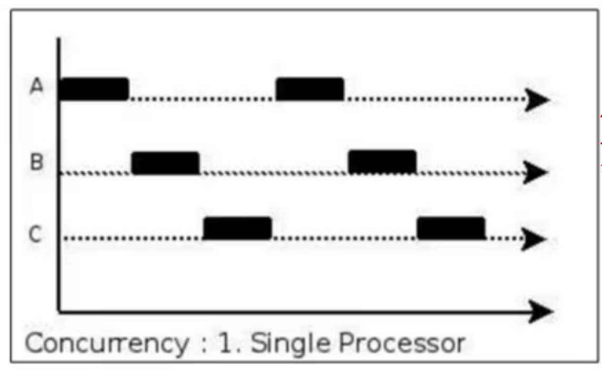
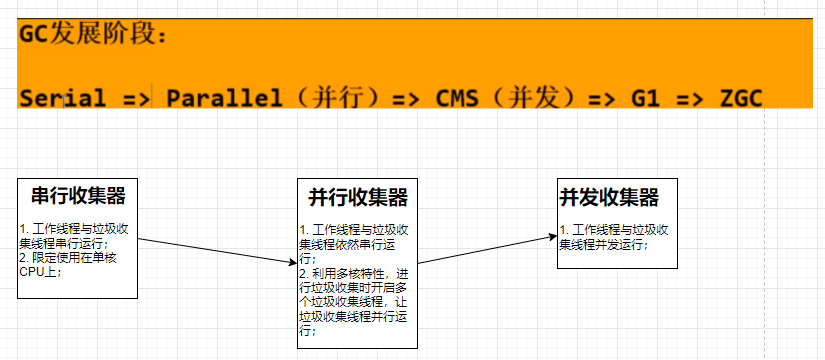
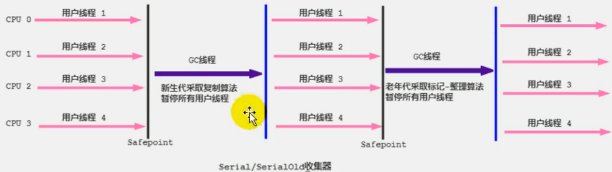
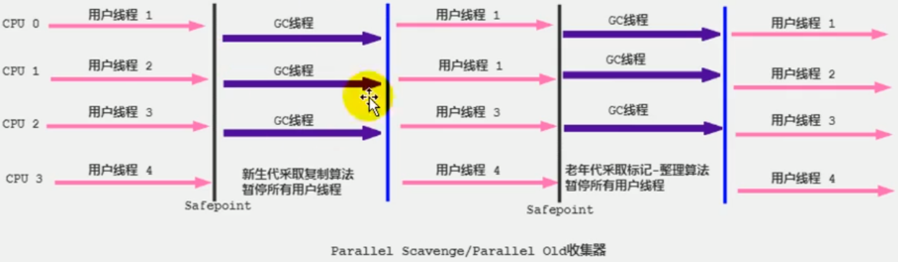
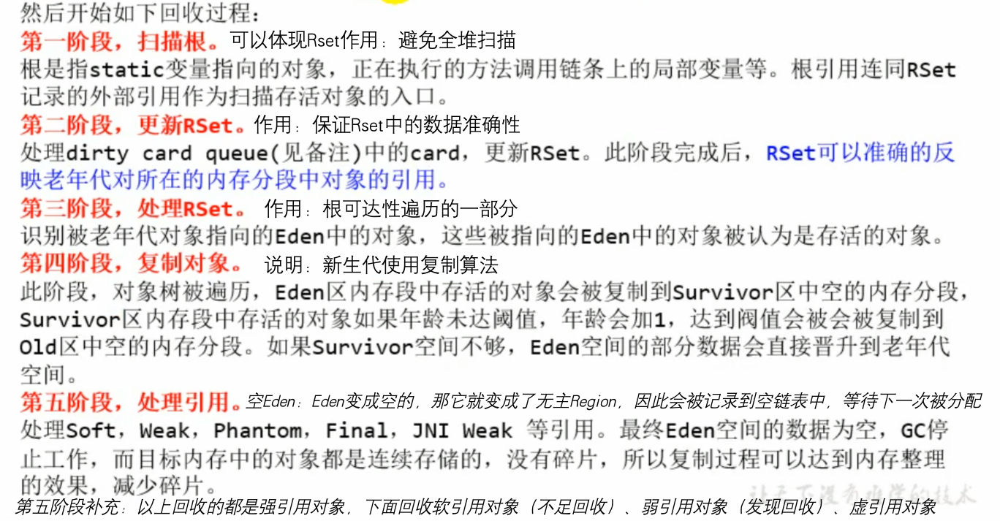
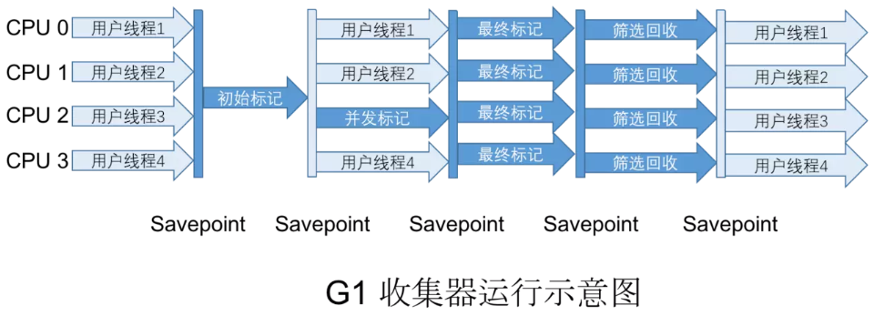
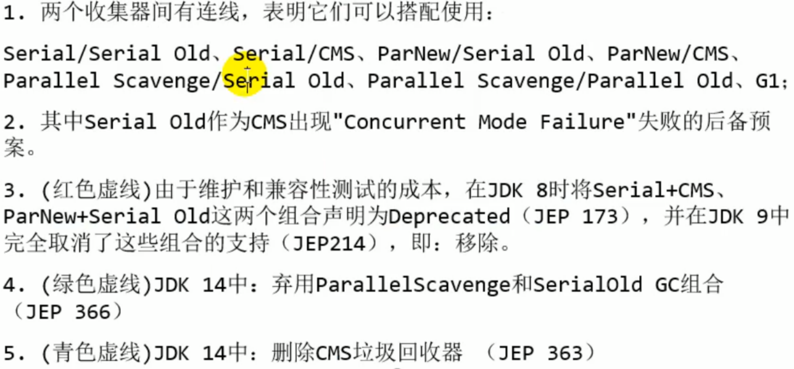
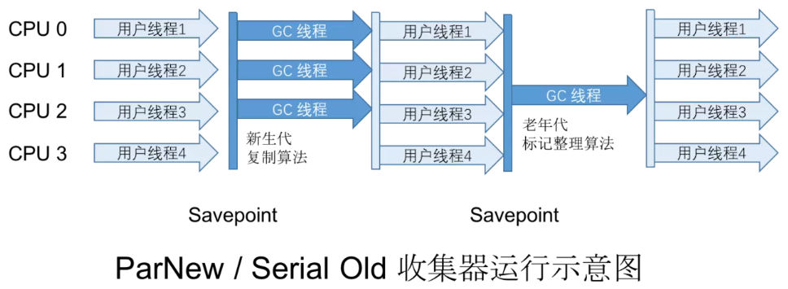
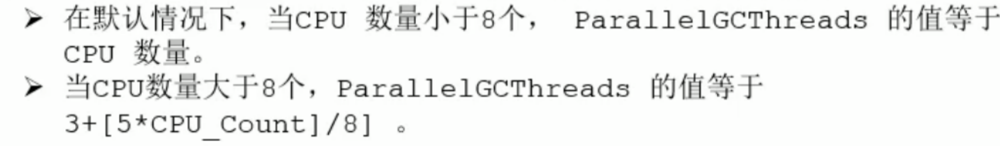
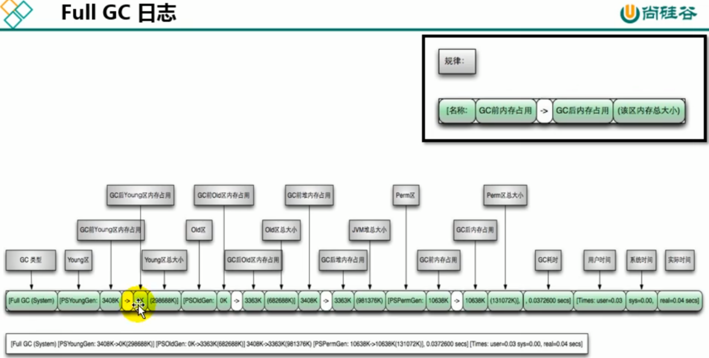

# 8. Hotspot


### 1. 不同的回收方式具有不同的运行期内存结构模型

- 分区
  - 区域划分
- 分代
  - Java8之前
    - 新生代
      - Eden
      - S0
      - S1
    - 老年代Tenured
    - 永久区，也就是方法区
  - Java8及以后
    - 新生代
      - Eden
      - S0
      - S1
    - 老年代Tenured
    - 元空间，也就是方法区

### 2. 前置知识点

#### 2.1. 并发 VS 并行




并发 ： 多个任务在单个处理器上运./ch08-hotspot/image/1726200002579.png多个任务同时发生一样，解决了不同任务执行过程中存在的阻塞问题，可以理解为任务阻塞时，就让出处理器的执行权限，目的是更大限度的压榨处理器的处理能力

并行： 同一时刻很多任务同时获得处./ch08-hotspot/image/1726200014505.png

串行：

#### 2.2. 内存溢出 VS 内存泄露

- 内存溢出： 没有内存空间可用，并且经过垃圾回收器收集后依然没有内存空间可用
- 内存泄漏： 一些对象已经不再被应用程序使用，但是收集器又没有办法回收
  - 常见的内存泄露
    - 单例模式中单例对象持有对外部对象的引用
    - IO资源未关闭，如数据库链接、Socket链接、文件链接等

### 3. 七款经典垃圾回收器



这里的并行是指： 垃圾收集线程由原来的单个垃圾收集线程变成多个垃圾收集线程，也就是说同一时间有多个垃圾收集线程在运行。
这里的并发是指： 垃圾收集./ch08-hotspot/image/1700537535532.png


#### 3.1. 串行收集器
./ch08-hotspot/image/1700547653000.png
- Serial收集器
  - 针对新生代的收集器
  - 采用复制算法
  - 是Client模式下默认的新生代垃圾回收器
  - STW机制：在垃圾回收时，会使用**一个CPU或一个收集线程**来完成垃圾收集工作
    - 意味着进行垃圾回收时，必须暂停其他工作线程
- SerialOld 收集器
  - 针对老年代的收集器
  - 采用标记-整理算法
  - 是Server模式下默认的老年代垃圾回收器
  - 进行垃圾回收时也需要STW机制
- 限定单核CPU才可以使用，一般web应用程序中是不会采用这种串行的垃圾收集器的
  - 配合使用
    - 

#### 3.2. 并行收集器
./ch08-hotspot/image/1677382522133.png
> 并行收集器利用了计算机多核的特性，扩展了串行收集器的并行收集能力。
> 强调的是收集器利用多核的特性。

- ParNew收集器
  - 除了采用并行回收的方式执行内存回收外，与Serial收集器几乎没有任何区别
  - 同样采用复制算法、STW机制
  - 是多数JVM运行在Server模式下新生代的默认垃圾收集器
- ParallelScavenge回收器
  - 吞吐量优先的垃圾收集器
  - 与ParNew收集器实现方式基本类似，只不过是保证了吞吐量优先
  - 可以使用-XX:+UseAdaptiveSizePolicy，开启动态自适应策略，让JVM根据当前系统运行情况，动态调整新生代大小、Eden和Survivor区域的比例以及晋升老年代对象年龄，以期获得最合适的停顿时间或最大的吞吐量。
- ParallelOld收集器
  - 除了采用并行回收的方式执行内存回收外，其他与SerialOld收集器几乎没有区别
- 适合执行批量处理、订单处理、工资支付、科学计算的应用程序
  - 配合使用
    - 

#### 3.3. 并发收集器
./ch08-hotspot/image/1677382997226.png
##### 3.3.1. CMS 回收器

- 让垃圾收集线程与用户工作线程并发执行
- 主要关注点是：减少停顿时间，低延迟
- 老年代的垃圾回收器，无法与ParallelScavenge回收器一并使用，只能配合ParNew和Serial串行收集器，在预留空间无法保证工作线程的运行时，就会临时启动Serial Old收集器作为老年代的垃圾回收器
- 原理及过程
  - 1. 初始标记
    - 利用STW机制，标记出GCRoot的对象，速度非常快
  - 2. 并发标记
    - 并发标记出GCRoots的直接关联对象并遍历整个对象图，其过程是与工作线程一并工作，耗时较长但是不需要停顿用户线程，
  - 3. 重新标记
    - 再次利用STW机制，标记第二阶段产生的新的变动的对象，但是垃圾收集线程是并发进行的
  - 4. 并发清除
    - 与用户工作线程一同工作，清除掉已经死亡的对象，并释放空间
    - 使用标记-清除算法
      - 不可避免的会产生一些内存碎片，因此也不能使用指针碰撞的方式分配空间，只能使用空闲列表的方式分配空间
      - 不使用标记-整理算法的原因：在清理的时候，用户线程还在使用对应的内存空间，整理内存空间会导致用户线程正在使用的内存空间失效。
- 不会像其他老年代收集器一样，等到老年代几乎被填满之后才进行收集，而是当堆内存使用超过一个阈值后就开始进行回收，以确保程序在CMS运行期间有足够的空间支持应用程序的运行，如果预留的空间无法保证程序的运行，就会出现“Concurrent Mode Failuer”失败，此时JVM会临时启用Serial Old收集器作为老年代的垃圾收集器，停顿时间就会变的很长
- 优缺点
  - 并发收集
    - 垃圾收集线程与用户工作线程是并发执行的
  - 低延迟
    - 除了初始阶段和重新标记阶段会出现短暂的停顿外，其他阶段不会出现停顿，是一款专注入低延迟的垃圾收集器
  - 会产生浮动垃圾
    - 在并发清除阶段，由于用户工作线程依然在工作，也有可能会产生一些垃圾对象，但是此时CMS已经无法对这些对象进行标记，只能等到下次GC时再进行清除
  - 对CPU资源敏感
    - 与等待老年代几乎填满后再进行垃圾回收的其他老年代收集器不同，CMS回收器是当堆空间使用到一定阈值时就会开始进行回收垃圾
  - 会产生内存碎片
    - 并发清除阶段使用的是标记-清除算法，这种算法会产生内存碎片问题
- 迭代
  - JDK9及以后的版本，使用-XX:+UseConcMarkSweepGC开启CMS垃圾收集器时，会收到一个警告信息——提示CMS未来将被废弃
  - JDK14完全移除CMS，用户使用-XX:+UseConcMarkSweepGC显式开启CMS收集器时，不会收到提示，会自动使用默认的垃圾收集器进行收集
- 特点
  - 低延迟
  - 并发标记
  - 

##### 3.3.2. G1 回收器
./ch08-hotspot/image/1677394999462.png
- 随着业务的发展，机器越来越先进，CPU核心数越来越多，JVM管理的内存越来越大，之前的GC收集器已经不能满足业务的要求了
- 基本原理
  - 把堆空间使用“化整为零”的思想，划分成相同大小的多个区域，之后每次只回收部分区域。
  - 把堆空间“化整为零”，分割成很多不相关的区域，并且G1会维护一个优先列表以便追踪每一个区域的垃圾堆积的价值大小，回收时优先回收价值最大的区域。
- 回收过程
  - 先进行年轻代GC【注意，要解决跨区域引用的问题】
    - 
      - 如果没有被回收的区域内的对象引用了要回收的区域的对象，该如何解决？是否需要全堆扫描？全堆扫描的效率低下。使用记忆集进行解决，JVM会为每一个Region分配一个记忆集，记忆集中记录了本区域内哪些对象（包括引用类型对象）被其他区域所引用。在实际回收过程中，GCRoots引用链引用到的本区域内的对象加上记忆集中的对象构成整个存活对象集。
      - 【重点】G1的每个Region都维护有自己的记忆集，这些记忆集会记录下别的Region 指向自己的指针，并标记这些指针分别在哪些卡页（卡表的单个元素）的范围之内。G1的记忆集在存储结构的本质上是一 种哈希表，Key是别的Region的起始地址，Value是一个集合，里面存储的元素是卡表的索引号。这种“双向”的卡表结构（卡表是“我指向谁”，这种结构还记录了“谁指向我”），由于记忆集的存在，会造成JVM堆容量10%到20%的空间浪费。
      - 卡表./ch08-hotspot/image/1677470190520.png个区域（哪个卡页）。由于引用类型对象涉及到写-写操作时的同步问题，因此还需要“写屏障”技术避免线程安全问题，写屏障原理是使用中断的方式。
    - 当年轻代的Eden区用尽时开始年轻代回收过程，回收过程是并行的独占式的。G1会暂停所有工作线程，启动多线程回收年轻代，把年轻代的存活对象转移到S区或者老年区
  - 老年代并发标记过程（Concurrent Marking）
    - 
      - 从GC日志中查看过程
        - 
    - 
    - 当堆内存使用达到一定的值后，开始老年代并发标记过程
  - 混合回收（Mixed./ch08-hotspot/image/1688216077816.png
    - 
      - 
    - 老年代并发标记过程完成后，立刻进入混合回收阶段，G1从老年代移动存活对象到空闲区间，使部分空闲区间成为老年代的一部分。老年代的回收并不是全部回收的，只回收其中的一部分。部分年轻代也一并回收
  - （如果需要，./ch08-hotspot/image/1677470265347.png评估失败提供了一种失败保护机制，即强力回收）
    - 


./ch08-hotspot/image/1677311728992.png
- 组合使用
  - 组合关系./ch08-hotspot/image/1700722465604.png
  - 
  - 目前，基本上都使用G1
  - 
  - 
  - 
  - 
  - 
./ch08-hotspot/image/1688214017850.png
#### 3.5./ch08-hotspot/image/1677394999462.png
./ch08-hotspot/image/1688214075720.png
- Serial GC在Serverless应用场景下找到了新的舞台
- CMS GC在jdk9中被标记为废弃，JDK14中移除
- ZGC和Shenandoah主打低延迟，可以做到在不影响吞吐量的前提下，实现任意堆内存大小下的停顿时间限制在10毫秒以内的低延迟

### 4. 代码运行方式

- 混合运行模式（解释运行+编译运行）
- 解释器
- 编译器
  - 分类
    - 前端编译器
      - 把.java文件转变成.class文件
        - 包括javac、ECJ等
    - 后端编译器，也叫JIT编译器
      - 把字节码文件转变成可执行的机器码
        - C1编译器
          - 对字节码进行简单可靠的优化，以期达到更快的编译速度，是虚拟机client模式下的默认编译器
          - 优化手段
            - 方法内联
            - 去虚拟化
            - 冗余消除
        - C2编译器
          - 对字节码进行长时间的优化，以期达到更高的代码执行效率，是虚拟机server模式下的默认编译器
          - 优化手段
            - 栈上分配
            - 同步消除
            - 标量替换
        - C1的启动时间比C2启动时间短，系统稳定后，C2执行效率比C1高
    - 静态提前编译器，也叫AOT编译器
      - 直接把.java文件转变成可执行的机器码
        - 包括GCJ等，还处于实验阶段
    - HotSpotJVM是两种方式并存的
      - 原理：等待所有的代码编译完成再进行运行是不值得的，项目启动前期就要使用解释器解释执行一些代码，同时也会针对执行到的热点代码进行探测，对热点代码再进行编译执行。相当于对二者进行取长补短
        - 使用热点探测技术探测热点代码
          - 如何探测热点代码
            - 使用方法调用计数器
              - 统计方法的调用次数
              - -XX:CompileThreshold
            - 回边计数器
              - 统计循环体的执行次数
          - 探测到热点代码后
            - 栈上分配
            - 同步消除
            - 标量替换

### 5. 常用参数总结

- Java堆
  - -Xms
    - Java堆初始化大小，默认是物理内存总容量/64
  - -Xmx
    - Java堆最大容量，默认是物理内存总容量/4
  - -XX:NewRatio
    - 【老年代容量：新生代容量】的比例，默认是2，表示新生代占总容量的1/3，老年代占总容量的2/3
  - -Xmn
    - 新生代的最大容量，S0+S1+Eden所能使用的最大容量，一般默认即可
  - -XX:SurvivorRatio
    - S0、S1与Eden区的比例，默认是8，表示S0:S1:Eden=1:1:8
  - -XX:MaxTenuringThreshold
    - 对象进入老年代区的最大年龄，默认是15
  - -XX:HandlePromotionFailure
    - 是否开启空间分配担保
    - 值为True/False
  - -XX:UseTLAB
    - 是否开启TLAB
    - 值为True/False
  - -XX:TLABWasteTargetPencent
    - 设置TLAB占用Eden空间的大小
  - 一般情况下会把这两个值设置成相同数值，目的是为了减少内存重新分配的次数，提高性能
- 虚拟机栈
  - -Xss
    - 线程的最大栈空间，决定了函数的最大调用深度，常见的值有25k、64k、128k等
- 方法区
  - JDK8以前
    - -XX:PermSize
    - -XX:MaxPermSize
  - JDK8及以后
    - -XX:MetaspaceSize
    - -XX:MaxMetaspaceSize
  - -Xnoclassgc
    - 不开启方法区的gc
  - -XX:+TraceClass-Loading  /  -XX:+TraceClassUnloading
    - 查看类加载和类卸载信息
- 执行器
  - -Xint
    - 完全使用解释器的方式执行
  - -Xcomp
    - 完全使用即时编译器的方式执行
      - -client
        - 使用C1编译器，对字节码进行简单可靠的优化，达到更快的编译速度
      - -server
        - 使用C2编译器，对字节码进行较长时间的优化，达到更高的代码执行效率
  - -Xmixed
    - 使用混合的方式执行
- 垃圾回收器
  - -XX:+UseSerialGC
    - 指定jvm在新生代和老年代收集内存时都是用串行收集器
      - 等价于新生代使用Serial收集器、老年代使用SerialOld收集器
  - -XX:+UseParNewGC
    - 表示新生代使用ParNew的收集器，不影响老年代
  - -XX:+UseParallelGC
    - 手动指定新生代使用Parallel并行收集器
  - -XX:+UseParallelOldGC
    - 手动指定老年代使用并行收集器
  - -XX:+UseG1GC
    - 手动指定使用G1垃圾回收器
  - -XX:ParallelGCThreads
    - 使用并行收集器时，设置年轻代并行收集器的线程数，默认与CPU数量一致
      - 
  - -XX:MaxGCPauseMillis
    - 设置垃圾收集器最大停顿时间，STW时间，单位是毫秒
  - -XX:+Use./ch08-hotspot/image/1677383394171.png
    - ParallelScavenge开启自适应策略
      - JVM会自动调整年轻代区域大小、Eden与S区比例、老年代年龄等参数，以达到堆大小、吞吐量和停顿时间的平衡点
      - 手动调优比较困难的场景下，可以设置此参数，把调优工作交给jvm
  - -XX:GCTimeRatio
    - 垃圾收集时间占总时间的比例
    - 取值范围：0-100，默认是99，表示垃圾回收时间不超过1%
  - -XX:+UseConcMarkSweepGC
  - -XX:+CMSInitialingOccupanyFraction
  - -XX:+UseCMSCompactAtFullCollection
  - -XX:CMSFullGCsBeforeCompaction
  - -XX:ParallelCMSThreads
  - -XX:G1HeapRegionSize
    - 设置每一个Region的大小
  - -XX:ConcGCThreads
    - 设置并发表计的线程数
  - -XX:InitiatingHeapOccupancyParcent
    - 设置并发GC的Java堆占用率的阈值，超过就出发GC，默认是45
  - JDK8默认的收集器，开启其中一个，另外一个也会被开启，相互激活
- 监控参数
  - -XX:+PrintGC
  - -Xloggc:../logs/gc.log
  - -verbose:gc
  - -XX:+PrintGCDetails
    - 打印GC详细信息
  - -XX:+PrintGCTimeStamps
    - 输出GC的时间戳，以基准时间的形式
  - -XX:+PrintGCDateStamps
    - 输出GC的时间戳，以日期的形式，如2013-05-04T21:34:24.123+0800
  - -XX:+PrintHeapAtGC
    - 在进行GC的前后打印堆信息
  - -XX:+PrintFlagsInitial
    - 查看jvm所有参数初始默认值
  - -XX:+PrintFlagsFinal
    - 查看jvm所有参数最终值
  - 打印GC简要信息

### 6. 日志分析

- MinorGC
  - 
- FullGC
  - 
- 日志样例./ch08-hotspot/image/1677483047515.png

```markdown
2023-04-04T12:08:11.670+0800: 104.882: [GC (Allocation Failure) [PSYoungGen: 262144K->43503K(305664K)] 282367K->138752K(1005056K), 0.0710736 secs] [Times: user=0.34 sys=0.06, real=0.07 secs] 

【2023-04-04T12:08:11.670+0800】 表示发生GC的时间戳
【104.882】表示从JVM启动，到打印这行日志，经过了104.882秒的时间
【GC (Allocation Failure) 】表示GC触发的类型是『Allocation Failure』，即分配失败
【[PSYoungGen: 262144K->43503K(305664K)]】 表示新生代使用的是ParraleScavenge回收器，262144K->43503K，表示从262144K回收到43503K，305664K表示新生代总容量
【282367K->138752K(1005056K) 】 表示整个堆从282367K降到138752K，堆的总容量为1005056K
【0.0710736 secs 】 表示GC的时间是0.0710736秒
【Times: user=0.34 sys=0.06, real=0.07 secs 】 表示整个GC过程中，用户态占用时间、系统态占用时长和真实用时

```

```markdown
2023-04-04T12:06:27.811+0800: 1.023: [Full GC (Metadata GC Threshold) [PSYoungGen: 16268K->0K(305664K)] [ParOldGen: 24K->15506K(699392K)] 16292K->15506K(1005056K), [Metaspace: 20436K->20434K(1067008K)], 0.0200635 secs] [Times: user=0.07 sys=0.00, real=0.02 secs] 
这是FullGC的过程日志。
新生代总大小为305664K，从16268K降到0K；
老年代总大小为699392K，GC前为24K，GC后为15506K；
整个堆大小为1005056K，GC前为16292K，GC后为15506K；
元空间总大小为：1067008K，GC前为20436K，GC后为20434K；
Times: user=0.07 sys=0.00, real=0.02 secs ： 表示整个GC过程中，用户态占用时间、系统态占用时长和真实用时

```

```markdown
2023-04-04T12:09:49.638+0800: 202.850: [Full GC (Ergonomics) [PSYoungGen: 116735K->0K(160256K)] [ParOldGen: 699391K->14256K(699392K)] 816127K->14256K(859648K), [Metaspace: 40493K->40493K(1087488K)], 0.0174834 secs] [Times: user=0.07 sys=0.01, real=0.02 secs] Heap PSYoungGen total 160256K, used 41013K [0x00000007aab00000, 0x00000007c0000000, 0x00000007c0000000)  eden space 116736K, 35% used [0x00000007aab00000,0x00000007ad30d7f8,0x00000007b1d00000)  from space 43520K, 0% used [0x00000007bd580000,0x00000007bd580000,0x00000007c0000000)  to space 116224K, 0% used [0x00000007b1d00000,0x00000007b1d00000,0x00000007b8e80000) ParOldGen total 699392K, used 14256K [0x0000000780000000, 0x00000007aab00000, 0x00000007aab00000)  object space 699392K, 2% used [0x0000000780000000,0x0000000780dec388,0x00000007aab00000) Metaspace used 41838K, capacity 43950K, committed 44592K, reserved 1087488K  class space used 5400K, capacity 5783K, committed 5936K, reserved 1048576Kused 

已使用的空间大小capacity：当前已经分配且未释放的空间容量大小committed：当前已经分配的空间大小reserved：预留的空间大小capacity + 已经被释放的空间容量 = committed

```
