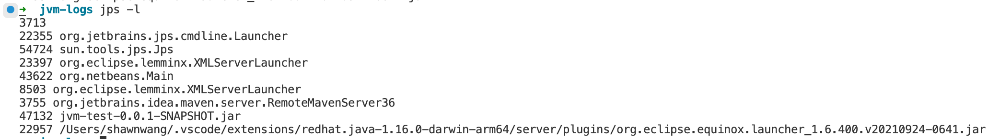
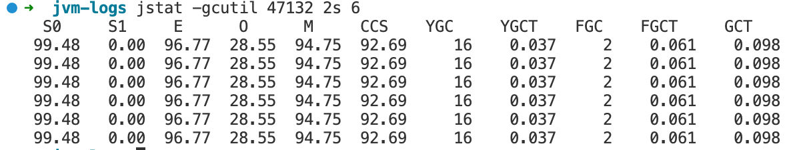
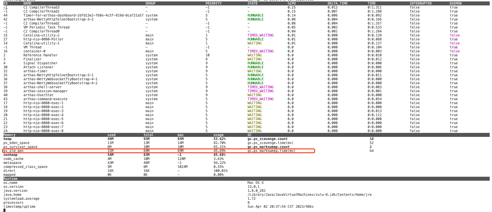
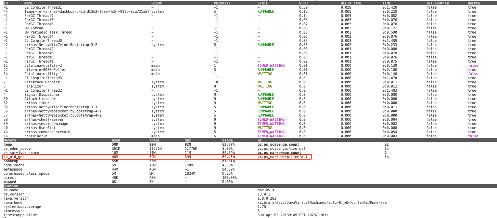
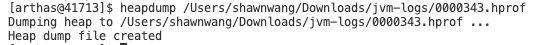
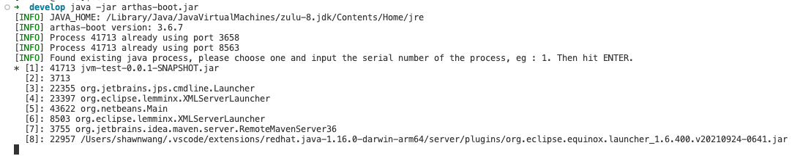
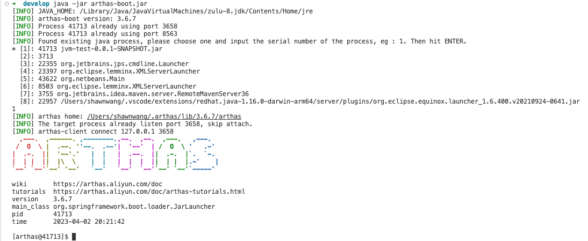
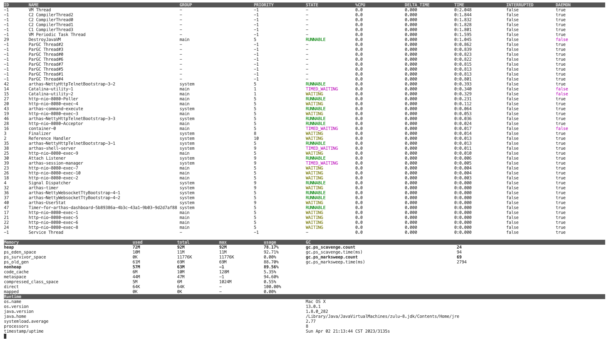
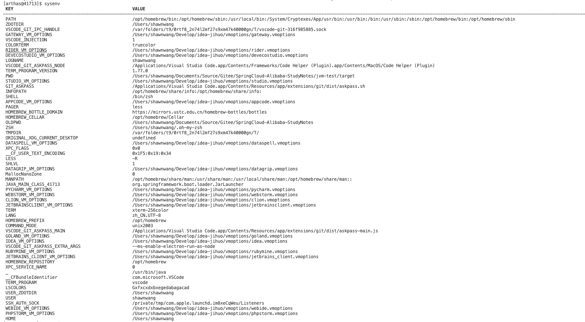
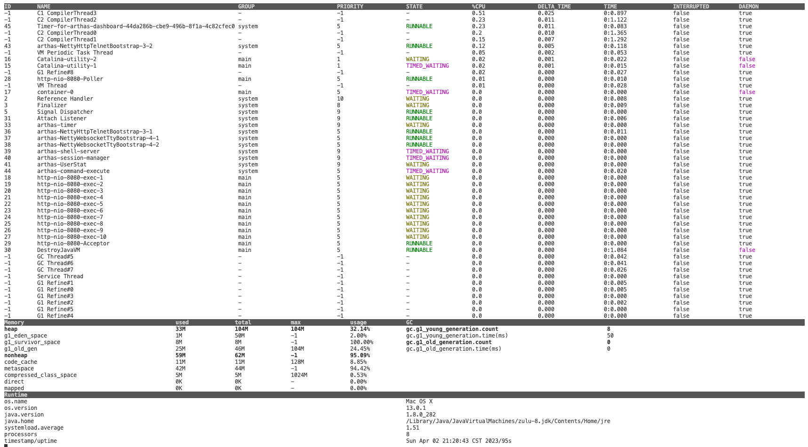

# 9. 工具包

### 1. JVM自带工具

#### 1.1. jps

#### 1.2. jstack

#### 1.3. jmap

#### 1.4. jcmd

#### 1.5. jinfo

#### 1.6. jprofiler

#### 1.7. jvisualvm


jcmd
jmap
jinfo pid	// 
jstack pid // 查看当前jvm有哪些进程，初步排查线程健康状况，如果多数线程处于等待状态，很可能就有问题了
jstat -gc pid // GC回收情况
jps -l





./ch09-tools/image/1680448811163.png

1. 把堆内存dump下载./ch09-tools/image/1680448938831.png
    jps //查看pid
    jmap -dump:format=b,file=heap.1 pid //不进行垃圾回收直接dump
    jmap -dump:live,format=b,file=heap.2 pid //进行fgc垃圾回收在进行dump
    jmap -histo:live pid //进行fgc垃圾回收在进行dump
2. 使用java VisualVM(lib目录下jdk8自带)导入dump文件


### 2. 第三方工具


- [Arhtas](https://arthas.aliyun.com/)
- [通过 Arthas Trace 命令将接口性能优化十倍（User Case 投稿）](https://github.com/alibaba/arthas/issues/1892)
- [动态追踪技术漫谈](https://blog.openresty.com.cn/cn/dynamic-tracing/)
- [利用Arthas精准定位Java应用CPU负载过高问题](https://github.com/alibaba/arthas/issues/1202)
- [阿里Java诊断工具 arthas - 排查线上环境内存使用过大、线程cpu使用率高问题](https://blog.csdn.net/qq_43692950/article/details/122688520)
- [【死磕JVM】用Arthas排查JVM内存 真爽！我从小用到大](https://blog.csdn.net/qq_14996421/article/details/115982546)

### 3. 安装


### 4. 启动

java -jar arthas-boot.jar


### 5. 常用命令

1. dashboard
2. thread -b
3. jvm
4. heapdum /path/to/hproffile/my.hprof
5. 


### 6. 常用场景

1. 查看jvm参数
2. 查看阻塞的线程
3. 生成堆栈快照文件
4. 查看仪表盘
5. 查看类加载信息
6. 在线更换.class文件
7. 项目启动时，查看各个区域所使用的比例，来判断各个参数的配置应该是多少


### 7. 控制面板

发送请求，发现 『ps_old_gen』 区域的使用容量越来越大，如下面两张图，**这说明有很多大对象进入了老年代。**





./ch09-tools/image/1680439140349.png



./ch09-tools/image/1680439220617.png


### 8. 利用Arthas生成dump文件




### 9. Arthas的其他命./ch09-tools/image/1680439460507.png

1. 运行




2. 选取一个应用进行链接
./ch09-tools/image/1680441120803.png



3. 查看仪表盘
./ch09-tools/image/1680441169809.png
```
[arthas@41713]$ dashboard

```







```
[arthas@47132]$ jvm
 RUNTIME                                                                                                                                                                                                                                           
---------------------------------------------------------------------------------------------------------------------------------------------------------------------------------------------------------------------------------------------------
 MACHINE-NAME                                                         47132@ShawndeMacBook-Pro.local                                                                                                                                               
 JVM-START-TIME                                                       2023-04-02 21:28:43                                                                                                                                                          
 MANAGEMENT-SPEC-VERSION                                              1.2                                                                                                                                                                          
 SPEC-NAME                                                            Java Virtual Machine Specification                                                                                                                                           
 SPEC-VENDOR                                                          Oracle Corporation                                                                                                                                                           
 SPEC-VERSION                                                         1.8                                                                                                                                                                          
 VM-NAME                                                              OpenJDK 64-Bit Server VM                                                                                                                                                     
 VM-VENDOR                                                            Azul Systems, Inc.                                                                                                                                                           
 VM-VERSION                                                           25.282-b08                                                                                                                                                                   
 INPUT-ARGUMENTS                                                      -Xms100m                                                                                                                                                                     
                                                                      -Xmx100m                                                                                                                                                                     
                                                                      -verbose:gc                                                                                                                                                                  
                                                                      -XX:+PrintGCDetails                                                                                                                                                          
                                                                      -XX:+PrintGCDateStamps                                                                                                                                                       
                                                                      -XX:+HeapDumpOnOutOfMemoryError                                                                                                                                              
                                                                      -XX:HeapDumpPath=/Users/shawnwang/Downloads/jvm-logs                                                                                                                         
                                                                      -XX:ErrorFile=/Users/shawnwang/Downloads/jvm-logs/java_err.log                                                                                                               
                                                                      -Xloggc:/Users/shawnwang/Downloads/jvm-logs/gc.log                                                                                                                           
 CLASS-PATH                                                           jvm-test-0.0.1-SNAPSHOT.jar                                                                                                                                                  
 BOOT-CLASS-PATH                                                      /Library/Java/JavaVirtualMachines/zulu-8.jdk/Contents/Home/jre/lib/resources.jar:/Library/Java/JavaVirtualMachines/zulu-8.jdk/Contents/Home/jre/lib/rt.jar:/Library/Java/Jav 
                                                                      aVirtualMachines/zulu-8.jdk/Contents/Home/jre/lib/sunrsasign.jar:/Library/Java/JavaVirtualMachines/zulu-8.jdk/Contents/Home/jre/lib/jsse.jar:/Library/Java/JavaVirtualMachin 
                                                                      es/zulu-8.jdk/Contents/Home/jre/lib/jce.jar:/Library/Java/JavaVirtualMachines/zulu-8.jdk/Contents/Home/jre/lib/charsets.jar:/Library/Java/JavaVirtualMachines/zulu-8.jdk/Con 
                                                                      tents/Home/jre/lib/jfr.jar:/Library/Java/JavaVirtualMachines/zulu-8.jdk/Contents/Home/jre/classes                                                                            
 LIBRARY-PATH                                                         /Users/shawnwang/Library/Java/Extensions:/Library/Java/Extensions:/Network/Library/Java/Extensions:/System/Library/Java/Extensions:/usr/lib/java:.                           
                                                                                                                                                                                                                                                   
---------------------------------------------------------------------------------------------------------------------------------------------------------------------------------------------------------------------------------------------------
 CLASS-LOADING                                                                                                                                                                                                                                     
---------------------------------------------------------------------------------------------------------------------------------------------------------------------------------------------------------------------------------------------------
 LOADED-CLASS-COUNT                                                   8164                                                                                                                                                                         
 TOTAL-LOADED-CLASS-COUNT                                             8164                                                                                                                                                                         
 UNLOADED-CLASS-COUNT                                                 0                                                                                                                                                                            
 IS-VERBOSE                                                           false                                                                                                                                                                        
                                                                                                                                                                                                                                                   
---------------------------------------------------------------------------------------------------------------------------------------------------------------------------------------------------------------------------------------------------
 COMPILATION                                                                                                                                                                                                                                       
---------------------------------------------------------------------------------------------------------------------------------------------------------------------------------------------------------------------------------------------------
 NAME                                                                 HotSpot 64-Bit Tiered Compilers                                                                                                                                              
 TOTAL-COMPILE-TIME                                                   3537                                                                                                                                                                         
 [time (ms)]                                                                                                                                                                                                                                       
                                                                                                                                                                                                                                                   
---------------------------------------------------------------------------------------------------------------------------------------------------------------------------------------------------------------------------------------------------
 GARBAGE-COLLECTORS                                                                                                                                                                                                                                
---------------------------------------------------------------------------------------------------------------------------------------------------------------------------------------------------------------------------------------------------
 PS Scavenge                                                          name : PS Scavenge                                                                                                                                                           
 [count/time (ms)]                                                    collectionCount : 16                                                                                                                                                         
                                                                      collectionTime : 36                                                                                                                                                          
 PS MarkSweep                                                         name : PS MarkSweep                                                                                                                                                          
 [count/time (ms)]                                                    collectionCount : 2                                                                                                                                                          
                                                                      collectionTime : 61                                                                                                                                                          
                                                                                                                                                                                                                                                   
---------------------------------------------------------------------------------------------------------------------------------------------------------------------------------------------------------------------------------------------------
 MEMORY-MANAGERS                                                                                                                                                                                                                                   
---------------------------------------------------------------------------------------------------------------------------------------------------------------------------------------------------------------------------------------------------
 CodeCacheManager                                                     Code Cache                                                                                                                                                                   
 Metaspace Manager                                                    Metaspace                                                                                                                                                                    
                                                                      Compressed Class Space                                                                                                                                                       
 PS Scavenge                                                          PS Eden Space                                                                                                                                                                
                                                                      PS Survivor Space                                                                                                                                                            
 PS MarkSweep                                                         PS Eden Space                                                                                                                                                                
                                                                      PS Survivor Space                                                                                                                                                            
                                                                      PS Old Gen                                                                                                                                                                   
                                                                                                                                                                                                                                                   
---------------------------------------------------------------------------------------------------------------------------------------------------------------------------------------------------------------------------------------------------
 MEMORY                                                                                                                                                                                                                                            
---------------------------------------------------------------------------------------------------------------------------------------------------------------------------------------------------------------------------------------------------
 HEAP-MEMORY-USAGE                                                    init : 109051904(104.0 MiB)                                                                                                                                                  
 [memory in bytes]                                                    used : 33169048(31.6 MiB)                                                                                                                                                    
                                                                      committed : 95420416(91.0 MiB)                                                                                                                                               
                                                                      max : 96993280(92.5 MiB)                                                                                                                                                     
 NO-HEAP-MEMORY-USAGE                                                 init : 2555904(2.4 MiB)                                                                                                                                                      
 [memory in bytes]                                                    used : 59594664(56.8 MiB)                                                                                                                                                    
                                                                      committed : 63012864(60.1 MiB)                                                                                                                                               
                                                                      max : -1(-1 B)                                                                                                                                                               
 PENDING-FINALIZE-COUNT                                               0                                                                                                                                                                            
                                                                                                                                                                                                                                                   
---------------------------------------------------------------------------------------------------------------------------------------------------------------------------------------------------------------------------------------------------
 OPERATING-SYSTEM                                                                                                                                                                                                                                  
---------------------------------------------------------------------------------------------------------------------------------------------------------------------------------------------------------------------------------------------------
 OS                                                                   Mac OS X                                                                                                                                                                     
 ARCH                                                                 aarch64                                                                                                                                                                      
 PROCESSORS-COUNT                                                     8                                                                                                                                                                            
 LOAD-AVERAGE                                                         2.14892578125                                                                                                                                                                
 VERSION                                                              13.0.1                                                                                                                                                                       
                                                                                                                                                                                                                                                   
---------------------------------------------------------------------------------------------------------------------------------------------------------------------------------------------------------------------------------------------------
 THREAD                                                                                                                                                                                                                                            
---------------------------------------------------------------------------------------------------------------------------------------------------------------------------------------------------------------------------------------------------
 COUNT                                                                30                                                                                                                                                                           
 DAEMON-COUNT                                                         26                                                                                                                                                                           
 PEAK-COUNT                                                           30                                                                                                                                                                           
 STARTED-COUNT                                                        35                                                                                                                                                                           
 DEADLOCK-COUNT                                                       0                                                                                                                                                                            
                                                                                                                                                                                                                                                   
---------------------------------------------------------------------------------------------------------------------------------------------------------------------------------------------------------------------------------------------------
 FILE-DESCRIPTOR                                                                                                                                                                                                                                   
---------------------------------------------------------------------------------------------------------------------------------------------------------------------------------------------------------------------------------------------------
 MAX-FILE-DESCRIPTOR-COUNT                                            10240                                                                                                                                                                        
 OPEN-FILE-DESCRIPTOR-COUNT                                           202                                                              

```


```
java -server -Xms100m -Xmx100m -verbose:gc -XX:+PrintGCDetails \
-XX:+PrintGCDateStamps \
-XX:+HeapDumpOnOutOfMemoryError \
-XX:HeapDumpPath=/Users/shawnwang/Downloads/jvm-logs \
-XX:ErrorFile=/Users/shawnwang/Downloads/jvm-logs/java_err.log \
-XX:+UseG1GC -XX:SoftRefLRUPolicyMSPerMB=0 -XX:SurvivorRatio=8 \
-Xloggc:/Users/shawnwang/Downloads/jvm-logs/gc.log \
-jar jvm-test-0.0.1-SNAPSHOT.jar 

```





```
[arthas@46428]$ jvm
 RUNTIME                                                                                                                                                                                                                                           
---------------------------------------------------------------------------------------------------------------------------------------------------------------------------------------------------------------------------------------------------
 MACHINE-NAME                                                         46428@ShawndeMacBook-Pro.local                                                                                                                                               
 JVM-START-TIME                                                       2023-04-02 21:19:08                                                                                                                                                          
 MANAGEMENT-SPEC-VERSION                                              1.2                                                                                                                                                                          
 SPEC-NAME                                                            Java Virtual Machine Specification                                                                                                                                           
 SPEC-VENDOR                                                          Oracle Corporation                                                                                                                                                           
 SPEC-VERSION                                                         1.8                                                                                                                                                                          
 VM-NAME                                                              OpenJDK 64-Bit Server VM                                                                                                                                                     
 VM-VENDOR                                                            Azul Systems, Inc.                                                                                                                                                           
 VM-VERSION                                                           25.282-b08                                                                                                                                                                   
 INPUT-ARGUMENTS                                                      -Xms100m                                                                                                                                                                     
                                                                      -Xmx100m                                                                                                                                                                     
                                                                      -verbose:gc                                                                                                                                                                  
                                                                      -XX:+PrintGCDetails                                                                                                                                                          
                                                                      -XX:+PrintGCDateStamps                                                                                                                                                       
                                                                      -XX:+HeapDumpOnOutOfMemoryError                                                                                                                                              
                                                                      -XX:HeapDumpPath=/Users/shawnwang/Downloads/jvm-logs                                                                                                                         
                                                                      -XX:ErrorFile=/Users/shawnwang/Downloads/jvm-logs/java_err.log                                                                                                               
                                                                      -XX:+UseG1GC                                                                                                                                                                 
                                                                      -XX:SoftRefLRUPolicyMSPerMB=0                                                                                                                                                
                                                                      -XX:SurvivorRatio=8                                                                                                                                                          
                                                                      -Xloggc:/Users/shawnwang/Downloads/jvm-logs/gc.log                                                                                                                           
 CLASS-PATH                                                           jvm-test-0.0.1-SNAPSHOT.jar                                                                                                                                                  
 BOOT-CLASS-PATH                                                      /Library/Java/JavaVirtualMachines/zulu-8.jdk/Contents/Home/jre/lib/resources.jar:/Library/Java/JavaVirtualMachines/zulu-8.jdk/Contents/Home/jre/lib/rt.jar:/Library/Java/Jav 
                                                                      aVirtualMachines/zulu-8.jdk/Contents/Home/jre/lib/sunrsasign.jar:/Library/Java/JavaVirtualMachines/zulu-8.jdk/Contents/Home/jre/lib/jsse.jar:/Library/Java/JavaVirtualMachin 
                                                                      es/zulu-8.jdk/Contents/Home/jre/lib/jce.jar:/Library/Java/JavaVirtualMachines/zulu-8.jdk/Contents/Home/jre/lib/charsets.jar:/Library/Java/JavaVirtualMachines/zulu-8.jdk/Con 
                                                                      tents/Home/jre/lib/jfr.jar:/Library/Java/JavaVirtualMachines/zulu-8.jdk/Contents/Home/jre/classes                                                                            
 LIBRARY-PATH                                                         /Users/shawnwang/Library/Java/Extensions:/Library/Java/Extensions:/Network/Library/Java/Extensions:/System/Library/Java/Extensions:/usr/lib/java:.                           
                                                                                                                                                                                                                                                   
---------------------------------------------------------------------------------------------------------------------------------------------------------------------------------------------------------------------------------------------------
 CLASS-LOADING                                                                                                                                                                                                                                     
---------------------------------------------------------------------------------------------------------------------------------------------------------------------------------------------------------------------------------------------------
 LOADED-CLASS-COUNT                                                   8783                                                                                                                                                                         
 TOTAL-LOADED-CLASS-COUNT                                             8791                                                                                                                                                                         
 UNLOADED-CLASS-COUNT                                                 8                                                                                                                                                                            
 IS-VERBOSE                                                           false                                                                                                                                                                        
                                                                                                                                                                                                                                                   
---------------------------------------------------------------------------------------------------------------------------------------------------------------------------------------------------------------------------------------------------
 COMPILATION                                                                                                                                                                                                                                       
---------------------------------------------------------------------------------------------------------------------------------------------------------------------------------------------------------------------------------------------------
 NAME                                                                 HotSpot 64-Bit Tiered Compilers                                                                                                                                              
 TOTAL-COMPILE-TIME                                                   5532                                                                                                                                                                         
 [time (ms)]                                                                                                                                                                                                                                       
                                                                                                                                                                                                                                                   
---------------------------------------------------------------------------------------------------------------------------------------------------------------------------------------------------------------------------------------------------
 GARBAGE-COLLECTORS                                                                                                                                                                                                                                
---------------------------------------------------------------------------------------------------------------------------------------------------------------------------------------------------------------------------------------------------
 G1 Young Generation                                                  name : G1 Young Generation                                                                                                                                                   
 [count/time (ms)]                                                    collectionCount : 8                                                                                                                                                          
                                                                      collectionTime : 50                                                                                                                                                          
 G1 Old Generation                                                    name : G1 Old Generation                                                                                                                                                     
 [count/time (ms)]                                                    collectionCount : 0                                                                                                                                                          
                                                                      collectionTime : 0                                                                                                                                                           
                                                                                                                                                                                                                                                   
---------------------------------------------------------------------------------------------------------------------------------------------------------------------------------------------------------------------------------------------------
 MEMORY-MANAGERS                                                                                                                                                                                                                                   
---------------------------------------------------------------------------------------------------------------------------------------------------------------------------------------------------------------------------------------------------
 CodeCacheManager                                                     Code Cache                                                                                                                                                                   
 Metaspace Manager                                                    Metaspace                                                                                                                                                                    
                                                                      Compressed Class Space                                                                                                                                                       
 G1 Young Generation                                                  G1 Eden Space                                                                                                                                                                
                                                                      G1 Survivor Space                                                                                                                                                            
                                                                      G1 Old Gen                                                                                                                                                                   
 G1 Old Generation                                                    G1 Eden Space                                                                                                                                                                
                                                                      G1 Survivor Space                                                                                                                                                            
                                                                      G1 Old Gen                                                                                                                                                                   
                                                                                                                                                                                                                                                   
---------------------------------------------------------------------------------------------------------------------------------------------------------------------------------------------------------------------------------------------------
 MEMORY                                                                                                                                                                                                                                            
---------------------------------------------------------------------------------------------------------------------------------------------------------------------------------------------------------------------------------------------------
 HEAP-MEMORY-USAGE                                                    init : 109051904(104.0 MiB)                                                                                                                                                  
 [memory in bytes]                                                    used : 55500944(52.9 MiB)                                                                                                                                                    
                                                                      committed : 109051904(104.0 MiB)                                                                                                                                             
                                                                      max : 109051904(104.0 MiB)                                                                                                                                                   
 NO-HEAP-MEMORY-USAGE                                                 init : 2555904(2.4 MiB)                                                                                                                                                      
 [memory in bytes]                                                    used : 68178360(65.0 MiB)                                                                                                                                                    
                                                                      committed : 71303168(68.0 MiB)                                                                                                                                               
                                                                      max : -1(-1 B)                                                                                                                                                               
 PENDING-FINALIZE-COUNT                                               0                                                                                                                                                                            
                                                                                                                                                                                                                                                   
---------------------------------------------------------------------------------------------------------------------------------------------------------------------------------------------------------------------------------------------------
 OPERATING-SYSTEM                                                                                                                                                                                                                                  
---------------------------------------------------------------------------------------------------------------------------------------------------------------------------------------------------------------------------------------------------
 OS                                                                   Mac OS X                                                                                                                                                                     
 ARCH                                                                 aarch64                                                                                                                                                                      
 PROCESSORS-COUNT                                                     8                                                                                                                                                                            
 LOAD-AVERAGE                                                         1.33984375                                                                                                                                                                   
 VERSION                                                              13.0.1                                                                                                                                                                       
                                                                                                                                                                                                                                                   
---------------------------------------------------------------------------------------------------------------------------------------------------------------------------------------------------------------------------------------------------
 THREAD                                                                                                                                                                                                                                            
---------------------------------------------------------------------------------------------------------------------------------------------------------------------------------------------------------------------------------------------------
 COUNT                                                                45                                                                                                                                                                           
 DAEMON-COUNT                                                         41                                                                                                                                                                           
 PEAK-COUNT                                                           46                                                                                                                                                                           
 STARTED-COUNT                                                        53                                                                                                                                                                           
 DEADLOCK-COUNT                                                       0                                                                                                                                                                            
                                                                                                                                                                                                                                                   
---------------------------------------------------------------------------------------------------------------------------------------------------------------------------------------------------------------------------------------------------
 FILE-DESCRIPTOR                                                                                                                                                                                                                                   
---------------------------------------------------------------------------------------------------------------------------------------------------------------------------------------------------------------------------------------------------
 MAX-FILE-DESCRIPTOR-COUNT                                            10240                                                                                                                                                                        
 OPEN-FILE-DESCRIPTOR-COUNT                                           202                 

```


```
$ thread -b
"http-bio-8080-exec-4" Id=27 TIMED_WAITING
    at java.lang.Thread.sleep(Native Method)
    at test.arthas.TestThreadBlocking.doGet(TestThreadBlocking.java:22)
    -  locked java.lang.Object@725be470 <---- but blocks 4 other threads!
    at javax.servlet.http.HttpServlet.service(HttpServlet.java:624)
    at javax.servlet.http.HttpServlet.service(HttpServlet.java:731)
    at org.apache.catalina.core.ApplicationFilterChain.internalDoFilter(ApplicationFilterChain.java:303)
    at org.apache.catalina.core.ApplicationFilterChain.doFilter(ApplicationFilterChain.java:208)
    at org.apache.tomcat.websocket.server.WsFilter.doFilter(WsFilter.java:52)
    at org.apache.catalina.core.ApplicationFilterChain.internalDoFilter(ApplicationFilterChain.java:241)
    at org.apache.catalina.core.ApplicationFilterChain.doFilter(ApplicationFilterChain.java:208)
    at test.filter.TestDurexFilter.doFilter(TestDurexFilter.java:46)
    at org.apache.catalina.core.ApplicationFilterChain.internalDoFilter(ApplicationFilterChain.java:241)
    at org.apache.catalina.core.ApplicationFilterChain.doFilter(ApplicationFilterChain.java:208)
    at org.apache.catalina.core.StandardWrapperValve.invoke(StandardWrapperValve.java:220)
    at org.apache.catalina.core.StandardContextValve.invoke(StandardContextValve.java:122)
    at org.apache.catalina.authenticator.AuthenticatorBase.invoke(AuthenticatorBase.java:505)
    at com.taobao.tomcat.valves.ContextLoadFilterValve$FilterChainAdapter.doFilter(ContextLoadFilterValve.java:191)
    at com.taobao.eagleeye.EagleEyeFilter.doFilter(EagleEyeFilter.java:81)
    at com.taobao.tomcat.valves.ContextLoadFilterValve.invoke(ContextLoadFilterValve.java:150)
    at org.apache.catalina.core.StandardHostValve.invoke(StandardHostValve.java:170)
    at org.apache.catalina.valves.ErrorReportValve.invoke(ErrorReportValve.java:103)
    at org.apache.catalina.core.StandardEngineValve.invoke(StandardEngineValve.java:116)
    at org.apache.catalina.connector.CoyoteAdapter.service(CoyoteAdapter.java:429)
    at org.apache.coyote.http11.AbstractHttp11Processor.process(AbstractHttp11Processor.java:1085)
    at org.apache.coyote.AbstractProtocol$AbstractConnectionHandler.process(AbstractProtocol.java:625)
    at org.apache.tomcat.util.net.JIoEndpoint$SocketProcessor.run(JIoEndpoint.java:318)
    -  locked org.apache.tomcat.util.net.SocketWrapper@7127ee12
    at java.util.concurrent.ThreadPoolExecutor.runWorker(ThreadPoolExecutor.java:1142)
    at java.util.concurrent.ThreadPoolExecutor$Worker.run(ThreadPoolExecutor.java:617)
    at org.apache.tomcat.util.threads.TaskThread$WrappingRunnable.run(TaskThread.java:61)
    at java.lang.Thread.run(Thread.java:745)

    Number of locked synchronizers = 1
    - java.util.concurrent.ThreadPoolExecutor$Worker@31a6493e

```

### 10. Arthas场景应用

1. 获取jvm启动时所设置的参数
2. 监控thread的运行情况
3. 监控内存的运行情况
4. 生成dump文件
5. 动态替换.class文件，达到不停机式投产


### 11. 常见案例

