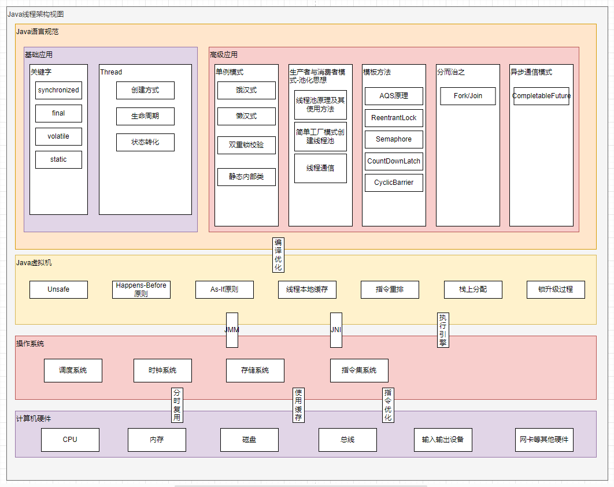
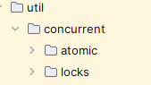
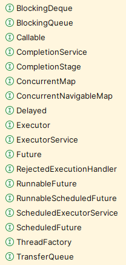
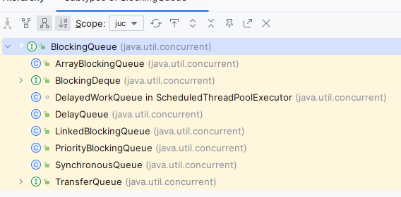
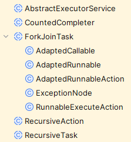
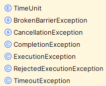

# JUC

## 导学指引

1. 根据计算机硬件架构的基础可知，CPU 的运算速度要远远高于内存的速度，为了充分利用 CPU，人们采取了很多优化手段，这些优化手段主要包括下面三个：
   1. 使用缓存。即在 CPU 和内存中间添加速度高于内存的缓存，目的是缩小 CPU 与内存之间的速度差距。
   2. 使用指令优化。即对操作 CPU 进行运算的指令进行优化，使指令更加合理，常见手段有对指令进行合并、增减、重排序等。重排序是重点。
   3. 使用分时复用技术。即对 CPU 的运算时间进行切片，让指令占用 CPU 的运算时间不能太短也不能太长。太长有可能会产生等待，太短又可能会引起这个指令还没有运算完就要布置下一个指令的运算现场了，会导致频繁的上下文切换，这是一笔巨量的开销。
2. 虽然三个优化手段提高了 CPU 的运算能力，但是这三个优化手段却同样产生了一些问题：
   1. 缓存技术产生了可见性问题；
   2. 指令优化技术产生了顺序性问题；在 Java 中，指令优化技术是由执行引擎决定的，关键技术有热点代码、同步消除、无同步等方案。
   3. 分时复用技术产生了原子性问题；
3. 我们发现，如果把上面那三个问题全部都解决掉，就发现多线程的运行结果就跟我们的预期是一致的了。由此引出线程安全的概念： **多线程在并发场景下运行多次的结果都是与我们的预期结果是一致的，那么我们就说这种场景是并发安全的**，并由此得出并发编程三要素的概念——要想保证线程是安全的，就需要满足三个条件，且这三个条件缺一不可，由此我们才说线程是安全的。
4. 任何基于操作系统实现的高级编程语言，要想实现支持并发编程的目标，就必须要直面并发编程三要素，也就是说，一种高级编程语言，如果声称支持并发编程，那么它要么提供一种能够解决三要素问题的方案，要么使用它的程序员能够自行解决三要素问题，否则它就不能算是支持并发编程。
5. 在并发编程中，要处理两个关键问题：线程之间如何通信以及线程之间如何同步。处理这两个关键问题，有两种通用的方案： 共享内存 和 消息传递 。
   1. 通信是指线程之间如何交换信息。
      1. 共享内存： 线程之间共享程序的公共状态，线程之间通过写 - 读内存中的公共状态来隐式进行通信。
      2. 消息传递： 线程之间没有公共状态，线程之间必须通过明确的发送消息来显式进行通信。
   2. 同步是指如何控制线程之间指令执行步骤的相对顺序。
      1. 共享内存： 程序员必须显式地控制线程对共享内存的互斥访问； 【有点类似于“编程优于约定”的编程范式，Spring 中是“约定优于配置”的编程范式】
      2. 消息传递： 消息的发送发生于消息接收之前，同步是隐式的； 【有点类似于“约定优于编程”的编程范式】
6. Java 是一种高级编程语言，针对并发编程三要素，提供了一整套基于 Java 内存模型的解决方案，在这套方案的基础之上，再配合 Java 编程规范的要求，使得 Java 语言能够完美支持并发编程。
7. 但实际情况下，并不一定需要同时满足这三个条件也可以达到我们预期的效果，并由此衍生出各式各样的并发编程的方法。【有点类似于“系统越复杂，可用性越低”，“锁的粒度越细，性能越高”的理论。】【我们一边利用这些优化技术来提高线程的工作效率，而另一方面这些优化技术又让线程的工作结果存在着问题，我们可以对优化手段和产生的问题之间的关系来定义线程安全级别，事实上很多地方都有这种冲突，如 MySQL 中的隔离级别】
8. 高级语言的“线程”等相关的概念，则是对这些技术的再次应用后的一种抽象概念，这样做的好处在于让程序员不用过度关注底层的原理，使得学习曲线不用那么陡峭。Java 中的并发编程的发展：
   1. **硬件系统和操作系统角度**：
      1. 单发和并发、线程【协程】和进程、串行和并行、同步和异步、并发和并行、线程安全【任务大小与并发效率之间的关系->线程安全程度】
      2. 多级缓存、并发编程模型（并发编程三要素、线程安全与线程安全程度、临界区、线程调度方式、上下文）
      3. 线程运行的基本原理： 堆管存储、栈管运行
   2. **Java 虚拟机规范角度**： Java 设计人员先是从直接复用操作系统操作线程的相关指令方面，提供一些关键字和一些编译原则，让早期的 Java 版本具有线程相关的基础特性。这些关键字和编译原则主要有：
      1. Java 内存模型（JMM）的核心机制（Java 线程与操作系统线程的映射关系、主内存与工作内存、内存屏障、Happens-Before 原则、AS-If 原则）
      2. 一些优化手段： 热点代码分析、同步消除、栈上分配、指令优化、线程本地缓存（ThreadLocal）、锁升级过程；
      3. 一些关键字： synchronized、volatile、final、static；
   3. **Java 语言规范角度**：再之后，Java 设计人员从开发操作系统本地接口的方式，使得 Java 语言直接操控操作系统层面的线程成为可能。这种开放操作系统本地接口的方式就是 JNI 技术。
      1. JNI 技术和 Unsafe 工具类（方法、原理、作用、扩展）；
      2. Java 中的线程：Java 线程的 API、生命周期及状态转化、线程调度、用户线程与守护线程、优先级、线程通信、源码；
   4. **Java 语言规范的高级应用角度**： JNI 技术的核心在于 Unsafe 工具包，Thread 的相关映射就是对 Unsafe 工具的抽象应用。后来随着高级一些的应用场景的出现，在 Unsafe 工具包的基础上又发展出来 LockSupport、Condition 等技术。而 线程池、FutureTask、CompleteFuture 、AQS、Fork/Join 等则是在 Thread、LockSupport、Condition 等基础上封装的一些高级工具。
      1. LockSupport、Condition 等技术
      2. 线程池（使用方式、原理、API）、FutureTask、CompleteFuture（任务编排 、使用及其原理） 、AQS（使用及其原理、常见的 AQS 衍生）、Fork/Join（框架的使用及其原理） 等；
      3. 并发工具类：原子类、集合类、锁类、其它并发工具

## 知识体系

- 线程的产生背景
  - 名词解释： 应用程序、进程、线程、同步与异步、同步访问与互斥访问、线程上下文、线程调度、线程通信、临界区、死锁、用户线程与守护线程；
  - 线程安全的定义、线程安全三要素、JMM 对并发编程三要素的支持
- 关键字
  - synchronized（使用方法、原理、锁升级过程）
  - volatile（原理）
  - final（使用方法及原理）
- Java 语言规范角度
  - Unsafe 工具类
  - Java 线程的 API、生命周期及状态转化、线程调度、用户线程与守护线程、优先级、线程通信、源码
- Java 语言规范的高级应用角度
  - LockSupport、Condition 等技术
  - 线程池（使用方式、原理、API）
  - FutureTask
  - 任务编排-CompleteFuture（任务编排 、使用及其原理）
  - AQS（使用及其原理、常见的 AQS 衍生）
  - Fork/Join（框架的使用及其原理）
  - 并发工具类（原子类、集合类、锁类、其它并发工具）

---

JUC 包结构

## 参考

1. [面渣逆袭：Java 并发六十问，图文详解，快来看看你会多少道！](https://mp.weixin.qq.com/s?__biz=MzkwODE5ODM0Ng==&mid=2247489245&idx=1&sn=bc52281ebc85372e19513d663beb2d2d&chksm=c0ccfe78f7bb776e2c6396fe26aca84d0cd96f407e6fe0bf6eb068aed638ba9491bce8fc5b4c&scene=178&cur_album_id=2041709347461709827#rd)
2. [♥Java 并发知识体系详解 ♥](https://pdai.tech/md/java/thread/java-thread-x-overview.html)
3. [https://www.wolai.com/niwx3ZkfJnPXGa2J7sH5Xp](https://www.wolai.com/niwx3ZkfJnPXGa2J7sH5Xp)
4. [CompletableFuture 原理与实践-外卖商家端 API 的异步化 - 美团技术团队](https://tech.meituan.com/2022/05/12/principles-and-practices-of-completablefuture.html)
5. [聊聊并发编程的 12 种业务场景](https://mp.weixin.qq.com/s/-2goNthdpK8KXLV5FrkCzg)
6. [2. CompletableFuture](https://www.yuque.com/gongxi-wssld/csm31d/ip2ueru5itmgsgly)

## TEMP

### 背景

1. 最初的计算机只能接受简单的少量指令，当用户在思考或输入时，计算机就在等待，这就使得计算机的工作效率极其低下；
2. 后来出现支持批处理系统的计算机，人们可以把计算机指令写成一个清单，然后统一交给计算机处理，例如纸带式的计算机，虽然效率有所提升，但是有些程序的运行中，依然有 CPU 等核心资源处于闲置状态，并且只能处理单个应用程序，也就是说这种计算机的性能依旧没有被压榨到极致；
3. 可以说，“计算机科学”的发展史就是围绕着“如何极限压榨计算机性能”——这一问题进行的。
4. 人们针对这一核心问题，提出了一整套的解决方案。
5. 这里面包含的内容极多，有计算机硬件、操作系统、数据结构与算法、编译器优化等等，很多学科的内容，比如，
   1. **硬件体系**中添加了多级缓存以求解决“如何缩短「读取指令」和「运算指令」的速度差异”的问题；
   2. **操作系统层面**使用「分时复用」+「任务调度」等技术来解决“ CPU 执行时间如何划分”、“不同任务如何切换”、“多个指令如何进行划分、组合与合并”等问题；
   3. **数据结构与算法**层面解决同一任务不同算法、不同存储空间的最优解问题；
6. 并且这些内容也都是糅合在一起使用的；
