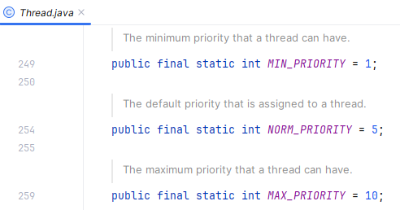
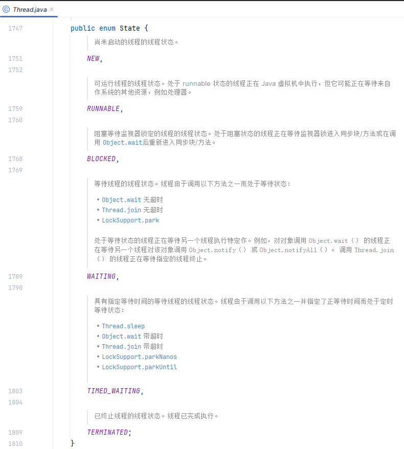

# 线程产生的背景

> 1. 冯诺依曼体系【不同缓存之间的访问的速度差异】
> 2. 线程的优化手段及其产生的问题
> 3. 并发安全级别及同步手段
> 4. Java 内存模型、Happens-Before 原则、As-If 原则
> 5. 指令优化手段、线程同步优化、编译器优化等

## 前置知识点

### 应用程序、进程、线程、协程

应用程序：用某种编程语言(java、python 等)编写，能够完成一定任务或者功能的代码集合，是指令和数据的有序集合，本质上是一段静态代码。

进程：就是应用程序在内存中分配的空间，也就是正在运行的程序，各个进程之间互不干扰。同时进程保存着程序每一个时刻运行的状态。

比如，在 Windows 平台上，idea 的运行，idea 就是应用程序，我们打开任务管理器，可以在 idea 下面看到有多个进程：


也就是说，人们把应用程序从占用资源的角度，划分成多个不同的进程，当某一个进程运行时，它会占用 CPU、内存等资源，但是当它挂起时，CPU 等计算资源就可能会处于空闲状态，这就说明划分粒度还是不够小，于是人们又提出线程的概念。

狭义：进程是正在运行的程序的实例。
广义：进程是一个具有一定独立功能的程序，关于某个数据集合的一次运行活动。

进程是操作系统动态执行的基本单元，在传统的操作系统中，进程即是基本的分配单元，也是基本的执行单元。

线程是操作系统能够进行运算调试的最小单位。它被包含在进程中，是进程中的实际动作单位。一个线程指的是进程中的一个单一顺序的控制流，一个进程中可以并发多个线程，每个线程执行不同的任务。

协程被视为比线程更轻量级的并发单元，可以在单线程中实现并发执行，由我们开发者显式调度。

协程是在用户态进行调度的，避免了线程切换时的内核态开销。

Java 自身是不支持携程的，我们可以使用 Quasar、Kotlin 等框架来实现协程。

### 线程运行的基本原理

线程运行的基本原理： 堆管存储、栈管运行

### 同步（Synchronous）和异步（Asynchronous）

在 Java 领域中，同步和异步通常用来描述方法的调用。如果说调用者必须要等待方法的返回才能进行下一步操作，那么就说这次调用是同步的；如果说调用者不必等待方法的返回结果，只是执行了一次方法的调用，就可以直接执行方法下面的操作，那么就说这个方法是异步调用的。

比如说，现在有这样一个业务场景，在代码中我们需要调用一个外围系统的接口取回一些数据，然后把数据进行处理一下，再返回给前端。如果在调用外围系统时，需要阻塞住，非要等到外围系统返回结果才往下执行其他内容，那么这种场景就是同步调用的场景；如果调用外围系统时，只是发起外围系统的接口调用过程，并没有非要等着外围系统返回结果才往下进行，那么这种场景就是异步的。

> 在日常交流中，我们说“同步一下某一个方案”，也会用到同步这个说法，这里的同步表示共享、使大家统一意见。

### 同步访问和互斥访问

同步，意味着线程之间要密切合作，按照一定的顺序来执行任务。比如说，线程 A 先执行，线程 B 再执行。

互斥，意味着线程之间要抢占资源，同一时间只能有一个线程访问共享资源。比如说，线程 A 在访问共享资源时，线程 B 不能访问。

同步关注的是线程之间的协作，互斥关注的是线程之间的竞争。

### 并发和并行

并行是多核 CPU 上的多任务处理，多个任务在同一时间真正地同时执行。

并发是单核 CPU 上的多任务处理，多个任务在同一时间段内交替执行，通过时间片轮转实现交替执行，用于解决 IO 密集型任务的瓶颈。

### 上下文

### 守护线程和用户线程

守护线程是一种特殊的线程，它的作用是为其他线程提供服务。

- java程序的后台线程

  可以通过下面的代码进行检测：

  ```java
  class ThreadLister {
      public static void main(String[] args) {
          // 获取所有线程的堆栈跟踪
          Map<Thread, StackTraceElement[]> threads = Thread.getAllStackTraces();
          for (Thread thread : threads.keySet()) {
              System.out.println("Thread: " + thread.getName() + " (ID=" + thread.getId() + ")");
          }
      }
  }
  ```

  结果如下所示：

  ```
  Thread: Monitor Ctrl-Break (ID=5)
  Thread: Reference Handler (ID=2)
  Thread: main (ID=1)
  Thread: Signal Dispatcher (ID=4)
  Thread: Finalizer (ID=3)
  ```

  简单解释下：

  - `Thread: main (ID=1)` - 主线程，Java 程序启动时由 JVM 创建。
  - `Thread: Reference Handler (ID=2)` - 这个线程是用来处理引用对象的，如软引用、弱引用和虚引用。负责清理被 JVM 回收的对象。
  - `Thread: Finalizer (ID=3)` - 终结器线程，负责调用对象的 finalize 方法。对象在垃圾回收器标记为可回收之前，由该线程执行其 finalize 方法，用于执行特定的资源释放操作。
  - `Thread: Signal Dispatcher (ID=4)` - 信号调度线程，处理来自操作系统的信号，将它们转发给 JVM 进行进一步处理，例如响应中断、停止等信号。
  - `Thread: Monitor Ctrl-Break (ID=5)` - 监视器线程，通常由一些特定的 IDE 创建，用于在开发过程中监控和管理程序执行或者处理中断。

当最后一个非守护线程束时， JVM 会正常退出，不管当前是否存在守护线程，也就是说守护线程是否结束并不影响 JVM 退出。

换而言之，只要有一个用户线程还没结束，正常情况下 JVM 就不会退出。

### 线程调度


1. 在计算机操作系统中，是通过分配时间片来执行指令的，因此涉及到线程的调度。
2. 现代操作系统的调度方式有两种，一种是轮询调度方式，一种是抢占式调度方式。
3. 轮询调度方式就是把对排队中的线程分别分配一个时间片来执行，而抢占式调度方式，则是根据线程的优先级来确定的，优先级高的就优先分配时间片。
4. java 中的线程调度是委托操作系统进行的，但 java 中可以针对线程的执行顺序设置优先级。

### 临界区

### 死锁

死锁就是两个或两个以上的线程因抢占锁而造成的互相等待的现象。

- 死锁产生必要条件：

  - **互斥**：资源不能被多个线程共享，一次只能由一个线程使用。如果一个线程已经占用了一个资源，其他请求该资源的线程必须等待，直到资源被释放。
  - **持有并等待**：一个线程已经持有一个资源，并且在等待获取其他线程持有的资源。
  - **不可抢占**：资源不能被强制从线程中夺走，必须等线程自己释放。
  - **循环等待**：存在一种线程等待链，线程 A 等待线程 B 持有的资源，线程 B 等待线程 C 持有的资源，直到线程 N 又等待线程 A 持有的资源。
  - 四个条件的关系：四个条件缺一不可，必须同时满足才可能产生死锁。

- 如何避免死锁： 要想避免死锁，只需要破坏其中一个条件即可。

- 如何排查死锁？

### 线程间的通信

在并发编程中，我们需要处理两个关键问题：线程之间如何通信及线程之间如何同步（这里的线程是指并发执行的活动实体）。通信是指线程之间以何种机制来交换信息。在命令式编程中，线程之间的通信机制有两种：**共享内存和消息传递**。

在共享内存的并发模型里，线程之间共享程序的公共状态，线程之间通过写 - 读内存中的公共状态来隐式进行通信。在消息传递的并发模型里，线程之间没有公共状态，线程之间必须通过明确的发送消息来显式进行通信。

同步是指程序用于控制不同线程之间操作发生相对顺序的机制。在共享内存并发模型里，同步是显式进行的。程序员必须显式指定某个方法或某段代码需要在线程之间互斥执行。在消息传递的并发模型里，由于消息的发送必须在消息的接收之前，因此同步是隐式进行的。

Java 的并发采用的是共享内存模型，Java 线程之间的通信总是隐式进行，整个通信过程对程序员完全透明（透明： 程序员不需要知道这个通信过程，对于程序员来讲，这个通信过程就像不存在一样）。如果编写多线程程序的 Java 程序员不理解隐式进行的线程之间通信的工作机制，很可能会遇到各种奇怪的内存可见性问题。

## JNI技术和Unsafe工具类（方法、原理、作用、扩展）

## Java 虚拟机规范角度

### 线程安全

所谓线程安全，就是多线程并发场景下，针对共享数据的访问问题，如果多线程访问共享数据时，共享数据的结果值与多线程访问完共享数据后的期望值一致，则表明共享数据是线程安全的。

在多线程场景下，共享变量的实际运行后的值总能与期望值保持一致，这样的共享变量就可以被称为是线程安全的。

### 线程安全三要素

- **原子性（Atomicity）**：
  - 产生的原因： 对 CPU 的运算时间进行切片，让指令占用 CPU 的运算时间不能太短也不能太长。太长有可能会产生等待，太短又可能会引起这个指令还没有运算完就要布置下一个指令的运算现场了，会导致频繁的上下文切换，这是一笔巨量的开销。这就产生了原子性的问题，即怎样的指令算是一个原子操作。
  - 这个要素说明：要想实现线程安全，就必须要满足：一个操作（或多个操作的组合）要么全部执行且不可中断，要么完全不执行，不能有中间状态。
- **有序性（Ordering）**：
  - 产生的原因： 对操作 CPU 进行运算的指令进行优化，使指令更加合理，常见手段有对指令进行合并、增减、重排序等，重排序是重点。这就使得不同指令的顺序发生的变化。
  - 这个要素说明，要想实现线程安全，就必须要满足：程序执行的顺序符合代码的语义逻辑（避免指令重排序导致的意外结果）。
- **可见性（Visibility）**：
  - 产生原因： 为了缩小CPU与内存在读写数据上的速度差异，就在CPU和内存之间添加了多级缓存，这就造成了同一份数据在内存、多级缓存和CPU上的不一致性问题，也可以成为可见性；
  - 这个要素说明，要想实现线程安全，就必须要满足： 一个线程对共享变量的修改，其他线程能立即看到最新值。


### Java内存模型（JMM）的核心机制


#### Java 中线程与操作系统的映射


这就说明 Java 中的线程与底层操作系统属于一一映射的关系，也就是说 Java 中线程的执行是由 JVM 提交给操作系统执行的，既然提交给底层操作系统，那么这些线程的调度也是由底层操作系统控制的，所以说 Java 的线程的执行具有一定的随机性。

这也是为什么说 Java 中线程的优先权的设置的执行结果并不一定准确的原因，也是为什么说 wait 之后可能在交出执行权之后又立马被调度的原因。

#### 线程的调度

1. 在计算机操作系统中，是通过分配时间片来执行指令的，因此涉及到线程的调度。
2. 现代操作系统的调度方式有两种，一种是轮询调度方式，一种是抢占式调度方式。
3. 轮询调度方式就是把对排队中的线程分别分配一个时间片来执行，而抢占式调度方式，则是根据线程的优先级来确定的，优先级高的就优先分配时间片。
4. java 中的线程调度是委托操作系统进行的，但 java 中可以针对线程的执行顺序设置优先级。

#### JMM对并发编程三要素的支持

JMM 是 Java 定义的一套的多线程通过共享内存的方式进行数据通信以及指令同步的实现规范，通过这个规范，让 Java 并发编程成为现实。

并发编程三要素与 JMM 的关系： 并发编程三要素是任何支持并发编程的高级语言都必须要考虑和实现的基本要素。JMM——俗称 Java 内存模型，严格上讲，JMM 是指 Java 内存模型和它配套的一系列基础设施【下面统称为 JMM 机制】，通过这套机制，Java 语言成功实现了并发编程的设计目标。也可以说，并发编程三要素是理论基础，JMM 机制是 Java 语言的具体实现。下面是并发编程三要素的相关概念以及 JMM 机制对并发编程三要素的支持手段：

- 原子性
  - JMM 不直接保证大多数操作的原子性（如 i++是非原子操作，涉及读、改、写三步）。但 JMM 通过以下机制间接实现原子性：
    - synchronized 关键字：通过锁机制确保临界区代码的原子性。
    - 原子类（AtomicInteger 等）：基于 CAS（Compare-And-Swap）指令实现无锁原子操作。
    - volatile 变量：仅保证单次读/写操作的原子性（如 volatile long 的读写是原子的）。
- 有序性
  - JMM 通过以下机制限制指令重排序：
    - volatile 关键字：禁止对 volatile 变量的读/写操作与其前后的其他指令重排序。
    - synchronized/锁：临界区内的代码不会被重排序到锁外。
    - Happens-Before 规则：JMM 定义了一系列 Happens-Before 规则（如程序顺序规则、锁规则、volatile 规则等），确保编译器/处理器优化不会破坏多线程的正确性。
- 可见性
  - JMM 通过以下规则保证可见性：
    - volatile 变量：写入 volatile 变量时，会立即刷新到主内存；读取时直接从主内存获取。
    - 锁机制（synchronized 或 Lock）：线程释放锁前会将修改的变量刷新到主内存；获取锁时会清空工作内存，重新从主内存加载变量。
    - final 关键字：正确初始化的 final 变量在构造结束后对其他线程可见。
    - Happens-Before 规则：若操作 A Happens-Before 操作 B，则 A 的修改对 B 可见。

#### Happens-Before 原则、AS-If 原则

::: detail **Happens-Before 原则、AS-If 原则**

- Happens-Before（先行发生原则），是 Java 并发编程模型中定义的两个操作之间发生的顺序的一套编程规范。【周志明《深入理解 Java 虚拟机》ch12.3.6 先行发生原则】，主要包括 8 个：
  - 程序次序规则（Program Order Rule）：单线程内，代码按顺序执行；比如 `a = 1; b = 2;`，a 先于 b 执行。
  - 管程锁定规则（Monitor Lock Rule）：`unlock() Happens-Before lock()`；比如 synchronized 释放锁后，获取锁的线程能够看到最新的数据。
  - volatile 变量规则（Volatile Variable Rule）：写 volatile 变量 Happens-Before 读 volatile。
  - 线程启动规则（Thread Start Rule）：Thread 对象的 start()方法先行发生于此线程的每一个动作。
  - 线程终止规则（Thread Termination Rule）：线程中的所有操作都先行发生于对此线程的终止检测，我们可以通过 Thread::join()方法是否结束、Thread::isAlive()的返回值等手段检测线程是否已经终止执行。线程的所有操作 Happens-Before `Thread.join()`；例如 `t.join();` 之后，主线程一定能看到 t 的修改。
  - 线程中断规则（Thread Interruption Rule）： 对线程 interrupt()方法的调用先行发生于被中断线程的代码检测到中断事件的发生，可以通过 Thread::interrupted()方法检测到是否有中断发生；
  - 对象终结规则（Finalizer Rule）：一个对象的初始化完成（构造函数执行结束）先行发生于它的 finalize()方法的开始；
  - 传递性（Transitivity）：如果操作 A 先行发生于操作 B，操作 B 先行发生于操作 C，那就可以得出操作 A 先行发生于操作 C 的结论；
- As-If-Serial 规则允许 CPU 和编译器优化代码顺序，但不会改变单线程的执行结果。它只适用于单线程，多线程环境仍然可能发生指令重排，需要 volatile 和 synchronized 等机制来保证有序性。

:::

#### 线程安全程度

线程安全程度：线程安全与否，并不是一个非黑即白的二元概念。

通常情况下，约束越多，效率越低；约束越少，效率越高；这个概念可以看作是执行性能与限制手段之间的平衡，按照不同的限制手段带来的不同的执行性能进行分级，于是就有了线程安全程度这个概念。【周志明《深入理解 Java 虚拟机》ch13.2.1 java 语言中的线程安全】

- **不可变**： 只要一个不可变的对象被正确地构建出来，永远也不会看到它在多个线程之中处于不一致的状态。
  - 多线程环境下，应当尽量使对象成为不可变，来满足线程安全。
  - java 中不可变的类型:
    - final 关键字修饰的基本数据类型
    - String
    - 枚举类型
    - Number 部分子类，如 Long 和 Double 等数值包装类型，BigInteger 和 BigDecimal 等大数据类型。但同为 Number 的原子类 AtomicInteger 和 AtomicLong 则是可变的。
    - 集合类型，可以使用 Collections.unmodifiableXXX() 方法来获取一个不可变的集合
- **绝对线程安全**： 不管运行时环境如何，调用者都不需要任何额外的同步措施。
- **相对线程安全**： 相对线程安全就是我们通常意义上所讲的线程安全，它需要保证对这个对象单次的操作是线程安全的，我们在调用的时候不需要进行额外的保障措施，但是对于一些特定顺序的连续调用，就可能需要在调用端使用额外的同步手段来保证调用的正确性。
  - 在 Java 语言中，大部分声称线程安全的类都属于这种类型，例如 Vector、HashTable、Collections 的 synchronizedCollection()方法包装的集合等。
- **线程兼容**： 线程兼容是指对象本身并不是线程安全的，但是可以通过在调用端正确地使用同步手段来保证对象在并发环境中可以安全地使用。我们平常说一个类不是线程安全的，通常就是指这种情况。
  - Java 类库 API 中大部分的类都是线程兼容的，如与前面的 Vector 和 HashTable 相对应的集合类 ArrayList 和 HashMap 等。
- **线程对立**： 线程对立是指不管调用端是否采取了同步措施，都无法在多线程环境中并发使用代码。由于 Java 语言天生就支持多线程的特性，线程对立这种排斥多线程的代码是很少出现的，而且通常都是有害的，应当尽量避免。
  - Java 中一个线程对立的例子是 Thread 类的 suspend()和 resume()方法。如果有两个线程同时持有一个线程对象，一个尝试去中断线程，一个尝试去恢复线程，在并发进行的情况下，无论调用时是否进行了同步，目标线程都存在死锁风险——假如 suspend()中断的线程就是即将要执行 resume()的那个线程，那就肯定要产生死锁了。也正是这个原因，suspend()和 resume()方法都已经被声明废弃了。常见的线程对立的操作还有 System.setIn()、Sytem.setOut()和 System.runFinalizersOnExit()等。

### 一些优化手段

- 热点代码分析
- 同步消除
- 栈上分配、线程本地缓存（ThreadLocal）
- 指令优化
- 锁升级过程

### 常见关键字

synchronized、volatile、final、static

## Java 语言规范角度

### 基础技术

JNI技术和Unsafe工具类（方法、原理、作用、扩展）

### Java中的线程

Java 线程的 API、生命周期及状态转化、线程调度、用户线程与守护线程、优先级、线程通信、源码


#### 单线程的创建方式

java 中**创建单线程**有三种方式：

::: tabs

@tab 1. 继承 Thread 类

```java
// 创建
class MyThread extends Thread{
    @Override
    public void run(){
      // do something
    }
}

// 使用
MyThread m = new MyThread();
m.start();

```

@tab 2. 实现 Runnable 接口

```java

// 实现runnable
// 创建一个任务对象
MyRunnable r = new MyRunnable();
// 创建一个线程并给他一个任务
Thread t = new Thread(r);
// 启动线程
t.start();

```

@tab 3. 实现 Callable 接口

```java
class Mycallable implements Callable<T> {
    @Override
    public <T> call() throws Exception {
      return T;
    }
}

// 使用
Callable<Integer> callable= new MyCallable();
FutureTask<Integer> future = new FutureTask<>(callable);
new Thread(future).start();
Integer j=task.get();
System.out.println("return"+j);

```

:::

- 三种方式的异同
  - 实现 Runnable 接口方式与继承 Thread 类的方式的区别
    - 通过创建任务，然后给线程分配任务的方式实现多线程，更适合多个线程同时执行任务的情况
    - 可以避免单继承所带来的局限性，也更符合面向对象的编程思想
    - 任务与线程是分离的，提高了程序的健壮性
    - 后期学习的线程池技术，接受 Runnable 类型的任务，不接受 Thread 类型的线程
  - 实现 Callable 接口方式，相当于又在实现 Runnable 接口方式上添加了返回值的过程

除此以外，还有线程池的两种方式：

- 一种是 juc 提供的原生线程池的方法，需要设置各种参数；
- 一种是 juc 提供的静态工厂创建线程池的方法；

#### API

- `currentThread` 线程名称的设置与获取
- `start` 的执行顺序与线程的执行顺序不一致
- `currentThread` 方法用来获取当前执行线程的名称
- `isAlive` 用来判断线程是否还在存活状态，活动状态就是线程已经启动且运行没有结束。线程处于正在运行或准备开始运行的状态，就认为线程是『存活』的状态
- `sleep` 让当前线程睡眠，让出 CPU，使线程从执行状态变成限时阻塞状态。等待时间结束后，线程不一定会立即执行，线程状态会变成可执行状态。作用是在指定的毫秒数内让当前『正在执行的线程』暂停执行。
- `getId` 方法，作用是获取当前线程的唯一标识
- 停止线程
  - `stop` 方法强制结束线程。stop 方法已经被作废，如果强制让线程停止有可能使一些清理性的工作得不到完成。另外一个原因是对锁定的对象进行『解锁』，导致数据得不同同步的处理，出现数据不一致性的问题。
  - 也可以使用退出标志，使线程正常退出，也就是当 run 方法完成后线程终止。
- `interrupt` 让当前线程进入阻塞状态。调用 interrupt 方法不会真正的结束线程，在当前线程中打上一个停止的标记。Thread 类提供了 interrupted 方法测试当前线程是否中断，isInterrupted 方法测试线程是否已经中断。如果程中有 sleep 代码，不管是否进入到 sleep 的状态，如果调用了 interrupt 方法都会产生异常信息。
- 暂停线程使用 `suspend` ，重启暂停线程使用 resume 方法，suspend 如果独占公共的同步对象，使其它线程无法访问公共同步对象，suspend 会造成共享对象数据不同步
- `join` 多个线程进行合并，本质是：线程 a 需要在合并点进行等待，一直等到 b 线程执行完，或者等待超时时，才继续执行。
- `yeild` 此方法相当于让当前线程让出 cpu 执行权限，让 cpu 执行其他线程，但是此方法虽然会让当前线程暂停，但是不会行阻塞当前线程，只是让线程转入就绪状态，可能当前线程暂停了一下，又立即获得了 cpu 的执行权限，又开始执了。
- 线程的优先级
  - 在操作系统中，线程可以划分优先级，优先级较高的线程得到更多的 CPU 资源，也就 CPU 会优先执行优先级较高的线程对象中的任务。设置线程优先有助于帮助『线程调度器』确定在下一次选择哪个线程优先执行。
  - 设置线程的优先级使用 setPriority 方法，优级分为 1~10 个级别，如果设置优先级小于 1 或大于 10，JDK 抛出 IllegalArgumentException。JDK 默认设置 3 个优先级常量，MIN_PRIORITY=1(最小值)，NORM_PRIORITY=5(中间值，默认)，MAX_PRIORITY=10(最大值)。
  - 获取线程的优先级使用 getPriority 方法。
  - 线程的优先级具有继承性，比如线程 A 启动线程 B，线程 B 的优先级与线程 A 是一样的。
  - 高优先级的线程总是大部分先执行完，但不代表高优先级的线程全部执行完。当线程优先级的等级差距很大时，谁先执行完和代码的调用顺序无关。
  - 线程的优先还有『随机性』，也就是说优先级高的线不一定每一次都先执行完成。
- `daemon` 线程分为两类，守护线程和用户线程。守护线程指在用户线程执行过程中，在后台提供某些通用服务的线程。GC 线程就是守护线程。守护线程是一种特殊的线程，特殊指的是当进程中不存在用户线程时，守护线程会自动销毁。典型的守护线程的例子就是垃圾回收线程，当进程中没有用户线程，垃圾回收线程就没有存在的必要了，会自动销毁。设置守护线程必须要在调用 start 方法之前设置，否则 JDK 会产生 IllegalThreadStateException
- `wait` 挂起线程，即让线程处于阻塞状态，适用 notify 方法可以进行唤醒；
- `notify` 用来唤醒被挂起的线程
- `stop` 方法用来强制停止线程，目前已经处于废弃状态，因为 stop 方法可能会在不一致的状态下释放锁，破坏对象的一致性。

#### 线程优先级

在 Thread 类中有一个属性专门标识了线程的优先级，默认是 5，最小值是 1，最大值是 10，数值越大，说明优先级越高。但需要注意的一点是，优先级高的线程不一定就比优先级低的线程执行的快，因为操作系统调度线程完全是随机的。具体调用哪个线程进行执行，只有天知道。



#### 线程的生命周期



Thread 类中有一个内部枚举类 State， public static enum Thread.State extends Enum<Thread.State> 。标识了线程从新建到消亡的各个阶段的状态。用一个表格来做个总结：

| 状态 | 说明 |
| --- | --- |
| NEW | 当线程被创建后，如通过`new Thread()`，它处于新建状态。此时，线程已经被分配了必要的资源，但还没有开始执行。 |
| RUNNABLE | 当调用线程的`start()`方法后，线程进入可运行状态。在这个状态下，线程可能正在运行也可能正在等待获取 CPU 时间片，具体取决于线程调度器的调度策略。 |
| BLOCKED  | 线程在试图获取一个锁以进入同步块/方法时，如果锁被其他线程持有，线程将进入阻塞状态，直到它获取到锁。  |
| WAITING  | 线程进入等待状态是因为调用了如下方法之一：`Object.wait()`或`LockSupport.park()`。在等待状态下，线程需要其他线程显式地唤醒，否则不会自动执行。  |
| TIMED_WAITING | 当线程调用带有超时参数的方法时，如`Thread.sleep(long millis)`、`Object.wait(long timeout)` 或`LockSupport.parkNanos()`，它将进入超时等待状态。线程在指定的等待时间过后会自动返回可运行状态。 |
| TERMINATED   | 当线程的`run()`方法执行完毕后，或者因为一个未捕获的异常终止了执行，线程进入终止状态。一旦线程终止，它的生命周期结束，不能再被重新启动。 |


- [ ] 阻塞状态和等待状态以及限时等待状态的区别

#### 通信和协作

1. 什么是线程间的通信；
2. Java 中实现线程间通信的方式有哪些？


Java中实现线程间传递信息的方式有多种，比如说：

1. 使用 volatile 和 synchronized 关键字共享对象；

  多个线程可以通过 volatile 和 synchronized 关键字访问和修改同一个对象，从而实现信息的传递。

  volatile 可以用来修饰成员变量，告知程序任何对该变量的访问均需要从共享内存中获取，并同步刷新回共享内存，保证所有线程对变量访问的可见性。

  synchronized 可以修饰方法，或者同步代码块，确保多个线程在同一个时刻只有一个线程在执行方法或代码块。

2. 使用 `wait()` 和 `notify()` 方法实现生产者-消费者模式；
3. 使用 Exchanger 进行数据交换；
4. 使用 Condition 实现线程间的协调；
5. 任务编排；

#### 源码

## Java 语言规范的高级应用角度

### LockSupport、Condition 等技术

### 线程池

线程池（使用方式、原理、API）

### FutureTask

### 任务编排-CompleteFuture

（任务编排 、使用及其原理） 

### AQS（使用及其原理、常见的 AQS 衍生）


### Fork/Join（框架的使用及其原理） 

### 并发工具类

原子类、集合类、锁类、其它并发工具


