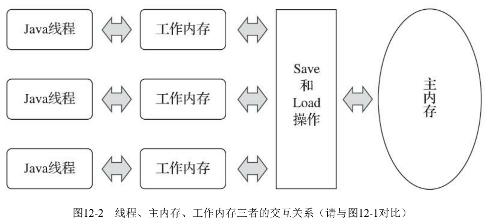
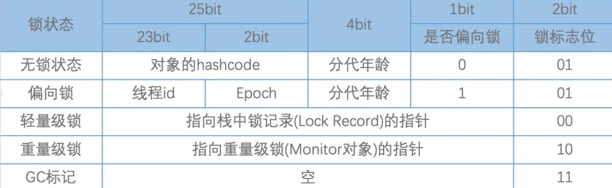
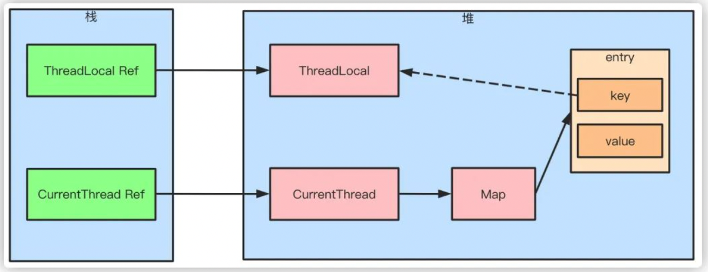
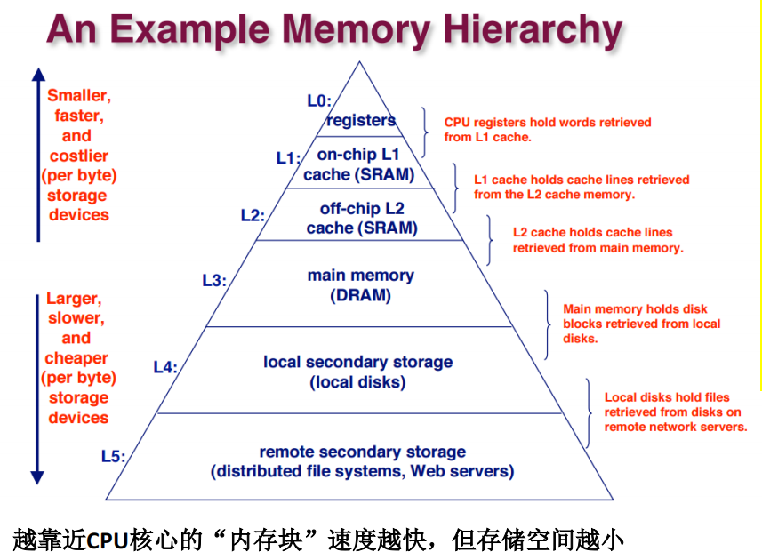
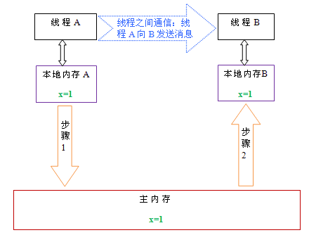
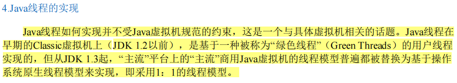
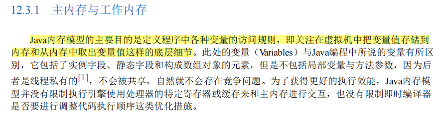
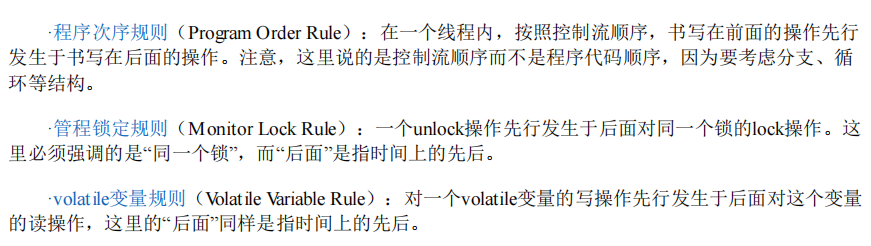
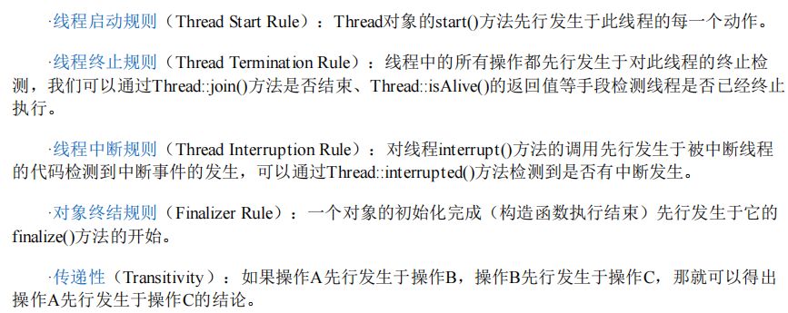

# 线程产生的背景

> 1. 冯诺依曼体系【不同缓存之间的访问的速度差异】
> 2. 线程的优化手段及其产生的问题
> 3. 并发安全级别及同步手段
> 4. Java 内存模型、Happens-Before 原则、As-If 原则
> 5. 指令优化手段、线程同步优化、编译器优化等

## 前置知识点

### 应用程序、进程、线程、协程

应用程序：用某种编程语言(java、python 等)编写，能够完成一定任务或者功能的代码集合，是指令和数据的有序集合，本质上是一段静态代码。

进程：就是应用程序在内存中分配的空间，也就是正在运行的程序，各个进程之间互不干扰。同时进程保存着程序每一个时刻运行的状态。

比如，在 Windows 平台上，idea 的运行，idea 就是应用程序，我们打开任务管理器，可以在 idea 下面看到有多个进程：


也就是说，人们把应用程序从占用资源的角度，划分成多个不同的进程，当某一个进程运行时，它会占用 CPU、内存等资源，但是当它挂起时，CPU 等计算资源就可能会处于空闲状态，这就说明划分粒度还是不够小，于是人们又提出线程的概念。

狭义：进程是正在运行的程序的实例。
广义：进程是一个具有一定独立功能的程序，关于某个数据集合的一次运行活动。

进程是操作系统动态执行的基本单元，在传统的操作系统中，进程即是基本的分配单元，也是基本的执行单元。

线程是操作系统能够进行运算调试的最小单位。它被包含在进程中，是进程中的实际动作单位。一个线程指的是进程中的一个单一顺序的控制流，一个进程中可以并发多个线程，每个线程执行不同的任务。

协程被视为比线程更轻量级的并发单元，可以在单线程中实现并发执行，由我们开发者显式调度。

协程是在用户态进行调度的，避免了线程切换时的内核态开销。

Java 自身是不支持携程的，我们可以使用 Quasar、Kotlin 等框架来实现协程。

### 线程运行的基本原理

线程运行的基本原理： 堆管存储、栈管运行

### 同步（Synchronous）和异步（Asynchronous）

在 Java 领域中，同步和异步通常用来描述方法的调用。如果说调用者必须要等待方法的返回才能进行下一步操作，那么就说这次调用是同步的；如果说调用者不必等待方法的返回结果，只是执行了一次方法的调用，就可以直接执行方法下面的操作，那么就说这个方法是异步调用的。

比如说，现在有这样一个业务场景，在代码中我们需要调用一个外围系统的接口取回一些数据，然后把数据进行处理一下，再返回给前端。如果在调用外围系统时，需要阻塞住，非要等到外围系统返回结果才往下执行其他内容，那么这种场景就是同步调用的场景；如果调用外围系统时，只是发起外围系统的接口调用过程，并没有非要等着外围系统返回结果才往下进行，那么这种场景就是异步的。

> 在日常交流中，我们说“同步一下某一个方案”，也会用到同步这个说法，这里的同步表示共享、使大家统一意见。

### 同步访问和互斥访问

同步，意味着线程之间要密切合作，按照一定的顺序来执行任务。比如说，线程 A 先执行，线程 B 再执行。

互斥，意味着线程之间要抢占资源，同一时间只能有一个线程访问共享资源。比如说，线程 A 在访问共享资源时，线程 B 不能访问。

同步关注的是线程之间的协作，互斥关注的是线程之间的竞争。

### 并发和并行

并行是多核 CPU 上的多任务处理，多个任务在同一时间真正地同时执行。

并发是单核 CPU 上的多任务处理，多个任务在同一时间段内交替执行，通过时间片轮转实现交替执行，用于解决 IO 密集型任务的瓶颈。

### 上下文

### 守护线程和用户线程

守护线程是一种特殊的线程，它的作用是为其他线程提供服务。

- java程序的后台线程

  可以通过下面的代码进行检测：

  ```java
  class ThreadLister {
      public static void main(String[] args) {
          // 获取所有线程的堆栈跟踪
          Map<Thread, StackTraceElement[]> threads = Thread.getAllStackTraces();
          for (Thread thread : threads.keySet()) {
              System.out.println("Thread: " + thread.getName() + " (ID=" + thread.getId() + ")");
          }
      }
  }
  ```

  结果如下所示：

  ```
  Thread: Monitor Ctrl-Break (ID=5)
  Thread: Reference Handler (ID=2)
  Thread: main (ID=1)
  Thread: Signal Dispatcher (ID=4)
  Thread: Finalizer (ID=3)
  ```

  简单解释下：

  - `Thread: main (ID=1)` - 主线程，Java 程序启动时由 JVM 创建。
  - `Thread: Reference Handler (ID=2)` - 这个线程是用来处理引用对象的，如软引用、弱引用和虚引用。负责清理被 JVM 回收的对象。
  - `Thread: Finalizer (ID=3)` - 终结器线程，负责调用对象的 finalize 方法。对象在垃圾回收器标记为可回收之前，由该线程执行其 finalize 方法，用于执行特定的资源释放操作。
  - `Thread: Signal Dispatcher (ID=4)` - 信号调度线程，处理来自操作系统的信号，将它们转发给 JVM 进行进一步处理，例如响应中断、停止等信号。
  - `Thread: Monitor Ctrl-Break (ID=5)` - 监视器线程，通常由一些特定的 IDE 创建，用于在开发过程中监控和管理程序执行或者处理中断。

当最后一个非守护线程束时， JVM 会正常退出，不管当前是否存在守护线程，也就是说守护线程是否结束并不影响 JVM 退出。

换而言之，只要有一个用户线程还没结束，正常情况下 JVM 就不会退出。

### 线程调度


1. 在计算机操作系统中，是通过分配时间片来执行指令的，因此涉及到线程的调度。
2. 现代操作系统的调度方式有两种，一种是轮询调度方式，一种是抢占式调度方式。
3. 轮询调度方式就是把对排队中的线程分别分配一个时间片来执行，而抢占式调度方式，则是根据线程的优先级来确定的，优先级高的就优先分配时间片。
4. java 中的线程调度是委托操作系统进行的，但 java 中可以针对线程的执行顺序设置优先级。

### 临界区

### 死锁

死锁就是两个或两个以上的线程因抢占锁而造成的互相等待的现象。

- 死锁产生必要条件：

  - **互斥**：资源不能被多个线程共享，一次只能由一个线程使用。如果一个线程已经占用了一个资源，其他请求该资源的线程必须等待，直到资源被释放。
  - **持有并等待**：一个线程已经持有一个资源，并且在等待获取其他线程持有的资源。
  - **不可抢占**：资源不能被强制从线程中夺走，必须等线程自己释放。
  - **循环等待**：存在一种线程等待链，线程 A 等待线程 B 持有的资源，线程 B 等待线程 C 持有的资源，直到线程 N 又等待线程 A 持有的资源。
  - 四个条件的关系：四个条件缺一不可，必须同时满足才可能产生死锁。

- 如何避免死锁： 要想避免死锁，只需要破坏其中一个条件即可。

- 如何排查死锁？

### 线程间的通信

在并发编程中，我们需要处理两个关键问题：线程之间如何通信及线程之间如何同步（这里的线程是指并发执行的活动实体）。通信是指线程之间以何种机制来交换信息。在命令式编程中，线程之间的通信机制有两种：**共享内存和消息传递**。

在共享内存的并发模型里，线程之间共享程序的公共状态，线程之间通过写 - 读内存中的公共状态来隐式进行通信。在消息传递的并发模型里，线程之间没有公共状态，线程之间必须通过明确的发送消息来显式进行通信。

同步是指程序用于控制不同线程之间操作发生相对顺序的机制。在共享内存并发模型里，同步是显式进行的。程序员必须显式指定某个方法或某段代码需要在线程之间互斥执行。在消息传递的并发模型里，由于消息的发送必须在消息的接收之前，因此同步是隐式进行的。

Java 的并发采用的是共享内存模型，Java 线程之间的通信总是隐式进行，整个通信过程对程序员完全透明（透明： 程序员不需要知道这个通信过程，对于程序员来讲，这个通信过程就像不存在一样）。如果编写多线程程序的 Java 程序员不理解隐式进行的线程之间通信的工作机制，很可能会遇到各种奇怪的内存可见性问题。

## JNI技术和Unsafe工具类（方法、原理、作用、扩展）

## Java 虚拟机规范角度

### 线程安全

所谓线程安全，就是多线程并发场景下，针对共享数据的访问问题，如果多线程访问共享数据时，共享数据的结果值与多线程访问完共享数据后的期望值一致，则表明共享数据是线程安全的。

在多线程场景下，共享变量的实际运行后的值总能与期望值保持一致，这样的共享变量就可以被称为是线程安全的。

### 线程安全三要素

- **原子性（Atomicity）**：
  - 产生的原因： 对 CPU 的运算时间进行切片，让指令占用 CPU 的运算时间不能太短也不能太长。太长有可能会产生等待，太短又可能会引起这个指令还没有运算完就要布置下一个指令的运算现场了，会导致频繁的上下文切换，这是一笔巨量的开销。这就产生了原子性的问题，即怎样的指令算是一个原子操作。
  - 这个要素说明：要想实现线程安全，就必须要满足：一个操作（或多个操作的组合）要么全部执行且不可中断，要么完全不执行，不能有中间状态。
- **有序性（Ordering）**：
  - 产生的原因： 对操作 CPU 进行运算的指令进行优化，使指令更加合理，常见手段有对指令进行合并、增减、重排序等，重排序是重点。这就使得不同指令的顺序发生的变化。
  - 这个要素说明，要想实现线程安全，就必须要满足：程序执行的顺序符合代码的语义逻辑（避免指令重排序导致的意外结果）。
- **可见性（Visibility）**：
  - 产生原因： 为了缩小CPU与内存在读写数据上的速度差异，就在CPU和内存之间添加了多级缓存，这就造成了同一份数据在内存、多级缓存和CPU上的不一致性问题，也可以成为可见性；
  - 这个要素说明，要想实现线程安全，就必须要满足： 一个线程对共享变量的修改，其他线程能立即看到最新值。


### Java内存模型（JMM）的核心机制


#### Java 中线程与操作系统的映射


这就说明 Java 中的线程与底层操作系统属于一一映射的关系，也就是说 Java 中线程的执行是由 JVM 提交给操作系统执行的，既然提交给底层操作系统，那么这些线程的调度也是由底层操作系统控制的，所以说 Java 的线程的执行具有一定的随机性。

这也是为什么说 Java 中线程的优先权的设置的执行结果并不一定准确的原因，也是为什么说 wait 之后可能在交出执行权之后又立马被调度的原因。

#### 线程的调度

1. 在计算机操作系统中，是通过分配时间片来执行指令的，因此涉及到线程的调度。
2. 现代操作系统的调度方式有两种，一种是轮询调度方式，一种是抢占式调度方式。
3. 轮询调度方式就是把对排队中的线程分别分配一个时间片来执行，而抢占式调度方式，则是根据线程的优先级来确定的，优先级高的就优先分配时间片。
4. java 中的线程调度是委托操作系统进行的，但 java 中可以针对线程的执行顺序设置优先级。

#### JMM对并发编程三要素的支持

JMM 是 Java 定义的一套的多线程通过共享内存的方式进行数据通信以及指令同步的实现规范，通过这个规范，让 Java 并发编程成为现实。

并发编程三要素与 JMM 的关系： 并发编程三要素是任何支持并发编程的高级语言都必须要考虑和实现的基本要素。JMM——俗称 Java 内存模型，严格上讲，JMM 是指 Java 内存模型和它配套的一系列基础设施【下面统称为 JMM 机制】，通过这套机制，Java 语言成功实现了并发编程的设计目标。也可以说，并发编程三要素是理论基础，JMM 机制是 Java 语言的具体实现。下面是并发编程三要素的相关概念以及 JMM 机制对并发编程三要素的支持手段：

- 原子性
  - JMM 不直接保证大多数操作的原子性（如 i++是非原子操作，涉及读、改、写三步）。但 JMM 通过以下机制间接实现原子性：
    - synchronized 关键字：通过锁机制确保临界区代码的原子性。
    - 原子类（AtomicInteger 等）：基于 CAS（Compare-And-Swap）指令实现无锁原子操作。
    - volatile 变量：仅保证单次读/写操作的原子性（如 volatile long 的读写是原子的）。
- 有序性
  - JMM 通过以下机制限制指令重排序：
    - volatile 关键字：禁止对 volatile 变量的读/写操作与其前后的其他指令重排序。
    - synchronized/锁：临界区内的代码不会被重排序到锁外。
    - Happens-Before 规则：JMM 定义了一系列 Happens-Before 规则（如程序顺序规则、锁规则、volatile 规则等），确保编译器/处理器优化不会破坏多线程的正确性。
- 可见性
  - JMM 通过以下规则保证可见性：
    - volatile 变量：写入 volatile 变量时，会立即刷新到主内存；读取时直接从主内存获取。
    - 锁机制（synchronized 或 Lock）：线程释放锁前会将修改的变量刷新到主内存；获取锁时会清空工作内存，重新从主内存加载变量。
    - final 关键字：正确初始化的 final 变量在构造结束后对其他线程可见。
    - Happens-Before 规则：若操作 A Happens-Before 操作 B，则 A 的修改对 B 可见。

#### Happens-Before 原则、AS-If 原则

::: detail **Happens-Before 原则、AS-If 原则**

- Happens-Before（先行发生原则），是 Java 并发编程模型中定义的两个操作之间发生的顺序的一套编程规范。【周志明《深入理解 Java 虚拟机》ch12.3.6 先行发生原则】，主要包括 8 个：
  - 程序次序规则（Program Order Rule）：单线程内，代码按顺序执行；比如 `a = 1; b = 2;`，a 先于 b 执行。
  - 管程锁定规则（Monitor Lock Rule）：`unlock() Happens-Before lock()`；比如 synchronized 释放锁后，获取锁的线程能够看到最新的数据。
  - volatile 变量规则（Volatile Variable Rule）：写 volatile 变量 Happens-Before 读 volatile。
  - 线程启动规则（Thread Start Rule）：Thread 对象的 start()方法先行发生于此线程的每一个动作。
  - 线程终止规则（Thread Termination Rule）：线程中的所有操作都先行发生于对此线程的终止检测，我们可以通过 Thread::join()方法是否结束、Thread::isAlive()的返回值等手段检测线程是否已经终止执行。线程的所有操作 Happens-Before `Thread.join()`；例如 `t.join();` 之后，主线程一定能看到 t 的修改。
  - 线程中断规则（Thread Interruption Rule）： 对线程 interrupt()方法的调用先行发生于被中断线程的代码检测到中断事件的发生，可以通过 Thread::interrupted()方法检测到是否有中断发生；
  - 对象终结规则（Finalizer Rule）：一个对象的初始化完成（构造函数执行结束）先行发生于它的 finalize()方法的开始；
  - 传递性（Transitivity）：如果操作 A 先行发生于操作 B，操作 B 先行发生于操作 C，那就可以得出操作 A 先行发生于操作 C 的结论；
- As-If-Serial 规则允许 CPU 和编译器优化代码顺序，但不会改变单线程的执行结果。它只适用于单线程，多线程环境仍然可能发生指令重排，需要 volatile 和 synchronized 等机制来保证有序性。

:::

#### 线程安全程度

线程安全程度：线程安全与否，并不是一个非黑即白的二元概念。

通常情况下，约束越多，效率越低；约束越少，效率越高；这个概念可以看作是执行性能与限制手段之间的平衡，按照不同的限制手段带来的不同的执行性能进行分级，于是就有了线程安全程度这个概念。【周志明《深入理解 Java 虚拟机》ch13.2.1 java 语言中的线程安全】

- **不可变**： 只要一个不可变的对象被正确地构建出来，永远也不会看到它在多个线程之中处于不一致的状态。
  - 多线程环境下，应当尽量使对象成为不可变，来满足线程安全。
  - java 中不可变的类型:
    - final 关键字修饰的基本数据类型
    - String
    - 枚举类型
    - Number 部分子类，如 Long 和 Double 等数值包装类型，BigInteger 和 BigDecimal 等大数据类型。但同为 Number 的原子类 AtomicInteger 和 AtomicLong 则是可变的。
    - 集合类型，可以使用 Collections.unmodifiableXXX() 方法来获取一个不可变的集合
- **绝对线程安全**： 不管运行时环境如何，调用者都不需要任何额外的同步措施。
- **相对线程安全**： 相对线程安全就是我们通常意义上所讲的线程安全，它需要保证对这个对象单次的操作是线程安全的，我们在调用的时候不需要进行额外的保障措施，但是对于一些特定顺序的连续调用，就可能需要在调用端使用额外的同步手段来保证调用的正确性。
  - 在 Java 语言中，大部分声称线程安全的类都属于这种类型，例如 Vector、HashTable、Collections 的 synchronizedCollection()方法包装的集合等。
- **线程兼容**： 线程兼容是指对象本身并不是线程安全的，但是可以通过在调用端正确地使用同步手段来保证对象在并发环境中可以安全地使用。我们平常说一个类不是线程安全的，通常就是指这种情况。
  - Java 类库 API 中大部分的类都是线程兼容的，如与前面的 Vector 和 HashTable 相对应的集合类 ArrayList 和 HashMap 等。
- **线程对立**： 线程对立是指不管调用端是否采取了同步措施，都无法在多线程环境中并发使用代码。由于 Java 语言天生就支持多线程的特性，线程对立这种排斥多线程的代码是很少出现的，而且通常都是有害的，应当尽量避免。
  - Java 中一个线程对立的例子是 Thread 类的 suspend()和 resume()方法。如果有两个线程同时持有一个线程对象，一个尝试去中断线程，一个尝试去恢复线程，在并发进行的情况下，无论调用时是否进行了同步，目标线程都存在死锁风险——假如 suspend()中断的线程就是即将要执行 resume()的那个线程，那就肯定要产生死锁了。也正是这个原因，suspend()和 resume()方法都已经被声明废弃了。常见的线程对立的操作还有 System.setIn()、Sytem.setOut()和 System.runFinalizersOnExit()等。

### 一些优化手段

- 热点代码分析
- 同步消除
- 栈上分配、线程本地缓存（ThreadLocal）
- 指令优化
- 锁升级过程

### 常见关键字

synchronized、volatile、final、static

## Java 语言规范角度

### 基础技术

JNI技术和Unsafe工具类（方法、原理、作用、扩展）

### Java中的线程

Java 线程的 API、生命周期及状态转化、线程调度、用户线程与守护线程、优先级、线程通信、源码


#### 单线程的创建方式

java 中**创建单线程**有三种方式：

::: tabs

@tab 1. 继承 Thread 类

```java
// 创建
class MyThread extends Thread{
    @Override
    public void run(){
      // do something
    }
}

// 使用
MyThread m = new MyThread();
m.start();

```

@tab 2. 实现 Runnable 接口

```java

// 实现runnable
// 创建一个任务对象
MyRunnable r = new MyRunnable();
// 创建一个线程并给他一个任务
Thread t = new Thread(r);
// 启动线程
t.start();

```

@tab 3. 实现 Callable 接口

```java
class Mycallable implements Callable<T> {
    @Override
    public <T> call() throws Exception {
      return T;
    }
}

// 使用
Callable<Integer> callable= new MyCallable();
FutureTask<Integer> future = new FutureTask<>(callable);
new Thread(future).start();
Integer j=task.get();
System.out.println("return"+j);

```

:::

- 三种方式的异同
  - 实现 Runnable 接口方式与继承 Thread 类的方式的区别
    - 通过创建任务，然后给线程分配任务的方式实现多线程，更适合多个线程同时执行任务的情况
    - 可以避免单继承所带来的局限性，也更符合面向对象的编程思想
    - 任务与线程是分离的，提高了程序的健壮性
    - 后期学习的线程池技术，接受 Runnable 类型的任务，不接受 Thread 类型的线程
  - 实现 Callable 接口方式，相当于又在实现 Runnable 接口方式上添加了返回值的过程

除此以外，还有线程池的两种方式：

- 一种是 juc 提供的原生线程池的方法，需要设置各种参数；
- 一种是 juc 提供的静态工厂创建线程池的方法；

#### API

- `currentThread` 线程名称的设置与获取
- `start` 的执行顺序与线程的执行顺序不一致
- `currentThread` 方法用来获取当前执行线程的名称
- `isAlive` 用来判断线程是否还在存活状态，活动状态就是线程已经启动且运行没有结束。线程处于正在运行或准备开始运行的状态，就认为线程是『存活』的状态
- `sleep` 让当前线程睡眠，让出 CPU，使线程从执行状态变成限时阻塞状态。等待时间结束后，线程不一定会立即执行，线程状态会变成可执行状态。作用是在指定的毫秒数内让当前『正在执行的线程』暂停执行。
- `getId` 方法，作用是获取当前线程的唯一标识
- 停止线程
  - `stop` 方法强制结束线程。stop 方法已经被作废，如果强制让线程停止有可能使一些清理性的工作得不到完成。另外一个原因是对锁定的对象进行『解锁』，导致数据得不同同步的处理，出现数据不一致性的问题。
  - 也可以使用退出标志，使线程正常退出，也就是当 run 方法完成后线程终止。
- `interrupt` 让当前线程进入阻塞状态。调用 interrupt 方法不会真正的结束线程，在当前线程中打上一个停止的标记。Thread 类提供了 interrupted 方法测试当前线程是否中断，isInterrupted 方法测试线程是否已经中断。如果程中有 sleep 代码，不管是否进入到 sleep 的状态，如果调用了 interrupt 方法都会产生异常信息。
- 暂停线程使用 `suspend` ，重启暂停线程使用 resume 方法，suspend 如果独占公共的同步对象，使其它线程无法访问公共同步对象，suspend 会造成共享对象数据不同步
- `join` 多个线程进行合并，本质是：线程 a 需要在合并点进行等待，一直等到 b 线程执行完，或者等待超时时，才继续执行。
- `yeild` 此方法相当于让当前线程让出 cpu 执行权限，让 cpu 执行其他线程，但是此方法虽然会让当前线程暂停，但是不会行阻塞当前线程，只是让线程转入就绪状态，可能当前线程暂停了一下，又立即获得了 cpu 的执行权限，又开始执了。
- 线程的优先级
  - 在操作系统中，线程可以划分优先级，优先级较高的线程得到更多的 CPU 资源，也就 CPU 会优先执行优先级较高的线程对象中的任务。设置线程优先有助于帮助『线程调度器』确定在下一次选择哪个线程优先执行。
  - 设置线程的优先级使用 setPriority 方法，优级分为 1~10 个级别，如果设置优先级小于 1 或大于 10，JDK 抛出 IllegalArgumentException。JDK 默认设置 3 个优先级常量，MIN_PRIORITY=1(最小值)，NORM_PRIORITY=5(中间值，默认)，MAX_PRIORITY=10(最大值)。
  - 获取线程的优先级使用 getPriority 方法。
  - 线程的优先级具有继承性，比如线程 A 启动线程 B，线程 B 的优先级与线程 A 是一样的。
  - 高优先级的线程总是大部分先执行完，但不代表高优先级的线程全部执行完。当线程优先级的等级差距很大时，谁先执行完和代码的调用顺序无关。
  - 线程的优先还有『随机性』，也就是说优先级高的线不一定每一次都先执行完成。
- `daemon` 线程分为两类，守护线程和用户线程。守护线程指在用户线程执行过程中，在后台提供某些通用服务的线程。GC 线程就是守护线程。守护线程是一种特殊的线程，特殊指的是当进程中不存在用户线程时，守护线程会自动销毁。典型的守护线程的例子就是垃圾回收线程，当进程中没有用户线程，垃圾回收线程就没有存在的必要了，会自动销毁。设置守护线程必须要在调用 start 方法之前设置，否则 JDK 会产生 IllegalThreadStateException
- `wait` 挂起线程，即让线程处于阻塞状态，适用 notify 方法可以进行唤醒；
- `notify` 用来唤醒被挂起的线程
- `stop` 方法用来强制停止线程，目前已经处于废弃状态，因为 stop 方法可能会在不一致的状态下释放锁，破坏对象的一致性。

#### 线程优先级

在 Thread 类中有一个属性专门标识了线程的优先级，默认是 5，最小值是 1，最大值是 10，数值越大，说明优先级越高。但需要注意的一点是，优先级高的线程不一定就比优先级低的线程执行的快，因为操作系统调度线程完全是随机的。具体调用哪个线程进行执行，只有天知道。


#### 线程的生命周期


Thread 类中有一个内部枚举类 State， public static enum Thread.State extends Enum<Thread.State> 。标识了线程从新建到消亡的各个阶段的状态。用一个表格来做个总结：

| 状态 | 说明 |
| --- | --- |
| NEW | 当线程被创建后，如通过`new Thread()`，它处于新建状态。此时，线程已经被分配了必要的资源，但还没有开始执行。 |
| RUNNABLE | 当调用线程的`start()`方法后，线程进入可运行状态。在这个状态下，线程可能正在运行也可能正在等待获取 CPU 时间片，具体取决于线程调度器的调度策略。 |
| BLOCKED  | 线程在试图获取一个锁以进入同步块/方法时，如果锁被其他线程持有，线程将进入阻塞状态，直到它获取到锁。  |
| WAITING  | 线程进入等待状态是因为调用了如下方法之一：`Object.wait()`或`LockSupport.park()`。在等待状态下，线程需要其他线程显式地唤醒，否则不会自动执行。  |
| TIMED_WAITING | 当线程调用带有超时参数的方法时，如`Thread.sleep(long millis)`、`Object.wait(long timeout)` 或`LockSupport.parkNanos()`，它将进入超时等待状态。线程在指定的等待时间过后会自动返回可运行状态。 |
| TERMINATED   | 当线程的`run()`方法执行完毕后，或者因为一个未捕获的异常终止了执行，线程进入终止状态。一旦线程终止，它的生命周期结束，不能再被重新启动。 |


- [ ] 阻塞状态和等待状态以及限时等待状态的区别

#### 通信和协作

1. 什么是线程间的通信；
2. Java 中实现线程间通信的方式有哪些？


Java中实现线程间传递信息的方式有多种，比如说：

1. 使用 volatile 和 synchronized 关键字共享对象；

  多个线程可以通过 volatile 和 synchronized 关键字访问和修改同一个对象，从而实现信息的传递。

  volatile 可以用来修饰成员变量，告知程序任何对该变量的访问均需要从共享内存中获取，并同步刷新回共享内存，保证所有线程对变量访问的可见性。

  synchronized 可以修饰方法，或者同步代码块，确保多个线程在同一个时刻只有一个线程在执行方法或代码块。

2. 使用 `wait()` 和 `notify()` 方法实现生产者-消费者模式；
3. 使用 Exchanger 进行数据交换；
4. 使用 Condition 实现线程间的协调；
5. 任务编排；

#### 源码

## Java 语言规范的高级应用角度

### LockSupport、Condition 等技术

### 线程池

线程池（使用方式、原理、API）

### FutureTask

### 任务编排-CompleteFuture

（任务编排 、使用及其原理） 

### AQS（使用及其原理、常见的 AQS 衍生）


### Fork/Join（框架的使用及其原理） 

### 并发工具类

原子类、集合类、锁类、其它并发工具


--- 

待整理


这个章节，主要内容是围绕以下几个方面展开：

1. 线程产生的具体背景
2. java 中线程的使用（包括创建方式、使用方式、几种方式的优缺点）
3. 特殊应用实例发生的问题及解决方案（描述具体的问题、微观上解释这种问题出现的原因、分析并抽象出具体概念、具体问题的解决方案等）

> 互联网技术的产生无非就是系统中遇到了某种问题，而针对这些问题需要得到处理，应运而生就产生了一系列的技术。

## 1. 单个线程

### 1.1. 线程的发展

拿一个网络请求来看，一个请求中需要涉及到客户端到服务器端的网络请求中的各种延迟，如果要请求数据库，可能还需要涉及到服务器与服务器之间网络延迟、网络抖动以及读写硬盘的时间延时等。但是我们知道计算机 CPU 执行指令的速度是很快的（因为是电信号），一个主频为 2GHz 的 CPU，假设一个时间片的时间跨度为 20 毫秒，那一个时间片上的可以执行的计算次数为 20 亿/(1000/20)=4000 万次。通常的网络请求的延迟及 io 读写硬盘的时延大多都要远远大于一个 CPU 时间片的时间跨度，而我们又知道`所谓大多数程序执行的过程，就是从网络设备或存储器（包括硬盘、寄存器、内存等）取出数据，然后把数据传输给CPU，让CPU对数据进行运算，然后再把数据返回给网络设备或存储器的过程`。在这个过程中就涉及到网络请求时延或读写硬盘的时延要远大于 CPU 时间片的时间跨度的问题，换句话来说，如果运行的程序是单线程的，那在请求网络设备中数据或请求存储器设备中数据时，CPU 时间片就会处于空闲状态，这对计算机资源是一个严重的浪费，我们就想，能不能把这个请求过程进行切分，能不能把让空闲状态下的 CPU 执行其他任务，基于这些问题，就出现了线程，后来随着线程理论的深入发展等，就逐步发展成为现在的多线程体系。

#### 1.1.1. 高速缓存出现的背景

又由于网络设备与存储器读写数据的速度与 cpu 执行指令的速度相差确实很大，此时就有另外一种思路，能不能在中间添加一个设备，该设备的读写速度虽然比 CPU 执行指令的速度小，但是比普通存储器的读写速度大，在具体的指令执行时，把指令和数据先存放到这个中间设备中，运行时，直接使用该设备与 CPU 进行交互，这样执行的效率是不是就比原来使用普通存储器执行的方式要高。所以就出现了高速缓存。

高速缓存出现后，程序执行的方式就变成了，先把数据和指令从普通存储设备中加载到高速缓存中，然后 CPU 从高速缓存中读取数据和指令进行执行，执行完成后再把高速缓存中的数据写回到普通存储器中。这种情况在单线程场景下是没有问题的，但是多线程场景下，这个时候就涉及到一个普通存储器的期望数据与实际数据不一致性问题，或者说普通存储器中的数据与高速缓存中的数据不一致。那么，如何解决这一问题？

#### 1.1.2. 解决缓存一致性问题

解决缓存一致性问题有两种方式（硬件层面的方式）：一种是`总线上添加Lock锁`的方式；另一种就是`使用缓存一致性协议`。

总线上添加 Lock 锁的原理是：如果某一个线程访问了共享变量，那么就在总线上添加一个 Lock 锁，执行完成之后进行解锁，解锁之后其他线程才能操作共享变量。这种方式带来新的问题：总线上添加 Lock 锁，导致同一时刻其他 CPU 核心无法访问内存，这就造成了效率低下的问题。

缓存一致性协议最出名的是`Intel的MESI协议`，这个协议的意思是：当 CPU 写数据时，如果发现操作的变量是共享变量，就会发出信号通知其他 CPU 把该变量的缓存行置为无效状态，因此其他 CPU 需要读取这个变量时，就要重新从内存中读取，这样就保证了所读到的数据一定是最新的。

> 用一句话来描述线程的本质就是，线程就是从微观（即操作系统指令集及 CPU 时间片）的角度尽最大可能的压榨 CPU 资源的一种产物。

### 1.5. 一个单线程的运行实例

```java
public class MyThread extends Thread{

    private static int num;

    @Override
    public void run() {

        // 每个线程执行5次i++操作
        for (int i = 0; i < 5; i++) {
            num++;
            System.out.println(num);
        }
    }

    public static void main(String[] args) {
        // 创建200个线程
        for (int i = 0; i < 200; i++) {
            MyThread t = new MyThread();
            t.start();
        }
    }

}

```

- 运行实例： 有一个实例变量初始值（注意是实例变量，不是普通局部变量）为 0，要求使用 200 个线程，对这个变量分别执行 i++操作，每个线程循环执行 5 次。理论上，五个线程执行完，这个变量应该变成 1000，但是我们执行多次，发现这个变量的值始终没有达到 1000，结果都比 1000 要小。
- 出现的问题描述： 对程序进行编译，然后对编译后的 class 文件进行分析，发现 i++操作在字节码中是三个操作：先对 i 的值进行读取，然后对 i 执行加 1 操作，再把加 1 后的结果进行写入。而程序中只是依次创建 200 个线程，然后每个线程执行 5 次，主程序中对创建的 200 个线程直接提交给操作系统，让操作系统进行调度。我们又知道计算机执行指令时，需要从主存与高速缓存之间进行数据的读写和复制，而多个线程的场景下，由于线程执行是随机的，所以就会产生主存与高速缓存之间的数据不一致性问题。
- 线程安全及线程安全的特性： 在实践过程中，人们发现产生这种期望值与实际运行的结果不一致的情况还有很多，这就引发人们的思考，继而通过软件工程的思想——抽象+具体+实现等，对这类问题进行了总结，这种问题被统称为：线程不安全现象。
  - 下面给出`线程安全的定义`：`在多线程场景下，共享变量的实际运行后的值总能与期望值保持一致，这样的共享变量就可以被成为是线程安全的`。此处要注意几个要点：首先是多线程场景下，其次共享变量是被多线程操作的，最后是结果值与期望值在程序运行多次之后总能保持一致。此外还要说明的一点是这里的“共享变量”在严格意义上是不够准确的。只要是可以被多线程访问并更新的数据都可以看成是“共享变量”。
  - 在研究了线程安全的定义之后，人们又开始思考什么样的变量是具有线程安全特性的，或者说，线程安全的变量具有什么样的特征。于是人们在研究了大量的案例之后，发现线程安全的共享变量具有以下三个特性：
    - `原子性`： 相当于数据库操作中的事务。即对同一变量的多个操作，要么全部执行并且执行过程不被中断，要么就全部都不执行。
    - `有序性`： 编译器在进行编译过程中，为了提高编译效率及代码运行效率，会对代码顺序进行优化，这就是指令重排序。但指令重排不会影响单个线程的执行，但是会影响线程并发执行的结果。要想保证线程安全，就必须要保证编译后的指令的有序性。
    - `可见性`： 可见性是指多个线程访问同一个变量时，一个线程修改了这个变量，则其他线程能够立即看到修改后的值。
  - `原子性`和`有序性`特性针对的是操作或是指令，`可见性`则针对的是共享变量。`总之，要想满足线程安全，即线程并发执行的结果的正确性，就必须要保证原子性、可见性、有序性，三者缺一不可。满足这三个条件的程序的运行结果，我们称之为线程安全。`
- java 内存模型——JMM
  - 基于操作系统高速缓存与内存的模型，java 虚拟机规范中试图通过定义一种属于 java 语言的内存模型，来屏蔽异构硬件平台的差异，这种模型就是 java 内存模型。但是这种内存模型只是规定了执行的指令次序，并没有规定是否使用高速缓存来提高执行速率，也没有规定是否禁止编译器对指令重排序。换句话来说，java 的内存模型也是存在缓存一致性问题和指令重排序问题。
  - 
- 满足线程安全特性的条件
  - `满足原子性`： JMM 只保证基本读取和赋值操作是原子操作。更大范围内的原子操作就需要使用 Sychronized 和 lock 等来进行保证了。若要实现更大范围的原子性操作，可以通过 synchronized 关键字和 Lock 来实现。
  - `满足有序性`： volatile 也可以保证有序性。除此以外，满足先行发生原则的操作也一定是有序的。
    - 先行发生原则，即不需要任何手段就能够保证操作的有序性。也被称为：happans-before 原则，包括：
      1. 程序次序规则。
      2. 锁定原则。
      3. volatile 变量原则。
      4. 传递原则。
      5. 线程启动规则。
      6. 线程中断规则。
      7. 线程终结规则。
      8. 对象终结规则。对象的初始化一定先行发生于该对象的 finalize()方法的开始。
  - `满足可见性`： java 中提供了 volatile 关键字来保证操作的可见性，当然也可以通过 synchronized 关键字和 Lock 来实现。
- 给出理论模型： 程序多次运行的结果与期望值不一致，继而引发人们对线程不安全现象的分析，继而人们总结出线程安全的定义以及满足线程安全的特性，然后人们又思考如何满足线程安全的特性，接着人们开始对整个思考过程进行建模产生 JMM 模型并在此基础上创造出满足线程安全特性的条件。
- 如何保证 i++ 多线程下运算是线程安全的
  - 使用原子类，如 AtomicInteger 、 AtomicLong 等；
    - 比如我们可以使用 AtomicInteger 当中常用的自增方法 incrementAndGet
  - 原子类的实现原理及问题
    - incrementAndGet 自增方法实际上使用了 compareAndSet 方法，而 compareAndSet 方法底层是 unsafe 方法， unsafe 方法底层就是 cas 算法
    - CAS 算法实现原理
      - **为什么要有这个算法？**在并发业务场景中，有很多需要把多个原子操作进行组合，形成一个原子操作进行使用，这有点类似于数据库中事务，就是说要保证多个原子操作要么同时成功，要么同时失败，没有一半成功一半失败的中间状态。
      - 由于 Java 语言跨平台的特性，Java 的实现本质上是在操作系统上层构建了一层虚拟机，并通过实现不同操作系统平台的虚拟机，来保证 Java 语言的跨平台特性，这种实现架构，就使得 Java 要想实现并发业务场景中多个原子操作组合形成一个原子操作的要求，就必须要借助操作系统暴露出来的接口，所以 CAS 就只能是 JVM 封装的一条操作系统层面的汇编指令，事实上 CAS 本质上就是一条 CPU 指令。
      - 我们深入探究之后，会发现 CAS 算法在 Java 中的实现就是 Java 中的 unsafe 包中的，这个包里面使用了 jni 技术，封装了很多操作系统暴露出来的底层接口，使得 Java 具有直接操作计算机底层硬件资源的能力。
      - 有三个参数，`内存地址 V`、`旧值 A`、`期望值 B`，由于 CAS 算法是 JVM 封装了汇编指令，本质上只是一条 CPU 指令，实际要完成的动作却是两个：先获取，再操作；难点在于要先确定，在本次 CAS 时，共享变量是否已经发生了改变，如何判断是否发生了改变呢？只能把操作前共享变量的值记录下来，跟对应位置上的值进行对比一下就行了，也就是旧值 A 先跟内存地址 V 对比一下，如果相同，那就说明共享变量在本次操作前没有发生改变，就可以把 V 上的值换成本次所期望的值 B；不一样就说明共享变量在此之前已经发生过改变了，就只能放弃或重新操作了；
      - 例如： 如果一段要执行 CAS 算法的程序，所希望的操作是把共享变量从 A 修改成 B，那么这三个参数就分别是共享变量的内存地址 V、这段程序中保存的共享变量的值 A 以及共享变量期望变成的值 B。在算法执行的过程中，首先是拿这个程序中保存的旧值 A 与内存地址 V 上的值进行对比，如果对比相等，就说明共享变量在这段时间内没有被修改，于是算法就会把 B 修改到内存 V 上去，如果对比不相等，则说明共享变量已经发生了改变，那这次的修改就不能成功。
    - ABA 问题
      - 在线程 1 置换 V 处的值的时候，它并不知道这个值被置换了多少次，也就是虽然此时 V 的值虽然也等于 A 的值，但是它并不知道 V 的值是它之前读取的那个值还是经过其他线程 CAS 操作很多次之后又变成的值，这就是 ABA 的问题。
    - 如何解决 ABA 问题
      - 使用带版本号的原子引用类来解决 ABA 问题【有点类似于数据库中给数据行添加“版本”字段，以解决并发读写不一致的解决方式】
        - AtomicMarkableReference
        - AtomicStampedReference ： 常用的是这个类。 该类的 compareAndSet()方法的作用是首先 检查当前引用是否等于预期引用，以及当前印戳是否等于预期印戳，如 果全部相等，就以原子方式将引用和印戳的值一同设置为新的值。

### 1.6. 单线程的锁

- volatile 关键字
  - 使用案例

```java
class Singleton{
  private volatile static Singleton instance = null;

  private Singleton() {}

  public static Singleton getInstance() {
      if(instance==null) {
          synchronized (Singleton.class) {
              if(instance==null)
                  instance = new Singleton();
          }
      }
      return instance;
  }
}

```

- 内部原理
  - 分析字节码，可以看出 volatile 关键字转化为了 lock 指令，这相当于给变量添加了一道内存屏障，这道内存屏障的作用就是当这个变量发生改变时让其他处理器得到的变量变成无效的。有些地方说是会通知到其它处理器变量发生了变更，说法不同，意思是一样的。
  - 保证可见性
    - 某一线程对 volatile 变量的修改会同步到主存中，同时也会使已经读到该变量的其他线程的缓存中的值失效，当其他线程发现自己缓存中的值失效时，就会重新从主存中读取新值；
  - 禁止指令重排
    - 编译器或执行器进行指令优化时，不能改变 volatile 变量在源代码的位置；
    - 当程序执行到 volatile 变量的读写操作时，其前面的操作的一定是已经全部完成的，且操作的结果一定是对后面的操作可见；其后面的操作肯定还没有进行；
  - 不保证指令的原子性
  - 也不保证共享变量的互斥访问
- 所引起的问题
  - 总线风暴： volatile 依赖总线嗅探机制不断刷新到主内存，而在多处理器架构上，所有的处理器是共用一条总线的，并且所有的处理器都是靠总线与住内存进行数据交互的，这种交互机制本质上是通过主线进行通信的，这种通信的流量就是缓存一致性流量，如果缓存一致性流量超过总线所能承受的最大带宽，就会造成总线风暴。（CAS 算法和 volatile 都会造成总线风暴）
- synchronized 关键字
  - 1.6 之前是重量级锁，1.6 之后对 synchronized 进行了锁优化，采用了锁粗化、锁消除、偏向锁、轻量级锁等锁的优化手段
  - 不同使用场景下的不同作用
    - 同步方法： 字节码生成的是 ACC_SYNCHRONIZED
      - 同步普通方法，锁的是当前对象。
      - 同步静态方法，锁的是当前 Class 对象。
    - 同步块： 字节码生成的是 monitorenter 和 moniterexit
      - 锁的是{}中的对象，这段区域被成为临界区。
  - 监视器锁机制
    - 多线程对应的是 Java 堆中多个对象，而多线程操作的往往是 Java 堆中的另外一个对象，多线程运行机制本质上就变成了堆中的多个对象操作堆中的某一个对象，那问题来了，怎么实现这种机制呢？jdk 中是给每一个 Java 对象都创建一个监视器对象（ ObjectMonitor ， 是由 C++实现的）来实现这种机制，而且 Java 对象与 ObjectMonitor 是一一对应的；
    - ObjectMonitor 的数据结构
      - cxq： 临时队列，存放临时的 ObjectWaiter （本质上就是线程）
      - waiteset： 等待队列，对象执行了 wait() 方法后，操作改对象的线程封装成 ObjectWaiter 进入此队列
      - entrylist： 阻塞队列，对象执行了 notify() 方法后，操作对象的线程被封装成 ObjectWaiter 进入此队列
      - count： 获得锁的次锁
      - owner ： 获得锁的线程 ID
    - 加锁过程： 当一个线程获得锁之后，会把监视器对象的 owner 设置为这个线程的 ThreadID，然后 count 加 1；如果再有线程尝试获得锁，就进入 EntryList 等待；
    - 解锁过程： 当一个线程释放锁时，会把监视器对象的 owner 设置为 null，然后 count 减 1，然后再从 waitset 或 entrylist 中 get 一个线程，让这个线程尝试获取锁；
  - synchronized 锁在升级过程中用到了不同的锁机制
  - 从无锁状态到偏向锁阶段，再到轻量级锁阶段，使用的是 Java 堆中对象的内存分布中的对象头的不同值来完成同步的；
- 无锁状态 ：       hashcode +     分代年龄 + 偏向标识（为 0） + 锁标志位（为 01）
- 偏向锁状态 ： ThreadID + epoch + 分代年龄 + 偏向标识（为 1） + 锁标志位（为 01）
- 轻量级锁状态 ： 指向栈中锁记录（Lock Record）的指针 +         锁标志位（为 00）
  - 转化成重量级锁之后，使用的则是对象的监视器锁机制来完成同步的；
    - 重量级锁状态： 指向 Java 监视器对象（Monitor 对象）的指针 +       锁标志位（为 00）
  - 锁的升级
    - (1）当没有被当成锁时，这就是一个普通的对象，Mark Word 记录对象的 HashCode，锁标志位是 01，是否偏向锁那一位是 0;
    - (2）当对象被当做同步锁并有一个线程 A 抢到了锁时，锁标志位还是 01，但是否偏向锁那一位改成 1，前 23bit 记录抢到锁的线程 id，表示进入偏向锁状态;
    - (3) 当线程 A 再次试图来获得锁时，JVM 发现同步锁对象的标志位是 01，是否偏向锁是 1，也就是偏向状态，Mark Word 中记录的线程 id 就是线程 A 自己的 id，表示线程 A 已经获得了这个偏向锁，可以执行同步中的代码;【可重入的原理】
    - (4) 当线程 B 试图获得这个锁时，JVM 发现同步锁处于偏向状态，但是 Mark Word 中的线程 id 记录的不是 B，那么线程 B 会先用 CAS 操作试图获得锁，这里的获得锁操作是有可能成功的，因为线程 A 一般不会自动释放偏向锁。如果抢锁成功，就把 Mark Word 里的线程 id 改为线程 B 的 id，代表线程 B 获得了这个偏向锁，可以执行同步代码。如果抢锁失败，则继续执行步骤 5;
    - (5) 偏向锁状态抢锁失败，代表当前锁有一定的竞争，偏向锁将升级为轻量级锁。JVM 会在当前线程的线程栈中开辟一块单独的空间，里面保存指向对象锁 Mark Word 的指针，同时在对象锁 Mark Word 中保存指向这片空间的指针。上述两个保存操作都是 CAS 操作，如果保存成功，代表线程抢到了同步锁，就把 Mark Word 中的锁标志位改成 00，可以执行同步代码。如果保存失败，表示抢锁失败，竞争太激烈，继续执行步骤 6;
    - (6) 轻量级锁抢锁失败，JVM 会使用自旋锁，自旋锁不是一个锁状态，只是代表不断的重试，尝试抢锁。从 JDK1.7 开始，自旋锁默认启用，自旋次数由 JVM 决定。如果抢锁成功则执行同步代码，如果失败则继续执行步骤 7;
    - (7) 自旋锁重试之后如果抢锁依然失败，同步锁会升级至重量级锁，锁标志位改为 10。在这个状态下，未抢到锁的线程都会被阻塞。

锁升级过程总结：

1. 锁升级过程主要是把不同线程对锁的争夺来抽象成： 使用 cas 算法对 Java 堆中对象头的锁标志位的更新来完成的。

synchronized 与 ReentrantLock 的区别

- 1.6 之前 synchronized 是重量级锁，性能要远远差于 ReentrantLock； 1.6 之后 jdk 对 synchronized 进行锁优化后，二者性能相差无几；
- synchronized 为隐式锁，即不需要手动在代码中写加锁、解锁逻辑； ReentrantLock 为显式锁，需要显式地在代码中添加 加锁、解锁逻辑；
- ReentrantLock 还能实现 等待可中断、公平锁、绑定多个条件等功能；
- ThreadLocal
  - ThreadLocal 可以理解为线程本地变量，他会在每个线程都创建一个副本，那么在线程之间访问内部副本变量就行了，做到了线程之间互相隔离，相比于 synchronized 的做法是用空间来换时间。ThreadLocal 有一个静态内部类 ThreadLocalMap，ThreadLocalMap 又包含了一个 Entry 数组，Entry 本身是一个弱引用，他的 key 是指向 ThreadLocal 的弱引用，Entry 具备了保存 key value 键值对的能力。弱引用的目的是为了防止内存泄露，如果是强引用那么 ThreadLocal 对象除非线程结束否则始终无法被回收，弱引用则会在下一次 GC 的时候被回收。但是这样还是会存在内存泄露的问题，假如 key 和 ThreadLocal 对象被回收之后，entry 中就存在 key 为 null，但是 value 有值的 entry 对象，但是永远没办法被访问到，同样除非线程结束运行。但是只要 ThreadLocal 使用恰当，在使用完之后调用 remove 方法删除 Entry 对象，实际上是不会出现这个问题的。



线程安全程度：

- **不可变**： 只要一个不可变的对象被正确地构建出来，永远也不会看到它在多个线程之中处于不一致的状态。
- **绝对线程安全**： 不管运行时环境如何，调用者都不需要任何额外的同步措施。
- **相对线程安全**： 只保证对共享数据单个操作是线程安全的，如果涉及到多个操作可能要添加同步措施。如多线程同时对一个变量进行操作，一个线程进行读取，一个线程进行写入，则对读取和写入的操作分开来说都是线程安全的，但是两个操作合在一起，为保证正确性，就需要添加额外的同步措施。
- **线程兼容**： 线程兼容是指对象本身并不是线程安全的，但是可以通过在调用端正确地使用同步手段来保证对象在并发环境中可以安全地使用，我们平常说一个类不是线程安全的，绝大多数时候指的是这一种情况。Java API 中大部分的类都是属于线程兼容的，如与前面的 Vector 和 HashTable 相对应的集合类 ArrayList 和 HashMap 等
- **线程对立**： 线程对立是指无论调用端是否采取了同步措施，都无法在多线程环境中并发使用的代码。由于 Java 语言天生就具备多线程特性，线程对立这种排斥多线程的代码是很少出现的，而且通常都是有害的，应当尽量避免

实现线程安全的方法：

- 互斥同步
  - 锁
- 非阻塞同步： 为兼顾性能和线程安全而做的平衡方案
  - 原子类
  - CAS
- 无同步
  - 栈上分配
  - 线程本地缓存

## AQS

抽象队列同步器，提供一种多线程访问共享变量的同步器框架。很多同步类都是基于这个框架实现的。例如/Semaphore/CountDownLatch。

- 维护了
  - 一个共享资源变量 state，改变量使用 volitale 修饰；
  - 一个 FIFO 的虚拟双向队列，用来存储被阻塞的线程 node
- 提供了两种访问方式
  - 独占资源访问方式 Exclusive
  - 共享资源访问方式 Share
- 其他自定义同步器需要
  - 实现对共享资源 state 的获取和释放即可，至于具体线程等待队列的维护（如获取资源失败入队/唤醒出队等），AQS 已经在顶层实现好了
  - 通常只需要实现： tryAcquire(int) - tryRelease(int)   或  tryAcquireShared(int) - tryReleaseShared(int) 两对中的一对即可

[AQS 原理以及 AQS 同步组件总结](https://javaguide.cn/java/concurrent/aqs.html#aqs-%E5%AF%B9%E8%B5%84%E6%BA%90%E7%9A%84%E5%85%B1%E4%BA%AB%E6%96%B9%E5%BC%8F)

## 2. 线程池的使用及原理

###

---

## 3. 高并发设计模式

### 3.1. 线程安全的单例模式

### 3.2. Master-Worker 模式

### 3.3. ForkJoin 模式

## 4. 参考

- [早期操作系统的发展阶段(10k 字)](https://cloud.tencent.com/developer/article/1462934)
- [Java 并发编程：volatile 关键字解析](https://www.cnblogs.com/dolphin0520/p/3920373.html)
- [Java 内存模型（JMM）总结](https://zhuanlan.zhihu.com/p/29881777)
- [线程池除了常见的 4 种拒绝策略，你还知道哪些？](https://mp.weixin.qq.com/s?__biz=Mzg2OTA0Njk0OA==&mid=2247485679&idx=1&sn=57dbca8c9ad49e1f3968ecff04a4f735&chksm=cea24724f9d5ce3212292fac291234a760c99c0960b5430d714269efe33554730b5f71208582&token=1141994790&lang=zh_CN%23rd)
- [你需要的并发编程总结](https://juejin.cn/post/6945263312934273055?utm_source=gold_browser_extension)
- [Java 线程池原理及最佳实践（1.5W 字，面试必问）](https://mp.weixin.qq.com/s/skBA9RwVBLnw8BYZhcUSrA)
- [凉了！张三同学没答好「进程间通信」，被面试官挂了](https://mp.weixin.qq.com/s?__biz=MzUxODAzNDg4NQ==&mid=2247485318&idx=1&sn=0da0a684639106f548e9d4454fd49904&scene=21#wechat_redirect)
- [Java 基础面试 16 问](https://mp.weixin.qq.com/s/-xFSHf7Gz3FUcafTJUIGWQ)
- [什么是 CAS 机制？](https://blog.csdn.net/qq_32998153/article/details/79529704)
- [多线程之总线风暴](https://blog.csdn.net/strandtrack/article/details/119599111)
- [这一次，彻底搞懂 Java 中的 synchronized 关键字](https://juejin.cn/post/6973571891915128846)


---

> 1. 冯诺依曼体系
> 2. 操作系统层面的优化手段及其产生的问题
> 3. 线程及进程
> 4. 并发安全级别及同步手段
> 5. Java 内存模型、Happens-Before 原则

# 冯诺依曼体系



# 操作系统层面的优化手段及其产生的问题

> 1. 计算机硬件主要部件就是 CPU 和内存，内存负责存放数据，CPU 负责计算。
> 2. 为了压榨 CPU 运算能力，产生了三种途径；
> 3. 虽然这三种途径大大提高了 CPU 的运算能力，但是同时又引入了新的问题；
> 4. 这个问题就是线程安全问题

## 压榨 CPU 运算能力

从计算机组成的角度来讲，CPU 和内存访问速度的差异导致人们不得不想办法压榨 CPU 的运算能力，为此人们提出三方面的努力：

- 使用缓存技术。减少数据读写的时间。
- 使用分时复用技术。利用切换机制使 CPU 每次只运行程序的一小段代码。
- 使用指令优化技术。利用高级语言与机器语言之间存在抽象差异的特性，提高高级语言到机器语言的转化效率，从而提高代码的运行效率。

在并发编程中，我们需要处理两个关键问题：线程之间如何通信及线程之间如何同步（这里的线程是指并发执行的活动实体）。通信是指线程之间以何种机制来交换信息。在命令式编程中，线程之间的通信机制有两种：共享内存和消息传递。
在共享内存的并发模型里，线程之间共享程序的公共状态，线程之间通过写 - 读内存中的公共状态来隐式进行通信。在消息传递的并发模型里，线程之间没有公共状态，线程之间必须通过明确的发送消息来显式进行通信。
同步是指程序用于控制不同线程之间操作发生相对顺序的机制。在共享内存并发模型里，同步是显式进行的。程序员必须显式指定某个方法或某段代码需要在线程之间互斥执行。在消息传递的并发模型里，由于消息的发送必须在消息的接收之前，因此同步是隐式进行的。
Java 的并发采用的是共享内存模型，Java 线程之间的通信总是隐式进行，整个通信过程对程序员完全透明。如果编写多线程程序的 Java 程序员不理解隐式进行的线程之间通信的工作机制，很可能会遇到各种奇怪的内存可见性问题。

---

著作权归@pdai 所有 原文链接：https://pdai.tech/md/java/jvm/java-jvm-jmm.html

## 新技术产生了新问题

人们提出上面三方面的努力后，发现 CPU 的运算能力大大提升，但是同时又发现了新的问题：运算结果与实际预期结果不一致。

人们发现是因为上面这三种优化技术分别产生了新的问题：

- **缓存技术**产生了**可见性**问题。
- **分时复用技术**产生了**原子性**问题。
- **指令优化**技术产生了**顺序性**问题。

# 线程及进程

# 并发安全及同步手段

# 什么是 JMM





## 什么是 JMM？

JMM 就是 Java 内存模型，是基于操作系统使用线程的模型抽象出来的。主要内容包括：

1. 每一个 Java 线程【也称工作线程】都有独占的工作内存，以及所有线程共享的主内存；
2. 读取数据时，都是先从主内存中读取数据到自己的工作内存中，操作完成之后再同步到主内存；
3. 虽然《 Java 虚拟机规范》并没有约束 Java 线程应该如何实现，但是目前主流的商用虚拟机均是基于操作系统原生线程模型实现，映射比例为 1：1；



## JMM 的意义？

JMM 存在的原因是因为 Java 语言的设计目标是跨平台，也就是说 Java 语言都需要通过不同平台下的 JVM 来屏蔽指令集的差异，因此，要想实现 Java 语言的并发编程，就必须要从在 JVM 层面来考虑设计，而不是基于操作系统直接设计实现。

也就是说 JMM 是把 JVM 想象成操作系统来构建的一种模型，目的是为了让程序员更好的理解 Java 中的并发编程。

给 Java 程序员提供了一种类似于计算机操作系统的并发编程模型，从而让复杂的并发编程变得简单易用。

假设没有这个模型，那么 Java 程序员就要像一些非 Java 语言的程序员一样去考虑底层操作系统层面上的内存分配、使用、回收，代码片段的调度、通信、协作、同步；数据的一致性等问题，有了这个模型之后，Java 程序员只需要关注在 JVM 之上的 Java 语言的操作即可，不需要再去考虑那些复杂的问题。

> 线程的概念

### 线程相关概念

首先人们给出线程安全的概念： 线程多次运行的结果均与预期的运行结果一致，那么我们就说这个线程是安全的。那么线程是否就只有线程安全和线程不安全这两种情况呢？答案： 不是的。

Happens-Before 原则

> 可以理解为： Happens-Before 原则**就是 Java 语言规范中要求程序员在使用 Java 完成并发编程时要遵循的规范以及 JVM 已经实现了的一些原则**。
>
> 比如，管程锁定规则是说一个 unlock 操作先行发生于后面对同一个锁的 lock 操作。
>
> 程序员在编写的时候可能有这样的场景：编写了两个线程，并且两个线程请求同一个锁。线程 A 里有一个 unlock 操作，线程 B 里面有一个 lock 操作，那么在执行这两个线程的时候，JVM 一定会先执行 unlock 操作，之后再执行 lock 操作。




Java 语言无须任何同步手段保障就能成立的先行发生规则有且只有上面这些。

as-if-serial

## 并发三要素

原子性
有序性
可见性

## Java 中的线程


由于临界区的存在，多线程之间的并发必须受到控制。根据控制并发的策略，我们可以把并发的级别分为**阻塞**、**无饥饿**、**无障碍**、**无锁**、**无等待**几种。

线程安全不是一个非真即假的命题，可以将共享数据按照安全程度的强弱顺序分成以下五类: 不可变、绝对线程安全、相对线程安全、线程兼容和线程对立

## 线程安全程度：

- **不可变**： 只要一个不可变的对象被正确地构建出来，永远也不会看到它在多个线程之中处于不一致的状态。
- **绝对线程安全**： 不管运行时环境如何，调用者都不需要任何额外的同步措施。
- **相对线程安全**： 只保证对共享数据单个操作是线程安全的，如果涉及到多个操作可能要添加同步措施。如多线程同时对一个变量进行操作，一个线程进行读取，一个线程进行写入，则对读取和写入的操作分开来说都是线程安全的，但是两个操作合在一起，为保证正确性，就需要添加额外的同步措施。
- **线程兼容**： 线程兼容是指对象本身并不是线程安全的，但是可以通过在调用端正确地使用同步手段来保证对象在并发环境中可以安全地使用，我们平常说一个类不是线程安全的，绝大多数时候指的是这一种情况。Java API 中大部分的类都是属于线程兼容的，如与前面的 Vector 和 HashTable 相对应的集合类 ArrayList 和 HashMap 等
- **线程对立**： 线程对立是指无论调用端是否采取了同步措施，都无法在多线程环境中并发使用的代码。由于 Java 语言天生就具备多线程特性，线程对立这种排斥多线程的代码是很少出现的，而且通常都是有害的，应当尽量避免

实现线程安全的方法：

- 互斥同步
  - 锁
- 非阻塞同步： 为兼顾性能和线程安全而做的平衡方案
  - 原子类
  - CAS
- 无同步
  - 栈上分配
  - 线程本地缓存

由于临界区的存在，多线程之间的并发必须受到控制。根据控制并发的策略，我们可以把并发的级别分为**阻塞**、**无饥饿**、**无障碍**、**无锁**、**无等待**几种。

线程安全不是一个非真即假的命题，可以将共享数据按照安全程度的强弱顺序分成以下五类: 不可变、绝对线程安全、相对线程安全、线程兼容和线程对立

Java 内存模型（JMM）设计出来就是为了解决缓存一致性问题的，拆解开来说，缓存一致性涉及到三个具体问题[**链接**](https://www.wolai.com/grthipuMk4YESbV5iMpwof)

缓存一致性问题与并发变成三要素的关系：
并发编程三要素（线程的安全性问题体现在）：
原子性：原子，即一个不可再被分割的颗粒。原子性指的是一个或多个操作要么 全部执行成功要么全部执行失败。
可见性：一个线程对共享变量的修改,另一个线程能够立刻看到。 （synchronized,volatile）
有序性：程序执行的顺序按照代码的先后顺序执行。（处理器可能会对指令进行 重排序）
出现线程安全问题的原因：

- 线程切换带来的原子性问题
- 缓存导致的可见性问题
- 编译优化带来的有序性问题

解决办法：
JMM 本质上可以理解为，Java 内存模型规范了 JVM 如何提供按需禁用缓存和编译优化的方法。具体来说，这些方法包括：

- volatile、synchronized 和 final 三个关键字
- Happens-Before 规则

- JDK Atomic 开头的原子类、synchronized、LOCK，可以解决原子性问题
- synchronized、volatile、LOCK，可以解决可见性问题
- Happens-Before 规则可以解决有序性问题

根据整个 Java 的生态产品可知，Java 对上面说的三个优化手段在 Java 语言规范和 Java 虚拟机规范中都有涉及。
因此，也可以根据对上面三个问题的优化也可以从 Java 语言规范和 Java 虚拟机规范两方面进行分类。这种分类方式不好的原因在于 Java 语言的优化可能只体现在使用上，而具体的原理却体现在 Java 虚拟机规范上面，比如 volatile 关键字，体现在 Java 语言规范上的只是一个关键字，而真正作用却体现在 Java 虚拟机规范上。因此这种分类不利于记忆。
