# 4. 线程及线程池

> 1. 线程与进程
> 2. Java 中创建线程的方法
> 3. 线程的状态转换【或生命周期】，Object 中的方法、Condition 类中的方法、LockSupport 的方法
> 4. 池化技术理论基础
> 5. Java 中的两种创建线程池的方法、线程池原理、线程池实践经验
> 6. Spring 框架中使用线程池

> 线程的创建方式
> 线程源码介绍
> 线程的生命周期及状态转化
> 线程的调度
> 线程间的互斥、同步、协作

1. 进程与线程；
2. Java 中线程的创建与使用；
3. 线程的 API；
4. 线程的状态转化；

### 创建方式

### 线程状态

> 事实上，可以把线程看作是一个“任务”，为了把“大任务 ” 划分成“小任务”，于是就产生了“线程状态”的概念。
> 试想，有了这些线程状态的概念后，我们是不是就可以基于这些概念，开发出一套框架，在框架里面搞一套调度系统，再搞一套队列，这就是 ExecuteService 的核心思想。

Thread 的构造方法： 因此，在构造时，只能传入 Runnable 类型的对象实例

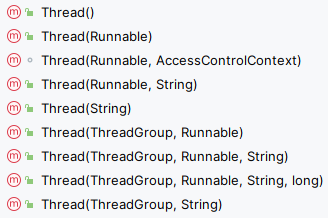

- 状态转化

### 线程的操作方法

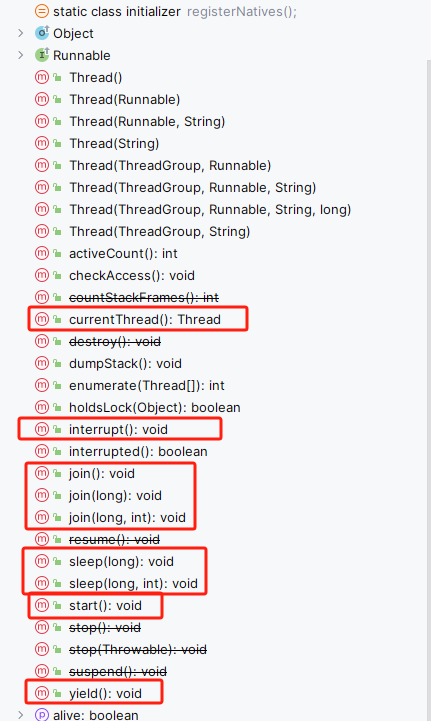

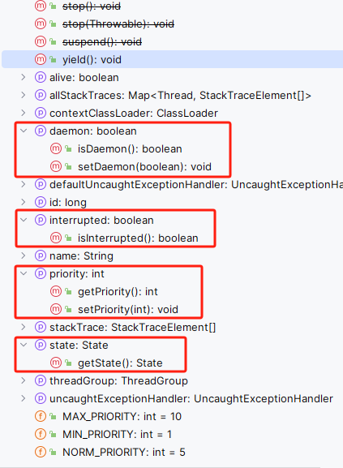

Object 中的方法

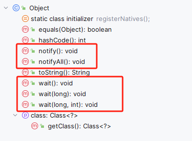

Condition


---

---

### 任务编排-CompletableFuture

- [ ] todo

1.

2.

3. Future 与 FutureTask 出现的背景以及其产生的问题；
   1. get 方法是一个阻塞方法，不符合我们异步的业务需求；
   2. 虽然可以配合线程池的方式来异步执行多个任务，但是
4. CompletableFuture 出现的背景；
   1. 零元依赖
   2. 一元依赖；
   3. 二元依赖；
   4. 多元依赖；
5. 基本原理；
6. 最佳实践；
7. 如何学些此部分内容；
   1.

以 pdf 中的为例；

构造一个 CompletableFuture 对象，runAsync 没有返回值；supplyAsync 有返回值；

- `static CompletableFuture<Void> runAsync(Runnable runnable)`：异步执行指定的`Runnable`任务。
- `static CompletableFuture<Void> runAsync(Runnable runnable, Executor executor)`：在指定的`Executor`上异步执行`Runnable`任务。
- `static <U> CompletableFuture<U> supplyAsync(Supplier<U> supplier)`：异步执行指定的`Supplier`任务，并返回`CompletableFuture`对象，该对象在计算完成时将提供结果。
- `static <U> CompletableFuture<U> supplyAsync(Supplier<U> supplier, Executor executor)`：在指定的`Executor`上异步执行`Supplier`任务，并返回一个`CompletableFuture`对象，该对象在计算完成时将提供结果。

thenApply 方法：当一个线程依赖另一个线程时，获取上一个任务返回的结果，并返回当前 任务的返回值。
thenAccept 方法：消费处理结果。接收任务的处理结果，并消费处理，无返回结果。
thenRun 方法：只要上面的任务执行完成，就开始执行 thenRun，只是处理完任务后，执行 thenRun 的后续操作

- `CompletableFuture<T> thenApply(Function<? super T,? extends U> fn)`：当此 `CompletableFuture` 完成时，使用此 `CompletableFuture` 的结果作为参数应用给定的函数。
- `CompletableFuture<T> thenApplyAsync(Function<? super T,? extends U> fn)`：当此 `CompletableFuture` 完成时，异步地应用给定的函数。
- `CompletableFuture<T> thenApplyAsync(Function<? super T,? extends U> fn, Executor executor)`：当此 CompletableFuture 完成时，使用指定的 Executor 异步地应用给定的函数。

- `CompletableFuture<Void> thenAccept(Consumer<? super T> action)`：当此 `CompletableFuture` 完成时，对其结果执行给定的操作。
- `CompletableFuture<Void> thenAcceptAsync(Consumer<? super T> action)`：当此 `CompletableFuture` 完成时，异步地对其结果执行给定的操作。
- `CompletableFuture<Void> thenAcceptAsync(Consumer<? super T> action, Executor executor)`：当此 `CompletableFuture` 完成时，使用指定的 Executor 异步地对其结果执行给定的操作。
- `CompletableFuture<Void> thenRun(Runnable action)`：当此 `CompletableFuture` 完成时，执行给定的操作。
- `CompletableFuture<Void> thenRunAsync(Runnable action)`：当此 `CompletableFuture` 完成时，异步地执行给定的操作。
- `CompletableFuture<Void> thenRunAsync(Runnable action, Executor executor)`：当此 `CompletableFuture` 完成时，使用指定的 `Executor` 异步地执行给定的操作。

不可改变返回值

- `CompletableFuture<T> **whenComplete**(BiConsumer<? super T,? super Throwable> action)`：当此 `CompletableFuture` 完成时，对结果或异常执行给定的操作。
- `CompletableFuture<T> **whenCompleteAsync**(BiConsumer<? super T,? super Throwable> action)`：当此 `CompletableFuture` 完成时，异步地对结果或异常执行给定的操作。
- `CompletableFuture<T> **whenCompleteAsync**(BiConsumer<? super T,? super Throwable> action, Executor executor)`：当此 `CompletableFuture` 完成时，使用指定的 `Executor` 异步地对结果或异常执行给定的操作。

可以改变返回值

- `CompletableFuture<U> handle(BiFunction<? super T,Throwable,? extends U> fn)`：当此 `CompletableFuture` 完成时，执行给定的函数。
- `CompletableFuture<U> handleAsync(BiFunction<? super T,Throwable,? extends U> fn)`：当此 `CompletableFuture` 完成时，异步地执行给定的函数。
- `CompletableFuture<U> handleAsync(BiFunction<? super T,Throwable,? extends U> fn, Executor executor)`：当此 `CompletableFuture` 完成时，使用指定的 Executor 异步地执行给定的函数。
- `CompletableFuture<T> **exceptionally**(Function<Throwable,? extends T> fn)`：当 `CompletableFuture` 遇到异常时，执行给定的函数。

thenCompose：TODO
thenCombine：组合两个 future，获取两个 future 的返回结果，并返回当前任务的返回值
thenAcceptBoth：组合两个 future，获取两个 future 任务的返回结果，然后处理任务，没有返回值。
runAfterBoth：组合两个 future，不需要获取 future 的结果，只需两个 future 处理完任务后，处理该任务。

- `CompletableFuture<T> thenCompose(Function<? super T,? extends CompletionStage<U>> fn)`：当此 `CompletableFuture` 完成时，使用此 `CompletableFuture` 的结果作为参数应用给定的函数，并返回一个新的 `CompletableFuture`。
- `CompletableFuture<T> thenComposeAsync(Function<? super T,? extends CompletionStage<U>> fn)`：当此 `CompletableFuture` 完成时，异步地应用给定的函数。
- `CompletableFuture<T> thenComposeAsync(Function<? super T,? extends CompletionStage<U>> fn, Executor executor)`：当此 `CompletableFuture` 完成时，使用指定的 `Executor` 异步地应用给定的函数。
- `CompletableFuture<Void> thenCombine(CompletionStage<? extends U> other, BiConsumer<? super T,? super U> action)`：当此 `CompletableFuture` 和另一个 `CompletableFuture` 完成时，执行给定的操作。
- `CompletableFuture<Void> thenCombineAsync(CompletionStage<? extends U> other, BiConsumer<? super T,? super U> action)`：当此 `CompletableFuture` 和另一个 `CompletableFuture` 完成时，异步地执行给定的操作。
- `CompletableFuture<Void> thenCombineAsync(CompletionStage<? extends U> other, BiConsumer<? super T,? super U> action, Executor executor)`：当此 CompletableFuture 和另一个 `CompletableFuture` 完成时，使用指定的 `Executor` 异步地执行给定的操作。
- `CompletableFuture<Void> thenAcceptBoth(CompletionStage<? extends U> other, BiConsumer<? super T,? super U> action)`：当此 `CompletableFuture` 和另一个 `CompletableFuture` 都完成时，执行给定的操作。
- `CompletableFuture<Void> thenAcceptBothAsync(CompletionStage<? extends U> other, BiConsumer<? super T,? super U> action)`：当此 `CompletableFuture` 和另一个 `CompletableFuture` 都完成时，异步地执行给定的操作。
- `CompletableFuture<Void> thenAcceptBothAsync(CompletionStage<? extends U> other, BiConsumer<? super T,? super U> action, Executor executor)`：当此 `CompletableFuture` 和另一个 `CompletableFuture` 都完成时，使用指定的 `Executor` 异步地执行给定的操作。
- `CompletableFuture<Void> runAfterBoth(CompletionStage<?> other, Runnable action)`：当此 `CompletableFuture` 和另一个 `CompletableFuture` 都完成时，执行给定的操作。
- `CompletableFuture<Void> runAfterBothAsync(CompletionStage<?> other, Runnable action)`：当此 `CompletableFuture` 和另一个 `CompletableFuture` 都完成时，异步地执行给定的操作。
- `CompletableFuture<Void> runAfterBothAsync(CompletionStage<?> other, Runnable action, Executor executor)`：当此 `CompletableFuture` 和另一个 `CompletableFuture` 都完成时，使用指定的 `Executor` 异步地执行给定的操作。

acceptEither：两个任务有一个执行完成，获取它的返回值，处理任务，没有新的返回值。
applyToEither：两个任务有一个执行完成，获取它的返回值，处理任务并有新的返回值。  
runAfterEither：两个任务有一个执行完成，不需要获取 future 的结果，处理任务，也没有返回值。

- `CompletableFuture<Void> acceptEither(CompletionStage<? extends T> other, Consumer<? super T> action)`：当此 `CompletableFuture` 或另一个 `CompletableFuture` 完成时，执行给定的操作。
- `CompletableFuture<Void> acceptEitherAsync(CompletionStage<? extends T> other, Consumer<? super T> action)`：当此 `CompletableFuture` 或另一个 `CompletableFuture` 完成时，异步地执行给定的操作。
- `CompletableFuture<Void> acceptEitherAsync(CompletionStage<? extends T> other, Consumer<? super T> action, Executor executor)`：当此 `CompletableFuture` 或另一个 `CompletableFuture` 完成时，使用指定的 `Executor` 异步地执行给定的操作。
- `CompletableFuture<U> applyToEither(CompletionStage<? extends T> other, Function<? super T,U> fn)`：当此 `CompletableFuture` 或另一个 `CompletableFuture` 完成时，执行给定的函数。
- `CompletableFuture<U> applyToEitherAsync(CompletionStage<? extends T> other, Function<? super T,U> fn)`：当此 `CompletableFuture` 或另一个 `CompletableFuture` 完成时，异步地执行给定的函数。
- `CompletableFuture<U> applyToEitherAsync(CompletionStage<? extends T> other, Function<? super T,U> fn, Executor executor)`：当此 `CompletableFuture` 或另一个 `CompletableFuture` 完成时，使用指定的 `Executor` 异步地执行给定的函数。
- `CompletableFuture<Void> runAfterEither(CompletionStage<?> other, Runnable action)`：当此 `CompletableFuture` 或另一个 `CompletableFuture` 完成时，执行给定的操作。
- `CompletableFuture<Void> runAfterEitherAsync(CompletionStage<?> other, Runnable action)`：当此 `CompletableFuture` 或另一个 `CompletableFuture` 完成时，异步地执行给定的操作。
- `CompletableFuture<Void> runAfterEitherAsync(CompletionStage<?> other, Runnable action, Executor executor)`：当此 `CompletableFuture` 或另一个 `CompletableFuture` 完成时，使用指定的 `Executor` 异步地执行给定的操作。

allOf：等待所有任务完成
anyOf：只要有一个任务完成

- `static CompletableFuture<Void> allOf(CompletableFuture<?>... cfs)`：返回一个新的 `CompletableFuture`，当所有传入的 `CompletableFuture` 都完成时，它也会完成。
- `static CompletableFuture<Object> anyOf(CompletableFuture<?>... cfs)`：返回一个新的 `CompletableFuture`，当任意一个传入的 `CompletableFuture` 完成时，它也会完成，并返回完成的 `CompletableFuture` 的结果。

---

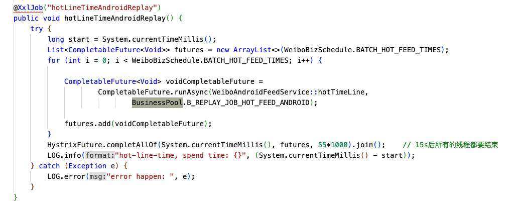
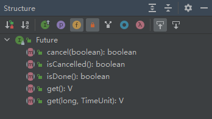
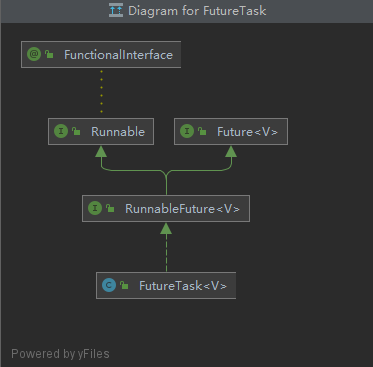
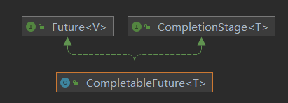
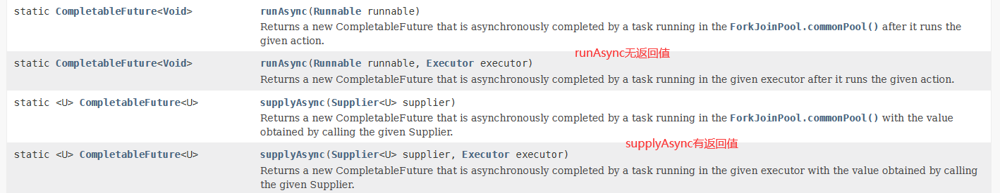
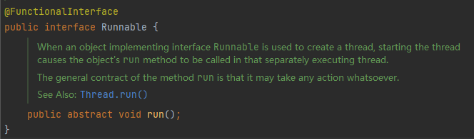
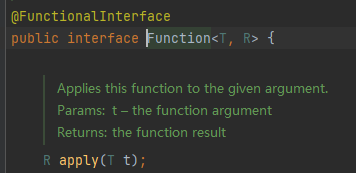
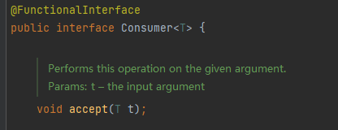
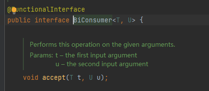
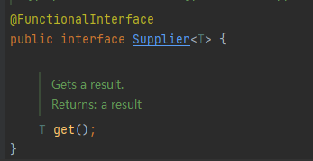
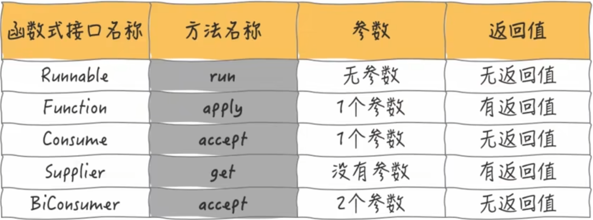
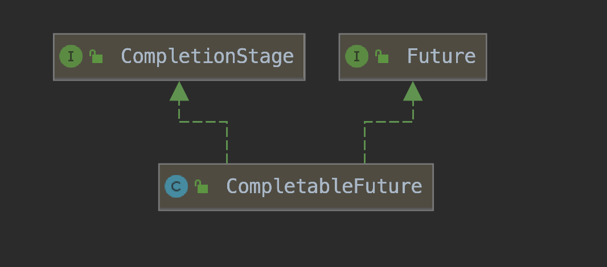

---

待整理： 基于线程池批量抄表

## 场景描述

抄表过程包括获取楼栋信息，之后根据楼层信息获取当前楼栋信息的设备信息，之后拿到设备的请求链路信息，最后组装命令信息到消息队列中。这个过程可能是一个请求，但是涉及到很多个设备，每一个设备信息都需要进行抄表命令的组装。如果采用循环的方式，那么这个过程的耗时就很长，因此需要优化，采用线程池的方式。

实现思路： 先根据楼栋获取当前楼栋的所有设备信息，然后把设备信息放入阻塞队列中，然后使用线程池依次执行阻塞队列中的设备信息。

> 可以把 weibo 爬虫中的任务执行，放到这个案例中。

func getshebeiList(louceng) {
// 查询楼层与设备信息表，获取当前楼层的所有设备信息
}

线程池实现原理
批量构建消息体后放入阻塞队列中，由线程池进行处理


```
/**
 * 首页热门信息流 20s
 */
@XxlJob("hotLineTimeReplay")
public void hotLineTimeReplay() {
    try {
        long start = System.currentTimeMillis();
        List<CompletableFuture<Void>> futures = new ArrayList<>(WeiboBizSchedule.BATCH_HOT_FEED_TIMES);
        for (int i = 0; i < WeiboBizSchedule.BATCH_HOT_FEED_TIMES; i++) {

            CompletableFuture<Void> voidCompletableFuture =
                    CompletableFuture.runAsync(weiboIosFeedService::hotTimeLine,
                            BusinessPool.B_REPLAY_JOB_HOT_FEED);

            futures.add(voidCompletableFuture);
        }
        HystrixFuture.completAllOf(System.currentTimeMillis(), futures, 55*1000).join();    // 15s后所有的线程都要结束
        LOG.info("hot-line-time, spend time: {}", (System.currentTimeMillis() - start));
    } catch (Exception e) {
        LOG.error("error happen: ", e);
    }
}

```

```
public static final ExecutorService B_REPLAY_JOB_HOT_FEED_ANDROID = new ThreadPoolExecutor(
        BASE_THREAD_NUMS,
        Math.max(BASE_THREAD_NUMS, 200),
        5,
        TimeUnit.MINUTES,
        new LinkedBlockingQueue(1000),
        new DefaultThreadFactory("weibo-replay-hotfeed"),
        new ThreadPoolExecutor.CallerRunsPolicy()
);

```

```
public class HystrixFuture<T> {
    private static final Logger LOG = LogbackRollingFileUtil.getLogger("hystrixFuture");

    public static CompletableFuture<Void> completAllOf(
            long sequence, List<CompletableFuture<Void>> futureList, long timeout) {

               return CompletableFuture.runAsync(
                        () -> {
                            try {
                                Thread.sleep(timeout);
                            } catch (Exception e) {
                            }

                            futureList.forEach(future -> {
                                if (future.isDone() || future.isCancelled()) {
                                    return;
                                }
                                future.cancel(true);
                                LOG.error(sequence + " kill one thread ,cause timeout");
                            });

                        });
    }
}

```

[SpringBoot 与 RabbitMQ 详解与整合](https://ost.51cto.com/posts/15542)

[后端思维篇：手把手教你写一个并行调用模板](https://mp.weixin.qq.com/s?__biz=Mzg3NzU5NTIwNg==&mid=2247499504&idx=1&sn=bb62226e6cffeb1859efb0100c796050&chksm=cf2221d9f855a8cf23f75cb51c1a407578fb0f279e96ddae74b5b8c84f2f5dc71762425b17cb&token=1305910004&lang=zh_CN#rd)
[异步编程利器：CompletableFuture 详解](https://mp.weixin.qq.com/s?__biz=Mzg3NzU5NTIwNg==&mid=2247490456&idx=1&sn=95836324db57673a4d7aea4fb233c0d2&chksm=cf21c4b1f8564da72dc7b39279362bcf965b1374540f3b339413d138599f7de59a5f977e3b0e&token=1260947715&lang=zh_CN&scene=21#wechat_redirect)
