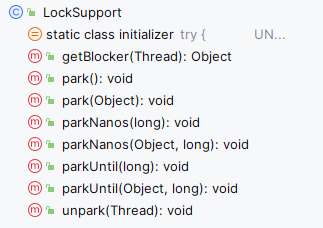

# 6. LockSupport 类及其相关实现

- 为什么 LockSupport 也是核心基础类? AQS 框架借助于两个类：Unsafe(提供 CAS 操作)和 LockSupport(提供 park/unpark 操作)
- 写出分别通过 wait/notify 和 LockSupport 的 park/unpark 实现同步?
- LockSupport.park()会释放锁资源吗? 那么 Condition.await()呢?
- Thread.sleep()、Object.wait()、Condition.await()、LockSupport.park()的区别? 重点
- 如果在 wait()之前执行了 notify()会怎样?
- 如果在 park()之前执行了 unpark()会怎样

---

著作权归@pdai 所有 原文链接：https://pdai.tech/md/java/thread/java-thread-x-lock-LockSupport.html

