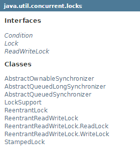
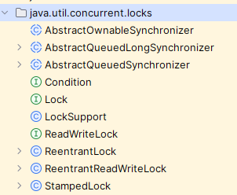
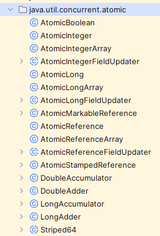
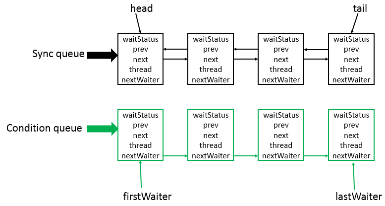
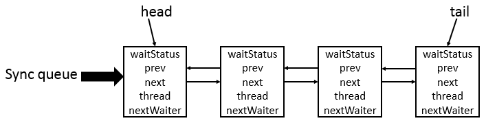
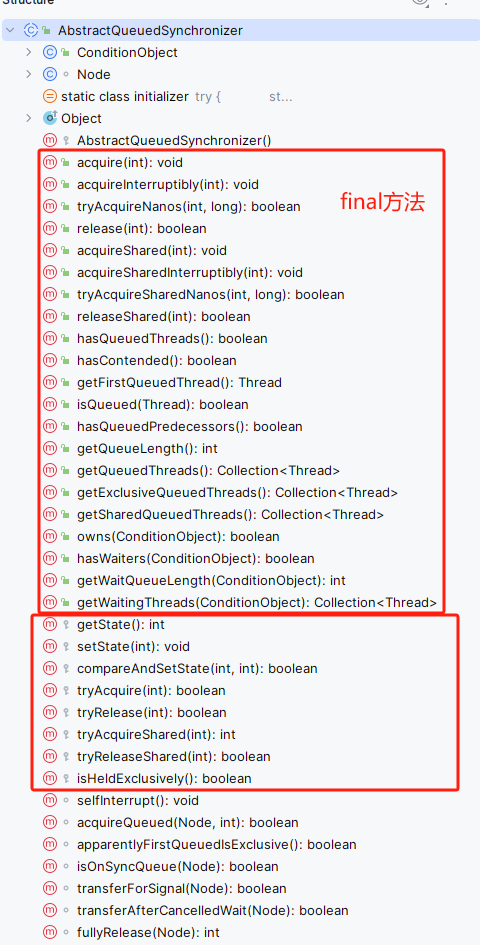
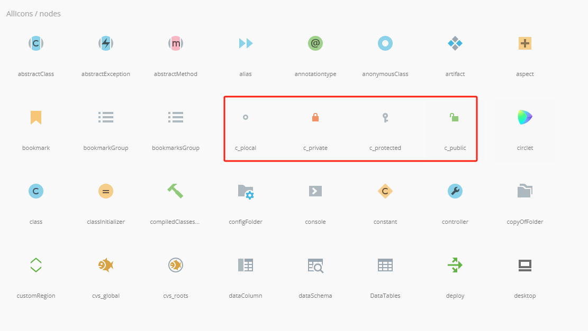

# 7. AQS


> 模板方法概述
> - 场景： 在一些业务场景的实现过程中，可能需要很多个步骤，但是针对某些特定的场景时，部分子步骤并不相同，除此意外，其他剩余步骤都相同，这样的业务场景中，我们就可以使用模板方法的设计模式。
> - 实现思路：
>    - 提供一个抽象类，这个抽象类中包含完成整个业务需求的所有步骤，并且实现了通用的业务步骤，不通用的业务步骤只有声明没有头实现；
>    - 子类继承抽象类，然后实现独属于自己的业务步骤；
>    - 在客户端只需要调用抽象类的公共步骤即可完成业务需求；
>    - 扩展时也只需要继承抽象类，实现独属于自己的业务步骤即可；


1. 我们知道线程的本质实际上就是**一组代码片段**和**一些变量**的组合。而 Java 中实现线程事实上是通过 JNI 技术调用底层操作系统指令完成的，因此在多线程的应用场景中，**早期版本的 Java 并不是很易用**，甚至可以说“**早期 Java 中使用线程的过程是复杂的**”。
2. Java1.5 提供了** AQS **和**一系列基于 AQS 的扩展实现**一举解决了“**早期 Java 中使用线程的过程是复杂的**”——这一个重大问题。
3. AQS 指的是： java.util.concurrent.locks.AbstractQueuedSynchronizer 类。很多资料中说 AQS 是一个用来构造锁和同步器的框架，这是不严谨的，事实上 AQS 是 JDK 基于“模板方法”设计模式实现的一个“抽象类”。实际的业务场景中，我们并不会直接使用这个类，大多数情况下，我们**使用的都是基于它的扩展实现**，这些扩展实现包括**： ReentrantReadWriteLock、SynchronousQueue、FutureTask、Semaphore、CountDownLatch、 CyclicBarrier、ReadWriteLock** 等。
4. 但是我们要先了解 AQS 的实现思想和实现原理，只有这样，才能更好的理解基于它的扩展实现。
5. 首先来说，AQS 解决了什么问题。AQS 解决了：Java 早期版本中，在实现多线程访问共享资源的业务场景中，实现过程过于复杂的问题。作用： 让原本杂乱无章的多线程迅速完成排队过程，从而实现同步访问共享变量的过程。
6. AQS 解决上面这个问题的主要思路就是：设计一个 AQS 抽象类并基于这个抽象类扩展出一些不同的实现，这样一来，Java 程序员就可以通过使用基于 AQS 的扩展实现，就让“多线程访问共享资源”的业务场景变得很简单易用。
7. AQS 的核心思想：
   1. 使用一个 volatile int state 变量来标识同步状态；
   2. 使用 CLH(Craig,Landin,and Hagersten)队列 来保存未获得访问共享资源权限的阻塞线程；
   3. 如果被请求的共享资源空闲，则将当前请求资源的线程设置为有效的工作线程，并且将共享资源设置为锁定状态。如果被请求的共享资源被占用，那么就需要一套线程阻塞等待以及被唤醒时锁分配的机制，这个机制AQS是用CLH队列锁实现的，即将暂时获取不到锁的线程加入到队列中。
8. AQS 提供了几个重要方法：
   1. 

9. 然后基于这些方法，我们可以做什么？
   1. 公平锁
   2. 非公平锁
10. 再之后就是： JDK 帮我们实现的同步器：


JUC 包










### AQS

1. 模板方法设计模式
2. AQS 中的 state 和 CLH
3. ReentrantLock 的分析
4. 使用示例


[模板方法模式](https://www.yuque.com/zeanzai.me/nox53r/aatc8bi275r2a3z8)中可以得知，我们期望也设计出一个类似于 drink() 的方法。但实际上 AQS 并没有使用这种方式，而是把 AQS 设计成抽象类，然后只提供一些维护 state 和 CLH 队列的方法，并把几个重要的方法设置成 procted 的访问形式，这样一来，AQS 的扩展类就可以通过重写这些方法来操作 state 和 CLH 队列， 从而实现满足不同需求的扩展实现，如公平锁、非公平锁、读写锁、信号量、CountDownLatch 等。


```c
Provides a framework for implementing blocking locks and related synchronizers (semaphores, events, etc) that rely on first-in-first-out (FIFO) wait queues. This class is designed to be a useful basis for most kinds of synchronizers that rely on a single atomic int value to represent state. Subclasses must define the protected methods that change this state, and which define what that state means in terms of this object being acquired or released. Given these, the other methods in this class carry out all queuing and blocking mechanics. Subclasses can maintain other state fields, but only the atomically updated int value manipulated using methods getState(), setState(int) and compareAndSetState(int, int) is tracked with respect to synchronization.
提供一个框架，用于实现依赖先进先出（FIFO）等待队列的阻塞锁和相关同步器（信号量、事件等）。此类被设计为大多数类型的同步器的有用基础，这些同步器依赖于单个原子int值来表示状态。子类必须定义更改该状态的受保护方法，以及定义该状态在获取或释放该对象方面的含义。给定这些，类中的其他方法执行所有排队和阻塞机制。子类可以维护其他状态字段，但只有使用方法getState（）、setState（int）和compareAndSetState（int，int）操作的原子更新的int值才会相对于同步进行跟踪。

Subclasses should be defined as non-public internal helper classes that are used to implement the synchronization properties of their enclosing class. Class AbstractQueuedSynchronizer does not implement any synchronization interface. Instead it defines methods such as acquireInterruptibly(int) that can be invoked as appropriate by concrete locks and related synchronizers to implement their public methods.
子类应定义为非公共内部帮助类，用于实现其封闭类的同步属性。类AbstractQueuedSynchronizer不实现任何同步接口。相反，它定义了诸如AcquisibleInterruptible（int）之类的方法，具体锁和相关同步器可以适当地调用这些方法来实现它们的公共方法。

This class supports either or both a default exclusive mode and a shared mode. When acquired in exclusive mode, attempted acquires by other threads cannot succeed. Shared mode acquires by multiple threads may (but need not) succeed. This class does not "understand" these differences except in the mechanical sense that when a shared mode acquire succeeds, the next waiting thread (if one exists) must also determine whether it can acquire as well. Threads waiting in the different modes share the same FIFO queue. Usually, implementation subclasses support only one of these modes, but both can come into play for example in a ReadWriteLock. Subclasses that support only exclusive or only shared modes need not define the methods supporting the unused mode.
此类支持默认的独占模式和共享模式之一或两者。在独占模式下获取时，其他线程尝试的获取无法成功。多个线程获取共享模式可能（但不一定）成功。这个类不“理解”这些差异，除了在机械意义上，当共享模式获取成功时，下一个等待线程（如果存在）也必须确定它是否也可以获取。在不同模式中等待的线程共享相同的FIFO队列。通常，实现子类只支持其中一种模式，但两者都可以发挥作用，例如在ReadWriteLock中。仅支持独占模式或仅支持共享模式的子类不需要定义支持未使用模式的方法。

This class defines a nested AbstractQueuedSynchronizer.ConditionObject class that can be used as a Condition implementation by subclasses supporting exclusive mode for which method isHeldExclusively() reports whether synchronization is exclusively held with respect to the current thread, method release(int) invoked with the current getState() value fully releases this object, and acquire(int), given this saved state value, eventually restores this object to its previous acquired state. No AbstractQueuedSynchronizer method otherwise creates such a condition, so if this constraint cannot be met, do not use it. The behavior of AbstractQueuedSynchronizer.ConditionObject depends of course on the semantics of its synchronizer implementation.
这个类定义了一个嵌套的AbstractQueuedSynchronizer。ConditionObject类，可由支持独占模式的子类用作Condition实现，方法isHeldExclusively（）报告同步是否相对于当前线程独占，用当前getState（）值调用的方法release（int）完全释放此对象，并在给定此保存的状态值的情况下获取（int），最终将该对象恢复到其先前获取的状态。没有AbstractQueuedSynchronizer方法会创建这样的条件，所以如果不能满足这个约束，就不要使用它。ConditionObject当然取决于其同步器实现的语义。

This class provides inspection, instrumentation, and monitoring methods for the internal queue, as well as similar methods for condition objects. These can be exported as desired into classes using an AbstractQueuedSynchronizer for their synchronization mechanics.
此类提供内部队列的检查、检测和监视方法，以及条件对象的类似方法。可以根据需要使用AbstractQueuedSynchronizer将它们导出到类中，以实现它们的同步机制。

Serialization of this class stores only the underlying atomic integer maintaining state, so deserialized objects have empty thread queues. Typical subclasses requiring serializability will define a readObject method that restores this to a known initial state upon deserialization.
此类的序列化只存储底层的原子整数维护状态，因此反序列化的对象具有空线程队列。需要可序列化性的典型子类将定义一个readObject方法，该方法在反序列化时将其恢复到已知的初始状态。

```


### AQS 内部类



 AbstractQueuedSynchronizer类底层的数据结构是使用CLH(Craig,Landin,and Hagersten)队列是一个虚拟的双向队列(虚拟的双向队列即不存在队列实例，仅存在结点之间的关联关系)。AQS是将每条请求共享资源的线程封装成一个CLH锁队列的一个结点(Node)来实现锁的分配。其中Sync queue，即同步队列，是双向链表，包括head结点和tail结点，head结点主要用作后续的调度。而Condition queue不是必须的，其是一个单向链表，只有当使用Condition时，才会存在此单向链表。并且可能会有多个Condition queue。

#### Node

```c
static final class Node {
    static final Node SHARED = new Node();
    static final Node EXCLUSIVE = null;
    static final int CANCELLED =  1;
    static final int SIGNAL    = -1;
    static final int CONDITION = -2;
    static final int PROPAGATE = -3;

    volatile int waitStatus;    
    volatile Node prev;    
    volatile Node next;    
    volatile Thread thread;    
    Node nextWaiter;    
    
    final boolean isShared() {
        return nextWaiter == SHARED;
    }
    
    final Node predecessor() throws NullPointerException {
        Node p = prev;
        if (p == null)
            throw new NullPointerException();
        else
            return p;
    }

    Node() {    // Used to establish initial head or SHARED marker
    }

    Node(Thread thread, Node mode) {     // Used by addWaiter
        this.nextWaiter = mode;
        this.thread = thread;
    }

    Node(Thread thread, int waitStatus) { // Used by Condition
        this.waitStatus = waitStatus;
        this.thread = thread;
    }
}

```


需要注意的是：

1. 这个内部类是一个虚拟双向链表（虚拟是指不存在实际的链表的对象实例，只存在链表节点之间的关系）；
2. 在 AQS 中并没有对这个虚拟链表的初始化方法，它的初始化过程延迟到
3. 主要用来构造同步队列，是双向链表，包括head结点和tail结点，head结点主要用作后续的调度

#### ConditionObject

```c
public class ConditionObject implements Condition, java.io.Serializable {
    private static final long serialVersionUID = 1173984872572414699L;
    private transient Node firstWaiter;
    private transient Node lastWaiter;

    public ConditionObject() { }

    private Node addConditionWaiter() {
        Node t = lastWaiter;
        // If lastWaiter is cancelled, clean out.
        if (t != null && t.waitStatus != Node.CONDITION) {
            unlinkCancelledWaiters();
            t = lastWaiter;
        }
        Node node = new Node(Thread.currentThread(), Node.CONDITION);
        if (t == null)
            firstWaiter = node;
        else
            t.nextWaiter = node;
        lastWaiter = node;
        return node;
    }

    private void doSignal(Node first) {
        do {
            if ( (firstWaiter = first.nextWaiter) == null)
                lastWaiter = null;
            first.nextWaiter = null;
        } while (!transferForSignal(first) &&
                 (first = firstWaiter) != null);
    }

    private void doSignalAll(Node first) {
        lastWaiter = firstWaiter = null;
        do {
            Node next = first.nextWaiter;
            first.nextWaiter = null;
            transferForSignal(first);
            first = next;
        } while (first != null);
    }

    private void unlinkCancelledWaiters() {
        Node t = firstWaiter;
        Node trail = null;
        while (t != null) {
            Node next = t.nextWaiter;
            if (t.waitStatus != Node.CONDITION) {
                t.nextWaiter = null;
                if (trail == null)
                    firstWaiter = next;
                else
                    trail.nextWaiter = next;
                if (next == null)
                    lastWaiter = trail;
            }
            else
                trail = t;
            t = next;
        }
    }

    public final void signal() {
        if (!isHeldExclusively())
            throw new IllegalMonitorStateException();
        Node first = firstWaiter;
        if (first != null)
            doSignal(first);
    }


    public final void signalAll() {
        if (!isHeldExclusively())
            throw new IllegalMonitorStateException();
        Node first = firstWaiter;
        if (first != null)
            doSignalAll(first);
    }

    public final void awaitUninterruptibly() {
        Node node = addConditionWaiter();
        int savedState = fullyRelease(node);
        boolean interrupted = false;
        while (!isOnSyncQueue(node)) {
            LockSupport.park(this);
            if (Thread.interrupted())
                interrupted = true;
        }
        if (acquireQueued(node, savedState) || interrupted)
            selfInterrupt();
    }

    private static final int REINTERRUPT =  1;
    private static final int THROW_IE    = -1;

    private int checkInterruptWhileWaiting(Node node) {
        return Thread.interrupted() ?
            (transferAfterCancelledWait(node) ? THROW_IE : REINTERRUPT) :
            0;
    }

    private void reportInterruptAfterWait(int interruptMode)
        throws InterruptedException {
        if (interruptMode == THROW_IE)
            throw new InterruptedException();
        else if (interruptMode == REINTERRUPT)
            selfInterrupt();
    }


    public final void await() throws InterruptedException {
        if (Thread.interrupted())
            throw new InterruptedException();
        Node node = addConditionWaiter();
        int savedState = fullyRelease(node);
        int interruptMode = 0;
        while (!isOnSyncQueue(node)) {
            LockSupport.park(this);
            if ((interruptMode = checkInterruptWhileWaiting(node)) != 0)
                break;
        }
        if (acquireQueued(node, savedState) && interruptMode != THROW_IE)
            interruptMode = REINTERRUPT;
        if (node.nextWaiter != null) // clean up if cancelled
            unlinkCancelledWaiters();
        if (interruptMode != 0)
            reportInterruptAfterWait(interruptMode);
    }

    public final long awaitNanos(long nanosTimeout)
            throws InterruptedException {
        if (Thread.interrupted())
            throw new InterruptedException();
        Node node = addConditionWaiter();
        int savedState = fullyRelease(node);
        final long deadline = System.nanoTime() + nanosTimeout;
        int interruptMode = 0;
        while (!isOnSyncQueue(node)) {
            if (nanosTimeout <= 0L) {
                transferAfterCancelledWait(node);
                break;
            }
            if (nanosTimeout >= spinForTimeoutThreshold)
                LockSupport.parkNanos(this, nanosTimeout);
            if ((interruptMode = checkInterruptWhileWaiting(node)) != 0)
                break;
            nanosTimeout = deadline - System.nanoTime();
        }
        if (acquireQueued(node, savedState) && interruptMode != THROW_IE)
            interruptMode = REINTERRUPT;
        if (node.nextWaiter != null)
            unlinkCancelledWaiters();
        if (interruptMode != 0)
            reportInterruptAfterWait(interruptMode);
        return deadline - System.nanoTime();
    }


    public final boolean awaitUntil(Date deadline)
            throws InterruptedException {
        long abstime = deadline.getTime();
        if (Thread.interrupted())
            throw new InterruptedException();
        Node node = addConditionWaiter();
        int savedState = fullyRelease(node);
        boolean timedout = false;
        int interruptMode = 0;
        while (!isOnSyncQueue(node)) {
            if (System.currentTimeMillis() > abstime) {
                timedout = transferAfterCancelledWait(node);
                break;
            }
            LockSupport.parkUntil(this, abstime);
            if ((interruptMode = checkInterruptWhileWaiting(node)) != 0)
                break;
        }
        if (acquireQueued(node, savedState) && interruptMode != THROW_IE)
            interruptMode = REINTERRUPT;
        if (node.nextWaiter != null)
            unlinkCancelledWaiters();
        if (interruptMode != 0)
            reportInterruptAfterWait(interruptMode);
        return !timedout;
    }


    public final boolean await(long time, TimeUnit unit)
            throws InterruptedException {
        long nanosTimeout = unit.toNanos(time);
        if (Thread.interrupted())
            throw new InterruptedException();
        Node node = addConditionWaiter();
        int savedState = fullyRelease(node);
        final long deadline = System.nanoTime() + nanosTimeout;
        boolean timedout = false;
        int interruptMode = 0;
        while (!isOnSyncQueue(node)) {
            if (nanosTimeout <= 0L) {
                timedout = transferAfterCancelledWait(node);
                break;
            }
            if (nanosTimeout >= spinForTimeoutThreshold)
                LockSupport.parkNanos(this, nanosTimeout);
            if ((interruptMode = checkInterruptWhileWaiting(node)) != 0)
                break;
            nanosTimeout = deadline - System.nanoTime();
        }
        if (acquireQueued(node, savedState) && interruptMode != THROW_IE)
            interruptMode = REINTERRUPT;
        if (node.nextWaiter != null)
            unlinkCancelledWaiters();
        if (interruptMode != 0)
            reportInterruptAfterWait(interruptMode);
        return !timedout;
    }

    final boolean isOwnedBy(AbstractQueuedSynchronizer sync) {
        return sync == AbstractQueuedSynchronizer.this;
    }


    protected final boolean hasWaiters() {
        if (!isHeldExclusively())
            throw new IllegalMonitorStateException();
        for (Node w = firstWaiter; w != null; w = w.nextWaiter) {
            if (w.waitStatus == Node.CONDITION)
                return true;
        }
        return false;
    }

    protected final int getWaitQueueLength() {
        if (!isHeldExclusively())
            throw new IllegalMonitorStateException();
        int n = 0;
        for (Node w = firstWaiter; w != null; w = w.nextWaiter) {
            if (w.waitStatus == Node.CONDITION)
                ++n;
        }
        return n;
    }


    protected final Collection<Thread> getWaitingThreads() {
        if (!isHeldExclusively())
            throw new IllegalMonitorStateException();
        ArrayList<Thread> list = new ArrayList<Thread>();
        for (Node w = firstWaiter; w != null; w = w.nextWaiter) {
            if (w.waitStatus == Node.CONDITION) {
                Thread t = w.thread;
                if (t != null)
                    list.add(t);
            }
        }
        return list;
    }
}

```


### AQS 初始化

- 利用初始化机制搞定属性的设置

```c
...
private static final Unsafe unsafe = Unsafe.getUnsafe();
private static final long stateOffset;
private static final long headOffset;
private static final long tailOffset;
private static final long waitStatusOffset;
private static final long nextOffset;

static {
    try {
        stateOffset = unsafe.objectFieldOffset
            (AbstractQueuedSynchronizer.class.getDeclaredField("state"));
        headOffset = unsafe.objectFieldOffset
            (AbstractQueuedSynchronizer.class.getDeclaredField("head"));
        tailOffset = unsafe.objectFieldOffset
            (AbstractQueuedSynchronizer.class.getDeclaredField("tail"));
        waitStatusOffset = unsafe.objectFieldOffset
            (Node.class.getDeclaredField("waitStatus"));
        nextOffset = unsafe.objectFieldOffset
            (Node.class.getDeclaredField("next"));

    } catch (Exception ex) { throw new Error(ex); }
}
...

```


### AQS 的方法

先来看一下 AQS 类的结构：



1. 只提供操作 state 变量和 CLH 队列的基本方法；
2. 根据具体的需求，把对 state 变量和 CLH 队列的部分操作方法延迟到子类中实现；

我们发现 AQS 中有两个内部类：

1. Node： CLH 队列
2. ConditionObject

有大量的 public final 标识的方法； 
也有几个 protected 标识的方法；的方法大概分为两部分：


protected访问控制符

protected访问控制符是专门为继承打造的，protected可见性=default+对子类可见   （对自己的包可见和对其子类可见）
子类覆盖父类的方法，不可以用可见性更小的修饰符，但是可以用更高的修饰符（父类定义为protected，子类可以定义为protected或public）子类覆盖父类方法时，父类的引用指向子类的对象，此时引用是有权限调用子类的方法的，但是此时定义为private就会出错；


修饰符

final用在不同的地方有不同的作用，但是本质都很相似
final修饰类：不可被继承
final修饰方法：不能被子类覆盖
final修饰变量：不可被重新赋值   final修饰成员变量时必须要赋值，在声明或者构造函数里赋值，且只能赋值一次
final不能用来修饰构造方法
若果final定义了一个引用，则引用指向对象是固定了，不能指向其他对象，但是对象里的成员变量值是可以修改的


[idea icons_list](https://jetbrains.design/intellij/resources/icons_list/)




- 什么是AQS? 为什么它是核心?
- AQS的核心思想是什么? 它是怎么实现的? 底层数据结构等
- AQS有哪些核心的方法?
- AQS定义什么样的资源获取方式? AQS定义了两种资源获取方式：独占(只有一个线程能访问执行，又根据是否按队列的顺序分为公平锁和非公平锁，如ReentrantLock) 和共享(多个线程可同时访问执行，如Semaphore、CountDownLatch、 CyclicBarrier )。ReentrantReadWriteLock可以看成是组合式，允许多个线程同时对某一资源进行读。
- AQS底层使用了什么样的设计模式? 模板
- AQS的应用示例?

---

著作权归@pdai所有 原文链接：https://pdai.tech/md/java/thread/java-thread-x-lock-AbstractQueuedSynchronizer.html
[https://www.wolai.com/tvtGpAAntFBaN4xrTrEywQ](https://www.wolai.com/tvtGpAAntFBaN4xrTrEywQ)


1. 问题背景
2. 怎么使用
3. 基本原理
4. 扩展使用


