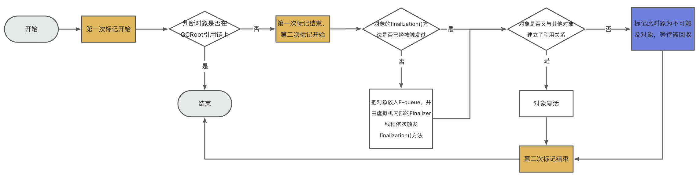
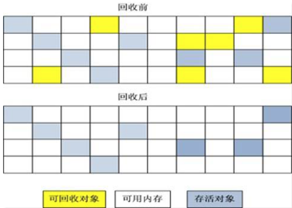
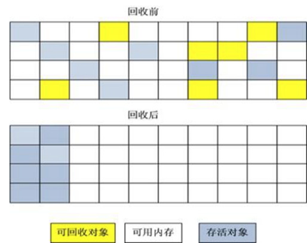
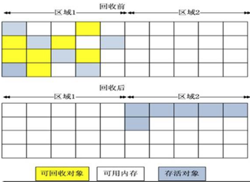

# 7. 垃圾回收理论
### 1. 研究方法
- 1. 明确需要回收的区域在运行期内存结构模型中的位置
   - 堆
- 2. 明确何为垃圾（或垃圾有何特点）
- 3. 明确如何定位垃圾（或如何标记垃圾）
- 3. 明确如何回收垃圾（或垃圾回收算法）
- 4. 明确垃圾回收的时机
- 5. 垃圾回收需要考虑的问题
- 6. GC类型

### 2. 回收区域在运行期内存结构模型中的位置

- 栈管运行、堆管存储
   - 线程私有区域：可以完全交由负责运行的线程来管理，线程运行结束，所占用的内存空间自然就应该被回收
   - 线程共享区域： 生命周期与JVM的生命周期一致，需要额外的收集器进行收集
      - 方法区
         - 永久区/元空间
            - 基本不收集，回收条件苛刻，判断一个类是否可以被回收，需同时满足
               - 该类的所有实例都已经被回收
               - 加载该类的ClassLoader已经被回收
               - 该类对应的java.lang.Class对象没有任何地方引用，无法在任何地方通过反射访问该类的方法
      - Java堆
         - 新生代
            - 频繁收集
         - 老年代
            - 较少收集

### 3. 垃圾对象定位

- 引用计数法
   - 原理
      - 给对象引用次数设置一个变量，每引用一次，就对这个变量+1，使用之后变量-1，变量为0即代表对象没有被引用，可以被回收，此对象属于垃圾对象
   - 缺点
      - 1. 需要额外的空间来存储引用次数，增加了空间的开销
      - 2. 每次删减引用后，都需要操作这块空间，增加了时间的开销
      - 3. 无法处理循环引用的问题
   - 优点
      - 实现简单、回收效率高
- 可达性分析（Hotspot采用的方法）
   - 基本原理
      - 在某一时刻的快照里，以GCRoot作为起始点，向下收集，收集的路径称为引用链，引用链上的所有对象都是存活对象；不在引用链上的对象为不可达对象，不可达对象就是要回收的垃圾对象
         - 可作为GCRoot的对象元素
            - 虚拟机栈所引用的对象
            - 本地方法栈所引用的对象
            - 方法区静态变量引用的对象
            - 方法区常量引用的对象
            - 同步锁持有的对象
            - 虚拟机的内部引用，如常驻的异常对象、class对象、类加载器对象
            - 虚拟机监控对象、本地代码缓存对象、JVMTI中注册的回调等
         - 临时性加入的对象
      - 我们希望有这样一种情况：如果内存空间足够时，就把对象保留到内存中；如果内存空间不够时，就清理掉对象。
         - 对引用分等级，视内存紧张程度来决定是否回收
            - 强引用，StrongReference
               - 只要存在强引用，就不会被回收
            - 软引用，SoftReference
               - 下次GC一定会回收软引用的对象
            - 弱引用，WeakReference
               - 下次GC前，不管空间是否够用，一律回收
            - 虚引用，PhantomReference
               - 虚引用的对象在回收时收到系统的一个通知
            - 终结引用，FinalReference
               - 供Finalizer线程找到被引用对象，并调用其finalization()方法，第二次GC时才能回收被引用对象
   - 详细细节
      - 对象的finalization()方法
         - Java语言提供的一种机制，为了让程序员控制一些类在销毁前做一些自定义操作
         - 特性
            - 可以被子类重写
            - 程序员提供销毁前的自定义处理逻辑，实际调用过程则由JVM完成
            - 垃圾回收器在销毁对象之前，总是会先调用一下对象的finalization()方法
            - 垃圾收集器调用finalization()方法可能会导致对象“复活”，极端情况下垃圾收集器不会掉用finalization()方法
      - 两次标记过程
         - 第一次标记：筛选没有被GCRoot引用的对象
            - 看GCRoot引用链上是否有此对象
         - 第二次标记：触发没有被GCRoot引用的对象的finalization()方法
            - finalization()方法已经被调用过。如果此对象没有重写finalization()方法且finalization()方法已经被虚拟机调用过了，或者此对象重写了finalization()方法，也已经被虚拟机调用过了，则直接标记这个对象为不可触及对象
            - finalization()方法还没有被调用过。链接如果此对象没有被调用过finalization()方法，虚拟机就会创建一个F-queue的队列，并把这个对象放到这个队列里面，之后由一个低优先级的Finalizer线程依次触发队列里面对象的finalization()方法。如果finalization()方法执行完成之后，对象依然没有与引用链上的其他对象建立引用，就标记此对象为不可触及对象，并剔除对列里面与引用链上的某一个对象建立了引用关系的对象
         - 判断一个对象能否被回收
            - 

- 统计出所有需要回收的对象【Jav./ch07-garbagecollection/image/1677241921712.png
   - 枚举根节点 
      - 迄今为止，所有收集器在枚举根节点这一步骤都是必须暂停用户线程的（jvm中在垃圾回收的时候单独开辟一个线程去收集垃圾的，在收集的过程中，用户线程在不断产生新的垃圾，因此需要暂停用户线程），如果根节点过多，那么收集就会耗费很长时间，也就是暂停时间过长，那么势必会影响整个jvm的吞吐量，因此一定会有一个地方存放着；
      - HotSpot的解决方案中，会使用一组称为OopMap的数据结构来达到这个目的，在类加载完成的时候，HotSpot就会把对象内什么偏移量上是什么类型的数据计算出来，在即使编译过程中，也会在特定的位置记录下栈里和寄存器里哪些位置是引用
   - 更新记忆集 
      - 所有涉及到部分区域收集行为的垃圾收集器，都会`面临着非收集区域指向收集区域的跨区域引用的问题`；
      - 额外开辟一块内存区域，然后创建一种数据结构，就记录非收集区域指向收集区域的指针或引用，这种数据结构就叫记忆集；每次垃圾回收时，只需要关注记忆集和根节点就行，免去了每次都要扫描全部区域的麻烦
      - 简单来说，就是对收集区域进行划分，然后进行编号，之后就会形成一个数组，如果此区域包含了跨代引用或跨区域引用的对象，那么这个位置的值就设置为1，这样每次进行回收的时候，碰到为1的位置就不进行回收了，这样形成的数组就是卡表；
      - 卡表由很多中具体的实现方式，可以卡对象的精度，也可以卡内存快的精度，还可以卡字长的精度。所谓卡对象的精度，就是对对象进行编号，存在跨代引用就把这个编号的值置为1，卡字长的精度，就是根据jvm的字长进行编号；
      - 更新记忆集的时候也是会产生并发一致性的问题，即在垃圾回收需要读取记忆集信息的时候，会同时产生新的引用信息；HotSpot是使用写屏障的技术手段来解决这个问题的；
      - 使用AOP的思想，在对象赋值操作时，对卡表进行更新，即在对象赋值操作时建立切面，然后生成更新卡表的代码语句；
   - 三色标记 
      - 收集线程所产生的开销会随着收集区域的扩大而扩大，这会造成jvm吞吐量的下降；
      - 收集线程在进行第二次标记时，用户线程也在重新建立引用或删除引用，即第二次标记时，对象引用关系发生了改变，采用三色标记方式进行解决； 
         - 黑色：第一次标记时，被垃圾回收器访问过，且这个对象的所有引用都被扫描过，那么把这个对象标记为黑色；
         - 灰色：第一次标记时，被垃圾回收器访问过，但是至少有一个引用还没有被扫描到，那么就把这个对象标记为灰色；
         - 白色：第一次标记时，没有被垃圾回收器访问过，那么就把这个对象标记为白色；
      - 第二次标记完成后，所有的灰色对象要么变成白色、要么变成灰色，之后垃圾回收器只需要回收白色对象，下次垃圾回收会再次忽略黑色对象，直接从白色对象进行第二次标记；

### 4. 垃圾回收算法

#### 4.1. 垃圾对象特点

- 绝大多数对象“朝生夕死”
- 熬过多次GC后的对象更难消亡
- 跨代引用相对于同代引用只占少数比例

基于上述三条实践原理，把对象分为年轻代、老年代。

- 划分
   - 分区
      - 如何划分区域
         - 划分为等大小的小区域，化整为零
      - 如何回收
         - 部分回收
   - 分代（如何划分及各区域如何回收（或回收的算法））
      - 新生代
      - 老年代
      - 方法区
   - 混合
      - 分区+分代
- 清除垃圾
   - 已有的理论成果——垃圾收集算法
      - 标记整理：  让所有存活的对象向内存空间一端移动，然后清理掉边界以外的内存
         - 原理
            - 1. 标记阶段： Collector从引用根节点开始遍历，标记所有被引用的对象
            - 2. 清除阶段： 把可以被回收的对象的地址放置到一个空闲列表中，下次进行分配时，先判断垃圾空间是否够用，如果够用就存放
         - 缺点
            - 1. 效率不高
            - 2. 清理出来的空闲空间不是连续的，产生内存碎片
            - 3. 需要额外空间来保存被清理的对象的地址
         - 使用场景
            - 老年代对象收集过程
         - 
      - 标记清除
         - 原理
            - 1. 标记阶段： Collector从引用根节点开始遍历，标记所有被引用的对象
            - 2./ch07-garbagecollection/image/1681523254393.png
            - 3. 压缩阶段：把剩余没有被清理的对象压缩到内存的一端
         - 优缺点
            - 1. 解决了内存碎片问题
            - 2. 但是如果对象被其他对象引用，还需要调整引用的地址
         - 使用场景
            - 老年代对象收集过程
         - 
         - 腾出来的空间再次分配时，可以使用“指针碰撞”的方式进行分配
      - 复制算法
         - 原理
            - 准./ch07-garbagecollection/image/1681523278823.png存空间全部清空即可
         - 优缺点
            - 没有标记和清除阶段，运行效率较高
            - 不会出现内存碎片问题
            - 但是需要两倍内存空间
            - 对于分区域收集的垃圾回收器，需要维护跨区域引用的关系，会产生额外的性能开销
         - 使用场景
            - 适合**垃圾对象较多，存活对象较少**的场景。因此，**是现在大多数商用虚拟机新生代所采用的收集算法**
         - 
      - 增量收集算法
         - 原理
            - 通过妥善处理“垃圾清理线程”与“用户工作线程”的切换，让垃圾清理线程每次只清理一小块内存区域。
         - 优缺点./ch07-garbagecollection/image/1681523298158.png
            - 减少每次垃圾回收的停顿时间
            - 需要妥善处理好“垃圾清理线程”与“用户工作线程”的切换问题，并且线程切换会带来损耗，造成系统吞吐量下降
      - 分区收集算法
         - 原理
            - 把整块内存区域“化整为零”，每个小块空间独立使用，独立回收
         - 优缺点
            - 可以控制每次回收多少个小区间，达到停顿时间可控的目的
      - 都会产生STW
         - GC发生过程中，会导致所有用户线程都暂停，像是整个世界都停止了一样
         - 特性
            - 所有的GC回收器都会产生
            - 是由JVM主动发起的
            - 调优的主要目的就是降低STW的停顿时间
         - 原因
            - 收集垃圾时需要在一个一致性快照中进行，不能一边清理垃圾一边产生垃圾
         - 停顿的时间点
            - 安全点
               - 在某一时刻，所有的用户线程都会停下来，让jvm标识垃圾，这个时刻就是安全点。
               - 所有的用户线程主动轮训一个GC标志位并采用主动中断的方式来挂起自身线程
            - 安全区
               - 如果单单是安全点，那么所有的线程都会在这个点进行主动中断，这就会出现有些线程等待时间过长的问题，因此可以延长这个“时刻”，把“时刻”变成“时间段”，这个时间段就是安全区，在这个安全区内，代码引用关系不会发生改变，换言之在这个区域内任何地方开始GC操作，都是等价的。
   - 最佳实践——分代收集算法
      - 新生代
         - 特点
            - 区域小、对象生命周期短、存活率低、回收频繁
         - 最佳实践
            - 复制算法
      - 老年代
         - 特点
            - 区域大、对象生命周期长、存活率高、回收不是很频繁
         - 最佳实践
            - “标记清除”与“标记整理”混合使用

### 5. 垃圾回收的时机

- 不能一边打扫房间一边丢垃圾，必须在某一时刻停止制造垃圾的用户线程。所以这个 【停止用户工作线程的时刻】 和 【用户工作线程的停止时间间隔】 就比较重要，不可能随时随地停止，也不可能停止无限长的时间。
- 用户工作线程停止的时刻
   - 选择标准
      - 是否具有让程序长时间执行的特征
   - 分类
      - 安全点： 虚拟机会选取一些能够长时间执行的指令作为安全点，并在安全点处采用主动中断的方式挂起所有用户线程（主动中断就是用户线程主动去轮询一个GC标志位，如果标志位为真，表示要进行GC回收，此时用户线程就会主动中断）
      - 安全区域
         - 只有安全点的概念，会使主动中断等待的时间过长（GC线程等待所有用户线程都到达安全点才主动中断），试想在一个区域内才更加合理，这个区间就是安全区域
   - 停顿之后主线程的工作方式
- 用户工作线程停止的方式
   - 主动中断
      - 主动中断就是用户线程主动去轮询一个GC标志位，如果标志位为真，表示要进行GC回收，此时用户线程就会主动中断
   - 被动阻塞
- 用户工作线程停止的时长
   - 全局停顿时间
      - 在新生代进行的GC叫做minor GC，在老年代进行的GC都叫major GC，Full GC同时作用于新生代和老年代。在垃圾回收过程中经常涉及到对对象的挪动（比如上文提到的对象在Survivor 0和Survivor 1之间的复制），进而导致需要对对象引用进行更新。为了保证引用更新的正确性，Java将暂停所有其他的线程，这种情况被称为“Stop-The-World”，导致系统全局停顿。Stop-The-World对系统性能存在影响，因此垃圾回收的一个原则是尽量减少“Stop-The-World”的时间

### 6. 垃圾回收需要考虑的问题

- 要回收垃圾，就要暂停JVM中所有应用程序，理论上回收的区域越大、暂停的时间也就越多，用户线程等待时间也就越长；用户线程等待的时间越长，意味着相同时间内的吞吐量就越小；
- 性能指标
   - 吞吐量
      - 系统运行时间占总时间的比例
   - 停顿时间
      - 二者是相互竞争的
      - 调优的目标**： 在最大吞吐量优先的前提下，尽量缩短停顿时间**
   - 收集频率
   - 内存占用
   - 垃圾收集的开销
   - 服务器性能指标
   - JVM性能指标
   - 应用性能指标

### 7. GC类型

- 按照【部分回收 or 全部回收】分为
   - PartitionGC
      - 对整个堆空间的部分回收
   - FullGC
      - 对整个堆空间进行整体回收，包括Java堆和方法区
- 按照【针对老年代进行回收 or 针对新生代进行回收】分为
   - MinorGC（有时也称YoungGC）
      - 对Eden区、S0区、S1区进行回收，回收过程会产生STW
   - MajorGC
      - 只对Tenured区（养老区，也称老年代区）进行回收，回收过程也会产生STW，但是是新生代耗时的好几倍
- 事实上，我们对JVM调优，根本目的**在于如何减少MajorGC是造成的STW的时间**

##### 7.0.1. Minor GC、Major GC、Full GC

JVM 在进行 GC 时，并非每次都对堆内存（新生代、老年代；方法区）区域一起回收的，大部分时候回收的都是指新生代。
针对 HotSpot VM 的实现，它里面的 GC 按照回收区域又分为两大类：部分收集（Partial GC），整堆收集（Full GC）

- 部分收集：不是完整收集整个 Java 堆的垃圾收集。其中又分为： 
   - 新生代收集（Minor GC/Young GC）：只是新生代的垃圾收集
   - 老年代收集（Major GC/Old GC）：只是老年代的垃圾收集 
      - 目前，只有 CMS GC 会有单独收集老年代的行为
      - 很多时候 Major GC 会和 Full GC 混合使用，需要具体分辨是老年代回收还是整堆回收
   - 混合收集（Mixed GC）：收集整个新生代以及部分老年代的垃圾收集 
      - 目前只有 G1 GC 会有这种行为
- 整堆收集（Full GC）：收集整个 Java 堆和方法区的垃圾

---

著作权归@pdai所有 原文链接：https://pdai.tech/md/java/jvm/java-jvm-gc.html

### 8. 垃圾回收器分类

- 按照线程工作模式
   - 串行垃圾回收器
   - 并行垃圾回收器
- 按照碎片处理方式
   - 压缩式垃圾回收器
   - 非压缩式垃圾回收器
- 按照工作的内存区间
   - 新生代垃圾回收器
   - 老年代垃圾回收器

