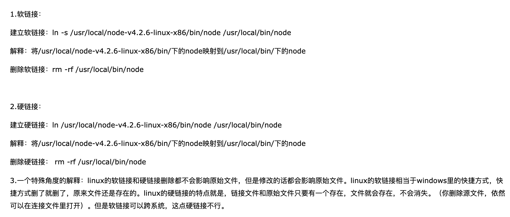
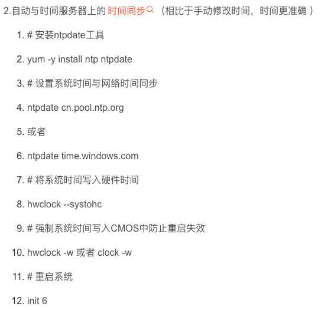
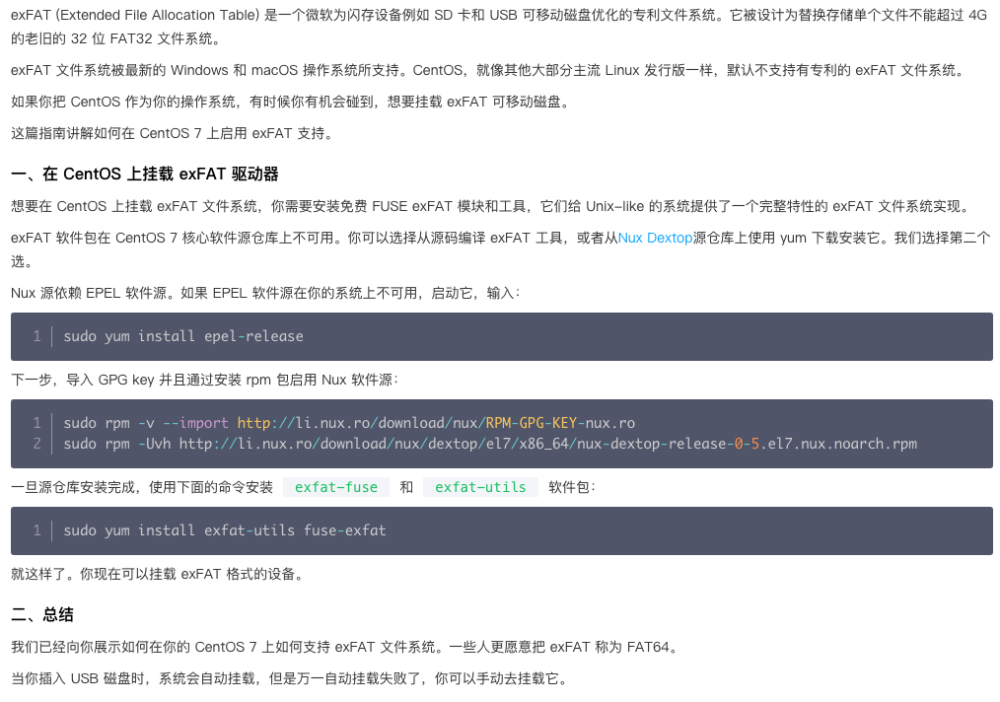

## 物理机上安装 Centos 系统


- 在window平台上制作linux启动盘；
- 插入启动盘，开机后f12进入BIOS，然后找到启动盘进入安装页面 
   - 「由于在windows上使用UltralIOS工具刻录启动盘，因此盘符名称并没有显示完全，所以在启动时会出现问题。」
   - 所以，在进入安装页面后需要迅速按下键盘TAB键，将最下面的vmlinuz initrd=initrd.img inst.stage2=hd:LABEL=CentOS\x207\x20x86_64 rd.live.check quiet 改为 vmlinuz initrd=initrd.img linux dd quiet，然后键入回车查看设备名
   - 之后找到启动盘盘符，再 ctrl+alt+delete 重启，重新进入启动页面，选择 install 选项后按下TAB键，然后把vmlinuz initrd=initrd.img inst.stage2=hd:LABEL=CentOS\x207\x20x86_64 rd.live.check quiet 改为 vmlinuz initrd=initrd.img inst.stage2=hd:/dev/sda4 quiet ps：sda4就是你看到的启动盘名称
   - 参考[这里]()
- 安装时 
   - a. 设置主机名： home.centos
   - b. root root1003
   - c. 设置网络： 
      - ⅰ. ip: 192.168.1.150
      - ⅱ. 掩码： 24
      - ⅲ. 网关： 192.168.1.1
   - d. 未设置时区
- 拔掉u盘，重新启动电脑
- 输入用户名密码后，ping baidu.com

网络拓扑结构：

1. 客厅里面的光纤猫一端连着电信运营商，另一端连着无线路由器；
2. 但是卧室内的信号太差，因此从客厅的无线路由器拉一根网线到卧室，另一端连接一个tp-link的无线路由器；
3. 设置客厅的无线路由器的地址为： 192.168.124.1
4. 设置卧室的无线路由器的地址为： 192.168.1.1
5. 设置linux的ipv4的地址为： 192.168.1.150


## 配置


```
mv /etc/yum.repos.d/CentOS-Base.repo /etc/yum.repos.d/CentOS-Base.repo_bak
curl -o /etc/yum.repos.d/CentOS-Base.repo http://mirrors.aliyun.com/repo/Centos-7.repo
yum clean all  && yum makecache

```


```
[root@home ~]# yum -y install net-tools

```


```
[root@home doc]# vi /etc/inputrc 

// 最下面添加： 
set completion-ignore-case on

```


```
➜  ~ cd .ssh 
➜  .ssh ll
total 40
-rw-r--r--  1 shawnwang  staff   196B  5 19 18:31 config
-rw-------  1 shawnwang  staff   411B  2 12  2023 id_ed25519
-rw-r--r--  1 shawnwang  staff   102B  2 12  2023 id_ed25519.pub
-rw-------  1 shawnwang  staff   270B  7 27 22:35 known_hosts
-rw-r--r--  1 shawnwang  staff    95B  7 27 22:35 known_hosts.old
  
➜  .ssh ssh-copy-id -i ./id_ed25519.pub root@192.168.1.150
/usr/bin/ssh-copy-id: INFO: Source of key(s) to be installed: "./id_ed25519.pub"
/usr/bin/ssh-copy-id: INFO: attempting to log in with the new key(s), to filter out any that are already installed
/usr/bin/ssh-copy-id: INFO: 1 key(s) remain to be installed -- if you are prompted now it is to install the new keys
root@192.168.1.150's password: 

Number of key(s) added:        1

Now try logging into the machine, with:   "ssh 'root@192.168.1.150'"
and check to make sure that only the key(s) you wanted were added.

➜  ~ ssh root@192.168.1.150


```


```
mkdir /mnt/doc/package
mkdir /usr/setup

```




同步时间




## 


### 


```
yum install -y wget
yum install -y gcc

# 安装ntfs-3g
wget https://tuxera.com/opensource/ntfs-3g_ntfsprogs-2017.3.23.tgz
./configure && make && make install

# 创建挂载点
cd /mnt
mkdir d
mkdir e

# 查看磁盘信息及分区情况
fdisk -l
parted -s /dev/sdb p
parted -s /dev/sdc p

# 进行挂载
mount -t ntfs-3g /dev/sdb1 /mnt/d
mount -t ntfs-3g /dev/sdc2 /mnt/e

# 开机自启
vi /etc/fstab 
/dev/sdb1 /mnt/d ntfs-3g silent,umask=0,locale=zh_CN.utf8 0 0
/dev/sdc2 /mnt/e ntfs-3g silent,umask=0,locale=zh_CN.utf8 0 0


# 使用samba访问共享文件夹 ####################### start
# 想要让mac电脑像访问本地文件一样访问linux上面的文件。
// 查看是否已经安装了samba
rpm -qi samba

// 安装samba
yum install samba samba-client -y

// 添加访问用户【用户必须是系统用户】
smbpasswd -a root

// 修改配置，并添加以下内容
vi /etc/samba/smb.conf
	
# 添加以下内容
[d]
    comment = D
    path = /mnt/d
    valid users = root
    public = Yes
    writable = Yes
    browseable = Yes

[e]
    comment = E
    path = /mnt/e
    valid users = root
    public = Yes
    writable = Yes
    browseable = Yes

// 防火墙中放行samba
firewall-cmd --permanent --add-service=samba
firewall-cmd --reload

// 设置开机自启
systemctl restart smb
systemctl enable smb

// 修改SELinux的配置
getenforce
cp /etc/selinux/config /etc/selinux/config.bak
sed -i 's/SELINUX=enforcing/\SELINUX=permissive/' /etc/selinux/config
getenforce

// 重启centos

// mac上访问服务器，输入用户名和密码

# 使用samba访问共享文件夹 ####################### end


```
参考
> 1. [centos7 挂载目录至MAC](https://www.cnblogs.com/tonycloud/articles/7258744.html)
> 2. [CentOS7 配置共享文件夹](https://www.cnblogs.com/tonycloud/articles/7258744.html)
> 3. [WINDOWS访问SAMBA提示没有权限](https://www.cnblogs.com/fklin/articles/2772364.html)


[网络配置](https://blog.csdn.net/festone000/article/details/120042808)


### 挂载一个 exFAT 磁盘驱动器



```shell
sudo yum install epel-release

sudo rpm -v --import http://li.nux.ro/download/nux/RPM-GPG-KEY-nux.ro
sudo rpm -Uvh http://li.nux.ro/download/nux/dextop/el7/x86_64/nux-dextop-release-0-5.el7.nux.noarch.rpm

sudo yum install exfat-utils fuse-exfat

```
[如何在 CentOS 7 上挂载一个 exFAT 磁盘驱动器](https://cloud.tencent.com/developer/article/1626805)

## 
mount /dev/sdb1 /mnt/d


### ~~通过openssl生成证书~~


```bash
# CA服务器
cd /etc/pki/CA/private
(umask 077;openssl genrsa -out /etc/pki/CA/private/cakey.pem 2048)

openssl req -new -x509 \
-key /etc/pki/CA/private/cakey.pem \
-out /etc/pki/CA/cacert.pem -days 365

cd /etc/pki/CA/
touch index.txt
echo 01 > serial
cat serial

# 服务提供者
# 生成签名
cd /mydata/nginx/config/ssh
(umask 077;openssl genrsa -out /mydata/nginx/conf/ssl/provider.key 2048)
# 根据签名生成csr
openssl req -new -key provider.key -out provider.pem
# 根据csr生成key
openssl x509 -req -in provider.csr \
-out provider.pem \
-signkey provider.key \
-days 3650


```


```bash
openssl genrsa -out ca.key 2048


openssl req -new -key ca.key \
-out ca.csr \
-subj "/C=CN/ST=GuangDong/L=ShenZhen/O=tianqingxiaozhu/OU=me/CN=ROOTCA"

openssl x509 -req -in ca.csr \
-out ca.pem \
-signkey ca.key \
-days 3650


```


```bash
openssl genrsa -out server.key 2048

openssl req -new -out server.csr \
-key server.key \
-subj "/C=CN/ST=GuangDong/L=ShenZhen/O=tianqingxiaozhu/OU=me/CN=www.myblog.com"

openssl x509 -req -in server.csr \
-out server.pem \
-signkey server.key \
-CA ca.pem \
-CAkey ca.key \
-CAcreateserial -days 3650


```


```bash
openssl genrsa -out client.key 2048


openssl req -new -out client.csr \
-key client.key \
-subj "/C=CN/ST=GuangDong/L=ShenZhen/O=tianqingxiaozhu/OU=me/CN=Client"

openssl x509 -req -in client.csr \
-out client.pem \
-signkey client.key \
-CA ca.pem \
-CAkey ca.key \
-CAcreateserial -days 3650


```


## 问题解决


### scp 拷贝文件报错

- 问题： 使用 scp 拷贝文件到 centos 上时报“Permission denied (publickey,gssapi-keyex,gssapi-with-mic,password”
- 原因： sshd 不允许。
- 解决步骤：
   - 先在 centos 上执行【 ssh-copy-id -i id_ed25519.pub root@192.168.56.10 】生成 .ssh 文件夹；
   - 修改配置文件【/etc/ssh/sshd_config】中的：
      - PubkeyAuthentication yes
      - PasswordAuthentication yes
   - 重新启动 sshd 客户端： systemctl restart sshd
   - 在 windows 上重新分发公玥：  ssh-copy-id -i id_ed25519.pub root@192.168.56.10
   - 效果： 查看 centos 上 .ssh 中 authorized_keys 文件中的公钥即是 Windows 上分发过来的


