# maven

大纲：

1. Maven 没有出现之前遇到的问题？
2. Maven 主要作用是个啥？
3. 安装与配置（安装过程、配置本地仓库地址、配置 profile、配置阿里源、配置私服）
4. Maven 概念
   1. 约定大于配置： 项目文档目录、软件生命周期管理、依赖关系（继承和聚合）、项目模块类型（Web、Java）
   2. 配置文件讲解
   3. POM
   4. 坐标
   5. 依赖排除
5. 下载 jar 的原理

---

## 1. 配置

1. 修改jar文件在本地的位置

    ```xml
    <localRepository>D:\04.repository</localRepository>
    ```

2. 修改为阿里源

    ```xml
    <mirror>
        <id>alimaven</id>
        <name>aliyun maven</name>
        <!-- https://maven.aliyun.com/repository/public/ -->
        <url>http://maven.aliyun.com/nexus/content/groups/public/</url>
        <mirrorOf>central</mirrorOf>
    </mirror>

    ```

3. 设置配置文件，并使其生效

    ```xml
    <profiles>
    
        <!-- 全局JDK1.8配置 -->
        <profile>
            <id>jdk1.8</id>
            <activation>
                <activeByDefault>true</activeByDefault>
                <jdk>1.8</jdk>
            </activation>
            <properties>
                <project.build.sourceEncoding>UTF-8</project.build.sourceEncoding>
                <maven.compiler.source>1.8</maven.compiler.source>
                <maven.compiler.target>1.8</maven.compiler.target>
                <maven.compiler.compilerVersion>1.8</maven.compiler.compilerVersion>
            </properties>
        </profile>
    
        <!-- 阿里云配置: 提高国内的jar包下载速度 -->
        <profile>
            <id>ali</id>
            <repositories>
                <repository>
                    <id>alimaven</id>
                    <name>aliyun maven</name>
                    <url>http://maven.aliyun.com/nexus/content/groups/public/</url>
                    <releases>
                        <enabled>true</enabled>
                    </releases>
                    <snapshots>
                        <enabled>true</enabled>
                    </snapshots>
                </repository>
            </repositories>
            <pluginRepositories>
                <pluginRepository>
                <id>alimaven</id>
                <name>aliyun maven</name>
                <url>http://maven.aliyun.com/nexus/content/groups/public/</url>
                </pluginRepository>
            </pluginRepositories>
        </profile>
    </profiles>

    <activeProfiles>
        <activeProfile>jdk1.8</activeProfile>
        <activeProfile>ali</activeProfile>
    </activeProfiles>

    ```

4. 设置私服用户名和仓库地址

    ```xml
    <servers>
    <server>
        <id>releases</id>
        <username>zeanzai</username>
        <password>root1003</password>
    </server>
    <server>
        <id>snapshots</id>
        <username>zeanzai</username>
        <password>root1003</password>
    </server>
    </servers>


    <profile>
        <id>dev</id>
        <repositories>
            <repository>
                <id>nexus</id>
                <url>http://192.168.56.10:8081/repository/maven-public/</url>
                <releases>
                    <enabled>true</enabled>
                </releases>
                <snapshots>
                    <enabled>true</enabled>
                </snapshots>
            </repository>
        </repositories>
        <pluginRepositories>
            <pluginRepository>
            <id>public</id>
            <name>Public Repositories</name>
            <url>http://192.168.56.10:8081/repository/maven-public/</url>
            </pluginRepository>
        </pluginRepositories>
    </profile>

    ```

## 2. 完整的settings.xml文件

```xml
<?xml version="1.0" encoding="UTF-8"?>


<settings xmlns="http://maven.apache.org/SETTINGS/1.2.0"
    xmlns:xsi="http://www.w3.org/2001/XMLSchema-instance" xsi:schemaLocation="http://maven.apache.org/SETTINGS/1.2.0 https://maven.apache.org/xsd/settings-1.2.0.xsd">

    <localRepository>D:\04.repository</localRepository>

    <pluginGroups>

    </pluginGroups>


    <proxies>

    </proxies>


    <servers>
        <server>
            <id>releases</id>
            <username>zeanzai</username>
            <password>root1003</password>
        </server>
        <server>
            <id>snapshots</id>
            <username>zeanzai</username>
            <password>root1003</password>
        </server>
    </servers>


    <mirrors>
        <mirror>
            <id>alimaven</id>
            <name>aliyun maven</name>
            <!-- https://maven.aliyun.com/repository/public/ -->
            <url>http://maven.aliyun.com/nexus/content/groups/public/</url>
            <mirrorOf>central</mirrorOf>
        </mirror>
    </mirrors>


    <profiles>

        <!-- 全局JDK1.8配置 -->
        <profile>
            <id>jdk1.8</id>
            <activation>
                <activeByDefault>true</activeByDefault>
                <jdk>1.8</jdk>
            </activation>
            <properties>
                <project.build.sourceEncoding>UTF-8</project.build.sourceEncoding>
                <maven.compiler.source>1.8</maven.compiler.source>
                <maven.compiler.target>1.8</maven.compiler.target>
                <maven.compiler.compilerVersion>1.8</maven.compiler.compilerVersion>
            </properties>
        </profile>

        <profile>
            <id>dev</id>
            <repositories>
                <repository>
                    <id>nexus</id>
                    <url>http://192.168.56.10:8081/repository/maven-public/</url>
                    <releases>
                        <enabled>true</enabled>
                    </releases>
                    <snapshots>
                        <enabled>true</enabled>
                    </snapshots>
                </repository>
            </repositories>
            <pluginRepositories>
                <pluginRepository>
                    <id>public</id>
                    <name>Public Repositories</name>
                    <url>http://192.168.56.10:8081/repository/maven-public/</url>
                </pluginRepository>
            </pluginRepositories>
        </profile>

        <!-- 阿里云配置: 提高国内的jar包下载速度 -->
        <profile>
            <id>ali</id>
            <repositories>
                <repository>
                    <id>alimaven</id>
                    <name>aliyun maven</name>
                    <url>http://maven.aliyun.com/nexus/content/groups/public/</url>
                    <releases>
                        <enabled>true</enabled>
                    </releases>
                    <snapshots>
                        <enabled>true</enabled>
                    </snapshots>
                </repository>
            </repositories>
            <pluginRepositories>
                <pluginRepository>
                    <id>alimaven</id>
                    <name>aliyun maven</name>
                    <url>http://maven.aliyun.com/nexus/content/groups/public/</url>
                </pluginRepository>
            </pluginRepositories>
        </profile>
    </profiles>


    <activeProfiles>
        <activeProfile>jdk1.8</activeProfile>
        <activeProfile>dev</activeProfile>
        <activeProfile>ali</activeProfile>
    </activeProfiles>
</settings>


```


## 3. 私服

> 有时候，我们会把某个公告的模块上传到我们的私服中，然后让团队其他成员使用或其他模块使用。这个时候就需要用到私服了。

1. 新增角色

    

2. 新增用户

    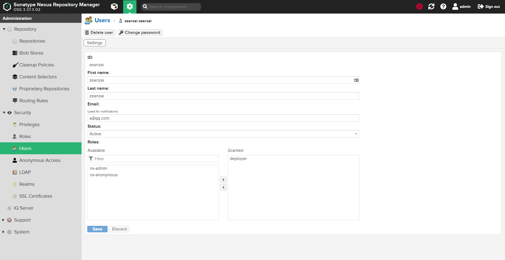

3. 配置本地settings.xml

    ```xml
    <servers>
        <server>
            <id>releases</id>
            <username>zeanzai</username>
            <password>root1003</password>
        </server>
        <server>
            <id>snapshots</id>
            <username>zeanzai</username>
            <password>root1003</password>
        </server>
    </servers>
    
    
    <profile>
        <id>dev</id>
        <repositories>
            <repository>
                <id>nexus</id>
                <url>http://192.168.56.10:8081/repository/maven-public/</url>
                <releases>
                    <enabled>true</enabled>
                </releases>
                <snapshots>
                    <enabled>true</enabled>
                </snapshots>
            </repository>
        </repositories>
        <pluginRepositories>
            <pluginRepository>
                <id>public</id>
                <name>Public Repositories</name>
                <url>http://192.168.56.10:8081/repository/maven-public/</url>
            </pluginRepository>
        </pluginRepositories>
    </profile> 
    
    <activeProfile>dev</activeProfile>

    ```

4. 配置pom文件

    ```xml
    <distributionManagement>
        <repository>
            <id>releases</id>   <!-- 这里的id要和settings.xml中server部分中配置的id保持一致 -->
            <url>http://192.168.56.10:8081/repository/maven-releases/</url>
        </repository>
        <snapshotRepository>
            <id>snapshots</id>  <!-- 这里的id要和settings.xml中server部分中配置的id保持一致 -->
            <url>http://192.168.56.10:8081/repository/maven-snapshots/</url>
        </snapshotRepository>
    </distributionManagement>

    ```

5. 把模块推送到私服上

    

    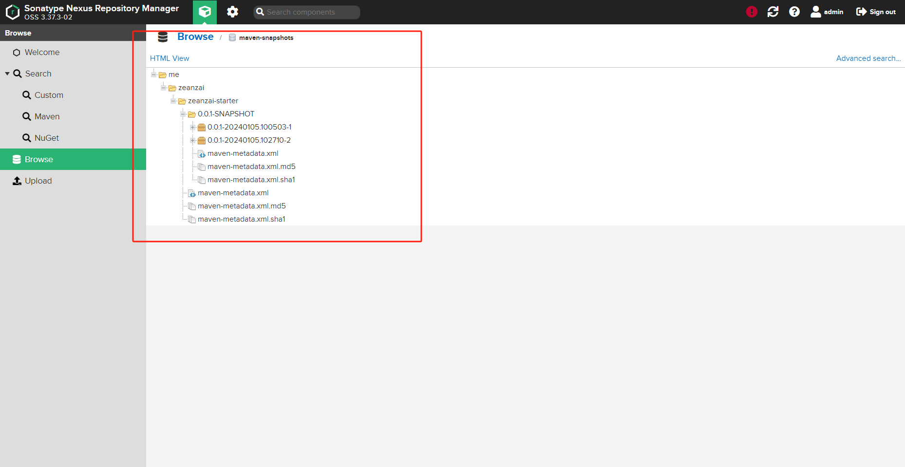

6. 其他项目引用

    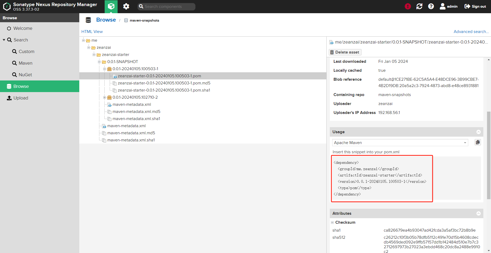

## 4. 一些参考配置文件

::: details origin
@[code](./maven/include/settings_origin.xml)
:::

::: details aliyun
@[code](./maven/include/settings-aliyun.xml)
:::

::: details nexus2
@[code](./maven/include/settings_nexus2.xml)
:::


## 5. 参考

1. [Maven的settings.xml配置阿里云及私服，拿来即用，不需修改！](https://blog.csdn.net/yw99999/article/details/118104215)
2. [彻底理解maven + 配置私服 + 阿里云镜像](https://www.cnblogs.com/yaochunhui/p/17079526.html)
3. [Maven仓库及镜像配置](https://blog.hanqunfeng.com/2021/12/02/maven-setting/)


---

# 6.     Maven 实战

## 6.1.     Maven 是什么

Maven 是一个项目管理和构建自动化工具。

| **目录**                      | **目的**                          |
| ----------------------------- | --------------------------------- |
| ${basedir}                    | 存放 pom.xml 和所有的子目录       |
| ${basedir}/src/main/java      | 项目的 JAVA 源代码                |
| ${basedir}/src/main/resources | 项目的资源，比如说 prperties 文件 |
| ${basedir}/src/test/java      | 项目的测试类，比如说 JUnit 代码   |
| ${basedir}/src/test/resources | 测试使用的资源                    |

一个 Maven 项目在默认情况下会产生 JAR 文件，另外，编译后的 classes 文件会放在${basedir}/target/classes下面，JAR文件会放在${basedir}/target 下面。
它被认为是 Ant 的替代品或继任者，事实上 Maven 的功能要远远超出 Ant，它不仅仅是提供编译的脚本，更是在整个项目周期中提供测试、发布、文档生成等功能，并且有着独特的依赖性管理方法。但是强大的功能的代价是复杂的使用方法，第一次使用 Maven 需要下载一个本地的依赖库。一个不争的事实就是 Maven 逐渐代替了 Ant。

## 6.2.     Maven 安装

到[http://maven.apache.org/download.html 下载最新的 Maven](http://maven.apache.org/download.html下载最新的Maven)版本。
下载后解压到一个目录，如 D:\apache-maven-3.3.3，接着配置 Maven 环境变量 M2_HOME，并配置 path 的值：“%M2_HOME%\bin; ”。
检查是否安装成功，打开 CMD 控制台。输入：mvn –v。
如果要在 CMD 控制台运行 Maven 命令的话，还需要配置 JDK 环境变量，如果是基于 Intellij IDEA 的操作，就不需要配置 JDK 环境变量。
mvn install：会将项目征收在的构件安装到本地 Maven 仓库。
mvn deploy：用来将项目生成的构件分发到远程 Maven 仓库。
D:\>mvn archetype:generate：在 D 盘构建 Maven 标准项目目录结构。

## 6.3.      修改本地仓库位置

仓库用于存放我们项目所依赖的所有 Jar 包。你可以创建在任何位置。
M2_HOME 目录下 conf/settings.xml
<localRepository>D:/workspace/maven/stone</localRepository>
可以使用命令验证一下，输入：mvn help:system
该命令会打印出所有的 Java 系统属性和环境变量，这些信息对我们日常的编程工作很有帮助。如果运行的过程中没有错误，打开仓库会发现里面多了一些文件，这些文件就是我们从 Maven 的中央仓库下载到本地仓库的。

## 6.4.      配置远程仓库（私服）

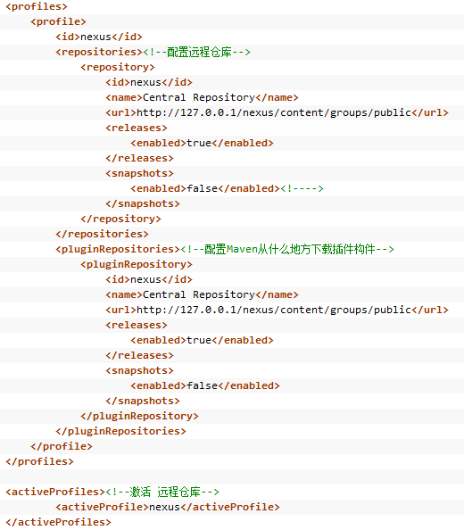
还可配置仓库的镜像下载：

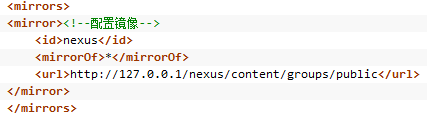

## 6.5.     Maven 核心

### 6.5.1.      pom.xml

pom.xml 文件是 Maven 项目的核心文件，POM（Project Object Model，项目对象模型）定义了项目的基本信息，用于描述项目如何构建，声明项目依赖。

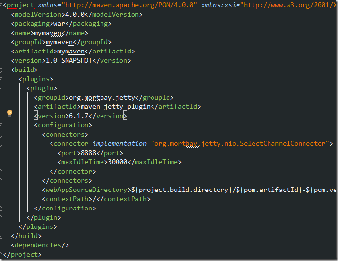
Ø  project：是 xml 文件的根元素，我们主要关心根元素下的子元素。
Ø  modelVersion：定义了当前 POM 模型的版本，Maven2 或 Maven3 只能是 4.0.0.
Ø  groupId：指明创建项目的组织或者小组的唯一标识。groupId 是项目的关键标识，典型的，此标识以组织的完全限定名来定义，比如，org.apache.maven.plugins 是所有 Maven 插件项目指定的 groupId。
Ø  artifactId：定义了当前 Maven 项目在组中   的唯一的 ID，例如 HelloMaven 这个项目，可把它定义为 hello-maven，还例如 spring 项目，它的 groupId 为 org.springframework，对于 content 项目来说 artifactId 则为 spring-content，web 项目则为 spring-web。
Ø  name：项目的显示名称，通常用于 maven 产生的文档中。
Ø  url：指定项目站点，通常用于 maven 产生的文档中。
Ø  descryiption：描述此项目，通常用于 maven 产生的文档中。
在 POM 中，groupId、artifactId、packaging、version 叫作 Maven 坐标，它能唯一的确定一个项目。有了 Maven 坐标，我们就可以用它来指定我们的项目所依赖的其他项目、插件，或者父项目。一般 Maven 坐标写成如下的格式：groupId:artifactId:packageing:version。
如果一个大项目有几个子项目时，每个子项目就会有自己的 POM 文件，然后它们会有一个共同的父项目，这样只要构建父项目就能构建所有子项目了。子项目的 POM 继承父项目的 POM。另外，所有的 POM 都继承了一个 Super-POM，Super-POM 设置了一些默认值，如默认的目录结构、默认的插件等，它遵循了约定优于配置的原则。
对于一个项目中只有下面的一部分是我们需要关注的：
<groupId>com.chongshi.test</groupId>
<artifactId>hello</artifactId>
<version>1.0-SNAPSHOT</version>
SNAPSHOT 意为快照，说明该项目还处于开发中，是不稳定的版本。

### 6.5.2.      Maven 插件

如果我们用 mvn archetype:generate 命令来生成一个项目，那么这里的 archetype:generate 是什么意思呢？archetype 是一个插件的名字，generate 是目标的名字。这个命令的意思是告诉 Maven 执行 archetype 插件的 generate 目标。插件目标通常会写成 pluginId:goalId。
一个目标是一个工作单元，而插件则是一个或者多个目标的集合，比如说 Jar 插件，Compiler 插件，Surefire 插件等。从名字就能知道，Jar 插件包含建立 Jar 文件的目标，Compiler 插件包含编译源代码和单元测试代码的目标，Surefire 插件包含运行单元测试的目标。
看到这里，我们就能知道，mvn 本身不会做太多的事情，它不知道怎么样编译或打包，它把构建的任务交给插件去做。插件定义了常用的构建逻辑，能够被重复利用。这样做的好处是，一旦插件有了更新，那么所有的 Maven 用户都能得到更新。

### 6.5.3.      Maven 生命周期

生命周期指项目的构建过程，它包含了一系列的有序的阶段（phase），而一个阶段就是构建过程中的一个步骤。那么生命周期阶段和上面说的插件目标之间是什么关系呢？插件目标可以绑定到生命周期阶段上，一个生命周期阶段可以绑定多个插件目标。当 Maven 在构建过程中逐步的通过每个阶段时，会执行该阶段所有的插件目标。
Maven 能支持不同的生命周期，但是最常用的是默认的 Maven 生命周期（default maven lifecycle）。如果你没有对它进行任何的插件配置或者定制的话，那么如 mvn package 会依次执行默认生命周期中直到包括 package 阶段前的所有阶段的插件目标。

### 6.5.4.      Maven 依赖管理

Maven 坐标能够确定一个项目，换句话说，我们可以用它来解决依赖关系。在 POM 中，依赖关系是在 dependencies 部分中定义的，如果定义对于 JUnit 的依赖：
<dependencies>
   <dependency>
      <groupId>junit</groupId>
      <artifactId>junit</artifactId >
      <version>3.8.1</version>
      <scope>test</scope>
   </dependency>
</dependencies>
这个例子很简单，但是实际开发中我们会有复杂的多的依赖关系，因为被依赖的 jar 文件会有自己的依赖关系。那么我们是不是需要把那些间接依赖的 Jar 文件也都定义在 POM 中呢？答案是否定的。因为 Maven 提供了传递依赖的特性。所谓传递依赖是指 Maven 会检查被依赖的 Jar 文件，把它的依赖关系纳入最终解决的依赖关系链中。针对上面的 JUnit 依赖关系，看一下 Maven 本地库，会发现 Maven 不但下载了 Junit-3.8.1.jar，还下载了它的 POM 文件，这样 Maven 就能检查 JUnit 的依赖关系，把它所需要的依赖也包括进来。
在 POM 的 dependencies 部分中，scope 决定了依赖关系的适用范围，上面的例子中 JUnit 的 scope 是 test，那么它只会在执行 compiler:testCompile and surefire:test 目标的时候才会被加到 classpath 中，在执行 compiler:compile 目标时是拿不到 JUnit 的。
我们还可以指定 scope 为 provided，意思是 JDK 或者容器会提供所需的 Jar 文件。比如说在做 WEB 应用开发的时候，我们在编译的时候需要 servlet API jar 文件，但是在打包的时候不需要把这个 Jar 文件打在 WAR 中，因为 servlet 容器或者应用服务器会提供的。
scope 默认值是 compile，即任何时候都会被包含在 classpath 中，在打包的时候也会被包括进去。

### 6.5.5.      Maven 库

当第一次运行 Maven 命令时，需要连接 Internet，因为它需要从网上下载一些文件。那么它是从那里下载的呢？它是从 Maven 默认的远程库（[http://repo.maven.org/maven2](http://repo.maven.org/maven2)）下载的。这个远程库有 Maven 的核心插件和可供下载的 Jar 文件。但是不是所有的 Jar 文件都是可以从默认的远程库下载的，比如说我们自己开发的项目，这个时候，有两个选择：要么在公司内部设置定制库，要么手动下载和安装所需的 Jar 文件到本地库。
本地库是指 Maven 下载了插件或者 Jar 文件后存放在本地机器上的拷贝。在 Linux 上，它的位置在~/.m2/repository，在 WindowsXP 上，在 C:\Documents and Settings\.m2\repository，在 Windows7 上，在 C:\Users\username\.m2\repository。当 Maven 查找需要的 jar 文件时，它会先在本地库中查找，只有查找不到的情况下，才会去远程库中查找。
运行下面的命令能把我们的项目安装到本地库：mvn install。
一旦一个项目被安装到了本地库后，别的项目就可以通过 maven 坐标和这个项目建立依赖关系。
<dependency>
<groupId>com.mycompany.helloworld</groupId>
<artifactId>helloworld</artifactId>
<version>1.0 </version>
</dependency>

### 6.5.6.       约定优于配置

为什么要使用约定而不是自己更灵活的配置？原因之一是，使用约定可以大量减少配置。

### 6.5.7.       超级 POM

任何一个 Maven 项目都隐式地继承自该 POM。以下该 POM 的部分配置内容：

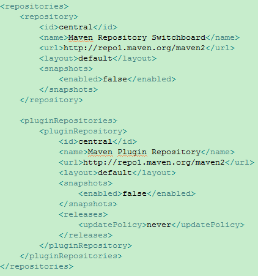
首先超级 POM 定义了仓库及插件仓库，并且关闭了 SNAPSHOT 的支持。

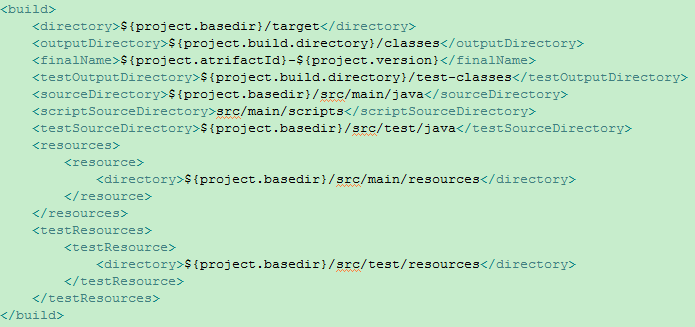
这里定义了项目的主输出目录、主代码输出目录  、最终构件的名称格式、测试代码输出目录、主源码目录、脚本源码目录、测试源码目录、主资源目录和测试资源目录，这就是 Maven 项目结构的约定。

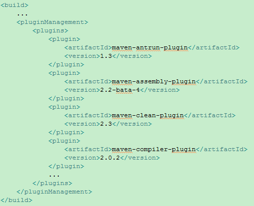
这里定义了核心插件。

## 6.6.     Maven 实例

### 6.6.1.       编写 POM

POM（Project Object Model，项目对象模型）定义了项目的基本信息，用于描述项目如何构建、声明项目依赖等等。
首先创建一个名为 hello-world 的文件夹，在该文件夹新建一个名为 pom.xml 的文件，内容如下所示：

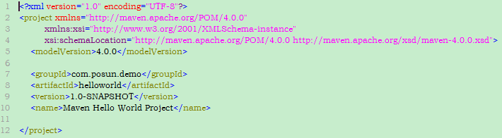

### 6.6.2.       编写主代码

项目主代码和测试代码不同，项目的主代码会被打包到构件中（如 jar），而测试代码只在运行测试时用到，不会被打包。默认情况下，Maven 假设项目主代码位于 src/main/java 目录下，我们遵循 maven 的约定，创建该目录。然后在该目录下创建文件 com/posun/demo/helloworld/HelloWorld.java。里面有一个 sayHello()方法，返回 String。同时这个类还带有一个 main 方法，创建一个 HelloWorld 实例，调用 sayHello()方法，将结果输出到控制台。
关于该 Java 代码有两点需要注意。首先，在绝大多数情况下，应该把项目主代码放到 src/main/java 目录下，而无须额外配置，Maven 会自动搜索该目录找到项目主代码。其次，该 Java 类包名是 com.posun.demo.helloworld，这与之前在 POM 中定义的 groupId 和 artifactId 相吻合。
代码编写完毕后，使用 Maven 进行编译，在项目根目录下运行命令 mvn clear compile。
clean 告诉 Maven 清理输出目录 target/，compile 告诉 maven 编译项目主代码，从输出中看到 maven 首先执行了 clean:clean 任务，删除 target 目录。默认情况下，maven 构建的所有输出都在 target 目录中；接着执行 resources:resources 任务；最后执行 compile:compile 任务，将项目主代码编译到 target/classes 目录。
至此，Maven 在没有任务额外的配置的情况下，执行了项目的清理和编译任务。

### 6.6.3.       编写测试代码

为了使项目结构保持清晰，主代码与测试代码默认的目录是 src/test/java。首先为项目添加一个 JUnit 依赖，修改项目 pom 文件，增加以下代码：

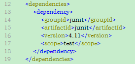
代码中添加了 dependencies 元素，该元素下可以包含多个 dependency 元素以声明项目的依赖。有了这段声明，Maven 就能够自动下载 junit-4.11.jar。
上述代码中还有一个值为 test 的元素 scope，scope 为依赖范围，若依赖范围为 test 则表示该依赖只对测试有效。换句话说，测试代码中的 import JUnit 代码是没有问题的，但是如果在主代码中用 import JUint 代码，就会造成编译错误。如果不声明依赖，那么默认值就是 compile，表示该依赖对主代码和测试代码都有效。
配置了测试依赖，接着就可以编写测试类。
一个典型的单元测试包含三个步骤：1、准备测试类及数据；2、执行要测试的行为；3、检查结果。

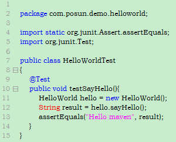
测试用例编写完成之后就可以调用 Maven 执行测试：mvn clean test。
在 Maven 执行测试之前，它会先自动执行项目主资源处理、主代码编译、测试资源处理、测试代码编译等工作，这是 Maven 生命周期的一个特性。
由于历史原因，Maven 的核心插件之一：compiler 插件默认只支持编译 Java1.3，因此需要配置该插件使其支持 Java5，代码如下：

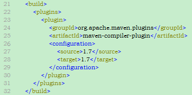

### 6.6.4.       打包

将项目编译、测试之后，下一个重要步骤就是打包（package）。简单执行命令：mvn clean package 进行打包。
类似地，Maven 会在打包之前执行编译、测试等操作。打包成的文件也位于 target 目录中。至此，我们得到了项目的输出，如果有需要的话，就可以复制这个 jar 文件到其他项目的 classpath 中从而使用 HelloWorld 类。
但是，如何才能让其他的 Maven 项目直接引用这个 jar 呢？还需要一个安装步骤，执行命令：mvn clean install。只有构件被下载到本地仓库后，才能由所有 Maven 使用，这里是同样的道理，只有将 Hello World 的构件安装到本地仓库后，其他 Maven 项目才能使用它。

### 6.6.5.       运行

到目前为止，还没有运行 Hello World 项目，不要忘了 HelloWorld 类可是有一个 main 方法的，默认打包生成的 jar 是不能够直接运行的，因为带有 main 方法的类信息不会添加到 manfiest 中（打开 jar 文件中的 META-INF/MANIFEST.MF，将无法看到 main-Class 一行）。为了生成可执行的 jar 文件，需要借助 maven-shade-plugin，配置该插件如下：

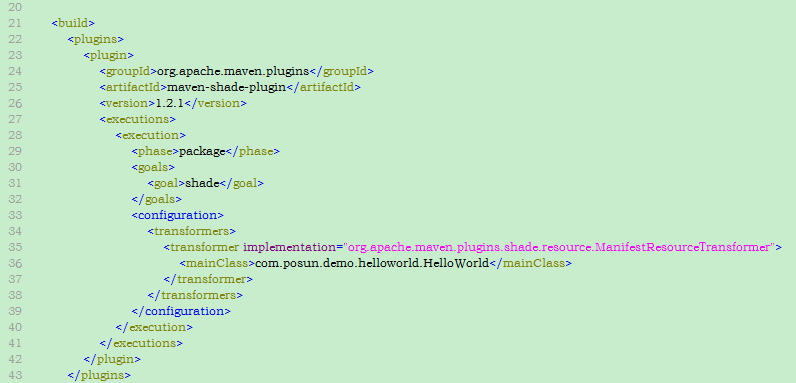
项目打包时会将该信息放到 MANIFEST 中。重新执行 mvn clean install，待构建完成之后打开 target 目录，可以看到 hello-world-1.0-SNAPSHOT.jar 和 original-hello-world-1.0-SANPSHOT.jar，前者是带有 Main-Class 信息的可运行的 jar，后者是原始的 jar，打开 jar 包的 META-INF/MANIFEST.MF，可以看到它包含这样一行信息：Main-Class:com.posun.demo.helloworld.HelloWorld。
现在，在项目根目录中执行该 jar 文件：java –jar target\hello-world-1.0-SNAPSHOT.jar，控制台输出信息，这正是我们所希望的。

## 6.7.      使用 archetype 生成项目骨架

上述的项目中有一些 Maven 约定：在项目的根目录中放置 pom.xml，在 src/main/java 目录中放置项目的主代码，在 src/test/java 目录中放置项目的测试代码。我们称这些基本的目录结构和 pom.xml 文件内容为项目的骨架。Maven 提供了 Archetype 可以帮助我们快速勾勒出项目骨架。
如果是 Maven3，简单地运行：mvn archetype:generate。
如果是 Maven2，最好运行：
mvn org.apache.maven.plugins:maven-archetype-plugin:2.0-alpha-5:generate。
实际是运行插件 maven-archetype-plugin，注意冒号的分隔，其格式为 groupId:artifactId:version:goal。紧接着会看到一段长长的输出，有很多可用的 archetype 供选择，包括著名的 Appfuse 项目的 archetype，JPA 项目的 Archetype 等。每一个 Archetype 前面都会对应有一个编号，同时命令行会提示一个默认的编号，其对应的 Archetype 为 maven-archetype-quickstart，直接回车以选择该 Archetype，紧接着 Maven 会提示输入要创建项目的 groupId、artifactId、version 以及包名 package，如下输入并确认。

## 6.8.     Maven 坐标和依赖

### 6.8.1.       何为 Maven 坐标

Maven 世界中拥有数量非常巨大的构件，也就是平时用的一些 jar、war 等文件。Maven 定义了这样一组规则：世界上任何一个构件都可以使用 Maven 坐标唯一标识，Maven 坐标的元素包括 groupId、artifactId、version、packaging、classifier。现在只要我们提供正确的坐标元素，Maven 就能找到对应的构件。比如说，当需要使用 java5 平台上的 TestNG 的 5.8 版本时，就告诉 Maven：groupId=org.testng;artifactId=testing;version=5.8;classifier=jdk15，Maven 就会从仓库中寻找相应的构件供我们使用。Maven 内置了一个中央仓库的地址，该中央仓库包含了世界上大部分流行的开源项目构件，Maven 会在需要的时候去那里下载。
在我们开发自己项目的时候，也需要为其定义适当的坐标，这是 Maven 强制要求的，在这个基础上，其他 Maven 项目才能引用该项目生成的构件。如图：

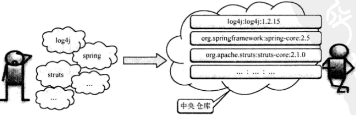

### 6.8.2.       坐标详解

Maven 坐标为各种构件引入了秩序，任何一个构件都必须明确定义自己的坐标，而一组 Maven 坐标是通过一些元素定义的，它们是 groupId、artifactId、version、packaging、classifier。如下：
<groupId>org.sonatype.nexus</groupId>
<artifactId>nexus-indexer</artifactId>
<version>2.0.0</version>
<packaging>jar</packaging>
这是 nexus-indexer 的坐标定义，下面详细介绍坐标元素：
Ø  groupId：定义当前 Maven 项目隶属的实际项目。首先，Maven 项目和实际项目不一定是一对一的关系。比如 SpringFramework 这一实际项目，其对应的 Maven 项目会有很多，如 spring-core、spring-context 等。这是由于 Maven 中模块的概念，因此，一个实际项目往往会被划分成很多模块。其次，groupId 不应该对应项目隶属的组织或公司。原因很简单，一个组织下会有很多实际项目，如果 groupId 只定义到组织级别，而后面我们会看到，artifactId 只能定义 Maven 项目（模块），那么实际项目这个层将难以定义。最后，groupId 的表示方式与 Java 包名的表示方式类似，通常与域名反向一一对应。上例中，groupId 为 org.sonatype.nexus, org.sonatype 表示 Sonatype 公司建立的一个非盈利性组织，nexus 表示 Nexus 这一实际项目。
Ø  artifactId：该元素定义实际项目中的一个 Maven 项目（模块），推荐的做法是使用实际项目名称作为 artifactId 前缀。
Ø  version：该元素定义 Maven 项目当前所处的版本，如上例中 nexus-indexer 的版本是 2.0.0。需要注意的是，Maven 定义了一套完成的版本规范，以及快照（SNAPSHOT）的概念。
Ø  packaging：该元素定义 Maven 项目的打包方式。首先，打包方式通常与所生成构件的文件扩展名对应。使用 jar 打包方式的 Maven 项目，最终生成的构件会有一个.jar 文件，而使用 war 打包方式的项目，最终生成的构件会有一个.war 文件，不过这不是绝对的。其次，打包方式会影响到构建的生命周期，比如 jar 打包和 war 打包会使用不同的命令。最后，当不定义 packaging 的时候，Maven 会使用默认值 jar。
Ø  classifier：该元素用来帮助定义构建输出的一些附属构件。附属构件与主构件对应，比如项目可能会通过使用一些插件生成如 nexus-indexer-2.0.0.-javadoc.jar、nexus-indexer-2.0.0-sources.jar 这样一些附属构件，其包含了 Java 文档和源代码。这时候，javadoc 和 sources 就是这两个附属构件的 classifier。这样，附属构件也就拥有了自己唯一的坐标。还有一个关于 classifier 的典型例子就是 TestNG，TestNG 的主构件是是基于 Java1.4 平台的，而它又提供了一个 classifier 为 JDK5 的附属构件。注意，不能直接定义项目的 classifier，因为附属构件不是项目直接默认生成的，而是由附加的插件帮助生成。
上述 5 个元素中，groupId、artifactId、version 是必须定义的，packaging 是可选的（默认为 jar），而 classifier 是不能直接定义的。
同时，项目构件的文件名是与坐标相对应的，一般的规则为 artifactId-version[-classifier].packaging，

### 6.8.3.      Maven 依赖

具体实例参见《Maven 实战》P58。

#### 6.8.3.1.     依赖的配置

依赖的基本配置如下：

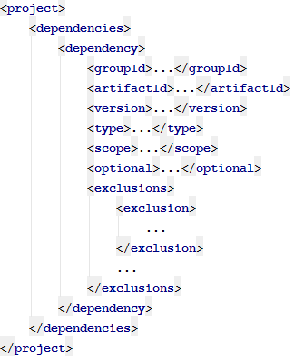
根元素 project 下的 dependencies 可以包含一个或多个 dependency 元素，以声明一个或多个项目依赖。每个依赖可以包含的元素有：
Ø  groupId、artifactId 和 version：依赖的基本坐标，对于任何一个依赖来说，基本坐标是最重要的，Maven 根据坐标才能找到需要的依赖；
Ø  type：依赖的类型，对应于项目坐标定义的 packaging。大部分情况下，该元素不必声明，其默认值为 jar；
Ø  scope：依赖的范围；
Ø  optional：标记依赖是否可选；
Ø  exclusions：用来拔除传递性依赖。
大部分依赖声明只包含基本坐标，然而在一些特殊情况下，其他元素至关重要。

#### 6.8.3.2.     依赖范围（scope）

依赖范围是用来控制依赖与三种 classpath 的关系。三种 classpath 分别是：
Ø   编译 classpath：Maven 项目在编译项目主代码的时候需要使用的一套 classpath。
Ø   测试 classpath：Maven 在编译和执行测试的时候会使用的另外一套 classpath。
Ø   运行 classpath：实际运行 Maven 项目的时候，又会使用到的另外一套 classpath。
Maven 有以下几种依赖范围：
Ø  compile：编译依赖范围。如果没有指定，就会默认使用该依赖范围。使用此依赖范围的 Maven 依赖，对于编译、测试、运行三种 classpath 都有效。
Ø  test：测试依赖范围。使用此依赖范围的 Maven 依赖，只对于测试 classpath 有效，在编译主代码或者运行项目的时候，将无法使用此类依赖。
Ø  provided：已提供依赖范围。使用此依赖范围的 Maven 依赖，对于编译和测试 classpath 有效，但在运行时无效。典型的例子是 servlet-api，编译和测试项目的时候需要该依赖，但在运行项目的时候，由于容器已提供，就不需要 Maven 重复地引入一遍。
Ø  runtime：运行时依赖范围。使用此依赖范围的 Maven 依赖，对于测试和运行 classpath 有效，但在编译主代码时无效。典型的例子是 JDBC 驱动实现，项目主代码的编译只需要 JDK 提供的 JDBK 接口，只有在执行测试或者运行项目的时候才需要实现上述接口的具体 JDBC 驱动。
Ø  system：系统依赖范围。该依赖与三种 classpath 的关系，和 provided 依赖范围完全一致。但是，使用 system 范围的依赖时必须通过 systemPath 元素显式地指定依赖文件的路径。由于此类依赖不是通过 Maven 仓库解析的，而且往往与本机系统绑定，可能造成构件的不可移植，因此应该谨慎使用。systemPath 元素可以引用环境变量，如：

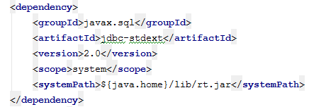
Ø  import（Maven2.0.9 及以上）：导入依赖范围。该依赖范围不会对三种 classpath 产生实际的影响
上述除 import 以外的各种依赖范围与三种 classpath 的关系如下表所示：

| **依赖范围** | **对于编译**
**classpath 有效** | **对于测试**
**classpath 有效** | **对于运行**
**classpath 有效** | **例子** |
| --- | --- | --- | --- | --- |
| compile | Y | Y | Y | spring-core |
| test | N | Y | N | JUnit |
| provided | Y | Y | N | servlet-api |
| runtime | N | Y | Y | JDBC 驱动实现 |
| system | Y | Y | N | 本地的，Maven 仓库之外的类库文件 |

#### 6.8.3.3.     传递性依赖

考虑一个基于 Spring Framework 的项目，如果不使用 Maven，那么在项目中就需要手动下载相关依赖。由于 Spring Framework 又会依赖于其他开源类型库，因此实际中往往会下载一个很的如 spring-framework-2.5.6-with-dependecies.zip 的包，这么做往往就会引入了很多不必要的依赖。
Maven 的传递性依赖机制可以很好地解决这一问题。有了传递性依赖，在使用 Spring Framework 的时候就不用去考虑它依赖了什么，也不用担心引入多余的依赖。Maven 会解析各个直接依赖的 POM，将那些必要的间接依赖，以传递性依赖的形式引入到当前的项目中。

#### 6.8.3.4.     传递性依赖和依赖范围

依赖范围不仅可以控制依赖与三种 classpath 的关系，还对传递性依赖产生影响。假如 A 依赖于 B，B 依赖于 C，我们说 A 对于 B 是第一直接依赖，B 对于 C 是第二直接依赖，A 对于 C 是传递性依赖。第一直接依赖的范围和第二直接依赖的范围决定了传递性依赖的范围。如下表所示，最左边一列表示第一直接依赖，最上面一行表示第二直接依赖，中间交叉单元格则表示传递性依赖范围：

| \*\* \*\*    | **compile** | **test** | **provided** | **runtime** |
| ------------ | ----------- | -------- | ------------ | ----------- |
| **compile**  | compile     | -        | -            | runtime     |
| **test**     | test        | -        | -            | test        |
| **provided** | provided    | -        | provided     | provided    |
| **runtime**  | runtime     | -        | -            | runtime     |

从表中我们可以发现这样的规律：当第二直接依赖的范围是 compile 的时候，传递性依赖的范围与第一直接依赖的范围一致；当第二直接依赖的范围是 test 的时候，依赖不会得以传递；当第二直接依赖的范围是 provided 的时候，只传递第一直接依赖范围也为 provided 的依赖，且传递性依赖的范围同样为 provided；当第二直接依赖范围是 runtime 时，传递性依赖的范围与第一直接依赖的范围一致，但 compile 例外，此时传递性依赖的范围为 runtime。

#### 6.8.3.5.     依赖调解

Maven 引入的传递性依赖机制，一方面大大简化和方便了依赖声明，另一方面，大部分情况下我们只需要关心项目的直接依赖是什么，而不用考虑这些直接依赖会引入什么传递性依赖。但有时候，当传递性依赖造成问题的时候，我们就需要清楚地知道该传递性依赖是从哪条依赖路径引入的。
例如，项目 A 有这样的依赖关系：ABCX(1.0)、ADX(2.0)，X 是 A 的传递性依赖，但是两条依赖路径上有两个版本的 X，那么哪个 X 会被 Maven 解析使用呢？两个版本都被解析显然是不对的，因为那会造成依赖重复，因此必须选择一个。Maven 依赖调解（Dependency Mediation）的第一原则是：路径近者优先。该例中 X(1.0)的路径他要 3，而 X(2.0)的路径长度为 2，因此 X(2.0)会被解析使用。
依赖调解第一原则不能解决所有问题，比如依赖关系：ABY(1.0)、ACY(2.0), Y(1.0)和 Y(2.0)的依赖路径长度是一样的，都为 2，那么到底谁会被解析使用呢？在 Maven2.0.8 及之前的版本中，这是不确定的，但是从 Maven2.0.9 开始，为了尽可能避免构建的不确定性，Maven 定义了依赖调解的第二原则：第二声明者优先，在依赖路径长度相等的前提下，在 POM 中依赖声明的顺序决定了谁会被解析使用，顺序靠前的那个依赖优先。

#### 6.8.3.6.     可选依赖

假设有这样一个依赖关系，项目 A 依赖于项目 B，项目 B 依赖于项目 X 和 Y，B 对于 X 和 Y 的依赖都是可选依赖：AB、BX(可选)、BY(可选)。根据传递性依赖的定义，如果所有这三个依赖的范围都是 compile，那么 X、Y 就是 A 的 compile 范围传递性依赖。然而，由于这里 X 和 Y 是可选依赖，依赖将不会得以传递。换句话说，X 和 Y 将不会对 A 有任何影响。


为什么要使用可选依赖这一特性呢？可能项目 B 实现了两个特性，其中的特性一依赖于 X，特性二依赖于 Y，而且这两个特性是互斥的，用户不可能同时使用两个特性，比如 B 是一个持久层隔离工具包，它支持多种数据库，包括 MySql、PostgreSQL 等，在构建这个工具包的时候，需要这两种数据库的驱动程序，但在使用这个工具包的时候，只会依赖一种数据库。
项目 B 的依赖声明如下：

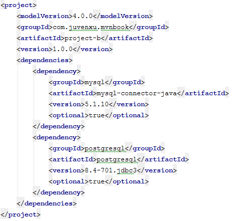
上述的代码中，使用<optional>元素表示 mysql-connector-java 和 postgresql 这两个依赖为可选依赖，它们只会对当前项目 B 产生影响，当其他项目依赖依赖于 B 的时候，这两个依赖不会被传递。因此，当项目 A 依赖于项目 B 的时候，如果其实际使用基于 MySQL 数据库，那么在项目 A 中就需要显式地声明 mysql-connector-java 这一依赖，见如下所示：

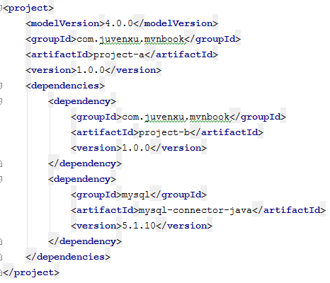
最后，关于可选依赖需要说明的一点是，在理想的情况下，是不应该使用可选依赖的。使用可选依赖的原因是某一个项目实现了多个特性，在面向对象设计中，有个单一职责原则，意指一个类应该只有一个项职责，而不是糅合太多的功能。这个原则在规划 Maven 项目的时候也同样适用。在上面的例子中，更好的做法是为 MySQL 和 PostgreSQL 分别创建一个 Maven 项目，基于同样的 groupId 分配不同的 artifactId，如 com.juvenxu.mvnbook:prject-b-mysql 和 com.juvenxu.mvnbook:project-postgresql，在各自的 POM 中声明对应的 JDBC 驱动依赖，而且不使用可选依赖，用户则根据需要选择使用 project-b-mysql 或者 project-b-postgresql。由于传递性依赖的作用，就不用声明 JDBC 驱动依赖。

#### 6.8.3.7.     最佳实践

Maven 依赖涉及的知识点比较多，在理解了主要的功能和原理之后，最需要的就是前人的经验总结，我们称之为最佳实践。本小节归纳了一些使用 Maven 依赖常见的技巧。
1.   排除依赖
传递性依赖会给项目隐式地引入很多依赖，这极大地简化了项目依赖管理，但是有些时候这种特性也会带来问题。例如，当前项目有一个第三方依赖，而这个第三方依赖由于某些原因依赖了另外一个类库的 SANPSHOT 版本，那么这个 SNAPSHOT 就会成为当前项目的传递性依赖，而 SNAPSHOT 的不稳定性会直接影响到当前项目。这时就需要排除掉该 SNAPSHOT，并且在当前项目中声明该类库的某个正式发布的版本。还有一些情况，你可能也想要替换某个传递性依赖，比如 Sun JTA API，Hibernate 依赖于这个 jar，但是由于版权的因素，该类库不在中央仓库中，而 Apache Geronimo 项目有一个对应的实现，这时就可以排除 Sun JTA API，再声明 Geronimo 的 JTA API 实现，见如下代码：

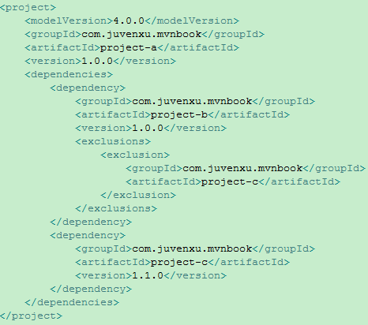
上述代码中，项目 A 依赖于项目 B，但由于一些原因，不想引入传递性依赖 C，而是自己显式地声明对于项目 C 1.1.0 版本的依赖。代码中使用 exclusions 元素声明排除依赖，exclusions 可以包含一个或多个 exclusion 子元素，因此可以排除一个或多个传递性依赖。需要注意的是，声明 exclusion 的时候只需要 groupId 和 artifactId，而不需要 version 元素，这是因为只需要 groupId 和 artifactId 就能唯一定位依赖图中的某个依赖。换句话说，Maven 解析后的依赖中，不可能出现 groupId 和 artifactId 相同，但是 version 不同的两个依赖。
2.   归类依赖
有些依赖，如 Spring Framework 有很多的依赖，它们分别是 org.springframework:spring-core:2.5.6 org.springframework:spring-beans:2.5.6、org.springframework:spring-context:2.5.6 和 org.springframework:spring-context-support:2.5.6，它们是来自同一项目的不同模块。因此，所有这些依赖的版本都是相同的，而且可以预见，如果将来需要升级 Spring Framework，这些依赖的版本会一起升级。所以应该在一个唯一的地方定义版本，并且在 dependency 声明中引用这一版本。这样，在升级 Spring Framework 的时候就只需要修改一处就可，代码如下图所示：

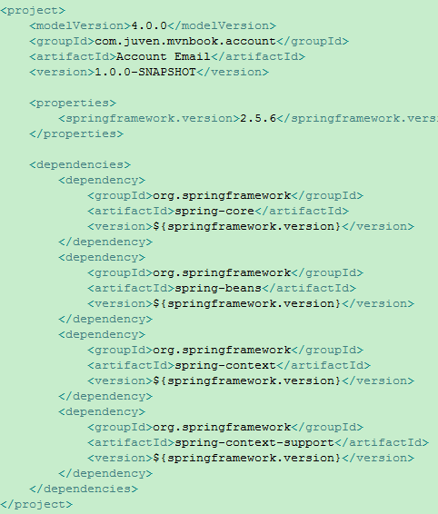
这里简单用到了 Maven 属性。首先使用 properties 元素定义 Maven 属性，该例中定义了一个 springframework.version 子元素，其值为 2.5.6。有了这个属性定义之后，Maven 运行的时候会将 POM 中的所有${springframework.version}替换成实际值 2.5.6。也就是说，可以使用美元符号和大括弧环绕的方式引用 Maven 属性。
3.   优化依赖
在软件开发过程中，程序员会通过重构等方式不断地优化自己的代码，使其变得更简洁、更灵活。同理，程序员也应该能够对 Maven 项目的依赖了然于胸，并对其进行优化，如去除多余的依赖，显式地声明某些必要的依赖。
Maven 会自动解析所有项目的直接依赖和传递性依赖，并且根据规则正确判断每个依赖的范围，对于一些依赖冲突，也能进行调节，以确保任何一个构件只有唯一的版本在依赖中存在。在这些工作之后，最后得到的那些依赖被称为已解析依赖（Resolved Dependency）。可以运行如下命令查看当前项目的已解析依赖：
mvn dependency:list。
当这些依赖经 Maven 解析后，就会构成一个依赖树，通过这棵依赖树就能很清楚地看到某个依赖是通过哪条传递路径引入的。可以运行以下命令查看当前项目的依赖树：
mvn dependency:tree。
使用 dependency:list 和 dependency:tree 可以帮助我们详细了解项目中所有依赖的具体信息，在些基础上，还有 dependency:analyze 工具可以帮助分析当前项目的依赖。

## 6.9.     Maven 仓库

在 Maven 世界中，任何一个依赖、插件或者项目构建的输出，都可以称为构件。例如，依赖 log4j-1.2.15.jar 是一个构件，插件 maven-complier-plugin-2.0.2.jar 是一个构件，项目构建完成后输出的 jar 包也是一个构件。任何一个构件都有一组坐标唯一标识。
Maven 可以在某个位置统一存储所有 Maven 项目共享的构件，这个统一的位置就是仓库。实际的 Maven 项目不再各自存储其依赖文件，它们只需要声明这些依赖的坐标，在需要的时候（例如，编译项目的时候需要将依赖加入到 classpath 中），Maven 会自动根据坐标找到仓库中的构件，并使用它们。
为了实现重用，项目构件完毕后生成的构件也可以安装或者部署到仓库中，供其他项目使用。

### 6.9.1.       仓库的布局

任何一个构件都有其唯一的坐标，根据这个坐标可以定义其在仓库中的唯一存储路径，这便是 Maven 的仓库布局方式。例如，log4j:log4j:1.2.15 这一依赖，其对应的仓库路径为 log4j/log4j/1.2.15/log4j-1.2.15.jar，实质上，该路径与坐标的大致对应关系为 groupId/artifactId/version/artifactId-version.packaging。

### 6.9.2.       仓库的分类

对于 Maven 来说，仓库只分两类：本地仓库和远程仓库。当 Maven 根据坐标寻找构件的时候，它首先会查看本地仓库，如果本地仓库存在些构件，则直接使用；如果本地仓库不存在些构件，或者需要查看是否有更新的构件版本，Maven 就会去远程仓库查找，发现需要的构件之后，下载到本地仓库再使用。如果本地仓库和远程仓库都没有需要的构件，Maven 就会报错。
在这个最基本分类的基础上，还有必要介绍一些特殊的远程仓库。中央仓库是 Maven 核心自带的远程仓库，它包含了绝大部分开源的构件。在默认配置下，当本地仓库没有 Maven 需要的构件的时候，它就会尝试从中央仓库下载。
    私服是另一种特殊的远程仓库，为了节省带宽和时间，应该在局域网内架设一个私有的仓库服务器，用其代理所有外部远程仓库。内部的项目还能部署到私服上供其他项目使用。

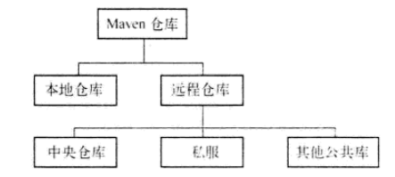

### 6.9.3.       本地的仓库

一般来说，在 Maven 项目目录下，没有诸如 lib/这样用来存放依赖文件的目录。当 Maven 在执行编译或测试时，如果需要使用依赖文件，它总是基于坐标使用本地仓库的依赖文件。
默认情况下，不管是在 Windows 还 Linux 上，每个用户在自己的用户目录下都有一个路径为.m2/repository/的仓库目录。有时候，因为某些原因，用户会想要自定义本地仓库目录地址，这时可以编辑文件 settings.xml，设置 localRepository 元素的值为想要的仓库地址。如：
<settings>
   <localRepository>D:\java\repository\</localRepository>
</settings>
这样，该用户的本地仓库地址就被设置成了 D:\java\repository\。
一个构件只有在本地仓库中之后，才能由其他 Maven 项目使用，那么构件如何进入到本地仓库中呢？最常见的是依赖 Maven 从远程仓库下载到本地仓库中。还有一种常见的情况是，将本地项目的构件安装到 Maven 仓库中。安装命令：mvn clean install。

### 6.9.4.       远程仓库

安装好 Maven 后，如果不执行任何 Maven 命令，本地仓库目录是不存在的。当用户输入第一条命令之后，Maven 才会创建本地仓库，然后根据配置和需要，从远程仓库下载构件至本地仓库。
对于 Maven 来说，每个用户只有一个本地仓库，但可以配置访问很多远程仓库。

### 6.9.5.       中央仓库

由于最原始的本地仓库是空的，Maven 必须知道至少一个可用的远程仓库，才能在执行 Maven 命令的时候下载到需要的构件。中央仓库就是这样一个默认的远程仓库，Maven 的安装文件自带了中央仓库的配置。可以打开 jar 文件$M2_HOME/lib/maven-model-builder-3.0.jar，然后访问路径 org/apache/maven/model/pom-4.0.0.xml，可以看到如下配置：

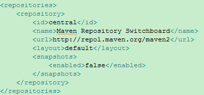
包含这段配置的文件是所有 Maven 项目都会继承的超级 POM。这段配置使用 id central 对中央仓库进行唯一标识，其名称为 Maven Repository Switchboard，它使用 default 仓库布局，也就是上文“仓库的布局”介绍的仓库布局。需要注意的是 snapshots 元素，其子元素 enabled 的值为 false，表示不从该中央仓库下载快照版本的构件。

### 6.9.6.       私服

私服是一种特殊的远程仓库，它是架设在局域网内的仓库服务，私服代理广域网上的远程仓库，供局域网内的 Maven 用户使用。当 Maven 需要下载构件的时候，它从私服请求，如果私服上不存在该构件，则从外部的远程仓库下载，缓存在私服上之后，再为 Maven 的下载请求提供服务。此外，一些无法从外部仓库下载到的构件也能从本地上传到私服上供大家使用。

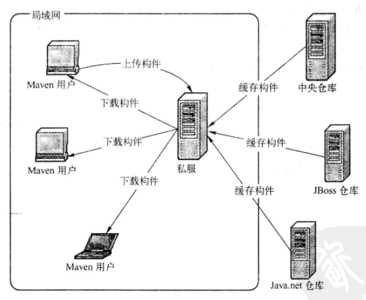

### 6.9.7.       远程仓库的配置

在很多情况下，默认的中央仓库无法满足项目的需求，可能项目需要的构件存在于另外一个远程仓库中，如 JBoss Maven 仓库，这时，可以在 POM 中配置该仓库，如下代码清单：

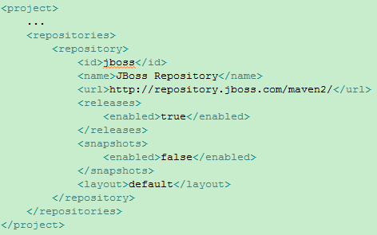
在 repositories 元素下，可以使用 repository 子元素声明一个或多个远程仓库。该例中声明了一个 id 为 jboss，名称为 JBoss Repository 的仓库。任何一个仓库声明的 id 必须是唯一的，尤其需要注意的是，Maven 自带的中央仓库使用的 id 为 central，如果其他的仓库声明也使用该 id，就会覆盖中央仓库的配置。
该例配置中的 releases 和 snapshots 元素比较重要，它们用来控制 Maven 对于发布版构件和快照版构件的下载。该例中 releases 的 enabled 值为 true，表示开户 JBoss 仓库的发布版本下载支持，而 snapshots 的 enabled 值为 false，表示关闭 JBoss 仓库的快照版本的下载支持。
该例中的 layout 元素值 default 表示仓库的布局是 Maven2 及 Maven3 的默认布局，而不是 Maven1 的布局。
对于 released 和 snapshots 来说，除了 enabled，它们还包含另外两个子元素 updatePolicy 和 checksumPolicy:

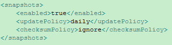
元素 updatePolicy 用来配置 Maven 从远程仓库检查更新的频率，默认的值为 daily，表示 Maven 每天检查一次。其他可用的值包括：never—从不检查更新；always—每次构建都检查更新；interval:X—每隔 X 分钟检查一次更新（X 为任意整数）。
元素 checksumPolicy 用来配置 Maven 检查检验和文件的策略。当构件被部署到 Maven 仓库中时，会同时部署对应的校验和文件。在下载构件的时候，Maven 会验证校验和文件，如果校验和验证失败，怎么办？当 checksumPolicy 的值为默认的 warn 时，Maven 会在执行构件时输出警告信息，其他可用的值包括：fail—Maven 遇到校验和错误就让构建失败；ignore—使 Maven 完全忽略校验和错误。

### 6.9.8.       远程仓库的认证

大部分远程仓库无须认证就可以访问，但有时候出于安全方面的考虑，我们需要提供认证信息才能访问一些远程仓库。例如，组织内部有一个 Maven 仓库服务器，该服务器为每个项目都提供独立的 Maven 仓库，为了防止非法的仓库访问，管理员为每个仓库提供了一组用户名密码，这时，为了能让 Maven 访问仓库内容，就需要配置认证信息。
配置认证上和配置仓库信息不同，仓库信息可以直接配置在 POM 文件中，但是认证信息必须配置在 settings.xml 文件中。这是因为 POM 往往是被提交到代码仓库中供所有成员访问的，而 settings.xml 一般只放在本机，因此，在 settings.xml 中配置认证信息更为安全。
假设需要为一个 id 为 my-proj 的仓库配置认证信息，编辑 settings.xml 文件，如下：

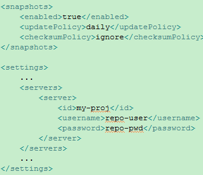
Maven 使用 settings.xml 文件中并不显而易见的 servers 元素及其 server 子元素配置仓库认证信息。这里的关键是 id 元素，settings.xml 中 server 元素的 id 必须与 POM 中需要认证的 repository 元素的 id 完全一致。换句话说，正是这个 id 将认证信息与仓库配置联系在了一起。

### 6.9.9.       部署至远程仓库

私服的一大作用是部署第三方构件，包括组织内部生成的构件以及一些无法从外部仓库直接获取的构件。
Maven 除了能对项目进行编译、测试、打包之外，还能将项目生成的构建部署到仓库中。首先，需要编辑项目的 pom.xml 文件，配置 distributionManagement 元素，代码如下：

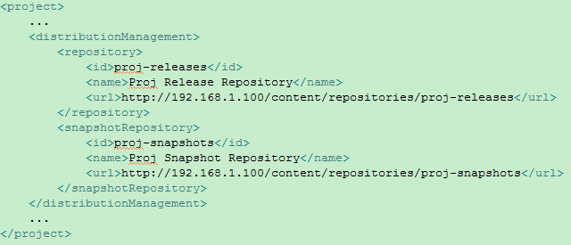
distributionManagement 包含 repository 和 snapshotRepository 子元素，前者表示发布版本构件的仓库，后者表示快照版本的仓库。
往远程仓库部署构件的时候，往往需要认证。配置方式与上文所述一致。
配置正确后，在命令行运行 mvn clean deploy，Maven 就会将项目构建输出的构件部署到配置对应的远程仓库，如果当前项目的版本是快照版本，则部署到快照版本仓库地址，否则就部署到发布版本仓库地址。

### 6.9.10.    从仓库解析依赖的机制

依赖和仓库两者是如何具体联系到一起的？Maven 是根据怎样的规则从仓库解析并使用依赖构件的呢？依赖解析机制可以概括如下：
1.   当依赖的范围是 system 的时候，Maven 直接从本地文件系统解析构件。
2.   根据依赖坐标计算仓库路径后，尝试直接从本地仓库寻找构件，如果发现相应构件，则解析成功。
3.   在本地仓库不存在相应构件的情况下，如果依赖的版本是显式的发布版本构件，则遍历所有的远程仓库，发现后，下载并解析使用。
4.   如果依赖的版本是 RELEASE 或者 LATEST，则基于更新策略读取所有远程仓库的元数据 groupId/artifactId/maven-metadata.xml，将其与本地仓库的对应元数据合并后，计算的 RELEASE 或者 LATEST 真实的值，然后基于这个真实的值检查本地仓库和远程仓库，如步骤 2 和 3。
5.   如果依赖的版本是 SNAPSHOT，则基于更新策略读取所有远程仓库的元数据 groupId/artifactId/maven-metadata.xml，将其与本地仓库的对应元数据合并后，得到最新快照版本的值，然后基于该值检查本地仓库，或者从远程仓库下载。
6.   如果最解析得到的构件版本是时间戳格式的快照，如 1.4.1-20091104，则复制其时间戳格式的文件至非时间戳格式，如 SNAPSHOT，并使用该非时间戳格式的构件。

### 6.9.11.    镜像

如果仓库 X 可以提供仓库 Y 存储的所有内容，那么就可以认为 X 是 Y 的一个镜像。换句话说，任何一个可以从仓库 Y 获得的构件，都能够从它的镜像中获取。例如，[http://maven.net.cn/content/groups/public/](http://maven.net.cn/content/groups/public/)是中央仓库[http://repol.maven.org/maven2/](http://repol.maven.org/maven2/)在中国的镜像，由于地理位置的因素，该镜像可以提供比中央仓库更快的服务，因此，可以配置 Maven 使用该镜像来替代中央仓库，编辑 settings.xml 文件，代码如下：

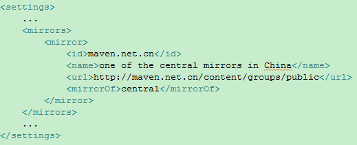
该例中，mirrorOf 的值为 central，表示该配置为中央仓库的镜像，任何对于中央仓库的请求都会转至该镜像，用户也可以使用同样的方法配置其他仓库的镜像。
关于镜像的一个更为常用的用法是结合私服。由于私服可以代理任何外部的公共仓库（包括中央仓库），因此，对于组织内部的 Maven 用户来说，使用一个私服地址就等于使用了所有需要的外部仓库，这可以将配置集中到私服，从而简化 Maven 本身的配置。在这种情况下，任何需要的构件都可以从私服获取，私服就是所有仓库的镜像，如下：

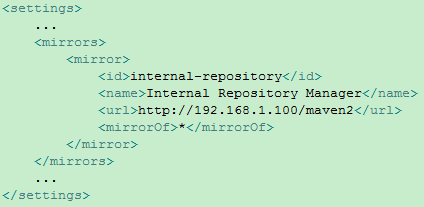
该例中的 mirrorOf 的值为星号，表示该配置是所有 Maven 仓库的镜像，任何对于远程仓库的请求都会被转至[http://192.168.1.100/maven2/](http://192.168.1.100/maven2/)。如果该镜像仓库需要认证，则配置一个 id 为 internal-repository 的 server 即可。
为了满足一些复杂的需求，Maven 还支持更高级的镜像配置：
Ø  <mirrorOf>_</mirrorOf>：匹配所有远程仓库。
Ø  <mirrorOf>external:_</mirrorOf>：匹配所有远程仓库，使用 localhost 的除外，使用 file://协议的除外。也就是说，匹配所有不在本机上的远程仓库。
Ø  <mirrorOf>repo1,repo2</mirrorOf>：匹配仓库 repo1 和 repo2，使用逗号分隔多个远程仓库。
Ø  <mirrorOf>\*,!repo1</mirrorOf>：匹配所有远程仓库，repo1 除外，使用感叹号从匹配中排除。
注意，由于镜像仓库完全屏蔽了被镜像仓库，当镜像仓库不稳定或者停止服务的时候，Maven 将无法访问被镜像仓库，因而将无法下载构件。

### 6.9.12.    仓库搜索服务

使用 Maven 进行日常开发的时候，一个常见的问题就是如何寻找需要的依赖，我们可能只知道需要使用类库的项目名称，但添加 Maven 依赖要求提供确切的 Maven 坐标。这时，就可以使用仓库搜索服务来根据关键字得到 Maven 坐标。

#### 6.9.12.1. Sonatype Nexus

地址：[http://repository.sonatype.org/](http://repository.sonatype.org/)
Nexus 是当前最流行的开源 Maven 仓库管理软件，后面会有专门章节讲述如何使用 Nexus 架设私服。
Nexus 提供了关键字搜索、类名搜索、坐标搜索、校验和搜索等功能。搜索后，页面清晰地列出了结果构件的坐标及所属仓库。用户可以直接下载相应构件，还可以直接复制已经根据坐标自动生成的 XML 依赖声明。

#### 6.9.12.2. Jarvana

地址：[http://www.jarvana.com/jarvana](http://www.jarvana.com/jarvana)
Jarvana 提供了基于关键字、类名的搜索，构件下载、依赖声明片段等功能也一应俱全，值得一提的是，Jarvana 还支持浏览构件内部的内容。此外，Jarvana 还提供了便捷的 Java 文档浏览的功能。

#### 6.9.12.3. MVNbrowser

地址：[http://www.mvnbrowser.com](http://www.mvnbrowser.com)
MVNbrowser 只提供关键字搜索的功能，除了提供基于坐标的依赖声明代码片段等基本功能之外，MVNbrowser 的一大特色就是，能够告诉用户该构件的依赖于其他那些构件以及该构件被那些其他构件依赖。

#### 6.9.12.4. MVNrepository

地址：[http://mvnrepository.com](http://mvnrepository.com)
MVNrepository 提供了基于关键字的搜索、依赖声明代码片段、构件下载、依赖与被依赖关系信息、构件所包含信息等功能。

## 6.10.    生命周期和插件

### 6.10.1.    何为生命周期

Maven 的生命周期是为了对所有的构建过程进行抽象和统一。这个生命周期包含了项目的清理、初始、编译、测试、打包、集成测试、验证、部署和站点生成等几乎有所构建步骤。也就是说，几乎所有项目的构建，都能映射到这样一个生命周期上。
Maven 的生命周期是抽象的，这意味着生命周期本身不做任何实际的工作，在 Maven 的设计中，实际的任务都交由插件来完成。

### 6.10.2.    三套生命周期

它们分别是 clean、default 和 site。clean 生命周期的目的是清理项目，default 生命周期的目的是构建项目，而 site 生命周期的目的是建立项目站点。
每个生命周期包含一些阶段（phase），这些阶段是有顺序的，并且后面的阶段依赖于前面的阶段，用户和 Maven 最直接的交互方式就是调用这些生命周期阶段。以 clean 生命周期为例，它包含的阶段有 pre-clean、clean 和 post-clean。当用户调用 pre-clean 的时候，只有 pre-clean 阶段得以执行；当用户调用 clean 的时候，pre-clean 和 clean 阶段会按以顺序执行；当用户调用 post-clean 的时候，pre-clean、clean 和 post-clean 会得以顺序执行。
三套生命周期本身是相互独立的，当用户调用 clean 生命周期的 clean 阶段，不会触发 default 生命周期的任何阶段，反之亦然。

### 6.10.3.   clean 生命周期

clean 生命周期的目的是清理项目，它包含三个阶段：
1.  pre-clean：执行一些清理前需要完成的工作。
2.  clean：清理上一次构建生成的文件。
3.  post-clean：执行一些清理后需要完成的工作。

### 6.10.4.   default 生命周期

default 生命周期定义了真正构建时所需要执行的所有步骤，它是所有生命周期中最核心的部分，下面只对重要的阶段进行解释：
Ø  validate
Ø  initialize
Ø  generate-sources
Ø  processs-sources：处理项目主资源文件。一般来说，是对 src/main/resources 目录的内容进行变量替换等工作后，复制到项目输出的主 classpath 目录中。
Ø  generate-resources
Ø  processs-resources
Ø  compile：编译项目的主源码。一般来说，是编译 src/main/java/目录下的 Java 文件至项目输出的主 classpath 目录中。
Ø  processs-classes
Ø  generate-test-sources
Ø  processs-test-sources：处理项目测试资源文件。一般来说，是对 src/test/resources 目录的内容进行变量替换等工作后，复制到项目输出的测试 classpath 目录中。
Ø  generate-test-resources
Ø  processs-test-resources
Ø  test-compile：编译项目的测试代码。一般来说，是编译 src/test/java 目录下的 Java 文件至项目输出的测试 classpath 目录中。
Ø  processs-test-classes
Ø  test：使用单元测试，测试代码不会被打包。
Ø  prepare-package
Ø  package：接受编译好的代码，打包成可发布的格式，如 Jar。
Ø  pre-integration-test
Ø  integration-test
Ø  post-integration-test
Ø  verify
Ø  install：将包安装到 Maven 本地仓库，供本地仓库其他 Maven 项目使用。
Ø  deploy：将最终的复制到远程仓库，供其他开发人员和 Maven 项目使用。

### 6.10.5.   site 生命周期

site 生命周期的目的是建立和发布项目站点，Maven 能够基于 POM 所包含的信息，自动生成一个友好的站点，方便团队交流和发布项目信息。该生命周期包含如下阶段：
Ø  pre-site：执行一些在生成项目站点之前需要完成的工作。
Ø  site：生成项目站点文档。
Ø  post-site：执行一些在生成项目站点之后需要完成的工作。
Ø  site-deploy：将生成的项目站点发布到服务器上。

### 6.10.6.    命令行运行生命周期

下面以一些常见的 Maven 命令为例，解释其执行的生命周期阶段：
Ø  $mvn clean：该命令调用clean生命周期的clean阶段。实际执行的阶段为clean生命周期的pre-clean和clean阶段。
Ø  $mvn test：该命令调用 default 生命周期的 test 阶段。实际执行的阶段为 default 生命周期的 validate、initialize 等，直到 test 的所有阶段。这也解释了为什么在执行测试的时候，项目的代码能够自动得到编译。
Ø  $mvn clean install：该命令调用clean生命周期的clean阶段和default生命周期的install阶段。实际执行的阶段为clean生命周期的pre-clean和clean阶段，以及default生命周期的从validate至install的所有阶段。该命令结合了两个生命周期，在执行真正的项目构建之前清理项目是一个很的实践。
Ø  $mvn clean deploy site-deploy：该命令调用 clean 生命周期的 clean 阶段、default 生命周期的 deploy 阶段，以及 site 生命周期的 sit-deploy 阶段。实际执行的阶段为 clean 生命周期的 pre-clean 和 clean 阶段，default 生命周期的所有阶段，以及 site 生命周期的所有阶段。该命令结合了 Maven 所有三个生命周期，且 deploy 为 default 生命周期的最后一个阶段，site-deploy 为 site 生命周期的最后一个阶段。

### 6.10.7.    插件绑定

Maven 的生命周期与插件相互绑定，用以完成实际的构建任务。具体而言，是生命周期的阶段与插件的目标相互绑定，以完成某个具体的构建任务。例如项目编译这一任务，它对应了 default 生命周期的 compile 这一阶段，而 maven-compiler-plugin 这一插件的 compile 目标能够完成该任务。因此，将它绑定，就能实现项目编译的目的。如图所示：

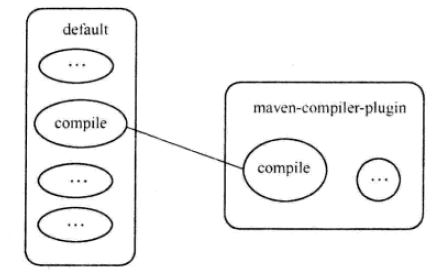

#### 6.10.7.1.  内置绑定

为了能让用户几乎不用任何配置就能构建 Maven 项目，Maven 在核心为一些主要的生命周期阶段绑定了很多插件的目标，当用户通过命令行调用生命周期阶段的时候，对应的插件目标就会执行相应的任务。

#### 6.10.7.2.  自定义绑定

用户能够自己选择将某个插件目标绑定到生命周期的某个阶段上。
一个常见的例子是创建项目的源码 jar 包，内置的插件绑定关系中没有涉及这一任务，因此需要用户自动配置。maven-source-plugin 可以帮我们完成该任务，它的 jar-no-fork 目标能够将项目的主代码打包成 jar 文件，可以将其绑定到 default 生命周期的 verify 阶段上，在执行完成集成测试后和安装构件之前创建源码 jar 包，具体配置如下：

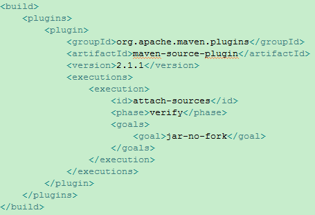
在 POM 的 build 元素下的 plugins 子元素中声明插件的使用，该例中用到的是 maven-source-plugin，其 groupId 为 org.apache.maven.plugins，这也是 Maven 官方插件的 groupId，紧接着 artifactId 为 maven-source-plugin，version 为 2.1.1。对于自定义绑定插件，用户总是应该声明一个非快照版本，这样可以避免由于插件变化造成的构建不稳定性。
上述配置中，除了基本的插件坐标声明外，还有插件执行配置，executions 下每个 execution 子元素可以用来配置执行一个任务。该例中配置了一个 id 为 attach-sources 的任务，通过 phrase 配置，将其绑定到 verify 生命周期阶段上，再通过 goals 配置指定要执行的插件目标。至此，自定义插件绑定完成。运行 mvn verify 即可。
由于很多插件的目标在编写时已经定义了默认绑定阶段，因此可以不需要配置 phase。

### 6.10.8.    插件配置

完成了插件和生命周期的绑定之后，用户还可以配置插件目标的参数，进一步调整插件目标所执行的任务，以满足项目的需求。几乎所有 Maven 插件的目标都有一些可配置的参数，用户可以通过命令行和 POM 配置等方式来配置这些参数。

#### 6.10.8.1.  命令行插件配置

如 maven-surefire-plugin 提供了一个 maven.test.skip 参数，当其值为 true 的时候，就会跳过执行测试，于是，加上如下-D 参数就能跳过测试：$mvn install –D maven.test.skip=true。
参数-D 是 Java 自带的，其功能是通过命令行设置一个 Java 系统属性，Maven 简单地重用了该参数，在准备插件的时候检查系统属性，便实现了插件参数的配置。

#### 6.10.8.2. POM 中插件全局配置

并不是所有的插件参数都适合从命令行配置，有些参数的值从项目创建到项目发布都不会改变，或者说很少改变，对于这种情况，在 POM 文件中一次性配置就显然比重复在命令行输入要方便。
用户可以在声明插件的时候，对此插件进行一个全局的配置，也就是说，所有基于该插件目标的任务，都会使用这些配置。例如，我们通常会需要配置 maven-compiler-plugin 告诉它编译的源文件，生成与 JVM1.5 兼容的字节码文件，如下所示：

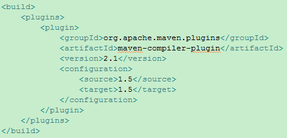
这样，不管绑定到 compile 阶段的 maven-compiler-plugin:compile 任务，还是绑定到 test-compiler 阶段的 maven-compiler-plugin:testCompiler 任务，就都能使用该配置，基于 Java1.5 版本进行编译。

#### 6.10.8.3. POM 插件任务配置

除了为插件配置全局的参数，用户还可以为某个插件配置特定的参数。以 maven-antrun-plugin 为例，它有一个目标 run，可以用来在 Maven 中调用 Ant 任务。用户将 maven-antrun-plugin:run 绑定到多个生命周期阶段上，再加以不同的配置，就可以让 Maven 在不同的生命阶段执行不同的任务。如下代码所示：

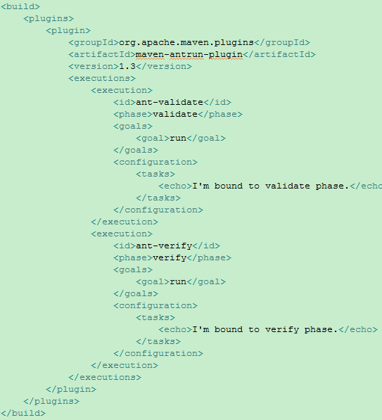
首先，maven-antrun-plugin:run 与 validate 阶段绑定，从而构成一个 id 为 ant-validate 的任务。插件全局配置中的 configreation 元素位于 plugin 元素下面，而这里的 configuration 元素则位于 execution 元素下，表示这是特定任务的配置，而非插件整体的配置。这个 ant-validate 任务配置了一个 echo Ant 任务，向命令行输出一段文字，表示该任务是绑定到 validate 阶段的。第二个任务的 id 为 ant-verify，它绑定到了 verify 阶段，同样它也输出一段文字到命令行，告诉该任务绑定到了 verify 阶段。

#### 6.10.8.4.  获取插件信息

1.   在线插件信息
基本上所有主要的 Maven 插件都来自 Apache 和 Codehaus。详细的列表可以在这个地址得到：
[http://maven.apache.org/plugins/index.html](http://maven.apache.org/plugins/index.html)
所有官方插件下载地址：[http://repo1.maven.org/maven2/org/apache/maven/plugins](http://repo1.maven.org/maven2/org/apache/maven/plugins)
Codehaus 上的 Mojo 项目也提供了大量插件：[http://mojo.codehaus.org/plugins.html](http://mojo.codehaus.org/plugins.html)
下载地址：[http://repository.codehaus.org/org/codehaus/mojo/](http://repository.codehaus.org/org/codehaus/mojo/)
Codehaus 插件的文档和可靠性相对较差。
2.   使用 maven-help-plugin 描述插件
除了访问在线的插件文档之外，还可以借助 maven-help-plugin 来获取插件的详细信息。运行如下命令：
$mvn help:describe –D plugin=org.apache.maven.plugins:maven-compiler-plugin:2.1
这里执行的是 maven-help-plugin 的 describe 目标，在参数 plugin 中输入需要描述插件的 groupId、artifactId 和 version。Maven 命令行输出 maven-compiler-plugin 的简要信息，包括插件的坐标、目标和目标等。
目标前缀（Goal Prefix），其作用是方便在命令行直接运行插件。

#### 6.10.8.5.  从命令行调用插件

可以在命令行运行 mvn –h 来显示 mvn 命令帮助。
通过 mvn 命令激活生命周期阶段，从而执行那些绑定在生命周期阶段上的插件目标。但 Maven 还支持直接从命令行调用插件目标。
为了使命令更简洁，更容易记忆和使用，Maven 引入了目标前缀的概念，help 是 maven-help-plugin 的目标前缀，dependency 是 maven-dependency-plugin 的前缀，有了目标前缀，Maven 就能找到对应的 artifactId，不过，除了 artifactId，Maven 还需要得到 groupId 和 version 才能精确定位到某个插件。如下示例：
$mvn org.apache.maven.plugins:maven-dependency-plugin:2.1:tree
$mvn dependency:tree

#### 6.10.8.6.  插件解析机制

1.   插件仓库
与依赖构件一样，插件仓库同样基于坐标存储于 Maven 仓库中。在需要的时候，Maven 会从本地仓库寻找插件，如果不存在，则从远程仓库查找。查找插件之后，再下载到本地仓库使用。
Maven 会区别对待插件的远程仓库和依赖的远程仓库。
不同于 repositories 及其 repository 子元素，插件的远程仓库使用 pluginRepositories 和 pluginRepository 配置。例如，Maven 内置了如下的插件远程仓库配置：

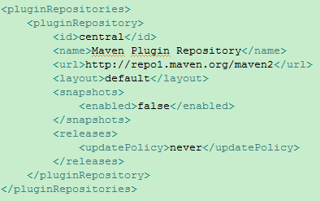

## 6.11.    使用 Nexus 创建私服

通过建立自己的私服，可以降低中央仓库负荷、节省外网带宽、加速 Maven 构建、自己部署构件等，从而高效地使用 Maven。
有三种专门的 Maven 仓库管理软件可以用来建立私服：Apache 的 Archiva、JFrog 的 Artifactory 和 Sonatype 的 Nexus。

### 6.11.1.    安装 Nexus

Nexus 是典型的 Java Web 应用，它有两种安装包，一种是包含 Jetty 容器的 Bundle 包，另一种是不包含 Web 容器的 war 包。
Ø  Bundle 方式安装 Nexus

# 7.     POM 元素参考

| **元素名称**                                  | **说明**                             |
| --------------------------------------------- | ------------------------------------ |
| <project>                                     | POM 的 XML 根元素                    |
| <parent>                                      | 声明继承                             |
| <modules>                                     | 声明聚合                             |
| <groupId>                                     | 坐标元素之一                         |
| <artifactId>                                  | 坐标元素之一                         |
| <version>                                     | 坐标元素之一                         |
| <packaging>                                   | 坐标元素之一，默认值 jar             |
| <name>                                        | 名称                                 |
| <description>                                 | 描述                                 |
| <organization>                                | 所属组织                             |
| <licenses> <license>                          | 许可证                               |
| <mailingLists> <mailingList>                  | 邮件列表                             |
| <developers> <developer>                      | 开发者                               |
| <contributors> <contributor>                  | 贡献者                               |
| <issueManagement>                             | 问题追踪系统                         |
| <ciManagement>                                | 持续集成系统                         |
| <scm>                                         | 版本控制系统                         |
| <prerequisites> <maven>                       | 要求 Maven 最低版本，默认值 2.0      |
| <build> <sourceDirectory>                     | 主源码目录                           |
| <build> <scriptSourceDirrectory>              | 脚本源码目录                         |
| <build> <testSourceDirectory>                 | 测试源码目录                         |
| <build> <outputDirectory>                     | 主源码输出目录                       |
| <build> <testOutputDirectory>                 | 测试源码输出目录                     |
| <build> <resources> <resource>                | 主资源目录                           |
| <build> <testResources> <testResource>        | 测试资源目录                         |
| <build> <fileName>                            | 输出主构件的名称                     |
| <build> <directory>                           | 输出目录                             |
| <build> <filters> <filter>                    | 通过 properties 文件定义资源过滤属性 |
| <build> <extensions> <extension>              | 扩展 Maven 的核心                    |
| <build> <pluginManagement>                    | 插件管理                             |
| <build> <plugins> <plugin>                    | 插件                                 |
| <profiles> <profile>                          | POM Profile                          |
| <distributionManagement> <repository>         | 发布版本部署仓库                     |
| <distributionManagement> <snapshotRepository> | 快照版本部署仓库                     |
| <distributionManagement> <site>               | 站点部署                             |
| <repositories> <repository>                   | 仓库                                 |
| <pluginRepositories> <pluginRepository>       | 插件仓库                             |
| <dependencies> <dependency>                   | 依赖                                 |
| <dependencyManagement>                        | 依赖管理                             |
| <properties>                                  | Maven 属性                           |
| <reporting> <plugins>                         | 报告插件                             |

# 8.     Settings 元素参考

| **元素名称**                     | **说明**                          |
| -------------------------------- | --------------------------------- |
| <settings>                       | settings.xml 文档的根元素         |
| <localRepository>                | 本地仓库                          |
| <interactiveMode>                | Maven 是否与用户交互，默认值 true |
| <offline>                        | 离线模式，默认值 false            |
| <pluginGroups> <pluginGroup>     | 插件组                            |
| <servers> <server>               | 下载与部署仓库的认证信息          |
| <mirrors> <mirror>               | 仓库镜像                          |
| <proxies> <prosy>                | 代理                              |
| <profiles> <profile>             | Settings Profile                  |
| <activeProfiles> <activeProfile> | 激活 Profile                      |

# 9.     Maven+Intellij IDEA

之所以选择 Intellij IDEA，是因为 Maven+Eclipse 实在太难用了。Eclipse 有两个 Maven 插件 m2eclipse 和 EclipseIAM，但是由于 Eclipse 和 maven 设计上的矛盾，这两个插件可能都达不到想要的效果。m2eclipse 会把所有类型的项目都视为 Maven 类型项目，这对于一个单纯的 Java 项目或许可能，对于一个 J2EE 或 WEB 项目都是一场灾难。EclipseIAM 并不会改变项目类型，但是他提供的功能也就仅仅限于编辑和运行 POM 文件了，甚至连依赖性都管理不了。相比之下，如果非要用 Eclipse 的话还是推荐使用 EclipseIAM。
Maven+Intellij IDEA 优势：
Ø   一切都是 Module：IntelliJ IDEA 借签了 Maven 概念，不再采取 Eclipse 里的 Project 概念，一切都是 Module。无论是否使用 Maven，你的项目都是一个独立的 Module，并且你可以混搭使用 Maven Module 和普通的 Jave Module，两者可以和谐共存。
Ø   支持 Multi-module：可以说 Maven 的项目结构设计是非常严格的，现实应用中你必须用到 Parent-Child 的模式。Eclipse 由于不支持在一个 Project 上建立 Sub-Project，因此无论如何目前都不能实现。Intellij IDEA 可以完美的实现这个设计，并且无论是 Module 属性里，还是彼此的依赖性上都不会出现问题。
Ø   更方便的生命周期操作：比起 Eclipse 通通放进右键菜单的行为，Intellij IDEA 有着单独的窗口可以完成 Maven 操作。你可以针对不同 Module 进行 Clean、Compile、Package、Install 等操作，各个 Plug-in 的操作也一清二楚。
Ø   完美的依赖性管理：由于 Maven 会把所有依赖的包放在本机的一个目录下，所以实际上是脱离 Project 本身存在的。Intellij IDEA 引入一个 External Library 的概念，所有 Maven 依赖性都会放在这里，和项目自带的库区分开，并且 Module 之间会智能的判断，你不需要 Maven Install 来引用代码的更新。
Ø   动态更新：每当 Maven 相关的设置更改时，如修改了 POM 的依赖性，添加删除 Module，Intellij IDEA 会提示你进行更新，这种更新实际上就是运行了 Maven，所以你不需要手动运行 Maven Compile 来进行平板更新，也不会像 Eclipse 里遇到莫名其妙的问题。

# 10. IDEA 常用快捷键

| **说明**      | **快捷键**  | **说明**   | **快捷键** | **说明** | **快捷键** |
| ------------- | ----------- | ---------- | ---------- | -------- | ---------- |
| 编译代码      | Ctrl+F9     | 格式化代码 | Alt+Ctrl+L | 全局搜索 | Ctrl+H     |
| 格式化 Import | Alt+Shift+O |
| Alt+Ctrl+O    | 代码注释    | Ctrl+/     |
| Ctrl+Shift+/  | 全局替换    | Ctrl+Alt+R |
| 删除行        | Ctrl+X      | 生成代码   | Alt+Insert | 查找替换 | Ctrl+F     |
| 打开设置窗口  | Ctrl+Alt+S  |            |            |          |            |


