# Git及Github

```bash

# 生成key，在命令行里面填写文件名，多个key使用用户名进行区分， 如： id_rsa_vongdefu
ssh-keygen -t ed25519 -C "your.email@example.com"


# 为每一个仓库设置用户名和邮箱
#   只需要在仓库目录下执行即可
git config user.name "Your Name"
git config user.email "your.email@example.com"
#   之后在 .git/config 可以看到设置后的用户名和邮箱

# 全局配置，最好不要进行这个操作
git config --global user.name zeanzai
git config --global user.email "zeanzai.me@gmail.com"
git config --global http.proxy 127.0.0.1:7890

# 注意：如果是需要身份验证的，就用这种格式：
git config --global http.proxy 用户名:密码@IP:端口
# 如果需要设置https，那么就需要把 http.proxy 改成 https.proxy
git config --global https.proxy 127.0.0.1:7890

# 查看一下配置
git config --global --list


# 测试
ssh -T git@github.com
ssh -T git@gitee.com

# 使用git克隆私有仓库
git clone --branch master https://x-access-token:${{ secrets.PAT_TOKEN }}@github.com/vongdefu/vongdefu-dochub.git vongdefu-dochub

# ssh
ssh-copy-id -i ./id_ed25519.pub root@192.168.1.150

# 空仓库
mkdir test
cd test
git init 
touch README.md
git add README.md
git commit -m "first commit"
git remote add origin https://gitee.com/zeanzai/test.git
git push -u origin "master"

# 已有仓库
cd existing_git_repo
git remote add origin https://gitee.com/zeanzai/test.git
git push -u origin "master"

# 分支管理
## 创建并切换到新分支
git checkout -b ${{branch_name}} 

## 删除分支

```

## 克隆GitHub私有仓库

1. 需要在**用户的配置页面**中配置一个PAT（personal access token）；
2. 在 仓库的url中配置上这个PAT ： 见上面
3. 如果私有仓库需要使用GitHubActions，则还需要
   1. 根据 peaceiris/actions-gh-pages@v3 的[要求](https://github.com/peaceiris/actions-gh-pages)，在**仓库的setting中**设置 action 的权限，设置为可读写
   2. 在**仓库的setting中**配置上面这个生成的 PAT ；


## 合并提交记录

```
# 1. 拉取最新代码
git checkout master
git pull origin master

# 2. 启动交互式 rebase（假设要合并全部提交）
git rebase -i --root

# 3. 在打开的编辑器中：
# 将第一个提交前的 "pick" 保留
# 其他所有提交前的 "pick" 改为 "squash" 或简写 "s"
# 保存退出编辑器

# 4. 处理合并提交信息（会打开新编辑器）
# 删除所有旧提交信息，写入新提交信息
# 保存退出

# 5. 强制推送更新（⚠️ 重要警告：这会重写历史）
git push origin master --force
```


---


1. Git 架构


```
zeanzai@DESKTOP-BTBMQTM MINGW64 /d/02.sourcecode/Github/atguigu-gulimall/docs/课件/01-基础篇
$ git
usage: git [-v | --version] [-h | --help] [-C <path>] [-c <name>=<value>]
           [--exec-path[=<path>]] [--html-path] [--man-path] [--info-path]
           [-p | --paginate | -P | --no-pager] [--no-replace-objects] [--bare]
           [--git-dir=<path>] [--work-tree=<path>] [--namespace=<name>]
           [--config-env=<name>=<envvar>] <command> [<args>]

These are common Git commands used in various situations:

start a working area (see also: git help tutorial)
   clone     Clone a repository into a new directory
   init      Create an empty Git repository or reinitialize an existing one

work on the current change (see also: git help everyday)
   add       Add file contents to the index
   mv        Move or rename a file, a directory, or a symlink
   restore   Restore working tree files
   rm        Remove files from the working tree and from the index

examine the history and state (see also: git help revisions)
   bisect    Use binary search to find the commit that introduced a bug
   diff      Show changes between commits, commit and working tree, etc
   grep      Print lines matching a pattern
   log       Show commit logs
   show      Show various types of objects
   status    Show the working tree status

grow, mark and tweak your common history
   branch    List, create, or delete branches
   commit    Record changes to the repository
   merge     Join two or more development histories together
   rebase    Reapply commits on top of another base tip
   reset     Reset current HEAD to the specified state
   switch    Switch branches
   tag       Create, list, delete or verify a tag object signed with GPG

collaborate (see also: git help workflows)
   fetch     Download objects and refs from another repository
   pull      Fetch from and integrate with another repository or a local branch
   push      Update remote refs along with associated objects

'git help -a' and 'git help -g' list available subcommands and some
concept guides. See 'git help <command>' or 'git help <concept>'
to read about a specific subcommand or concept.
See 'git help git' for an overview of the system.


```

2. 全局配置
   1. 查询全局配置项
   2. 配置用户名和邮箱
3. 克隆
4. 获取远程更新
5. 提交到远程
   1. add
   2. commit
   3. push
6. 查询远程配置信息
7. 

8. 


---


**配置操作 **
**全局配置 **
git config --global user.name '你的名字' 
git config --global user.email '你的邮箱' 

**当前仓库配置 **
git config --local user.name '你的名字' 
git config --local user.email '你的邮箱' 

**查看 global 配置 **
git config --global --list 
**查看当前仓库配置 **
git config --local --list 
**删除 global 配置 **
git config --unset --global 要删除的配置项 
**删除当前仓库配置 **
git config --unset --local 要删除的配置项**本地操作 **
**查看变更情况 **
git status 
**将当前目录及其子目录下所有变更都加入到暂存区 **
git add . 
**将仓库内所有变更都加入到暂存区 **
git add -A 
**将指定文件添加到暂存区 **
git add 文件1 文件2 文件3 
**比较工作区和暂存区的所有差异 **
git diff 
**比较某文件工作区和暂存区的差异 **
git diff 文件 
**比较暂存区和 HEAD 的所有差异 **
git diff --cached 
**比较某文件暂存区和 HEAD 的差异 **
git diff --cached 文件 
**比较某文件工作区和 HEAD 的差异 **
git diff HEAD 文件 
**创建 commit **
git commit 
**将工作区指定文件恢复成和暂存区一致 **
git checkout 文件1 文件2 文件3 
**将暂存区指定文件恢复成和 HEAD 一致 **
git reset 文件1 文件2 文件3 
**将暂存区和工作区所有文件恢复成和 HEAD 一样 **
git reset --hard 
**用 difftool 比较任意两个 commit 的差异**git difftool 提交1 提交2 
**查看哪些文件没被 Git 管控 **
git ls-files --others 
**将未处理完的变更先保存到 stash 中 **
git stash 
**临时任务处理完后继续之前的工作 **
pop 不保留 stash 
apply 保留 stash 
git stash pop 
git stash apply 
**查看所有 stash **
git stash list 
**取回某次 stash 的变更 **
git stash pop stash@{数字n} 
**优雅修改最后一次 commit **
git add. 
git commit --amend 
**分支操作 **
**查看当前工作分支及本地分支 **
git branch -v 
**查看本地和远端分支 **
git branch -av 
**查看远端分支 **
git branch -rv 
**切换到指定分支 **
git checkout 指定分支 
**基于当前分支创建新分支 **
git branch 新分支 
**基于指定分支创建新分支**git branch 新分支 指定分支 
**基于某个 commit 创建分支 **
git branch 新分支 某个 commit 的 id 
**创建并切换到该分支 **
git checkout -b 新分支 
**安全删除本地某分支 **
git branch -d 要删除的分支 
**强行删除本地某分支 **
git branch -D 要删除的分支 
**删除已合并到 master 分支的所有本地分支 **
git branch --merged master | grep -v '^\*\| master' | xargs -n 1 git branch -d 
**删除远端 origin 已不存在的所有本地分支 **
git remote prune orign 
**将 A 分支合入到当前分支中且为 merge 创建 commit **
git merge A分支 
**将 A 分支合入到 B 分支中且为 merge 创建 commit **
git merge A分支 B分支 
**将当前分支基于 B 分支做 rebase，以便将B分支合入到当前分支 **
git rebase B分支 
**将 A 分支基于 B 分支做 rebase，以便将 B 分支合入到 A 分支 **
git rebase B分支 A分支 
**变更历史 **
**当前分支各个 commit 用一行显示 **
git log --oneline 
**显示就近的 n 个 commit **
git log -n 
**用图示显示所有分支的历史 **
git log --oneline --graph --all**查看涉及到某文件变更的所有 commit **
git log 文件 
**某文件各行最后修改对应的 commit 以及作者 **
git blame 文件 
**标签操作 **
**查看已有标签 **
git tag 
**新建标签 **
git tag v1.0 
**新建带备注标签 **
git tag -a v1.0 -m '前端食堂' 
**给指定的 commit 打标签 **
git tag v1.0 commitid 
**推送一个本地标签 **
git push origin v1.0 
**推送全部未推送过的本地标签 **
git push origin --tags 
**删除一个本地标签 **
git tag -d v1.0 
**删除一个远端标签 **
git push origin :refs/tags/v1.0 
**远端交互 **
**查看所有远端仓库 **
git remote -v 
**添加远端仓库 **
git remote add url 
**删除远端仓库 **
git remote remove remote的名称**重命名远端仓库 **
git remote rename 旧名称 新名称 
**将远端所有分支和标签的变更都拉到本地 **
git fetch remote 
**把远端分支的变更拉到本地，且 merge 到本地分支 **
git pull origin 分支名 
**将本地分支 push 到远端 **
git push origin 分支名 
**删除远端分支 **
git push remote --delete 远端分支名 
git push remote :远端分支名


[Git常用命令面试题 60道.pdf](https://www.yuque.com/attachments/yuque/0/2024/pdf/29433025/1714797565446-de96130d-879d-4ece-bc88-eaa5d5c88c91.pdf?_lake_card=%7B%22src%22%3A%22https%3A%2F%2Fwww.yuque.com%2Fattachments%2Fyuque%2F0%2F2024%2Fpdf%2F29433025%2F1714797565446-de96130d-879d-4ece-bc88-eaa5d5c88c91.pdf%22%2C%22name%22%3A%22Git%E5%B8%B8%E7%94%A8%E5%91%BD%E4%BB%A4%E9%9D%A2%E8%AF%95%E9%A2%98%2060%E9%81%93.pdf%22%2C%22size%22%3A435466%2C%22ext%22%3A%22pdf%22%2C%22source%22%3A%22%22%2C%22status%22%3A%22done%22%2C%22download%22%3Atrue%2C%22taskId%22%3A%22ud27565a0-dc6c-4734-b6b2-aa7bb836d7a%22%2C%22taskType%22%3A%22upload%22%2C%22type%22%3A%22application%2Fpdf%22%2C%22__spacing%22%3A%22both%22%2C%22id%22%3A%22uf45ecd82%22%2C%22margin%22%3A%7B%22top%22%3Atrue%2C%22bottom%22%3Atrue%7D%2C%22card%22%3A%22file%22%7D)


## 更换 main 分支为 master

1. 修改默认分支为 master


2. 修改本地分支


```java
git branch -m main master
git fetch origin
git branch -u origin/master master
git remote set-head origin -a

```


## mac 上使用 idea 上传代码到远程出错

问题：使用 idea 向远程组织内的某个仓库提交代码报错。

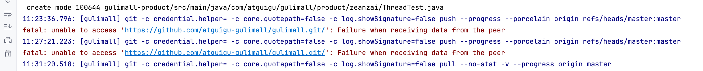

问题描述：在使用 iterm 克隆一个组织内的仓库并没有问题，导入到 idea ，修改后再次提交却出现了问题。原因是组织内仓库的提交过程与原本单属于自己的游离仓库的提交过程不一样。我们在 idea 的提交窗口中，发现需要我们先进行认证，我们点开 idea 中弹出的浏览器窗口，会自动完成认证。但是再次提交时，依然会报上面的问题。这是因为我们点击的认证过程，只是告诉 GitHub 我们要使用 idea 进行开发项目了。但是由于组织是默认开启严格的 OAuth app 权限限制的，因此我们还需要把 idea 与我们的组织关联起来。

问题解决：

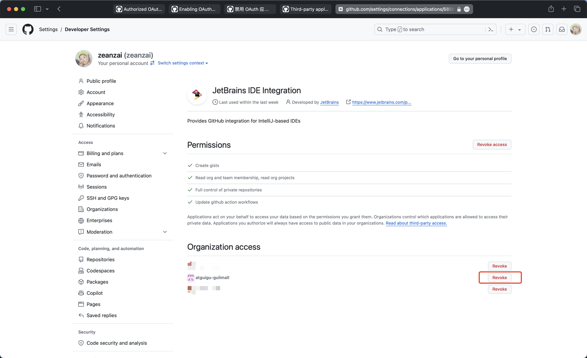

结果如下：


 Appendix： GitHub 已经认证过的 app

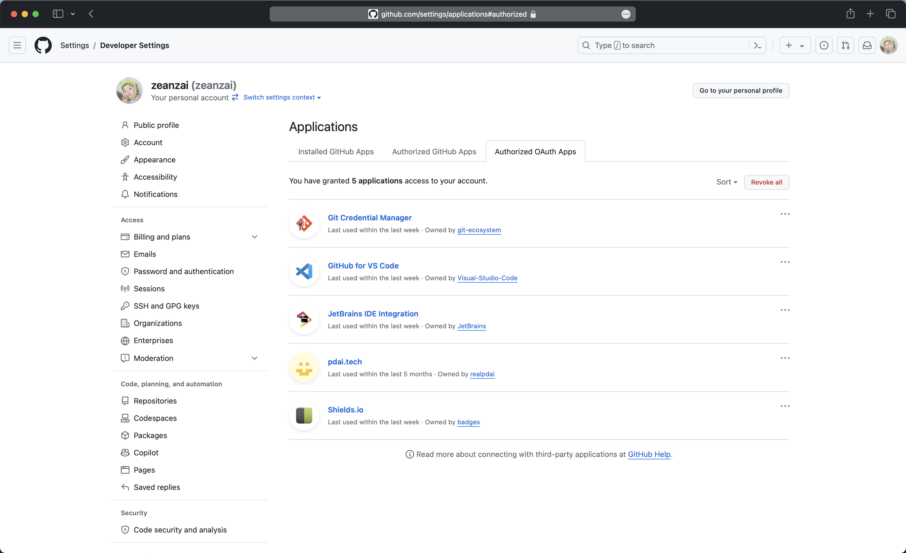


---


Git 使用

# 1 概述

## 1.1 Window 下面的安装

下面是比较重要的安装步骤，做简单说明。

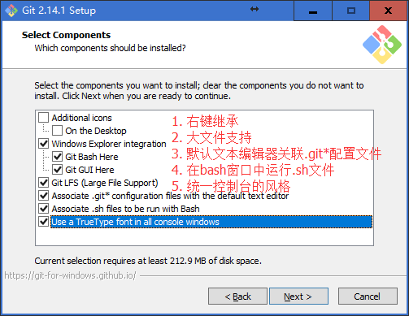

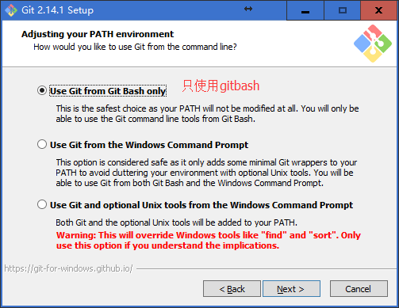

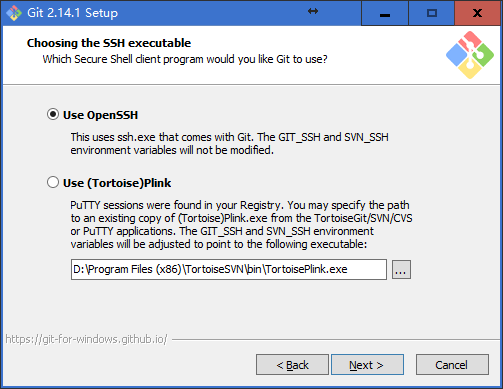

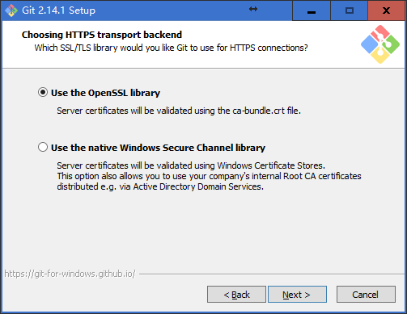

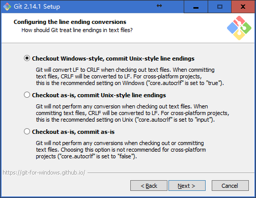

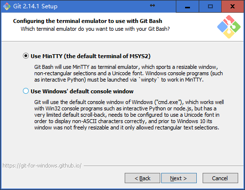

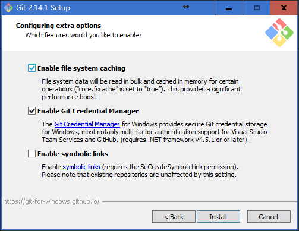

## 1.2 基本概念

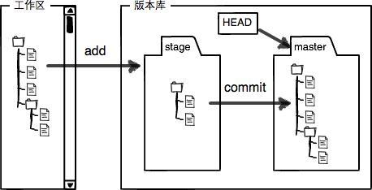

### 1.2.1 工作区

### 1.2.2 暂存区

### 1.2.3 版本库

## 1.3 命令规律

可以参考 Linux 命令的使用。

# 2 Git 的基本操作

## 2.1 基本设置

在工作目录下面右键，打开 GitBash，执行【git config –global user.name “yourName”】和【git config –global user.email “438123371@qq.com”】命令。

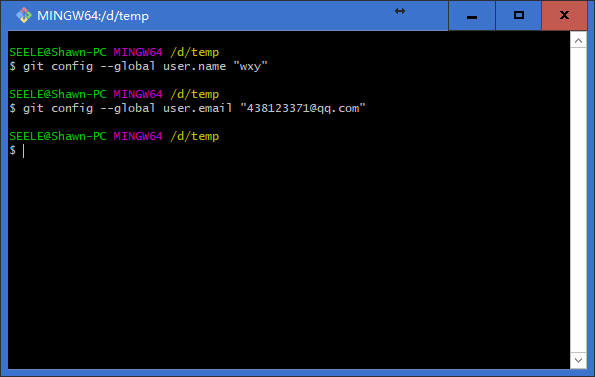
执行完成之后可以发现在用户目录下面生成一个.gitconfig 文件。当然，如果以后想要修改这两个变量的值，也可以直接在这个文件中直接修改。
在 C:\Users\SEELE 目录下面生成.gitconfig 文件

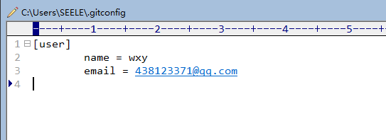

## 2.2 应用一

假如有一个工作场景：将文件夹 learngit 下的 testGit.txt 文件【testGit.txt 文件中有一句“hello git”内容】上传到 Git 上面去。

### 2.2.1 创建目录

在工作目录下面建立 learngit 文件夹，有两种方式，第一种方式使用 GitBash 的 mkdir 命令进行创建；第二种方式是直接使用系统创建。

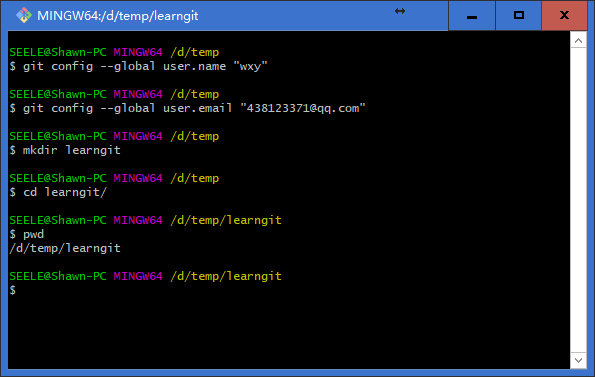

### 2.2.2 创建版本库

在工作目录区域，执行【git init】命令，就可以初始化一个版本库。在初始化的地方，git 会生成一个.git 文件夹，默认是隐藏状态的，里面是 Git 版本库，不可以修改！


### 2.2.3 创建文件

直接使用编辑器创建一个 testGit.txt 文件，并在里面写上“hello git”。当然，也可以使用 Linux 上面的 vi 命令进行创建。

### 2.2.4 添加到暂存区

使用 git add 命令进行添加，将文件添加到暂存区。

### 2.2.5 上传

使用 git commit 命令进行上传，将文件上传到版本库中。

### 2.2.6 查看暂存区和版本库的差别

使用 git status 命令查看暂存区和版本库之间的差别。

### 2.2.7 总结

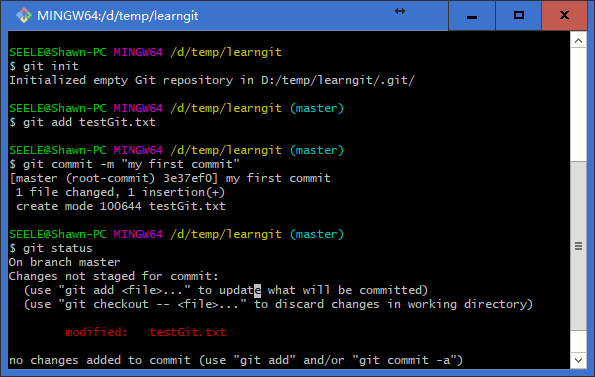

### 2.2.8 查看状态

| SEELE@Shawn-PC MINGW64 /d/temp/learngit (master)
$ git status
On branch master
Changes not staged for commit:
(use "git add <file>..." to update what will be committed)
(use "git checkout -- <file>..." to discard changes in working directory)
modified: testGit.txt
no changes added to commit (use "git add" and/or "git commit -a") |
| --- |

### 2.2.9 查看历史

| SEELE@Shawn-PC MINGW64 /d/temp/learngit (master)
$ git log
commit 3e37ef0a11324568c188b513467dbe19a71761ba (HEAD -> master)
Author: wxy <438123371@qq.com>
Date: Sat Sep 23 20:27:06 2017 +0800
my first commit |
| --- |

## 2.3 应用二

假设另一个应用场景：对 testGit.txt 文件进行修改，添加一个行“hello git commit”，提交到版本库。

### 2.3.1 添加到暂存区

| SEELE@Shawn-PC MINGW64 /d/temp/learngit (master)
$ git add testGit.txt
SEELE@Shawn-PC MINGW64 /d/temp/learngit (master) |
| --- |

### 2.3.2 提交前查看状态

| SEELE@Shawn-PC MINGW64 /d/temp/learngit (master)
$ git status
On branch master
Changes to be committed:
(use "git reset HEAD <file>..." to unstage)
modified: testGit.txt |
| --- |

### 2.3.3 提交

| SEELE@Shawn-PC MINGW64 /d/temp/learngit (master)
$ git commit -m "my second commit"
[master 6541d54] my second commit
1 file changed, 3 insertions(+), 1 deletion(-) |
| --- |

### 2.3.4 提交后查看状态

| SEELE@Shawn-PC MINGW64 /d/temp/learngit (master)
$ git status
On branch master
nothing to commit, working tree clean |
| --- |

### 2.3.5 查看提交日志

| SEELE@Shawn-PC MINGW64 /d/temp/learngit (master)
$ git log
commit 6541d547efc1307a656318b16af565319a18ccab (HEAD -> master)
Author: wxy <438123371@qq.com>
Date: Sat Sep 23 21:01:36 2017 +0800
my second commit
commit 3e37ef0a11324568c188b513467dbe19a71761ba
Author: wxy <438123371@qq.com>
Date: Sat Sep 23 20:27:06 2017 +0800
my first commit |
| --- |

## 2.4 应用三

假设在 testGit.txt 文件中再次添加一行“test git again”，然后将文件添加到暂存区，并进行提交。提交完成之后再次修改 testGit.txt 文件，再最后再添加一行“git diff”。

### 2.4.1 添加到暂存区

| SEELE@Shawn-PC MINGW64 /d/temp/learngit (master)
$ git add testGit.txt |
| --- |

### 2.4.2 提交

| SEELE@Shawn-PC MINGW64 /d/temp/learngit (master)
$ git commit -m "my third commit"
[master 34608c1] my third commit
1 file changed, 2 insertions(+) |
| --- |

### 2.4.3 查看提交日志

| SEELE@Shawn-PC MINGW64 /d/temp/learngit (master)
$ git log
commit 34608c1ebc20af9156d08f0336af82f1e1eb364b (HEAD -> master)
Author: wxy <438123371@qq.com>
Date: Sat Sep 23 21:20:10 2017 +0800
my third commit
commit 6541d547efc1307a656318b16af565319a18ccab
Author: wxy <438123371@qq.com>
Date: Sat Sep 23 21:01:36 2017 +0800
my second commit
commit 3e37ef0a11324568c188b513467dbe19a71761ba
Author: wxy <438123371@qq.com>
Date: Sat Sep 23 20:27:06 2017 +0800
my first commit |
| --- |

### 2.4.4 工作目录与版本库差别

提交完成之后再在文件末尾添加一个一行“git diff”，然后使用【git diff】命令进行查看。

| SEELE@Shawn-PC MINGW64 /d/temp/learngit (master)
$ git diff testGit.txt
**diff --git a/testGit.txt b/testGit.txt**
**index d1ab116..df4b2f0 100644**
**--- a/testGit.txt**
**+++ b/testGit.txt**
@@ -3,3 +3,7 @@ hello git!
hello git commit
test git again

-
- +git diff
- |
  | --- |

也可以加参数：

| SEELE@Shawn-PC MINGW64 /d/temp/learngit (master)
$ git diff HEAD -- testGit.txt
**diff --git a/testGit.txt b/testGit.txt**
**index d1ab116..df4b2f0 100644**
**--- a/testGit.txt**
**+++ b/testGit.txt**
@@ -3,3 +3,7 @@ hello git!
hello git commit
test git again

-
- +git diff
- |
  | --- |

# 3 命令总结

| git config | 设置                     |
| ---------- | ------------------------ |
| git init   | 初始化版本库             |
| git add    | 将文件添加到暂存区       |
| git commit | 提交文件到版本库         |
| git status | 查看版本库和暂存区的差别 |
| Git log    |                          |
| Git diff   |                          |
|            |                          |
|            |                          |
|            |                          |
|            |                          |
|            |                          |
|            |                          |
|            |                          |
|            |                          |
|            |                          |
|            |                          |
|            |                          |
|            |                          |
|            |                          |
|            |                          |
|            |                          |
|            |                          |
|            |                          |
|            |                          |
|            |                          |
|            |                          |

# 4 Git 基础

## 4.1 获取 git 仓库

### 4.1.1 在空目录下初始化仓库

### 4.1.2 在已有目录下面初始化仓库

### 4.1.3 克隆已有的远程仓库

## 4.2 记录每次更新到仓库

### 4.2.1 工作区、暂存区、仓库概念

### 4.2.2 仓库中文件的状态

| Untracked  | 未被追踪的文件。即从未添加到仓库中，只存在于工作目录的文件 |
| ---------- | ---------------------------------------------------------- |
| Unmodified | 跟仓库中没有差别文件。                                     |

1.从仓库克隆下来还没有进行过更新的文件； 2.从仓库中克隆下来经过更新又重新提交到仓库没有更新的文件 |
| Modified | 跟仓库有差别的还未添加到暂存区中的文件。 |
| Staged | 暂存区上面的文件。 |

### 4.2.3 检查当前文件状态

### 4.2.4 忽略文件

### 4.2.5 查看已暂存和未暂存的修改

git diff
git diff --cached 
git diff --staged

### 4.2.6 提交更新

### 4.2.7 跳过使用暂存区直接提交

### 4.2.8 移除文件

#### 4.2.8.1 移除本地文件式

##### 4.2.8.1.1 未添加到暂存区

如果想要移除未添加到暂存区的文件时，使用 git rm，然后使用 git commit 提交即可。

##### 4.2.8.1.2 已添加到暂存区

如果想要移除已经添加到暂存区的文件时，使用 git rm –f，然后 git commit 提交即可。

#### 4.2.8.2 不移除本地文件式

$ git rm --cached README

### 4.2.9 移动文件

## 4.3 查看提交历史

## 4.4 撤销操作

### 4.4.1 合并式提交

如果某次提交时漏提交或多提交一些文件，可以使用 git commit --amend
如漏提交：git commit、git add、git commit --amend，提交->添加到暂存->再次提交
如多提交：git commit、git rm、 git commit --amend，提交->删除暂存中多提交的文件->再次提交。

### 4.4.2 取消暂存文件

### 4.4.3 撤销对文件的修改

## 4.5 远程仓库的使用【git remote】

### 4.5.1 查看远程仓库

git remote

git remote -v

### 4.5.2 添加远程仓库

git remote add <shortname> <url>

拉取别人库中有但你自己库中没有的
$ git fetch [remote-name]

### 4.5.3 推送到远程仓库

git push [remote-name] [branch-name]

### 4.5.4 查看远程仓库

git remote show [remote-name]

### 4.5.5 远程仓库的移除和重命名

git remote rename

## 4.6 打标签【git tag】

标签它只是一个特定提交的引用。

## 4.7 Git 别名

[https://git-scm.com/book/zh/v2/Git-%E5%88%86%E6%94%AF-%E5%88%86%E6%94%AF%E7%AE%80%E4%BB%8B](https://git-scm.com/book/zh/v2/Git-%25E5%2588%2586%25E6%2594%25AF-%25E5%2588%2586%25E6%2594%25AF%25E7%25AE%2580%25E4%25BB%258B)

[http://git.oschina.net/progit/1-%E8%B5%B7%E6%AD%A5.html](http://git.oschina.net/progit/1-%25E8%25B5%25B7%25E6%25AD%25A5.html)


