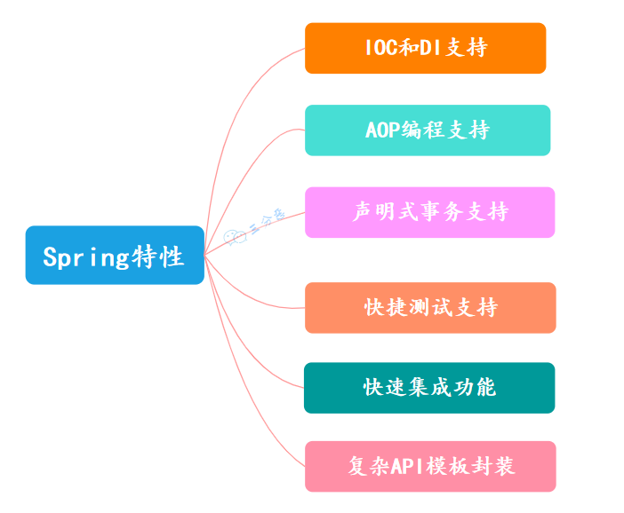
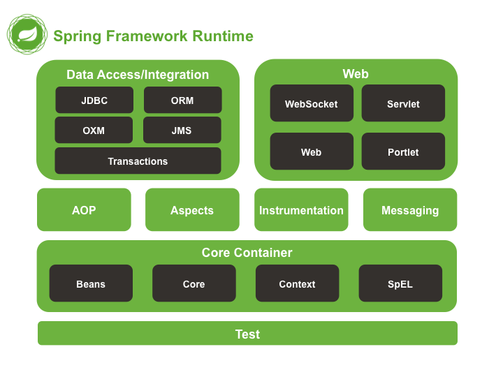
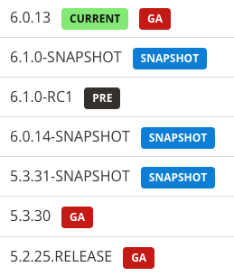
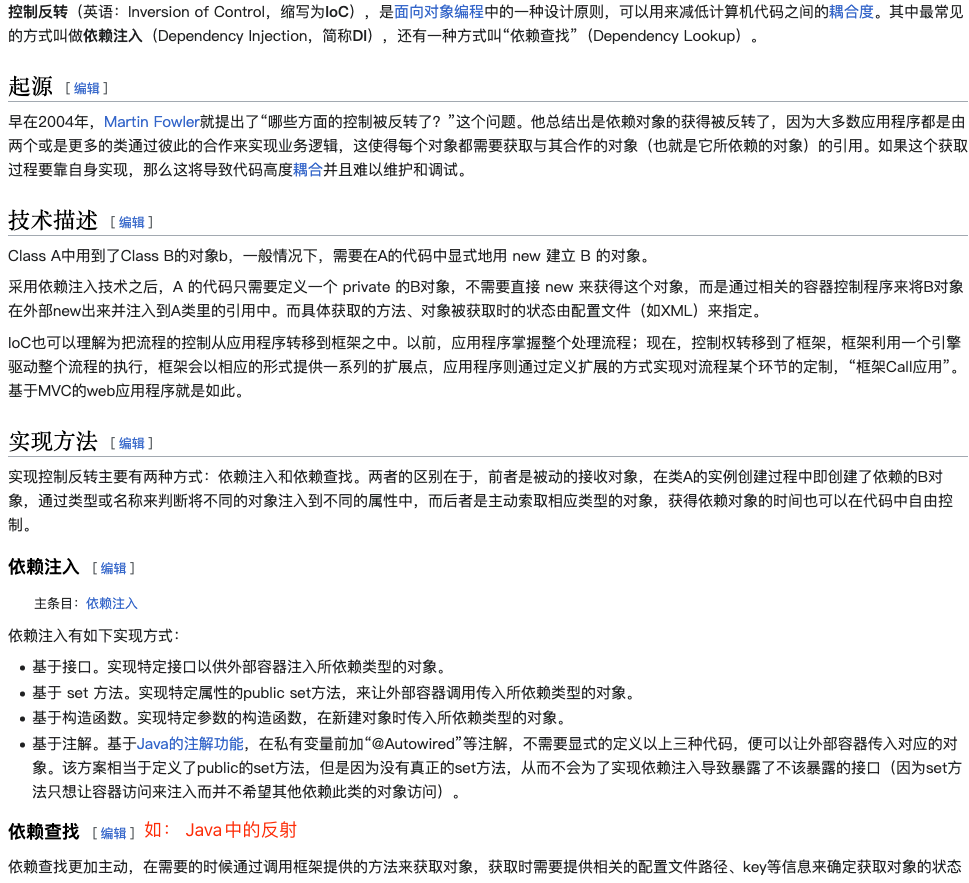

# 背景


### EJB概述 

> EJB 开发模式【POJO、JavaBean、对象的状态、RMI 和 RPC、多个 Bean】
> EJB 的困境
> 两个示例证明“没有 Spring 的困境”
> DIP
> 设计模式原则之 DI 与 IoC 的区别、依赖注入和依赖查找、IoC 和 Spring
> Spring 的特点、相关组件、版本更新、SpringBoot 和 SpringCloud 等；

1. 什么是EJB以及和Spring Framework的区别


[什么是EJB以及和Spring Framework的区别](https://cloud.tencent.com/developer/article/2337614)


### Spring


1. 依赖倒置原则 
2. 控制反转


- Spring产生的背景及其特点
- 组件及其各自作用
- 容器高级视图
- IOC容器的实现（BeanFactory）及其子类
- ApplicationFactory及其子类
- WebApplicationContext功能
- 注解及其作用
- 标准事件分类（5种）
- Bean 
   - 属性
   - 5种作用域
   - 在Spring应用上下文中的生命周期
   - 装配方式（手工装配、自动装配）
   - Bean后置处理器作用及用法
- AOP定义及相关术语、实现方式、基本原理、相关设计模式
- 事务管理、隔离级别、传播机制

> 软件研发过程： 背景描述，需求设计，概要设计，详细设计……因此在学习Spring时，可以把Spring看作是一个业务需求，只不过这个业务需求是要完成对我们写的各种各样的Java类的管理。


- 【背景】EJB开发模式及其弊端
- 【愿景】造一个能帮助程序员管理各种JavaBean组件的容器
- 【实现】Spring框架 
   - 功能特性
   - 简单使用过程
   - 模块及其各自功能特性： Core、Context、AOP、Web、DAO、MVC、ORM
   - 原理
   - 好处
- Bean相关 
   - 概念： 什么是POJO、组件、Bean等；
   - 元信息： 
      - 基本信息
      - 行为信息
      - 依赖信息
      - 延伸 对bean元信息的讲解
   - 描述Bean的元信息的方式 
      - xml
      - Java直接编码 
         - 基于注解
         - 基于SpringAPI方式
      - GroovyDSL方式
      - 【待定】使用 Spring 官方提供的注解 
         - 有哪些注解，这些注解的功能是什么
   - 如何实现依赖关系 
      - 基于Spring： Spring的自动装配
      - 自行实现： 构造方法，set方法，简单工厂方法、静态工厂方法
   - Bean的生命周期
   - 面试题 
      - 如何解决循环依赖？
      - Spring中同名Bean的处理方式？
      - 单例Bean的线程同步问题？
      - 为什么要有Bean的生命周期，基于Bean的生命周期能完成什么企业级功能？


### 背景

在没有出现Spring之前，EJB是Java领域大型企业级应用的主要技术选型。但EJB有着很大的问题：

1. 整个软件过程中，非业务相关的技术步骤过于复杂与重复。比如每开发一个模块就都需要创建servlet、web.xml等，还需要重量级容器作为支撑等；
2. EJB并没有对Bean的管理和维护设置统一标准，这使得Bean的管理和维护极其混乱；
3. EJB的交叉业务实现过程复杂。比如安全控制、日志记录、事务控制等交叉业务，需要在每个需求中都要进行实现；
4. 由于框架的复杂性，导致很多业务模块的开发过程并不能很好的遵守设计模式中的 OCP 原则和 DIP 原则，这导致项目模块耦合性较强，耦合性越强，可扩展性就越差；
5. 程序员技术专业素养参差不齐及对 EJB 开发技术的理解不同，造成基于 EJB 的软件过程实现方式多种多样，最终导致软件危机
6. ......

EJB的技术，重点在于想方设法实现一个又一个的可复用的JavaBean组件。但是这个过程中需要程序员自行实现，而由于`程序员技术素养的差别`以及`Java语言的灵活性特点`，这又导致Bean的实现过程千差万别，最终导致软件系统难以维护。

以上问题，最终抽象并总结起来就是： `Bean的构造权和Bean的依赖关系的控制权` 的归属问题。即传统的软件开发过程中，`Bean的构造权和Bean的依赖关系的控制权`等均由负责开发的程序员来完成，由于每个程序员的专业素养的不同以及Java语言的灵活性，就导致Bean的实现方式各式各样，最终导致软件系统失去控制。

因此，人们就想，能不能造出一种工具，这种工具能让程序员从复杂而又灵活的实现方式中解脱出来。于是Spring应运而生。事实上，随着时间的发展，Spring也逐渐成为Java企业级应用的“事实标准”。

---

早期的面向对象的软件过程中，类的管理完全是需要程序员自定义去实现的，随着系统的迭代，类就会膨胀，也会变得越来越复杂，最终导致软件系统失去控制。

计算机大神们研发了一款软件，可以管理程序员自定义的各种类，这款软件产品就是Spring。

这款软件产品完成了本来需要程序员完成的功能，例如：

1. 单个Bean的生命周期管理；
2. 多个Bean的组织和装配，说白了就是能够处理多个Bean之间的相互依赖关系，何时构造、何时组织和装配；

> 组织和装配： 比如 Student 类中有一个 Class 类，表明学生所属的班级信息，我们自定义实现时，会new一个class对象，然后把这个class对象传给student作为student的构造参数。有了Spring之后就只需要写Student类和Class类，这二者之间的组织过程和装配过程就交给Spring来处理了。


## EJB的困境


## 总结

上面问题总结和抽象一下就是：  没有一个能够管理对象的构造以及对象与对象之间依赖关系的组件。我们试想，如果我们设计并实现一个能够完成这样功能的组件，那我们是不是就可以从上面这些繁重的开发工作中解脱出来，并且我们也能够规范我们的开发流程，到最后我们剩下的工作就真正实现“只专注生成 JavaBean 以及处理这些 Bean 之间的关系”的目标了。

幸运的是，有这样的组件——Spring。核心原理分成几个步骤：

1. 把Bean简单化，简单到只完成具体的业务功能，简单的实现思路就是把通用功能和具体的业务功能进行剥离，然后形成一个个独立的Bean。结果就涉及到另外一个问题： 如何管理这些单个独立的Bean，答案是： 构造一个管理所有Bean的组件并实现控制反转（IoC），即实现一个组件，让这个组件具有管理所有Bean的功能，并且这个组件能够控制Bean的生命周期（即Bean的构造和销毁，以及中间的使用过程）。
2. 完成上面的步骤后，还涉及到另外两个问题： 
   1. 如何把剥离出来的通用功能（如日志管理功能、安全控制功能）重新组织回Bean；
   2. 如何组织和管理不同Bean复用；
解决上面两个问题的思路是： 依赖注入（DI），即把这些通用的功能使用某种技术注入到Bean中，具体的实现技术是： 动态代理，思路是在运行期动态生成新的Java代码，让Java代码重新具有完成所有的功能。

> 动态代理 vs 静态代理：


# Spring特点

- 轻量级 、非侵入
- 实现了**控制反转和容器**
- 支持**面向切面编程**
- 支持**事物管理**
- 组件化、模块化、一站式
- ......





# 组件

[5.0官方文档](https://docs.spring.io/spring-framework/docs/5.0.0.M4/spring-framework-reference/htmlsingle/#dependency-management)
> [官方帮助文档](https://docs.spring.io/spring-framework/docs/)




**①Spring Core（核心容器）**
spring core提供了IOC,DI,Bean配置装载创建的核心实现。核心概念： Beans、BeanFactory、BeanDefinitions、ApplicationContext。

- spring-core ：IOC和DI的基本实现
- spring-beans：BeanFactory和Bean的装配管理(BeanFactory)
- spring-context：Spring context上下文，即IOC容器(AppliactionContext)
- spring-expression：spring表达式语言

**②Spring AOP**

- spring-aop：面向切面编程的应用模块，整合ASM，CGLib，JDK Proxy
- spring-aspects：集成AspectJ，AOP应用框架
- spring-instrument：动态Class Loading模块

**③Spring Data Access**

- spring-jdbc：spring对JDBC的封装，用于简化jdbc操作
- spring-orm：java对象与数据库数据的映射框架
- spring-oxm：对象与xml文件的映射框架
- spring-jms： Spring对Java Message Service(java消息服务)的封装，用于服务之间相互通信
- spring-tx：spring jdbc事务管理

**④Spring Web**

- spring-web：最基础的web支持，建立于spring-context之上，通过servlet或listener来初始化IOC容器
- spring-webmvc：实现web mvc
- spring-websocket：与前端的全双工通信协议
- spring-webflux：Spring 5.0提供的，用于取代传统java servlet，非阻塞式Reactive Web框架，异步，非阻塞，事件驱动的服务

**⑤Spring Message**

- Spring-messaging：spring 4.0提供的，为Spring集成一些基础的报文传送服务

**⑥Spring test**

- spring-test：集成测试支持，主要是对junit的封装

## Jar包


**Table 2.1. Spring Framework Artifacts**

| **ArtifactId** | **Description** |
| --- | --- |
| **spring-aop** | Proxy-based AOP support |
| **spring-aspects** | AspectJ based aspects |
| **spring-beans** | Beans support, including Groovy |
| **spring-context** | Application context runtime, including scheduling and remoting abstractions |
| spring-context-support | Support classes for integrating common third-party libraries into a Spring application context |
| **spring-core** | Core utilities, used by many other Spring modules |
| spring-expression | Spring Expression Language (SpEL) |
| spring-instrument | Instrumentation agent for JVM bootstrapping |
| spring-instrument-tomcat | Instrumentation agent for Tomcat |
| **spring-jdbc** | JDBC support package, including DataSource setup and JDBC access support |
| spring-jms | JMS support package, including helper classes to send and receive JMS messages |
| spring-messaging | Support for messaging architectures and protocols |
| **spring-orm** | Object/Relational Mapping, including JPA and Hibernate support |
| spring-oxm | Object/XML Mapping |
| spring-test | Support for unit testing and integration testing Spring components |
| spring-tx | Transaction infrastructure, including DAO support and JCA integration |
| spring-web | Web support packages, including client and web remoting |
| spring-webmvc | REST Web Services and model-view-controller implementation for web applications |
| spring-websocket | WebSocket and SockJS implementations, including STOMP support |

来源： [https://docs.spring.io/spring-framework/docs/5.0.0.M4/spring-framework-reference/htmlsingle/#dependency-management](https://docs.spring.io/spring-framework/docs/5.0.0.M4/spring-framework-reference/htmlsingle/#dependency-management)

| **JAR文件** | **描述** |
| --- | --- |
| spring-aop-5.3.9.jar | **这个jar 文件包含在应用中使用Spring 的AOP 特性时所需的类** |
| spring-aspects-5.3.9.jar | **提供对AspectJ的支持，以便可以方便的将面向切面的功能集成进IDE中** |
| spring-beans-5.3.9.jar | **这个jar 文件是所有应用都要用到的，它包含访问配置文件、创建和管理bean 以及进行Inversion ofControl / Dependency Injection（IoC/DI）操作相关的所有类。如果应用只需基本的IoC/DI 支持，引入spring-core.jar 及spring-beans.jar 文件就可以了。** |
| spring-context-5.3.9.jar | **这个jar 文件为Spring 核心提供了大量扩展。可以找到使用Spring ApplicationContext特性时所需的全部类，JDNI 所需的全部类，instrumentation组件以及校验Validation 方面的相关类。** |
| spring-context-indexer-5.3.9.jar | 虽然类路径扫描非常快，但是Spring内部存在大量的类，添加此依赖，可以通过在编译时创建候选对象的静态列表来提高大型应用程序的启动性能。 |
| spring-context-support-5.3.9.jar | 用来提供Spring上下文的一些扩展模块,例如实现邮件服务、视图解析、缓存、定时任务调度等 |
| spring-core-5.3.9.jar | **Spring 框架基本的核心工具类。Spring 其它组件要都要使用到这个包里的类，是其它组件的基本核心，当然你也可以在自己的应用系统中使用这些工具类。** |
| spring-expression-5.3.9.jar | Spring表达式语言。 |
| spring-instrument-5.3.9.jar | Spring3.0对服务器的代理接口。 |
| spring-jcl-5.3.9.jar | Spring的日志模块。JCL，全称为"Jakarta Commons Logging"，也可称为"Apache Commons Logging"。 |
| spring-jdbc-5.3.9.jar | **Spring对JDBC的支持。** |
| spring-jms-5.3.9.jar | 这个jar包提供了对JMS 1.0.2/1.1的支持类。JMS是Java消息服务。属于JavaEE规范之一。 |
| spring-messaging-5.3.9.jar | 为集成messaging api和消息协议提供支持 |
| spring-orm-5.3.9.jar | **Spring集成ORM框架的支持，比如集成hibernate，mybatis等。** |
| spring-oxm-5.3.9.jar | 为主流O/X Mapping组件提供了统一层抽象和封装，OXM是Object Xml Mapping。对象和XML之间的相互转换。 |
| spring-r2dbc-5.3.9.jar | Reactive Relational Database Connectivity (关系型数据库的响应式连接) 的缩写。这个jar文件是Spring对r2dbc的支持。 |
| spring-test-5.3.9.jar | 对Junit等测试框架的简单封装。 |
| spring-tx-5.3.9.jar | **为JDBC、Hibernate、JDO、JPA、Beans等提供的一致的声明式和编程式事务管理支持。** |
| spring-web-5.3.9.jar | **Spring集成MVC框架的支持，比如集成Struts等。** |
| spring-webflux-5.3.9.jar | **WebFlux是 Spring5 添加的新模块，用于 web 的开发，功能和 SpringMVC 类似的，Webflux 使用当前一种比较流程响应式编程出现的框架。** |
| spring-webmvc-5.3.9.jar | **SpringMVC框架的类库** |
| spring-websocket-5.3.9.jar | Spring集成WebSocket框架时使用 |


# 版本命名规范



- GA： GA (general availability)
- Snapshot
- M： milestone
- RC： release candidate 


企业级开发的标配基本就是 **Spring5** + **Spring Boot 2** + **JDK 8**

- JDK：Java17+**（Spring6要求JDK最低版本是Java17）**
- Maven：3.6+
- Spring：6.0.2


- JavaBean： Spring 的容器所管理的对象就是 JavaBean，有时候也称为 SpringBean（没毛病！）
- 设计模式原则 DIP 和 IoC 的区别
   - DIP（**依赖倒置原则**，Dependence Inversion Principle）是设计模式中的一种设计原则，主要倡导面向抽象编程，面向接口编程，不要面向具体编程，让**上层**不再依赖**下层**，下面改动了，上面的代码不会受到牵连，属于GoF 的一种；
   - IoC（**控制反转**， Inversion of Control ）： 不是一项技术，而是一种全新的设计模式，但是理论和时间成熟相对较晚，并没有包含在GoF中，作用是帮助我们进行解耦；主要作用是 Bean 的管理；
      - Bean 管理是什么？
         - **Bean对象的创建**
         - **Bean对象中属性的赋值（或者叫做Bean对象之间关系的维护）**
      - 反转的是什么？
         - 将对象的创建权利交出去，交给第三方容器负责。
         - 将对象和对象之间关系的维护权交出去，交给第三方容器负责。
   - DI是实现了IoC的一种常见的技术实现方式，另一种方式是依赖查找；
   - Spring框架就是一个实现了IoC思想的框架；接口注入会使类之间形成一定的依赖关系，产生侵入性，所以Spring不支持接口注入，这不是Spring的缺点，而应该是优点。

**DIP 和 IoC 都是一种建模时采用的设计原则，DI 是实现 IoC 的一种实现思路（另一种是依赖查找），Spring 是实现了 DI 的一种 Java 领域的一个框架。**


```markdown
IoC 与 DI 


控制反转（Inversion of Control，缩写为IoC），是面向对象编程中的一种设计思想，可以用来降低代码之间的耦合度，符合依赖倒置原则。
控制反转的核心是：将对象的创建权交出去，将对象和对象之间关系的管理权交出去，由第三方容器来负责创建与维护。
控制反转常见的实现方式：依赖注入（Dependency Injection，简称DI），狭义上讲，依赖注入就是指对象A依赖于对象B的情况；广义上讲，依赖注入也指某一类对象依赖于某一种特定功能的情况，比如项目中所有的接口中都需要添加安全控制的功能。
通常，依赖注入的实现由包括两种方式：
● set方法注入
● 构造方法注入
而Spring框架就是一个实现了IoC思想的框架。
IoC可以认为是一种全新的设计模式，但是理论和时间成熟相对较晚，并没有包含在GoF中。（GoF指的是23种设计模式）

● 控制反转是一种思想。
● 控制反转是为了降低程序耦合度，提高程序扩展力，达到OCP原则，达到DIP原则。
● 控制反转，反转的是什么？
  ○ 将对象的创建权利交出去，交给第三方容器负责。
  ○ 将对象和对象之间关系的维护权交出去，交给第三方容器负责。
● 控制反转这种思想如何实现呢？
  ○ DI（Dependency Injection）：依赖注入

依赖注入 (Dependency Injection) 和自动装配 (Autowiring) 是 Java 程序开发中常用的两种设计模式，它们的作用是解决对象之间的依赖关系。

依赖注入是一种设计模式，可以将对象的依赖关系从对象本身解耦出来，并使用外部组件来注入依赖关系。这样，对象本身不再需要知道其他对象的细节，也不需要手动创建依赖关系，从而提高了代码的可读性、可维护性和可测试性。

自动装配是 Spring 框架中的一个特性，它可以自动创建并维护依赖关系，使得开发者不需要手动配置。自动装配可以使用 @Autowired 注解或者 XML 配置方式进行配置，它会自动选择合适的 Bean 用于装配。

总的来说，依赖注入是一种设计模式，而自动装配是在依赖注入基础上的一种实现方式，它们的目的都是解决对象之间的依赖关系，但自动装配比依赖注入更易于使用。

```


> 从两个例子中来说明 Spring 没出现之前的“黑夜”。
> 1. 从 EJB 部署方式上
> 2. 从构造方法的灵活性上
> 3. 从基于设计模式建模上面（不断地给已有功能添加新需求）


# 例子 1:  设计模式角度
> 例子中说明并解释 DIP 。


### 使用设计模式建模




# 例子 2:  构造方法的灵活性
我们想要使用上面的技术来完成某个业务功能时，可能会有这样的情况：

```
public class A{
    public void m1(){}
}

```
假如，我们想要在B中调用A中的m1()方法，那么我们可以这样做：

```
public class B{
    private A a; // @1
    public B(){
        this.a = new A(); //@2 此时，A的构造过程是由B控制的
    }
    public void m1(){
        this.a.m1(); //@3
    }
}

// 使用的过程是这样的：
test(){
    B b = new B();
    b.m1();
}

```
但是随着业务的发展，我们会发现上面这种方式不利于扩展，于是我们把原来在A的构造过程交出去，让使用B的使用者随意的组织A的构造过程，于是我们这样实现：

```
public class B{
    private A a;
    public B(A a){
        this.a = a;
    }
    public void m1(){
        this.a.m1(); 
    }
}

test(){
    A a = new A();  // 把A的构造过程交给了使用者test()
    B b = new B(a);
    b.m1();
}

```
但是随着业务的发展，我们又发现，上面这种方式也不利于扩展，例如如果B中依赖很多的类似于A的对象，比如需要依赖于C、D、E、F或者更多对象，那么我们首先要调整B的构造方法，其次还要调整test()的使用过程，于是代码又变成这样：

```
public class B{
    private A a;
    private C c;
    
    private D d;
    private E e;
    public B(A a, C c, D d, E e){
        this.a = a;
        this.c = c;
        this.d = d;
        this.e = e;
    }
    public void m1(){
        this.a.m1(); 
    }
}

test(){
    // A/C/D/E 的构造过程仍然在使用者test()手里
    A a = new A(); 
    C c = new C();
    D d = new D();
    E e = new E();
    B b = new B(a, c, d, e);
    b.m1();
}

```
因此，我们会发现，在Spring还没有出现之前的第二个软件危机，**编程语言特性决定的bean的构造过程的灵活特性，同时也导致bean的管理与维护不够标准和规范。**
传统的软件工程中存在“危机”：

- **软件过程中，非业务相关的技术步骤过于复杂与重复。**
- **编程语言特性决定的bean的构造过程的灵活特性，同时也导致bean的管理与维护不够标准和规范。**

**而Spring的出现，彻底解决了上面的这些问题。**


### 防止DI的滥用

#### 原则一
建模时辨别清楚`对象生命周期`就不难选择采用DI还是创建对象：

- 依赖关系不需要DI也不需要创建对象；
- 关联关系和聚合关系需要采用DI方式；
- 组合关系需要创建对象方式；

#### 原则二
在决定采用DI设计后，马上要考虑的是注入方式问题。DI中注入方式主要有构造函数注入和Setter注入（还有接口注入较少使用，本文不讨论）。“人与身份证的依赖关系”适合采用Setter注入，因为人不是一出生就有身份证，而是到了法定年龄才有，用构造函数注入表达的语义与此相违背。相反“人与父母的依赖关系”则适合采用构造函数注入，因为亲子关系是从人一出生就建立的，用Setter注入必然使得对象创建后有一段时间处于非法状态，按契约式设计的术语即破坏了对象的不变量(invariant)。


# EJB 部署


例如，使用早期的Java技术来实现Web应用时，我们会这样实现：

1. 使用idea创建一个web项目
2. 创建servlet，servlet中写业务代码，组装需要数据，将数据以json格式输出
3. 在web.xml中配置servlet信息
4. 将项目部署到tomcat中

分析一下上面这种开发方式：

- 与业务相关的只有第2步中的“业务代码”部分，其余步骤均为非业务相关的技术步骤——非业务相关的技术步骤过于复杂；
- 当有很多个web模块时，每个模块都要重复1/3/4步骤——非业务相关的技术步骤过于重复；

因此，我们会发现，在Spring还没有出现之前的第一个软件危机，即： **软件过程中，非业务相关的技术步骤过于复杂与重复。**


-----


- [ ] 下面是对上面的做了一个总结

### EJB前置知识

1. 背景知识：互联网产品的发展历程
2. RMI+网络处理=RPC
3. POJO、Java 语言的缺陷并由此衍生出来的 javaBean 的概念、为满足软件复用而提出来的「组件」的概念
4. 为满足「工程化开发」的需求而设计出的软件实现形式：EJB

#### 互联网产品的服务模式的发展与迭代

- singleton应用模式： 把完成企业各项任务的互联网产品进行封装，然后把封装后的这个互联网产品放到客户端运行，这样的互联网产品的构建模式就是狭义上的“单体应用”。【现在广义上的“单体应用”是指，各个功能模块没有拆分，还是聚合在一起的应用】
- CS模式： 后来人们发现上面的单体应用模式会产生一些问题，比如上面的这种产品多是一锤子买卖，不会有后续更新的可能性。于是人们就想，把一些核心功能放到某一台主机上，让这台主机来完成核心功能，其余非核心功能就放到客户端。这样就产生了cs模式的应用。
- BS模式： 后来人们又发现cs模式也不太行，因为互联网产品更新迭代过程太快了，可能连客户端也需要经常来更新和维护了。于是人们就又基于网络开发出BS模式的互联网产品。就是把原来直接安装到客户端主机上的客户端软件，直接简化，简化成只有一个域名的互联网入口，所有的企业级服务都通过网络来提供。

#### RPC、RMI

- RPC（Remote Procedure Call）： ~~说白了，就是本地计算机调用远程计算机上的一个函数。在 Java 之前的大多数编程语言，如，Fortran、C、COBOL 等等，都是过程性的语言，而不是面向对象的。所以，这些编程语言非常自然地用过程表示工作。也就是 RPC 并不是Java的专有名词。但是这种开发模式，需要程序员关注网络部分，也就是说除了要编写远程计算机上的任务函数外，在本地计算机上调用远程计算机上的任务函数时，还要关注如何使用网络问题（如网络传输的协议、数据传输的格式、网络的异常处理等）。~~
- RMI（Remote Method Invocation）： ~~由于 RPC 过程需要额外处理网络的问题，在发展过程中人们发现网络问题是通用的，人们可以把网络问题的处理过程抽象出来，让程序员只关注实际的业务处理部分。于是，这种实现方式就变成了本地主机直接调用远程主机的方法。于是 RMI 出现。~~

可以理解为： RMI + 网络处理 = RPC。

#### Java语言的设计缺陷

> Java语言欠缺属性、事件、多重继承功能。所以，如果要在Java程序中实现一些面向对象编程的常见需求，只能手写大量胶水代码。Java Bean正是编写这套胶水代码的惯用模式或约定。这些约定包括getXxx、setXxx、isXxx、addXxxListener、XxxEvent等。遵守上述约定的类可以用于若干工具或库。 ——来源：[杨博](https://www.zhihu.com/question/19773379/answer/31625054)

比如有这样一个场景：我们要设计一个List类并且需要保存这个List的大小。那么，我们的实现方式可能是这样的：我们直接把size直接设置成pulic的形式，然后通过“对象.size”的方式进行访问，并通过“对象.size”的方式进行设值。

但是这种方式会有两个问题：

- 那就是每一个new出来的对象都有一个size变量，如果很多list对象，那就需要有很多的内存空间来保存这个size变量；
- 随着业务的发展，list可能需要增加多个属性，比如name等，也就是说每一个list对象所占用的内存空间可能就不固定，会根据属性的增多而变大；

于是人们就使用另外一种方式来实现上面的这个场景：把属性设置成private的形式，然后通过添加对属性的get、set方法，实现对这个属性的控制。这种设计方式就解决了上面可能会遇到的两个问题。

从这件事情上得到一个结论： **Java语言的设计是有缺陷的**。并由此，人们又得出一个结论： 人们在使用Java时需要有一些规范或规约。比如上面的例子中，对属性的控制是通过添加针对属性的 get、set 方来控制而不是通过「对象.属性」的方式。于是，JavaBean登场。

#### POJO、组件、JavaBean

POJO 的全称是 Plain Old Java Object, 简单又老的 Java 对象。那些没有继承任何类、也没有实现任何接口，更没有被其它框架侵入的java对象。2005年11月时，“POJO”主要**用来指代那些没用遵从特定的Java对象模型，约定或框架（如EJB）的Java对象**。
POJO（Plain Old Java Object, 简单又老的 Java 对象）**： 不继承任何类、也不实现任何接口、更不遵循任何约定、也不被任何框架侵入的Java对象**，理想情况下，**POJO是一个只遵循Java语言规范的Java对象**。

所谓**组件**就是一个由可以自行进行内部管理的一个或几个类所组成、外界不了解其内部信息和运行方式的群体。使用它的对象只能通过接口来操作。

人们把满足下面特征的Java对象统称为**JavaBean**：

- **提供默认的构造方法；**
- **所有属性的访问范围为private；**
- **提供针对属性的get、set方法；**
- **实现序列化接口；**

简而言之，当一个POJO可序列化，有一个无参的构造函数，使用getter和setter方法来访问属性时，他就是一个JavaBean。（没毛病！）
Bean的含义是可重复使用的Java组件。

**EJB 2.x 的 Entity Beans 比较重量，需要实现 javax.ejb 的一些接口**。而 POJO 就比较轻量，就是一个 Java 对象，不需要实现任何的接口。
有了这个概念（惯例），Spring, Hibernate 这些框架交流、实现起来，都大量使用 Bean 这个概念。比如“注入一个 Bean“，“声明一个 Bean”，你就知道这里的这个 Bean 必须要有无参数的构造函数，必须要有 setter/getter 等等。这些框架在使用的时候，会采用初始化出来 Bean 然后 setXX() 这种方式，构造出来最终的 Bean.

#### 对象的状态

>
> 线程安全问题都是由全局变量及静态变量引起的。

对象的状态： 有状态 VS 无状态

- 有状态：有状态就是有数据存储功能。有状态对象(Stateful Bean)，就是有实例变量的对象，可以保存数据，是非线程安全的。在不同方法调用间不保留任何状态。
- 无状态：无状态就是一次操作，不能保存数据。无状态对象(Stateless Bean)，就是没有实例变量的对象 .不能保存数据，是不变类，是线程安全的。

#### EJB

EJB（Enterprise Java Bean）： EJB 的官方解释是“商务软件的核心部分是它的业务逻辑。业务逻辑抽象了整个商务过程的流程，并使用计算机语言将他们实现。”变成大白话就是，“把你编写的软件中那些须要执行制定的任务的类，不放到client软件上了，而是给他打成包放到一个server上了”。通过RMI 技术，J2EE 将EJB 组件创建为远程对象，EJB 尽管用了RMI 技术，可是却仅仅需要定义远程接口而无需生成他们的实现类，这样就将RMI 技术中的一些细节问题屏蔽了。但无论怎么说，EJB 的基础仍然是RMI，所以，假设你想了解EJB 的原理，仅仅要把RMI的原理搞清楚即可了。


-------

### EJB概述

1. jdk只完成了基于Java语言实现简单的功能，如科学计算等；
2. 商业软件中需要很多的特性，于是Java语言开发出适合企业使用的功能，实现这些功能的Java语言称为J2EE；
3. 基于J2EE实现企业级功能的实现方式有一种事实上的规范，这种规范就是EJB，它最大的特点就是**把核心的商业功能拆分成server端**和**非核心的商业功能拆分成client端**，然后client端和server端通过RMI方式连接，并为了实现算力最大化，在server端实现了服务集群的过程。即EJB最大特点是：`**cs模式+RMI+服务集群**`。所以EJB逐渐成为J2EE的一部分。
4. 在EJB中，**把具有某种可重复使用功能的Java组件叫做Bean**。Java Bean是基于Java的组件模型，由属性、方法和事件3部分组成。在该模型中，JavaBean可以被修改或与其他组件结合以生成新组件或完整的程序。它是一种Java类，通过封装成为具有某种功能或者处理某个业务的对象。
5. 除了这种bean以外，还有一种Java类，这种类不继承任何类、也不实现任何接口、更不会使用任何框架，这种类就称为 POJO 。
6. 后来EJB中的Bean发展成为一个软件开发标准，人们又总结发展出另外一个概念： JavaBean，即`凡是具有默认构造函数、属性私有化、提供针对属性的get和set方法并实现序列化接口的POJO统称为JavaBean`。
7. PO、VO、DTO、DO、BO等是后续发展过程中不断添加的一些概念。


在没有出现Spring之前，EJB是Java领域大型企业级应用的主要技术选型。但EJB有着很大的问题：

1. 整个软件过程中，非业务相关的技术步骤过于复杂与重复。比如每开发一个模块就都需要创建servlet、web.xml等，还需要重量级容器作为支撑等；
2. EJB并没有对Bean的管理和维护设置统一标准，这使得Bean的管理和维护极其混乱；
3. EJB的交叉业务实现过程复杂。比如安全控制、日志记录、事务控制等交叉业务，需要在每个需求中都要进行实现；
4. 由于框架的复杂性，导致很多业务模块的开发过程并不能很好的遵守设计模式中的 OCP（开闭原则，Open Closed Principle） 原则和 DIP（依赖倒置原则，Dependence Inversion Principle） 原则，这导致项目模块耦合性较强，耦合性越强，可扩展性就越差；
5. 程序员技术专业素养参差不齐及对 EJB 开发技术的理解不同，造成基于 EJB 的软件过程实现方式多种多样，最终导致软件危机
6. ......

EJB的技术，重点在于想方设法实现一个又一个的可复用的JavaBean组件。但是这个过程中需要程序员自行实现，而由于`程序员技术素养的差别`以及`Java语言的灵活性特点`，这又导致Bean的实现过程千差万别；再者，随着系统的迭代，类就会膨胀，也会变得越来越复杂，最终导致软件系统失去控制。

::: tip 传统软件过程的噩梦

以上问题，最终抽象并总结起来就是： `Bean的构造权和Bean的依赖关系的控制权` 的归属问题。即传统的软件开发过程中，`Bean的构造权和Bean的依赖关系的控制权`等均由负责开发的程序员来完成，由于每个程序员的专业素养的不同以及Java语言的灵活性，就导致Bean的实现方式各式各样，最终导致软件系统失去控制。

::: 

### Spring前夕的挣扎

> 在Spring未出现之前，为了解决上面的问题，提出了按照设计原则的方式，有效缓解了上面的问题。但是依旧仍然存在问题： 程序员需要实现业务以外的额外的功能。

- JavaBean： Spring 的容器所管理的对象就是 JavaBean，有时候也称为 SpringBean（没毛病！）
- 设计模式原则 DIP 和 IoC 的区别
   - DIP（**依赖倒置原则**，Dependence Inversion Principle）是设计模式中的一种设计原则，主要倡导面向抽象编程，面向接口编程，不要面向具体编程，让**上层**不再依赖**下层**，下面改动了，上面的代码不会受到牵连，属于 GoF 的一种；
   - IoC（**控制反转**， Inversion of Control ）： 不是一项技术，而是一种全新的设计模式，但是理论和时间成熟相对较晚，并没有包含在GoF中，作用是帮助我们进行解耦；主要作用是 Bean 的管理；
      - Bean 管理是什么？
         - **Bean对象的创建**
         - **Bean对象中属性的赋值（或者叫做Bean对象之间关系的维护）**
      - 反转的是什么？
         - 将对象的创建权利交出去，交给第三方容器负责。
         - 将对象和对象之间关系的维护权交出去，交给第三方容器负责。
   - DI（依赖注入 Dependence Inversion）是实现了IoC的一种常见的技术实现方式，另一种方式是依赖查找；
   - Spring框架就是一个实现了IoC思想的框架；接口注入会使类之间形成一定的依赖关系，产生侵入性，所以Spring不支持接口注入，这不是Spring的缺点，而应该是优点。

**DIP 和 IoC 都是一种建模时采用的设计原则，DI 是实现 IoC 的一种实现思路（另一种是依赖查找），Spring 是实现了 DI 的一种 Java 领域的一个框架。**


### Spring诞世

因此，人们就想，能不能造出一种工具，这种工具能让程序员从复杂而又灵活的实现方式中解脱出来。于是Spring应运而生。事实上，随着时间的发展，Spring也逐渐成为Java企业级应用的“事实标准”。

这款软件产品完成了本来需要程序员完成的功能，例如：

1. 单个Bean的生命周期管理；
2. 多个Bean的组织和装配，说白了就是能够处理多个Bean之间的相互依赖关系，何时构造、何时组织和装配；

> 组织和装配： 比如 Student 类中有一个 Class 类，表明学生所属的班级信息，我们自定义实现时，会new一个class对象，然后把这个class对象传给student作为student的构造参数。有了Spring之后就只需要写Student类和Class类，这二者之间的组织过程和装配过程就交给Spring来处理了。

上面问题总结和抽象一下就是：  没有一个能够管理对象的构造以及对象与对象之间依赖关系的组件。我们试想，如果我们设计并实现一个能够完成这样功能的组件，那我们是不是就可以从上面这些繁重的开发工作中解脱出来，并且我们也能够规范我们的开发流程，到最后我们剩下的工作就真正实现“只专注生成 JavaBean 以及处理这些 Bean 之间的关系”的目标了。

幸运的是，有这样的组件——Spring。核心原理分成几个步骤：

1. 把Bean简单化，简单到只完成具体的业务功能，简单的实现思路就是把通用功能和具体的业务功能进行剥离，然后形成一个个独立的Bean。结果就涉及到另外一个问题： 如何管理这些单个独立的Bean，答案是： 构造一个管理所有Bean的组件并实现控制反转（IoC），即实现一个组件，让这个组件具有管理所有Bean的功能，并且这个组件能够控制Bean的生命周期（即Bean的构造和销毁，以及中间的使用过程）。
2. 完成上面的步骤后，还涉及到另外两个问题： 
   1. 如何把剥离出来的通用功能（如日志管理功能、安全控制功能）重新组织回Bean；
   2. 如何组织和管理不同Bean复用；
解决上面两个问题的思路是： 依赖注入（DI），即把这些通用的功能使用某种技术注入到Bean中，具体的实现技术是： 动态代理，思路是在运行期动态生成新的Java代码，让Java代码重新具有完成所有的功能。


#### 相关特性


- 轻量级 、非侵入
- 实现了**控制反转和容器**
- 支持**面向切面编程**
- 支持**事物管理**
- 组件化、模块化、一站式
- ......


#### 组件


- **①Spring Core（核心容器）** spring core提供了IOC,DI,Bean配置装载创建的核心实现。核心概念： Beans、BeanFactory、BeanDefinitions、ApplicationContext。
  - spring-core ：IOC和DI的基本实现
  - spring-beans：BeanFactory和Bean的装配管理(BeanFactory)
  - spring-context：Spring context上下文，即IOC容器(AppliactionContext)
  - spring-expression：spring表达式语言
- **②Spring AOP**
  - spring-aop：面向切面编程的应用模块，整合ASM，CGLib，JDK Proxy
  - spring-aspects：集成AspectJ，AOP应用框架
  - spring-instrument：动态Class Loading模块
- **③Spring Data Access**
  - spring-jdbc：spring对JDBC的封装，用于简化jdbc操作
  - spring-orm：java对象与数据库数据的映射框架
  - spring-oxm：对象与xml文件的映射框架
  - spring-jms： Spring对Java Message Service(java消息服务)的封装，用于服务之间相互通信
  - spring-tx：spring jdbc事务管理
- **④Spring Web**
  - spring-web：最基础的web支持，建立于spring-context之上，通过servlet或listener来初始化IOC容器
  - spring-webmvc：实现web mvc
  - spring-websocket：与前端的全双工通信协议
  - spring-webflux：Spring 5.0提供的，用于取代传统java servlet，非阻塞式Reactive Web框架，异步，非阻塞，事件驱动的服务
- **⑤Spring Message**
  - Spring-messaging：spring 4.0提供的，为Spring集成一些基础的报文传送服务
- **⑥Spring test**
  - spring-test：集成测试支持，主要是对junit的封装

| **JAR文件** | **描述** |
| --- | --- |
| spring-aop-5.3.9.jar | **这个jar 文件包含在应用中使用Spring 的AOP 特性时所需的类** |
| spring-aspects-5.3.9.jar | **提供对AspectJ的支持，以便可以方便的将面向切面的功能集成进IDE中** |
| spring-beans-5.3.9.jar | **这个jar 文件是所有应用都要用到的，它包含访问配置文件、创建和管理bean 以及进行Inversion ofControl / Dependency Injection（IoC/DI）操作相关的所有类。如果应用只需基本的IoC/DI 支持，引入spring-core.jar 及spring-beans.jar 文件就可以了。** |
| spring-context-5.3.9.jar | **这个jar 文件为Spring 核心提供了大量扩展。可以找到使用Spring ApplicationContext特性时所需的全部类，JDNI 所需的全部类，instrumentation组件以及校验Validation 方面的相关类。** |
| spring-context-indexer-5.3.9.jar | 虽然类路径扫描非常快，但是Spring内部存在大量的类，添加此依赖，可以通过在编译时创建候选对象的静态列表来提高大型应用程序的启动性能。 |
| spring-context-support-5.3.9.jar | 用来提供Spring上下文的一些扩展模块,例如实现邮件服务、视图解析、缓存、定时任务调度等 |
| spring-core-5.3.9.jar | **Spring 框架基本的核心工具类。Spring 其它组件要都要使用到这个包里的类，是其它组件的基本核心，当然你也可以在自己的应用系统中使用这些工具类。** |
| spring-expression-5.3.9.jar | Spring表达式语言。 |
| spring-instrument-5.3.9.jar | Spring3.0对服务器的代理接口。 |
| spring-jcl-5.3.9.jar | Spring的日志模块。JCL，全称为"Jakarta Commons Logging"，也可称为"Apache Commons Logging"。 |
| spring-jdbc-5.3.9.jar | **Spring对JDBC的支持。** |
| spring-jms-5.3.9.jar | 这个jar包提供了对JMS 1.0.2/1.1的支持类。JMS是Java消息服务。属于JavaEE规范之一。 |
| spring-messaging-5.3.9.jar | 为集成messaging api和消息协议提供支持 |
| spring-orm-5.3.9.jar | **Spring集成ORM框架的支持，比如集成hibernate，mybatis等。** |
| spring-oxm-5.3.9.jar | 为主流O/X Mapping组件提供了统一层抽象和封装，OXM是Object Xml Mapping。对象和XML之间的相互转换。 |
| spring-r2dbc-5.3.9.jar | Reactive Relational Database Connectivity (关系型数据库的响应式连接) 的缩写。这个jar文件是Spring对r2dbc的支持。 |
| spring-test-5.3.9.jar | 对Junit等测试框架的简单封装。 |
| spring-tx-5.3.9.jar | **为JDBC、Hibernate、JDO、JPA、Beans等提供的一致的声明式和编程式事务管理支持。** |
| spring-web-5.3.9.jar | **Spring集成MVC框架的支持，比如集成Struts等。** |
| spring-webflux-5.3.9.jar | **WebFlux是 Spring5 添加的新模块，用于 web 的开发，功能和 SpringMVC 类似的，Webflux 使用当前一种比较流程响应式编程出现的框架。** |
| spring-webmvc-5.3.9.jar | **SpringMVC框架的类库** |
| spring-websocket-5.3.9.jar | Spring集成WebSocket框架时使用 |


- GA： GA (general availability)
- Snapshot
- M： milestone
- RC： release candidate 


企业级开发的标配基本就是 **Spring5** + **Spring Boot 2** + **JDK 8**

- JDK：Java17+**（Spring6要求JDK最低版本是Java17）**
- Maven：3.6+
- Spring：6.0.2

#### 套装

- SpringBoot 
- SpringCloud 
