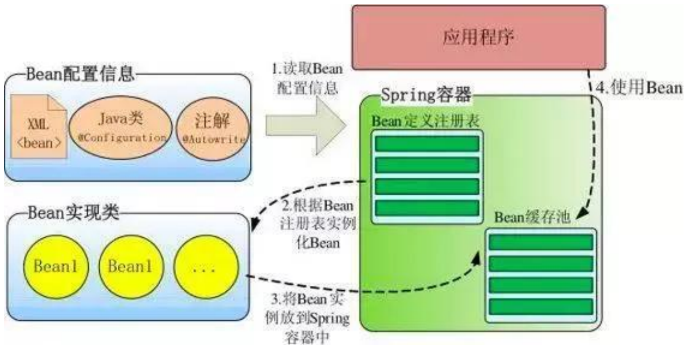
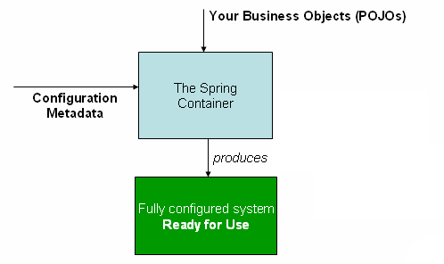
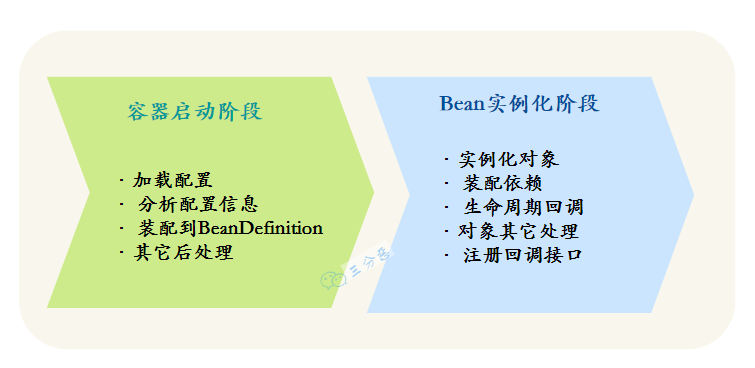
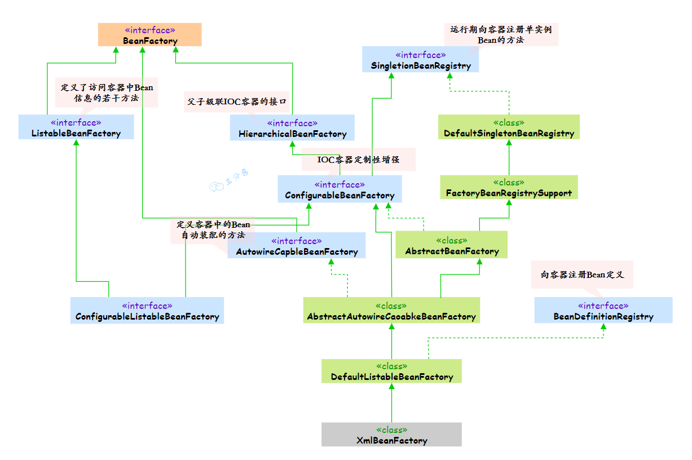
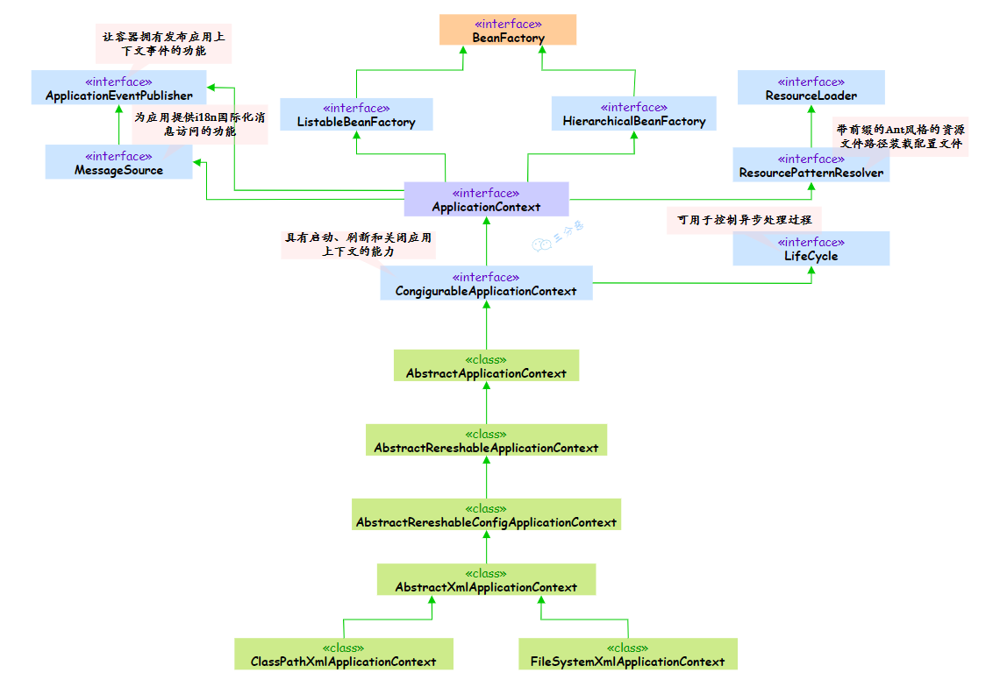
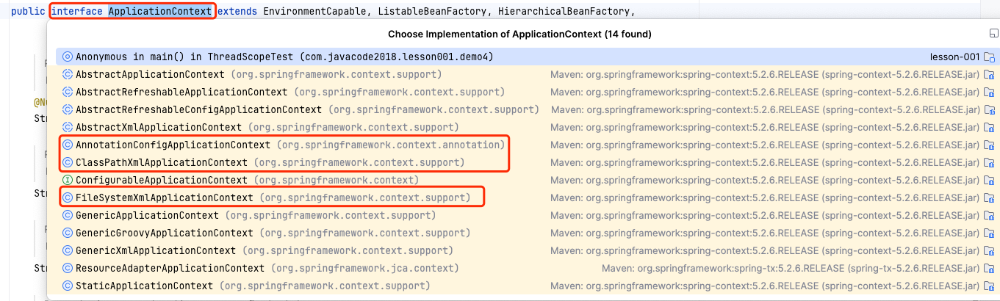

# 容器

关键api： beanDefinition \ PropertiesBeanDefinitionReader \ BeanFactory \ ApplicationContext \

### 高层视图

### 什么是容器

利用控制反转（IoC）的设计思想，剥夺程序员对Bean的部分控制权，并把这些被剥夺的控制权给到Spring。于是，Spring就要提供管理这些控制权的解决方案，这个解决方案就是容器。

所谓容器，就是说Spring提供了一个类似于数据库的功能，只不过这个功能保存的是JavaBean。

如上图，步骤解析如下：

1. 读取各种各样的配置文件，从中获取各种各样的pojo；
2. Spring容器就从这些配置文件中，获得pojo的文件所在位置，并生成一个 Bean 的注册表；
3. Spring容器会根据 Bean的注册表 实例化Bean，并把实例化后的bean放入 Bean 缓存池里面，以便后续的使用；

### 启动流程

Spring的IOC容器工作的过程，其实可以划分为两个阶段**： 容器启动阶段**和**Bean实例化阶段**。

其中容器启动阶段主要做的工作是加载和解析配置文件，保存到对应的Bean定义中。

容器启动开始，首先会通过某种途径加载Congiguration MetaData，在大部分情况下，容器需要依赖某些工具类（BeanDefinitionReader）对加载的Congiguration MetaData进行解析和分析，并将分析后的信息组为相应的BeanDefinition。

最后把这些保存了Bean定义必要信息的BeanDefinition，注册到相应的BeanDefinitionRegistry，这样容器启动就完成了。

父子容器

### BeanFactory vs ApplicationContext

#### BeanFactory

BeanFactory是类的通用工厂，可以创建并管理各种类的对象。
Spring为BeanFactory提供了很多种实现，最常用的是XmlBeanFactory，但在Spring 3.2中已被废弃，建议使用XmlBeanDefinitionReader、DefaultListableBeanFactory。

BeanFactory接口位于类结构树的顶端，它最主要的方法就是getBean(String var1)，这个方法从容器中返回特定名称的Bean。
BeanFactory的功能通过其它的接口得到了不断的扩展，比如AbstractAutowireCapableBeanFactory定义了将容器中的Bean按照某种规则（比如按名字匹配、按类型匹配等）进行自动装配的方法。

#### ApplicationContext

ApplicationContext由BeanFactory派生而来，提供了更多面向实际应用的功能。可以这么说，使用BeanFactory就是手动档，使用ApplicationContext就是自动档。
ApplicationContext 继承了HierachicalBeanFactory和ListableBeanFactory接口，在此基础上，还通过其他的接口扩展了BeanFactory的功能，包括：

- Bean instantiation/wiring
- Bean 的实例化/串联
- 自动的 BeanPostProcessor 注册
- 自动的 BeanFactoryPostProcessor 注册
- 方便的 MessageSource 访问（i18n）
- ApplicationEvent 的发布与 BeanFactory 懒加载的方式不同，它是预加载，所以，每一个 bean 都在 ApplicationContext 启动之后实例化

主要实现类有哪些？

| **类型名** | **简介** |
| --- | --- |
| ClassPathXmlApplicationContext | 通过读取类路径下的 XML 格式的配置文件创建 IOC 容器对象 |
| FileSystemXmlApplicationContext | 通过文件系统路径读取 XML 格式的配置文件创建 IOC 容器对象 |
| ConfigurableApplicationContext | ApplicationContext 的子接口，包含一些扩展方法 refresh() 和 close() ，让 ApplicationContext 具有启动、关闭和刷新上下文的能力。 |
| WebApplicationContext | 专门为 Web 应用准备，基于 Web 环境创建 IOC 容器对象，并将对象引入存入 ServletContext 域中。 |

#### 总结

- BeanFactory（Bean工厂）
  - 是Spring框架的基础设施，面向Spring本身。
  - 主要方法getBean(String var1)，这个方法从容器中返回特定名称的Bean。
- ApplicantContext（应用上下文）
  - 建立在BeanFactoty基础上，面向使用Spring框架的开发者。
  - 提供了更多面向实际应用的功能。
  - 常见的实现有 ClassPathXmlApplicationContext 、 AnnotationConfigApplicationContext 、 FileSystemXmlApplicationContext

FactoryBean
