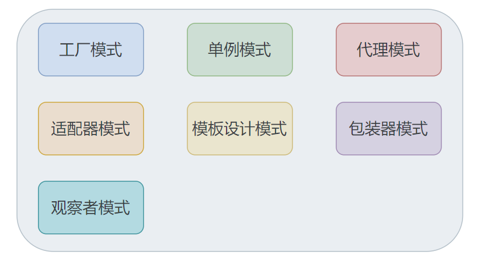
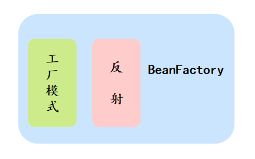

## 常见注解


## Spring 中的其它设计模式



- **「1.工厂设计模式」**: 比如通过 BeanFactory 和 ApplicationContext 来生产 Bean 对象
- **「2.代理设计模式」**:  AOP 的实现方式就是通过代理来实现，Spring主要是使用 JDK 动态代理和 CGLIB 代理
- **「3.单例设计模式」**: Spring 中的 Bean 默认都是单例的
- **「4.模板方法模式」**: Spring 中 jdbcTemplate 等以 Template 结尾的对数据库操作的类，都会使用到模板方法设计模式，一些通用的功能
- **「5.包装器设计模式」**: 我们的项目需要连接多个数据库，而且不同的客户在每次访问中根据需要会去访问不同的数据库。这种模式让我们可以根据客户的需求能够动态切换不同的数据源
- **「6.观察者模式」**: Spring 事件驱动模型观察者模式的
- **「7.适配器模式」**:Spring AOP 的增强或通知(Advice)使用到了适配器模式


## 实现一个 Spring 框架的过程

**Bean定义**： 
Bean通过一个配置文件定义，把它解析成一个类型。

- beans.properties偷懒，这里直接用了最方便解析的properties，这里直接用一个<key,value>类型的配置来代表Bean的定义，其中key是beanName，value是class复制代码

```java
userDao:cn.fighter3.bean.UserDao

```

- BeanDefinition.javabean定义类，配置文件中bean定义对应的实体复制代码

```java
public class BeanDefinition {

    private String beanName;

    private Class beanClass;
     //省略getter、setter  
 }

```

- ResourceLoader.java资源加载器，用来完成配置文件中配置的加载复制代码

```java
public class ResourceLoader {

    public static Map<String, BeanDefinition> getResource() {
        Map<String, BeanDefinition> beanDefinitionMap = new HashMap<>(16);
        Properties properties = new Properties();
        try {
            InputStream inputStream = ResourceLoader.class.getResourceAsStream("/beans.properties");
            properties.load(inputStream);
            Iterator<String> it = properties.stringPropertyNames().iterator();
            while (it.hasNext()) {
                String key = it.next();
                String className = properties.getProperty(key);
                BeanDefinition beanDefinition = new BeanDefinition();
                beanDefinition.setBeanName(key);
                Class clazz = Class.forName(className);
                beanDefinition.setBeanClass(clazz);
                beanDefinitionMap.put(key, beanDefinition);
            }
            inputStream.close();
        } catch (IOException | ClassNotFoundException e) {
            e.printStackTrace();
        }
        return beanDefinitionMap;
    }

}

```

- BeanRegister.java对象注册器，这里用于单例bean的缓存，我们大幅简化，默认所有bean都是单例的。可以看到所谓单例注册，也很简单，不过是往HashMap里存对象。复制代码

```java
public class BeanRegister {

    //单例Bean缓存
    private Map<String, Object> singletonMap = new HashMap<>(32);

    /**
     * 获取单例Bean
     *
     * @param beanName bean名称
     * @return
     */
    public Object getSingletonBean(String beanName) {
        return singletonMap.get(beanName);
    }

    /**
     * 注册单例bean
     *
     * @param beanName
     * @param bean
     */
    public void registerSingletonBean(String beanName, Object bean) {
        if (singletonMap.containsKey(beanName)) {
            return;
        }
        singletonMap.put(beanName, bean);
    }

}

```

- **BeanFactory.java**

   - 对象工厂，我们最**核心**的一个类，在它初始化的时候，创建了bean注册器，完成了资源的加载。
   - 获取bean的时候，先从单例缓存中取，如果没有取到，就创建并注册一个bean复制代码

```java
public class BeanFactory {

    private Map<String, BeanDefinition> beanDefinitionMap = new HashMap<>();

    private BeanRegister beanRegister;

    public BeanFactory() {
        //创建bean注册器
        beanRegister = new BeanRegister();
        //加载资源
        this.beanDefinitionMap = new ResourceLoader().getResource();
    }

    /**
     * 获取bean
     *
     * @param beanName bean名称
     * @return
     */
    public Object getBean(String beanName) {
        //从bean缓存中取
        Object bean = beanRegister.getSingletonBean(beanName);
        if (bean != null) {
            return bean;
        }
        //根据bean定义，创建bean
        return createBean(beanDefinitionMap.get(beanName));
    }

    /**
     * 创建Bean
     *
     * @param beanDefinition bean定义
     * @return
     */
    private Object createBean(BeanDefinition beanDefinition) {
        try {
            Object bean = beanDefinition.getBeanClass().newInstance();
            //缓存bean
            beanRegister.registerSingletonBean(beanDefinition.getBeanName(), bean);
            return bean;
        } catch (InstantiationException | IllegalAccessException e) {
            e.printStackTrace();
        }
        return null;
    }
}

```

- 测试
   - UserDao.java我们的Bean类，很简单复制代码
   - 单元测试复制代码
   - 运行结果复制代码

```java
public class UserDao {

    public void queryUserInfo(){
        System.out.println("A good man.");
    }
}

```

```java
public class ApiTest {
    @Test
    public void test_BeanFactory() {
        //1.创建bean工厂(同时完成了加载资源、创建注册单例bean注册器的操作)
        BeanFactory beanFactory = new BeanFactory();

        //2.第一次获取bean（通过反射创建bean，缓存bean）
        UserDao userDao1 = (UserDao) beanFactory.getBean("userDao");
        userDao1.queryUserInfo();

        //3.第二次获取bean（从缓存中获取bean）
        UserDao userDao2 = (UserDao) beanFactory.getBean("userDao");
        userDao2.queryUserInfo();
    }
}

```

```java
A good man.
A good man.

```
至此，我们一个乞丐+破船版的Spring就完成了，代码也比较完整，有条件的可以跑一下。


## 


