1. 什么是应用上下文？
2. 应用上下文生命周期是怎样的？
3. 有哪些应用场景？
4.

要想执行上面的代码，就必须先进行构造，因此先调用父类的构造方法。在这个过程中，要注意构造顺序：

1. 类中所有属性的默认值（一举而成）
2. 父类静态属性初始化，静态块，静态方法的声明（按出现顺序执行）
3. 子类静态属性初始化，静态块，静态方法的声明 （按出现顺序执行）
4. 调用父类的构造方法，首先父类的非静态成员初始化，构造块，普通方法的声明（按出现顺序执行）然后父类构造方法。
5. 调用子类的构造方法，首先子类的非静态成员初始化，构造块，普通方法的声明（按出现顺序执行）然后子类构造方法。

1. 先完成当前类中所有属性的默认值的设定，这个过程只是对属性的初始默认值的设定，这些属性包括自身所拥有的、从父类继承过来的。如 Object 类型的属性会先初始化为 null ，int 类型的会初始化为 0 等等。
2. 执行当前类的构造函数，会先执行无参构造函数，如果有继承，则先去完成父类的构造；
3. 在父类的构造中，会先初始化父类的静态属性初始化，静态块，静态方法的声明（按出现顺序执行）

父静态代码块 > 子静态代码块 > 父代属性初始化 > 父代码块 > 父构造函数 > 子代属性初始化 > 子代码块 > 子构造函数。

1.类中所有属性的默认值（一举而成）
2.父类静态属性初始化，静态块，静态方法的声明（按出现顺序执行）
3.子类静态属性初始化，静态块，静态方法的声明 （按出现顺序执行）
4.调用父类的构造方法，首先父类的非静态成员初始化，构造块，普通方法的声明（按出现顺序执行）然后父类构造方法。
5.调用子类的构造方法，首先子类的非静态成员初始化，构造块，普通方法的声明（按出现顺序执行）然后子类构造方法。
其中静态代码块只执行一次。
————————————————
版权声明：本文为CSDN博主「郄子硕-langgeligelang」的原创文章，遵循CC 4.0 BY-SA版权协议，转载请附上原文出处链接及本声明。
原文链接：[https://blog.csdn.net/q290994/article/details/101178062](https://blog.csdn.net/q290994/article/details/101178062)

父类的private成员不会被子类继承，子类不能访问。但是子类对象的确包含父类的私有成员。
父类的 包访问成员 继承为子类的包访问成员。就好像他们直接定义在子类中一样。
父类的 protected 成员继承为子类的protected 成员。就好像他们直接定义在子类中一样。
父类的 public 成员继承为子类的public 成员，就好像他们直接定义在子类中一样。

构造函数是不能被继承的，但是在子类中一定可以（也必须）借用父类的构造函数
java保证：除了Object类对象，每一个类的实例在构造时，先去调用父类的构造函数。
我们自定义类的构造函数的第一句一定是super(xx,…)，如果不是，那么第一句就一定是this(xx,…)去调用本类的另一个构造函数。
如果子类构造函数不显式的调用super()，那么，javac会自动插入super()，也就是父类无参数的构造函数。
对于构造函数，其实类中所有构造函数都是隐式static的。很明显的例证就是 构造函数無需通過实例就可以调用。

这样，当你想让一个类中的某个方法或成员变量在包中都可见，而且其子类也能访问（子类有可能和父类不在同一个包中）但又不想让所有类都可以访问该类时，就可以用protected修饰符。
就算在子类中，也只能通过子类（或子类的子类）的引用来访问父类中的protected方法和成员变量.

————————————————
版权声明：本文为CSDN博主「前行中632」的原创文章，遵循CC 4.0 BY-SA版权协议，转载请附上原文出处链接及本声明。
原文链接：[https://blog.csdn.net/qq_32635069/article/details/79837059](https://blog.csdn.net/qq_32635069/article/details/79837059)

[深入理解Java之jvm启动流程](https://cloud.tencent.com/developer/article/1038435)
[static{}静态代码块与{}普通代码块之间的区别](https://www.cnblogs.com/lukelook/p/11183155.html)

[https://doocs.github.io/source-code-hunter/#/](https://doocs.github.io/source-code-hunter/#/)

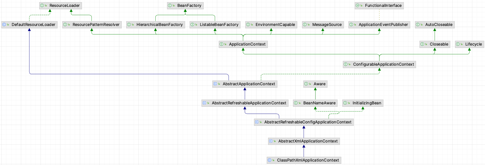

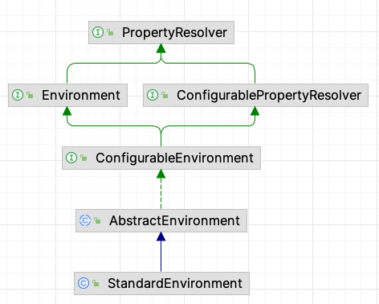

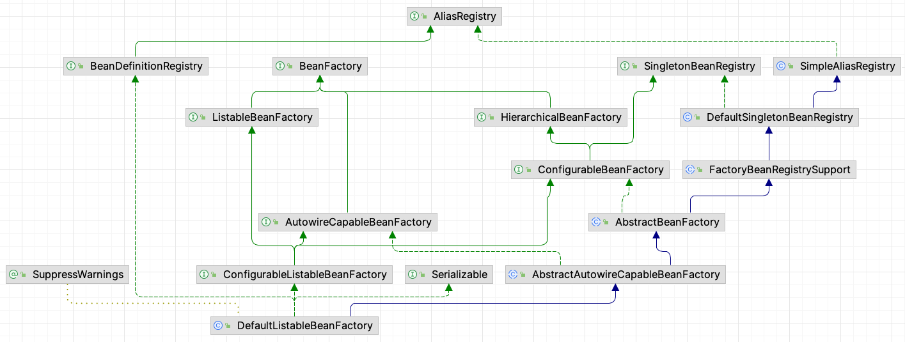

# 源码解读

在于 Spring 的源码启动过程，并不像我们平时在写业务代码。Spring 核心源码中大量使用了 Java 的构造过程。这就是最开始的软件编写过程，通过这个过程构造出来的容器，可以让我们简单的使用 Spring 容器的相关 api，而 Spring 的其它的模块功能，则都是根据 Spring 容器对外提供的 API 二次开发完成的。我们开发的业务代码则是在封装好的这些模块上再次开发来完成的。

# Java 构造过程


```


@Test
public void test1() {
    AnnotationConfigApplicationContext context = new AnnotationConfigApplicationContext(ConfigBean.class);
    for (String beanName : context.getBeanDefinitionNames()) {
        //别名
        String[] aliases = context.getAliases(beanName);
        System.out.println(String.format("bean名称:%s,别名:%s,bean对象:%s",
                beanName,
                Arrays.asList(aliases),
                context.getBean(beanName)));
    }
}

```

首先要说明一点，我们分析源码时，并不分析其构造过程。
this() 方法实际上是执行下面的自定义无参构造方法，

```
public AnnotationConfigApplicationContext() {
  this.reader = new AnnotatedBeanDefinitionReader(this); // @1
  this.scanner = new ClassPathBeanDefinitionScanner(this);
}

```

# this()

根据对象构造过程，我们可以知道在构造当前对象时，会先构造父类对象（在这个过程中，会先执行父类的静态方法、静态属性、静态代码块）。
之后调用当前类隐藏的 init() 方法，在之后完成当前类的普通属性的设值过程。因此，我们就从这个角度来分析。

例子

1. 查看 transaction 的相关源码；

# idea 调试技巧

## 查看栈帧

## 查看方法

## 查看类图

# 阅读代码的困难

registerNatives()

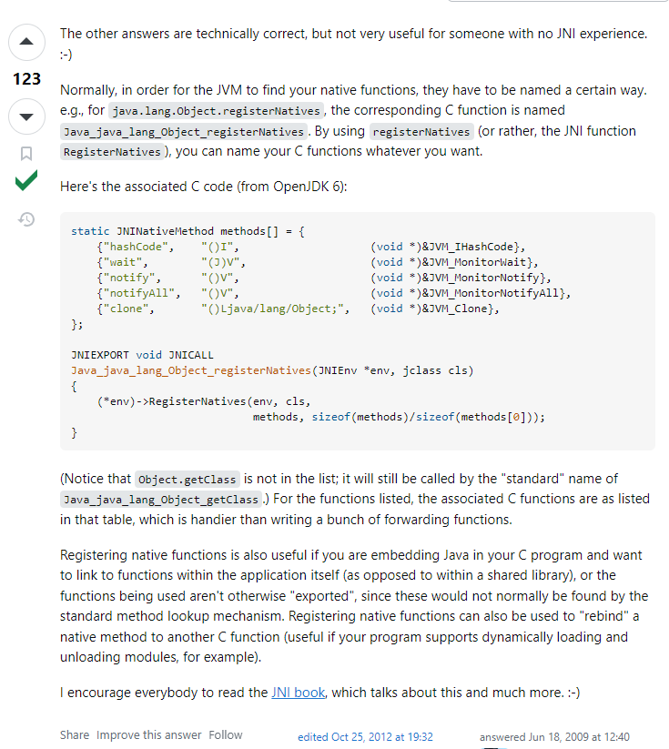

其实看源码的困难源于下面几点原因：

1. Spring 的代码结构不同于我们熟悉的业务代码。我们在书写业务代码时，很多时候都是基于一些框架来使用的，最常见的就是我们基于 Spring 全家桶来开发业务，而 Spring 的源码中大量运用了 JDK 的底层相关技术，不熟悉 jdk 底层的相关技术，就会读不懂 Spring 的源码。
2. jdk 底层的技术内容确实有些复杂。比如在 Spring 容器启动过程的源码中，大量运用了诸如反射、类加载、构造函数等，甚至还会根据 Java 语言特性使用不同的构造方式来实现不同的逻辑。

因此在阅读源码的过程中，是非常有必要再温习一下 Java 的相关内容。

# Java 的加载机制

### 阅读示例

查看类图，找到继承链；根据构造子对象之前要先构造父类对象的原则，按照继承链依次进行构造；

  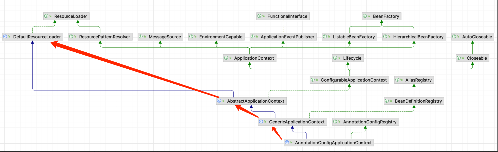

根据继承链，我们可以知道，要先对 DefaultResourceLoader 进行初始化。它的初始化过程应该是这样的：

1. 调用隐式的 init() 构造函数；
2. 调用自定义的无参构造函数；

  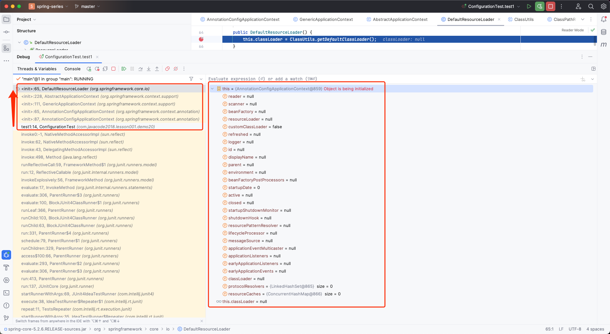

3. 执行 ClassUtils.getDefaultClassLoader() 静态方法时发现 ClassUtils 并没有完成初始化，因此进入 ClassUtils 进行初始化，初始化时发现 类中有静态代码块，于是先执行静态代码块：

  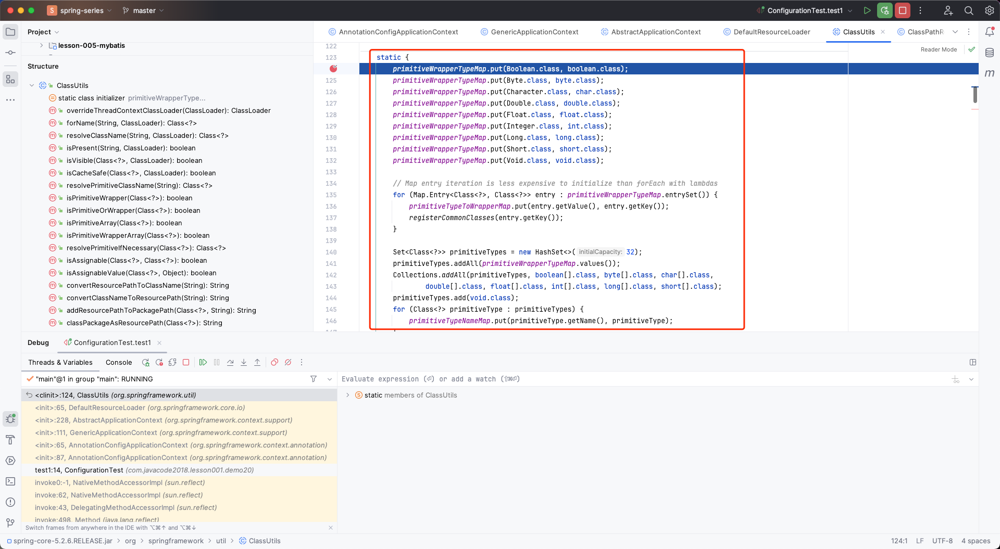

  静态代码块中完成一些变量的赋值操作：

  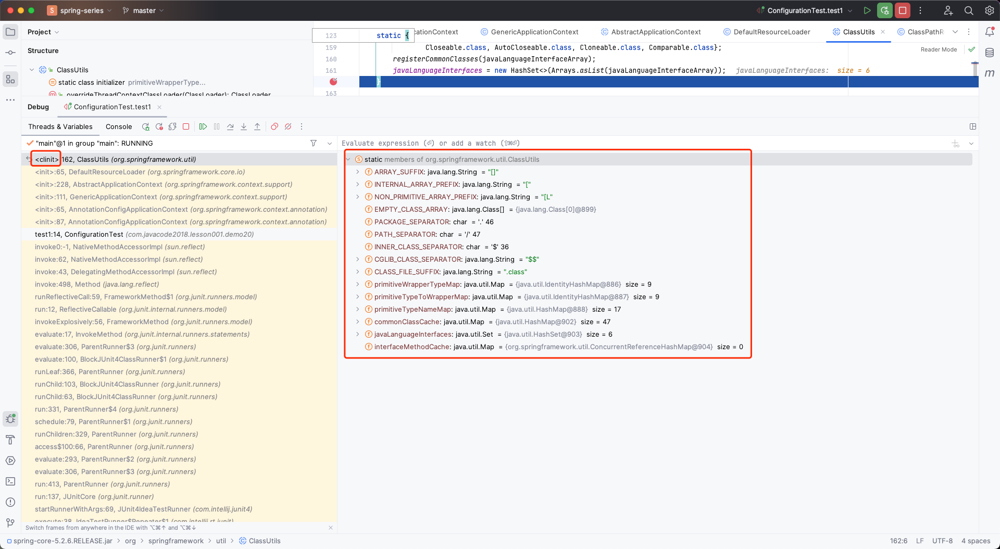

4. 执行完静态代码块之后，执行隐含的 init() 方法，之后执行第 3 步调用的方法：

  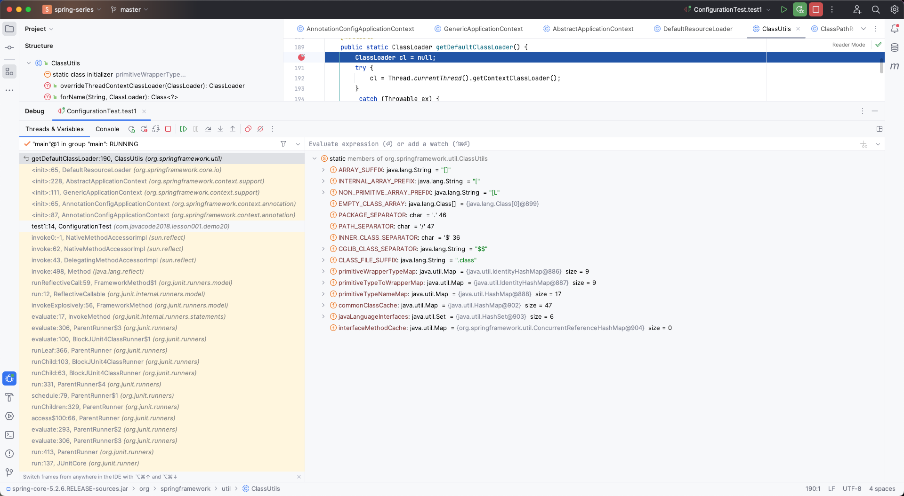

5. 再之后调用 DefaultResourceLoader 的隐式 init() 方法，完成成员变量的赋值操作；

  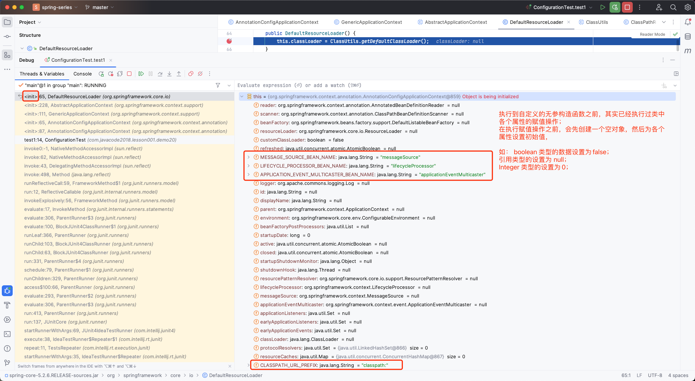

  根据上图左边的栈帧列表，也可以知道方法执行的顺序。这与我们所知道的“ jvm 中方法的运行是放到栈中，方法的执行就是栈帧的，并且方法的执行开始和结束就是栈帧的入栈和出栈”的说法是吻合的。从这个角度来讲，如果不熟悉 jvm，确实有些源码就是读不懂。

### 源码阅读

```java
@Test
public void test1() {
    AnnotationConfigApplicationContext context = new AnnotationConfigApplicationContext(ConfigBean.class);
    for (String beanName : context.getBeanDefinitionNames()) {
        //别名
        String[] aliases = context.getAliases(beanName);
        System.out.println(String.format("bean名称:%s,别名:%s,bean对象:%s",
                beanName,
                Arrays.asList(aliases),
                context.getBean(beanName)));
    }
}

```

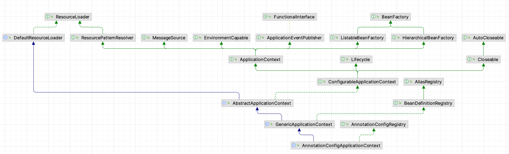

```
public AnnotationConfigApplicationContext(Class<?>... componentClasses) {
  this(); // @1
  register(componentClasses); // @3
  refresh(); // @4
}

// @2
public AnnotationConfigApplicationContext() {
  this.reader = new AnnotatedBeanDefinitionReader(this);
  this.scanner = new ClassPathBeanDefinitionScanner(this);
}

```

大概过程如下：

1. 首先，调用 AnnotationConfigApplicationContext 的 init() 构造方法时，会先根据继承链构造父类对象，事实上我们发现在构造 GenericApplicationContext 对象时，new 了一个 DefaultListableBeanFactory 对象；
2. 之后，便是 AnnotationConfigApplicationContext 的 init() 方法，这个方法主要本来的作用就是为 AnnotationConfigApplicationContext 设置相关属性的值，但是由于这个类中只有两个私有属性 reader 和 scanner，因此会调用 AnnotationConfigApplicationContext 本身的自定义无参构造方法 AnnotationConfigApplicationContext() ，这个方法里面为两个属性各自创建了一个对象；
1. AnnotatedBeanDefinitionReader
2. ClassPathBeanDefinitionScanner
3. 再之后，把我们使用注解标注的 JavaBean 注册到容器中；
4. 最后进行刷新；

####

---

#### 构造依赖关系

先构造继承关系和实现关系：【这里一句话带过，事实上这个过程还是有些复杂的，如果清楚 类对象的构造顺序，这里就不会很难】

;/1699503651274.png)
之后，我们发现在执行到 GenericApplicationContext 的构造方法时，会构造一个 DefaultListableBeanFactory 对象。

```
public GenericApplicationContext() {
  this.beanFactory = new DefaultListableBeanFactory(); // @1：这里即构造了一个 DefaultListableBeanFactory 类型的容器 。
}

```

##### DefaultListableBeanFactory 的构造过程

我们再来看 DefaultListableBeanFactory 的继承和依赖：

;/1699504873525.png)
调用过程如下，

1. org.springframework.beans.factory.support.DefaultListableBeanFactory#DefaultListableBeanFactory()
2. org.springframework.beans.factory.support.AbstractAutowireCapableBeanFactory#AbstractAutowireCapableBeanFactory()
3. org.springframework.beans.factory.support.AbstractBeanFactory#AbstractBeanFactory()
4. org.springframework.beans.factory.support.FactoryBeanRegistrySupport#init()
5. org.springframework.beans.factory.support.DefaultSingletonBeanRegistry#init()
6. org.springframework.core.SimpleAliasRegistry#init()

分析这个过程，我们发现这个过程就是确定容器的相关属性以及属性的设值，说白了，就是设置容器的相关属性。设置完成之后， DefaultListableBeanFactory 对象就有了基本的容器功能了。

##### DefaultListableBeanFactory 对象的基本功能

构造完成之后相关的属性及方法如下：

;/1699512489779.png)

;/1699514871420.png)
我们发现 beanDefinitionMap 中并没有值，说明 此时还没有任何 Bean 注入到容器中。下面代码运行到 AnnotationConfigApplicationContext 中的 init() 方法中，发现 AnnotationConfigApplicationContext 中只有两个属性，因此便开始执行 AnnotationConfigApplicationContext 的自定义无参构造函数。

> 这里补充一下 BeanFactory 和 ApplicationContext 的功能。

至此，继承关系和依赖关系构造过程介绍完毕。

#### init()

之后是 AnnotationConfigApplicationContext 的 init() 方法，这个方法作用是给属性赋值，但是 AnnotationConfigApplicationContext 只用两个私有属性，因此开始执行 AnnotationConfigApplicationContext 的自定义无参构造函数。

#### 自定义无参构造函数

为下面两个属性赋值，在此之前，我们先看一下构造到此处 AnnotationConfigApplicationContext 对象已经设置成功的属性：

;/1699515554278.png)

;/1699515593509.png)

;/1699515638801.png)

##### 3.1 this.reader = new AnnotatedBeanDefinitionReader(this)

再来看一下上面五个 bean 的放到容器的过程，关键代码是：

```
// org.springframework.context.annotation.AnnotatedBeanDefinitionReader#AnnotatedBeanDefinitionReader(org.springframework.beans.factory.support.BeanDefinitionRegistry)
public AnnotatedBeanDefinitionReader(BeanDefinitionRegistry registry) {
  this(registry, getOrCreateEnvironment(registry)); // @1-关键代码
}

```

###### 3.1.1 getOrCreateEnvironment(registry)

```
// org.springframework.context.annotation.AnnotatedBeanDefinitionReader#getOrCreateEnvironment
private static Environment getOrCreateEnvironment(BeanDefinitionRegistry registry) {
  Assert.notNull(registry, "BeanDefinitionRegistry must not be null");
  if (registry instanceof EnvironmentCapable) { // 由图1可知，构造完成的 registry 是 EnvironmentCapable 类型的，因此代码会走到这里
    return ((EnvironmentCapable) registry).getEnvironment(); // @1.1- 由图1也可知，getEnvironment() 方法最终会调用实现类 AbstractApplicationContext#createEnvironment() 方法，之后又是一大串的初始化和构造过程
  }
  return new StandardEnvironment();
}

// org.springframework.context.support.AbstractApplicationContext#createEnvironment
protected ConfigurableEnvironment createEnvironment() {
  return new StandardEnvironment(); // @1.2- 进入源代码中可以发现，这个构造过程，就是获取以 systemEnvironment 和 systemProperties 作为名称的系统环境变量和系统属性的值。
}

```

;/1699516844993.png)

```
public ConfigurableEnvironment getEnvironment() {
  if (this.environment == null) {
    this.environment = createEnvironment();
  }
  return this.environment;
}

protected ConfigurableEnvironment createEnvironment() {
  return new StandardEnvironment();
}

```

;/1699517889323.png)
systemEnvironment
systemProperties

;/1699517956820.png)

;/1699341846824.png)

;/1699341868824.png)

###### 3.1.2 this(registry, getOrCreateEnvironment(registry))

之后会进入下面的流程

```java
// org.springframework.context.annotation.AnnotatedBeanDefinitionReader#AnnotatedBeanDefinitionReader(org.springframework.beans.factory.support.BeanDefinitionRegistry, org.springframework.core.env.Environment)
public AnnotatedBeanDefinitionReader(BeanDefinitionRegistry registry, Environment environment) {
    Assert.notNull(registry, "BeanDefinitionRegistry must not be null");
    Assert.notNull(environment, "Environment must not be null");
    this.registry = registry;
    this.conditionEvaluator = new ConditionEvaluator(registry, environment, null); // 这里是对容器初始化状态的检验，简单来说就是判断 registry 、 environment 、 resourceLoader 是不是Spring规定的类型，不是的话，就重新构造，最后赋值给ConditionEvaluator的一个对象。
    AnnotationConfigUtils.registerAnnotationConfigProcessors(this.registry); // @2-关键代码
}

```

下面的代码，即是使用工具类 AnnotationConfigUtils 提供的 registerAnnotationConfigProcessors 方法，把五个 bean 注入到容器的过程。

```java
// org.springframework.context.annotation.AnnotationConfigUtils#registerAnnotationConfigProcessors(org.springframework.beans.factory.support.BeanDefinitionRegistry)
public static void registerAnnotationConfigProcessors(BeanDefinitionRegistry registry) {
    registerAnnotationConfigProcessors(registry, null);
}

// org.springframework.context.annotation.AnnotationConfigUtils#registerAnnotationConfigProcessors(org.springframework.beans.factory.support.BeanDefinitionRegistry, java.lang.Object)
public static Set<BeanDefinitionHolder> registerAnnotationConfigProcessors(
    BeanDefinitionRegistry registry, @Nullable Object source) {

    DefaultListableBeanFactory beanFactory = unwrapDefaultListableBeanFactory(registry);
    if (beanFactory != null) {
        if (!(beanFactory.getDependencyComparator() instanceof AnnotationAwareOrderComparator)) {
            beanFactory.setDependencyComparator(AnnotationAwareOrderComparator.INSTANCE);
        }
        if (!(beanFactory.getAutowireCandidateResolver() instanceof ContextAnnotationAutowireCandidateResolver)) {
            beanFactory.setAutowireCandidateResolver(new ContextAnnotationAutowireCandidateResolver());
        }
    }
    
    Set<BeanDefinitionHolder> beanDefs = new LinkedHashSet<>(8);

    //1、注册ConfigurationClassPostProcessor，这是个非常关键的类，实现了BeanDefinitionRegistryPostProcessor接口
    // ConfigurationClassPostProcessor这个类主要做的事情：负责所有bean的注册,如果想看bean注册源码的，可以在其postProcessBeanDefinitionRegistry方法中设置断点
    if (!registry.containsBeanDefinition(CONFIGURATION_ANNOTATION_PROCESSOR_BEAN_NAME)) {
        /**
          * 这里添加的是ConfigurationClassPostProcessor这个BeanDefinition，这个BeanDefinition很重要
          * 它本身也是一个beanFactory的后置处理器，这里添加进去的意思就是说后面spring启动扫描的时候就是用这个后置处理器来
          * 扫描我们的配置类，比如我的配置类是Appconfig,那么这个后置处理器就是专门处理这个配置类配置的类路径信息
          * 所以说这个beanFactory后置处理器非常重要，简单来说就是对我们配置类路径进行扫描，扫描成一个一个的BeanDefinition
          * 然后放入beanDefinitonMap中，就是这个ConfigurationClassPostProcessor后置处理器来做的事情
          *
          * 这里生成的是一个RootBeanDefinition,看了spring的生命周期都知道，spring中的扫描成的BeanDefinition最后都会合并成
          * RootBeanDefiniton,意思就是它没有父类的bd了
          */
        RootBeanDefinition def = new RootBeanDefinition(ConfigurationClassPostProcessor.class);
        def.setSource(source);
        beanDefs.add(registerPostProcessor(registry, def, CONFIGURATION_ANNOTATION_PROCESSOR_BEAN_NAME));
    }

    //2、注册AutowiredAnnotationBeanPostProcessor：负责处理@Autowire注解
    if (!registry.containsBeanDefinition(AUTOWIRED_ANNOTATION_PROCESSOR_BEAN_NAME)) {
        RootBeanDefinition def = new RootBeanDefinition(AutowiredAnnotationBeanPostProcessor.class);
        def.setSource(source);
        beanDefs.add(registerPostProcessor(registry, def, AUTOWIRED_ANNOTATION_PROCESSOR_BEAN_NAME));
    }
    
    // Check for JSR-250 support, and if present add the CommonAnnotationBeanPostProcessor.
    //3、注册CommonAnnotationBeanPostProcessor：负责处理@Resource注解
    if (jsr250Present && !registry.containsBeanDefinition(COMMON_ANNOTATION_PROCESSOR_BEAN_NAME)) {
        RootBeanDefinition def = new RootBeanDefinition(CommonAnnotationBeanPostProcessor.class);
        def.setSource(source);
        beanDefs.add(registerPostProcessor(registry, def, COMMON_ANNOTATION_PROCESSOR_BEAN_NAME));
    }
    
    // Check for JPA support, and if present add the PersistenceAnnotationBeanPostProcessor.
    // 如果你的系统中启用了JPA的方式，那么这里添加一个JPA的后置处理器
    if (jpaPresent && !registry.containsBeanDefinition(PERSISTENCE_ANNOTATION_PROCESSOR_BEAN_NAME)) {
        RootBeanDefinition def = new RootBeanDefinition();
        try {
            def.setBeanClass(ClassUtils.forName(PERSISTENCE_ANNOTATION_PROCESSOR_CLASS_NAME,
                                                AnnotationConfigUtils.class.getClassLoader()));
        }
        catch (ClassNotFoundException ex) {
            throw new IllegalStateException(
                "Cannot load optional framework class: " + PERSISTENCE_ANNOTATION_PROCESSOR_CLASS_NAME, ex);
        }
        def.setSource(source);
        beanDefs.add(registerPostProcessor(registry, def, PERSISTENCE_ANNOTATION_PROCESSOR_BEAN_NAME));
    }

    //5、注册EventListenerMethodProcessor：负责处理@EventListener标注的方法，即事件处理器
    if (!registry.containsBeanDefinition(EVENT_LISTENER_PROCESSOR_BEAN_NAME)) {
        RootBeanDefinition def = new RootBeanDefinition(EventListenerMethodProcessor.class);
        def.setSource(source);
        beanDefs.add(registerPostProcessor(registry, def, EVENT_LISTENER_PROCESSOR_BEAN_NAME));
    }

    // 6、注册DefaultEventListenerFactory：负责将@EventListener标注的方法包装为ApplicationListener对象
    if (!registry.containsBeanDefinition(EVENT_LISTENER_FACTORY_BEAN_NAME)) {
        RootBeanDefinition def = new RootBeanDefinition(DefaultEventListenerFactory.class);
        def.setSource(source);
        beanDefs.add(registerPostProcessor(registry, def, EVENT_LISTENER_FACTORY_BEAN_NAME));
    }

    return beanDefs;
}


```

;/1699517053472.png)

**1、ConfigurationClassPostProcessor**：这是个非常关键的类，建议去看一下他的源码，基本上我们自定义的bean都是通过这个类注册的，下面这些注解都是在这个类中处理的

```
@Configuration
@Component
@PropertySource
@PropertySources
@ComponentScan
@ComponentScans
@Import
@ImportResource
@Bean

```

**2、AutowiredAnnotationBeanPostProcessor**：负责处理@Autowire注解
**3、注册CommonAnnotationBeanPostProcessor**：负责处理@Resource注解
**4、注册EventListenerMethodProcessor**：负责处理@EventListener标注的方法，即事件处理器
**5、注册DefaultEventListenerFactory**：负责将@EventListener标注的方法包装为ApplicationListener对象

这读取器的构造器法主要是根据当前的bean工厂做一些设置：
1.添加一个默认的比较器
2.设置一个上下文的筛选器（蛀牙对ban的查找进行筛选的类）
3.添加ConfigurationClassPostProcessor成一个BeanDefinition（配置类解析器）；
4.添加AutowiredAnnotationBeanPostProcessor成一个BeanDefinition（依赖注入）；
5.添加CommonAnnotationBeanPostProcessor成一个BeanDefinition（依赖注入、生命周期）；
6.添加EventListenerMethodProcessor成一个BeanDefinition；
7.添加DefaultEventListenerFactory成一个BeanDefinition；
在没有启用JPA的情况下，会添加5个BeanDefinition（后置处理器），一个比较器BeanDefinition，一个bean筛选器（BeanDefinition）；

##### 3.2 this.scanner = new ClassPathBeanDefinitionScanner(this)

;/1699516563190.png)

```
public ClassPathBeanDefinitionScanner(BeanDefinitionRegistry registry) {
  this(registry, true);
}

public ClassPathBeanDefinitionScanner(BeanDefinitionRegistry registry, boolean useDefaultFilters) {
  this(registry, useDefaultFilters, getOrCreateEnvironment(registry)); // getOrCreateEnvironment 进入 @2 处
}

public ClassPathBeanDefinitionScanner(BeanDefinitionRegistry registry, boolean useDefaultFilters,
            Environment environment) {

  this(registry, useDefaultFilters, environment,
      (registry instanceof ResourceLoader ? (ResourceLoader) registry : null));
}


public ClassPathBeanDefinitionScanner(BeanDefinitionRegistry registry, boolean useDefaultFilters,
            Environment environment, @Nullable ResourceLoader resourceLoader) {

  Assert.notNull(registry, "BeanDefinitionRegistry must not be null");
  this.registry = registry;

  if (useDefaultFilters) {
    
    // @4 ： 这里不再展开，其作用就是 注入 所有标注了 @Component 的过滤器
    //   Register the default filter for @Component. 
    //   This will implicitly register all annotations that have the @Component meta-annotation including the 
    //     @Repository, @Service, and @Controller stereotype annotations.
    registerDefaultFilters(); 
  }
  setEnvironment(environment);
  setResourceLoader(resourceLoader);
}

// @2 此处执行逻辑与 new AnnotatedBeanDefinitionReader(this) 处的执行逻辑一致，均是进入 @3 处
private static Environment getOrCreateEnvironment(BeanDefinitionRegistry registry) {
  Assert.notNull(registry, "BeanDefinitionRegistry must not be null");
  if (registry instanceof EnvironmentCapable) {
    return ((EnvironmentCapable) registry).getEnvironment(); // @3
  }
  return new StandardEnvironment();
}

```

;/1699519184552.png)

执行完成自定义的无参构造函数之后，我们发现 beanDefinitionMap 中已经有五个 bean 了：

;/1699509876844.png)
说明 this() 方法完成了 容器的初始化过程、并在容器中注入 五个 bean 。

> 五个 Bean 的作用
