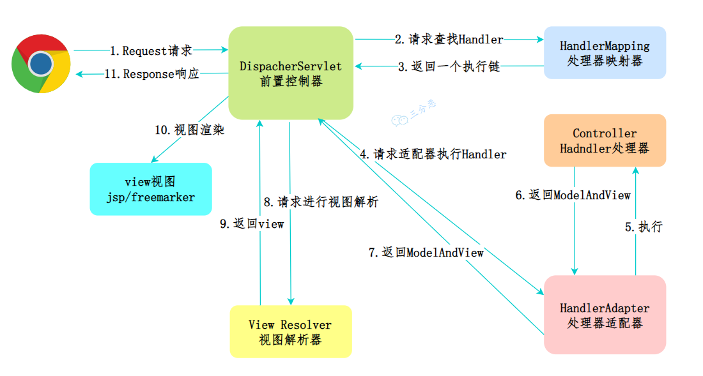
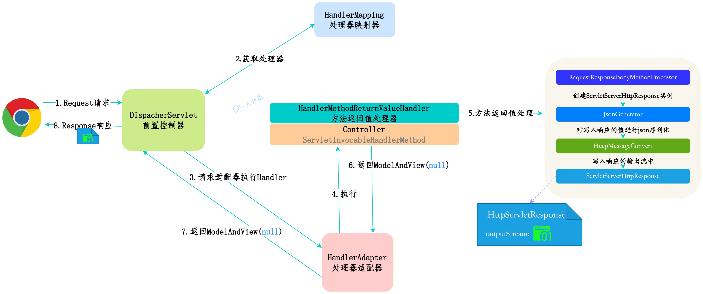
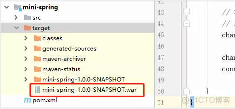
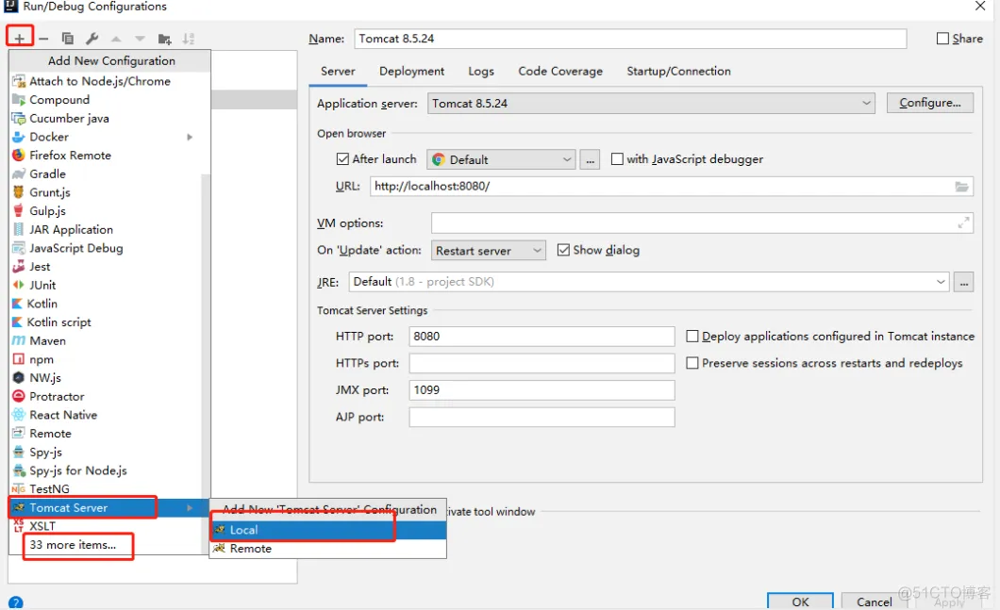
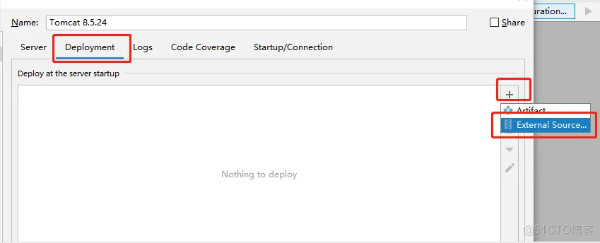
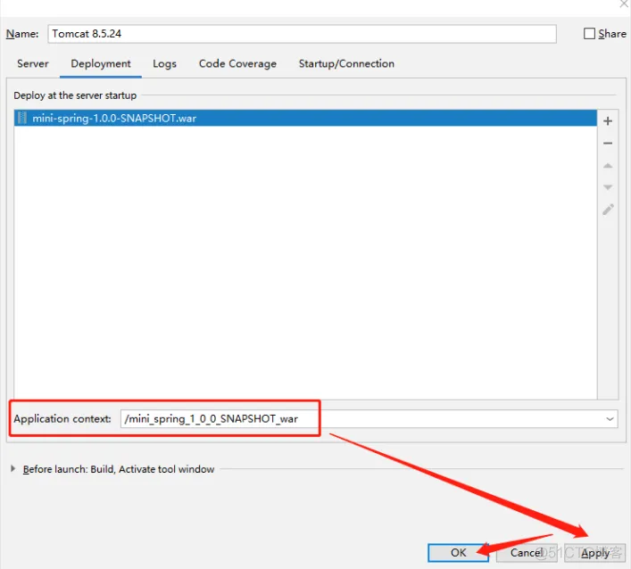

# Web


1. Serverlet 机制和原理
2. MVC 原理
3. SpringMVC 原理



1. 客户端向服务端发送一次请求，这个请求会先到前端控制器DispatcherServlet(也叫中央控制器)。
2. DispatcherServlet接收到请求后会调用HandlerMapping处理器映射器。由此得知，该请求该由哪个Controller来处理（并未调用Controller，只是得知）
3. DispatcherServlet调用HandlerAdapter处理器适配器，告诉处理器适配器应该要去执行哪个Controller
4. HandlerAdapter处理器适配器去执行Controller并得到ModelAndView(数据和视图)，并层层返回给DispatcherServlet
5. DispatcherServlet将ModelAndView交给ViewReslover视图解析器解析，然后返回真正的视图。
6. DispatcherServlet将模型数据填充到视图中
7. DispatcherServlet将结果响应给客户端

加入了 **@ResponseBody**这个注解后，整体的流程上和使用ModelAndView大体上相同，但是细节上有一些不同：



1. 客户端向服务端发送一次请求，这个请求会先到前端控制器DispatcherServlet
2. DispatcherServlet接收到请求后会调用HandlerMapping处理器映射器。由此得知，该请求该由哪个Controller来处理
3. DispatcherServlet调用HandlerAdapter处理器适配器，告诉处理器适配器应该要去执行哪个Controller
4. Controller被封装成了ServletInvocableHandlerMethod，HandlerAdapter处理器适配器去执行invokeAndHandle方法，完成对Controller的请求处理
5. HandlerAdapter执行完对Controller的请求，会调用HandlerMethodReturnValueHandler去处理返回值，主要的过程：5.1. 调用RequestResponseBodyMethodProcessor，创建ServletServerHttpResponse（Spring对原生ServerHttpResponse的封装）实例5.2.使用HttpMessageConverter的write方法，将返回值写入ServletServerHttpResponse的OutputStream输出流中5. 在写入的过程中，会使用JsonGenerator（默认使用Jackson框架）对返回值进行Json序列化
6. 执行完请求后，返回的ModealAndView为null，ServletServerHttpResponse里也已经写入了响应，所以不用关心View的处理

那么接下来就简单介绍一下 DispatcherServlet 和九大组件（按使用顺序排序的）：

| **组件** | **说明** |
| --- | --- |
| DispatcherServlet | Spring MVC 的核心组件，是请求的入口，负责协调各个组件工作 |
| MultipartResolver | 内容类型( Content-Type )为 multipart/* 的请求的解析器，例如解析处理文件上传的请求，便于获取参数信息以及上传的文件 |
| HandlerMapping | 请求的处理器匹配器，负责为请求找到合适的 HandlerExecutionChain 处理器执行链，包含处理器（handler）和拦截器们（interceptors） |
| HandlerAdapter | 处理器的适配器。因为处理器 handler 的类型是 Object 类型，需要有一个调用者来实现 handler 是怎么被执行。Spring 中的处理器的实现多变，比如用户处理器可以实现 Controller 接口、HttpRequestHandler 接口，也可以用 @RequestMapping 注解将方法作为一个处理器等，这就导致 Spring MVC 无法直接执行这个处理器。所以这里需要一个处理器适配器，由它去执行处理器 |
| HandlerExceptionResolver | 处理器异常解析器，将处理器（ handler ）执行时发生的异常，解析( 转换 )成对应的 ModelAndView 结果 |
| RequestToViewNameTranslator | 视图名称转换器，用于解析出请求的默认视图名 |
| LocaleResolver | 本地化（国际化）解析器，提供国际化支持 |
| ThemeResolver | 主题解析器，提供可设置应用整体样式风格的支持 |
| ViewResolver | 视图解析器，根据视图名和国际化，获得最终的视图 View 对象 |
| FlashMapManager | FlashMap 管理器，负责重定向时，保存参数至临时存储（默认 Session） |

Spring MVC 对各个组件的职责划分的比较清晰。DispatcherServlet 负责协调，其他组件则各自做分内之事，互不干扰。

### SpringMVC 拦截器如何使用？

Spring的处理程序映射机制包括处理程序拦截器，当你希望将特定功能应用于某些请求时，例如，检查用户主题时，这些拦截器非常有用。拦截器必须实现org.springframework.web.servlet包的HandlerInterceptor。此接口定义了三种方法：

- preHandle：在执行实际处理程序之前调用。
- postHandle：在执行完实际程序之后调用。
- afterCompletion：在完成请求后调用。

### 常见注解

@Controller
@RequestMapping
@RestController
@GetMapping
@RequestParam
@PathVariable
@ResponseBody

### REST

什么是 REST
有哪些操作？
是无状态的吗？
安全嘛？

### 基于 Servlet 开发的示例

1. pom 文件引入依赖，需要注意的是，package 属性要设置成 war 包，为了节省篇幅，这里没有列出 pom 完整的信息：

    ```xml
    <packaging>war</packaging> 
    <dependencies>
    <dependency>
    <groupId>javax.servlet</groupId>
    <artifactId>servlet-api</artifactId>
    <version>2.4</version>
            </dependency>

            <dependency>
                <groupId>org.apache.commons</groupId>
                <artifactId>commons-lang3</artifactId>
                <version>3.7</version>
            </dependency>

            <dependency>
                <groupId>com.alibaba</groupId>
                <artifactId>fastjson</artifactId>
                <version>1.2.72</version>
            </dependency>
        </dependencies>

    ```

2. 在 src/main 下面新建文件夹 webapp/WEB-INF，然后在 WEB-INF 下面新建一个 web.xml 文件：

    ```xml
    <?xml version="1.0" encoding="UTF-8"?>
    <web-app xmlns:xsi="http://www.w3.org/2001/XMLSchema-instance"
     xmlns="http://java.sun.com/xml/ns/j2ee" xmlns:javaee="http://java.sun.com/xml/ns/javaee"
     xmlns:web="http://java.sun.com/xml/ns/javaee/web-app_2_5.xsd"
     xsi:schemaLocation="http://java.sun.com/xml/ns/j2ee http://java.sun.com/xml/ns/j2ee/web-app_2_4.xsd"
     version="2.4">
     <display-name>Lonely Wolf Web Application</display-name>
     <servlet>
      <servlet-name>helloServlet</servlet-name>
      <servlet-class>com.lonely.wolf.mini.spring.servlet.HelloServlet</servlet-class>
     </servlet>
     <servlet-mapping>
      <servlet-name>helloServlet</servlet-name>
      <url-pattern>/hello/*</url-pattern>
     </servlet-mapping>
    </web-app>

    ```

3. 新建一个 HelloServlet 类继承 HttpServlet：

    ```java
    /**
     * 原始Servlet接口编写，一般需要实现GET和POST方法，其他方法可以视具体情况选择性继承
     */
    public class HelloServlet extends HttpServlet {
        @Override
        protected void doGet(HttpServletRequest request, HttpServletResponse response) throws ServletException, IOException {
            this.doPost(request,response);
        }

        @Override
        protected void doPost(HttpServletRequest request, HttpServletResponse response) throws ServletException, IOException {
            response.setContentType("text/html;charset=utf-8");
            response.getWriter().write("Hello：" + request.getParameter("name"));
        }
    }

    ```

4. 执行 maven 打包命令，确认成功打包成 war 包：

    

5. RUN-->Edit Configurations，然后点击左上角的 + 号，新建一个 Tomcat Server，如果是第一次配置，默认没有 Tomcat Server 选项，需要点击底部的 xx more items...：

    

6. 点击右边的 Deployment，然后按照下图依次点击，最后在弹框内找到上面打包好的 war 包文件：

    

7. 选中之后，需要注意的是，下面 Application Context 默认会带上 war 包名，为了方便，我们需要把它删掉，即不用上下文路径，只保留一个根路径 / （当然上下文也可以保留，但是每次请求都要带上这一部分）， 再选择 Apply，点击 OK，即可完成部署：

    

8. 最后我们在浏览器输入请求路径<http://localhost:8080/hello?name=双子孤狼，即可得到返回：Hello：双子孤狼。>

### TODO 

```log
Spring 5.0 ： 拥抱反应式编程
到目前为止，无论是普通的form-based的MVC，还是Restful风格的Web， 其核心都是Servlet !

Web Container 会维护一个线程池， 当Web请求来了以后，从线程池取一个线程来处理，如果这个请求需要访问数据库，网络，那这个线程就得等着， 这就是所谓同步阻塞的模型。

当请求过多，线程池用光以后，连最基本的请求都无法处理了。为了解决这个问题，Java 世界开始呼唤新的IO模式。

2017年9月发布的Spring 5.0 开始拥抱新的模型：异步非阻塞， 这就是Spring WebFlux。

```

### 参考链接

1. [https://canvas.zut.edu.cn/courses/2138/pages/jiang-yi-1-spring-ge-javakuang-jia-15nian-de-yan-hua](https://canvas.zut.edu.cn/courses/2138/pages/jiang-yi-1-spring-ge-javakuang-jia-15nian-de-yan-hua)
2. [https://blog.51cto.com/u_13929722/3411359](https://blog.51cto.com/u_13929722/3411359)
