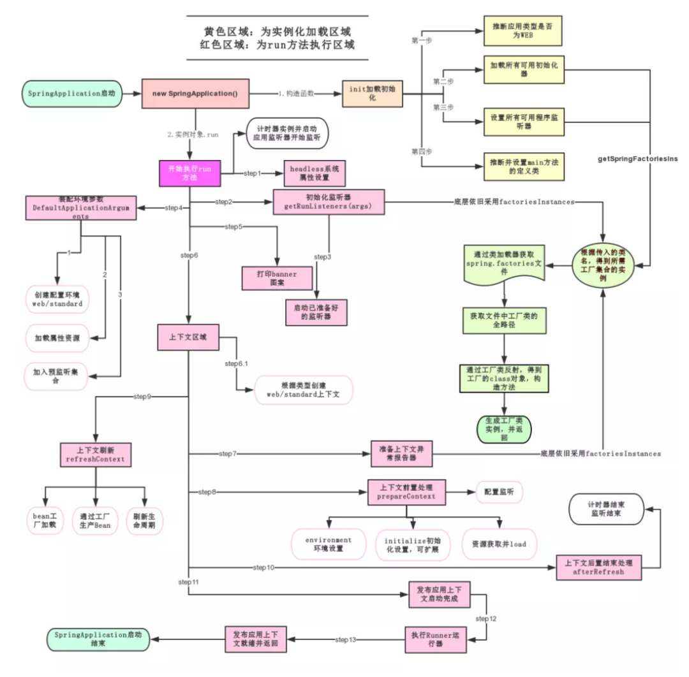
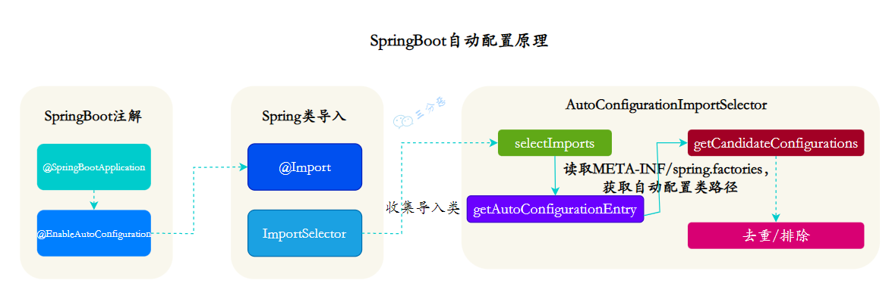
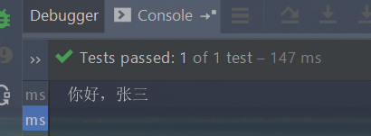

# springboot


## 优势

Spring Boot 基于 Spring 开发，Spirng Boot 本身并不提供 Spring 框架的核心特性以及扩展功能，只是用于快速、敏捷地开发新一代基于 Spring 框架的应用程序。它并不是用来替代 Spring 的解决方案，而是和 Spring 框架紧密结合用于提升 Spring 开发者体验的工具。

Spring Boot 以约定大于配置核心思想开展工作，相比Spring具有如下优势：

1. Spring Boot 可以快速创建独立的Spring应用程序。
2. Spring Boot 内嵌了如Tomcat，Jetty和Undertow这样的容器，也就是说可以直接跑起来，用不着再做部署工作了。
3. Spring Boot 无需再像Spring一样使用一堆繁琐的xml文件配置。
4. Spring Boot 可以自动配置(核心)Spring。SpringBoot将原有的XML配置改为Java配置，将bean注入改为使用注解注入的方式(@Autowire)，并将多个xml、properties配置浓缩在一个appliaction.yml配置文件中。
5. Spring Boot 提供了一些现有的功能，如量度工具，表单数据验证以及一些外部配置这样的一些第三方功能。
6. Spring Boot 可以快速整合常用依赖（开发库，例如spring-webmvc、jackson-json、validation-api和tomcat等），提供的POM可以简化Maven的配置。当我们引入核心依赖时，SpringBoot会自引入其他依赖。

在使用Spring框架进行开发的过程中，需要配置很多Spring框架包的依赖，如spring-core、spring-bean、spring-context等，而这些配置通常都是重复添加的，而且需要做很多框架使用及环境参数的重复配置，如开启注解、配置日志等。Spring Boot致力于弱化这些不必要的操作，提供默认配置，当然这些默认配置是可以按需修改的，快速搭建、开发和运行Spring应用。
以下是使用SpringBoot的一些好处：

- 自动配置，使用基于类路径和应用程序上下文的智能默认值，当然也可以根据需要重写它们以满足开发人员的需求。
- 创建Spring Boot Starter 项目时，可以选择选择需要的功能，Spring Boot将为你管理依赖关系。
- SpringBoot项目可以打包成jar文件。可以使用Java-jar命令从命令行将应用程序作为独立的Java应用程序运行。
- 在开发web应用程序时，springboot会配置一个嵌入式Tomcat服务器，以便它可以作为独立的应用程序运行。（Tomcat是默认的，当然你也可以配置Jetty或Undertow）
- SpringBoot包括许多有用的非功能特性（例如安全和健康检查）。


# 配置文件的加载顺序
Spring Boot支持不同环境的属性配置文件切换，通过创建application-{profile}.properties文件，其中{profile}是具体的环境标识名称，例如：application-dev.properties用于开发环境，application-test.properties用于测试环境，application-uat.properties用于uat环境。如果要想使用application-dev.properties文件，则在application.properties文件中添加spring.profiles.active=dev。
如果要想使用application-test.properties文件，则在application.properties文件中添加spring.profiles.active=test。


# SpringBoot 的安全手段

# 

- 在生产中使用HTTPS
- 使用Snyk检查你的依赖关系
- 升级到最新版本
- 启用CSRF保护
- 使用内容安全策略防止XSS攻击

# 


## 启动原理



- 1.容器在启动的时候会调用 EnableAutoConfigurationImportSelector.class 的 selectImports方法**「获取一个全面的常用 BeanConfiguration 列表」**
- 2.之后会读取 spring-boot-autoconfigure.jar 下面的spring.factories，**「获取到所有的 Spring 相关的 Bean 的全限定名 ClassName」**
- 3.之后继续**「调用 filter 来一一筛选」**，过滤掉一些我们不需要不符合条件的 Bean
- 4.最后把符合条件的 BeanConfiguration 注入默认的 EnableConfigurationPropertie 类里面的属性值，并且**「注入到 IOC 环境当中」**

SpringApplication 这个类主要做了以下四件事情：

1. 推断应用的类型是普通的项目还是 Web 项目
2. 查找并加载所有可用初始化器 ， 设置到 initializers 属性中
3. 找出所有的应用程序监听器，设置到 listeners 属性中
4. 推断并设置 main 方法的定义类，找到运行的主类


## 自动配置原理
SpringBoot开启自动配置的注解是@EnableAutoConfiguration ，启动类上的注解@SpringBootApplication是一个复合注解，包含了@EnableAutoConfiguration：



- EnableAutoConfiguration 只是一个简单的注解，自动装配核心功能的实现实际是通过 AutoConfigurationImportSelector类

```java
@AutoConfigurationPackage //将main同级的包下的所有组件注册到容器中
@Import({AutoConfigurationImportSelector.class}) //加载自动装配类 xxxAutoconfiguration
public @interface EnableAutoConfiguration {
    String ENABLED_OVERRIDE_PROPERTY = "spring.boot.enableautoconfiguration";

    Class<?>[] exclude() default {};

    String[] excludeName() default {};
}

```

- AutoConfigurationImportSelector实现了ImportSelector接口，这个接口的作用就是收集需要导入的配置类，配合@Import(）就可以将相应的类导入到Spring容器中
- 获取注入类的方法是selectImports()，它实际调用的是getAutoConfigurationEntry，这个方法是获取自动装配类的关键，主要流程可以分为这么几步：
   1. 获取注解的属性，用于后面的排除
   2. **获取所有需要自动装配的配置类的路径**：这一步是最关键的，从META-INF/spring.factories获取自动配置类的路径
   3. 去掉重复的配置类和需要排除的重复类，把需要自动加载的配置类的路径存储起来

```java
    protected AutoConfigurationImportSelector.AutoConfigurationEntry getAutoConfigurationEntry(AnnotationMetadata annotationMetadata) {
        if (!this.isEnabled(annotationMetadata)) {
            return EMPTY_ENTRY;
        } else {
            //1.获取到注解的属性
            AnnotationAttributes attributes = this.getAttributes(annotationMetadata);
            //2.获取需要自动装配的所有配置类，读取META-INF/spring.factories，获取自动配置类路径
            List<String> configurations = this.getCandidateConfigurations(annotationMetadata, attributes);
            //3.1.移除重复的配置
            configurations = this.removeDuplicates(configurations);
            //3.2.处理需要排除的配置
            Set<String> exclusions = this.getExclusions(annotationMetadata, attributes);
            this.checkExcludedClasses(configurations, exclusions);
            configurations.removeAll(exclusions);
            configurations = this.getConfigurationClassFilter().filter(configurations);
            this.fireAutoConfigurationImportEvents(configurations, exclusions);
            return new AutoConfigurationImportSelector.AutoConfigurationEntry(configurations, exclusions);
        }
    }

```


## 自定义 starter
知道了自动配置原理，创建一个自定义SpringBoot Starter也很简单。

```java
<dependency>
            <groupId>org.springframework.boot</groupId>
            <artifactId>spring-boot-starter</artifactId>
        </dependency>
        <dependency>
            <groupId>org.springframework.boot</groupId>
            <artifactId>spring-boot-configuration-processor</artifactId>
            <optional>true</optional>
        </dependency>

```

```java
@ConfigurationProperties(prefix = "hello")
public class HelloProperties {

    private String name;

    //省略getter、setter
}

```

```java
@Configuration
@EnableConfigurationProperties(HelloProperties.class)
public class HelloPropertiesConfigure {
}

```

```java
org.springframework.boot.autoconfigure.EnableAutoConfiguration=\
  cn.fighter3.demo.starter.configure.HelloPropertiesConfigure

```

- 测试
   - 创建一个工程，引入自定义starter依赖复制代码

```java
<dependency>
    <groupId>cn.fighter3</groupId>
    <artifactId>demo-spring-boot-starter</artifactId>
    <version>0.0.1-SNAPSHOT</version>
</dependency>

```

   - 在配置文件里添加配置复制代码

```java
hello.name=张三

```

      - 测试类

```java
@RunWith(SpringRunner.class)
@SpringBootTest
public class HelloTest {
    @Autowired
    HelloProperties helloProperties;

    @Test
    public void hello(){
        System.out.println("你好，"+helloProperties.getName());
    }
}

```

      - 运行结果




1. @SpringBootApplication 注解原理
2. 如何自定义 starter？
3. 如何解决跨域？
4. 常见的注解有哪些？

SpringBoot优点

SpringBoot启动原理


### Springboot 的自动装配

什么是装配？

Spring Boot中的自动装配技术底层主要用到了下面这些技术:

Spring 模式注解装配

Spring [@Enable ](/Enable ) 模块装配 

Spring 条件装配装（深入学习Spring组件注册中有介绍）

Spring 工厂加载机制

[https://mrbird.cc/deepin-springboot-autoconfig.html](https://mrbird.cc/deepin-springboot-autoconfig.html)

[https://mrbird.cc/archives/page/3/](https://mrbird.cc/archives/page/3/)
