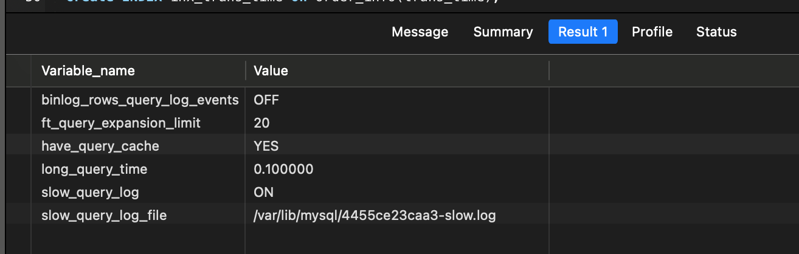
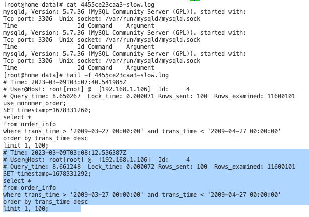
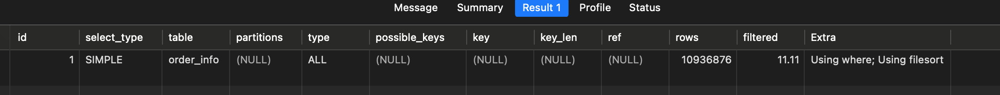
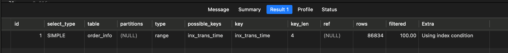
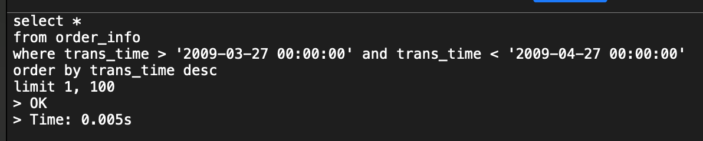
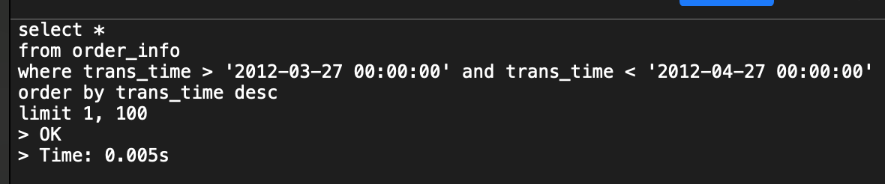
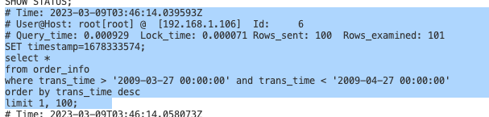

## 问题描述
1. 使用默认的时间范围（最近一个月）调用后端接口时，运营人员反映接口响应速度过慢，长长等待七八秒才返回数据；
2. 单表数据量在千万级


## 定位并解决问题

1. 在应用程序日志文件中，通过线程名称找到报错信息，发现mapper方法执行时间与service方法时间差超过8s，猜测可能是慢sql问题；并且让运维人员导出慢sql文件，发现确实有这条sql，并且慢sql语句平均查询时间为8s；
2. 拿着这条sql去数据库中执行，查询时间在8s左右，查看一下执行计划，发现用到了全表扫描；
3. 给这个字段创建索引，再次执行稳定在10ms之内，再查询一下执行计划，发现用到了索引；


## 总结

1. explain执行计划的字段及其相关的解释等；
2. 创建索引之后的执行计划分析；
3. 索引的使用方法、索引的分类、数据结构、索引失效的一些原因；
4. 常见的sql优化的经验等；

```bash
select count(1)
from order_info;
-- 11600000 -> 1160w

```


## 索引相关

索引使用方法、索引底层数据结构、索引分类、索引失效场景

profile相关作用
explain关键字的解读
SQL优化的一些经验总结


## 实验


```bash
set global slow_query_log = 'ON'; 
set global long_query_time=0.1;
set global slow_query_log_file='var/lib/mysql/slow.log';

```


```bash
show variables like '%_query%';

```




```bash
# Time: 2023-03-09T03:08:12.536387Z
# User@Host: root[root] @  [192.168.1.106]  Id:     4
# Query_time: 8.661248  Lock_time: 0.000072 Rows_sent: 100  Rows_examined: 11600101
SET timestamp=1678331292;
select *
from order_info
where trans_time > '2009-03-27 00:00:00' and trans_time < '2009-04-27 00:00:00'
order by trans_time desc
limit 1, 100;


参数说明： 
Query_time： 执行时间，单位：秒
Lock_time： 锁等待耗时（秒）
Rows_sent： 返回行
Rows_examined： 扫描行


说明：
执行时间为： 8.661248s， 锁等待时间为： 0.000072 秒，也就是 0.071s， 返回行： 100 ，扫描行： 11600101，1160万行


```








```bash
create INDEX inx_trans_time on order_info(trans_time);

```














## 其他实验


```bash

select count(1)
from order_info;
-- 11600000 -> 1160w

select count(1)
from order_item_detail;
-- 46400000 -> 4640w

-- 用到索引
select id, order_no, order_status
from order_info 
where order_no = '1023030638075659570'
> OK
> Time: 0.013s

-- 用到索引，但索引失效「隐式转换」
select id, order_no, order_status
from order_info 
where order_no = 1023030638075659570
> OK
> Time: 5.331s


-- 没有用到索引
select id, order_no, order_status
from order_info 
where trans_time = '2006-09-19 00:00:00'
> OK
> Time: 7.574s


```

```bash
-- 使用到索引的执行计划
explain select id, order_no, order_status
from order_info 
where order_no = '1023030638075659570';

```


```bash
-- 使用索引，但是索引失效「索引失效」
explain select id, order_no, order_status
from order_info 
where order_no = 1023030638075659570;

```


```bash
-- 没有使用索引
explain select id, order_no, order_status
from order_info 
where trans_time = '2006-09-19 00:00:00'

```


## 其他

参考： [MySQL之四种SQL性能分析工具](https://blog.csdn.net/weixin_52690231/article/details/123475161)
在实际开发过程中，我们上手一个新系统的几率很小，一般情况下都是接手一些老系统。在我们对sql进行优化时，可以从以下几点进行优化：

1. **判断库的读写类型。**所谓的读写类型，并不是说这个数据库有具体的设置项，而是说判断在这个库里面是读操作多一些，还是写操作多一些。这样做的目的是可以根据读写次数的比例来判断是否需要对库进行读写分离，并且也可以通过这个比例来判断优化预期效果，如果写多读少，那么优化后的效果就肯定没有读多写少的效果好。
2. **开启慢查询日志。**慢查询日志存在的目的是为了记录一些查询时间过长的sql语句。但是这个配置是一个双刃剑，根据《高性能mysql》意见来说，开启慢查询日志对MySQL所带来的性能影响几乎忽略不计，但是在一些CPU密集型的应用场景中，特别是insert较多的场景下，MySQL性能可能会有所下降，下降2-3倍。参考：[MySQL打开了慢查询日志引起数据库性能严重下降的教训](https://blog.csdn.net/basicworld/article/details/86695910)
3. **使用profile进行性能分析。**简单来说，MySQL提供了一个**分析每一个sql具体执行细节**的工具，程序员可以利用这个工具来分析每一个sql的执行性能，sql的执行性能包括CPU消耗、IO消耗、System lock和Table lock 花多少时间等。 参考： [Mysql分析-profile详解](https://blog.csdn.net/ty_hf/article/details/54895026)
4. **使用explain。**这是MySQL提供的另外一个分析SQL具体执行细节的工具。


而实际操作过程中，**我们更多的是关注sql的执行耗时问题，并不太关系sql的执行的性能问题，所以sql优化可以理解为索引优化。**


```
show variables like '%_query%';

-- set global slow_query_log = 'ON'; 
-- 


select count(1)
from order_info;


select *
from order_info 
where delivery_complete_time > '2006-09-19 00:00:00' 
and delivery_complete_time < '2006-09-20 00:00:00'
and delete_flag = '0'
order by update_time ASC
limit 100, 100;
order by order_status DESC;

SELECT @@have_profiling ;
select @@profiling;

show profiles;

show profile for query 3;


show global status like 'Com_______';

explain select *
from order_info
where trans_time > '2009-03-27 00:00:00' and trans_time < '2009-04-27 00:00:00'
order by trans_time desc
limit 1, 100;


```


