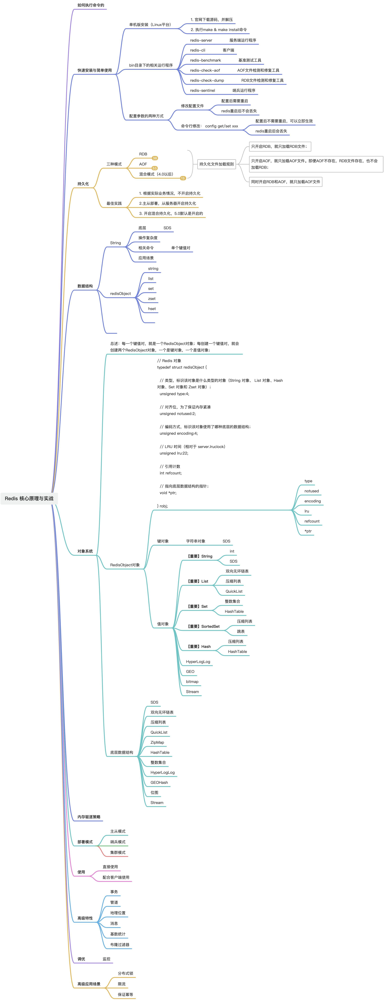
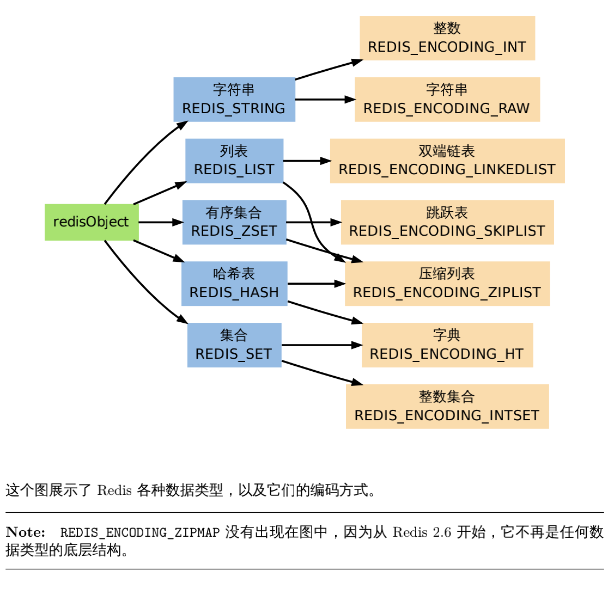

| **日期** | **迭代内容**                                                                            |
| -------- | --------------------------------------------------------------------------------------- |
| 23-11-24 | 1. 创建文档骨架，确定知识体系；2. 完成《概述》《对象系统》等篇；3. 完成《持久化》篇章； |

::: tip 导学指引

1. 首先要了解 Redis 有哪些功能特性，背景；
2. 其次再了解 Redis 的对象系统，支持哪些数据类型，又根据对象系统设计出了哪些底层数据结构，对象系统是如何支持命令多态的；
3. 之后要了解 Redis 的企业级的特性：持久化与高可用；
4. 再之后要了解 Redis 的高级的特性：常用客户端、事务、管道、迭代器、发布订阅、分布式问题解决方案；
5. 最后要了解 Redis 生产级的运维特性：基准测试、监控与告警、性能优化等；

:::

## 知识体系

- [**1010.简介**](https://www.yuque.com/zeanzai.me/nox53r/aoprriuexhb7r5wr)

> 1. 什么是 Redis
> 2. 版本迭代
> 3. 为什么使用缓存
> 4. 常见的使用到 Redis 的业务场景
> 5. 本地缓存与分布式缓存的区别
> 6. 本地缓存的实战过程

- [**20.对象系统——概述**](https://www.yuque.com/zeanzai.me/nox53r/ab23mmumc0znoivl)

> 1. 为什么设计对象系统
> 2. 如何实现命令的多态
> 3. 内建对象有哪些

- [**21.对象系统——支持的数据类型**](https://www.yuque.com/zeanzai.me/nox53r/fhzz7q63idveolq5)

> 1. 值对象支持哪些数据类型，分别有哪些常用命令和分别有哪些业务场景

- [**22.对象系统——底层数据结构**](https://www.yuque.com/zeanzai.me/nox53r/gxxmb58di3sfxgs2)

> 1. 值对象底层有哪些数据结构，转换条件是怎样的，如何高效利用这些转换条件

- [**30.持久化机制**](https://www.yuque.com/zeanzai.me/nox53r/ge8rwhsa0011756m)

> 1. RDB 基本原理，配置参数是怎样的，手动触发与自动触发，什么是增量复制，有哪些优缺点，如何保证备份时的数据一致性， 备份时服务崩溃应如何应对，生产环境下如何配置
> 2. AOF 基本原理，配置参数是怎样的，手动触发与自动触发，什么是重写，有哪些优缺点，全量复制和增量复制，如何保证备份时的数据一致性，备份时服务崩溃应如何应对，生产环境下如何配置
> 3. 混合方式配置参数，实现原理【恢复数据的过程】，相比单一持久化方式的优势，
> 4. 数据驱逐策略有哪些，如何使用，底层算法是怎样的

- [**40.高可用机制**](https://www.yuque.com/zeanzai.me/nox53r/zsf5og0or2godcan)

> 1. 主从模式
> 2. 哨兵模式
> 3. 集群模式

- [**50.高级特性——事务、管道、迭代器、发布与订阅、布隆过滤器**](https://www.yuque.com/zeanzai.me/nox53r/fyl7dtpz44ucvbp3)

> 1. 事务
> 2. 管道
> 3. 迭代器
> 4. 发布与订阅
> 5. 布隆过滤器

- [**51.高级特性——分布式的相关解决方案**](https://www.yuque.com/zeanzai.me/nox53r/sdt8ga914angv80u)

> 1. 分布式锁
> 2. 分布式 ID
> 3. 分布式限流

- [**60.生产运维——基准测试、慢查询、性能优化、监控与告警**](https://www.yuque.com/zeanzai.me/nox53r/efc8isa3ipdy4mf6)

> 1. 基准测试
> 2. 慢查询
> 3. 性能优化
> 4. 监控与告警


## 本地缓存 VS 分布式缓存

**本地缓存**和**分布式缓存**在架构和使用场景上存在显著区别：

|          | 本地缓存                                                                                                 | 分布式缓存                                                                                               |
| -------- | -------------------------------------------------------------------------------------------------------- | -------------------------------------------------------------------------------------------------------- |
| 含义     | 与应用程序在同一台主机节点上，多是进程间访问，与 JVM 生命周期一致，大多不会产生网络 IO，因此访问速度更快 | 大多具备独立部署的主机节点，跨进程访问，会产生网络 IO，访问速度较本地缓存更慢，支持的数据结构更多        |
| 持久性   | 大多不具备持久性，存在的生命周期与 JVM 的生命周期一致                                                    | 根据分布式缓存的技术选型而定，如 redis 具有完善的持久化机制                                              |
| 存储空间 | 受 JVM 堆空间大小限制                                                                                    | 受部署节点的物理主机的内存大小限制                                                                       |
| 技术选型 | 实现简单，在项目中集成相关的组件即可，如 ehcache、guava 等                                               | 实现也较为简单，如 Redis、Memercached 等                                                                 |
| 适用场景 | 适用于读多写少的，变更较少的业务场景，比如数据字典等                                                     | 支持更多的业务场景                                                                                       |
| 一致性   | - 多个应用实例之间无法共享数据，一致性较差；- 与数据库数据存在一致性问题，需在应用端进行保证；           | - 可在多个应用实例之间共享数据，一致性较好；- 仍然存在与数据库数据不一致的情况，也需要在应用端进行保证； |

## 1. 对象系统

## 2. 数据类型

## 3. 高级特性

## 4. 内存管理

## 5. 持久化机制

## 6. 运行模式

## 7. 生产运维

## 8. 生产实践

## 99. 其它

## 资料

- [Redis 核心原理与实战](https://learn.lianglianglee.com/%E4%B8%93%E6%A0%8F/Redis%20%E6%A0%B8%E5%BF%83%E5%8E%9F%E7%90%86%E4%B8%8E%E5%AE%9E%E6%88%98)
- [Redis 核心技术与实战](https://learn.lianglianglee.com/%E4%B8%93%E6%A0%8F/Redis%20%E6%A0%B8%E5%BF%83%E6%8A%80%E6%9C%AF%E4%B8%8E%E5%AE%9E%E6%88%98)
- [Redis 教程](https://pdai.tech/md/db/nosql-redis/db-redis-overview.html)
- [图解 Redis](https://xiaolincoding.com/redis/)
- [Redis 简介及常见问题处理（转） - 小雨淅淅 o0 - 博客园](https://www.cnblogs.com/xiaoyuxixi/p/15483837.html)
- [图文并貌，最强 Redis 详解分析](https://mp.weixin.qq.com/s/OHNkUBSFy00jQwoqrmwSwg)
- [Redis 分布式锁到底安全吗？](https://mp.weixin.qq.com/s/RnSokJxYxYDeenOP_JE3fQ)
- [Redis 10 大性能优化策略](https://mp.weixin.qq.com/s/GWHXjVIohkK8BgW3vIUT1Q)
- [图文并貌，最强 Redis 详解分析](https://mp.weixin.qq.com/s/OHNkUBSFy00jQwoqrmwSwg)
- [Redis 面霸篇：从高频问题透视核心原理](https://mp.weixin.qq.com/s/mGUPW9PNFi6bRqsxGpxHbQ)
- [讲解 Redis 的一篇深度好文！](https://mp.weixin.qq.com/s/jNVJHJOPUv6V9cRU8M75Hw)
- [https://learn.lianglianglee.com/%e4%b8%93%e6%a0%8f/Redis%20%e6%a0%b8%e5%bf%83%e5%8e%9f%e7%90%86%e4%b8%8e%e5%ae%9e%e6%88%98/16%20Redis%20%e4%ba%8b%e5%8a%a1%e6%b7%b1%e5%85%a5%e8%a7%a3%e6%9e%90.md](https://learn.lianglianglee.com/%e4%b8%93%e6%a0%8f/Redis%20%e6%a0%b8%e5%bf%83%e5%8e%9f%e7%90%86%e4%b8%8e%e5%ae%9e%e6%88%98/16%20Redis%20%e4%ba%8b%e5%8a%a1%e6%b7%b1%e5%85%a5%e8%a7%a3%e6%9e%90.md)
- [https://mp.weixin.qq.com/s/6C0DtcJvDDd2qXvCbqi8UA](https://mp.weixin.qq.com/s/6C0DtcJvDDd2qXvCbqi8UA)
- [https://blog.csdn.net/suprezheng/article/details/124560313?spm=1001.2014.3001.5501](https://blog.csdn.net/suprezheng/article/details/124560313?spm=1001.2014.3001.5501)
- [https://www.yuque.com/zeanzai.me/nox53r/xh82alhmr8rii1cg](https://www.yuque.com/zeanzai.me/nox53r/xh82alhmr8rii1cg) redis 简介及常见问题处理
- [🥝 从一个事故中理解 Redis（几乎）所有知识点](https://zhuanlan.zhihu.com/p/5771402221)

## 面试题

1. 简述一下“什么是 redis ”；
2. 我们说 redis 存储数据类型时，是在说什么？什么是 RedisObject 系统？为什么要有这种系统？
3. 简述一下 6 种基本数据类型，【保存的内容、命令、特殊应用场景、特殊应用场景的命令】
4. 特殊的数据类型
5. 持久化机制
   1. RDB：
      1. 基本原理
      2. 配置项
      3. 触发机制
      4. 服务崩溃后的应对过程
   2. AOF
      1. 基本原理
      2. 配置项
      3. 重写的原理及过程中可能发生的问题

---

待整理

# 简介

实战过程见附录。

## 什么是 Redis

- 是一款基于内存的、可持久化的高速缓存数据库；
- 全称： Remote Dictionary Server（远程数据服务）；
- 使用 C 语言编写的 k-v 存储系统；
- 支持丰富的数据类型；
- 支持发布订阅、缓存、消息队列、事务、事件发布等业务场景；

## redis 特性

- **读写性能优异**： Redis 能读的速度是 110000 次/s,写的速度是 81000 次/s （见后面章节）。
- **数据类型丰富**： Redis 支持二进制案例的 Strings, Lists, Hashes, Sets 及 Ordered Sets 数据类型操作。
- **原子性**： Redis 的所有操作都是原子性的，同时 Redis 还支持对几个操作全并后的原子性执行。
- **丰富的特性**： Redis 支持 publish/subscribe, 通知, key 过期等特性。
- **持久化**： Redis 支持 RDB, AOF 以及混合持久化等持久化方式
- **发布订阅**： Redis 支持发布/订阅模式
- **分布式**： Redis Cluster

## redis 主要内容

Redis 的主要内容包括：

1. Redis 的架构、线程模型、对象机制；
2. Redis 支持的数据类型、适用场景、命令、使用示例、键的数据结构及转化条件；
3. 高级特性的使用示例；（事务、LUA 脚本、消息模式、管道、迭代器、布隆过滤器、事件模式）
4. 四种运行模式的演进过程、工作原理、故障转移；
5. 运维（基准测试、监控与报警、性能调优）
6. 分布式系统中 redis 的最佳实践（缓存雪崩、缓存击穿、缓存穿透、大 key 、数据一致性保证方案、分布式锁（演进过程及使用示例））

# Redis 的架构

### Redis 6.0 服务端架构示意图

Redis 6.0 引入了一些新的特性和改进，使其架构比之前的版本更为复杂和高效。以下是 Redis 6.0 版本服务端的架构示意图，以及对每个模块的详细解释。

```
+---------------------+
|      Client         |
+---------------------+
            |
            v
+---------------------+
|      Network        |
|      Handler        |
+---------------------+
            |
            v
+---------------------+
|    Request Parser   |
+---------------------+
            |
            v
+---------------------+        +-------------------+
|   Command Dispatcher| -----> |     Command Table |
+---------------------+        +-------------------+
            |
            v
+---------------------+
|      Database       |
|       Engine        |
+---------------------+
            |
            v
+---------------------+        +-------------------+       +-------------------+
|   Storage Engine    | <----> |  Data Structures  | <----> |    Memory Manager |
+---------------------+        +-------------------+       +-------------------+
            |
            v
+---------------------+
|     Replication     |
+---------------------+
            |
            v
+---------------------+
|    Persistence      |
+---------------------+
            |
            v
+---------------------+
|      Modules        |
+---------------------+
            |
            v
+---------------------+
|    Monitoring       |
+---------------------+

```

### 模块详细解释

1.  **Client（客户端）**：与 Redis 服务端交互的外部应用或用户。客户端发送命令并接收服务端返回的结果。
2.  **Network Handler（网络处理器）**：负责处理客户端的连接和请求，包括接收客户端请求、发送响应以及管理网络连接的生命周期。
3.  **Request Parser（请求解析器）**：解析从客户端接收到的命令请求，将其转换为内部可以处理的格式。
4.  **Command Dispatcher（命令分发器）**：根据解析后的命令，将其分发到对应的命令处理函数。命令分发器通过查找命令表来确定要调用的具体处理函数。
5.  **Command Table（命令表）**：存储所有支持的 Redis 命令及其对应的处理函数。
6.  **Database Engine（数据库引擎）**：负责管理 Redis 数据库的核心逻辑，包括处理数据的增删改查操作。数据库引擎是 Redis 的核心组件之一。
7.  **Storage Engine（存储引擎）**：管理数据的持久化和内存中的数据结构，包括 RDB（Redis DataBase）和 AOF（Append Only File）两种持久化机制。
8.  **Data Structures（数据结构）**：Redis 使用多种数据结构来存储不同类型的数据，包括字符串、列表、集合、有序集合和哈希表。
9.  **Memory Manager（内存管理器）**：管理 Redis 的内存使用，包括分配、释放和回收内存。Redis 使用内存高效的数据结构和算法来优化内存使用。
10. **Replication（复制）**：实现主从复制功能，使得数据在多个节点之间保持一致。复制模块负责将主节点的数据同步到从节点，确保高可用性和数据冗余。
11. **Persistence（持久化）**：管理数据的持久化存储，包括 RDB 和 AOF 两种机制。RDB 通过定期生成数据快照保存到磁盘，AOF 通过记录每次写操作来实现数据持久化。
12. **Modules（模块）**：Redis 6.0 引入了模块化架构，允许用户通过编写模块扩展 Redis 的功能。模块可以提供自定义的数据结构和命令。
13. **Monitoring（监控）**：提供对 Redis 实例的监控和管理，包括统计信息、性能指标和日志记录等。监控模块帮助用户了解 Redis 的运行状态和性能。

### Redis 6.0 版本的工作原理

Redis 6.0 的工作原理可以通过以下步骤来解释：

1. **客户端连接**：客户端通过网络连接到 Redis 服务器，发送命令请求。
2. **命令解析**：网络处理器接收客户端请求，并将请求传递给请求解析器进行解析。请求解析器将命令请求转换为内部可处理的格式。
3. **命令分发**：解析后的命令由命令分发器分发到对应的命令处理函数。命令分发器通过查找命令表来确定要调用的处理函数。
4. **数据操作**：数据库引擎根据命令类型执行相应的操作，如读取、写入、删除数据等。数据操作可能涉及到内存中的数据结构和持久化存储。
5. **内存管理**：内存管理器负责分配、释放和回收内存，确保内存的高效使用和稳定性。
6. **复制和持久化**：复制模块将数据同步到从节点，持久化模块通过 RDB 和 AOF 机制将数据持久化到磁盘，确保数据的高可用性和持久性。
7. **模块和监控**：模块提供扩展功能，监控模块提供对 Redis 实例的监控和管理，帮助用户了解系统的运行状态和性能。

通过上述步骤，Redis 6.0 实现了高效的数据存储和管理，支持高并发和高可用的应用场景。Redis 6.0 引入的模块化架构和其他改进，使其在功能和性能上都有显著提升。

# Redis 的对象机制

## Redis 对象系统

###

### 对象系统


1. 为了实现从键到值的快速访问，Redis 使用了一个**哈希表**来保存所有键值对。
2.

#### refcount

### 命令的类型检查和多态

**当执行一个处理数据类型命令的时候，redis 执行以下步骤**

- 根据给定的 key，在数据库字典中查找和他相对应的 redisObject，如果没找到，就返回 NULL；
- 检查 redisObject 的 type 属性和执行命令所需的类型是否相符，如果不相符，返回类型错误；
- 根据 redisObject 的 encoding 属性所指定的编码，选择合适的操作函数来处理底层的数据结构；
- 返回数据结构的操作结果作为命令的返回值。


### 内建对象

###

## 对象系统

### redisObject

### 基本数据类型

### encoding 汇总

## 高级特性

- 事务
- 管道
- 迭代器
- 发布订阅
- 布隆过滤器
- lua 脚本

## 持久化机制

- aof
- rdb
- 混合持久化方式

# 运行模式

## 单机模式

## 主从模式

1.

## 哨兵模式

### 有什么用？

## 集群模式

实验过程见附录。

- 一致性哈希演进过程
- 集群模式的安装过程及其缩容扩容实验
- 主节点间的信息交互
- 客户端使用集群模式及客户端重定向问题
- 集群模式下的数据存储原理及 rehash 过程
- 故障恢复
- 其它面试题

### 哨兵模式遗留的问题

Q：哨兵模式是否可以扩展？
A：可以扩展，只需要配置多个 sentinel monitor <master-name> <ip> <redis-port> <quorum> 项即可；
PS： Sentinel 可以监视多台主节点，而不是只能监视一台服务器。
想要监视多台主节点，只需要在配置文件 sentinel.conf 中设置多个
sentinel monitor <master-name> <ip> <redis-port> <quorum>
即可，我们通过 master-name 来区分不同的主节点。

Q：上面这种可扩展模式存在的问题？
A： 数据分布不均匀。也就是说某个主从集群可能会因为业务原因成为热点。

Q：如何解决哨兵模式下某个主从集群成为热点？
A：上“负载均衡”。

哨兵模式下要想请求保持均匀，就必须要保证数据的均匀分布。要想保证数据的均匀分布，就需要考虑几个问题：

- 在缩扩容时，如何保证对数据迁移的影响范围要降到最低；
- 集群的具体实现机制？【集群模式下的数据保存】
- 假设数据均匀分布后，客户端如何保证请求打到正确节点时，所需要的资源最小；
- 某个节点出现故障无法对外提供服务时，如何能够依然保证高可用；

### 集群模式下的数据保存

#### 一致性哈希

一致性哈希是一种分布式哈希表的实现，用于分布和管理大规模数据，特别是在动态环境中（例如，节点频繁加入和离开）。其主要特点和步骤如下：

1. **哈希环**：一致性哈希将所有可能的哈希值组织成一个环（哈希环）。例如，哈希值的范围是 [0, 2^32-1]，并将它们排列成一个圆环。
2. **节点哈希**：将每个节点的标识符（如 IP 地址或节点 ID）进行哈希，映射到哈希环上的某个点。例如，假设节点 A、B、C 的哈希值分别为 10、50、90，则它们在环上的位置如下：

```
0-----10(A)-----50(B)-----90(C)-----2^32-1

```

3. **数据哈希**：将每个数据项（键）的标识符进行哈希，映射到哈希环上的某个点。例如，键 k1、k2、k3 的哈希值分别为 15、55、95。
4. **数据分配**：根据一致性哈希的规则，数据项将被存储在其哈希值顺时针方向遇到的第一个节点上。例如：
   - k1 (15) 存储在节点 B (50)
   - k2 (55) 存储在节点 C (90)
   - k3 (95) 存储在节点 A (10)
5. **节点变化**：当有节点加入或离开时，只需要重新分配一部分数据，而不是全部。例如，当一个新节点 D 加入，其哈希值为 30，环上状态为：

```
0-----10(A)-----30(D)-----50(B)-----90(C)-----2^32-1

```

此时，只有在 10 到 30 范围内的数据项需要重新分配（例如，k1 可能会重新分配到节点 D）。

#### Redis 集群模式中的哈希槽

Redis 集群采用了一种基于哈希槽的分片方式，而不是一致性哈希。其主要特点和步骤如下：

1. **哈希槽划分**：Redis 集群将整个键空间划分为 16384 个哈希槽。每个键根据其哈希值分配到一个哈希槽。例如，使用 CRC16 哈希函数计算键的哈希值，然后对 16384 取模：

```
hash_slot = CRC16(key) % 16384

```

2. **节点管理哈希槽**：每个节点负责管理部分哈希槽。例如，假设有三个节点 A、B、C，哈希槽的分配如下：

```
节点 A：0-5460
节点 B：5461-10922
节点 C：10923-16383

```

3. **数据分布**：每个键根据其哈希槽被存储到对应的节点。例如，键 k1 的哈希值为 12345，对 16384 取模后落在哈希槽 12345，由节点 C 管理。
4. **节点扩展**：当增加或删除节点时，Redis 重新分配哈希槽。例如，增加新节点 D 后：

```
节点 A：0-4095
节点 B：4096-8191
节点 C：8192-12287
节点 D：12288-16383

```

#### 对比一致性哈希和 Redis 集群哈希槽

1. **数据重新分配**：
   - 一致性哈希：当节点加入或离开时，只需要重新分配一部分数据，减少了数据迁移量。
   - Redis 哈希槽：也只需要重新分配一部分哈希槽，类似于一致性哈希，避免了全量数据迁移。
2. **节点管理**：
   - 一致性哈希：节点的位置在哈希环上是离散的，通过虚拟节点可以平衡数据分布。
   - Redis 哈希槽：每个节点管理连续的哈希槽，分布更直观，也更易于管理。
3. **复杂性**：
   - 一致性哈希：需要处理哈希环和虚拟节点，增加了一些实现复杂性。
   - Redis 哈希槽：通过简单的哈希槽分配，简化了实现，易于理解和管理。

#### 总结

Redis 集群模式通过哈希槽的方式实现了类似于一致性哈希的效果，避免了节点加入或离开时的全量数据迁移，保证了系统的高可用性和可扩展性。虽然 Redis 没有直接采用一致性哈希，但其哈希槽机制在许多方面实现了类似的优势，适合分布式数据管理的需求。

### 节点间的通信机制

Redis 集群模式下的节点间通信是确保数据分布和故障转移正常工作的关键。为了实现高效的节点间通信，Redis 集群使用了一种基于 Gossip 协议和集群总线（Cluster Bus）的内部通信机制。以下是详细的解释：

1.  **集群总线（Cluster Bus）**
    Redis 集群中的每个节点都维护着一个专用的 TCP 连接，称为集群总线（Cluster Bus），用于节点间的通信。集群总线使用一种轻量级的二进制协议，称为 Gossip 协议，来交换节点信息和状态。
2.  **Gossip 协议**
    Gossip 协议是一种去中心化的通信协议，允许节点周期性地交换信息，最终使所有节点都能获得整个集群的状态。Gossip 协议的特点是高效、容错和扩展性强，适用于大规模分布式系统。 在 Redis 集群中，Gossip 协议用于以下几个方面：

- 节点发现：新加入的节点通过 Gossip 协议发现并连接到集群中的其他节点。
- 节点状态更新：节点定期通过 Gossip 消息交换彼此的状态信息，包括在线、下线、故障等状态。
- 故障检测：节点通过 Gossip 协议检测集群中其他节点的健康状况，并在检测到故障时触发故障转移。

3.  **节点间通信的详细流程**
1.  **节点启动和发现**
    当一个新的节点启动时，它会尝试连接到集群中的任意一个已知节点。这可以通过配置文件中指定的种子节点（seed nodes）实现。

```
redis-server --cluster-enabled yes --cluster-config-file nodes.conf \
--cluster-node-timeout 5000 --port 7000

```

新的节点连接到已知节点后，会向该节点发送 MEET 命令，通知其加入集群。收到 MEET 命令的节点会将新节点的信息传播给集群中的其他节点。

2.  **Gossip 消息交换**
    每个节点会定期与集群中的其他节点交换 Gossip 消息。Gossip 消息包含以下信息： - 节点的唯一标识（Node ID） - 节点的 IP 地址和端口 - 节点的当前状态（在线、下线、疑似故障等） - 节点负责的哈希槽范围

节点在收到 Gossip 消息后，会更新其本地的节点信息表（Node Table），确保对集群状态的认知是一致的。

3.  **故障检测和处理**
    Redis 集群使用 Gossip 协议来进行故障检测。每个节点会定期向其他节点发送 PING 消息，并期望在一定时间内收到 PONG 响应。如果一个节点在多个检测周期内未收到 PONG 响应，它会将该节点标记为疑似故障（PFAIL）。

当一个节点被多个其他节点标记为疑似故障时，它会被正式标记为下线（FAIL）。此时，集群中的其他节点会开始故障转移流程，将故障节点的哈希槽和数据迁移到其他健康的节点上。

4.  **节点状态传播**
    节点状态的传播通过 Gossip 协议以递归的方式进行。例如，节点 A 将节点 B 的状态信息传播给节点 C，节点 C 再将该信息传播给节点 D，如此循环，直到整个集群中的所有节点都获悉该状态。

5.  **数据重分配和故障转移**
    在节点检测到故障时，Redis 集群会自动进行数据重分配和故障转移。以下是详细步骤： - 故障检测：多个节点标记同一节点为下线（FAIL）。 - 选举新的主节点：如果下线节点是主节点，集群会通过投票机制选举其从节点中一个新的主节点。 - 重新分配哈希槽：新的主节点接管故障主节点的哈希槽和数据，并开始对外提供服务。

6.  **内部通信消息类型**
    Redis 集群中的节点间通信使用多种类型的消息，包括但不限于：

          - PING：用于节点间的健康检查。
          - PONG：响应 PING 消息，表示节点在线。
          - MEET：通知节点加入集群。
          - FAIL：通知节点已下线。
          - PUBLISH：发布订阅消息，用于分布式消息系统。
          - MIGRATE：通知节点进行数据迁移。

这些消息类型通过集群总线传输，确保节点间的信息同步和状态一致。

#### 总结

    Redis 集群模式下的节点间通信依赖于集群总线和 Gossip 协议。集群总线提供节点间的高效通信通道，而 Gossip 协议通过周期性的消息交换确保集群中所有节点对彼此状态的认知是一致的。这种去中心化、轻量级的通信机制，确保了 Redis 集群在大规模分布式环境中的高可用性和可扩展性。

### 客户端的访问机制

在 Redis 集群模式下，客户端与集群中的多个节点交互来执行操作。为了高效地进行数据操作和保持系统的一致性，Redis 客户端需要了解集群的拓扑结构和数据分布。

#### 客户端操作 Redis 集群模式的详细原理

以下是客户端操作 Redis 集群模式的详细原理：

1.  **初始连接**
    当客户端启动并连接到 Redis 集群时，客户端通常会连接到集群中的一个或多个节点。连接的节点可以通过配置文件中指定，也可以通过自动发现机制获取。

2.  **集群拓扑发现**
    客户端需要了解集群的拓扑结构，包括每个节点负责的哈希槽范围以及各节点的角色（主节点或从节点）。为了获取这些信息，客户端会发送一个 CLUSTER NODES 命令到已连接的节点，节点会返回集群中所有节点的信息，包括：

- 节点 ID
- IP 地址和端口
- 角色（主节点或从节点）
- 哈希槽范围

客户端通过解析这些信息来构建集群拓扑图。

3. **请求路由**
   在 Redis 集群模式下，数据被分片存储在不同的节点上。每个键通过 CRC16 哈希函数计算哈希值，并对 16384 取模以确定其哈希槽。客户端需要根据键的哈希槽来将请求路由到负责该哈希槽的节点。具体过程如下：
   1. 计算哈希槽：客户端使用 CRC16 哈希函数计算键的哈希值，并对 16384 取模。

```
hash_slot = CRC16(key) % 16384

```

2.  查找节点：客户端查找负责该哈希槽的主节点，通常在初始连接时已经从 CLUSTER NODES 命令获取了哈希槽到节点的映射。
3.  发送请求：客户端将请求发送到负责该哈希槽的主节点。

4.  **处理 MOVED 和 ASK 重定向**
    在某些情况下，集群中的数据分布可能会发生变化（例如，增加或删除节点）。当客户端发送请求到错误的节点时，节点会返回 MOVED 或 ASK 重定向错误，指示客户端请求应转向其他节点。
    1.  MOVED 错误：当哈希槽被重新分配到另一个节点时，客户端收到 MOVED 错误。该错误包含新的节点地址和哈希槽信息。客户端更新其本地的哈希槽映射，并将请求重定向到新的节点。

```
MOVED 12345 127.0.0.1:7001

```

2.  ASK 错误：在哈希槽迁移过程中，客户端可能收到 ASK 错误，指示客户端在特定节点临时执行请求。客户端需要发送 ASKING 命令到目标节点，然后重新发送请求。

```
ASK 12345 127.0.0.1:7002

```

5. **管道和批量操作**

为了提高性能，Redis 支持管道和批量操作。客户端可以将多个命令打包成一个请求发送到服务器，减少网络延迟。需要注意的是，所有命令必须属于同一个哈希槽，以确保它们被路由到同一个节点。

6.  **订阅和发布**
    Redis 的发布/订阅（Pub/Sub）机制在集群模式下也可用。订阅和发布的消息会自动路由到适当的节点，并在整个集群中进行广播。

7.  **连接管理**
    客户端通常会维护与多个节点的连接池，以便高效地处理并发请求和故障转移。连接池管理包括：

- 连接重用：通过连接池重用连接，减少连接建立和关闭的开销。
- 故障检测和重试：当检测到节点不可用时，客户端会自动尝试重连或重定向请求到其他健康节点。

#### 客户端与 Redis 集群交互示例

假设我们有一个 Redis 集群，包含三个主节点，负责不同的哈希槽范围：

- 节点 A：负责哈希槽 0-5460
- 节点 B：负责哈希槽 5461-10922
- 节点 C：负责哈希槽 10923-16383

客户端执行 SET key1 value1 命令的过程如下：

1. **计算哈希槽**：客户端计算 key1 的哈希值，并确定其哈希槽。

```
hash_slot = CRC16("key1") % 16384

```

2. **查找节点**：假设 key1 的哈希槽为 5000，属于节点 A 的管理范围。
3. **发送请求**：客户端将 SET key1 value1 请求发送到节点 A。
4. **处理重定向**：如果节点 A 返回 MOVED 错误，指示 key1 的哈希槽已迁移到节点 B，客户端更新其哈希槽映射，并将请求重新发送到节点 B。

通过上述过程，客户端能够高效地与 Redis 集群进行交互，确保数据的正确存储和读取。

#### 总结

Redis 集群模式下，客户端操作的原理包括以下几个关键步骤：

1. **初始连接**：客户端连接到集群中的一个或多个节点。
2. **集群拓扑发现**：通过 CLUSTER NODES 命令获取集群节点信息和哈希槽分配。
3. **请求路由**：根据键的哈希槽将请求路由到正确的节点。
4. **处理重定向**：处理 MOVED 和 ASK 错误，更新哈希槽映射和重新发送请求。
5. **连接管理**：维护与多个节点的连接池，确保高效的请求处理和故障转移。

通过这些机制，Redis 集群模式下的客户端能够高效、可靠地与集群中的多个节点交互，实现数据的分布式存储和高可用性。

---

## 运维

- 健康检测
- 性能调优

## 分布式系统中 redis 的应用

- 分布式锁
- 分布式缓存

---



## 几种特殊特性

> 特殊特性：事务、管道技术、迭代器

## 内存淘汰机制与持久化机制

> 内存淘汰机制与持久化机制（AOP、RDB、混合持久化机制、重写）

## 生产环境运维

> 生产环境运维（三种部署方式：主从模式、集群模式、哨兵模式；慢查询日志分析、性能测试、性能优化）

主从模式： 数据如何复制、

集群模式
如何重新选举 master

// todo

要联系上 Quorum 机制与 WARO 机制以及 CAP 理论

## redis 分布式锁

::: tip
关于 `Redis分布式锁` 请参考笔者的另外一篇文章： [分布式锁](_home_admin_logs_confluencetemp_import_2023_11_14_ac136b9d16999329849503750129_fcac0680-829e-11ee-ab27-f7dbd2e14020_distribute_distribute-lock)。获取更多内容可以关注笔者微信公众号：天晴小猪（WeChatID： `zeanzai-me`），也可以扫描文章底部的二维码进行关注。
:::

## redis 生产问题及解决方案

> redis 生产问题及解决方案（几大经典问题）

- 单机版部署及可视化操作台
- 底层数据结构与相关算法分析
- redis 对象的底层底层数据结构（转换数据结构的条件及配置参数）、操作命令及其时间复杂度、对象的使用、应用场景及相关特殊应用场景
- 特殊特性：事务、管道技术、迭代器
- 内存淘汰机制与持久化机制（AOP、RDB、混合持久化机制、重写）
- 生产环境运维（三种部署方式：主从模式、集群模式、哨兵模式；慢查询日志分析、性能测试、性能优化）
- redis 生产问题及解决方案

## 面试题

- 在不增加机器和不淘汰 key 的情况下，如何优化 redis 的存储空间？
-

## 参考链接

## 底层数据结构与相关算法分析

> 底层数据结构与相关算法分析

redis 使用 C 语言实现，C 语言中已经实现了一下特定的数据结构，但是 redis 的设计者依然实现了自定义的数据结构，其原因无非有以下几点：

- C 语言中已有的数据结构并不能满足 Redis 中的需求，不能满足的原因大多是两类：
  - C 语言提供的数据结构能满足，但是对数据结构的操作算法并不能满足 Redis 的需求；
  - C 语言提供的数据结构压根就不能满足 Redis 的需求；
- Redis 对内存大小更为敏感，所以需要在操作内存时，尽量达到不浪费的目的；



###

---

## 使用场景

1. 热点数据的缓存

缓存是 Redis 最常见的应用场景，之所有这么使用，主要是因为 Redis 读写性能优异。而且逐渐有取代 memcached，成为首选服务端缓存的组件。而且，Redis 内部是支持事务的，在使用时候能有效保证数据的一致性。
作为缓存使用时，一般有两种方式保存数据：

- 读取前，先去读 Redis，如果没有数据，读取数据库，将数据拉入 Redis。
- 插入数据时，同时写入 Redis。

方案一：实施起来简单，但是有两个需要注意的地方：

- 避免缓存击穿。（数据库没有就需要命中的数据，导致 Redis 一直没有数据，而一直命中数据库。）
- 数据的实时性相对会差一点。

方案二：数据实时性强，但是开发时不便于统一处理。
当然，两种方式根据实际情况来适用。如：方案一适用于对于数据实时性要求不是特别高的场景。方案二适用于字典表、数据量不大的数据存储。

1. 限时业务的运用

redis 中可以使用 expire 命令设置一个键的生存时间，到时间后 redis 会删除它。利用这一特性可以运用在限时的优惠活动信息、手机验证码等业务场景。

1. 计数器相关问题

redis 由于 incrby 命令可以实现原子性的递增，所以可以运用于高并发的秒杀活动、分布式序列号的生成、具体业务还体现在比如限制一个手机号发多少条短信、一个接口一分钟限制多少请求、一个接口一天限制调用多少次等等。

1. 分布式锁

这个主要利用 redis 的 setnx 命令进行，setnx："set if not exists"就是如果不存在则成功设置缓存同时返回 1，否则返回 0 ，这个特性在很多后台中都有所运用，因为我们服务器是集群的，定时任务可能在两台机器上都会运行，所以在定时任务中首先 通过 setnx 设置一个 lock， 如果成功设置则执行，如果没有成功设置，则表明该定时任务已执行。 当然结合具体业务，我们可以给这个 lock 加一个过期时间，比如说 30 分钟执行一次的定时任务，那么这个过期时间设置为小于 30 分钟的一个时间就可以，这个与定时任务的周期以及定时任务执行消耗时间相关。
在分布式锁的场景中，主要用在比如秒杀系统等。

1. 延时操作

比如在订单生产后我们占用了库存，10 分钟后去检验用户是否真正购买，如果没有购买将该单据设置无效，同时还原库存。 由于 redis 自 2.8.0 之后版本提供 Keyspace Notifications 功能，允许客户订阅 Pub/Sub 频道，以便以某种方式接收影响 Redis 数据集的事件。 所以我们对于上面的需求就可以用以下解决方案，我们在订单生产时，设置一个 key，同时设置 10 分钟后过期， 我们在后台实现一个监听器，监听 key 的实效，监听到 key 失效时将后续逻辑加上。
当然我们也可以利用 rabbitmq、activemq 等消息中间件的延迟队列服务实现该需求。

1. 排行榜相关问题

关系型数据库在排行榜方面查询速度普遍偏慢，所以可以借助 redis 的 SortedSet 进行热点数据的排序。
比如点赞排行榜，做一个 SortedSet, 然后以用户的 openid 作为上面的 username, 以用户的点赞数作为上面的 score, 然后针对每个用户做一个 hash, 通过 zrangebyscore 就可以按照点赞数获取排行榜，然后再根据 username 获取用户的 hash 信息，这个当时在实际运用中性能体验也蛮不错的。

1. 点赞、好友等相互关系的存储

Redis 利用集合的一些命令，比如求交集、并集、差集等。
在微博应用中，每个用户关注的人存在一个集合中，就很容易实现求两个人的共同好友功能。

1. 简单队列

由于 Redis 有 list push 和 list pop 这样的命令，所以能够很方便的执行队列操作。

## 本地缓存-Ehcache 的实践
