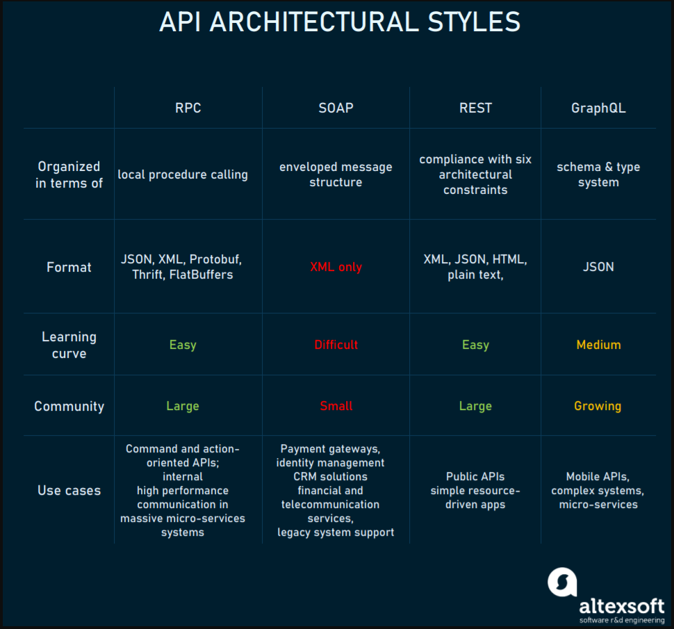
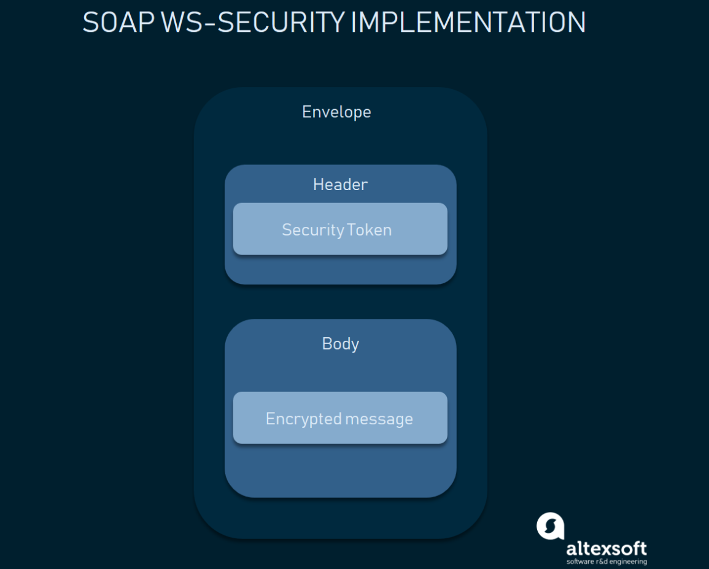
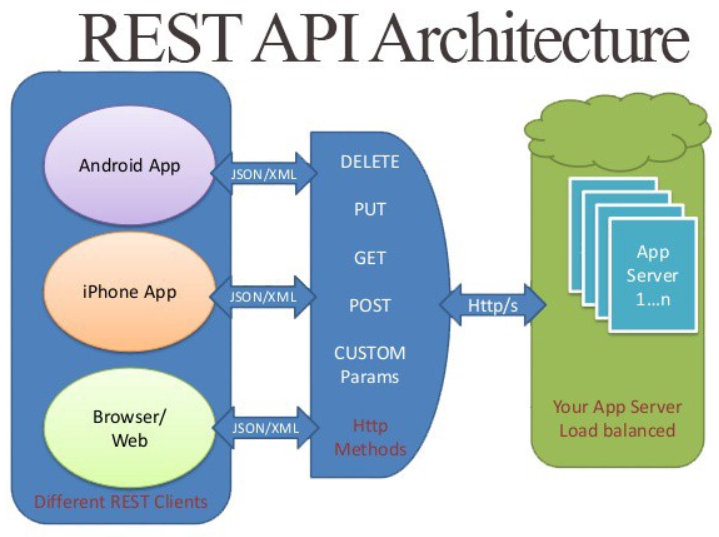
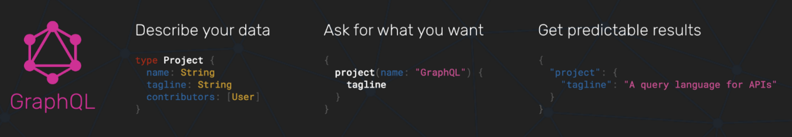

## 1. API架构风格对比：SOAP vs REST vs GraphQL vs RPC

- [ ] TODO ： API架构风格

- [Comparing API Architectural Styles: SOAP vs REST vs GraphQL vs RPC](https://www.altexsoft.com/blog/soap-vs-rest-vs-graphql-vs-rpc/)
- 翻译版： [API架构风格对比：SOAP vs REST vs GraphQL vs RPC](https://www.cnblogs.com/charlieroro/p/14570214.html)
- [SOAP vs REST vs gRPC vs GraphQL](https://dev.to/andreidascalu/soap-vs-rest-vs-grpc-vs-graphql-1ib6)
- [SOAP vs REST vs GraphQL vs RPC](https://blog.bytebytego.com/p/soap-vs-rest-vs-graphql-vs-rpc)
- [RESTful API 设计指南](https://www.ruanyifeng.com/blog/2014/05/restful_api.html)
- [HTTP请求向服务器传参方式](https://www.cnblogs.com/wwr3569/p/14295779.html)

1. 从历史发展的角度来说 API 架构风格的迭代过程；主要分析每一种架构风格的优缺点
2. 结合 HTTP 相关知识，着重介绍 RESTFul 风格的最佳实践经验，以及业内一些软件的实践应用等【ES】；
3. API 的其它内容：接口的幂等性保证、接口安全、接口文档的管理、接口限流（单体+分布式）；

HTTP 报文格式
RPC RMI WebSocket
postman 中的传参方式与 HTTP 传参方式的对应关系；【curl 与 idea 中的 api 测试窗口】
HTTPClient 的简单用法
Spring 框架中是如何接收参数的；
**RESTful API** vs **SOAP** vs **XML-RPC**


最近一段时间关于GraphQL的讨论很多，一些项目中也相继用到了这种风格，但使用是否合理，是否存在杀鸡用牛刀这样的问题，还有待商榷。

译自：[Comparing API Architectural Styles: SOAP vs REST vs GraphQL vs RPC](https://levelup.gitconnected.com/comparing-api-architectural-styles-soap-vs-rest-vs-graphql-vs-rpc-84a3720adefa)


两个不同的应用需要一个中间程序才能互通，开发者通常会使用应用程序接口(API)进行搭桥，使一个系统能够访问另一个系统的信息或功能。

为了在扩容时快速集成应用，实际的API会使用协议或规范来定义消息传递的语义和语法。这些规范构成了API架构。

过去几年曾出现了几种不同的API架构风格，每种风格都有其特定的标准数据交互模式。而对API架构的选择引起了无休止的讨论。


现在，很多API用户放弃REST，并拥抱GraphQL。而在十年之前，对于REST来说则是相反的情况，在于SOAP的竞争中，REST大获全胜。这种观念的问题在于用于单方面去选择一个技术，而没有考虑实际价值以及以与特定场景的匹配度。

本文将会按照API风格出现的顺序对它们进行讨论，对比各自的优劣势，并给出各自适合的场景。



### 1.1. Remote Procedure Call (RPC):唤醒另一个系统的功能

RPC是一个规范，它允许在一个不同的上下文中远程执行功能。RPC将本地程序调用扩展到了HTTP API的上下文中(_RPC的最上层大部分都是HTTP_)。
一开始的XML-RPC问题比较多，它很难保证XML载体的数据类型。后来出现了一个基于[JSON-RPC](https://www.jsonrpc.org/)的RPC API，由于JSON的规范更加具体，因此被认为是SOAP的替代品。 [gRPC](https://grpc.io/)是一个谷歌在2015年开发的全新RPC版本，插件化支持负载均衡、跟踪、健康检查以及身份认证等，gRPC非常适用于微服务间的通信。

#### 1.1.1. RPC如何工作

客户端唤醒远端程序，序列化参数，并在消息中添加额外的信息，然后将消息发送给服务端。在接收到客户端的消息后，服务端会反序列化消息中的内容，执行请求的操作，并将结果返回给客户端。服务端存根(stub)和客户端存根(stub)负责参数的序列化和反序列化。


#### 1.1.2. RPC的优点

- **直接简单的交互方式**：RPC使用GET获取信息，并使用POST处理其他功能。服务端和客户端的交互归结为对后端的调用，并获取响应结果。
- **方便添加功能**：如果我们对API有新的需求，可以通过简单地添加新的后端来满足该需求：1）编写一个新的功能，然后发布；2）然后客户端就可以通过这个后端来满足需求。
- **高性能**：轻量载体提升了网络传输的性能，这对于共享服务器以及在网络上进行并行计算的工作站来说非常重要。RCP可以优化网络层，使其可以每天在不同的服务间发送大量消息。

#### 1.1.3. RPC的缺点

- **与底层系统的强耦合**：API的抽象程度与其可复用性相关。与底层系统的耦合越高，API的可复用性就越低。RPC与底层系统的强耦合使其无法在系统和外部API之间进行抽象，同时也增加了安全风险，很容易在API中泄露底层系统的实现细节。RPC的强耦合使其很难实现需求扩展和团队解耦，客户要么会担心调用特定后端可能带来的副作用(_如安全问题_)，要么会因为无法理解服务端的功能命名规则而不知道调用哪个后端。

> 这里说的"与底层系统"的耦合，并不是说与内核等底层实现之间的耦合，而是与底层服务的耦合，如与日志服务，鉴权服务等耦合。

- **可发现性低**：RPC无法对API进行自省或无法通过发送的RPC请求来理解其调用的功能。

> 应该是RPC并没有像REST API那样相对严格的调用规范，因此有些调用会比较难以理解

- **功能爆炸**：由于很容易添加新的功能，因此相比编辑现有的功能，新增的功能可能会导致大量功能重叠，也很难去理解。

#### 1.1.4. RPC使用场景

RPC模式始于80年代，但它一直没有过时。像Google，Facebook ([Apache Thrift](https://thrift.apache.org/))和Twitch([Twirp](https://twitchtv.github.io/twirp/docs/intro.html)) 这样的大型公司利用RPC的高性能特性来获得高性能、低开销的消息处理能力(规模庞大的微服务使用短消息进行通信，需要保证通信的畅通)。

- **命令式API**：RPC非常适合向远端系统发送命令。例如，Slack API就是重命令的接口：加入频道、离开频道、发送消息等。因此Slack API的设计者可以使用RPC风格的模型，使功能更简单、紧凑，也更方便使用。
- **用于内部微服务客户API**：在整合单个供应商和用户时，我们不希望(像REST API那样)花费大量时间来传输元数据。凭借高消息速率和消息性能，gRPC和Twirp是微服务使用RPC的典范。gRPC背后使用的是HTTP 2，因此能够优化网络层，每天可以在不同的服务间传送大量消息。但如果不关心高性能网络，转而期望团队间能够使用稳定的API来发布不同的微服务，那么可以选择使用REST。

### 1.2. Simple Objects Access Protocol (SOAP): 让数据作为服务

[SOAP](https://www.altexsoft.com/blog/engineering/what-is-soap-formats-protocols-message-structure-and-how-soap-is-different-from-rest/?utm_source=MediumCom&utm_medium=referral&utm_campaign=shared#soap-use-cases)是一种XML格式的，高度标准化的web通信协议。在XML-RPC面世一年之后，Microsoft发布了SOAP，SOAP继承了XML-RPC的很多特性。而后出现了REST，二者并驾齐驱，但很快REST就后来居上。

#### 1.2.1. SOAP如何工作

XML数据格式多种多样，加上大量消息结构，使得SOAP称为一种最冗长的API样式。

一个SOAP消息包含：

- 每个消息的开始和结束都要包含一个信封标签
- 包含请求或响应的消息体
- 标头(如果消息必须确定某些具体要求或额外要求)
- 请求过程中的错误信息


SOAP API的逻辑是用Web服务描述语言(WSDL)编写的，该API描述语言定义了后端并描述了可执行的流程。它允许使用不同的编程语言和IDEs快速配置通信。

SOAP同时支持有状态和无状态消息。在有状态场景中，服务端会保存接收到的信息，该过程可能比较繁重，但对于涉及多方和复杂交易的操作来说是合理的。

#### 1.2.2. SOAP的优点

- **语言和平台无关**： 支持创建基于Web的服务内置功能使SOAP能够处理独立于语言和平台的通信，并作出响应。
- **适用于各种传输协议**：SOAP支持大量传输协议，可以用于多种场景。
- **内置错误处理**： SOAP API规范可以返回Retry XML消息(携带错误码和错误解释)
- **大量安全扩展**： 集成了WS-Security，SOAP符合企业级事务质量。它为事务提供了隐私和完整性，并可以在消息层面进行加密



#### 1.2.3. SOAP的缺点

如今，由于多种原因，很多开发人员对必须集成SOAP API的想法感到不安。

- **仅支持XML**：SOAP消息包含大量元数据，且请求和响应仅支持使用冗长的XML结构。
- **厚重**： 由于XML文件的大小，SOAP服务需要比较大的带宽。
- **狭窄的专业知识**：构建SOAP API需要深刻理解各种协议，以及严格的协议规则。
- **乏味的消息更新**： 在添加和移除消息属性时需要额外的工作量，这导致SOAP的采用率下降。

#### 1.2.4. SOAP的使用场景

目前，SOAP架构大部分用于内部集成企业或其他可信任的伙伴。

- **高度安全的数据传输**：SOAP的刚性结构、安全和授权能力使其特别适用于在遵守API提供者和API使用者之间的契约的同时，在API和客户端之间履行正式的软件契约。这也是为什么金融机构和其他企业用户选择SOAP的原因。

### 1.3. Representational state transfer (REST): 将数据作为资源

REST是一个自解释的、由一组架构约束定义的API架构风格，并被很多API使用者广泛采用。

作为当今最通用的API风格，它最初出现在2000年的Roy Fielding 的[博士论文](https://www.ics.uci.edu/~fielding/pubs/dissertation/top.htm)中。REST使用简单格式(通常是JSON和XML)来表达服务侧的数据。

#### 1.3.1. REST如何工作

REST没有像SOAP那样严格。RESTful架构应该遵循以下六个架构约束：

- **统一接口**： 为一个给定的服务(无论是设备还是应用类型)提供统一的接口。
- **无状态**：处理请求本身所包含的请求状态，而服务器不会存储与会话相关的任何内容
- **缓存**
- **客户端-服务端架构**:允许两端独立演进
- 应用**系统分层**
- 服务端可以给客户端提供**可执行的代码**

实际上，某些服务仅在一定程度上是RESTful的，而核心使用了RPC风格，将大型服务分割成多个资源，并有效地利用HTTP基础设施。但关键部分使用的是超媒体(又称HATEOAS，[Hypertext As The Engine of Application State](https://en.wikipedia.org/wiki/HATEOAS))，意味着对于每个响应，REST API提供了如何使用API的所有元数据信息。REST使用这种方式来解耦客户端和服务端，这样，API提供者和消费者就可以独立演进，且不会妨碍它们的通信。


_Richardson Maturity Model as a goalpost to achieving truly complete and useful APIs, Source:_[Kristopher Sandoval](https://nordicapis.com/what-is-the-richardson-maturity-model/)

"_HATEOAS_ 是REST的关键特性，这也是REST之所以称为_REST_的原因。但由于很多人并不使用HATEOAS，导致他们实际上用的是HTTP RPC"，这是[Reddit](https://www.reddit.com/r/golang/comments/7qvi0w/twirp_a_sweet_new_rpc_framework_for_go_twitch_blog/dstkrnm/)上的一些激进意见。确实，HATEOAS是最成熟的REST版本，但很难实现比通常使用和构建的API客户端更加高级和智能的API客户端。因此，即使是如今非常好的REST API也不能保证面面俱到。这也是为什么HATEOAS主要作为RESTful API设计的长期开发愿景。

REST和RPC之间有一些灰色区域，特别是当一个服务具有一部分REST特性，一部分RPC特性时。REST基于资源，而不是基于动作或动词。


在REST中，会用到像GET, POST, PUT, DELETE, OPTIONS, PATCH这样的HTTP方法。



#### 1.3.2. REST的优点

- **解耦客户端和服务端**： REST的抽象比RPC更好，可以更好地解耦客户端和服务端。具有一定抽象的系统可以更好地封装其细节并维持其属性。这使得REST API足够灵活，可以在保持系统稳定的同时，随时间进行演化。
- **可发现性**： 客户端和服务端的通信描述了所有细节，因此无需额外的文档来理解如何使用REST API进行交互。
- **缓存友好**： 重用了大量HTTP工具，REST是唯一一种允许在HTTP层缓存数据的风格。相比之下，要在其他API风格中实现缓存，则要求配置额外的缓存模块。
- **支持多种格式**： 支持多种格式的数据存储和交互功能也是使REST成为当前流行的构建公共APIs的原因之一。

#### 1.3.3. REST的缺点

- **没有单一的REST结构**： 不存在正确地构建REST API的方式。如何对资源进行建模，以及对哪些资源建模取决于具体场景，这使得REST在理论上是简单的，但实践上是困难的。
- **载荷较大**： REST会返回大量元数据，因此客户端可以从响应的信息中了解到应用的状态。对于具有大容量带宽的大型网络通道来说，这种交互方式没有问题。但实际情况并不总是这样，这也是Facebook在2012年推出GraphQL风格的主要驱动因素。
- **过度获取和不足获取问题**：由于有时候会出现包含的数据过多或过少的情况，导致在接收到REST的响应之后，通常还会需要另一个请求。

#### 1.3.4. REST的使用场景

- **管理API**： 专注于管理系统中的对象，并面向多个消费者是最常见的API风格。REST可以帮助这类APIs实现强大的发现能力，良好的文档记录，并符合对象模型。
- **简单资源驱动的APPs**： REST是一种非常有用的方法，可用于连接不需要灵活查询的资源驱动型应用。

- [ ] 设计restful接口的一些最佳实践


### 1.4. GraphQL：仅请求需要的数据

它需要多次调用REST API才能返回所需的内容。 因此，GraphQL被认为是一种改变API规则的风格。

[GraphQL](https://www.altexsoft.com/blog/engineering/graphql-core-features-architecture-pros-and-cons/?utm_source=MediumCom&utm_medium=referral&utm_campaign=shared) 的语法描述了如何发起精确的数据请求。GraphQL适合那些相互之间具有复杂实体引用关系的应用数据模型。



现在，GraphQL生态扩展了相关的库，并出现了很多强大的工具，如Apollo, GraphiQL, and GraphQL Explorer。

#### 1.4.1. GraphQL如何工作

一开始，GraphQL会创建一个_schema_(模式)，它描述了在一个GraphQL API中的所有请求以及这些请求返回的所有_types_。构建模式会比较困难，它需要使用模式定义语言(DSL)进行强类型输入。

由于在请求前已经构建好了模式，因此客户端可以对请求进行校验，确保服务器能够进行响应。在到达后端应用后，会有一个GraphQL操作，负责使用前端应用的数据来解析整个模式。在给服务端发送包含大量查询的请求之后，API会返回一个JSON响应，内容正对应请求的资源。


除RESTful CRUD操作外，GraphQL还有订阅功能，允许接收服务端的实时通知。

#### 1.4.2. GraphQL 的优点

- **类型化的模式**： GraphQL 会提前发布它可以做的事情，这种方式提升了可发现性。通过将客户端指向GraphQL API，我们可以知道哪些查询是可用的。
- **非常适合类似图形的数据**： 适合深度关联的数据，不适合扁平数据。
- **没有版本控制**： 最好的版本控制就是不对API进行版本控制。

REST提供了多种API版本，而GraphQL是一种单一的、演化的版本，可以持续访问新的特性，方便服务端代码的维护。

- **详细的错误消息**： 与SOAP类似，GraphQL提供了详细的错误信息，错误信息包括所有的解析器以及特定的查询错误。
- **灵活的权限**： GraphQL允许在暴露特定的功能的同时保留隐私信息。而REST架构不能部分展示数据(要么全部显示，要么全部隐藏)。

#### 1.4.3. GraphQL 的缺点

- **性能问题**： GraphQL用复杂度换来功能上的提升。在一个请求中包含太多封装的字段可能会导致系统过载。因此，即时对于复杂的查询，REST仍然是一个比较好的选择。
- **缓存复杂**： GraphQL 没有使用HTTP缓存语义，需要客户自定义。
- **需要大量开发前培训**：由于没有足够的时间弄清楚GraphQL 的基本操作和SDL，很多项目决定沿用REST方式。

#### 1.4.4. GraphQL的使用场景

- **手机端API**： 这种情况下，对网络性能和单个消息载体的优化非常重要。因此GraphQL为移动设备提供了一种更有效的数据载体。
- **复杂系统和微服务**： GraphQL能够将复杂的系统集成隐藏在API背后。从不同的地方聚合数据，并将它们合并成一个全局模式。这对于扩展遗留基础设施或第三方API尤为重要。

### 1.5. 如何选择API模式

每种API项目都有不同的要求，通常基于如下几点进行选择：

- 使用的编程语言
- 开发环境，以及
- 涉及的人力和财务资源等

在了解到每种API设计风格之后，API设计者就可以根据项目的需要选择最合适的API模式。

由于强耦合特性，RPC通常用于内部微服务间的通信，不适用于外部API或API服务。

SOAP比较麻烦，但它本身丰富的安全特性仍然是交易操作、订单系统和支付等场景的不二之选。

REST具有高度抽象以及最佳的API模型。但往往会增加线路和聊天的负担--如果使用的是移动设备，这是不利的一面。

在获取数据方面，GraphQL迈出了一大步，但并不是所有人都有足够的时间和精力来处理这种模式。

归根结底，最好在一些小场景下尝试每种API风格，然后看是否满足需求，是否能够解决问题。如果可以，则可以尝试扩展到更多的场景。

> 来自: [api](https://www.cnblogs.com/charlieroro/p/14570214.html)

## 2. 接口攻防

### 2.1. 接口攻击

接口攻击手段多种多样，通常利用接口的漏洞或设计缺陷来破坏系统、窃取数据或进行其他恶意行为。以下是一些常见的接口攻击手段：

- **`注入攻击`**
  - **SQL注入**：攻击者在输入字段中插入SQL代码，以便绕过身份验证或访问未授权的数据。
  - **NoSQL注入**：类似于SQL注入，但针对NoSQL数据库（如MongoDB），利用不安全的查询构造执行恶意操作。
  - **命令注入**：攻击者通过输入字段注入操作系统命令，执行未授权的操作。
- **`跨站脚本攻击（XSS）`**
  - **存储型XSS**：恶意脚本存储在服务器上，并在用户浏览网页时执行。
  - **反射型XSS**：恶意脚本在用户点击恶意链接时执行。
  - **DOM型XSS**：恶意脚本通过修改网页DOM结构执行。
- **`跨站请求伪造（CSRF）`**
  - 攻击者诱导用户在已认证的会话中执行未授权的操作，例如提交表单或更改设置。
- **`中间人攻击（MITM）`**
  - 攻击者在客户端和服务器之间拦截并可能篡改数据传输，通过窃取或伪造数据包获取敏感信息。
- **`分布式拒绝服务（DDoS）`**
  - 攻击者通过大量请求淹没服务器，使其无法处理合法用户的请求，从而导致服务中断。
- **`劫持会话`**
  - 攻击者通过窃取用户的会话令牌（如Cookies、JWT等），冒充用户执行未授权操作。
- **`API密钥滥用`**
  - 攻击者获得API密钥后，滥用接口执行未授权操作，可能导致数据泄露或系统破坏。
- **`参数篡改`**
  - 攻击者修改API请求中的参数，尝试绕过安全检查或执行未授权操作。
- **`路径遍历攻击`**
  - 攻击者通过修改URL路径，访问未授权的文件或目录，获取敏感信息或执行未授权操作。
- **`XML外部实体攻击（XXE）`**
  - 攻击者在处理XML输入时注入恶意的外部实体，可能导致数据泄露、文件读取或远程代码执行。
- **`不安全的API设计`**
  - **过度暴露**：API暴露过多内部细节，提供了攻击者利用的机会。
  - **不必要的复杂性**：复杂的API设计容易出现漏洞和错误，增加攻击面。
- **`漏洞利用`**
  - **未修补的漏洞**：利用已知但未修补的漏洞（如旧版库中的漏洞）进行攻击。
  - **零日漏洞**：利用尚未公开或未修补的漏洞进行攻击。

### 2.2. 接口防御

保证接口安全是现代软件开发中一个至关重要的环节，特别是在构建API时。接口的安全性可以通过多种方法和最佳实践来实现，以下是一些关键措施：

- **`身份验证和授权`**
  - **身份验证**：确保访问接口的每个用户或系统都经过验证。常见的方法包括：
    - **API密钥**：通过分配唯一的API密钥给每个客户端进行身份验证。
    - **OAuth**：使用OAuth2协议进行用户授权和认证。
    - **JWT（JSON Web Token）**：使用JWT进行身份验证，确保请求来自可信任的用户。
  - **授权**：确保经过验证的用户只能访问他们被授权访问的资源。常见的授权方法包括基于角色的访问控制（RBAC）和基于属性的访问控制（ABAC）。
- **`数据加密`**
  - **传输层加密**：使用HTTPS加密传输数据，防止中间人攻击和数据窃听。
  - **数据加密**：在存储和处理敏感数据时，使用加密技术保护数据。
- **`输入验证和输出编码`**
  - **输入验证**：验证和清理用户输入，防止注入攻击（如SQL注入、XSS）。
  - **输出编码**：对输出数据进行编码，防止跨站脚本（XSS）攻击。
- **`速率限制和请求限制`**
  - **速率限制**：限制每个客户端在一定时间内的请求数量，防止滥用和DDoS攻击。
  - **请求限制**：限制每个接口请求的大小和参数数量，防止资源耗尽攻击。
- **`日志记录和监控`**
  - **日志记录**：记录所有API请求和响应，特别是错误和异常情况，以便进行安全审计和问题排查。
  - **监控**：实时监控API使用情况，检测异常行为和潜在攻击。
- **`安全配置`**
  - **CORS（跨域资源共享）**：配置CORS策略，限制哪些域可以访问API。
  - **防火墙和WAF（Web应用防火墙）**：使用防火墙和WAF保护API免受常见的Web攻击。
- **`安全设计和开发实践`**
  - **最小权限原则**：确保每个组件和用户只拥有执行其任务所需的最低权限。
  - **安全编码实践**：遵循安全编码标准和最佳实践，减少代码中的安全漏洞。
  - **定期安全测试**：定期进行安全测试，如漏洞扫描、渗透测试，发现并修复安全漏洞。
- **`安全性文档`**
  - **安全性文档**：提供清晰的安全性文档，说明如何正确使用API，包括身份验证方法、加密要求和错误处理机制。

### 2.3. 接口防御之最佳实践

- 需求分析
  - 最小权限原则
- 实现
  - 使用HTTPS协议
  - 加验证码
  - 对参数进行校验
  - 身份验证及权限验证
  - 限流
  - 日志记录
  - 转义
  - 加密
  - CORS策略
  - 统一的响应体
- 代码审查
  - 机查
    - SQL扫描
    - Sonar Qube
  - 人工走查
    - 实现人员讲解
    - pr时review
- 测试
  - 漏洞扫描
  - 渗透测试
  - 性能测试
- 部署
  - 防火墙
  - 白名单
- 维护
  - 安全性文档
  - 报警与监控

通过以上措施，可以有效地提高接口的安全性，防止未经授权的访问和潜在的攻击。根据具体应用场景和需求，可以选择适合的安全策略和工具，确保接口的安全性和可靠性。

## 3. 接口的其他问题

### 3.1. 接口重试

#### 3.1.1. 实际场景

接口重试多发生在调用三方接口的业务场景中。

#### 3.1.2. 原因分析

主要是由于网络不稳定，造成我们在调用三方接口时，没有请求成功，此时就需要在我们的系统中实现重试的逻辑，以确保调用三方接口成功。

#### 3.1.3. 常见实现方案

在Java领域，接口调用失败时进行重试是一种常见的错误处理方式，特别是在分布式系统、网络调用或与外部服务交互时。Java中有多种实现接口重试的方案，以下是一些常见的方法和库：

##### 3.1.3.1. **手动实现重试逻辑**

最简单的方法是手动编写重试逻辑。可以在`try-catch`块中进行重试，通常会结合循环、递增等待时间（如指数回退）、最大重试次数等机制。

```java
public void callWithRetry() {
    int maxRetries = 3;
    int retryCount = 0;
    while (retryCount < maxRetries) {
        try {
            // 进行接口调用
            externalServiceCall();
            break; // 调用成功，退出循环
        } catch (Exception e) {
            retryCount++;
            if (retryCount == maxRetries) {
                throw new RuntimeException("最大重试次数已达", e);
            }
            // 可设置等待时间，比如使用Thread.sleep()进行指数回退
        }
    }
}
```

- **优点**：
  - 控制权完全掌握在开发者手中，可以灵活实现。
- **缺点**：
  - 代码重复度高，维护较为繁琐。
  - 没有抽象和封装，代码容易变得复杂。

##### 3.1.3.2. **使用Spring Retry**

[Spring Retry](https://github.com/spring-projects/spring-retry)是Spring生态系统中的一个模块，它提供了一个简单的方式来实现重试逻辑。它支持注解驱动和编程驱动的两种方式。

1. 使用注解方式

  ```java
  import org.springframework.retry.annotation.Backoff;
  import org.springframework.retry.annotation.Retryable;
  import org.springframework.stereotype.Service;

  @Service
  public class MyService {

      @Retryable(value = {RuntimeException.class}, maxAttempts = 3, backoff = @Backoff(delay = 2000))
      public void externalServiceCall() {
          // 模拟接口调用
          if (new Random().nextBoolean()) {
              throw new RuntimeException("接口调用失败");
          }
          System.out.println("接口调用成功");
      }
  }
  ```

- **优点**：
  - **简洁**：通过注解方式简化重试逻辑。
  - **灵活配置**：支持自定义重试策略，如最大重试次数、回退策略（如指数回退）。
- **缺点**：
  - 需要引入Spring的依赖。
  - 对非常简单的场景可能显得过于复杂。

2. 使用编程方式

  Spring Retry也可以通过编程方式实现重试逻辑，不依赖注解。

  ```java
  import org.springframework.retry.support.RetryTemplate;

  public class MyService {
      private RetryTemplate retryTemplate = new RetryTemplate();

      public void callWithRetry() {
          retryTemplate.execute(context -> {
              externalServiceCall();
              return null;
          });
      }
  }
  ```

##### 3.1.3.3. **Resilience4j**

[Resilience4j](https://resilience4j.readme.io/)是一个轻量级的容错库，支持多种容错模式，如重试、熔断、限流等。相比于Spring Retry，它更加现代化，适合响应式和函数式编程。

```java
import io.github.resilience4j.retry.Retry;
import io.github.resilience4j.retry.RetryConfig;
import io.github.resilience4j.retry.RetryRegistry;

import java.time.Duration;
import java.util.function.Supplier;

public class MyService {

    public void callWithRetry() {
        RetryConfig config = RetryConfig.custom()
                .maxAttempts(3)
                .waitDuration(Duration.ofSeconds(2))
                .build();

        RetryRegistry registry = RetryRegistry.of(config);
        Retry retry = registry.retry("myService");

        Supplier<String> retryableSupplier = Retry.decorateSupplier(retry, this::externalServiceCall);

        try {
            retryableSupplier.get();
        } catch (Exception e) {
            System.out.println("重试后仍失败: " + e.getMessage());
        }
    }

    private String externalServiceCall() {
        if (new Random().nextBoolean()) {
            throw new RuntimeException("接口调用失败");
        }
        return "接口调用成功";
    }
}
```

- **优点**：
  - **功能丰富**：Resilience4j不仅提供重试，还支持熔断、限流、降级等容错机制。
  - **响应式支持**：支持Java 8的函数式编程风格和响应式编程（例如与Reactor结合使用）。
- **缺点**：
  - 相对Spring Retry，Resilience4j的学习曲线可能稍微陡峭一些。

##### ~~3.1.3.4. **Hystrix（已进入维护模式）**~~

[Hystrix](https://github.com/Netflix/Hystrix)是Netflix开源的一个容错库，主要用于处理分布式系统中的延迟和故障。它提供了熔断、隔离、降级和重试功能。

虽然Hystrix已经进入维护模式（不再新增功能），但它在许多遗留系统中仍然被使用。

```java
import com.netflix.hystrix.HystrixCommand;
import com.netflix.hystrix.HystrixCommandGroupKey;

public class MyService {

    public void callWithRetry() {
        String result = new ExternalServiceCommand().execute();
        System.out.println(result);
    }

    private class ExternalServiceCommand extends HystrixCommand<String> {

        protected ExternalServiceCommand() {
            super(HystrixCommandGroupKey.Factory.asKey("MyGroup"));
        }

        @Override
        protected String run() {
            if (new Random().nextBoolean()) {
                throw new RuntimeException("接口调用失败");
            }
            return "接口调用成功";
        }

        @Override
        protected String getFallback() {
            return "降级逻辑";
        }
    }
}
```

- **优点**：
  - 提供了强大的熔断、隔离、重试和降级功能。
  - 被Netflix等大型分布式系统广泛使用。
- **缺点**：
  - 已进入维护模式，建议使用Resilience4j作为替代。
  - 相对较重，过于复杂的小型应用可能不适用。

##### 3.1.3.5. **Guava Retryer**

[Guava Retryer](https://github.com/rholder/retrying)是Google的Guava库中的重试机制。它相对轻量且简单，支持自定义重试策略。

```java
import com.github.rholder.retry.*;

import java.util.concurrent.ExecutionException;
import java.util.concurrent.TimeUnit;

public class MyService {

    public void callWithRetry() throws ExecutionException, RetryException {
        Retryer<Boolean> retryer = RetryerBuilder.<Boolean>newBuilder()
                .retryIfResult(result -> !result)
                .retryIfException()
                .withWaitStrategy(WaitStrategies.fixedWait(2, TimeUnit.SECONDS))
                .withStopStrategy(StopStrategies.stopAfterAttempt(3))
                .build();

        retryer.call(this::externalServiceCall);
    }

    private Boolean externalServiceCall() {
        if (new Random().nextBoolean()) {
            throw new RuntimeException("接口调用失败");
        }
        return true;
    }
}
```

- **优点**：
  - 轻量级，适合简单的重试场景。
  - 灵活的重试策略配置。
- **缺点**：
  - 功能相对有限，不支持复杂的容错机制。

##### 3.1.3.6. 总结

- **手动重试**：适合简单场景，但容易导致代码重复，维护成本高。
- **Spring Retry**：集成Spring生态，适合Spring应用，简单易用。
- **Resilience4j**：功能全面，支持多种容错模式，适合现代化的分布式应用。
- ~~**Hystrix**：虽然已进入维护模式，但仍有大量遗留系统使用。~~
- **Guava Retryer**：轻量、简单，适用于基本的重试需求。

在选择重试方案时，需要根据项目的需求、复杂性以及团队的技术栈进行合理的取舍。如果项目已经基于Spring，可以优先选择Spring Retry或Resilience4j；如果需要更多的容错功能，Resilience4j是不错的选择。

#### 3.1.4. 最佳实践

- 并不是所有的异常都代表要重试，因此注意下游接口返回的异常的类型，属于网络异常类的才进行重试；
- 只重试有限次数，不重试无线次数；重试有限次数后依然失败，就要进行补偿操作（比如日志记录）；
- 要考虑重试时间间隔，间隔时间一般是越来越长（如，第一次重试间隔1s，第二次5s，第三次10s，第四次30s……）
- 考虑下游接口的幂等性问题，一般是先查询，看是否成功，不成功才重试；
- 要考虑并发场景下的请求顺序混乱问题和重复发送问题，可以使用锁来解决；

### 3.2. 防刷

所谓接口防刷，意思就是少量请求接口时，是可以成功的，但是由于业务逻辑要求或者系统能能要求等，并不允许对接口的多次大量的请求。

因此防刷的本质就是限流。

在Java领域中，**接口防刷**（即防止接口被频繁或恶意调用）是一项重要的安全措施，尤其是在互联网应用中。接口防刷主要通过**限流**、**速率限制**、**令牌桶**、**IP限制**等技术手段来防止滥用或攻击。以下是几种常见的实现方案：


1. 接口防刷，一般是略过客户端直接调用后端接口。
2. 大多数的业务接口都是需要鉴权的，也就是说调用接口的时候，会根据参数键值对的排列组合，甚至包括一些额外的复杂计算，最终形成一个签名，再配合接口的限流等操作，基本上就可以完成大部分防刷的场景。如果这种方式也出问题了，那就说明用户的一些关键信息已经泄露了，这个时候就不是接口防刷的问题了。
3. 一些特殊的接口，如注册接口，常常在前端采取一些措施，比如验证码、修改时间戳、对接口增加额外的复杂逻辑、


#### 3.2.1. **基于令牌桶算法的限流**

令牌桶（Token Bucket）是一种常见的限流算法，能够有效控制请求的频率。它维护一个装有令牌的桶，接口每次请求都需要消耗一个令牌，如果桶中没有令牌，接口请求将被拒绝。

使用`Guava`库提供的`RateLimiter`类，它实现了令牌桶算法。

```java
import com.google.common.util.concurrent.RateLimiter;

public class MyService {
    private final RateLimiter rateLimiter = RateLimiter.create(2.0); // 每秒2个请求

    public void callService() {
        if (rateLimiter.tryAcquire()) {
            // 允许调用接口
            System.out.println("接口调用成功");
        } else {
            // 拒绝调用
            System.out.println("接口调用被限流");
        }
    }
}
```

- **优点**：
  - 实现简单，Guava内置支持。
  - 高效控制请求速率。
- **缺点**：
  - 不支持分布式场景，适合单机模式。

#### 3.2.2. **基于计数器的限流**

计数器（Counter-based Throttling）是一种简单的限流方式，它通过记录单位时间内的请求次数来限制请求量。

在Java中可以使用`ConcurrentHashMap`来存储每个IP或用户的请求计数。

```java
import java.util.concurrent.ConcurrentHashMap;
import java.util.concurrent.TimeUnit;

public class RateLimiterService {

    private static final ConcurrentHashMap<String, Integer> requestCounts = new ConcurrentHashMap<>();

    public void callService(String clientId) {
        int limit = 10; // 每分钟10次请求限制
        int count = requestCounts.getOrDefault(clientId, 0);

        if (count >= limit) {
            System.out.println("接口调用被限流");
        } else {
            requestCounts.put(clientId, count + 1);
            System.out.println("接口调用成功");
        }

        // 定时清除请求计数（如每分钟清除一次）
        resetCounterPeriodically();
    }

    private void resetCounterPeriodically() {
        new Thread(() -> {
            try {
                TimeUnit.MINUTES.sleep(1);
                requestCounts.clear();
            } catch (InterruptedException e) {
                Thread.currentThread().interrupt();
            }
        }).start();
    }
}
```

- **优点**：
  - 实现简单。
  - 适用于小规模限流场景。
- **缺点**：
  - 精确度不高，单位时间内的高并发情况下可能不够灵活。
  - 不适合分布式环境。

#### 3.2.3. **基于Redis的分布式限流**

在分布式系统中，限流需要在多个节点之间共享状态。Redis是一种高效的键值存储，可以用作限流的存储介质。

在Redis中记录每个客户端的请求次数，并设置过期时间（TTL）来实现滑动窗口限流。

```java
import redis.clients.jedis.Jedis;

public class RedisRateLimiter {

    private Jedis jedis = new Jedis("localhost");

    public boolean isAllowed(String clientId, int maxRequests, int windowSeconds) {
        String key = "rate_limit:" + clientId;
        long currentTime = System.currentTimeMillis() / 1000; // 当前秒数

        // 使用 Redis 的 INCR 和 EXPIRE 进行限流操作
        Long count = jedis.incr(key);
        if (count == 1) {
            jedis.expire(key, windowSeconds);
        }

        if (count > maxRequests) {
            return false; // 限流
        }

        return true; // 允许请求
    }
}
```

- **优点**：
  - 适用于分布式场景。
  - 通过Redis的分布式特性实现全局限流。
- **缺点**：
  - 需要依赖Redis等外部存储。
  - 需要注意Redis的性能瓶颈及高可用性。

#### 3.2.4. **基于熔断器的限流**

熔断器（Circuit Breaker）主要用于防止服务过载，通过动态监测接口状态，如果接口的失败率超过阈值，则触发熔断，暂时拒绝所有请求。


使用`Resilience4j`库实现熔断限流。

```java
import io.github.resilience4j.circuitbreaker.CircuitBreaker;
import io.github.resilience4j.circuitbreaker.CircuitBreakerConfig;
import io.github.resilience4j.circuitbreaker.CircuitBreakerRegistry;

import java.time.Duration;
import java.util.function.Supplier;

public class CircuitBreakerService {

    private final CircuitBreaker circuitBreaker;

    public CircuitBreakerService() {
        CircuitBreakerConfig config = CircuitBreakerConfig.custom()
                .failureRateThreshold(50) // 失败率阈值
                .waitDurationInOpenState(Duration.ofSeconds(10)) // 熔断持续时间
                .build();

        CircuitBreakerRegistry registry = CircuitBreakerRegistry.of(config);
        this.circuitBreaker = registry.circuitBreaker("serviceCircuitBreaker");
    }

    public void callService() {
        Supplier<String> supplier = CircuitBreaker.decorateSupplier(circuitBreaker, this::externalServiceCall);
        try {
            System.out.println(supplier.get());
        } catch (Exception e) {
            System.out.println("接口调用被熔断");
        }
    }

    private String externalServiceCall() {
        if (new Random().nextBoolean()) {
            throw new RuntimeException("接口调用失败");
        }
        return "接口调用成功";
    }
}
```

- **优点**：
  - 避免服务过载导致整体不可用。
  - 动态调节，自动熔断与恢复。
- **缺点**：
  - 主要用于服务的保护，限流的能力不如专门的限流算法精细。

#### 3.2.5. **基于Nginx的限流**

Nginx是一种高性能的HTTP服务器和反向代理服务器，它提供了限流模块，可以在网关层面控制请求的速率。常用于前端限流，在请求到达应用之前，Nginx就会对其进行限流。

```nginx
http {
    limit_req_zone $binary_remote_addr zone=one:10m rate=1r/s;

    server {
        location /api/ {
            limit_req zone=one burst=5 nodelay;
            proxy_pass http://backend;
        }
    }
}
```

- `rate=1r/s`：每个客户端每秒最多允许1个请求。
- `burst=5`：允许最多5个突发请求。
- `nodelay`：不进行延迟处理，超出速率的请求立即返回错误。

- **优点**：
  - 对于高流量系统非常高效。
  - 不需要修改应用代码，完全在Nginx层面控制。
- **缺点**：
  - 粒度较粗，无法针对特定的用户、IP、接口等进行细粒度限流。

#### 3.2.6. **基于网关的限流（如Spring Cloud Gateway）**

Spring Cloud Gateway是一种常见的微服务网关解决方案，提供了限流功能，可以根据请求的路径、用户等进行限流控制。


```yaml
spring:
  cloud:
    gateway:
      routes:
      - id: my_route
        uri: http://my-service
        predicates:
        - Path=/api/**
        filters:
        - name: RequestRateLimiter
          args:
            redis-rate-limiter.replenishRate: 10
            redis-rate-limiter.burstCapacity: 20
```

- `replenishRate`：每秒产生多少个请求令牌。
- `burstCapacity`：允许的最大突发请求数量。

- **优点**：
  - 集成在微服务架构中，适合大型分布式系统。
  - 支持动态配置和调整。
- **缺点**：
  - 依赖于微服务架构和网关层，适用场景特定。

#### 3.2.7. 总结

| 实现方式               | 适用场景                                 | 优点                                | 缺点                                  |
|------------------------|------------------------------------------|-------------------------------------|---------------------------------------|
| 手动实现计数器限流      | 小规模、简单接口防刷场景                 | 实现简单                            | 精确度不高，无法分布式                |
| Guava RateLimiter       | 单机限流                                 | 实现简单，代码简洁                  | 只适用于单机环境                      |
| Redis限流               | 分布式系统，多个节点共享限流状态         | 适合分布式，性能高效                | 依赖Redis，需考虑Redis性能和高可用性  |
| Resilience4j熔断限流    | 分布式系统，防止服务过载                 | 动态熔断，支持服务保护 | 主要用于熔断，限流精度相对较低        |
| Nginx限流               | 高并发、高流量系统，网关层面限流         | 高效，无需修改应用代码               | 细粒度控制有限                        |
| Spring Cloud Gateway限流 | 微服务架构，基于网关的动态限流           | 集成微服务体系，支持动态限流        | 依赖于微服务架构                      |

根据实际场景选择合适的限流方案非常重要。如果是小型应用，手动实现或者Guava `RateLimiter`可能已经足够；对于分布式系统，Redis限流和熔断器方案则更加合适；如果是高并发、高流量的互联网服务，使用Nginx或基于网关的限流是比较有效的选择。


### 3.3. 调优


## 4. TODO

1. httpclient 原理
2. RPC RMI
3. Ouath2.0 原理

## 5. 参考

- [API架构风格对比：SOAP vs REST vs GraphQL vs RPC](https://www.cnblogs.com/charlieroro/p/14570214.html)
- [RESTful API 设计指南](https://www.ruanyifeng.com/blog/2014/05/restful_api.html)
- [怎样用通俗的语言解释REST，以及RESTful？](https://www.zhihu.com/question/28557115/answer/48094438)

- [面试四连问：API 接口如何设计？安全如何保证？防重如何实现？签名如何实现？...](https://blog.csdn.net/zhipengfang/article/details/117455598)
- [保证接口安全，就用这11招！](https://mp.weixin.qq.com/s/62xMLKpKtOLr8Sy_2Cb78g)
- [接口请求重试的8种方法，你用哪种？](https://mp.weixin.qq.com/s/8_NJiy2dtFpJgIWbbYUGbQ)
- [防止接口被刷的8种方法！](https://mp.weixin.qq.com/s/8VI6u_5D0SyxtdpI1noWqg)
- [实战总结！18种接口优化方案的总结](https://mp.weixin.qq.com/s/rEzHIE-nK7PpCKG7KAB-Jw)
