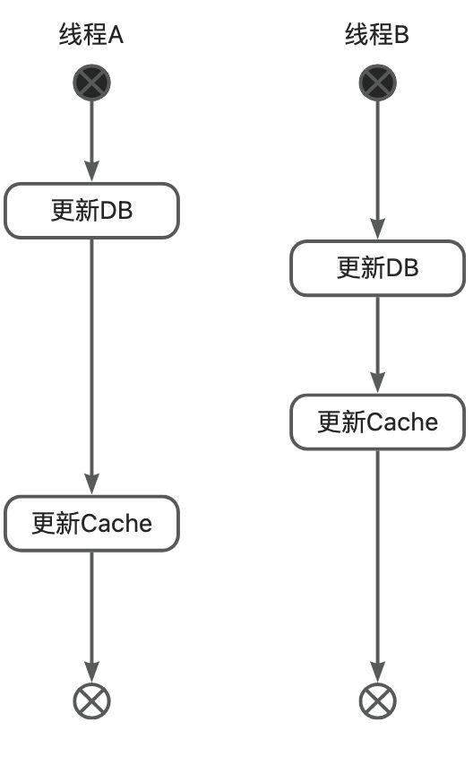
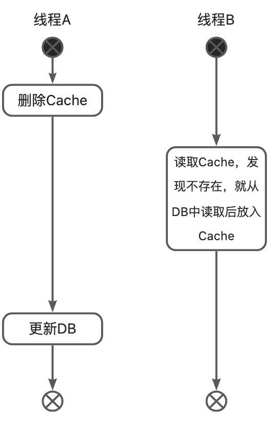
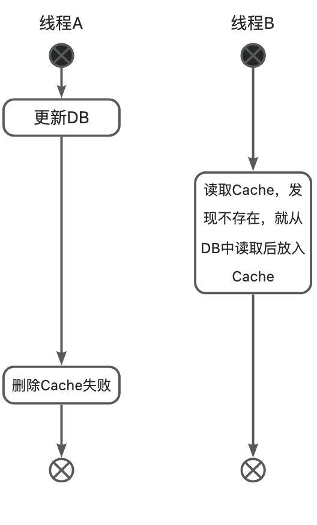
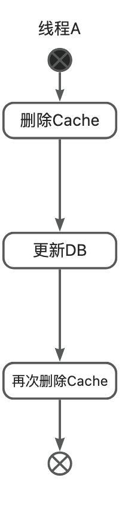

// TODO： 与Redis章节中的生产问题重复，考虑此篇文章的处理方式。

### 1. 出现的背景

进程内缓存 -> 单实例的进程间缓存（本地缓存） -> 分布式缓存

关于 本地缓存 ： 请参考笔者的另外一篇文章： Java中的本地缓存。获取更多内容可以关注笔者微信公众号：天晴小猪（WeChatID： zeanzai-me），也可以扫描文章底部的二维码进行关注。

### 2. 分布式缓存特性

- 高性能
- 高可扩展
- 高可用
- 高并发
- 故障自动转移
- 负载均衡
- [optional]支持事务和持久化

### 3. 技术选型

关于 `如何进行技术选型` 请参考笔者的另外一篇文章： 技术选型。获取更多内容可以关注笔者微信公众号：天晴小猪（WeChatID： `zeanzai-me`），也可以扫描文章底部的二维码进行关注。

#### 3.1. 中间件选型

redis
memecached

#### 3.2. 组件选型

jedis
RedisTemplate
lettuce
Redisson

#### 3.3. redis基本原理

请参考笔者的另外一篇文章： [Redis基本原理](../../../cs-tips/docs/docs/docs/middleware/redis.md)。获取更多内容可以关注笔者微信公众号：天晴小猪（WeChatID： `zeanzai-me`），也可以扫描文章底部的二维码进行关注。

### 4. 面试题

#### 4.1. 分布式系统中的多级缓存

#### 4.2. redis如何调优？

这个问题的另一个问法： 在不增加机器和不淘汰key的情况下，如何优化redis的存储空间？

#### 4.3. 七大经典缓存问题

- `缓存失效` 
   - 解释： 系统由于预热，把一批数据加载到缓存中，但是由于对缓存时间考虑不周，导致后期缓存在某一个时间节点突然集体失效，系统大量请求全部打在数据库上，造成数据库压力过大甚至宕机；
   - 解决方案： 既然缓存实效是因为key的失效时间设置的不合理，那么解决这个问题也要从key的失效时间下手，我们可以让key的失效时间=原定的失效时间+随机时间，这样的话，key就不会集中失效了。
- `缓存雪崩` 
   - 解释： 就是由于突然缓存所在机器出现问题（可能是大流量打死其中的n个节点、大流量导致网卡异常），导致所有的请求直接打到了mysql库上去，造成mysql也被瞬间打死。（所谓雪崩就是服务与服务之间造成了级联故障，换句话就是一个服务死机导致了另外一个服务扛不住压力也死机了。）
   - 处理方案： 中心思想就是防止redis被打死+应用程序限流熔断+应用程序提高响应能力，可分为两部分。在缓存部分，redis需要配置高可用+持久化+告警机制，高可用可以采用主从、哨兵、集群、异地多活等方式，持久化机制可以开启AOF、RDB、混合模式以便于在故障恢复后快速加载数据，告警机制可以人工提前介入进行动态扩容等；在应用程序部分，可以采用限流+熔断+本地缓存的方案；
- `缓存穿透` 
   - 解释： 就是多次请求缓存中没有的数据，导致直接查询数据库，导致数据库被打死；
   - 解决方案： 
      - 方案一： 如果从数据库中查询的结果为空，就在缓存中set一个值，再加上一个过期时间，这样就可以把请求拦截到缓存上，从而避免数据库被打死；但这种方式也有另外一个问题就是key如果很多，就会造成缓存的命中率下降，这时我们要定期清理key，或者将这些非法的key存入一个独立的公共缓存中，每次查询时先查询主缓存，如果不存在就查询独立缓存，再不存在就查询数据库，如果mysql返回结果为空，就把kv设置到独立缓存中，否则就放到主缓存中；
      - 方案二： 使用 Bloomfilter 来缓存全量的key，利用了 Bloomfilter 的位图数据结构特性，如果为ture，就一定存在，如果为false，不一定存在的特性；不过key的数量级要控制在10亿以内，大概占用1.2g缓存，又因为key越多误判率越高，因此还要定期清理key；
- `缓存击穿` 
   - 解释： 击穿的意思有点像在一道屏障上穿了一个孔。就是某一个key的访问非常频繁，但是某一个时刻，这个key突然失效，导致获取这个key的请求直接穿过缓存请求到数据库。
   - 处理方案： 中心思想是对热点key的处理。 针对基本不会发生更新的场景，可以把key设置为永不过期，让key常驻缓存；针对偶尔需要更新的场景，可以对请求代码使用分布式互斥锁，是的少部分直接请求请求数据库后更新缓存，而剩余的其他请求直接使用新缓存即可，或者采用本地互斥锁保证仅有少量请求能够更新缓存，其余请求访问新缓存； 针对需要频繁更新的场景，可以使用额外的补偿程序来定时刷新缓存或者延长key的实效时间；
- `如何保证缓存与数据库双写一致性？` 
   - 解释： 在使用缓存时，往往是数据库中保存着一份数据，而缓存中也保存着一份数据，这就涉及到数据库与缓存中数据的一致性问题
   - 处理方案： 
      - 方案一： 使用 Cache Aside 模式，就是在读缓存的时候，先读缓存，如果缓存中没有读到，那就读数据库，然后把读到的数据再放入缓存中，最后返回响应；更新操作时，就先更新数据库，然后再删除缓存；【更新操作是有问题的，下面会讲到】； 
         - 优缺点： 这种方案使用了懒加载的思想，适用于数据一致性要求较高的业务场景，或者缓存更新较为复杂的业务场景； 但是这种方案需要同时关注cache和db的数据变更，有些繁琐；
         - 更新操作为什么是删除缓存而不是更新缓存？ 
            - 这里涉及到懒加载的思想，事实上，更新缓存的性能损耗要大于删除缓存的性能损耗，如果读操作不多，那每次都要更新缓存所带来的性能损耗一定大于删除缓存的性能损耗，让第一次读操作从数据库中获取数据后更新缓存，之后所有的读操作直接请求缓存，性能损耗就会大幅度下降；
         - 如果更新操作时，先更新数据库，然后删除缓存，如果缓存删除失败呢？ 
            - 这同样会造成缓存与数据库不一致。解决办法就是先删除缓存，然后更新数据库。这样读操作时，如果缓存为空，就去读数据库，然后更新缓存，虽然读到的数据是旧数据，但是缓存更新后也是旧数据，就保证缓存与数据库一致了。
         - 如果更新操作时，瞬间有大量请求发送过来，会造成什么情况？仍然会造成缓存与数据库不一致问题。 
            - 因为一个更新请求过来，我们先执行删除缓存，然后更新数据库，但是在删除缓存之后还没有来得及更新数据库，另一个读请求也过来了，然后它发现缓存中没有数据，它就先去数据库中读取数据然后再更新到缓存，这时之前的更新请求再更新数据库，此时缓存和数据库不一致了【这个问题的本质原因是高并发请求和更新单个key】。解决方案是： 可以根据key的唯一性标识把相同参数的请求路由到同一台机器上，然后创建JVM内部队列，使更新操作放入一个队列，读操作也放入一个队列。目的是hang住读操作一些时间，等更新操作完成之后再进行读操作。但这种方式有可能会造成读操作的时间过长并且还有可能会造成某个单台机器负载过高的情况，这个时候要严格执行性能测试，一方面要看一下这种方式下读操作请求时长是否是可以忍受的，如果不可忍受，那就只能加机器；但单台机器负载过高的情况不可避免；
      - 方案二： 使用 Read/Write Through 模式，就是提供一个存储服务，查询数据和修改数据都通过这个服务来完成，这样可以屏蔽对数据的访问细节，在存储服务内部，针对查询数据的操作，可以直接去cache中查询，如果不存在就去db中查询，然后回种到cache中后返回，针对写数据的操作，先去查询cache，如果key存在，就更新缓存再更新db，如果缓存中key不存在就只更新db； 
         - 优缺点： 这种方案使用起来更加方便，因为它提供了一套操作cache和db的API，等同于封装了cache和db的操作细节，使业务系统不必关注cache和db的读写操作实现；此外，由于同样适用了懒加载方式，使得这种方式也适用于数据有冷热区分的业务场景；
         - 更新操作是怎么实现的？ 
            - 是通过cas算法实现的，这样利用了算法锁的方式避免了高并发带来的问题；
      - 方案三： 使用 Write Behind Caching 模式，这种模式跟 方案二 模式差不多，都是提供了一个存储服务，封装对cache和db的操作细节，让外部业务系统无感知的访问缓存。在其内部，读操作的实现原理与 方案二 是一样的，同样是先去cache中读，如果cache中不存在，就去db中读取，然后回种到cache后返回；与方案二不同的是更新操作的实现原理， 这种方案的更新操作是只更新cache，并提供异步批量的方案来根据cache来更新db； 
         - 优缺点： 这种方案的写性能是最大的，但是数据不一致性发生的几率最大，极端场景下可能会丢失数据，因此这种方案适合写合并的场景，比如微博的点赞数量，如果采用方案二，那势必是点赞一次就需要写db一次，这对db是很大压力的，在方案三中，可以点赞到1w后再写db，这样db压力就大大减小了；
   - 如何选择？ 
      - 高性能与强一致性本来就不可兼得，不同模式的选择就是针对高并发与强一致性的取舍；
      - 不存在最佳方案，只有最符合业务场景的方案；
- `热点key` 
   - 解释： 某些业务在某一瞬间或某一时间段内可能会成为热点业务，热点业务的数据可能会产生热点key，比如微博上热榜数据；
   - 方案： 先找出哪些key是热点key，可以通过spark的流计算或Hadoop的批处理来得出热点key，然后中心思想就是把这些热点key打散到不同的节点中以应付高并发请求；总的实现方案有加入二级缓存和加冗余节点，这个问题的关键在于如何发现热点key，4.0之后，可以使用 redis-cli --hotkeys 命令获取；业内著名处理方案有[有赞透明多级缓存解决方案（TMC）](https://tech.youzan.com/tmc/)
- `大key` 
   - 解释： 缓存中某些key的value的值过大，导致写操作超时、加载速度缓慢等问题；
   - 方案： 主要的处理思路是先找出哪些key是大key，然后再对大key进行操作； 
      - 如何找到大key？ 
         - 使用报警机制可以查看带宽与qps的关系，来判断是否有大key产生；
         - 利用 redis-cli --bigkeys 命令可以异步获取大key
         - 使用 redis-rdb-tools 离线分析工具来扫描RDB持久化文件
      - 找到大key后如何处理大key？ 
         - 可删除： 
            - 小于4.0， 使用 scan 命令扫描出key后进行删除
            - 大于4.0， 使用 UNLINK 命令异步删除
         - 不可删除： 
            - value 是 string，比较难拆分，则使用序列化、压缩算法将key的大小控制在合理范围内，但是序列化和反序列化都会带来更多时间上的消耗； 如果压缩之后仍然是大key，则需要进行拆分，一个大key分为不同的部分，记录每个部分的key，使用multiget等操作实现事务读取；
            - value 是 list/set 等集合类型时，根据预估的数据规模来进行分片，不同的元素计算后分到不同的片；

##### 4.3.1. 参考链接

- [如何解决Redis大key问题，看这一篇就够了!](https://www.jianshu.com/p/50c0894c0a19)
- [解决了Redis大key问题](https://zhuanlan.zhihu.com/p/473930220)
- [06 Hot Key和Big Key引发的问题怎么应对？.md](http://learn.lianglianglee.com/%E4%B8%93%E6%A0%8F/300%E5%88%86%E9%92%9F%E5%90%83%E9%80%8F%E5%88%86%E5%B8%83%E5%BC%8F%E7%BC%93%E5%AD%98-%E5%AE%8C/06%20Hot%20Key%E5%92%8CBig%20Key%E5%BC%95%E5%8F%91%E7%9A%84%E9%97%AE%E9%A2%98%E6%80%8E%E4%B9%88%E5%BA%94%E5%AF%B9%EF%BC%9F.md)
- 13的面试突击课程

### 5. 分布式缓存与数据库一致性问题： 应用场景

企业网银中，在客户管理等公共模块中，客户等热点信息需要被多个微服务模块所使用，如果直接从MySQL中读取，有点浪费MySQL服务器性能。于是放入缓存，但是客户信息也会被客户修改，这就造成了其他微服务读取到的数据与实际的数据不一致。

其他微服务使用时，通过调用客户管理模块中的接口进行获取，先读缓存，缓存中不存在就读db。

### 6. 问题

为什么会出现双写不一致问题？本质是在并发读写过程中，操作DB的动作与操作Cache的动作不具有原子性。换句话来说，就是在高并发场景下，无法保证操作DB的动作与操作Cache的动作同时成功或同时失败，也就是说可能会有中间状态。因此，只要使用缓存，就会涉及到缓存中数据与数据库中实际数据的一致性问题。
实际业务中，写操作和读操作是两套不相关的代码逻辑。因此我们分别讨论读操作和写操作的代码逻辑。

读操作，分为两种，延迟加载和预加载。

1. 延迟加载，即用到数据时，才从DB中加载到缓存中。这种方式是我们常用的方式。
2. 预加载，即应用程序启动时，就把数据加载到缓存中。这种场景适用于变更极少的数据，如配置项、数据字典等。

写操作，主要是更新数据和删除数据。更新数据时，为保证DB和Cache的数据一致性，既需要更新DB，又需要更新Cache；删除数据时，则需要删除DB和删除Cache。因此我们可以知道，写操作无论如何都需要同时操作DB和Cache，但是代码实现时，操作DB和操作Cache并不具备原子性，即**无法同时保证DB的操作和Cache的操作同时成功或同时失败**。不具备原子性，就意味着会造成DB和Cache数据不一致性问题。因此为了解决数据不一致性问题，我们首先想到的是让两个操作具备原子性，那么此时我们可以采用分布式锁的方式，让操作DB的动作和操作Cache的动作组合成一个原子操作，可是采用分布式锁，势必会降低缓存的性能，而我们之所以使用Cache的原因就是想利用Cache的高性能特性。因此我们首先排除分布式锁的方案。
根据操作DB和操作Cache的时机不同，我们把这个更新数据类型的写操作划分为这么几种：

1. 先更新Cache，后更新DB；
2. 先删除Cache，后更新DB；
3. 先更新DB，后更新Cache；
4. 先更新DB，后删除Cache；

我们把删除数据类型的写操作划分为这么几种：

1. 先删除Cache，再删除DB；
2. 先删除DB，再删除Cache；

我们把写操作中的操作DB部分进行合并，则写操作可以分为以下几种：

1. 先更新Cache（不包括删除），后更新DB（包括删除）。
2. 先删除Cache，后更新DB（包括删除）。
3. 先更新DB（包括删除），后更新Cache（不包括删除）。
4. 先更新DB（包括删除），后删除Cache。

再从性能的角度分析，如果更新Cache，那么写多读少的场景下，就会出现一个缓存写了好多次才被读到一次，因此更新Cache的方式不可取，所以写操作可以分为两种：

1. （**第一种写操作方式**）先删除Cache，后更新DB（包括删除）。
2. （**第二种写操作方式**）先更新DB（包括删除），后删除Cache。

我们**再来研究一下并发读写过程中可能会出现的问题**，并发读写过程可以分为这么几种：

1. 读-读。即多个线程同时读取。在预加载模式下，读-读操作是不会出现问题的。但是在延迟加载过程中，可能会出现线程A没有在Cache中读到数据，此时，线程B也去Cache中读取数据，也发现没有命中，所以直接去DB中查询，之后放入Cache中。在这个过程中，有可能是线程A写了Cache，紧接着线程B又写一遍Cache，也有可能是线程B先写，紧接着线程A写。但是不管怎样，读取到的数据都是以DB为主的。因此不管是预加载还是延迟加载，数据都是准确的。所以在读-读这种场景下，是不会出现问题的。
2. 读-写。即线程A进行读操作，而线程B进行写操作，且线程a先于线程b发生，这种场景下也不会出现问题。因为线程A读Cache时，Cache中的数据与DB中的数据一致，线程B进行写操作晚于线程A读操作发生，之后的数据变更与线程A读操作已经无关了，因此这种场景下也不会出现问题。
3. 写-读。即写操作线程早于读线程发生。这种场景下，结合上面写操作的四种流程进行区分：
   1. 先删除Cache，后更新DB（包括删除），这种方式在写-读并发操作中会出现DB与Cache不一致问题，写线程早于读线程发生，就意味着先删除Cache后，读线程发现Cache没有命中，就会从DB中获取并放入Cache，之后写线程再执行更新DB（包括删除）操作，此时DB和Cache中的数据就不一致了，如果后续再也没有写操作（包括删除），则有可能不一致性持续到Cache失效，直到再次读缓存才能变得一致；并且写多读少的场景下，可能会涉及到多次删除同一个缓存的情况，这也造成了Cache性能浪费的问题；
   2. 先更新DB（包括删除），后删除Cache，这种场景下，加入读线程发生在更新DB（包括删除）后删除Cache前，由于读取的是Cache，而DB中数据已经更新，如果此时有多个读线程同时发生，那么这些读操作读取的都是老旧数据，因此也会发生短暂不一致问题；这种场景出现的问题与c中出现的问题一致；
4. 写-写。即同时操作同一个数据的多个写操作线程同时发生。这种场景下，也结合上面写操作的四种流程进行区分：
   1. 先删除Cache，后更新DB（包括删除），也会出现线程A先删除Cache，之后线程B再删除Cache并更新DB（包括删除），最后线程A才更新DB（包括删除），假设线程A是要删除数据，线程B是要修改数据，那么就会造成线程B的更新丢失问题；
   2. 先更新DB（包括删除），后删除Cache，如果线程A先更新DB（包括删除），之后线程B更新DB（包括删除）并删除Cache，最后线程A删除Cache，那么会同样会导致线程A丢失更新问题；

所以总结一下在并发读写过程中出现的问题：

1. 写-读并发场景下，两种写操作方式都会存在数据不一致现象，极端情况下，第一种写操作方式不一致现象持续的时间可能会比第二种写操作方式持续的时间长；
2. 写-写并发场景下，两种方式都会出现丢失更新的问题；并且第二种写操作方式还会出现数据不一致现象；

在实际开发过程中，如果我们能够忍受较短时间的不一致现象，可以直接采用第二种写操作方式（先更新DB，再删除Cache）。

### 7. 设计实现方案

根据上面的分析，我们可以知道读操作在并发场景下并不会出现问题。因此我们的主要专注点转为写操作。

#### 7.1. 方案一-更新DB时，连带更新Cache

会产生问题：

1. **并发写数据时，会出现丢失更新。**在并发场景下，a更新数据后，此时b也要更新同一个值，就会出现a更新db后，b紧接着也要更新db，之后a在更新缓存，在之后b更新缓存。缓存中的数据就不是我们期望的值了。
2. **写多读少的情况下，会浪费缓存的性能。**会出现很多缓存刚被更新完还没有被读到一次，就又被更新了。这严重浪费了缓存的性能。

#### 7.2. 方案二-先删除Cache，再更新DB

会产生问题：

1. 会出现数据不一致问题，甚至会出现较长时间的数据不一致问题。a删除Cache后，b需要读取缓存，此时b发现Cache中没有数据，就会从数据库中读取数据，放入缓存，之后才执行a的更新db的操作，此时缓存中数据就与db中数据不一致了。如果a更新db后，很长一段时间内没有更新操作，不一致性可能会持续到缓存失效。

#### 7.3. 方案三-**更新DB后，删除Cache【优选】**

会产生问题：

1. 会出现短暂不一致问题。在a更新db后，删除Cache前，在此期间的所有读操作的数据都是不一致的。
2. 也可能会出现很长时间的不一致问题。如a更新完db后，删除Cache操作失败了，那么可能需要等到缓存过期，DB和Cache才能保持一致。

#### 7.4. 方案四-延迟双删

先删除Cache，再更新DB，之后延迟一段时间后再删除一遍Cache。

解决了方案二中可能会导致的长时间数据不一致性问题。

会产生问题：

1. 读少写多的场景下，会造成性能的浪费。因为每一次写操作，都会操作两次Cache。
2. 也可能会出现双写不一致问题。极端场景下，第二遍删除Cache时失败，操作效果就退化成方案二了。可以通过多次重试的方式解决这个问题。

#### 7.5. 方案五-基于消息队列删除Cache

先更新DB，再基于队列方式，更新db时构造一个消息，由额外的监听任务更新缓存。但这种方式在更新DB之后和消费消息之前同样会产生短暂不一致现象。

分为三种方式：

1. 基于内存队列
2. 基于消息队列
3. 基于binlog+消息队列

基于内存队列的方式，就是把删除操作转化成消息，加入任务队列，之后由异步线程去消费任务，这种方式可以在删除失败时进行多次重试，确保删除成功。这种方式多是采用基于阻塞队列的方式。同时，这种方式也有问题：

1. 读少写多的场景下，阻塞队列中的任务较多，可能会产生积压，此时可以通过引入多线程机制，加快消费；
2. 应用的复杂性增高，可用性降低；
3. 阻塞队列的不可靠造成数据不一致。基于JVM的阻塞队列会随着JVM崩溃而不可用，造成删除操作失败，也会产生数据不一致性；

基于消息队列的方式，把删除操作转化成消息队列里面的消息，引入高可靠的消息组件，如RocketMQ，这种方式解决了基于内存队列中的JVM崩溃造成的问题。但是：

1. 要求**使用高可靠的消息组件**，并**开启投递确认机制和消费确认机制**。目的是确保消息不会丢失和消息被正确消费；
2. 这种方式**增加了写操作的代码复杂度**。虽然让写操作程序不用直接删除Cache，但是需要在更新DB后，需要增加投递删除消息的逻辑，并且还需要额外的消费消息的逻辑；

基于Binlog+消息队列的方式，这种方式相当于把**删除Cache的操作**委托给**监听Binlog变更程序**、**消息组件**及**消费者监听程序**了。原理是在写入DB后，根据Binlog变更日志，生产消息，再由专门的消费者消费消息。这种方式：

1. 需要引入额外的逻辑，如解析Binlog变更日志的逻辑，当然可以使用Canal中间件等；
2. 同样**需要引入高可靠的消息组件**，也同样需要**开启投递确认机制和消费确认机制**；

优缺点分析：

1. 这种方式降低了写操作的代码复杂度。让写操作只需要关注更新DB的逻辑；
2. 引入额外的组件，增加了整个系统的复杂度，降低了整个系统的可用性；

#### 7.6. 方案六-强一致性方案

中心思想是把写DB和删除Cache这两个原子操作合并成一个原子操作。此过程可以采用具有CP性能的ZK作为分布式锁。也可以使用RedLock作为分布式锁的实现。

### 8. 方案七-Read/Write Through模式

这种方式的使用原理是，提供一个专门用来操作缓存的服务，使用对外提供API接口的方式屏蔽对缓存的操作细节。

1. 读操作时，先去Cache中查询一下，如果命中就直接返回；如果没有命中，就去DB中查询，之后回种到Cache后返回；
2. 写操作时，先去Cache中查询一下，如果命中，就先更新Cache，之后再通过CAS并发锁更新DB；如果没有命中，就只通过CAS并发锁更新DB；

这种方案，屏蔽了Cache和DB读写操作的实现细节。但这种方案依赖一个专门的服务，如果节点发生故障，就会导致读写失败，因此需要集群方式部署才能保证高可用。

#### 8.1. 方案八-Write Behind 模式

这种方式的实现原理是，同样提供一个专门用来操作缓存的服务，使用对外提供API接口的方式屏蔽对缓存的操作细节。

1. 读操作时，先去Cache中查询一下，如果命中就直接返回；如果没有命中，就去DB中查询，之后回种到Cache后返回；
2. 写操作时，也需要先去Cache中查询一下：
   1. 方式一：如果命中，就直接更新；如果没有命中就先去DB中查询，然后根据业务逻辑组装数据并回种到Cache。然后，再利用一个异步周期任务，把Cache数据同步到DB中。这种方式写操作性能最高，相当于数据以Cache为准，适合写合并的业务场景，如点赞数放入Cache，后续定期写DB。
   2. 方式二：如果命中，就直接更新Cache，之后发送更新DB的消息；如果没有命中就先去DB中查询，然后根据业务逻辑组装数据并回种到Cache，最后发送更新DB的消息。然后再利用消息队列的方式，把更新DB的消息解析出来之后变更到DB中。这种方式写性能也还行，但是需要保证消息组件高可用（高可用部署+持久化），还需要开启投递消息的确认机制和消费消息的确认机制。

### 9. 总结

不管使用上面的哪一种方案，其实都会出现数据不一致性问题，只不过是数据不一致性问题持续的时间长短问题。结合性能需求和业务场景需要，我们总结出以下生产最佳实践：

1. **如果数据不一致性问题在可忍受范围内，优先考虑【方案三-更新DB后，删除Cache】；**
2. 考虑其他方案时，要考虑高性能与高可用之间的平衡，因为引入程序的复杂度越高，可用性就越低；

### 10. 实现过程

[13的面试突击课](https://zeanzai.me/java/distribute/cache.html)
[美团2面：如何保障 MySQL 和 Redis 数据一致性？这样答，让面试官爱到 死去活来](https://mp.weixin.qq.com/s/8R1zwmH97lOWPwNal-X2XQ)
[Canal 解决 MySQL 和 Redis 数据同步问题](https://juejin.cn/post/6945784603508637709)
[不知道这四种缓存模式，敢说懂缓存吗？](https://www.51cto.com/article/713035.html)
[缓存模式（Cache Aside、Read Through、Write Through、Write Behind）](https://blog.csdn.net/z69183787/article/details/112308815)
