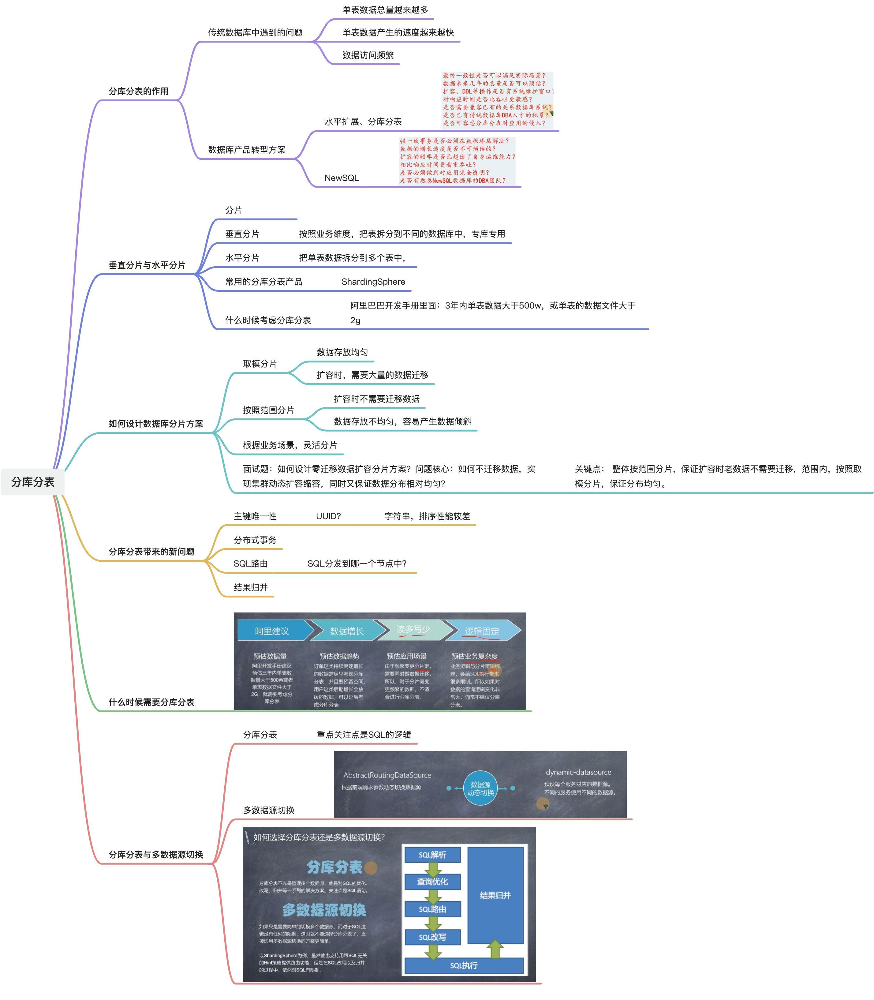
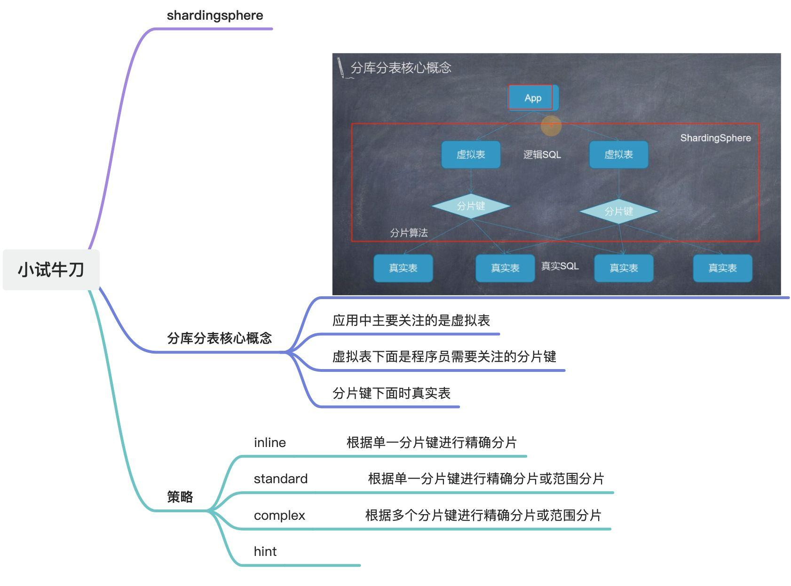
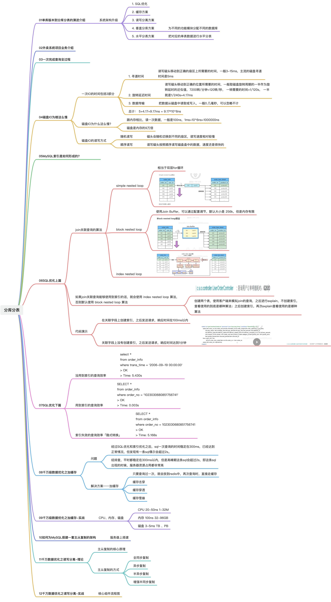
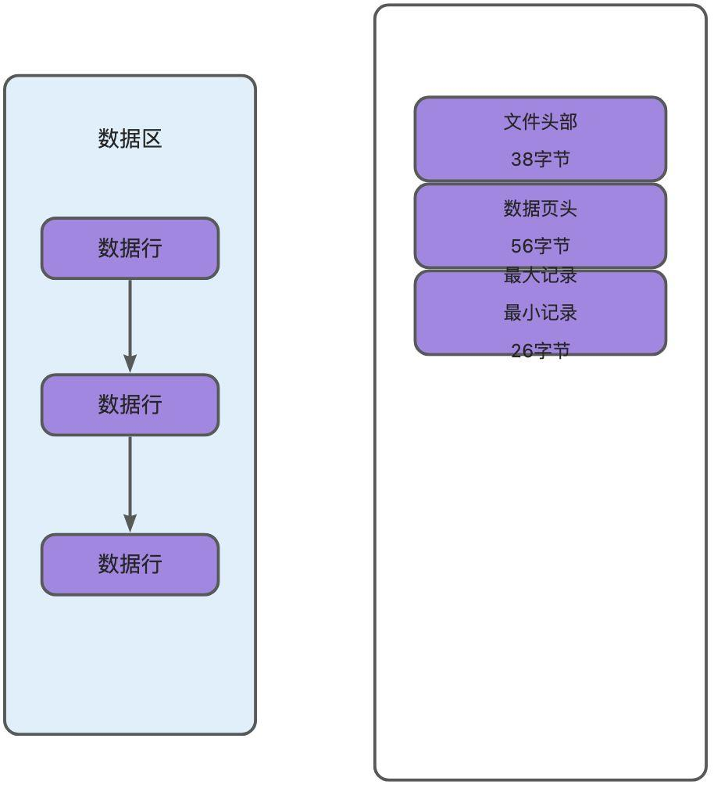
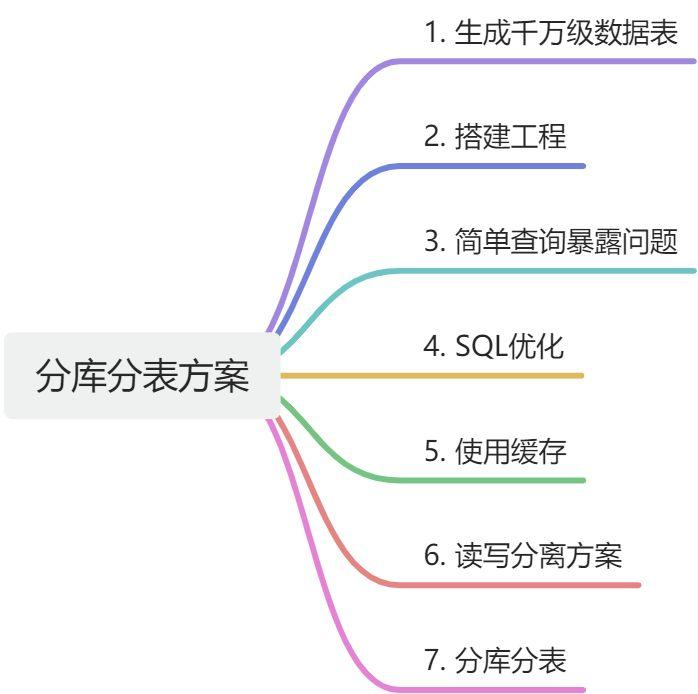
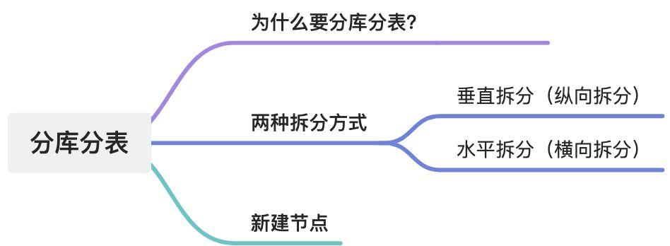

# 分布式存储

- [实战彻底搞清分库分表（垂直分库，垂直分表，水平分库，水平分表）](https://cloud.tencent.com/developer/article/1819045)

源码地址： [https://github.com/x-cpa/ShardingSphereDemo](https://github.com/x-cpa/ShardingSphereDemo)

### 1. 实验

1. 构建千万级别数据库表；
2. 对比下面三种情况的响应速度
   1. 使用索引的方式查询
   2. 不使用索引的方式查询
   3. 使用索引失效的方式查询
3. 加缓存的方案： 首次查询从数据库中查询，之后放入缓存中，第二次及以后的查询全部走缓存
4. 读写分离的方案：
5. 多数据源读写的方案：
6. 分库分表的方案：创建多个库多个表，并从表中读取数据『目的是为了验证读写多个库里面的多张表』
   1. C端用户订单表
   2. B端用户订单表
7. 单库亿级数据分库分表『实现数据迁移』
   1. 全量同步
      1. 断点续传
      2. 数据一致性问题
      3. 

### 2. 分库分表带来的问题及解决方案

参考： [如何解决分库分表带来的问题？](https://www.bilibili.com/video/BV1aY411K7qy/)

### 3. id

### 4. 分布式事务

一般情况下是两阶段提交和TCC。但是多数实际应用场景中，并不直接使用分布式事务，因为分布式事务：

   - 会带来严重的性能损耗
   - 会引入额外的系统复杂度
   - 分布式事务出现的几率很低

一般采用柔性事务，即保证最终一致性。可以采用下面多种措施配合使用来保证最终一致性：

   - 回滚
   - 重试
   - 监控
   - 告警
   - 幂等
   - 对账
   - 人工介入

如果非要使用分布式事务，可以使用阿里开源的Seata框架。

### 5. 跨库查询和分页

方案1
选择合适的分库分表字段
方案2
引入搜索引擎ES
方案3
分开查询，内存聚合

---

### 6. 为什么要分

- 软件系统也不是一上来就进行分库分表的，而是有一个演进过程： 
   - 先是试着优化sql，提高单条sql的执行效率；
   - 接着是加缓存、多租户、多数据源、读写分离；
   - 最后才是分库分表；
   - 但随着微服务领域的技术的发展，分库分表已经不重要了；
- RDBMS受单机存储容量、连接数、CPU处理能力、网络带宽等因素影响，容易成为系统瓶颈；

### 7. 什么时候分

1. 能不分就不分

秉持的原则是： 能不分就不分，分库分表是迫不得已的选择，并不是一开始就使用的。这样做的原因是： 过度设计和过早优化会导致系统复杂性增高，可用性降低。因此在分之前要先考虑，机器性能是否已经被压榨到了极限？

因此在系统设计初期，就需要尽早考虑如何压榨RDBMS的机器的性能。一般情况下从下面几个角度去考虑：

- 表设计，基本原则是根据业务进行解耦、创建一些索引用来提高查询效率
- 业务实现上面，基本原则，sql优化、使用缓存、

如： 从sql优化、读写分离、使用缓存、多数据源等方面先进行优化，

1. 

### 8. 理论基础

#### 8.1. 数据切分

- 垂直切分 
   - 垂直分库： 如何分、优缺点
   - 垂直分表： 如何分、优缺点
- 水平切分 
   - 水平分库： 如何分、优缺点
   - 水平分表： 如何分、优缺点

#### 8.2. 分库分表带来的问题及解决方案

- 事务一致性问题
- 跨节点关联查询问题
- 跨节点分页、排序、函数执行问题
- 全局主键避重问题
- 数据迁移、扩容、校验 
   - 分为停机迁移、不停机迁移
   - 迁移后需要对迁移后的数据进行校验

### 9. 中间件

### 10. 实践案例

### 11. 分库分表演进过程

- 优化SQL
- 加缓存
- 多租户
- 多数据源
- 读写分离
- 分库分表

### 12. 参考

- [ShardingSphere进阶](https://mp.weixin.qq.com/mp/appmsgalbum?__biz=MzU3MDAzNDg1MA==&action=getalbum&album_id=2389616635193393153&scene=21#wechat_redirect)
- [lamp-cloud : saas 平台](https://github.com/zuihou/lamp-cloud)
- [如何解决分库分表带来的问题？](https://www.bilibili.com/video/BV1aY411K7qy/)
- [实战彻底搞清分库分表（垂直分库，垂直分表，水平分库，水平分表）](https://cloud.tencent.com/developer/article/1819045)

