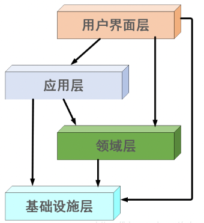
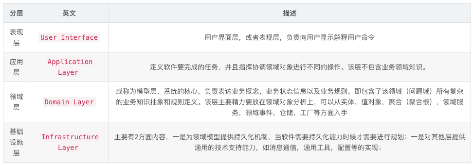
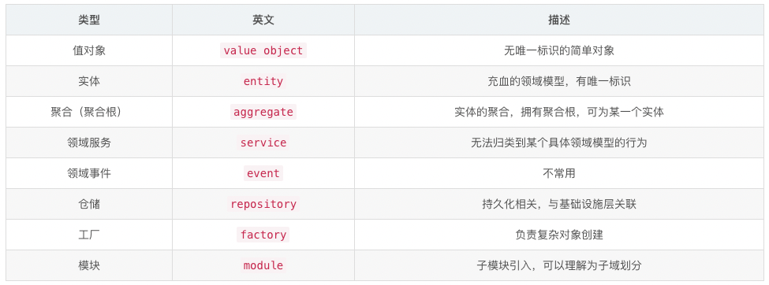

## 1. DDD

### 1.1. DDD 分层结构

DDD 分层架构是一种架构设计风格，也是微服务架构设计的最佳实践，其中包括了四层结构内容，用户接口层、应用层、领域层、基础设施层。

### 1.2. 优缺点

- 优点：在需求评审阶段，便于程序员更好的理解需求，使缩小程序员的需求理解与需求提供方的业务需求的偏差；在实现阶段，更贴近微服务技术架构体系的高内聚低耦合的设计思想，对需求变更及系统后期维护友好；在测试阶段，更便于测试人员场景化测试，不用再次全量测试；
- 缺点：需要程序员对业务特别熟悉，如果程序员对业务不够熟悉还需要业务领域专家等相关角色的配合；相比传统三层架构设计风格，这种架构设计风格的术语较多，有较高的学习曲线；

### 1.3. 基本原理

用户接口层：主要是负责向用户和其他软件系统显示信息和解释用户指令。主要职责为请求参数与响应参数的解释、校验和转换，注意这里的校验是简单的校验，不包含业务规则的校验。代码实现时包含的有 DTO、VO 等实体类，DTO 用来做数据转换使用，VO 是纯值实体类，主要是因为领域对象关系比较复杂，很难序列化，使用纯值的 VO 可以减少网络开销和信息安全。

应用层：主要是定义软件需要完成的任务，并指挥具有领域概念的对象来解决问题。主要职责是负责组织整个应用的流程，是面向用例设计的，不包含业务规则和知识，只是为了下一层的领域对象协调任务、委托工作；在这一层很适合处理事务、日志、安全等。添加应用层的原因在于有些业务比较复杂，代码会过于庞大，并且如果领域对象具有针对某个具体应用的业务逻辑，会降低应用之间的可重用性；

领域层：主要是针对不同的业务领域抽象出不同的领域模型，这些领域模型主要用来表达业务概念，业务状态和业务规则；其中包括了实体（具有唯一标识）、VO（纯值对象）、聚合对象（具有一组内聚关系的对象的集合）、领域服务（一些行为无法归类到实体对象或值对象上，本质是一些操作，而非事务）、工厂（创建复杂对象，隐藏创建细节）、仓储（提供查找和持久化对象的方法）等。

基础设施层：主要为上面各层提供通用的技术能力，为用户界面层绘制屏幕组件，为应用层传递消息，为领域层提供持久化机制。包括了，外部库、数据库接口、应用服务器操作、消息后端、缓存后端等。Repository 与 DAO 的区别在于，DAO 是从数据库表的角度来看待问题的，它只提供一种面向数据库表的数据处理风格，而 Repository 和 Data Mapper 更加面向对象，通常用在领域模型中，并且在领域模型中应避免使用 DAO 模式。

> - 充血模型：领域模型架构中包含了领域逻辑和领域属性的领域模型。
> - 失血模型：传统三层架构中只有 get/set 方法，没有业务逻辑的 POJO 对象。
> - 贫血模型：类似充血模型，但是不包括持久化相关逻辑。
> - PO（Persistant Object）：持久化对象，即 DAO 从 JDBC 取出来的对象。传统三层架构中，PO 即 POJO 组件中的对象，存在于 DAO 和 Service 之间。
> - DO（Domain Object）：领域对象，领域模型架构中，PO 从数据库取出来后，有一个“重建”的概念，即根据数据还原实体，这个被还原的实体就是 DO，存在于 DAO 和 Service 之间。
> - DTO（Data Transfer Object）：数据传输对象。对传统三层架构来说，该对象存在于 Service 和 Controller 之间。PO 到 DTO 的转换可以在 Service 或 Controller 中实现。
> - VO（View Object）：视图对象。Controller 在返回 DTO 给视图时，可能还需要包括状态信息例如操作成功/失败的状态码、提示文本等。这时就需要在 DTO 外面再包一层，即 View Object。该对象存在于 Controller 和 Web 之间，由 Controller 进行装配

### 1.4. 与传统三层架构的区别

传统三层架构从技术角度上设计架构的，而 DDD 则是从业务角度上设计架构的，二者的主要区别在于设计架构师的视角不同。传统三层架构是设计出来的系统，在重用性上不如 DDD，如：传统三层架构中会有很多的 entity，每一个 entity 针对业务的耦合性较高，很多不能服用；DDD 针对领域模型设计，天然的会把业务知识应用到设计中，会提高很多关键代码的重用性；此外，控制层的职责过重，耦合性也过高，重用性也没有 DDD 的重用性高。

### 1.5. DDD 设计样例

针对用户购买商品的场景，使用 DDD 进行设计。包括用户领域、商品领域、订单领域。主要针对商品领域进行设计。

- 领域模型：商品主标题、副标题、商品描述、图片唯一标识、库存数量、可用库存数量、原价、优惠价、状态、创建时间、更新时间
- 领域服务：发布商品、获取商品信息、修改商品信息、库存扣减、库存恢复、商品下单条件检查
- 领域事件：上线商品、销售商品

根据商品领域设计可以发现，这与面向对象的设计思路基本一致，都包括对象的基本属性、对象的操作，以及对象的组合操作等。

## Serverless

## ServiceMesh

## Hint

而在学习架构演变过程这个主题时，我们要站在软件工程的角度去考虑某一个架构模式的缺点。比如说单体架构，要从其软件工程中的迭代过程中各人员的工作量上来分析。

#

## **DDD 分层结构**

DDD 分层架构是一种架构设计风格，也是微服务架构设计的最佳实践，其中包括了四层结构内容，用户接口层、应用层、领域层、基础设施层。

## **优缺点**：

优点：
在需求评审阶段，便于程序员更好的理解需求，使缩小程序员的需求理解与需求提供方的业务需求的偏差；在实现阶段，更贴近微服务技术架构体系的高内聚低耦合的设计思想，对需求变更及系统后期维护友好；在测试阶段，更便于测试人员场景化测试，不用再次全量测试；
缺点：
需要程序员对业务特别熟悉，如果程序员对业务不够熟悉还需要业务领域专家等相关角色的配合；相比传统三层架构设计风格，这种架构设计风格的术语较多，有较高的学习曲线；

## **基本原理**

用户接口层：主要是负责向用户和其他软件系统显示信息和解释用户指令。主要职责为请求参数与响应参数的解释、校验和转换，注意这里的校验是简单的校验，不包含业务规则的校验。代码实现时包含的有 DTO、VO 等实体类，DTO 用来做数据转换使用，VO 是纯值实体类，主要是因为领域对象关系比较复杂，很难序列化，使用纯值的 VO 可以减少网络开销和信息安全。
应用层：主要是定义软件需要完成的任务，并指挥具有领域概念的对象来解决问题。主要职责是负责组织整个应用的流程，是面向用例设计的，不包含业务规则和知识，只是为了下一层的领域对象协调任务、委托工作；在这一层很适合处理事务、日志、安全等。添加应用层的原因在于有些业务比较复杂，代码会过于庞大，并且如果领域对象具有针对某个具体应用的业务逻辑，会降低应用之间的可重用性；
领域层：主要是针对不同的业务领域抽象出不同的领域模型，这些领域模型主要用来表达业务概念，业务状态和业务规则；其中包括了实体（具有唯一标识）、VO（纯值对象）、聚合对象（具有一组内聚关系的对象的集合）、领域服务（一些行为无法归类到实体对象或值对象上，本质是一些操作，而非事务）、工厂（创建复杂对象，隐藏创建细节）、仓储（提供查找和持久化对象的方法）等。
基础设施层：主要为上面各层提供通用的技术能力，为用户界面层绘制屏幕组件，为应用层传递消息，为领域层提供持久化机制。包括了，外部库、数据库接口、应用服务器操作、消息后端、缓存后端等。Repository 与 DAO 的区别在于，DAO 是从数据库表的角度来看待问题的，它只提供一种面向数据库表的数据处理风格，而 Repository 和 Data Mapper 更加面向对象，通常用在领域模型中，并且在领域模型中应避免使用 DAO 模式。

| 其他概念
充血模型：领域模型架构中包含了领域逻辑和领域属性的领域模型。
失血模型：传统三层架构中只有 get/set 方法，没有业务逻辑的 POJO 对象。
贫血模型：类似充血模型，但是不包括持久化相关逻辑。
PO（Persistant Object）：持久化对象，即 DAO 从 JDBC 取出来的对象。传统三层架构中，PO 即 POJO 组件中的对象，存在于 DAO 和 Service 之间。
DO（Domain Object）：领域对象，领域模型架构中，PO 从数据库取出来后，有一个“重建”的概念，即根据数据还原实体，这个被还原的实体就是 DO，存在于 DAO 和 Service 之间。
DTO（Data Transfer Object）：数据传输对象。对传统三层架构来说，该对象存在于 Service 和 Controller 之间。PO 到 DTO 的转换可以在 Service 或 Controller 中实现。
VO（View Object）：视图对象。Controller 在返回 DTO 给视图时，可能还需要包括状态信息例如操作成功/失败的状态码、提示文本等。这时就需要在 DTO 外面再包一层，即 View Object。该对象存在于 Controller 和 Web 之间，由 Controller 进行装配 |
| --- |

## **与传统三层架构的区别**

传统三层架构从技术角度上设计架构的，而 DDD 则是从业务角度上设计架构的，二者的主要区别在于设计架构师的视角不同。传统三层架构是设计出来的系统，在重用性上不如 DDD，如：传统三层架构中会有很多的 entity，每一个 entity 针对业务的耦合性较高，很多不能服用；DDD 针对领域模型设计，天然的会把业务知识应用到设计中，会提高很多关键代码的重用性；此外，控制层的职责过重，耦合性也过高，重用性也没有 DDD 的重用性高。

## **DDD 设计样例**

针对用户购买商品的场景，使用 DDD 进行设计。包括用户领域、商品领域、订单领域。主要针对商品领域进行设计。

领域模型：商品主标题、副标题、商品描述、图片唯一标识、库存数量、可用库存数量、原价、优惠价、状态、创建时间、更新时间
领域服务：发布商品、获取商品信息、修改商品信息、库存扣减、库存恢复、商品下单条件检查
领域事件：上线商品、销售商品

根据商品领域设计可以发现，这与面向对象的设计思路基本一致，都包括对象的基本属性、对象的操作，以及对象的组合操作等。

1. https://www.bilibili.com/video/BV11u411176h?from=search&seid=2345559385647535770&spm_id_from=333.337.0.0
2. https://blog.csdn.net/whos2016/article/details/103927879?spm=1001.2101.3001.6650.7&utm_medium=distribute.pc_relevant.none-task-blog-2%7Edefault%7EBlogCommendFromBaidu%7ERate-7.pc_relevant_default&depth_1-utm_source=distribute.pc_relevant.none-task-blog-2%7Edefault%7EBlogCommendFromBaidu%7ERate-7.pc_relevant_default&utm_relevant_index=10
3. https://cloud.tencent.com/developer/article/1551986

扩展阅读： [如何基于 DDD 构建微服务架构](https://mp.weixin.qq.com/s/VPD9NSB1uAg5l4tx8DfXEQ)
