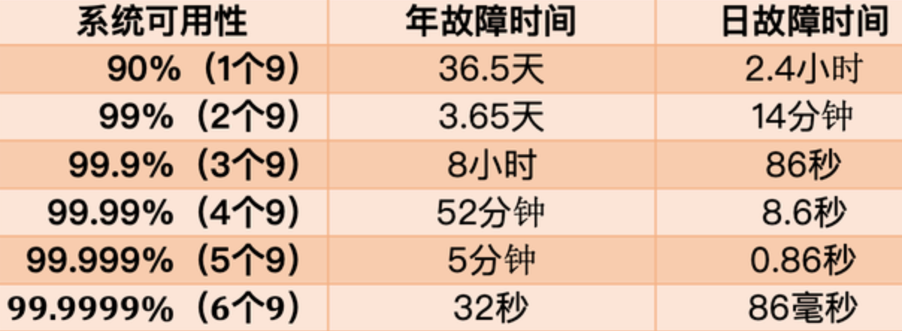

# 测试

## 什么是基准测试

> 是一种用于测量和评估软件性能指标的活动，用于建立某个时刻的性能基准。

从字面意思上理解，基准就是最初的，最基本的。举个例子，假设我们在一台服务器上部署了一个数据库实例，后面我们想要知道调整某个数据库参数对数据库带来的性能的提升，我们会怎么做呢？很自然的想到，我们要对调整前的性能指标做个测试，然后对比调整参数前后的性能指标，这样就知道调整参数对性能的影响了。

我们可以简单的理解为，软件最初状态时的测试结果就是基准测试，以后对软件的每次修改之后的测试都可以跟这个最初状态时的测试结果做对比，以验证软件的修改对性能的影响。甚至也可以这样理解，基准测试的作用在于为其他测试提供依据。

比如，我们的 web 应用中要使用 MySQL，部署完成之后，没有做任何修改，我们就对 MySQL 的相关性能指标做了一次测试，那这个过程就可以理解为基准测试。后面可能会修改一些 MySQL 的配置参数，我们想要知道修改对性能的提升的影响程度，那么我们就可以在修改后，再次对 MySQL 做一次性能测试，然后把对比结果跟基准测试的结果做一下对比，就可以得出修改对性能的影响程度了。

不同的测试对象的基准测试的指标会有所不同。

在 Java 领域中，我们会对业务模型中重要的业务做单独的测试，把单用户运行时的各项性能指标作为基准测试的性能指标，以此来为多用户并发测试和综合场景测试等性能分析提供参考依据。我们也会使用基准测试对比某一个业务模块的不同实现的性能。下面是一些经典场景：

1. 定位到软件系统中的热点代码，之后对热点代码进行优化，就要先进行基准测试，得出最初性能指标，之后才能看到优化后的具体效果；
2. 对比同一个函数的不同实现的性能；
3. 对比同一个函数的执行时间与输入参数的相关性；
4. ...

**在实际生产过程中，在调优场景中用到的比较多。**

## 基准测试 VS 压力测试

基准测试： 获取的指标多为性能指标，不用关心具体的业务系统是怎么样的。
压力测试： 获取的指标多为业务性能指标，跟具体业务系统有关。

比如，一台阿里云服务器，不管上面部署什么应用，它实际的读写能力指标、CPU 的计算能力指标等都是不变的，并不是部署了 A 应用和部署了 B 应用性能指标就不一样，也就是这台阿里云服务器的基准测试的结果不会随着业务系统的变化而变化；但是部署了 A 应用和部署了 B 应用，压力测试下的业务指标很可能就不一样，比方说，在这台服务器上，A 应用的 TPS 可能到 1w，但是 B 应用可能就只有 5k。

## Redis 的基准测试

[redis 演练(4) redis 基准测试](https://blog.51cto.com/dba10g/1845405)

## Mysql 的基准测试

[MySQL 基准测试工具--sysbench](https://www.programminghunter.com/article/7742773856/)
[利用 sysbench 进行 MySQL OLTP 基准测试](https://www.programminghunter.com/article/5619845276/)

## StringBuilder VS StringBuffer 基准测试

## Java 应用的基准测试

[不要再用 main 方法测试代码性能了，用这款 JDK 自带工具](https://juejin.cn/post/6914960426098917384)
[如何在 Java 中使用 JMH 进行基准测试](https://segmentfault.com/a/1190000039902797)
[JMH--一款由 OpenJDK 开发的基准测试工具](https://zhuanlan.zhihu.com/p/205027540)
[JMH Samples ](https://hg.openjdk.org/code-tools/jmh/file/2be2df7dbaf8/jmh-samples/src/main/java/org/openjdk/jmh/samples)

服务器性能指标

## 独立 IP【IP】

概念： 表示一定时间内，使用的独立的 IP 个数。一般情况下，这个指标不太重要。
主要作用： **主要用于安全领域，如白名单、黑名单、黑客攻击等**。识别出一些 IP 具有过高访问量，并且这些 ip 的业务操作也异常时，可以识别为攻击行为等。
统计方法： 根据部署视图不同，可以采用不同的方式。如，添加了反向代理的部署方式，可以通过统计 ng 中的 ip 个数来完成。再如，也可以在应用程序中通过把请求的 IP 记录到日志中，然后统计日志来完成。

## 页面访问数量【PV】

表示一段时间内，某一个页面的访问的次数。
主要作用： **多是用来进行前端性能监控和调优来使用的**。如，首页的 PV 过高，造成过高的网络带宽，就要优化一下，是否是因为首页加载了过多的静态资源。当然**也可以用来安全防护**，如，某个页面的 PV 超过业务正常访问量，那么就有理由相信这个页面遭受到了黑客攻击。再比如，某一个优惠页面独立用户访问数过低，那么就可以通过调整页面顺序来提高预期访问数。
统计方法： 可以通过 cat 这种中间件进行访问，在前端页面中加入『锚点』，cat 会进行对每一次请求进行记录，统计时直接查看 cat 的控制台相关数据即可。

## 独立用户访问数【UV】

表示一段时间内，对某个页面的所有请求的去重后的独立用户数。
主要作用： 也**可以用来做安全防护**，也**可以根据独立用户访问数来调整业务需求**，如某一个用来分享的链接，我们就可以根据有多少个实际的独立用户访问，来统计可能会带来的预期的经济收益等，这也是用来支撑业务的。
统计方法：可以通过技术手段来完成，如通过分析 cookie 的方式来统计。

## 带宽

一天总流量：每个页面 20k 字节\*100 万个页面/1024=19531M 字节=19G 字节，19531M/9.6 小时=2034M/小时=578K 字节/s，如果请求是均匀分布的，需要 5M（640K 字节）带宽（5Mb=640KB 注意大小写，b 是位，B 是字节，差了 8 倍），但所有请求不可能是均匀分布的，当有高峰时 5M 带宽一定不够，X2 倍就是 10M 带宽。10M 带宽基本可以满足要求。

在购买云服务器资源时，需要选择带宽，此时就需要统计网站预计的带宽资源是多少。举个例子： 我们预估访问频率最高页面是首页，而首页的页面大小为 20kb，也就是 20k 字节，并且我们假定一天中有 80%的请求发生在一天的 40%的时间，24 小时的 40%是 9.6 小时，也就是有 80%的请求发生一天的 9.6 个小时当中（很适合互联网的应用，白天请求多，晚上请求少），如果网站一天的访问量有 100w 个页面，那么一天的总流量大概是： 20k 字节\*100 万页面/1024=19531M 字节=19G 字节，假设请求均匀分布，那么每秒的流量是 19531M/9.6 小时=2034M/小时=578K 字节/s，也就是说需要 5M 字节（640k 字节）带宽。

## 性能测试关注的指标

### 吞吐量

表示单位时间内，通过网卡的数据量的总数，包括由本机网卡接收到的和由本机网卡发送出去的。
一个 100Mb(位)的双工网卡，最大发送数据的速度是 12.5M（1 字节=8 位）字节/s ， 最大接收数据的速度是 12.5M 字节/s。

### 响应时间【RT】

表示执行一个请求从开始到最后收到响应数据所花费的总体时间。它的数值大小直接反应了系统的快慢。
实际应用中有：90 线、95 线、99 线的说法，如 90 线的响应时间为 200ms，就表示有 90%的请求的响应时间在 200ms 以内。

### 每秒并发数【QPS】

如果网站的 PV 为： 500 万 PV/每天，我们假定 80%的访问量集中在一天中 40%的时间内，并且我们假定是请求是均匀分布的，那么换算成 QPS，就是：
((80%*500 万)/(24 小时*60 分*60 秒*40%))/1 = 115.7 个请求/秒
留有余量的话，我们假定高峰时期的访问量是平时的 2-3 倍：
115.7 个请求/秒 *2 倍=231.4 个请求/秒
115.7 个请求/秒 *3 倍=347.1 个请求/秒
那么结论是： 如果你的服务器支持 231.4--347.1 个请求/秒，就可以应对平均 500 万 PV/每天。
在计算每秒并发数时，要注意高峰并发数和二八定律或四六定律。

> 二八定律： 一天的 80%的请求集中在 20%的时间里。

要想提高服务器的 QPS，一个直观的感受是——加多线程。在实际的压测过程中，我们可以调大线程数，但是当加到一定多的线程以后，会发现 QPS 增加缓慢，线程的响应时间增加迅速，此时，我们就可以人为已经达到最佳线程数了。最佳线程数有一个计算公式：

> **最佳线程数目 = （（线程等待时间+线程 CPU 时间）/线程 CPU 时间 ）\* CPU 数目**

或

> **最佳线程数目 = （线程等待时间与线程 CPU 时间之比 + 1）\* CPU 数目**

举例，平均每个线程 CPU 运行时间为 0.5s，而线程等待时间（非 CPU 运行时间，比如 IO）为 1.5s，CPU 核心数为 8，那么根据上面这个公式估算得到：((0.5+1.5)/0.5)*8=32。
再比如，MySQL 中 CPU 计算只需要 5ms，而读取磁盘所耗费的 IO 的时间为 100ms，那么对于一个 8 核 CPU 的服务器来说，最佳线程数为：
(100/5+1)*8 = 168 个。

如果针对纯 CPU 运算的业务，最佳线程数为： 核心数+1 即可。

### 并发数

也叫每秒事务数【TPS】，计算方法类似于 QPS 的计算方式。

[性能测试——Redis 基准测试](https://zhuanlan.zhihu.com/p/78034665)
[性能测试——MySQL 基准测试](https://zhuanlan.zhihu.com/p/90773766)
[如何正确地使用 Redis（附性能测试实验结果）](https://developer.aliyun.com/article/783643#slide-29)

## 系统高可用指标

### 平均故障间隔【MTBF，Mean Time Between Failure】

表示两次故障的间隔时间，也就是系统「正常运行」的平均时间，这个时间越长，说明系统稳定性越高

### 故障恢复时间【MTTR，Mean Time To Repair】

表示系统发生故障后「恢复的时间」，这个值越小，故障对用户的影响越小。

可用性计算公式：
**可用性（Availability）= MTBF / (MTBF + MTTR) \* 100%**
多使用 n 个 9 的表示方法：

## 常见服务器性能

自建机房的实际经验中，如果采用配置两台机架式服务器的方式，服务器配置是： 4C4G+SAS 硬盘，一台作为部署应用，另外一台部署数据库，项目属于论坛类的项目（总有回帖,不太容易做缓存,也无法静态化），这样的服务器配置是可以应对 100WPV/每天（已留有余量应对突然的访问高峰)）。

服务器性能选用标准：

**CPU**： 同等价位的，intel 的好于 AMD 的，核数越多服务器性能越好，当然价钱也就越高。关注的指标有主频、核心数、线程数等。
**内存**： 原则上是，内存越大，可同时运行的程序越多，针对只部署后台应用的服务器，实际上能正常满足即可，也不是越大越好，越大要投入更多的经济成本。
**硬盘**： 常规的 SAS 硬盘，为 1.5 万转，评判指标为随机读写性能，与之相区别的是顺序读写性能。当然 SSD 硬盘好于 SAS 硬盘。

## 参考

[一文搞懂高并发性能指标：QPS、TPS、RT、并发数、吞吐量](https://zhuanlan.zhihu.com/p/337708438)
[网站并发量的计算方法](https://zhuanlan.zhihu.com/p/103419754)
[什么是 pv？如何计算公司每天的浏览量？](https://blog.csdn.net/weixin_44999385/article/details/102844948#:~:text=%E5%AF%B9%20PV%20%E7%9A%84%E8%AE%A1%E7%AE%97%201.%E5%88%86%E6%9E%90%E7%BD%91%E7%AB%99%E7%9A%84%E8%AE%BF%E9%97%AE%E6%97%A5%E5%BF%97%EF%BC%8C%E8%AE%A1%E7%AE%97,HTML%20%E5%8F%8A%E5%8A%A8%E6%80%81%E8%AF%AD%E8%A8%80%E7%AD%89%E7%BD%91%E9%A1%B5%E7%9A%84%E6%95%B0%E9%87%8F%202.%E4%BD%BF%E7%94%A8%E7%AC%AC%E4%B8%89%E6%96%B9%E7%BB%9F%E8%AE%A1%E5%B7%A5%E5%85%B7%203.%E5%9C%A8%E7%BD%91%E9%A1%B5%E5%90%8E%E6%B7%BB%E5%8A%A0%E5%A4%9A%E4%B8%80%E4%B8%AA%E7%A8%8B%E5%BA%8F%E4%BB%A3%E7%A0%81%E7%BB%9F%E8%AE%A1%E5%AD%97%E6%AE%B5%EF%BC%8C%E7%84%B6%E5%90%8E%E4%BD%BF%E7%94%A8%E6%97%A5%E5%BF%97%E5%88%86%E6%9E%90%E5%B7%A5%E5%85%B7%E5%AF%B9%E7%A8%8B%E5%BA%8F%E4%BB%A3%E7%A0%81%E5%AD%97%20%E6%AE%B5%E8%BF%9B%E8%A1%8C%E7%BB%9F%E8%AE%A1%E3%80%82)
[UV 啥意思！](https://zhidao.baidu.com/question/197154261.html#:~:text=%E4%BD%BF%E7%94%A8UV%E5%A5%BD%E5%A4%84%20IP%E6%98%AF%E4%B8%80%E4%B8%AA%E5%8F%8D%E6%98%A0%E7%BD%91%E7%BB%9C%E8%99%9A%E6%8B%9F%E5%9C%B0%E5%9D%80%E5%AF%B9%E8%B1%A1%E7%9A%84%E6%A6%82%E5%BF%B5%EF%BC%8CUV%E6%98%AF%E4%B8%80%E4%B8%AA%E5%8F%8D%E6%98%A0%E5%AE%9E%E9%99%85%E4%BD%BF%E7%94%A8%E8%80%85%E7%9A%84%E6%A6%82%E5%BF%B5%EF%BC%8C%E6%AF%8F%E4%B8%AAUV%E7%9B%B8%E5%AF%B9%E4%BA%8E%E6%AF%8F%E4%B8%AAIP%EF%BC%8C%E6%9B%B4%E5%8A%A0%E5%87%86%E7%A1%AE%E5%9C%B0%E5%AF%B9%E5%BA%94%E4%B8%80%E4%B8%AA%E5%AE%9E%E9%99%85%E7%9A%84%E6%B5%8F%E8%A7%88%E8%80%85%E3%80%82%20%E4%BD%BF%E7%94%A8UV%E4%BD%9C%E4%B8%BA%E7%BB%9F%E8%AE%A1%E9%87%8F%EF%BC%8C%E5%8F%AF%E4%BB%A5%E6%9B%B4%E5%8A%A0%E5%87%86%E7%A1%AE%E7%9A%84%E4%BA%86%E8%A7%A3%E5%8D%95%E4%BD%8D%E6%97%B6%E9%97%B4%E5%86%85%E5%AE%9E%E9%99%85%E4%B8%8A%E6%9C%89%E5%A4%9A%E5%B0%91%E4%B8%AA%E8%AE%BF%E9%97%AE%E8%80%85%E6%9D%A5%E5%88%B0%E4%BA%86%E7%9B%B8%E5%BA%94%E7%9A%84%E9%A1%B5%E9%9D%A2%E3%80%82%20UV,%E6%AF%94IP%E5%B0%91%20%E4%B8%80%E8%88%AC%E6%83%85%E5%86%B5%E4%B8%8B%EF%BC%8C%E7%BB%9F%E8%AE%A1UV%E6%95%B0%E5%BA%94%E8%AF%A5%E5%A4%A7%E4%BA%8E%E7%AD%89%E4%BA%8EIP%E6%95%B0%EF%BC%8C%E4%BD%86%E6%9C%89%E4%BA%9B%E6%83%85%E5%86%B5%E4%B8%8B%EF%BC%8C%E6%9C%89%E5%8F%AF%E8%83%BDUV%E6%95%B0%E4%BC%9A%E5%B0%8F%E4%BA%8EIP%E6%95%B0%EF%BC%9A%201%29%20IP%E5%9C%B0%E5%9D%80%E6%98%AF%E7%BB%9D%E5%AF%B9%E7%9A%84%EF%BC%8C%E4%BB%8ETCP%E9%93%BE%E8%B7%AF%E4%B8%8A%E5%8F%96%E7%9A%84%EF%BC%8C%E7%9C%9F%E5%AE%9E%E7%9A%84%EF%BC%8C%E4%B8%8D%E5%94%AF%E4%B8%80%E7%9A%84%EF%BC%9B)
[100Wqps 异地多活，得物是怎么架构的？](https://mp.weixin.qq.com/s/aCpBwRauIJ31ERo1-7tKzw)
[https://www.cnblogs.com/happyliuyi/p/10755837.html](https://www.cnblogs.com/happyliuyi/p/10755837.html)
[最佳线程数计算](https://www.jianshu.com/p/e919c5f5b596)
